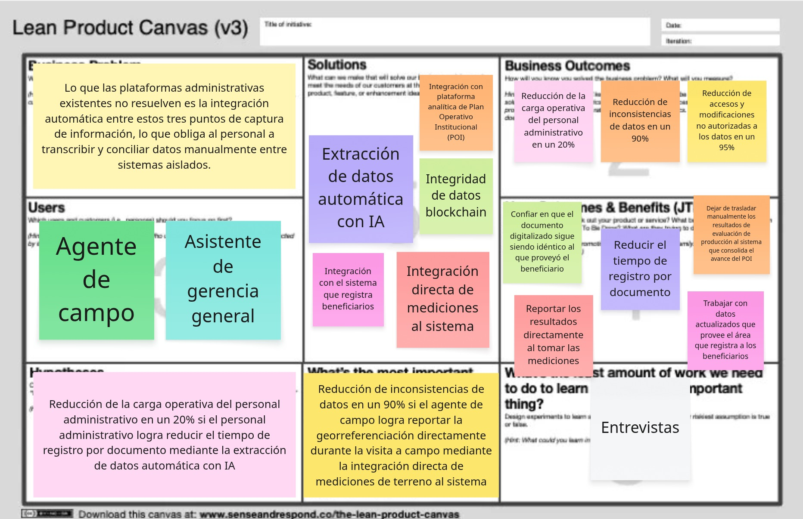

    

        
    

    
Universidad Peruana de Ciencias Aplicadas

    
Carrera de Ingeniería de Software

    <h2 style="font-size: 18px; margin: 15px 0 0 0;">ASI0728</h2>
    <h2 style="font-size: 18px; margin: 10px 0 10px 0;">Arquitecturas de Software Emergentes</h2>
    
NRC

    <h2 style="font-size: 18px; margin: 5px 0;">9075</h2>
    <h2 style="font-size: 18px; margin: 10px 0 5px 0;">Informe de Trabajo Final</h2>
    
Docente

    <h2 style="font-size: 18px; margin: 5px 0 40px 0;">Vega Calero, Wilder Aurelio</h2>
    
Equipo

    <h2 style="font-size: 18px; margin: 0px 0 40px 0;">Soulware</h2>
    
Proyecto

    <h2 style="font-size: 18px; margin: 0px 0 30px 0;">SGP</h2>
    
<strong>Integrantes:</strong>

    <table style="width: max-content; border-collapse: collapse; margin: 0 auto 50px auto;">
        <thead>
            <tr>
                <th style="border: 0px; text-align: left; padding: 5px 15px 5px 0;">Código</th>
                <th style="border: 0px; text-align: left; padding: 5px 0 5px 15px;">Apellidos y Nombres</th>
            </tr>
        </thead>
        <tbody>
            <tr>
                <td style="border: 0px; text-align: left; padding: 5px 15px 5px 0;">20221g120</td>
                <td style="border: 0px; text-align: left; padding: 5px 0 5px 15px;">Crispin Ramos, Daniel Franco</td>
            </tr>
            <tr>
                <td style="border: 0px; text-align: left; padding: 5px 15px 5px 0;">202310210</td>
                <td style="border: 0px; text-align: left; padding: 5px 0 5px 15px;">Esteban Roman, Henry Kalet</td>
            </tr>
            <tr>
                <td style="border: 0px; text-align: left; padding: 5px 15px 5px 0;">202220783</td>
                <td style="border: 0px; text-align: left; padding: 5px 0 5px 15px;">Orozco Torres, Álvaro Joaquín</td>
            </tr>
            <tr>
                <td style="border: 0px; text-align: left; padding: 5px 15px 5px 0;">20221e247</td>
                <td style="border: 0px; text-align: left; padding: 5px 0 5px 15px;">Reaño Delgadillo, Henry Paolo</td>
            </tr>
            <tr>
                <td style="border: 0px; text-align: left; padding: 5px 15px 5px 0;">20231a778</td>
                <td style="border: 0px; text-align: left; padding: 5px 0 5px 15px;">Vilca Saboya, Diego Alejandro</td>
            </tr>
        </tbody>
    </table>
    

        
Periodo 2620

    

# Registro de Versiones del Informe

# Project Report Collaboration Insights

# Contenido

- [Carátula](#carátula)
- [Registro de Versiones del Informe](#registro-de-versiones-del-informe)
- [Project Report Collaboration Insights](#project-report-collaboration-insights)
- [Student Outcome](#student-outcome)
- [Capítulo I: Introducción](#capítulo-i-introducción)
  - [Startup Profile](#startup-profile)
    - [Descripción de la Startup](#descripción-de-la-startup)
    - [Perfiles de integrantes del equipo](#perfiles-de-integrantes-del-equipo)
  - [Solution Profile](#solution-profile)
    - [Antecedentes y problemática](#antecedentes-y-problemática)
    - [Lean UX Process](#lean-ux-process)
      - [Lean UX Problem Statements](#lean-ux-problem-statements)
      - [Lean UX Assumptions](#lean-ux-assumptions)
      - [Lean UX Hypothesis Statements](#lean-ux-hypothesis-statements)
      - [Lean UX Canvas](#lean-ux-canvas)
  - [Segmentos objetivo](#segmentos-objetivo)
- [Capítulo II: Requirements Elicitation & Analysis](#capítulo-ii-requirements-elicitation--analysis)
  - [Competidores](#competidores)
    - [Análisis competitivo](#análisis-competitivo)
    - [Estrategias y tácticas frente a competidores](#estrategias-y-tácticas-frente-a-competidores)
  - [Entrevistas](#entrevistas)
    - [Diseño de entrevistas](#needfinding-diseno)
    - [Registro de entrevistas](#needfinding-registro)
    - [Análisis de entrevistas](#análisis-de-entrevistas)
  - [Needfinding](#needfinding)
    - [User Personas](#user-personas)
    - [User Task Matrix](#user-task-matrix)
    - [Empathy Mapping](#empathy-mapping)
    - [As-is Scenario Mapping](#as-is-scenario-mapping)
  - [Ubiquitous Language](#ubiquitous-language)
- [Capítulo III: Requirements Specification](#capítulo-iii-requirements-specification)
  - [To-Be Scenario Mapping](#to-be-scenario-mapping)
  - [User Stories](#user-stories)
  - [Impact Mapping](#impact-mapping)
  - [Product Backlog](#product-backlog)
- [Capítulo IV: Strategic-Level Software Design](#capítulo-iv-strategic-level-software-design)
  - [Strategic-Level Attribute-Driven Design](#strategic-level-attribute-driven-design)
    - [Design Purpose](#design-purpose)
    - [Attribute-Driven Design Inputs](#attribute-driven-design-inputs)
      - [Primary Functionality (Primary User Stories)](#primary-functionality-primary-user-stories)
      - [Quality attribute Scenarios](#quality-attribute-scenarios)
      - [Constraints](#constraints)
    - [Architectural Drivers Backlog](#architectural-drivers-backlog)
    - [Architectural Design Decisions](#architectural-design-decisions)
    - [Quality Attribute Scenario Refinements](#quality-attribute-scenario-refinements)
  - [Strategic-Level Domain-Driven Design](#strategic-level-domain-driven-design)
    - [EventStorming](#eventstorming)
    - [Candidate Context Discovery](#candidate-context-discovery)
    - [Domain Message Flows Modeling](#domain-message-flows-modeling)
    - [Bounded Context Canvases](#bounded-context-canvases)
    - [Context Mapping](#context-mapping)
  - [Software Architecture](#software-architecture)
    - [Software Architecture System Landscape Diagram](#software-architecture-system-landscape-diagram)
    - [Software Architecture Context Level Diagrams](#software-architecture-context-level-diagrams)
    - [Software Architecture Container Level Diagrams](#software-architecture-container-level-diagrams)
    - [Software Architecture Deployment Diagrams](#software-architecture-deployment-diagrams)
- [Conclusiones](#conclusiones)
  - [Conclusiones y recomendaciones](#conclusiones-y-recomendaciones)
  - [Video About-The-Team](#video-about-the-team)
- [Bibliografía](#bibliografía)
- [Anexos](#anexos)
  - [Videos de Exposiciones](#videos-de-exposiciones)

# Student Outcome

# Capítulo I: Introducción

## Startup Profile

### Descripción de la Startup

Soulware es una startup peruana dedicada al desarrollo de soluciones de software orientadas a la transformación digital de negocios y organizaciones. Su propuesta se enfoca en construir productos digitales que combinan un diseño centrado en el usuario con arquitecturas de software modernas, escalables y mantenibles.

El equipo está conformado por estudiantes de Ingeniería de Software que comparten el interés por aplicar tecnologías emergentes a problemas reales, trabajando bajo un enfoque ágil y colaborativo a lo largo de todo el ciclo de vida del producto, desde la investigación y el diseño hasta la implementación y el despliegue.

La visión de Soulware es convertirse en un referente en el desarrollo de soluciones innovadoras e inclusivas, generando valor tanto para los usuarios finales como para el negocio que las adopta, mediante productos digitales confiables y de buena calidad.

### Perfiles de integrantes del equipo

    <table style="width: 100%; border-collapse: collapse; border: 1px solid #333; table-layout: fixed;">
        <colgroup>
            <col style="width: 150px;">
            <col>
        </colgroup>
        <thead>
            <tr>
                <th style="border: 1px solid #333; padding: 8px 10px; text-align: left;">Foto</th>
                <th style="border: 1px solid #333; padding: 8px 10px; text-align: left;">Perfil</th>
            </tr>
        </thead>
        <tbody>
            <tr>
                <td style="border: 1px solid #333; padding: 10px; text-align: center; vertical-align: top;">
                    
                </td>
                <td style="border: 1px solid #333; padding: 10px; vertical-align: top;">
                    
<strong>Crispin Ramos, Daniel Franco</strong>

                    
Código: 20221g120

                    
Carrera: Ingeniería de Software

                    
Cuento con experiencia en Java y Angular para el desarrollo de aplicaciones, además de conocimientos en Domain-Driven Design y en el modelado y administración de bases de datos MySQL.

                </td>
            </tr>
            <tr>
                <td style="border: 1px solid #333; padding: 10px; text-align: center; vertical-align: top;">
                    
                </td>
                <td style="border: 1px solid #333; padding: 10px; vertical-align: top;">
                    
<strong>Esteban Roman, Henry Kalet</strong>

                    
Código: 202310210

                    
Carrera: Ingeniería de Software

                    
Cuento con conocimientos básicos en Java y C# para el desarrollo de aplicaciones.

                </td>
            </tr>
            <tr>
                <td style="border: 1px solid #333; padding: 10px; text-align: center; vertical-align: top;">
                    
                </td>
                <td style="border: 1px solid #333; padding: 10px; vertical-align: top;">
                    
<strong>Orozco Torres, Álvaro Joaquín</strong>

                    
Código: 202220783

                    
Carrera: Ingeniería de Software

                    
Cuento con experiencia en Java, PostgreSQL, JUnit, ArchUnit y Rust, además de conocimientos en diseño de servicios y APIs.

                </td>
            </tr>
            <tr>
                <td style="border: 1px solid #333; padding: 10px; text-align: center; vertical-align: top;">
                    
                </td>
                <td style="border: 1px solid #333; padding: 10px; vertical-align: top;">
                    
<strong>Reaño Delgadillo, Henry Paolo</strong>

                    
Código: 20221e247

                    
Carrera: Ingeniería de Software

                    
Cuento con experiencia en Java y React, además de conocimientos en Domain-Driven Design, JUnit y bases de datos Oracle.

                </td>
            </tr>
            <tr>
                <td style="border: 1px solid #333; padding: 10px; text-align: center; vertical-align: top;">
                    
                </td>
                <td style="border: 1px solid #333; padding: 10px; vertical-align: top;">
                    
<strong>Vilca Saboya, Diego Alejandro</strong>

                    
Código: 20231a778

                    
Carrera: Ingeniería de Software

                    
Cuento con experiencia en Java, Kotlin y React, además de conocimientos en Domain-Driven Design, bases de datos MySQL y JUnit.

                </td>
            </tr>
        </tbody>
    </table>

## Solution Profile

### Antecedentes y problemática

Una entidad pública de nuestro país gestiona un programa de apoyo agrícola mediante el cual entrega insumos a productores registrados para el cultivo de sus parcelas. Como en muchas entidades gubernamentales, sus procesos administrativos se apoyan en sistemas construidos en distintos momentos y para distintas necesidades puntuales, que hoy operan de forma aislada entre sí. Esta fragmentación obliga al personal a mover información de un sistema a otro de forma manual, en lugar de que los sistemas la compartan automáticamente.

La OCDE señala que, aunque la mayoría de sus países miembro ya cuentan con algún sistema de interoperabilidad de datos para el sector público, en promedio solo el 56% de las instituciones públicas que disponen de dicho sistema lo utilizan efectivamente para compartir información entre sí, y que la infraestructura digital de gobierno suele quedar subutilizada porque las inversiones no llegan a funcionar como un sistema integrado (OECD, 2026). En la misma línea, la falta de interoperabilidad entre plataformas de gobierno se traduce en procesos manuales y dependientes de papel que reducen la productividad del personal, generan brechas en los reportes y multiplican el trabajo de conciliar registros entre áreas (The Canton Group, 2025).

Ese patrón se repite en el programa que da origen a este proyecto, en tres frentes distintos. Primero, cuando un productor o una entidad externa presenta un documento en formato PDF, un funcionario administrativo debe leerlo y transcribir manualmente su contenido a la plataforma interna, en lugar de que el dato ingrese de forma automática. Segundo, cuando un agente de campo registra la ubicación de las parcelas de los productores con un dispositivo GNSS para construir la geomalla del programa, esa información de georreferenciación no siempre queda enlazada de forma directa con el registro administrativo del productor y su parcela. Tercero, los productores beneficiarios envían periódicamente un reporte en PDF sobre la producción obtenida en su parcela registrada, reporte que hoy también depende de una revisión y un traslado manual de datos para quedar asociado al historial de esa parcela.

Enunciado del problema: la ausencia de un mecanismo que integre automáticamente la información proveniente de documentos PDF y de los registros de georreferenciación de campo con la plataforma administrativa del programa obliga al personal a transcribir y conciliar datos de forma manual, lo que ralentiza el proceso, consume tiempo del personal y del productor, e introduce riesgo de error humano en el registro de la información.

    <table style="width: 100%; border-collapse: collapse; border: 1px solid #333; table-layout: fixed;">
        <colgroup>
            <col style="width: 150px;">
            <col>
        </colgroup>
        <thead>
            <tr>
                <th style="border: 1px solid #333; padding: 8px 10px; text-align: left;">Pregunta</th>
                <th style="border: 1px solid #333; padding: 8px 10px; text-align: left;">Respuesta</th>
            </tr>
        </thead>
        <tbody>
            <tr>
                <td style="border: 1px solid #333; padding: 10px; vertical-align: top;"><strong>Who</strong> ¿Quién?</td>
                <td style="border: 1px solid #333; padding: 10px; vertical-align: top;">Las personas que proporcionan el documento PDF con su información, y los funcionarios administrativos encargados de leer dicho documento y registrar sus datos en la plataforma destino.</td>
            </tr>
            <tr>
                <td style="border: 1px solid #333; padding: 10px; vertical-align: top;"><strong>What</strong> ¿Qué?</td>
                <td style="border: 1px solid #333; padding: 10px; vertical-align: top;">La lentitud de los procesos administrativos que se origina cuando un funcionario debe leer manualmente un documento PDF para trasladar su información a otra plataforma.</td>
            </tr>
            <tr>
                <td style="border: 1px solid #333; padding: 10px; vertical-align: top;"><strong>Where</strong> ¿Dónde?</td>
                <td style="border: 1px solid #333; padding: 10px; vertical-align: top;">En organizaciones cuyos procesos administrativos reciben documentación en formato PDF como insumo de entrada para el registro de información en un sistema propio.</td>
            </tr>
            <tr>
                <td style="border: 1px solid #333; padding: 10px; vertical-align: top;"><strong>When</strong> ¿Cuándo?</td>
                <td style="border: 1px solid #333; padding: 10px; vertical-align: top;">Cada vez que se recibe un documento PDF que debe registrarse en la plataforma destino, lo que ocurre de forma recurrente dentro del flujo diario de trabajo administrativo.</td>
            </tr>
            <tr>
                <td style="border: 1px solid #333; padding: 10px; vertical-align: top;"><strong>Why</strong> ¿Por qué?</td>
                <td style="border: 1px solid #333; padding: 10px; vertical-align: top;">Porque no existe un mecanismo que extraiga automáticamente los datos del documento PDF hacia la plataforma destino, por lo que el funcionario debe leer el documento e identificar la información relevante antes de registrarla.</td>
            </tr>
            <tr>
                <td style="border: 1px solid #333; padding: 10px; vertical-align: top;"><strong>How</strong> ¿Cómo?</td>
                <td style="border: 1px solid #333; padding: 10px; vertical-align: top;">El funcionario abre el documento PDF, ubica los campos de información requeridos y los transcribe manualmente, uno por uno, en la plataforma destino.</td>
            </tr>
            <tr>
                <td style="border: 1px solid #333; padding: 10px; vertical-align: top;"><strong>How Much</strong> ¿Cuánto?</td>
                <td style="border: 1px solid #333; padding: 10px; vertical-align: top;">El impacto se refleja en el tiempo que cada funcionario dedica a la lectura y transcripción manual de cada documento, tiempo que se multiplica por el volumen de documentos procesados y que además introduce riesgo de error humano en el registro de los datos.</td>
            </tr>
        </tbody>
    </table>

### Lean UX Process

#### Lean UX Problem Statements

El estado actual de la gestión administrativa de programas públicos de apoyo agrícola se ha enfocado principalmente en el funcionamiento individual de flujos de usuario, sin generar una integración completa.

Lo que las plataformas administrativas existentes no resuelven es la integración automática entre estos tres puntos de captura de información, lo que obliga al personal a transcribir y conciliar datos manualmente entre sistemas aislados.

#### Lean UX Assumptions

Business outcomes:
- Reducción del personal administrativo en un 20%.
- Reducción de inconsistencias de datos en un 90%.
- Reducción de accesos y modificaciones no autorizadas a los datos en un 95%.
- Reducción de pérdida de datos en un 95%.

Users:
- Personal administrativo.
- Productor beneficiario.
- Agente de campo georreferenciador.

Solutions / features:
- Extracción de datos automática con IA.
- Subida y almacenamiento  de archivos en la nube.
- Integración directa de mediciones al sistema.
- Integridad de datos blockchain.

User outcomes:
- Reducir el tiempo de registro por documento.
- Confiar de forma inequívoca que su reporte fue recibido.
- Reportar los resultados directamente al tomar las mediciones.
- Confíar plenamente en que el documento es el mismo proveído por el beneficiario.

#### Lean UX Hypothesis Statements

- Reducción del personal administrativo en un 20% si el personal administrativo logra reducir el tiempo de registro por documento mediante la extracción de datos automática con IA.

- Reducción de pérdida de datos en un 95% si el productor beneficiario logra confiar de forma inequívoca que su reporte fue recibido mediante la subida y almacenamiento de archivos en la nube.

- Reducción de inconsistencias de datos en un 90% si el agente de campo georreferenciador logra reportar los resultados directamente al tomar las mediciones mediante la integración directa de mediciones al sistema.

- Reducción de accesos y modificaciones no autorizadas a los datos en un 95% si el personal administrativo logra confiar plenamente en que el documento es el mismo proveído por el beneficiario mediante la integridad de datos blockchain.

#### Lean UX Canvas

El siguiente lienzo resume el proceso Lean UX: el problema de negocio, los resultados esperados, los usuarios, la solución propuesta y las hipótesis que la sustentan.

## Segmentos objetivo

El dominio del problema involucra tres segmentos, todos vinculados al mismo programa público de apoyo agrícola.

**Funcionario administrativo**
Recibe los documentos PDF del programa y registra su contenido en la plataforma interna.
- Personal permanente de la entidad.
- Maneja herramientas ofimáticas básicas.
- Sin formación técnica en sistemas necesariamente.

**Agente de campo georreferenciador**
Recorre las parcelas y captura sus coordenadas con un dispositivo GNSS para construir la geomalla del programa.
- El mapeo con GNSS reduce el levantamiento de una parcela de días a horas frente al método tradicional (Burch, 2016).
- Práctica extendida entre agrimensores y agricultores para digitalizar y verificar el uso del suelo (Burch, 2016).

**Productor beneficiario**
Recibe insumos del programa y reporta periódicamente en PDF la producción obtenida de su parcela.
- Segmento numeroso y disperso geográficamente, con acceso desigual a conectividad y herramientas digitales.
- Suele interactuar con múltiples plataformas desconectadas entre sí, cada una con su propio registro (IFPRI, 2025).
- Un registro único de productores, enlazado con insumos y resultados, es clave para resolver esa fragmentación (World Bank, 2025).

# Capítulo II: Requirements Elicitation & Analysis

## Competidores

### Análisis competitivo

### Estrategias y tácticas frente a competidores

## Entrevistas

<h3 id="needfinding-diseno">Diseño de entrevistas</h3>

<h3 id="needfinding-registro">Registro de entrevistas</h3>

### Análisis de entrevistas

## Needfinding

### User Personas

### User Task Matrix

### Empathy Mapping

### As-is Scenario Mapping

## Ubiquitous Language

# Capítulo III: Requirements Specification

## To-Be Scenario Mapping

## User Stories

## Impact Mapping

## Product Backlog

# Capítulo IV: Strategic-Level Software Design

## Strategic-Level Attribute-Driven Design

### Design Purpose

### Attribute-Driven Design Inputs

#### Primary Functionality (Primary User Stories)

#### Quality attribute Scenarios

#### Constraints

### Architectural Drivers Backlog

### Architectural Design Decisions

### Quality Attribute Scenario Refinements

## Strategic-Level Domain-Driven Design

### EventStorming

### Candidate Context Discovery

### Domain Message Flows Modeling

### Bounded Context Canvases

### Context Mapping

## Software Architecture

### Software Architecture System Landscape Diagram

### Software Architecture Context Level Diagrams

### Software Architecture Container Level Diagrams

### Software Architecture Deployment Diagrams

# Conclusiones

## Conclusiones y recomendaciones

## Video About-The-Team

# Bibliografía

Burch, T. (2016, January 6). *Data is the crop: GNSS used by surveyors and farmers*. GPS World. https://www.gpsworld.com/data-is-the-crop-gnss-used-by-surveyors-and-farmers/

International Food Policy Research Institute. (2025, December 2). *Beyond the algorithm: The need for farmer participation and data justice in digital agricultural technology*. IFPRI Blog. https://www.ifpri.org/blog/beyond-the-algorithm-the-need-for-farmer-participation-and-data-justice-in-digital-agricultural-technology/

OECD. (2026). *Digital governments at a turning point*. In *Digital Government Outlook 2026*. OECD Publishing. https://www.oecd.org/en/publications/digital-government-outlook_0496b2bc-en/full-report/digital-governments-at-a-turning-point_0491aad4.html

The Canton Group. (2025, June 9). *Breaking down silos: Why government IT systems need interoperability for digital transformation*. https://cantongroup.com/insights/breaking-down-silos-why-government-it-systems-need-interoperability-digital-transformation

World Bank. (2025, October 22). *A journey of a thousand miles begins with a single step: How Malawi's reform is just the beginning for smallholder farmers*. https://www.worldbank.org/en/news/feature/2025/10/21/how-malawi-s-reform-is-just-the-beginning-for-smallholder-farmers

# Anexos

## Videos de Exposiciones

