

    

        
    

    
Universidad Peruana de Ciencias Aplicadas

    
Carrera de Ingeniería de Software

    <h2 style="font-size: 18px; margin: 15px 0 0 0;">ASI0728</h2>
    <h2 style="font-size: 18px; margin: 10px 0 10px 0;">Arquitecturas de Software Emergentes</h2>
    
NRC

    <h2 style="font-size: 18px; margin: 5px 0;">9075</h2>
    <h2 style="font-size: 18px; margin: 10px 0 5px 0;">Informe de Trabajo Final</h2>
    
Docente

    <h2 style="font-size: 18px; margin: 5px 0 40px 0;">Vega Calero, Wilder Aurelio</h2>
    
Equipo

    <h2 style="font-size: 18px; margin: 0px 0 40px 0;">Soulware</h2>
    
Proyecto

    <h2 style="font-size: 18px; margin: 0px 0 30px 0;">SGT</h2>
    
<strong>Integrantes:</strong>

    <table style="width: max-content; border-collapse: collapse; margin: 0 auto 50px auto;">
        <thead>
            <tr>
                <th style="border: 0px; text-align: left; padding: 5px 15px 5px 0;">Código</th>
                <th style="border: 0px; text-align: left; padding: 5px 0 5px 15px;">Apellidos y Nombres</th>
            </tr>
        </thead>
        <tbody>
            <tr>
                <td style="border: 0px; text-align: left; padding: 5px 15px 5px 0;">20221g120</td>
                <td style="border: 0px; text-align: left; padding: 5px 0 5px 15px;">Crispin Ramos, Daniel Franco</td>
            </tr>
            <tr>
                <td style="border: 0px; text-align: left; padding: 5px 15px 5px 0;">202310210</td>
                <td style="border: 0px; text-align: left; padding: 5px 0 5px 15px;">Esteban Roman, Henry Kalet</td>
            </tr>
            <tr>
                <td style="border: 0px; text-align: left; padding: 5px 15px 5px 0;">202220783</td>
                <td style="border: 0px; text-align: left; padding: 5px 0 5px 15px;">Orozco Torres, Álvaro Joaquín</td>
            </tr>
            <tr>
                <td style="border: 0px; text-align: left; padding: 5px 15px 5px 0;">20221e247</td>
                <td style="border: 0px; text-align: left; padding: 5px 0 5px 15px;">Reaño Delgadillo, Henry Paolo</td>
            </tr>
            <tr>
                <td style="border: 0px; text-align: left; padding: 5px 15px 5px 0;">20231a778</td>
                <td style="border: 0px; text-align: left; padding: 5px 0 5px 15px;">Vilca Saboya, Diego Alejandro</td>
            </tr>
        </tbody>
    </table>
    

        
Periodo 2620

    

# Registro de Versiones del Informe

Esta sección resume las modificaciones relevantes realizadas al informe durante el ciclo de vida del proyecto. Cada versión corresponde a la incorporación, corrección o mejora de una o más secciones, y todas las registradas a la fecha forman parte del avance hacia la entrega TB1.

    <table style="width: 100%; border-collapse: collapse; border: 1px solid #333;">
        <thead>
            <tr>
                <th style="border: 1px solid #333; padding: 8px 10px; text-align: left;">Versión</th>
                <th style="border: 1px solid #333; padding: 8px 10px; text-align: left;">Fecha</th>
                <th style="border: 1px solid #333; padding: 8px 10px; text-align: left;">Autor</th>
                <th style="border: 1px solid #333; padding: 8px 10px; text-align: left;">Descripción de modificación</th>
            </tr>
        </thead>
        <tbody>
            <tr>
                <td style="border: 1px solid #333; padding: 10px; vertical-align: top; text-align: left;">1.0.0</td>
                <td style="border: 1px solid #333; padding: 10px; vertical-align: top; text-align: left;">2026-09-20</td>
                <td style="border: 1px solid #333; padding: 10px; vertical-align: top; text-align: left;">Crispin Ramos, Daniel Franco Esteban Román, Henry Kalet Orozco Torres, Álvaro Joaquín Reaño Delgadillo, Henry Paolo Vilca Saboya, Diego Alejandro</td>
                <td style="border: 1px solid #333; padding: 10px; vertical-align: top; text-align: left;">Versión inicial del informe para la entrega TB1. Estructura base del repositorio, configuración de mdm y del workflow de CI. Carátula Registro de Versiones del Informe Project Report Collaboration Insights Student Outcome Capítulo I: Introducción - Startup Profile - Solution Profile: antecedentes y problemática bajo 5W+2H, Lean UX Process - Segmentos objetivo Capítulo II: Requirements Elicitation & Analysis - Competidores - Entrevistas: diseño, registro y análisis - Needfinding: User Personas, User Task Matrix, Empathy Mapping y As-Is Scenario Mapping - Ubiquitous Language Capítulo III: Requirements Specification - To-Be Scenario Mapping - User Stories - Impact Mapping - Product Backlog Capítulo IV: Strategic-Level Software Design - Attribute-Driven Design - Strategic-Level Domain-Driven Design - Software Architecture Conclusiones Bibliografía</td>
            </tr>
        </tbody>
    </table>

# Project Report Collaboration Insights

URL del repositorio para el Project Report: [https://github.com/Soulware-Emergentes/report](https://github.com/Soulware-Emergentes/report)

Se utilizó GitHub como plataforma de control de versiones y colaboración en equipo, dentro de la organización pública Soulware-Emergentes. Se siguió el flujo de trabajo GitFlow con las ramas principales main y develop, y ramas de trabajo por capítulo y por sección para cada contribución individual, que se integran a develop mediante pull request. El documento combinado se genera automáticamente desde las secciones en Markdown, de modo que ningún integrante lo edita a mano y los conflictos se reducen a la sección que cada uno está redactando.

Los integrantes del equipo y sus nombres de usuario en GitHub son los siguientes:

    <table style="width: 100%; border-collapse: collapse; border: 1px solid #333;">
        <thead>
            <tr>
                <th style="border: 1px solid #333; padding: 8px 10px; text-align: left;">Integrante</th>
                <th style="border: 1px solid #333; padding: 8px 10px; text-align: left;">Código</th>
                <th style="border: 1px solid #333; padding: 8px 10px; text-align: left;">Nombre en GitHub</th>
            </tr>
        </thead>
        <tbody>
            <tr>
                <td style="border: 1px solid #333; padding: 10px; vertical-align: top; text-align: left;">Crispin Ramos, Daniel Franco</td>
                <td style="border: 1px solid #333; padding: 10px; vertical-align: top; text-align: left;">20221g120</td>
                <td style="border: 1px solid #333; padding: 10px; vertical-align: top; text-align: left;">danielcr04</td>
            </tr>
            <tr>
                <td style="border: 1px solid #333; padding: 10px; vertical-align: top; text-align: left;">Esteban Román, Henry Kalet</td>
                <td style="border: 1px solid #333; padding: 10px; vertical-align: top; text-align: left;">202310210</td>
                <td style="border: 1px solid #333; padding: 10px; vertical-align: top; text-align: left;">kalet123-commit</td>
            </tr>
            <tr>
                <td style="border: 1px solid #333; padding: 10px; vertical-align: top; text-align: left;">Orozco Torres, Álvaro Joaquín</td>
                <td style="border: 1px solid #333; padding: 10px; vertical-align: top; text-align: left;">202220783</td>
                <td style="border: 1px solid #333; padding: 10px; vertical-align: top; text-align: left;">overGDev</td>
            </tr>
            <tr>
                <td style="border: 1px solid #333; padding: 10px; vertical-align: top; text-align: left;">Reaño Delgadillo, Henry Paolo</td>
                <td style="border: 1px solid #333; padding: 10px; vertical-align: top; text-align: left;">20221e247</td>
                <td style="border: 1px solid #333; padding: 10px; vertical-align: top; text-align: left;">PaoloHRRR</td>
            </tr>
            <tr>
                <td style="border: 1px solid #333; padding: 10px; vertical-align: top; text-align: left;">Vilca Saboya, Diego Alejandro</td>
                <td style="border: 1px solid #333; padding: 10px; vertical-align: top; text-align: left;">20231a778</td>
                <td style="border: 1px solid #333; padding: 10px; vertical-align: top; text-align: left;">diesoks</td>
            </tr>
        </tbody>
    </table>

**TB1**

Tareas asignadas

Para el desarrollo del TB1, cada participante del equipo realizó las siguientes tareas:

    <table style="width: 100%; border-collapse: collapse; border: 1px solid #333;">
        <thead>
            <tr>
                <th style="border: 1px solid #333; padding: 8px 10px; text-align: left;">Integrante</th>
                <th style="border: 1px solid #333; padding: 8px 10px; text-align: left;">Tareas asignadas</th>
            </tr>
        </thead>
        <tbody>
            <tr>
                <td style="border: 1px solid #333; padding: 10px; vertical-align: top; text-align: left;">Crispin Ramos, Daniel Franco</td>
                <td style="border: 1px solid #333; padding: 10px; vertical-align: top; text-align: left;">Capítulo III: To-Be Scenario Mapping para ambos User Persona, con la elaboración de los mapas y su redacción comparativa frente al As-Is. Impact Mapping, incluyendo la formulación de los objetivos SMART y la vinculación de cada rama con sus User Stories. Actualización de los identificadores de User Story referenciados en el Impact Mapping.</td>
            </tr>
            <tr>
                <td style="border: 1px solid #333; padding: 10px; vertical-align: top; text-align: left;">Esteban Román, Henry Kalet</td>
                <td style="border: 1px solid #333; padding: 10px; vertical-align: top; text-align: left;">Capítulo II: diseño de entrevistas para ambos segmentos, registro de las seis entrevistas con sus fichas completas y análisis de entrevistas con el sustento estadístico por segmento. Incorporación de los datos reales de los entrevistados, enlaces de video, timing y capturas. Registro de Versiones del Informe, Project Report Collaboration Insights y Student Outcome.</td>
            </tr>
            <tr>
                <td style="border: 1px solid #333; padding: 10px; vertical-align: top; text-align: left;">Orozco Torres, Álvaro Joaquín</td>
                <td style="border: 1px solid #333; padding: 10px; vertical-align: top; text-align: left;">Estructura base del repositorio, configuración de mdm y del workflow de CI. Carátula, perfiles del equipo y descripción de la startup. Capítulo I: Solution Profile y Segmentos objetivo. Capítulo II: análisis competitivo y estrategias frente a competidores. Capítulo III: User Stories y Product Backlog. Capítulo IV: Architectural Drivers Backlog, Architectural Design Decisions y Quality Attribute Scenario Refinements. Conclusiones y bibliografía.</td>
            </tr>
            <tr>
                <td style="border: 1px solid #333; padding: 10px; vertical-align: top; text-align: left;">Reaño Delgadillo, Henry Paolo</td>
                <td style="border: 1px solid #333; padding: 10px; vertical-align: top; text-align: left;">Capítulo IV: primera versión del Attribute-Driven Design con el Design Purpose y sus inputs. Strategic-Level Domain-Driven Design completo, incluyendo EventStorming, Candidate Context Discovery, Domain Message Flows Modeling, Bounded Context Canvases y Context Mapping. Software Architecture con los diagramas de System Landscape, Context, Container y Deployment.</td>
            </tr>
            <tr>
                <td style="border: 1px solid #333; padding: 10px; vertical-align: top; text-align: left;">Vilca Saboya, Diego Alejandro</td>
                <td style="border: 1px solid #333; padding: 10px; vertical-align: top; text-align: left;">Capítulo II: Needfinding completo, con la elaboración de las fichas de User Persona, el User Task Matrix, los Empathy Maps y los As-Is Scenario Mapping para ambos segmentos. Ubiquitous Language con los términos del dominio del programa de apoyo agrícola.</td>
            </tr>
        </tbody>
    </table>

GitHub Collaboration Insights

Para el TB1 el equipo trabajó en la organización [https://github.com/Soulware-Emergentes](https://github.com/Soulware-Emergentes), que contiene el repositorio report con el informe del proyecto, gestionado con el flujo GitFlow y ramas de trabajo por sección para cada integrante.

Gráfico de commits por integrante durante TB1:

Gráfico de red (network graph) de ramas en el repositorio durante TB1:

Contribuciones de los integrantes durante TB1:

# Contenido

- [Carátula](#carátula)
- [Registro de Versiones del Informe](#registro-de-versiones-del-informe)
- [Project Report Collaboration Insights](#project-report-collaboration-insights)
- [Student Outcome](#student-outcome)
- [Capítulo I: Introducción](#capítulo-i-introducción)
  - [Startup Profile](#startup-profile)
    - [Descripción de la Startup](#descripción-de-la-startup)
    - [Perfiles de integrantes del equipo](#perfiles-de-integrantes-del-equipo)
  - [Solution Profile](#solution-profile)
    - [Antecedentes y problemática](#antecedentes-y-problemática)
    - [Lean UX Process](#lean-ux-process)
      - [Lean UX Problem Statements](#lean-ux-problem-statements)
      - [Lean UX Assumptions](#lean-ux-assumptions)
      - [Lean UX Hypothesis Statements](#lean-ux-hypothesis-statements)
      - [Lean UX Canvas](#lean-ux-canvas)
  - [Segmentos objetivo](#segmentos-objetivo)
- [Capítulo II: Requirements Elicitation & Analysis](#capítulo-ii-requirements-elicitation--analysis)
  - [Competidores](#competidores)
    - [Análisis competitivo](#análisis-competitivo)
    - [Estrategias y tácticas frente a competidores](#estrategias-y-tácticas-frente-a-competidores)
  - [Entrevistas](#entrevistas)
    - [Diseño de entrevistas](#needfinding-diseno)
    - [Registro de entrevistas](#needfinding-registro)
    - [Análisis de entrevistas](#análisis-de-entrevistas)
  - [Needfinding](#needfinding)
    - [User Personas](#user-personas)
    - [User Task Matrix](#user-task-matrix)
    - [Empathy Mapping](#empathy-mapping)
    - [As-is Scenario Mapping](#as-is-scenario-mapping)
  - [Ubiquitous Language](#ubiquitous-language)
- [Capítulo III: Requirements Specification](#capítulo-iii-requirements-specification)
  - [To-Be Scenario Mapping](#to-be-scenario-mapping)
  - [User Stories](#user-stories)
  - [Impact Mapping](#impact-mapping)
  - [Product Backlog](#product-backlog)
- [Capítulo IV: Strategic-Level Software Design](#capítulo-iv-strategic-level-software-design)
  - [Strategic-Level Attribute-Driven Design](#strategic-level-attribute-driven-design)
    - [Design Purpose](#design-purpose)
    - [Attribute-Driven Design Inputs](#attribute-driven-design-inputs)
      - [Primary Functionality (Primary User Stories)](#primary-functionality-primary-user-stories)
      - [Quality attribute Scenarios](#quality-attribute-scenarios)
      - [Constraints](#constraints)
    - [Architectural Drivers Backlog](#architectural-drivers-backlog)
    - [Architectural Design Decisions](#architectural-design-decisions)
    - [Quality Attribute Scenario Refinements](#quality-attribute-scenario-refinements)
  - [Strategic-Level Domain-Driven Design](#strategic-level-domain-driven-design)
    - [EventStorming](#eventstorming)
    - [Candidate Context Discovery](#candidate-context-discovery)
    - [Domain Message Flows Modeling](#domain-message-flows-modeling)
    - [Bounded Context Canvases](#bounded-context-canvases)
    - [Context Mapping](#context-mapping)
  - [Software Architecture](#software-architecture)
    - [Software Architecture System Landscape Diagram](#software-architecture-system-landscape-diagram)
    - [Software Architecture Context Level Diagrams](#software-architecture-context-level-diagrams)
    - [Software Architecture Container Level Diagrams](#software-architecture-container-level-diagrams)
    - [Software Architecture Deployment Diagrams](#software-architecture-deployment-diagrams)
- [Conclusiones](#conclusiones)
  - [Conclusiones y recomendaciones](#conclusiones-y-recomendaciones)
- [Bibliografía](#bibliografía)
- [Anexos](#anexos)
  - [Videos de Exposiciones](#videos-de-exposiciones)

# Student Outcome

El curso contribuye al cumplimiento del Student Outcome ABET: ABET – EAC - Student Outcome 3

Criterio: Capacidad de comunicarse efectivamente con un rango de audiencias.

En el siguiente cuadro se describe las acciones realizadas y enunciados de conclusiones por parte del grupo, que permiten sustentar el haber alcanzado el logro del ABET – EAC - Student Outcome 3.

<table style="width: 100%; border-collapse: collapse; border: 1px solid #333; font-family: Arial, sans-serif; font-size: 14px;">
    <thead>
        <tr>
            <th style="border: 1px solid #333; padding: 8px 10px; text-align: left; width: 18%;">Criterio específico</th>
            <th style="border: 1px solid #333; padding: 8px 10px; text-align: left; width: 52%;">Acciones realizadas</th>
            <th style="border: 1px solid #333; padding: 8px 10px; text-align: left; width: 30%;">Conclusiones</th>
        </tr>
    </thead>
    <tbody>
        <tr>
            <td style="border: 1px solid #333; padding: 10px; vertical-align: top;">3.c1. Comunica oralmente sus ideas y/o resultados con objetividad a público de diferentes especialidades y niveles jerárquicos, en el marco del desarrollo de un proyecto en ingeniería.</td>
            <td style="border: 1px solid #333; padding: 10px; vertical-align: top;">
                
<strong>Crispin Ramos, Daniel Franco</strong> 
                TB1: Condujo la sesión de trabajo en la que el equipo revisó el As-Is de cada User Persona y acordó las fases del To-Be, explicando ante integrantes con distinto grado de conocimiento del dominio por qué cada cambio respondía a una frustración concreta levantada en campo. Expuso el Impact Mapping al equipo y sustentó oralmente la formulación de los objetivos SMART y su trazabilidad hasta las User Stories.

                
<strong>Esteban Román, Henry Kalet</strong> 
                TB1: Condujo las seis entrevistas de Needfinding ante representantes de dos segmentos sin formación técnica en sistemas, adaptando el lenguaje para evitar terminología de ingeniería y apoyándose en el relato de casos concretos en lugar de preguntas abstractas. Presentó al equipo el análisis de entrevistas y comunicó los dos hallazgos que modificaban el alcance del proyecto.

                
<strong>Orozco Torres, Álvaro Joaquín</strong> 
                TB1: Explicó al equipo el flujo de trabajo GitFlow y el funcionamiento del generador del documento, dirigiéndose a integrantes con distinto nivel de familiaridad con control de versiones. Sustentó oralmente las decisiones de diseño arquitectónico frente a los drivers de mayor impacto, contrastando ante el equipo los patrones alternativos evaluados y los criterios que llevaron a descartarlos.

                
<strong>Reaño Delgadillo, Henry Paolo</strong> 
                TB1: Facilitó la sesión de EventStorming, guiando al equipo por los nueve pasos desde la identificación de eventos hasta la delimitación de los bounded contexts, y traduciendo conceptos de Domain-Driven Design a un lenguaje comprensible para integrantes con distinto grado de experiencia. Explicó los diagramas C4 relacionando el despliegue on-premise con la restricción institucional levantada en las entrevistas.

                
<strong>Vilca Saboya, Diego Alejandro</strong> 
                TB1: Condujo las sesiones de elaboración de Empathy Maps y As-Is Scenario Mapping, moderando los aportes individuales y consolidando las observaciones del equipo en un solo lienzo por User Persona. Presentó el User Task Matrix explicando la distinción entre las tareas que el segmento realiza con o sin software y las funcionalidades del producto.

            </td>
            <td style="border: 1px solid #333; padding: 10px; vertical-align: top;">
                
<strong>Conclusiones TB1:</strong> Durante el TB1 el equipo comprobó que la comunicación oral fue determinante en dos momentos distintos: la recolección de información con usuarios ajenos al dominio técnico y la construcción colectiva de los artefactos de diseño. Las entrevistas obligaron a adaptar el lenguaje al del entrevistado, quien describe su trabajo en términos de fichas, sacos y visitas y no de sistemas o integraciones. Las sesiones de EventStorming y de mapeo de escenarios exigieron lo contrario, que cada integrante explicara su razonamiento técnico ante compañeros con distinto grado de conocimiento del dominio. El resultado fue que decisiones como la delimitación de los bounded contexts o la priorización del Product Backlog se tomaron con acuerdo explícito del equipo y no por imposición de quien redactaba la sección.

            </td>
        </tr>
        <tr>
            <td style="border: 1px solid #333; padding: 10px; vertical-align: top;">3.c2. Comunica en forma escrita ideas y/o resultados con objetividad a público de diferentes especialidades y niveles jerárquicos, en el marco del desarrollo de un proyecto en ingeniería.</td>
            <td style="border: 1px solid #333; padding: 10px; vertical-align: top;">
                
<strong>Crispin Ramos, Daniel Franco</strong> 
                TB1: Redactó las secciones de To-Be Scenario Mapping e Impact Mapping, describiendo por escrito el contraste entre el escenario actual y el propuesto para cada User Persona. Documentó los objetivos SMART indicando la mejora medible, la línea base y el plazo, de modo que un lector externo pueda verificar cómo se evaluará el resultado.

                
<strong>Esteban Román, Henry Kalet</strong> 
                TB1: Redactó el diseño, el registro y el análisis de entrevistas del Capítulo II, incluyendo las seis fichas de entrevistado con su resumen descriptivo y el análisis con sustento estadístico por segmento. Elaboró el Registro de Versiones del Informe, el Project Report Collaboration Insights y la presente sección de Student Outcome.

                
<strong>Orozco Torres, Álvaro Joaquín</strong> 
                TB1: Redactó el Solution Profile con la problemática estructurada bajo 5W+2H, el análisis competitivo, las User Stories con criterios de aceptación en formato Gherkin, el Architectural Drivers Backlog, las Architectural Design Decisions y las conclusiones. Documentó además las convenciones de trabajo del repositorio para que el equipo pudiera seguirlas sin asistencia.

                
<strong>Reaño Delgadillo, Henry Paolo</strong> 
                TB1: Redactó el Capítulo IV en sus componentes de Domain-Driven Design y Software Architecture, explicando por escrito el proceso de EventStorming paso a paso, los flujos de mensajes entre contextos, los patrones de Context Mapping aplicados y la lectura de cada diagrama C4 para un lector que no participó en su elaboración.

                
<strong>Vilca Saboya, Diego Alejandro</strong> 
                TB1: Redactó las secciones de Needfinding, describiendo el proceso seguido para elaborar cada artefacto y el análisis de las tareas de mayor frecuencia e importancia. Elaboró el Ubiquitous Language definiendo los términos del dominio en inglés con su equivalente en español, de modo que el vocabulario sea común entre el equipo y los stakeholders del programa.

            </td>
            <td style="border: 1px solid #333; padding: 10px; vertical-align: top;">
                
<strong>Conclusiones TB1:</strong> La redacción del informe se realizó de forma distribuida sobre un mismo documento, lo que obligó al equipo a acordar convenciones comunes de estilo y estructura desde el inicio en lugar de uniformizar al final. El trabajo por secciones independientes bajo control de versiones permitió que cinco personas escribieran en paralelo manteniendo un registro auditable de quién redactó cada parte y cuándo. El equipo también constató que escribir para un lector externo exige un nivel de precisión distinto al de la conversación interna: afirmaciones que en una reunión se daban por entendidas tuvieron que sustentarse en una cita bibliográfica, en una respuesta concreta de entrevista o en una decisión de diseño documentada con sus alternativas.

            </td>
        </tr>
    </tbody>
</table>

# Capítulo I: Introducción

## Startup Profile

### Descripción de la Startup

Soulware es una startup peruana dedicada al desarrollo de soluciones de software orientadas a la transformación digital de negocios y organizaciones. Su propuesta se enfoca en construir productos digitales que combinan un diseño centrado en el usuario con arquitecturas de software modernas, escalables y mantenibles.

El equipo está conformado por estudiantes de Ingeniería de Software que comparten el interés por aplicar tecnologías emergentes a problemas reales, trabajando bajo un enfoque ágil y colaborativo a lo largo de todo el ciclo de vida del producto, desde la investigación y el diseño hasta la implementación y el despliegue.

La visión de Soulware es convertirse en un referente en el desarrollo de soluciones innovadoras e inclusivas, generando valor tanto para los usuarios finales como para el negocio que las adopta, mediante productos digitales confiables y de buena calidad.

### Perfiles de integrantes del equipo

    <table style="width: 100%; border-collapse: collapse; border: 1px solid #333; table-layout: fixed;">
        <colgroup>
            <col style="width: 150px;">
            <col>
        </colgroup>
        <thead>
            <tr>
                <th style="border: 1px solid #333; padding: 8px 10px; text-align: left;">Foto</th>
                <th style="border: 1px solid #333; padding: 8px 10px; text-align: left;">Perfil</th>
            </tr>
        </thead>
        <tbody>
            <tr>
                <td style="border: 1px solid #333; padding: 10px; text-align: center; vertical-align: top;">
                    
                </td>
                <td style="border: 1px solid #333; padding: 10px; vertical-align: top;">
                    
<strong>Crispin Ramos, Daniel Franco</strong>

                    
Código: 20221g120

                    
Carrera: Ingeniería de Software

                    
Cuento con experiencia en Java y Angular para el desarrollo de aplicaciones, además de conocimientos en Domain-Driven Design y en el modelado y administración de bases de datos MySQL.

                </td>
            </tr>
            <tr>
                <td style="border: 1px solid #333; padding: 10px; text-align: center; vertical-align: top;">
                    
                </td>
                <td style="border: 1px solid #333; padding: 10px; vertical-align: top;">
                    
<strong>Esteban Roman, Henry Kalet</strong>

                    
Código: 202310210

                    
Carrera: Ingeniería de Software

                    
Cuento con conocimientos básicos en Java y C# para el desarrollo de aplicaciones.

                </td>
            </tr>
            <tr>
                <td style="border: 1px solid #333; padding: 10px; text-align: center; vertical-align: top;">
                    
                </td>
                <td style="border: 1px solid #333; padding: 10px; vertical-align: top;">
                    
<strong>Orozco Torres, Álvaro Joaquín</strong>

                    
Código: 202220783

                    
Carrera: Ingeniería de Software

                    
Cuento con experiencia en Java, PostgreSQL, JUnit, ArchUnit y Rust, además de conocimientos en diseño de servicios y APIs.

                </td>
            </tr>
            <tr>
                <td style="border: 1px solid #333; padding: 10px; text-align: center; vertical-align: top;">
                    
                </td>
                <td style="border: 1px solid #333; padding: 10px; vertical-align: top;">
                    
<strong>Reaño Delgadillo, Henry Paolo</strong>

                    
Código: 20221e247

                    
Carrera: Ingeniería de Software

                    
Cuento con experiencia en Java y React, además de conocimientos en Domain-Driven Design, JUnit y bases de datos Oracle.

                </td>
            </tr>
            <tr>
                <td style="border: 1px solid #333; padding: 10px; text-align: center; vertical-align: top;">
                    
                </td>
                <td style="border: 1px solid #333; padding: 10px; vertical-align: top;">
                    
<strong>Vilca Saboya, Diego Alejandro</strong>

                    
Código: 20231a778

                    
Carrera: Ingeniería de Software

                    
Cuento con experiencia en Java, Kotlin y React, además de conocimientos en Domain-Driven Design, bases de datos MySQL y JUnit.

                </td>
            </tr>
        </tbody>
    </table>

## Solution Profile

### Antecedentes y problemática

Una entidad pública de nuestro país gestiona un programa de apoyo agrícola mediante el cual entrega insumos a productores registrados para el cultivo de sus parcelas. Como en muchas entidades gubernamentales, sus procesos administrativos se apoyan en sistemas construidos en distintos momentos y para distintas necesidades puntuales, que hoy operan de forma aislada entre sí. Esta fragmentación obliga al personal a mover información de un sistema a otro de forma manual, en lugar de que los sistemas la compartan automáticamente.

La OCDE señala que, aunque la mayoría de sus países miembro ya cuentan con algún sistema de interoperabilidad de datos para el sector público, en promedio solo el 56% de las instituciones públicas que disponen de dicho sistema lo utilizan efectivamente para compartir información entre sí, y que la infraestructura digital de gobierno suele quedar subutilizada porque las inversiones no llegan a funcionar como un sistema integrado (OECD, 2026). En la misma línea, la falta de interoperabilidad entre plataformas de gobierno se traduce en procesos manuales y dependientes de papel que reducen la productividad del personal, generan brechas en los reportes y multiplican el trabajo de conciliar registros entre áreas (The Canton Group, 2025).

En las administraciones públicas locales del Perú persisten prácticas de gestión documental basadas en papel y registros fragmentados pese a los esfuerzos de digitalización, lo que mantiene a la gestión documental como la función de gobernanza que respalda la trazabilidad y la confiabilidad de los actos administrativos (Aguado-Riveros et al., 2026). En esta institución, esa misma lógica condiciona los flujos operativos y administrativos. Los archivos físicos en la práctica funcionan como fuente de verdad, pero los sistemas digitalizados operan con copias digitalizadas. A diferencia de los archivos físicos, las alteraciones o manipulaciones sobre una copia digitalizada no dejan un rastro visible ni verificable, por lo que el personal no puede confiar en que dicha copia siga siendo idéntica al documento físico que le dio origen.

El proyecto se propone mejorar un flujo operacional concreto, correspondiente a un servicio de apoyo brindado a los ciudadanos para la producción de productos alternativos. El flujo actualmente se puede describir de la siguiente manera:
1. Una persona natural accede como beneficiaria de la organización tras un proceso de evaluación a cargo de un área funcional específica con su propio sistema.
2. Esta persona decide registrar una o varias parcelas en las que realizará actividades agrícolas para la producción de productos alternativos.
3. Un agente de campo es enviado a constatar la posición geográfica exacta de la parcela que se pretende registrar a su nombre.
4. Posteriormente, este mismo agente tiene que registrar las coordenadas y registrarlas a nombre del beneficiario mediante un sistema de geolocalización.
5. De forma periódica, agentes de campo realizarán evaluaciones presencialmente al beneficiario para constatar las actividades realizadas y la producción obtenida, elaborando un reporte en físico con un formato establecido.
6. Este documento se hace llegar a la sede central de la institución, en donde es digitalizado y posteriormente almacenado.
7. Un administrativo adquiere acceso a la copia digitalizada y constata los datos registrados sobre la evaluación en dicho sistema.
8. Tras haber constatado, los datos son subidos manualmente a otro sistema que agrega los datos para visualizar el avance del Plan Estratégico Institucional (PEI) y del Plan Operativo Institucional (POI).

Enunciado del problema: la ausencia de un mecanismo que integre automáticamente la georreferenciación capturada en campo, los reportes de evaluación de producción una vez digitalizados y el traslado de esa información a los sistemas que consolidan el avance del PEI y del POI, sumada a la falta de una garantía sobre la integridad de los documentos digitalizados frente a su versión física original, obliga al personal a verificar y trasladar datos de forma manual, lo que ralentiza el proceso, consume tiempo del personal y del beneficiario, e introduce riesgo de error humano en el registro de la información.

    <table style="width: 100%; border-collapse: collapse; border: 1px solid #333; table-layout: fixed;">
        <colgroup>
            <col style="width: 150px;">
            <col>
        </colgroup>
        <thead>
            <tr>
                <th style="border: 1px solid #333; padding: 8px 10px; text-align: left;">Pregunta</th>
                <th style="border: 1px solid #333; padding: 8px 10px; text-align: left;">Respuesta</th>
            </tr>
        </thead>
        <tbody>
            <tr>
                <td style="border: 1px solid #333; padding: 10px; vertical-align: top;"><strong>Who</strong> ¿Quién?</td>
                <td style="border: 1px solid #333; padding: 10px; vertical-align: top;">Los agentes de campo que capturan la georreferenciación y las evaluaciones de producción, los beneficiarios evaluados, y el asistente de gerencia general que digitaliza, verifica y traslada esa información entre sistemas.</td>
            </tr>
            <tr>
                <td style="border: 1px solid #333; padding: 10px; vertical-align: top;"><strong>What</strong> ¿Qué?</td>
                <td style="border: 1px solid #333; padding: 10px; vertical-align: top;">La dependencia de procesos manuales para trasladar y conciliar la georreferenciación, los reportes de evaluación de producción y los documentos digitalizados entre los sistemas que la organización utiliza.</td>
            </tr>
            <tr>
                <td style="border: 1px solid #333; padding: 10px; vertical-align: top;"><strong>Where</strong> ¿Dónde?</td>
                <td style="border: 1px solid #333; padding: 10px; vertical-align: top;">En el flujo operativo del programa de apoyo agrícola, desde el registro de la parcela y la evaluación en campo hasta la consolidación de esa información en los sistemas que reportan el avance del PEI y del POI.</td>
            </tr>
            <tr>
                <td style="border: 1px solid #333; padding: 10px; vertical-align: top;"><strong>When</strong> ¿Cuándo?</td>
                <td style="border: 1px solid #333; padding: 10px; vertical-align: top;">En cada ciclo de registro de parcelas y de evaluación periódica en campo, lo que ocurre de forma recurrente durante la ejecución del programa.</td>
            </tr>
            <tr>
                <td style="border: 1px solid #333; padding: 10px; vertical-align: top;"><strong>Why</strong> ¿Por qué?</td>
                <td style="border: 1px solid #333; padding: 10px; vertical-align: top;">Porque no existe un mecanismo que integre automáticamente la georreferenciación capturada en campo con el registro del beneficiario, ni que traslade los reportes de evaluación digitalizados hacia los sistemas de consolidación, ni que garantice que el documento digitalizado sigue siendo idéntico al documento físico original.</td>
            </tr>
            <tr>
                <td style="border: 1px solid #333; padding: 10px; vertical-align: top;"><strong>How</strong> ¿Cómo?</td>
                <td style="border: 1px solid #333; padding: 10px; vertical-align: top;">El agente de campo registra las coordenadas de la parcela en un sistema de geolocalización aparte y elabora el reporte de evaluación en físico; ese reporte se digitaliza en la sede central, y el asistente de gerencia general verifica los datos y los traslada manualmente al sistema que agrega la información del PEI y del POI.</td>
            </tr>
            <tr>
                <td style="border: 1px solid #333; padding: 10px; vertical-align: top;"><strong>How Much</strong> ¿Cuánto?</td>
                <td style="border: 1px solid #333; padding: 10px; vertical-align: top;">El impacto se refleja en el tiempo que el personal dedica a verificar y trasladar manualmente los datos entre sistemas, en el riesgo de error humano en cada traslado, y en la falta de garantía sobre la integridad de los documentos digitalizados frente a su versión física.</td>
            </tr>
        </tbody>
    </table>

### Lean UX Process

#### Lean UX Problem Statements

El estado actual de la gestión administrativa de programas públicos de apoyo agrícola se ha enfocado principalmente en el funcionamiento individual de flujos de usuario, sin generar una integración completa.

Lo que las plataformas administrativas existentes no resuelven es la integración automática entre estos puntos de captura de información y los sistemas externos que los reciben, ni la posibilidad de verificar que un registro digitalizado sigue siendo idéntico al dato entregado originalmente, lo que obliga al personal a transcribir y conciliar datos manualmente entre sistemas aislados y a operar sin certeza sobre la integridad de esos registros.

#### Lean UX Assumptions

Business outcomes:
- Reducción de la carga operativa del personal administrativo en un 20%.
- Reducción de inconsistencias de datos en un 90%.
- Reducción de accesos y modificaciones no autorizadas a los datos en un 95%.

Users:
- Asistente de gerencia general.
- Agente de campo.

Solutions / features:
- Integración con el sistema que registra a los beneficiarios.
- Integración directa de mediciones de terreno al sistema.
- Extracción de datos automática con IA.
- Integración con plataforma analítica de Plan Operativo Institucional (POI).
- Integridad de datos blockchain.

User outcomes:
- Trabajar con datos actualizados que provee el área que registra a los beneficiarios.
- Reportar la georreferenciación directamente durante la visita a campo.
- Reducir el tiempo de registro por documento.
- Dejar de trasladar manualmente los resultados de evaluación de producción al sistema que consolida el avance del POI.
- Confiar en que el documento digitalizado sigue siendo idéntico al que proveyó el beneficiario.

#### Lean UX Hypothesis Statements

- Reducción de inconsistencias de datos en un 90% si el asistente de gerencia general logra trabajar con datos actualizados que provee el área que registra a los beneficiarios mediante la integración con el sistema que registra a los productores.

- Reducción de inconsistencias de datos en un 90% si el agente de campo logra reportar la georreferenciación directamente durante la visita a campo mediante la integración directa de mediciones de terreno al sistema.

- Reducción de la carga operativa del personal administrativo en un 20% si el asistente de gerencia general logra reducir el tiempo de registro por documento mediante la extracción de datos automática con IA.

- Reducción de inconsistencias de datos en un 90% si el asistente de gerencia general logra dejar de trasladar manualmente los resultados de evaluación de producción al sistema que consolida el avance del POI mediante la integración con plataforma analítica de Plan Operativo Institucional (POI).

- Reducción de accesos y modificaciones no autorizadas a los datos en un 95% si el asistente de gerencia general logra confiar en que el documento digitalizado sigue siendo idéntico al que proveyó el beneficiario mediante la integridad de datos blockchain.

#### Lean UX Canvas

El siguiente lienzo resume el proceso Lean UX: el problema de negocio, los resultados esperados, los usuarios, la solución propuesta y las hipótesis que la sustentan.

## Segmentos objetivo

El dominio del problema involucra tres segmentos, todos vinculados al mismo programa público de apoyo agrícola.

**Funcionario administrativo**
Recibe los documentos PDF del programa y registra su contenido en la plataforma interna.
- Personal permanente de la entidad.
- Maneja herramientas ofimáticas básicas.
- Sin formación técnica en sistemas necesariamente.

**Agente de campo georreferenciador**
Recorre las parcelas y captura sus coordenadas con un dispositivo GNSS para construir la geomalla del programa.
- El mapeo con GNSS reduce el levantamiento de una parcela de días a horas frente al método tradicional (Burch, 2016).
- Práctica extendida entre agrimensores y agricultores para digitalizar y verificar el uso del suelo (Burch, 2016).

**Productor beneficiario**
Recibe insumos del programa y reporta periódicamente en PDF la producción obtenida de su parcela.
- Segmento numeroso y disperso geográficamente, con acceso desigual a conectividad y herramientas digitales.
- Suele interactuar con múltiples plataformas desconectadas entre sí, cada una con su propio registro (IFPRI, 2025).
- Un registro único de productores, enlazado con insumos y resultados, es clave para resolver esa fragmentación (World Bank, 2025).

# Capítulo II: Requirements Elicitation & Analysis

## Competidores

### Análisis competitivo

Dado que la startup se orienta a un programa de una entidad pública (interoperabilidad de datos administrativos, extracción de documentos y georreferenciación de campo) y no a un mercado masivo de consumo, el panorama competitivo relevante se escapa del rubro de seguridad física analizado arriba. Por ello se realiza un segundo análisis, enfocado en soluciones de interoperabilidad de datos gubernamentales y procesamiento inteligente de documentos (IDP) para el sector público.

<table>
    <thead>
        <tr>
            <th scope="col" colspan="6"><strong>Competitive Analysis Landscape: Interoperabilidad y Automatización Documental en el Sector Público<strong></th>
        </tr>
    </thead>
    <tbody>
        <!-- Introduction header -->
        <tr>
            <th scope="row" colspan="2">¿Por qué llevar a cabo este análisis?</th>
            <td colspan="4">A diferencia del análisis anterior, el target de esta startup no es un mercado masivo sino una entidad pública con procesos administrativos fragmentados. Este segundo análisis identifica soluciones orientadas a la interoperabilidad de datos gubernamentales y a la extracción automática de información desde documentos, un panorama más acotado y especializado.</td>
        </tr>
        <!-- Companies header -->
        <tr>
            <th scope="row" colspan="2"></th>
            <td style="width: 25%; vertical-align: top;">Soulware</td>
            <td style="width: 25%; vertical-align: top;">OpenG2P</td>
            <td style="width: 25%; vertical-align: top;">OpenSPP (Farmer Registry)</td>
            <td style="width: 25%; vertical-align: top;">Hyperscience</td>
        </tr>
        <!-- Profile -->
        <!-- Profile: Overview -->
        <tr>
            <th scope="row" rowspan="2">Perfil</th>
            <th scope="row">Overview</th>
            <td>Solución para automatizar la integración de documentos PDF y datos de georreferenciación de campo con la plataforma administrativa de un programa público.</td>
            <td>Plataforma de código abierto y bien público digital (Digital Public Good) que permite a gobiernos y organismos humanitarios digitalizar y automatizar la entrega de beneficios sociales, desde el registro hasta la distribución.</td>
            <td>Registro de agricultores de código abierto, construido sobre Odoo, orientado a programas de protección social agrícola y diseñado para interoperar con otros registros y fuentes de datos geoespaciales.</td>
            <td>Plataforma de procesamiento inteligente de documentos (IDP) usada por agencias de gobierno de Estados Unidos para automatizar la captura de datos desde formularios y documentos en papel o PDF.</td>
        </tr>
        <!-- Profile: Ventaja competitiva -->
        <tr>
            <th scope="row">Ventaja competitiva ¿Qué valor ofrece a los clientes?</th>
            <td>Integración específica entre extracción de documentos PDF, datos GNSS de campo y la plataforma administrativa propia del programa, sin requerir que el personal transcriba manualmente.</td>
            <td>Interoperabilidad como principio de diseño central (G2P Connect, DCI, GovStack), evitando la recolección duplicada de datos entre registros gubernamentales ya existentes.</td>
            <td>Modelo de datos especializado para el sector agrícola, con capacidad de enlazar registros administrativos del productor con información geoespacial de sus parcelas.</td>
            <td>Alta precisión de extracción (más de 99%) validada en despliegues de gran escala (VA, SSA, programas SNAP estatales) con flujo human-in-the-loop para casos de baja confianza.</td>
        </tr>
        <!-- Perfil de Marketing -->
        <!-- Perfil de Marketing: Mercado Objetivo -->
        <tr>
            <th scope="row" rowspan="2">Perfil de Marketing</th>
            <th scope="row">Mercado objetivo</th>
            <td>Entidades públicas que administran programas de apoyo con procesos manuales de transcripción y registro geoespacial.</td>
            <td>Gobiernos y organismos humanitarios que administran programas de transferencias y beneficios sociales.</td>
            <td>Ministerios de agricultura, agencias de protección social agrícola y ONGs de desarrollo rural y seguridad alimentaria.</td>
            <td>Agencias de gobierno federal y estatal de Estados Unidos con altos volúmenes de documentos en papel o PDF.</td>
        </tr>
        <!-- Perfil de Marketing: Estrategias de marketing -->
        <tr>
            <th scope="row">Estrategias de marketing</th>
            <td>Posicionamiento como solución a medida para la problemática específica de un programa público, con foco en reducción de tiempo de transcripción y error humano.</td>
            <td>Posicionamiento como bien público digital (Digital Public Good) respaldado por organismos como el PNUD, con adopción impulsada por estándares abiertos de interoperabilidad.</td>
            <td>Posicionamiento como componente especializado dentro del ecosistema OpenSPP, dirigido a programas de protección social con componente agrícola.</td>
            <td>Casos de éxito cuantificados (ahorro de horas, reducción de errores en SNAP) y relación sostenida de varios años con agencias federales como la VA y la SSA.</td>
        </tr>
        <!-- Perfil de Producto -->
        <!-- Perfil de Producto: Productos & Servicios -->
        <tr>
            <th scope="row" rowspan="3">Perfil de Producto</th>
            <th scope="row">Productos & Servicios</th>
            <td>
                * Extracción automática de datos desde documentos PDF 
                * Enlace de datos de georreferenciación GNSS con registros administrativos 
                * Integración con la plataforma administrativa del programa
            </td>
            <td>
                * Registro social (Social Registry) 
                * Gestión de programas y beneficiarios (PBMS) 
                * Distribución digital de transferencias monetarias 
                * Conectores de interoperabilidad (G2P Connect, DCI)
            </td>
            <td>
                * Registro de agricultores 
                * Integración con sistemas de información geográfica (GIS) 
                * Interoperabilidad con registros de identidad nacional y CRVS 
                * Gestión de datos de parcelas y condiciones agrícolas
            </td>
            <td>
                * Clasificación automática de documentos 
                * Extracción de campos mediante OCR y machine learning 
                * Redacción de datos sensibles 
                * Flujo human-in-the-loop para validación de baja confianza
            </td>
        </tr>
        <!-- Perfil de Producto: Precios y Costos -->
        <tr>
            <th scope="row">Precios & Costos</th>
            <td>No aplica (solución en desarrollo, sin modelo de precios definido aún).</td>
            <td>Código abierto, sin licenciamiento; el costo recae en la implementación y el soporte técnico.</td>
            <td>Código abierto, sin licenciamiento; el costo recae en la implementación sobre la infraestructura Odoo.</td>
            <td>Licenciamiento empresarial por volumen de documentos procesados, orientado a contratos de gran escala con agencias de gobierno.</td>
        </tr>
        <!-- Perfil de Producto: Canales de distribución -->
        <tr>
            <th scope="row">Canales de distribución (Web y/o Móvil)</th>
            <td>Implementación directa sobre la plataforma administrativa existente de la entidad pública.</td>
            <td>Distribución vía repositorios abiertos (GitHub) e implementadores certificados, con soporte de organismos multilaterales.</td>
            <td>Distribución vía repositorios abiertos e implementadores del ecosistema Odoo/OpenSPP.</td>
            <td>Venta directa a agencias de gobierno mediante procesos de contratación pública (procurement) federal y estatal.</td>
        </tr>
        <!-- Análisis SWOT -->
        <tr>
            <th scope="row" rowspan="4">Análisis SWOT</th>
            <th scope="row">Fortalezas</th>
            <td>
                * Solución diseñada específicamente para el flujo del programa (documentos PDF + GNSS + plataforma propia) 
                * Bajo costo relativo al estar acotada a un caso de uso concreto
            </td>
            <td>
                * Respaldo como Digital Public Good y de organismos multilaterales 
                * Estándares abiertos de interoperabilidad ya adoptados por múltiples gobiernos
            </td>
            <td>
                * Especialización en el dominio agrícola 
                * Interoperabilidad nativa con GIS y registros de identidad
            </td>
            <td>
                * Precisión de extracción validada a gran escala 
                * Trayectoria de varios años con agencias federales de alto volumen
            </td>
        </tr>
        <tr>
            <th scope="row">Debilidades</th>
            <td>
                * Alcance limitado a un único programa/entidad, sin trayectoria previa 
                * Sin componente de interoperabilidad estándar (G2P Connect, DCI) aún
            </td>
            <td>
                * Requiere capacidad técnica interna o de un implementador para desplegarse 
                * No incluye extracción automática de documentos PDF como componente nativo
            </td>
            <td>
                * Dependencia del ecosistema Odoo 
                * Enfoque limitado al dominio agrícola, no generalizable a otros programas públicos
            </td>
            <td>
                * Costo elevado, orientado a contratos de gran escala 
                * No resuelve la interoperabilidad de georreferenciación de campo como componente propio
            </td>
        </tr>
        <tr>
            <th scope="row">Oportunidades</th>
            <td>
                * Creciente presión de organismos como la OCDE para mejorar la interoperabilidad de datos en gobierno 
                * Posibilidad de escalar la solución a otros programas públicos con problemáticas similares
            </td>
            <td>
                * Expansión de la adopción de estándares de interoperabilidad (GovStack) en más países 
                * Creciente digitalización de programas de protección social
            </td>
            <td>
                * Digitalización de registros agrícolas en países en desarrollo 
                * Integración con nuevas fuentes de datos satelitales y climáticos
            </td>
            <td>
                * Modernización de agencias federales impulsada por mandatos de digitalización 
                * Adopción creciente de IA generativa para complementar la extracción de documentos
            </td>
        </tr>
        <tr>
            <th scope="row">Amenazas</th>
            <td>
                * Adopción de plataformas de interoperabilidad estándar (como OpenG2P) por parte de la entidad pública en lugar de una solución a medida 
                * Resistencia al cambio en procesos administrativos ya establecidos
            </td>
            <td>
                * Competencia de proveedores comerciales de IDP con mayor precisión de extracción 
                * Fragmentación de estándares de interoperabilidad entre distintos organismos
            </td>
            <td>
                * Baja disponibilidad de conectividad e infraestructura digital en zonas rurales 
                * Competencia de registros nacionales construidos a medida por cada gobierno
            </td>
            <td>
                * Presión de costos frente a soluciones de código abierto 
                * Cambios en políticas de contratación pública que dificulten renovaciones
            </td>
        </tr>
    </tbody>
</table>

### Estrategias y tácticas frente a competidores

A partir del análisis competitivo, la startup no compite en el mismo terreno que las plataformas de interoperabilidad de código abierto (OpenG2P, OpenSPP) ni que los proveedores comerciales de IDP a gran escala (Hyperscience). Frente a ellos, la posición más defendible no es la de liderazgo en costos, sino la de enfoque en el flujo operativo específico del programa y la de diferenciación técnica en los puntos que ninguno de esos competidores resuelve como componente propio: la integración conjunta de georreferenciación de campo, reportes digitalizados y garantía de integridad documental.

**Estrategia de enfoque: especialización en el flujo operativo del programa**

Consiste en concentrar la propuesta de valor en el flujo operativo concreto del programa de apoyo agrícola, en lugar de intentar ofrecer una plataforma de interoperabilidad genérica como OpenG2P u OpenSPP. Esto permite construir una solución ajustada a los sistemas y procesos ya existentes en la institución, sin exigirle una migración hacia un ecosistema externo.

- Priorizar la integración con los sistemas administrativos ya utilizados por la institución (registro de beneficiarios, geolocalización, consolidación del PEI/POI), en vez de proponer su reemplazo.
- Acotar el alcance funcional a los tres puntos de fricción identificados en el flujo (georreferenciación, digitalización de reportes de evaluación y traslado de datos), evitando construir capacidades genéricas de interoperabilidad que la institución no necesita.

**Estrategia de diferenciación: garantía de integridad documental e integración multi-fuente**

Consiste en diferenciar la solución de los competidores identificados mediante dos capacidades que ninguno de ellos resuelve de forma nativa: la verificación de que un documento digitalizado sigue siendo idéntico a su versión física original, y la integración conjunta de datos de georreferenciación GNSS con reportes digitalizados dentro de un mismo flujo.

- Incorporar un mecanismo de verificación de integridad sobre los documentos digitalizados, de forma que el personal pueda confiar en la copia digital sin depender del archivo físico como única fuente de verdad.
- Enlazar de forma automática los datos de georreferenciación capturados en campo con el registro administrativo del beneficiario y su parcela, cerrando la brecha que hoy obliga a mantener esa información desconectada.
- Automatizar la extracción de datos desde los reportes de evaluación digitalizados hacia los sistemas de consolidación del PEI y del POI, reduciendo el traslado manual de datos que hoy realiza el personal administrativo.
- Mantener la solución acotada a un costo de implementación bajo, aprovechando que su alcance específico evita la complejidad y el costo asociados a una plataforma de interoperabilidad de propósito general.

## Entrevistas

<h3 id="needfinding-diseno">Diseño de entrevistas</h3>

Para diseñar las entrevistas se elaboraron dos bloques de preguntas, diferenciados según el segmento objetivo. Cada bloque recoge información objetiva sobre el contexto de trabajo, los instrumentos que se utilizan y el recorrido que sigue la información, e información subjetiva sobre percepciones, frustraciones y expectativas frente a una posible solución digital. Las preguntas se plantearon de forma abierta y apoyadas en el relato de casos concretos, de modo que el entrevistado describiera lo que hace realmente y no lo que indica el procedimiento.

**Segmento 1: Agente de campo georreferenciador**

Preguntas sobre la problemática:
- ¿Cómo le explicaría a alguien de fuera qué hace un agente de campo y por qué su trabajo importa para el programa?
- ¿Qué parte de su trabajo es la que nadie podría hacer desde un escritorio en la sede?
- El formato en papel se usa desde hace años. ¿Qué es lo que ese formato hace bien y que habría que conservar sí o sí?
- ¿Qué tiene que aprender un agente nuevo que no está escrito en ningún manual?
- Lléveme a su última visita de registro: ¿cómo llegó, con quién estuvo, qué fue lo primero que hizo?
- Cuando delimita la parcela, ¿cómo decide el recorrido, perímetro completo, vértices o un punto referencial? ¿Quién le enseñó ese criterio?
- ¿Cómo sabe que la medición quedó bien? ¿Hay algo que revise antes de retirarse?
- Además de la coordenada, ¿qué más registra durante la visita?
- Cuando el beneficiario está presente, ¿qué le muestra o le explica sobre lo que acaba de quedar registrado?
- En la evaluación periódica, ¿cómo obtiene la cantidad producida? ¿Se la declara el beneficiario, la estima usted, la pesa?
- Una vez que entrega el formato lleno, ¿qué pasa con ese documento? ¿Se entera si le hicieron alguna observación?
- Si dentro de seis meses alguien de la sede le pregunta por un dato de esa acta, ¿cómo lo sustenta usted?
- ¿Le ha tocado que un dato que usted registró aparezca distinto más adelante? ¿Cómo se aclaró?

Preguntas sobre la solución:
- Si el registro pudiera quedar cerrado en la misma parcela, con la foto y la firma incluidas, ¿qué tendría que cumplir esa herramienta para que usted la firme con la misma tranquilidad con la que firma el papel?
- ¿Qué datos del beneficiario le gustaría tener ya cargados antes de llegar a la parcela?
- Si su acta quedara con un sello que permita demostrar después que nadie le cambió nada, ¿a usted personalmente en qué le serviría?
- ¿Qué haría con el tiempo que hoy se le va en registrar y volver a registrar lo mismo?
- Si usted fuera quien diseña esta herramienta, ¿qué es lo primero que no debería fallar nunca?

**Segmento 2: Funcionario administrativo**

Preguntas sobre la problemática:
- ¿Cómo le describiría su trabajo a alguien que nunca ha estado en la institución?
- ¿Qué parte del proceso depende de su criterio y no podría hacerla alguien sin experiencia?
- Del procedimiento actual, ¿qué es lo que funciona bien y habría que conservar?
- Lléveme por el último expediente que cerró, desde que llegó hasta que el dato quedó reflejado en el sistema.
- ¿Qué campos exactamente traslada de un documento a otro?
- ¿Cómo decide que un expediente está listo? ¿Qué revisa antes de darlo por bueno?
- Cuénteme el último caso en que algo no calzó. ¿Qué hizo?
- ¿Cuántos expedientes maneja en una semana y cuánto le toma cada uno?
- ¿Qué le da valor oficial al expediente?
- Si dentro de un año alguien cuestiona un dato, ¿cómo lo sustenta usted?
- ¿Ha habido algún caso en que se haya puesto en duda un documento digitalizado?

Preguntas sobre la solución:
- Si un sistema le presentara los campos ya leídos del documento, ¿cuáles revisaría siempre antes de aprobar?
- ¿Qué tendría que ver en pantalla para aprobar con tranquilidad un dato que usted no digitó?
- Si el sistema se equivoca en un campo, ¿quién debería responder y cómo se corrige?
- ¿En qué usaría el tiempo que hoy dedica a digitar?
- Si usted diseñara esto, ¿qué es lo primero que no debería fallar nunca?

<h3 id="needfinding-registro">Registro de entrevistas</h3>

Los seis entrevistados son user proxies (Cohn, 2004): personas que conocen y representan el trabajo del agente de campo y del funcionario administrativo, pero no son ellas mismas el beneficiario del programa, el usuario final de la solución.

**Segmento Agentes de Campo: Entrevistado 1**

    <table style="width: 100%; border-collapse: collapse; border: 1px solid #333;">
        <thead>
            <tr>
                <th style="border: 1px solid #333; padding: 8px 10px; text-align: left;">Atributo</th>
                <th style="border: 1px solid #333; padding: 8px 10px; text-align: left;">Detalle</th>
            </tr>
        </thead>
        <tbody>
            <tr>
                <td style="border: 1px solid #333; padding: 10px; vertical-align: top; text-align: left;">Nombre</td>
                <td style="border: 1px solid #333; padding: 10px; vertical-align: top; text-align: left;">Osvalo Eliott Rosado</td>
            </tr>
            <tr>
                <td style="border: 1px solid #333; padding: 10px; vertical-align: top; text-align: left;">Edad</td>
                <td style="border: 1px solid #333; padding: 10px; vertical-align: top; text-align: left;">26</td>
            </tr>
            <tr>
                <td style="border: 1px solid #333; padding: 10px; vertical-align: top; text-align: left;">Sexo</td>
                <td style="border: 1px solid #333; padding: 10px; vertical-align: top; text-align: left;">Masculino</td>
            </tr>
            <tr>
                <td style="border: 1px solid #333; padding: 10px; vertical-align: top; text-align: left;">Distrito</td>
                <td style="border: 1px solid #333; padding: 10px; vertical-align: top; text-align: left;">Ate</td>
            </tr>
            <tr>
                <td style="border: 1px solid #333; padding: 10px; vertical-align: top; text-align: left;">Ocupación</td>
                <td style="border: 1px solid #333; padding: 10px; vertical-align: top; text-align: left;">Agente de campo georreferenciador, 7 años en el puesto</td>
            </tr>
            <tr>
                <td style="border: 1px solid #333; padding: 10px; vertical-align: top; text-align: left;">Fecha de entrevista</td>
                <td style="border: 1px solid #333; padding: 10px; vertical-align: top; text-align: left;">15/09/2026</td>
            </tr>
            <tr>
                <td style="border: 1px solid #333; padding: 10px; vertical-align: top; text-align: left;">Timing</td>
                <td style="border: 1px solid #333; padding: 10px; vertical-align: top; text-align: left;">00:00 - 04:31</td>
            </tr>
            <tr>
                <td style="border: 1px solid #333; padding: 10px; vertical-align: top; text-align: left;">Video</td>
                <td style="border: 1px solid #333; padding: 10px; vertical-align: top; text-align: left;"><a href="https://upcedupe-my.sharepoint.com/:v:/g/personal/u202310210_upc_edu_pe/IQDoW5jNib-XRo6vXxarolKhAZTR0RJpyPWy4wGtPAMX_6g?e=HMrxue">Ver video</a></td>
            </tr>
            <tr>
                <td style="border: 1px solid #333; padding: 10px; vertical-align: top; text-align: left;">Captura</td>
                <td style="border: 1px solid #333; padding: 10px; vertical-align: top; text-align: left;">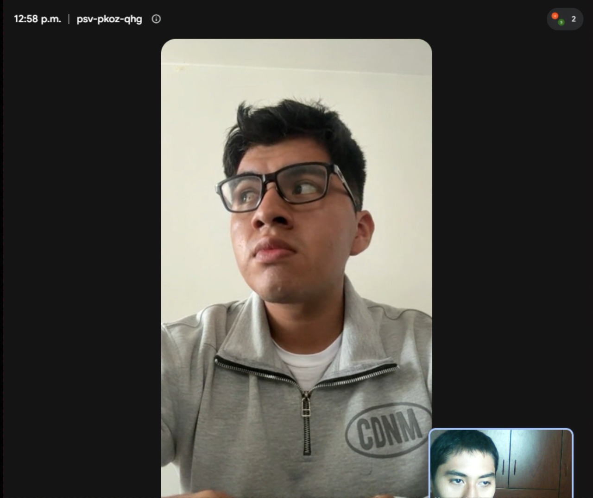</td>
            </tr>
            <tr>
                <td style="border: 1px solid #333; padding: 10px; vertical-align: top; text-align: left;">Resumen</td>
                <td style="border: 1px solid #333; padding: 10px; vertical-align: top; text-align: left;">Osvalo trabaja en zona alta y define su rol como el de los ojos del programa, ya que sin la verificación presencial se estarían entregando insumos sin respaldo. Considera que el conocimiento de las personas y del terreno es lo que no puede hacerse desde la sede, porque en un mapa se ve un cuadrado y él sabe que ese cuadrado tiene una quebrada al medio y que la mitad no es cultivable. Del formato en papel rescata la firma y la huella del beneficiario, porque acredita que ambos estuvieron presentes y lo respalda a él si aparece un problema. En su última visita coordinó por teléfono el día anterior, viajó en camioneta y caminó cuarenta minutos hasta la parcela. Delimita recorriendo el perímetro y marcando vértices cuando el terreno lo permite; cuando hay monte o pendiente fuerte toma los vértices que alcanza y estima el resto con el beneficiario, criterio que aprendió de un compañero antiguo y que no figura en ningún instructivo. Además de la coordenada llena el formato, toma fotografías con su celular personal y recoge la firma y la huella, y envía las fotos por WhatsApp cuando encuentra señal, lo que le genera acumulación y pérdida de referencia sobre a qué parcela corresponde cada imagen. En la evaluación de producción la cantidad se la declara el beneficiario y él verifica lo que puede: si la cosecha está presente estima por sacos y si ya fue vendida no tiene forma de contrastarla. Convierte a kilogramos usando entre cuarenta y cinco y cincuenta kilos por saco según el producto, y advierte que no todos los agentes aplican el mismo factor. Como no le queda copia del formato, sustenta cualquier consulta posterior con un cuaderno propio que lleva por iniciativa personal. Tuvo un caso en que una cantidad apareció distinta en el sistema y se corrigió contrastando con ese cuaderno, aunque quedó la incomodidad de parecer responsable del error, y reconoce que se resolvió porque lo conocen y no porque existiera forma de comprobarlo. Sobre la propuesta pone tres condiciones para firmar con la misma tranquilidad que el papel: que la información no se pierda, que pueda ver lo que registró y que la firma del beneficiario tenga validez. Advierte que si tuviera que seguir llevando el papel además de la herramienta, la usaría al inicio por obligación y la abandonaría en unos dos meses, como ha ocurrido con otras cosas que les han dado. Valora el sello de integridad como respaldo personal, ya que la responsabilidad de lo registrado recae sobre su firma, pero señala que si se presenta como fiscalización va a generar resistencia. Lo que no debería fallar nunca, según él, es que se pierda la información registrada, porque no puede volver a subir cuatro horas a pedir una firma otra vez.</td>
            </tr>
        </tbody>
    </table>

**Segmento Agentes de Campo: Entrevistado 2**

    <table style="width: 100%; border-collapse: collapse; border: 1px solid #333;">
        <thead>
            <tr>
                <th style="border: 1px solid #333; padding: 8px 10px; text-align: left;">Atributo</th>
                <th style="border: 1px solid #333; padding: 8px 10px; text-align: left;">Detalle</th>
            </tr>
        </thead>
        <tbody>
            <tr>
                <td style="border: 1px solid #333; padding: 10px; vertical-align: top; text-align: left;">Nombre</td>
                <td style="border: 1px solid #333; padding: 10px; vertical-align: top; text-align: left;">Mauricio Andrés Canchis Fernández</td>
            </tr>
            <tr>
                <td style="border: 1px solid #333; padding: 10px; vertical-align: top; text-align: left;">Edad</td>
                <td style="border: 1px solid #333; padding: 10px; vertical-align: top; text-align: left;">25</td>
            </tr>
            <tr>
                <td style="border: 1px solid #333; padding: 10px; vertical-align: top; text-align: left;">Sexo</td>
                <td style="border: 1px solid #333; padding: 10px; vertical-align: top; text-align: left;">Masculino</td>
            </tr>
            <tr>
                <td style="border: 1px solid #333; padding: 10px; vertical-align: top; text-align: left;">Distrito</td>
                <td style="border: 1px solid #333; padding: 10px; vertical-align: top; text-align: left;">Santiago de Surco</td>
            </tr>
            <tr>
                <td style="border: 1px solid #333; padding: 10px; vertical-align: top; text-align: left;">Ocupación</td>
                <td style="border: 1px solid #333; padding: 10px; vertical-align: top; text-align: left;">Agente de campo georreferenciador, 3 años en el puesto</td>
            </tr>
            <tr>
                <td style="border: 1px solid #333; padding: 10px; vertical-align: top; text-align: left;">Fecha de entrevista</td>
                <td style="border: 1px solid #333; padding: 10px; vertical-align: top; text-align: left;">15/09/2026</td>
            </tr>
            <tr>
                <td style="border: 1px solid #333; padding: 10px; vertical-align: top; text-align: left;">Timing</td>
                <td style="border: 1px solid #333; padding: 10px; vertical-align: top; text-align: left;">04:31 - 09:10</td>
            </tr>
            <tr>
                <td style="border: 1px solid #333; padding: 10px; vertical-align: top; text-align: left;">Video</td>
                <td style="border: 1px solid #333; padding: 10px; vertical-align: top; text-align: left;"><a href="https://upcedupe-my.sharepoint.com/:v:/g/personal/u202310210_upc_edu_pe/IQDoW5jNib-XRo6vXxarolKhAZTR0RJpyPWy4wGtPAMX_6g?e=HMrxue">Ver video</a></td>
            </tr>
            <tr>
                <td style="border: 1px solid #333; padding: 10px; vertical-align: top; text-align: left;">Captura</td>
                <td style="border: 1px solid #333; padding: 10px; vertical-align: top; text-align: left;">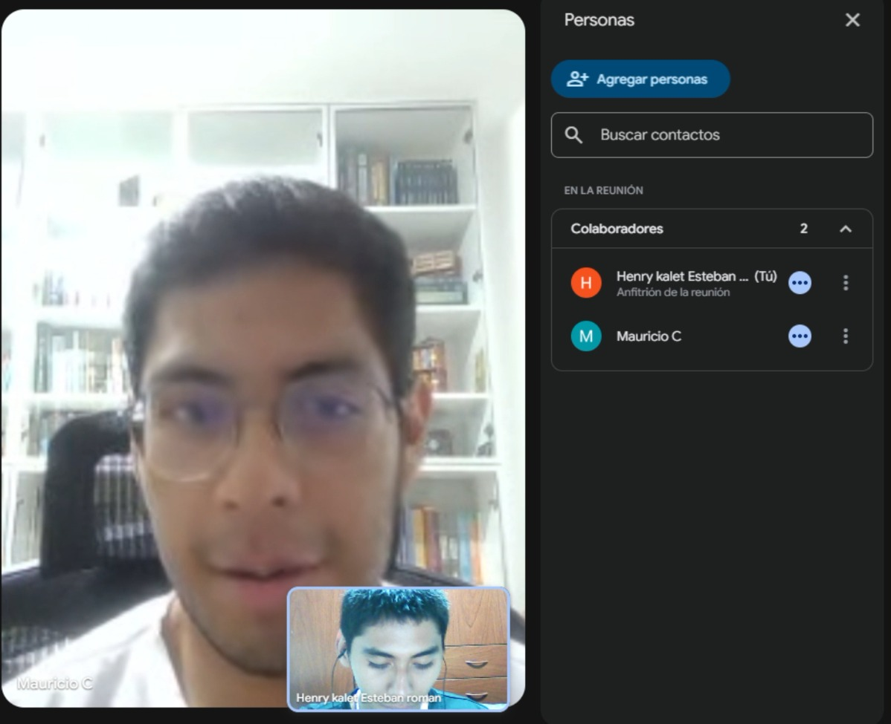</td>
            </tr>
            <tr>
                <td style="border: 1px solid #333; padding: 10px; vertical-align: top; text-align: left;">Resumen</td>
                <td style="border: 1px solid #333; padding: 10px; vertical-align: top; text-align: left;">Mauricio atiende parcelas que están a dos días de viaje, con tramos donde no entra vehículo, de modo que una salida suya no dura un día sino una semana. Se describe como la única presencia del programa que esa población ve en meses. Sostiene que casi todo su trabajo depende de su criterio, porque es él quien decide si una parcela se puede medir completa, si el terreno da y si vale la pena volver, y nadie en la sede puede tomar esa decisión porque nadie ha estado ahí. Del formato en papel valora que funciona siempre, no se apaga ni se descarga, y advierte que eso debe tenerse muy en cuenta antes de proponer otra cosa. Mide con el GPS de la oficina zonal cuando hay equipo disponible, pero como son varios agentes y hay pocos equipos, aproximadamente una de cada tres salidas la realiza sin equipo institucional y mide con una aplicación que descargó en su celular personal, situación que no se reporta. En su zona casi nunca puede recorrer el perímetro por el monte cerrado, así que toma un punto referencial al centro y los vértices que alcanza, y conversa el resto con el beneficiario, por lo que el área que consigna en el formato es una estimación. Cuando el beneficiario está presente le muestra la pantalla con el punto y le explica que esa es su parcela y que ese punto queda registrado a su nombre, práctica que le enseñaron para reducir la desconfianza inicial de la gente, que suele pensar que se mide para quitarles algo. La cantidad producida se la declaran y él calcula a partir del número de sacos, usando cuarenta kilos por saco porque así se lo enseñaron en su oficina zonal; sabe que en otras zonas se usa otro número, lo ha conversado con compañeros sin llegar a un acuerdo, y señala que nadie les ha entregado una tabla oficial. Deja el formato en la oficina zonal y de ahí va en valija, sin enterarse de nada más salvo que lo llamen para corregir, lo que suele ocurrir cuando ya está en otra zona y debe hacer memoria de algo de un mes atrás. No lleva cuaderno aparte porque no le alcanza el tiempo, de modo que si le preguntan por un dato antiguo responde de memoria y, si no recuerda, lo dice. Para confiar en un registro cerrado en la parcela pide que el equipo dure varios días y que, si el celular se malogra, no pierda la semana entera de trabajo. Añade un punto que según él nadie pregunta: recibir un equipo caro para llevar a campo lo pone en riesgo personal, porque en algunas zonas uno no quiere andar mostrando aparatos. Le gustaría tener cargadas de antemano las parcelas que el beneficiario ya tiene registradas, porque le ha ocurrido llegar y encontrar una parcela adicional sin saber si otro agente ya la registró el año anterior, lo que luego aparece duplicado en la sede y se le consulta a él. Lo que no debería fallar nunca es que el registro aguante, ya que no necesita que sea bonito sino que después de seis días en campo conserve todo lo levantado.</td>
            </tr>
        </tbody>
    </table>

**Segmento Agentes de Campo: Entrevistado 3**

    <table style="width: 100%; border-collapse: collapse; border: 1px solid #333;">
        <thead>
            <tr>
                <th style="border: 1px solid #333; padding: 8px 10px; text-align: left;">Atributo</th>
                <th style="border: 1px solid #333; padding: 8px 10px; text-align: left;">Detalle</th>
            </tr>
        </thead>
        <tbody>
            <tr>
                <td style="border: 1px solid #333; padding: 10px; vertical-align: top; text-align: left;">Nombre</td>
                <td style="border: 1px solid #333; padding: 10px; vertical-align: top; text-align: left;">Kerry Baquerrizo</td>
            </tr>
            <tr>
                <td style="border: 1px solid #333; padding: 10px; vertical-align: top; text-align: left;">Edad</td>
                <td style="border: 1px solid #333; padding: 10px; vertical-align: top; text-align: left;">26</td>
            </tr>
            <tr>
                <td style="border: 1px solid #333; padding: 10px; vertical-align: top; text-align: left;">Sexo</td>
                <td style="border: 1px solid #333; padding: 10px; vertical-align: top; text-align: left;">Masculino</td>
            </tr>
            <tr>
                <td style="border: 1px solid #333; padding: 10px; vertical-align: top; text-align: left;">Distrito</td>
                <td style="border: 1px solid #333; padding: 10px; vertical-align: top; text-align: left;">Ate</td>
            </tr>
            <tr>
                <td style="border: 1px solid #333; padding: 10px; vertical-align: top; text-align: left;">Ocupación</td>
                <td style="border: 1px solid #333; padding: 10px; vertical-align: top; text-align: left;">Agente de campo georreferenciador, 8 meses en el puesto</td>
            </tr>
            <tr>
                <td style="border: 1px solid #333; padding: 10px; vertical-align: top; text-align: left;">Fecha de entrevista</td>
                <td style="border: 1px solid #333; padding: 10px; vertical-align: top; text-align: left;">15/09/2026</td>
            </tr>
            <tr>
                <td style="border: 1px solid #333; padding: 10px; vertical-align: top; text-align: left;">Timing</td>
                <td style="border: 1px solid #333; padding: 10px; vertical-align: top; text-align: left;">09:10 - 13:45</td>
            </tr>
            <tr>
                <td style="border: 1px solid #333; padding: 10px; vertical-align: top; text-align: left;">Video</td>
                <td style="border: 1px solid #333; padding: 10px; vertical-align: top; text-align: left;"><a href="https://upcedupe-my.sharepoint.com/:v:/g/personal/u202310210_upc_edu_pe/IQDoW5jNib-XRo6vXxarolKhAZTR0RJpyPWy4wGtPAMX_6g?e=HMrxue">Ver video</a></td>
            </tr>
            <tr>
                <td style="border: 1px solid #333; padding: 10px; vertical-align: top; text-align: left;">Captura</td>
                <td style="border: 1px solid #333; padding: 10px; vertical-align: top; text-align: left;"></td>
            </tr>
            <tr>
                <td style="border: 1px solid #333; padding: 10px; vertical-align: top; text-align: left;">Resumen</td>
                <td style="border: 1px solid #333; padding: 10px; vertical-align: top; text-align: left;">Kerry es el agente con menos tiempo en el puesto y señala que lo que más le costó aprender fue el criterio, porque nadie le explicó cómo delimitar una parcela: salió dos veces con un compañero, observó cómo lo hacía y de ahí lo enviaron solo, de modo que reproduce lo que vio sin saber si es lo correcto o si es la costumbre de esa persona. Al conversarlo con otros agentes confirmó que cada uno lo hace distinto, uno recorre todo el perímetro y otro toma cuatro puntos, y él toma el perímetro cuando se puede porque le parece más serio, aunque se demora el doble que los demás. Reconoce que el papel le complica, pero entiende que la firma del beneficiario es necesaria y considera que el resto de los datos y las casillas podrían estar en otro lado. Por iniciativa propia se creó un formulario en Google Forms que llena desde el celular en la parcela para no perder información, y luego copia los datos al sistema y al formato en papel. Lo hizo porque al inicio se le mojó un formato en la mochila y tuvo que volver a subir a la parcela. En ese formulario registra nombre, DNI, coordenadas, cultivo, área, cantidad, observaciones y una fotografía, prácticamente lo mismo que el formato oficial pero con guardado automático. Tres o cuatro compañeros ya le pidieron el enlace, sin que se trate de una herramienta oficial. La cantidad producida se la declara el beneficiario en sacos y él multiplica por cincuenta kilos, factor que le indicó un compañero y del que no tiene certeza. Tuvo un caso en que un área que él registró apareció más pequeña en el sistema y, al preguntar, le respondieron que había sido ajustada en la sede sin precisar quién ni por qué; no reclamó por ser nuevo, pero le habría gustado saberlo porque el nombre que figura en ese registro es el suyo. Considera que cerrar el registro en la parcela sería un avance enorme porque es lo que ya hace de forma artesanal con su formulario, y su única condición es que la firma digital tenga validez, en cuyo caso dejaría el papel de inmediato. Aun si tuviera que llevar ambos lo usaría, porque ya lo hace, aunque advierte que los compañeros con más antigüedad lo verán como trabajo adicional. Lo que no debería fallar nunca, para él, es poder consultar lo que ya registró antes, ya que hoy entrega el formato y no le queda nada, mientras que con su formulario al menos conserva su historial.</td>
            </tr>
        </tbody>
    </table>

**Segmento Funcionarios Administrativos: Entrevistado 1**

    <table style="width: 100%; border-collapse: collapse; border: 1px solid #333;">
        <thead>
            <tr>
                <th style="border: 1px solid #333; padding: 8px 10px; text-align: left;">Atributo</th>
                <th style="border: 1px solid #333; padding: 8px 10px; text-align: left;">Detalle</th>
            </tr>
        </thead>
        <tbody>
            <tr>
                <td style="border: 1px solid #333; padding: 10px; vertical-align: top; text-align: left;">Nombre</td>
                <td style="border: 1px solid #333; padding: 10px; vertical-align: top; text-align: left;">María Fernanda Esteban Román</td>
            </tr>
            <tr>
                <td style="border: 1px solid #333; padding: 10px; vertical-align: top; text-align: left;">Edad</td>
                <td style="border: 1px solid #333; padding: 10px; vertical-align: top; text-align: left;">23</td>
            </tr>
            <tr>
                <td style="border: 1px solid #333; padding: 10px; vertical-align: top; text-align: left;">Sexo</td>
                <td style="border: 1px solid #333; padding: 10px; vertical-align: top; text-align: left;">Femenino</td>
            </tr>
            <tr>
                <td style="border: 1px solid #333; padding: 10px; vertical-align: top; text-align: left;">Distrito</td>
                <td style="border: 1px solid #333; padding: 10px; vertical-align: top; text-align: left;">Ate</td>
            </tr>
            <tr>
                <td style="border: 1px solid #333; padding: 10px; vertical-align: top; text-align: left;">Ocupación</td>
                <td style="border: 1px solid #333; padding: 10px; vertical-align: top; text-align: left;">Asistente administrativa de gerencia general, 5 años en el puesto</td>
            </tr>
            <tr>
                <td style="border: 1px solid #333; padding: 10px; vertical-align: top; text-align: left;">Fecha de entrevista</td>
                <td style="border: 1px solid #333; padding: 10px; vertical-align: top; text-align: left;">15/09/2026</td>
            </tr>
            <tr>
                <td style="border: 1px solid #333; padding: 10px; vertical-align: top; text-align: left;">Timing</td>
                <td style="border: 1px solid #333; padding: 10px; vertical-align: top; text-align: left;">13:45 - 18:51</td>
            </tr>
            <tr>
                <td style="border: 1px solid #333; padding: 10px; vertical-align: top; text-align: left;">Video</td>
                <td style="border: 1px solid #333; padding: 10px; vertical-align: top; text-align: left;"><a href="https://upcedupe-my.sharepoint.com/:v:/g/personal/u202310210_upc_edu_pe/IQDoW5jNib-XRo6vXxarolKhAZTR0RJpyPWy4wGtPAMX_6g?e=HMrxue">Ver video</a></td>
            </tr>
            <tr>
                <td style="border: 1px solid #333; padding: 10px; vertical-align: top; text-align: left;">Captura</td>
                <td style="border: 1px solid #333; padding: 10px; vertical-align: top; text-align: left;"></td>
            </tr>
            <tr>
                <td style="border: 1px solid #333; padding: 10px; vertical-align: top; text-align: left;">Resumen</td>
                <td style="border: 1px solid #333; padding: 10px; vertical-align: top; text-align: left;">María Fernanda recibe las actas que llegan de las oficinas zonales, las escanea, las verifica contra el sistema de beneficiarios y registra los datos, de modo que todo lo que llega de campo pasa por ella antes de existir en el sistema. Antes de este puesto estuvo dos años en archivo, por lo que conoce cómo se maneja la documentación física. Maneja entre treinta y cuarenta expedientes por semana, según cómo llegue la valija, y trabaja con tres sistemas: el de registro de beneficiarios, el de consolidación donde se reporta el avance y un Excel propio que usa como paso intermedio. Se describe como el puente del proceso, porque si ella no registra un documento, para la institución ese trabajo no ocurrió. Ubica su criterio en detectar cuando algo no cuadra, ya que un formato puede estar completo y bien llenado y aun así advertir que el nombre no corresponde al código o que la cantidad es desproporcionada para el área, algo que solo distingue quien ya ha visto miles de expedientes. Del procedimiento actual conservaría que todo queda con su acta física archivada, porque ante una auditoría ahí está el papel firmado. Al describir el último expediente que cerró detalla que la valija llegó el lunes con treinta y dos actas, que las separa por oficina zonal, las escanea en la multifuncional y las guarda nombrando el archivo con el DNI y la fecha; luego abre el sistema de beneficiarios, verifica que la persona exista y que el código coincida, pasa los datos a su Excel intermedio y al final de la semana lo usa para digitar en el sistema de consolidación. Utiliza el Excel intermedio porque el sistema de consolidación es lento y, si se cae a la mitad, pierde lo avanzado. Los campos que traslada de un documento a otro son catorce: código de beneficiario, DNI, apellidos y nombres, código de parcela, coordenada este, coordenada norte, fecha de evaluación, cultivo, área en hectáreas, cantidad producida, unidad de medida, nombre del agente, número de acta y observaciones. Cada expediente le toma entre veinticinco y treinta minutos contando el escaneo y la verificación, y supera la hora cuando hay observaciones. Estima que uno de cada seis expedientes presenta alguna observación, siendo lo más frecuente las unidades y los nombres mal escritos. Como último caso en que algo no calzó relata un acta que consignaba ochocientos kilos, cifra imposible para el área registrada; al llamar a la oficina zonal le informaron que el agente había anotado sacos y que alguien convirtió mal, y la corrección le tomó tres días. Sobre la fidelidad de los documentos escaneados indica que nunca se le ha cuestionado uno, pero reconoce que tampoco tendría cómo comprobarlo, ya que si alguien abriera el archivo escaneado y lo modificara ella no se daría cuenta, y señala que no lo había pensado hasta que se lo preguntaron. Si un sistema le presentara los campos ya leídos, revisaría siempre el DNI, el código de beneficiario, la cantidad con su unidad y la fecha. Al inicio revisaría todos los campos, no por desconfianza sino para observar cómo se equivoca el sistema, y después de dos o tres meses pasaría a revisar solo lo marcado como dudoso. Asume que la responsabilidad por un error sería suya porque es quien aprueba, y por eso necesita poder ver el documento al costado del dato y no solamente el dato. El tiempo que hoy dedica a digitar lo usaría en perseguir las observaciones, que hoy quedan pendientes semanas porque no alcanza a llamar zona por zona y son lo que realmente traba el proceso. Lo que no debería fallar nunca es la relación entre el dato y su acta de origen, porque mientras pueda abrir el acta y ver de dónde salió cada número, el resto lo maneja.</td>
            </tr>
        </tbody>
    </table>

**Segmento Funcionarios Administrativos: Entrevistado 2**

    <table style="width: 100%; border-collapse: collapse; border: 1px solid #333;">
        <thead>
            <tr>
                <th style="border: 1px solid #333; padding: 8px 10px; text-align: left;">Atributo</th>
                <th style="border: 1px solid #333; padding: 8px 10px; text-align: left;">Detalle</th>
            </tr>
        </thead>
        <tbody>
            <tr>
                <td style="border: 1px solid #333; padding: 10px; vertical-align: top; text-align: left;">Nombre</td>
                <td style="border: 1px solid #333; padding: 10px; vertical-align: top; text-align: left;">Bruno Rolando Núñez Gallegos</td>
            </tr>
            <tr>
                <td style="border: 1px solid #333; padding: 10px; vertical-align: top; text-align: left;">Edad</td>
                <td style="border: 1px solid #333; padding: 10px; vertical-align: top; text-align: left;">28</td>
            </tr>
            <tr>
                <td style="border: 1px solid #333; padding: 10px; vertical-align: top; text-align: left;">Sexo</td>
                <td style="border: 1px solid #333; padding: 10px; vertical-align: top; text-align: left;">Masculino</td>
            </tr>
            <tr>
                <td style="border: 1px solid #333; padding: 10px; vertical-align: top; text-align: left;">Distrito</td>
                <td style="border: 1px solid #333; padding: 10px; vertical-align: top; text-align: left;">San Borja</td>
            </tr>
            <tr>
                <td style="border: 1px solid #333; padding: 10px; vertical-align: top; text-align: left;">Ocupación</td>
                <td style="border: 1px solid #333; padding: 10px; vertical-align: top; text-align: left;">Coordinador del área, 9 años en la institución</td>
            </tr>
            <tr>
                <td style="border: 1px solid #333; padding: 10px; vertical-align: top; text-align: left;">Fecha de entrevista</td>
                <td style="border: 1px solid #333; padding: 10px; vertical-align: top; text-align: left;">15/09/2026</td>
            </tr>
            <tr>
                <td style="border: 1px solid #333; padding: 10px; vertical-align: top; text-align: left;">Timing</td>
                <td style="border: 1px solid #333; padding: 10px; vertical-align: top; text-align: left;">18:51 - 23:58</td>
            </tr>
            <tr>
                <td style="border: 1px solid #333; padding: 10px; vertical-align: top; text-align: left;">Video</td>
                <td style="border: 1px solid #333; padding: 10px; vertical-align: top; text-align: left;"><a href="https://upcedupe-my.sharepoint.com/:v:/g/personal/u202310210_upc_edu_pe/IQDoW5jNib-XRo6vXxarolKhAZTR0RJpyPWy4wGtPAMX_6g?e=HMrxue">Ver video</a></td>
            </tr>
            <tr>
                <td style="border: 1px solid #333; padding: 10px; vertical-align: top; text-align: left;">Captura</td>
                <td style="border: 1px solid #333; padding: 10px; vertical-align: top; text-align: left;"></td>
            </tr>
            <tr>
                <td style="border: 1px solid #333; padding: 10px; vertical-align: top; text-align: left;">Resumen</td>
                <td style="border: 1px solid #333; padding: 10px; vertical-align: top; text-align: left;">Bruno empezó como analista y pasó a coordinación hace cuatro años. No digita: revisa lo que consolidan las asistentes, da la conformidad y eso es lo que sube al reporte, de modo que su firma está en lo que ve la gerencia y es quien responde si algo sale mal. Por quincena revisa entre ciento veinte y ciento cincuenta expedientes, que es lo que procesan las tres asistentes del área. Trabaja principalmente con el sistema de consolidación y con los reportes que le preparan, y ha participado en las coordinaciones con la Oficina de Tecnologías cuando se intentó la carga masiva. Ubica su criterio en decidir qué se reporta y qué se observa, porque a veces llega información incompleta y hay que definir si se reporta parcial o se espera, decisión con consecuencias porque el avance del POI se mide con eso. Del procedimiento actual conservaría la cadena de responsabilidad, ya que cada documento tiene un responsable en cada etapa, el agente que lo levanta, la asistente que lo registra y él que lo aprueba, algo que según indica no existe en muchas instituciones. Describe que la valija llega quincenalmente, que las asistentes procesan durante esa quincena y que él revisa al cierre, de modo que entre el día de la visita y el reporte que ve la gerencia pueden pasar tres semanas, o cuatro si la zona es lejana. La información entra al sistema que consolida el POI a mano, campo por campo; hubo un intento de carga masiva con una plantilla de Excel, pero la validación rechazaba la mitad de los registros por formato y se dejó de usar. Sobre integraciones indica que el tema lo maneja la Oficina de Tecnologías y que, por lo que sabe, hoy no hay nada automático, remitiendo la respuesta técnica a esa oficina. Señala que el valor oficial del expediente lo da el acta física firmada, que el escaneo es una copia de trabajo y que lo que se reporta es el registro del sistema, pero que ante una controversia el que manda es el papel. Relata un caso en que control interno observó un acta cuyos datos en el sistema no coincidían con el físico; se determinó que fue error de digitación, pero el proceso de aclaración tomó casi dos meses y hubo que rastrear el acta original en archivo. Lo que habría acelerado ese proceso, según él, es poder demostrar de entrada cuál era la versión original y quién la modificó, ya que armar esa historia tomó semanas a base de correos y de preguntar a la gente qué recordaba. Recibiría bien un mecanismo que permita demostrar que un documento no fue alterado, pero advierte que hay que cuidar cómo se presenta: si el personal entiende que es para vigilarlos habrá resistencia e incluso el sindicato podría pronunciarse, mientras que presentado como respaldo frente a observaciones de control hay apertura. Indica que él no revisa campo por campo porque para eso están las asistentes, y que lo que necesita es saber qué porcentaje del expediente fue procesado automáticamente y qué fue verificado por una persona, ya que si va a firmar necesita saber sobre qué está firmando. El tiempo liberado del equipo lo usaría en análisis, porque hoy nadie mira tendencias y solo se reporta, y en cerrar los expedientes observados, que es donde se acumula el trabajo. Lo que no debería fallar nunca es la trazabilidad, porque tiene que poder decir en cualquier momento y ante cualquiera de dónde salió cada número y quién lo aprobó, y si el sistema no le da eso, no lo firma.</td>
            </tr>
        </tbody>
    </table>

**Segmento Funcionarios Administrativos: Entrevistado 3**

    <table style="width: 100%; border-collapse: collapse; border: 1px solid #333;">
        <thead>
            <tr>
                <th style="border: 1px solid #333; padding: 8px 10px; text-align: left;">Atributo</th>
                <th style="border: 1px solid #333; padding: 8px 10px; text-align: left;">Detalle</th>
            </tr>
        </thead>
        <tbody>
            <tr>
                <td style="border: 1px solid #333; padding: 10px; vertical-align: top; text-align: left;">Nombre</td>
                <td style="border: 1px solid #333; padding: 10px; vertical-align: top; text-align: left;">Iván Alejandro Reyes Carrizales</td>
            </tr>
            <tr>
                <td style="border: 1px solid #333; padding: 10px; vertical-align: top; text-align: left;">Edad</td>
                <td style="border: 1px solid #333; padding: 10px; vertical-align: top; text-align: left;">23</td>
            </tr>
            <tr>
                <td style="border: 1px solid #333; padding: 10px; vertical-align: top; text-align: left;">Sexo</td>
                <td style="border: 1px solid #333; padding: 10px; vertical-align: top; text-align: left;">Masculino</td>
            </tr>
            <tr>
                <td style="border: 1px solid #333; padding: 10px; vertical-align: top; text-align: left;">Distrito</td>
                <td style="border: 1px solid #333; padding: 10px; vertical-align: top; text-align: left;">Ate</td>
            </tr>
            <tr>
                <td style="border: 1px solid #333; padding: 10px; vertical-align: top; text-align: left;">Ocupación</td>
                <td style="border: 1px solid #333; padding: 10px; vertical-align: top; text-align: left;">Analista de planeamiento, 2 años en el puesto</td>
            </tr>
            <tr>
                <td style="border: 1px solid #333; padding: 10px; vertical-align: top; text-align: left;">Fecha de entrevista</td>
                <td style="border: 1px solid #333; padding: 10px; vertical-align: top; text-align: left;">15/09/2026</td>
            </tr>
            <tr>
                <td style="border: 1px solid #333; padding: 10px; vertical-align: top; text-align: left;">Timing</td>
                <td style="border: 1px solid #333; padding: 10px; vertical-align: top; text-align: left;">23:58 - 28:13</td>
            </tr>
            <tr>
                <td style="border: 1px solid #333; padding: 10px; vertical-align: top; text-align: left;">Video</td>
                <td style="border: 1px solid #333; padding: 10px; vertical-align: top; text-align: left;"><a href="https://upcedupe-my.sharepoint.com/:v:/g/personal/u202310210_upc_edu_pe/IQDoW5jNib-XRo6vXxarolKhAZTR0RJpyPWy4wGtPAMX_6g?e=HMrxue">Ver video</a></td>
            </tr>
            <tr>
                <td style="border: 1px solid #333; padding: 10px; vertical-align: top; text-align: left;">Captura</td>
                <td style="border: 1px solid #333; padding: 10px; vertical-align: top; text-align: left;"></td>
            </tr>
            <tr>
                <td style="border: 1px solid #333; padding: 10px; vertical-align: top; text-align: left;">Resumen</td>
                <td style="border: 1px solid #333; padding: 10px; vertical-align: top; text-align: left;">Iván consolida el avance del POI. Viene de planeamiento en otra entidad, por lo que conoce el marco del PEI y del POI, aunque el proceso operativo lo aprendió en la institución. Toma lo que ya está registrado en el sistema, lo cruza con las metas y arma el reporte de avance por indicador; no toca las actas, trabaja con la data ya cargada. El trabajo es quincenal y cada reporte consolida entre doscientos cincuenta y trescientos registros, y armarlo le toma casi dos días completos. Exporta del sistema de consolidación a Excel y ahí trabaja con tablas dinámicas, armando la parte visual a mano cada quincena. Pidió usar una herramienta de análisis en línea y no se la autorizaron. De esos dos días, lo que más tiempo le consume es limpiar la data, porque llegan nombres escritos de tres maneras distintas, unidades mezcladas y fechas en formatos diferentes, de modo que antes de calcular cualquier cosa tiene que uniformizar, y eso es lo que realmente consume el tiempo y no el análisis. Del procedimiento actual conservaría que los indicadores están bien definidos, ya que se sabe qué se mide y contra qué meta, y sostiene que el problema no es la definición sino que la data llega tarde y sucia. Precisa que para cuando reporta, la información de campo tiene entre tres y cinco semanas, por lo que la gerencia toma decisiones mirando algo que ya pasó. Indica que la gerencia ha pedido un tablero que puedan consultar cuando quieran sin esperar su reporte, que se intentó con una herramienta que ya tienen pero quedó a medias porque la data no estaba consistente, y concluye que sin resolver el origen del dato el tablero no sirve. Sobre integraciones señala que existe una base de datos detrás del sistema de consolidación, pero que el acceso lo controla la Oficina de Tecnologías y que hay una restricción importante: no se permite que datos de beneficiarios salgan a servicios externos en la nube. Conoce esa restricción porque se la aplicaron cuando pidió la herramienta de análisis en línea, y estima que debe estar recogida en la directiva de seguridad de la información, documento que puede facilitar la Oficina de Tecnologías. Los campos que más problemas le dan al consolidar son la unidad de medida, el área de la parcela porque a veces viene en hectáreas y a veces en metros cuadrados, y el código de parcela porque en algunos casos llega vacío y hay que rastrearlo. Si los datos llegaran ya validados y consistentes, sostiene que cambiaría todo su trabajo, porque pasaría de limpiar a analizar y podría señalar en qué zonas el avance está cayendo y por qué, que es lo que la gerencia realmente quiere saber y hoy nadie responde. Confiaría en un reporte generado automáticamente solo si puede ver de dónde sale cada número, es decir poder hacer clic en un total y ver qué actas lo componen, y advierte que si es una caja negra no lo firma ni lo presenta. Lo que no debería fallar nunca es la consistencia de las unidades, porque si la unidad de medida no está resuelta en el origen, cualquier tablero que se arme estará mal y nadie se dará cuenta hasta que sea tarde.</td>
            </tr>
        </tbody>
    </table>

### Análisis de entrevistas

Las entrevistas se realizaron a un total de seis participantes, tres agentes de campo georreferenciadores y tres funcionarios administrativos vinculados al programa de apoyo agrícola. El objetivo fue comprender el recorrido real que sigue la información desde la visita a la parcela hasta el reporte de avance institucional, identificar dónde se origina el error y contrastar las hipótesis del proyecto con la experiencia de quienes ejecutan el proceso. A continuación se presenta el análisis por segmento, con el sustento estadístico de las características objetivas y subjetivas identificadas.

**Segmento: Agentes de campo georreferenciadores**

Total entrevistados: 3
Edades: 25, 26 y 26 años
Distritos: Ate y Santiago de Surco
Experiencia en el puesto: 8 meses, 3 años y 7 años
Fechas: 15/09/2026

Características objetivas:
- Registran la evaluación de producción en el formato en papel establecido: 3/3 (100%)
- Obtienen la cantidad producida a partir de lo declarado por el beneficiario: 3/3 (100%)
- Convierten sacos a kilogramos aplicando un factor aprendido de manera informal: 3/3 (100%)
- Aplican un factor de conversión distinto al de sus compañeros: 3/3 (100%)
- Aprendieron el criterio de delimitación observando a otro agente, sin instructivo: 3/3 (100%)
- No conservan copia del formato una vez que lo entregan: 3/3 (100%)
- No cuentan con un medio institucional para sustentar un dato registrado meses atrás: 3/3 (100%)
- Llevan un registro paralelo propio para conservar evidencia de lo levantado: 2/3 (66%)
- Toman fotografías de la visita con su teléfono personal: 2/3 (66%)
- Han visto un dato suyo modificado en la sede sin recibir explicación: 2/3 (66%)
- Han medido parcelas con su teléfono personal por falta de equipo GNSS institucional: 1/3 (33%)

Características subjetivas:
- Identifican la firma y la huella del beneficiario como el elemento del formato que debe conservarse: 2/3 (66%)
- Condicionan la adopción de una herramienta digital a que la firma del beneficiario tenga validez: 2/3 (66%)
- Piden poder consultar su propio historial de registros: 2/3 (66%)
- Señalan la pérdida de la información registrada como el fallo más grave posible: 2/3 (66%)
- Advierten que el personal con más antigüedad abandonaría la herramienta si duplica el trabajo: 2/3 (66%)
- Valoran del formato en papel que funciona sin depender de batería ni conectividad: 1/3 (33%)
- Perciben un sello de integridad como respaldo personal frente a observaciones posteriores: 1/3 (33%)
- Advierten que la propuesta generará resistencia si se presenta como fiscalización: 1/3 (33%)
- Mencionan riesgo personal por portar equipos de valor en zonas alejadas: 1/3 (33%)
- Muestran al beneficiario el punto registrado para reducir su desconfianza: 1/3 (33%)

El hallazgo más consistente de este segmento es que la cantidad producida no se mide, se declara, y que la conversión de sacos a kilogramos queda a criterio de cada agente. Los tres entrevistados aplican factores distintos, de cuarenta, de cincuenta y de un rango entre cuarenta y cinco y cincuenta kilos por saco, y ninguno ha recibido una tabla oficial. El error, por lo tanto, se origina antes de cualquier digitalización. El segundo hallazgo es que ningún agente conserva evidencia institucional de lo que registró: dos resolvieron esa carencia por cuenta propia, con un cuaderno y con un formulario en Google Forms, y el tercero simplemente responde de memoria.

**Segmento: Funcionarios administrativos**

Total entrevistados: 3
Edades: 23, 23 y 28 años
Distritos: Ate y San Borja
Cargos: asistente administrativa de gerencia general, coordinador de área y analista de planeamiento
Experiencia en el puesto: 2, 5 y 9 años
Fechas: 15/09/2026

Características objetivas:
- Trabajan con más de un sistema institucional para una misma información: 3/3 (100%)
- Coinciden en que hoy no existe integración automática entre esos sistemas: 3/3 (100%)
- Recurren a Excel como herramienta intermedia o de trabajo: 2/3 (66%)
- El traslado de información entre sistemas se realiza de forma manual, campo por campo: 2/3 (66%)
- Identifican la unidad de medida como el campo que más errores genera: 2/3 (66%)
- Reconocen el acta física firmada como la fuente de valor oficial del expediente: 2/3 (66%)
- Sitúan entre tres y cinco semanas el ciclo desde la visita de campo hasta el reporte de gerencia: 2/3 (66%)
- Reportan un intento previo de carga masiva abandonado por rechazo de validaciones: 1/3 (33%)
- Señalan una restricción institucional que impide enviar datos de beneficiarios a servicios en la nube: 1/3 (33%)

Características subjetivas:
- Condicionan la aprobación de un dato a poder rastrearlo hasta su acta de origen: 3/3 (100%)
- Rechazarían un resultado automático cuyo origen no puedan verificar: 3/3 (100%)
- Usarían el tiempo liberado en análisis y en el seguimiento de observaciones pendientes: 3/3 (100%)
- Sostienen que nunca se ha comprobado la fidelidad de un documento escaneado y que no habría cómo hacerlo: 2/3 (66%)
- Prefieren revisar todos los campos al inicio hasta conocer el comportamiento del sistema: 1/3 (33%)
- Advierten que la propuesta generará resistencia si se presenta como fiscalización: 1/3 (33%)
- Señalan que la gerencia toma decisiones con información desactualizada: 1/3 (33%)
- Identifican la limpieza de datos, y no el análisis, como lo que consume la mayor parte de su tiempo: 1/3 (33%)

En volumen, la asistente procesa entre treinta y cuarenta expedientes por semana, con un tiempo de veinticinco a treinta minutos por expediente que supera la hora cuando hay observaciones, y estima que uno de cada seis expedientes presenta alguna. El coordinador revisa entre ciento veinte y ciento cincuenta expedientes por quincena, procesados por tres asistentes. El analista consolida entre doscientos cincuenta y trescientos registros por quincena e invierte casi dos días completos en armar el reporte, de los cuales la mayor parte se destina a uniformizar la data antes de calcular.

El aporte más relevante de este segmento es el detalle exacto de los campos que se trasladan manualmente de un documento a otro. Son catorce: código de beneficiario, DNI, apellidos y nombres, código de parcela, coordenada este, coordenada norte, fecha de evaluación, cultivo, área en hectáreas, cantidad producida, unidad de medida, nombre del agente, número de acta y observaciones. De estos, la asistente identifica cuatro que revisaría siempre antes de aprobar aunque un sistema los hubiera leído automáticamente: el DNI, el código de beneficiario, la cantidad con su unidad y la fecha de evaluación.

**Conclusión general**

El análisis confirma que el problema no se limita al traslado manual de información entre sistemas aislados, sino que comienza en el origen del dato, donde la cantidad producida se declara y se convierte sin un criterio uniforme. Cualquier automatización posterior arrastrará ese error si no se resuelve en campo. Las dos condiciones que ambos segmentos plantean de forma independiente son la trazabilidad completa entre el dato y su acta de origen y la posibilidad de verificar que un documento no fue alterado, lo que respalda tanto la integración propuesta como el componente de integridad documental. Por último, las entrevistas dejan una advertencia clara sobre la adopción: la herramienta debe reemplazar trabajo y no sumarse a él, y la propuesta debe comunicarse como respaldo para el personal y no como mecanismo de control, ya que de lo contrario enfrentará resistencia en ambos segmentos.

## Needfinding

### User Personas

A continuación se presentan los artefactos de user persona elaborados para cada segmento objetivo, modelados a través de los roles que intervienen en el proceso con los nombres formales usados en el dominio.

**Agente de Campo**  
Representa a quien registra en campo la georreferenciación de las parcelas y la producción de los beneficiarios, bajo condiciones de conectividad limitada y acceso difícil. Su necesidad principal es no perder el registro capturado y poder sustentarlo ante cualquier cuestionamiento posterior, incluso cuando hoy no cuenta con un mecanismo oficial para hacerlo.

**Asistente de Gerencia General**  
Representa a quien recibe, aprueba y consolida la información que llega desde campo, agrupando los roles de asistente administrativa, coordinador de aprobación y analista de consolidación identificados en las entrevistas. Su necesidad principal es poder confiar en un dato que no digitó personalmente y demostrar en cualquier momento de dónde proviene cada cifra que aprueba o reporta.

### User Task Matrix

En esta sección se presenta el User Task Matrix, que consolida las tareas que realizan los dos User Persona construidos a partir del Needfinding: Marco Quispe Huamán (Agente de Campo) y Rocío Fernández Salas (Asistente de Gerencia General).Las tareas listadas corresponden a actividades que ambos segmentos realizan independientemente de la existencia de una solución de software, no se incluyen funcionalidades ni características de ningún sistema.

<table style="width: 100%; border-collapse: collapse; border: 1px solid #333; font-family: Arial, sans-serif; font-size: 14px;">
    <thead>
        <tr>
            <th rowspan="2" style="border: 1px solid #333; padding: 8px 10px; text-align: left;">Tarea</th>
            <th colspan="2" style="border: 1px solid #333; padding: 8px 10px; text-align: center;">Marco Quispe Huamán Agente de Campo</th>
            <th colspan="2" style="border: 1px solid #333; padding: 8px 10px; text-align: center;">Rocío Fernández Salas Asistente de Gerencia General</th>
        </tr>
        <tr>
            <th style="border: 1px solid #333; padding: 8px 10px; text-align: center;">Frecuencia</th>
            <th style="border: 1px solid #333; padding: 8px 10px; text-align: center;">Importancia</th>
            <th style="border: 1px solid #333; padding: 8px 10px; text-align: center;">Frecuencia</th>
            <th style="border: 1px solid #333; padding: 8px 10px; text-align: center;">Importancia</th>
        </tr>
    </thead>
    <tbody>
        <tr><td style="border: 1px solid #333; padding: 8px 10px;">Coordinar la visita con el beneficiario antes de ir a la parcela</td><td style="border: 1px solid #333; padding: 8px 10px; text-align: center;">Alta</td><td style="border: 1px solid #333; padding: 8px 10px; text-align: center;">Alta</td><td style="border: 1px solid #333; padding: 8px 10px; text-align: center;">—</td><td style="border: 1px solid #333; padding: 8px 10px; text-align: center;">—</td></tr>
        <tr><td style="border: 1px solid #333; padding: 8px 10px;">Trasladarse hasta la parcela</td><td style="border: 1px solid #333; padding: 8px 10px; text-align: center;">Alta</td><td style="border: 1px solid #333; padding: 8px 10px; text-align: center;">Media</td><td style="border: 1px solid #333; padding: 8px 10px; text-align: center;">—</td><td style="border: 1px solid #333; padding: 8px 10px; text-align: center;">—</td></tr>
        <tr><td style="border: 1px solid #333; padding: 8px 10px;">Delimitar y medir el área de la parcela</td><td style="border: 1px solid #333; padding: 8px 10px; text-align: center;">Alta</td><td style="border: 1px solid #333; padding: 8px 10px; text-align: center;">Alta</td><td style="border: 1px solid #333; padding: 8px 10px; text-align: center;">—</td><td style="border: 1px solid #333; padding: 8px 10px; text-align: center;">—</td></tr>
        <tr><td style="border: 1px solid #333; padding: 8px 10px;">Capturar evidencia de la visita (fotos, firma y huella del beneficiario)</td><td style="border: 1px solid #333; padding: 8px 10px; text-align: center;">Alta</td><td style="border: 1px solid #333; padding: 8px 10px; text-align: center;">Alta</td><td style="border: 1px solid #333; padding: 8px 10px; text-align: center;">—</td><td style="border: 1px solid #333; padding: 8px 10px; text-align: center;">—</td></tr>
        <tr><td style="border: 1px solid #333; padding: 8px 10px;">Estimar y convertir la cantidad de producción declarada (sacos a kilos)</td><td style="border: 1px solid #333; padding: 8px 10px; text-align: center;">Media</td><td style="border: 1px solid #333; padding: 8px 10px; text-align: center;">Alta</td><td style="border: 1px solid #333; padding: 8px 10px; text-align: center;">—</td><td style="border: 1px solid #333; padding: 8px 10px; text-align: center;">—</td></tr>
        <tr><td style="border: 1px solid #333; padding: 8px 10px;">Completar el acta de registro con los datos de la visita</td><td style="border: 1px solid #333; padding: 8px 10px; text-align: center;">Alta</td><td style="border: 1px solid #333; padding: 8px 10px; text-align: center;">Alta</td><td style="border: 1px solid #333; padding: 8px 10px; text-align: center;">—</td><td style="border: 1px solid #333; padding: 8px 10px; text-align: center;">—</td></tr>
        <tr><td style="border: 1px solid #333; padding: 8px 10px;">Entregar el acta y la evidencia a la oficina zonal</td><td style="border: 1px solid #333; padding: 8px 10px; text-align: center;">Alta</td><td style="border: 1px solid #333; padding: 8px 10px; text-align: center;">Media</td><td style="border: 1px solid #333; padding: 8px 10px; text-align: center;">—</td><td style="border: 1px solid #333; padding: 8px 10px; text-align: center;">—</td></tr>
        <tr><td style="border: 1px solid #333; padding: 8px 10px;">Recibir y organizar las actas físicas que llegan de campo</td><td style="border: 1px solid #333; padding: 8px 10px; text-align: center;">—</td><td style="border: 1px solid #333; padding: 8px 10px; text-align: center;">—</td><td style="border: 1px solid #333; padding: 8px 10px; text-align: center;">Alta</td><td style="border: 1px solid #333; padding: 8px 10px; text-align: center;">Media</td></tr>
        <tr><td style="border: 1px solid #333; padding: 8px 10px;">Digitalizar (escanear) las actas</td><td style="border: 1px solid #333; padding: 8px 10px; text-align: center;">—</td><td style="border: 1px solid #333; padding: 8px 10px; text-align: center;">—</td><td style="border: 1px solid #333; padding: 8px 10px; text-align: center;">Alta</td><td style="border: 1px solid #333; padding: 8px 10px; text-align: center;">Media</td></tr>
        <tr><td style="border: 1px solid #333; padding: 8px 10px;">Verificar los datos del acta contra el sistema de beneficiarios</td><td style="border: 1px solid #333; padding: 8px 10px; text-align: center;">—</td><td style="border: 1px solid #333; padding: 8px 10px; text-align: center;">—</td><td style="border: 1px solid #333; padding: 8px 10px; text-align: center;">Alta</td><td style="border: 1px solid #333; padding: 8px 10px; text-align: center;">Alta</td></tr>
        <tr><td style="border: 1px solid #333; padding: 8px 10px;">Transcribir los datos del acta al sistema de consolidación</td><td style="border: 1px solid #333; padding: 8px 10px; text-align: center;">—</td><td style="border: 1px solid #333; padding: 8px 10px; text-align: center;">—</td><td style="border: 1px solid #333; padding: 8px 10px; text-align: center;">Alta</td><td style="border: 1px solid #333; padding: 8px 10px; text-align: center;">Baja</td></tr>
        <tr><td style="border: 1px solid #333; padding: 8px 10px;">Detectar y resolver inconsistencias en los datos registrados</td><td style="border: 1px solid #333; padding: 8px 10px; text-align: center;">—</td><td style="border: 1px solid #333; padding: 8px 10px; text-align: center;">—</td><td style="border: 1px solid #333; padding: 8px 10px; text-align: center;">Media</td><td style="border: 1px solid #333; padding: 8px 10px; text-align: center;">Alta</td></tr>
        <tr><td style="border: 1px solid #333; padding: 8px 10px;">Aprobar el expediente una vez verificado</td><td style="border: 1px solid #333; padding: 8px 10px; text-align: center;">—</td><td style="border: 1px solid #333; padding: 8px 10px; text-align: center;">—</td><td style="border: 1px solid #333; padding: 8px 10px; text-align: center;">Alta</td><td style="border: 1px solid #333; padding: 8px 10px; text-align: center;">Alta</td></tr>
        <tr><td style="border: 1px solid #333; padding: 8px 10px;">Consolidar los expedientes aprobados en el reporte de avance</td><td style="border: 1px solid #333; padding: 8px 10px; text-align: center;">—</td><td style="border: 1px solid #333; padding: 8px 10px; text-align: center;">—</td><td style="border: 1px solid #333; padding: 8px 10px; text-align: center;">Media</td><td style="border: 1px solid #333; padding: 8px 10px; text-align: center;">Alta</td></tr>
        <tr><td style="border: 1px solid #333; padding: 8px 10px;">Sustentar el origen de un dato registrado ante un cuestionamiento posterior</td><td style="border: 1px solid #333; padding: 8px 10px; text-align: center;">Media</td><td style="border: 1px solid #333; padding: 8px 10px; text-align: center;">Alta</td><td style="border: 1px solid #333; padding: 8px 10px; text-align: center;">Baja</td><td style="border: 1px solid #333; padding: 8px 10px; text-align: center;">Alta</td></tr>
    </tbody>
</table>

Para Marco, las tareas de mayor frecuencia e importancia combinadas son delimitar y medir la parcela, capturar la evidencia de la visita y completar el acta. Todo eso es el núcleo de su trabajo, requiere su criterio de campo y sustentación de su propia responsabilidad legal frente al beneficiario y la institución. Para Rocío, las de mayor peso son verificar los datos contra el sistema de beneficiarios y aprobar el expediente. Las tareas donde recae directamente su responsabilidad ("si yo le di conforme, es mío") y donde su experiencia acumulada marca la diferencia frente a alguien sin criterio formado.

La diferencia más notoria aparece en transcribir los datos al sistema, porque es una tarea de alta frecuencia para Rocío, pero de baja importancia respecto a sus propios objetivos, ya que no requiere su criterio y le consume el tiempo que preferiría dedicar a resolver observaciones pendientes o a analizar tendencias. Esto la convierte en la tarea con mayor potencial de automatización sin afectar el juicio experto de la persona. En el caso de Marco, estimar y convertir la producción combina una frecuencia media con una importancia alta y es, a la vez, su mayor fuente de error, ya que no existe un factor de conversión oficial entre sacos y kilos.

La coincidencia más relevante entre ambos segmentos es sustentar el origen de un dato registrado ante un cuestionamiento posterior. Ambos la consideran de alta importancia, pero ninguno cuenta hoy con un mecanismo confiable para resolverla. Marco depende de un cuaderno personal o de su memoria, en cambio, Rocío depende del acta física archivada como única prueba ante una auditoría. En términos generales, las tareas de ambos segmentos no se superponen en el proceso. Marco genera el dato en el origen (en campo), mientras que Rocío lo valida y consolida en oficina, solo convergen en la necesidad compartida de poder demostrar la trazabilidad de ese dato en cualquier momento.

### Empathy Mapping

A continuación se presenta los Empathy Map de cada User persona, colocando a cada uno en el centro del lienzo. El equipo completó cada sección del lienzo (qué dice, qué piensa y siente, qué ve, qué hace, qué escucha, pains y gains) con observaciones extraídas directamente del análisis de las seis entrevistas de Needfinding correspondientes a cada segmento, evitando suposiciones sin respaldo en la investigación.

**Agente de Campo**  
El empathy map evidencia la tensión central de Marco entre confiar en un formato en papel que nunca falla y la necesidad de un respaldo digital que no le duplique el trabajo ni comprometa su responsabilidad frente a lo que registra.

**Asistente de Gerencia General**  
El empathy map recoge la tensión central de Rocío entre aprobar y consolidar información que no captura ella misma, y la falta de un mecanismo que le permita verificar el origen de cada dato antes de responsabilizarse por él.

### As-is Scenario Mapping

El As-Is Scenario Mapping se elaboró en Miro, con una preparación previa revisando el análisis de entrevistas, lluvia de ideas individual por fase (Doing, Thinking, Feeling) y una revisión conjunta donde se nombraron las fases y se etiquetó cada una con un punto de color. Verde indica una fase positiva para el usuario, amarillo una fase nuetral, y rojo una fase negativa. Se elaboró un mapa por cada User Persona, dividido en dos capturas por claridad.

**Agente de Campo**

Blank areas identificadas: qué tan seguido se cuestiona un dato antiguo y qué pasa cuando ocurre, qué tanta resistencia real hay entre agentes antiguos frente a uno más digital, y si existe una tabla oficial de conversión saco-kilo.

**Asistente de Gerencia General**

Blank areas identificadas: con qué frecuencia ocurre una observación de control interno, qué dice exactamente la directiva de seguridad sobre datos de beneficiarios en la nube, y si asistente, coordinador y analista coordinan directamente sobre un mismo expediente.

## Ubiquitous Language

Los entrevistados son user proxies (Cohn, 2004): personas que conocen y representan el trabajo del usuario final, pero no son ellas mismas ese usuario final. Por eso el lenguaje del dominio no se limita a lo recogido en esas entrevistas, sino que se extrajo directamente de un miembro del equipo que ha laborado en la entidad y conoce sus procesos de primera mano.

Se excluyen deliberadamente términos técnicos de ingeniería de software: solo se incluyen conceptos que ya forman parte del lenguaje que usan a diario el personal del programa, los agentes de campo y los beneficiarios.

**Activity (Actividad)**  
Conjunto de tareas del Plan Operativo Institucional agrupadas bajo una misma línea de trabajo, cuyo avance se mide a partir del cumplimiento de las tareas que la componen.

**Agricultural Input (Insumo agrícola)**  
Recurso o material que el programa entrega a un beneficiario registrado para el cultivo de su terreno.

**Approval (Aprobación)**  
Acto por el cual un responsable autorizado da conformidad a una ficha ya verificada, habilitándolo para ser tomado en cuenta como terminado dentro del POI.

**Beneficiary (Beneficiario)**  
Productor registrado en el programa que recibe insumos agrícolas y reporta periódicamente la producción obtenida de su terreno.

**Chain of Custody (Cadena de responsabilidad)**  
Identificación clara de la persona responsable de un dato en cada etapa del proceso, desde su captura en campo hasta su aprobación.

**Field Agent (Agente de Campo)**  
Persona encargada de visitar los terrenos de los beneficiarios para verificar su existencia, delimitarlos y registrar la producción declarada.

**Field Sheet (Ficha)**  
Documento que registra los datos de una visita de campo: delimitación del terreno, producción evaluada, y la firma y huella del beneficiario.

**General Management Assistant (Asistente de Gerencia General)**  
Persona encargada de digitalizar las fichas que llegan de campo, verificar sus datos contra el registro de beneficiarios y trasladarlos al sistema que consolida el avance institucional.

**Institutional Operational Plan / POI (Plan Operativo Institucional)**  
Plan anual que traduce los objetivos estratégicos del programa en metas medibles, contra el cual se reporta el avance periódico.

**Institutional Strategic Plan / PEI (Plan Estratégico Institucional)**  
Plan de mediano plazo que define los objetivos estratégicos del programa, base sobre la que se construye el Plan Operativo Institucional.

**Internal Control Observation (Observación de control interno)**  
Hallazgo formal levantado por el área de control interno de la entidad ante una discrepancia entre el dato reportado y su documento de respaldo.

**Land (Terreno)**  
Unidad de terreno registrada a nombre de un beneficiario dentro del programa.

**Land Boundary (Delimitación de terreno)**  
Contorno geográfico que define el área de un terreno registrado.

**Progress Report (Reporte de avance)**  
Informe periódico que consolida los indicadores del programa y se presenta a la gerencia para seguimiento del Plan Operativo Institucional.

**Task (Tarea)**  
Unidad mínima realizable del Plan Operativo Institucional, planificada de antemano y totalmente rastreada durante su ejecución.

**Yield (Producción)**  
Cantidad de producto agrícola obtenida en un terreno durante un periodo de evaluación.

**Zonal Office (Oficina zonal)**  
Unidad administrativa intermedia entre el trabajo de campo y la sede central del programa, por donde pasan las fichas antes de llegar a consolidación.

# Capítulo III: Requirements Specification

## To-Be Scenario Mapping

Los To-Be Scenario Mapping presentan el proceso esperado para los dos User Persona con la incorporación de SGT. Cada mapa organiza la experiencia futura en las filas Phases, Doing, Thinking y Feeling, y permite observar cómo cambian sus actividades, percepciones y emociones respecto del escenario actual.

Para elaborar los mapas, el equipo inició con una etapa de preparación en la que revisó el escenario actual de cada User Persona y delimitó el proceso que debía representar. Luego, cada integrante realizó una lluvia de ideas individual sobre las acciones, pensamientos y emociones esperados. En la revisión conjunta se agruparon los aportes, se identificaron las fases como columnas y se acordó el nombre de cada una. Finalmente, los resultados se compararon con los As-Is Scenario Mapping para reconocer los cambios que podría ofrecer el proceso propuesto.

**Agente de Campo**

El escenario de Marco Quispe Huamán comprende la preparación de la visita, la identificación del terreno y la selección de uno existente o la delimitación de uno nuevo con el dispositivo. Después de evaluar la producción y completar la ficha física, el agente la digitaliza en formato PDF, la asocia con la tarea, el beneficiario y el terreno correspondientes, y confirma que quedó registrada en SGT.

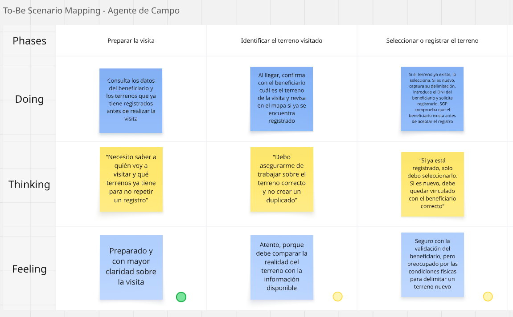

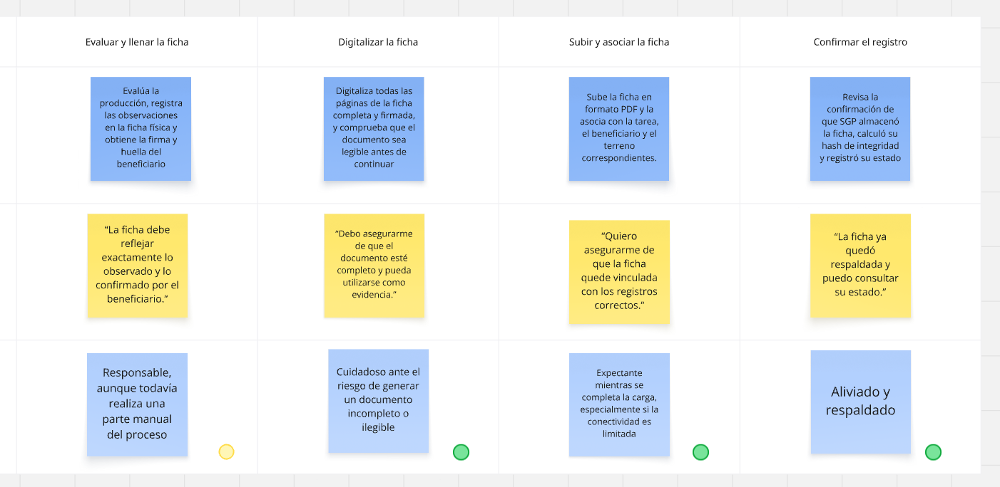

En comparación con el As-Is, el agente puede consultar los terrenos registrados antes de la visita, delimitar uno nuevo con el dispositivo y subir la ficha en formato PDF. Esto reduce los registros duplicados y permite respaldar el documento sin depender únicamente de su traslado físico.

**Asistente de Gerencia General**

El escenario de Rocío Fernández Salas comienza con la búsqueda de una ficha pendiente de revisión. La asistente comprueba la integridad del documento, consulta el beneficiario y el terreno asociados, compara el PDF con los datos extraídos y corrige cualquier diferencia antes de aprobar la ficha. Finalmente, consulta en SGT la actualización de la tarea y su contribución al avance del POI y del PEI.

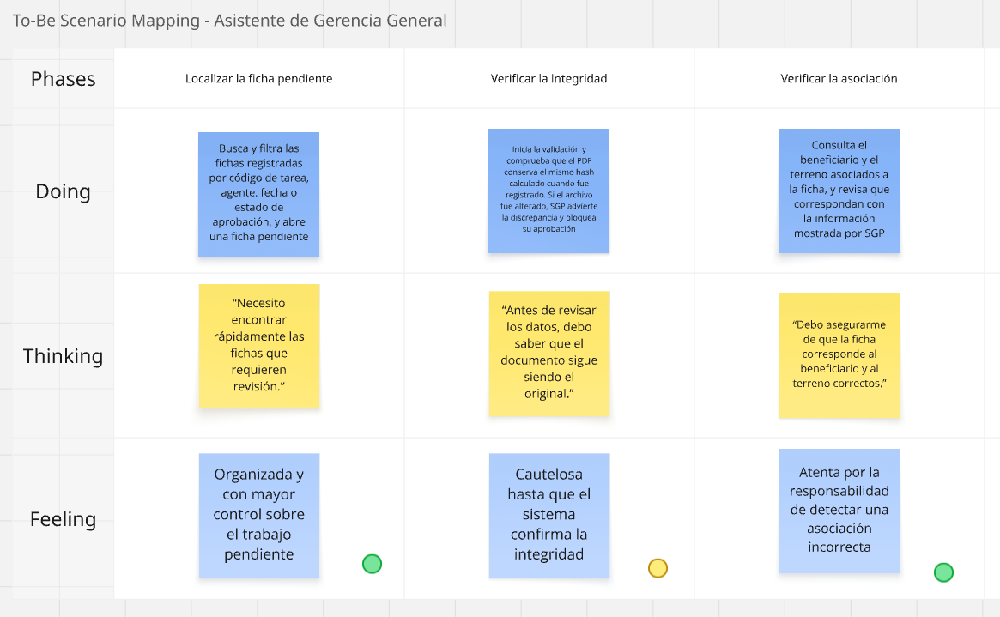

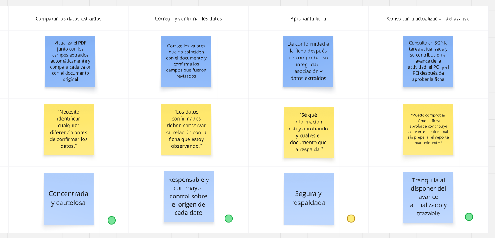

Frente al As-Is, la asistente puede localizar las fichas pendientes y deja de transcribir toda la información para concentrarse en verificar su integridad y sus datos. Después de la aprobación, puede consultar el avance institucional actualizado sin elaborar manualmente el reporte quincenal.

En conjunto, los escenarios conectan el registro realizado en campo con el seguimiento del POI y del PEI. El Agente de Campo conserva la responsabilidad sobre la visita, el terreno y la ficha, mientras que la Asistente de Gerencia General verifica el documento y sus datos antes de aprobarlos.

## User Stories

Se presenta a continuación el conjunto de User Stories planificadas para el alcance del proyecto.

<table style="width: 100%; border-collapse: collapse; border: 1px solid #333; font-family: Arial, sans-serif; font-size: 14px;">
    <thead>
        <tr>
            <th style="border: 1px solid #333; padding: 8px 10px; text-align: left;">Epic / Story ID</th>
            <th style="border: 1px solid #333; padding: 8px 10px; text-align: left;">Título</th>
            <th style="border: 1px solid #333; padding: 8px 10px; text-align: left;">Descripción</th>
            <th style="border: 1px solid #333; padding: 8px 10px; text-align: left;">Criterios de Aceptación</th>
            <th style="border: 1px solid #333; padding: 8px 10px; text-align: left;">Relacionado con (Epic ID)</th>
        </tr>
    </thead>
    <tbody>
        <tr>
            <td style="border: 1px solid #333; padding: 8px 10px; vertical-align: top;">EP-01</td>
            <td style="border: 1px solid #333; padding: 8px 10px; vertical-align: top;">Anexamiento de terrenos</td>
            <td style="border: 1px solid #333; padding: 8px 10px; vertical-align: top;">Registro de los terrenos de los beneficiarios a partir de los puntos capturados durante la visita de campo.</td>
            <td style="border: 1px solid #333; padding: 8px 10px; vertical-align: top;"></td>
            <td style="border: 1px solid #333; padding: 8px 10px; vertical-align: top;"></td>
        </tr>
        <tr>
            <td style="border: 1px solid #333; padding: 8px 10px; vertical-align: top;">EP-02</td>
            <td style="border: 1px solid #333; padding: 8px 10px; vertical-align: top;">Seguimiento de beneficiarios</td>
            <td style="border: 1px solid #333; padding: 8px 10px; vertical-align: top;">Seguimiento de los beneficiarios a partir de las fichas de evaluación que el agente de campo sube al finalizar cada visita.</td>
            <td style="border: 1px solid #333; padding: 8px 10px; vertical-align: top;"></td>
            <td style="border: 1px solid #333; padding: 8px 10px; vertical-align: top;"></td>
        </tr>
        <tr>
            <td style="border: 1px solid #333; padding: 8px 10px; vertical-align: top;">EP-03</td>
            <td style="border: 1px solid #333; padding: 8px 10px; vertical-align: top;">Validación y aprobación de fichas</td>
            <td style="border: 1px solid #333; padding: 8px 10px; vertical-align: top;">Validación y aprobación de las fichas registradas por el asistente de gerencia general.</td>
            <td style="border: 1px solid #333; padding: 8px 10px; vertical-align: top;"></td>
            <td style="border: 1px solid #333; padding: 8px 10px; vertical-align: top;"></td>
        </tr>
        <tr>
            <td style="border: 1px solid #333; padding: 8px 10px; vertical-align: top;">EP-04</td>
            <td style="border: 1px solid #333; padding: 8px 10px; vertical-align: top;">Seguimiento de objetivos estratégicos institucionales</td>
            <td style="border: 1px solid #333; padding: 8px 10px; vertical-align: top;">Seguimiento del avance del POI y del PEI a partir de las tareas registradas.</td>
            <td style="border: 1px solid #333; padding: 8px 10px; vertical-align: top;"></td>
            <td style="border: 1px solid #333; padding: 8px 10px; vertical-align: top;"></td>
        </tr>
        <tr>
            <td style="border: 1px solid #333; padding: 8px 10px; vertical-align: top;">EP-05</td>
            <td style="border: 1px solid #333; padding: 8px 10px; vertical-align: top;">Autenticación</td>
            <td style="border: 1px solid #333; padding: 8px 10px; vertical-align: top;">Acceso al sistema según el rol de cada usuario.</td>
            <td style="border: 1px solid #333; padding: 8px 10px; vertical-align: top;"></td>
            <td style="border: 1px solid #333; padding: 8px 10px; vertical-align: top;"></td>
        </tr>
        <tr>
            <td style="border: 1px solid #333; padding: 8px 10px; vertical-align: top;">SGT-2</td>
            <td style="border: 1px solid #333; padding: 8px 10px; vertical-align: top;">Visualizar con antelación los puntos capturados por la estación total durante la visita</td>
            <td style="border: 1px solid #333; padding: 8px 10px; vertical-align: top;">Como agente de campo georreferenciador, quiero visualizar en el dispositivo los puntos que ya fueron capturados por la estación total mientras recorro el terreno, para detectar y corregir errores de medición antes de finalizar la visita.</td>
            <td style="border: 1px solid #333; padding: 8px 10px; vertical-align: top;">
                <ul>
                    <!-- Criterio BDD -->
                    <li>
                        <strong>Scenario:</strong> Visualización de puntos capturados sin anomalías 
                        <strong>Given</strong> el agente de campo se encuentra en el terreno del beneficiario 
                        <strong>When</strong> la estación total envía la totalidad de los puntos del terreno 
                        <strong>Then</strong> el sistema muestra la posición de cada punto capturado en el mapa 
                    </li>
                </ul>
            </td>
            <td style="border: 1px solid #333; padding: 8px 10px; vertical-align: top;">EP-01</td>
        </tr>
        <tr>
            <td style="border: 1px solid #333; padding: 8px 10px; vertical-align: top;">SGT-3</td>
            <td style="border: 1px solid #333; padding: 8px 10px; vertical-align: top;">Subir la ficha diligenciada para su almacenamiento y verificación de integridad</td>
            <td style="border: 1px solid #333; padding: 8px 10px; vertical-align: top;">Como agente de campo, quiero subir la ficha en formato PDF una vez finalizada la visita, para contar con un respaldo verificable de que quedó registrada tal como la firmé.</td>
            <td style="border: 1px solid #333; padding: 8px 10px; vertical-align: top;">
                <ul>
                    <!-- Criterio BDD -->
                    <li>
                        <strong>Scenario:</strong> Subida de la ficha 
                        <strong>Given</strong> el agente de campo completó el diligenciamiento físico de la ficha 
                        <strong>When</strong> el agente sube la ficha en formato PDF 
                        <strong>Then</strong> el sistema almacena el archivo y calcula su hash de integridad 
                        <strong>And</strong> notifica al agente que la ficha quedó registrada 
                    </li>
                    <!-- Criterio NON-BDD -->
                    <li>El agente puede consultar en cualquier momento el estado de la ficha subida, sin depender de que otra persona se lo confirme.</li>
                </ul>
            </td>
            <td style="border: 1px solid #333; padding: 8px 10px; vertical-align: top;">EP-02</td>
        </tr>
        <tr>
            <td style="border: 1px solid #333; padding: 8px 10px; vertical-align: top;">SGT-4</td>
            <td style="border: 1px solid #333; padding: 8px 10px; vertical-align: top;">Buscar y filtrar las fichas registradas</td>
            <td style="border: 1px solid #333; padding: 8px 10px; vertical-align: top;">Como asistente de gerencia general, quiero buscar y filtrar las fichas registradas por código de tarea, agente de campo, fecha o estado de aprobación, para ubicar rápido las que quedaron con alguna observación pendiente.</td>
            <td style="border: 1px solid #333; padding: 8px 10px; vertical-align: top;">
                <ul>
                    <!-- Criterio BDD -->
                    <li>
                        <strong>Scenario:</strong> Filtrado por estado de aprobación 
                        <strong>Given</strong> el asistente de gerencia general está en el listado de fichas 
                        <strong>When</strong> filtra el listado por estado de aprobación 
                        <strong>Then</strong> el sistema muestra solo las fichas que coinciden con ese estado 
                    </li>
                    <!-- Criterio NON-BDD -->
                    <li>Los filtros por código de tarea, agente de campo y fecha pueden combinarse entre sí en una misma búsqueda.</li>
                </ul>
            </td>
            <td style="border: 1px solid #333; padding: 8px 10px; vertical-align: top;">EP-03</td>
        </tr>
        <tr>
            <td style="border: 1px solid #333; padding: 8px 10px; vertical-align: top;">SGT-5</td>
            <td style="border: 1px solid #333; padding: 8px 10px; vertical-align: top;">Revisar los campos críticos extraídos al validar una ficha</td>
            <td style="border: 1px solid #333; padding: 8px 10px; vertical-align: top;">Como asistente de gerencia general, quiero revisar los campos que el sistema extrajo automáticamente de la ficha antes de aprobarla, para confirmar que coinciden con lo que el documento realmente dice.</td>
            <td style="border: 1px solid #333; padding: 8px 10px; vertical-align: top;">
                <ul>
                    <!-- Criterio BDD -->
                    <li>
                        <strong>Scenario:</strong> Extracción coincide con el documento 
                        <strong>Given</strong> el asistente de gerencia general está revisando una ficha cuyos campos ya fueron extraídos automáticamente 
                        <strong>When</strong> el asistente compara cada campo extraído contra el documento 
                        <strong>Then</strong> el sistema le permite confirmar el campo como correcto 
                    </li>
                    <!-- Criterio BDD -->
                    <li>
                        <strong>Scenario:</strong> Extracción no coincide con el documento 
                        <strong>Given</strong> el asistente de gerencia general está revisando una ficha cuyos campos ya fueron extraídos automáticamente 
                        <strong>When</strong> el asistente detecta que un campo extraído no corresponde a lo que dice el documento 
                        <strong>Then</strong> el sistema le permite corregir ese campo 
                    </li>
                    <!-- Criterio NON-BDD -->
                    <li>El asistente puede ver el documento y el campo extraído uno al lado del otro, sin tener que alternar entre pantallas.</li>
                    <!-- Criterio NON-BDD -->
                    <li>Un campo se considera corregido manualmente si el usuario ingresa un valor diferente del propuesto por la IA.</li>
                </ul>
            </td>
            <td style="border: 1px solid #333; padding: 8px 10px; vertical-align: top;">EP-03</td>
        </tr>
        <tr>
            <td style="border: 1px solid #333; padding: 8px 10px; vertical-align: top;">SGT-6</td>
            <td style="border: 1px solid #333; padding: 8px 10px; vertical-align: top;">Verificar la integridad del documento digitalizado al validar una ficha</td>
            <td style="border: 1px solid #333; padding: 8px 10px; vertical-align: top;">Como asistente de gerencia general, quiero saber si el documento presentado como evidencia de una tarea sigue siendo el mismo que se subió, para no aprobar uno que fue alterado después.</td>
            <td style="border: 1px solid #333; padding: 8px 10px; vertical-align: top;">
                <ul>
                    <!-- Criterio BDD -->
                    <li>
                        <strong>Scenario:</strong> Documento inalterado 
                        <strong>Given</strong> el asistente de gerencia general va a validar la ficha presentada como evidencia de haber completado la tarea 
                        <strong>And</strong> el archivo no ha sido modificado desde que se subió 
                        <strong>When</strong> el asistente inicia la validación del documento 
                        <strong>Then</strong> el sistema confirma que el documento es íntegro 
                    </li>
                    <!-- Criterio BDD -->
                    <li>
                        <strong>Scenario:</strong> Documento alterado 
                        <strong>Given</strong> el asistente de gerencia general va a validar la ficha presentada como evidencia de haber completado la tarea 
                        <strong>And</strong> el archivo fue modificado después de haberse subido 
                        <strong>When</strong> el asistente inicia la validación del documento 
                        <strong>Then</strong> el sistema advierte que el documento fue modificado después de subido 
                        <strong>And</strong> bloquea la aprobación de la ficha hasta que se resuelva la discrepancia 
                    </li>
                </ul>
            </td>
            <td style="border: 1px solid #333; padding: 8px 10px; vertical-align: top;">EP-03</td>
        </tr>
        <tr>
            <td style="border: 1px solid #333; padding: 8px 10px; vertical-align: top;">SGT-7</td>
            <td style="border: 1px solid #333; padding: 8px 10px; vertical-align: top;">Consultar los datos del beneficiario durante la validación de una ficha</td>
            <td style="border: 1px solid #333; padding: 8px 10px; vertical-align: top;">Como asistente de gerencia general, quiero consultar los datos del beneficiario asociado a una ficha mientras la reviso, para tenerlos disponibles sin salir a otro sistema.</td>
            <td style="border: 1px solid #333; padding: 8px 10px; vertical-align: top;">
                <ul>
                    <!-- Criterio BDD -->
                    <li>
                        <strong>Scenario:</strong> Consulta del perfil del beneficiario 
                        <strong>Given</strong> el asistente de gerencia general está revisando una ficha 
                        <strong>When</strong> el asistente consulta los datos del beneficiario asociado a esa ficha 
                        <strong>Then</strong> el sistema muestra el perfil del beneficiario tal como está en el registro que lo origina 
                    </li>
                    <!-- Criterio NON-BDD -->
                    <li>Los datos mostrados se mantienen sincronizados con el registro de beneficiarios, sin traslado manual del dato.</li>
                </ul>
            </td>
            <td style="border: 1px solid #333; padding: 8px 10px; vertical-align: top;">EP-03</td>
        </tr>
        <tr>
            <td style="border: 1px solid #333; padding: 8px 10px; vertical-align: top;">SGT-8</td>
            <td style="border: 1px solid #333; padding: 8px 10px; vertical-align: top;">Buscar y filtrar las tareas registradas</td>
            <td style="border: 1px solid #333; padding: 8px 10px; vertical-align: top;">Como asistente de gerencia general, quiero buscar y filtrar las tareas registradas por código de tarea, actividad, zona, estado de avance o el estado de su entrega, para ver todas las tareas planificadas según el POI y su estado.</td>
            <td style="border: 1px solid #333; padding: 8px 10px; vertical-align: top;">
                <ul>
                    <!-- Criterio BDD -->
                    <li>
                        <strong>Scenario:</strong> Filtrado por estado de avance 
                        <strong>Given</strong> el asistente de gerencia general está en el listado de tareas 
                        <strong>When</strong> filtra el listado por estado de avance 
                        <strong>Then</strong> el sistema muestra solo las tareas que coinciden con ese estado 
                    </li>
                    <!-- Criterio BDD -->
                    <li>
                        <strong>Scenario:</strong> Filtrado por tareas con entrega pendiente de confirmación en cadena 
                        <strong>Given</strong> el asistente de gerencia general está en el listado de tareas 
                        <strong>When</strong> filtra el listado por tareas cuya entrega aún no ha sido confirmada en la cadena de bloques 
                        <strong>Then</strong> el sistema muestra solo esas tareas 
                    </li>
                    <!-- Criterio BDD -->
                    <li>
                        <strong>Scenario:</strong> Filtrado por tareas con entrega lista para validar 
                        <strong>Given</strong> el asistente de gerencia general está en el listado de tareas 
                        <strong>When</strong> filtra el listado por tareas cuya entrega ya fue confirmada en la cadena de bloques 
                        <strong>Then</strong> el sistema muestra solo esas tareas 
                    </li>
                    <!-- Criterio NON-BDD -->
                    <li>Los filtros por código de tarea, actividad y zona pueden combinarse entre sí y con los anteriores en una misma búsqueda.</li>
                </ul>
            </td>
            <td style="border: 1px solid #333; padding: 8px 10px; vertical-align: top;">EP-04</td>
        </tr>
        <tr>
            <td style="border: 1px solid #333; padding: 8px 10px; vertical-align: top;">SGT-9</td>
            <td style="border: 1px solid #333; padding: 8px 10px; vertical-align: top;">Consultar el avance del PEI y del POI según las tareas registradas</td>
            <td style="border: 1px solid #333; padding: 8px 10px; vertical-align: top;">Como asistente de gerencia general, quiero consultar el avance del POI y del PEI calculado a partir de las actividades y tareas registradas, para tener esa información disponible sin depender de armar el reporte manualmente cada quincena.</td>
            <td style="border: 1px solid #333; padding: 8px 10px; vertical-align: top;">
                <ul>
                    <!-- Criterio BDD -->
                    <li>
                        <strong>Scenario:</strong> Consulta del avance por actividad 
                        <strong>Given</strong> el asistente de gerencia general abre el tablero de avance 
                        <strong>When</strong> consulta el avance de una actividad 
                        <strong>Then</strong> el sistema muestra el porcentaje de tareas completadas frente al total planificado para esa actividad 
                        <strong>And</strong> lo refleja en el avance correspondiente del POI y del PEI 
                    </li>
                    <!-- Criterio BDD -->
                    <li>
                        <strong>Scenario:</strong> Trazabilidad del dato agregado 
                        <strong>Given</strong> el asistente de gerencia general está consultando el avance de una actividad 
                        <strong>When</strong> selecciona el porcentaje mostrado 
                        <strong>Then</strong> el sistema muestra las tareas que lo componen 
                    </li>
                    <!-- Criterio BDD -->
                    <li>
                        <strong>Scenario:</strong> Consulta de la tendencia de avance en el tiempo 
                        <strong>Given</strong> el asistente de gerencia general está consultando el avance de una actividad 
                        <strong>When</strong> consulta su evolución en un rango de fechas 
                        <strong>Then</strong> el sistema muestra el porcentaje de avance registrado en cada punto de ese rango 
                        <strong>And</strong> señala si el ritmo de avance se desaceleró respecto al periodo anterior 
                    </li>
                    <!-- Criterio NON-BDD -->
                    <li>El avance se recalcula automáticamente a medida que se aprueban tareas, sin depender de un cierre quincenal manual.</li>
                </ul>
            </td>
            <td style="border: 1px solid #333; padding: 8px 10px; vertical-align: top;">EP-04</td>
        </tr>
        <tr>
            <td style="border: 1px solid #333; padding: 8px 10px; vertical-align: top;">SGT-10</td>
            <td style="border: 1px solid #333; padding: 8px 10px; vertical-align: top;">Iniciar sesión con credenciales institucionales</td>
            <td style="border: 1px solid #333; padding: 8px 10px; vertical-align: top;">Como usuario del sistema, quiero iniciar sesión con mi usuario y contraseña, para acceder solo a las funciones correspondientes a mi rol.</td>
            <td style="border: 1px solid #333; padding: 8px 10px; vertical-align: top;">
                <ul>
                    <!-- Criterio BDD -->
                    <li>
                        <strong>Scenario:</strong> Credenciales válidas 
                        <strong>Given</strong> el usuario cuenta con una cuenta activa en el sistema 
                        <strong>When</strong> ingresa su usuario y contraseña correctos 
                        <strong>Then</strong> el sistema le da acceso a las funciones correspondientes a su rol 
                    </li>
                    <!-- Criterio BDD -->
                    <li>
                        <strong>Scenario:</strong> Credenciales inválidas 
                        <strong>Given</strong> el usuario cuenta con una cuenta activa en el sistema 
                        <strong>When</strong> ingresa un usuario o contraseña incorrectos 
                        <strong>Then</strong> el sistema deniega el acceso 
                        <strong>And</strong> le indica que las credenciales no son válidas 
                    </li>
                    <!-- Criterio NON-BDD -->
                    <li>El sistema no distingue si el error corresponde al usuario o a la contraseña, para no dar pistas ante intentos de acceso no autorizados.</li>
                </ul>
            </td>
            <td style="border: 1px solid #333; padding: 8px 10px; vertical-align: top;">EP-05</td>
        </tr>
        <tr>
            <td style="border: 1px solid #333; padding: 8px 10px; vertical-align: top;">SGT-11</td>
            <td style="border: 1px solid #333; padding: 8px 10px; vertical-align: top;">Cerrar sesión</td>
            <td style="border: 1px solid #333; padding: 8px 10px; vertical-align: top;">Como usuario del sistema, quiero cerrar mi sesión, para que nadie más pueda usar el sistema con mis credenciales si dejo el dispositivo desatendido.</td>
            <td style="border: 1px solid #333; padding: 8px 10px; vertical-align: top;">
                <ul>
                    <!-- Criterio BDD -->
                    <li>
                        <strong>Scenario:</strong> Cierre de sesión 
                        <strong>Given</strong> el usuario tiene una sesión activa 
                        <strong>When</strong> cierra sesión 
                        <strong>Then</strong> el sistema termina la sesión 
                        <strong>And</strong> exige volver a iniciar sesión para continuar usando el sistema 
                    </li>
                </ul>
            </td>
            <td style="border: 1px solid #333; padding: 8px 10px; vertical-align: top;">EP-05</td>
        </tr>
    </tbody>
</table>

## Impact Mapping

El Impact Mapping relaciona los objetivos del negocio con los cambios de comportamiento esperados en los User Persona y con las funcionalidades que SGT debe ofrecer para favorecerlos. Para su elaboración se utilizaron las fichas de Marco Quispe Huamán, Agente de Campo, y Rocío Fernández Salas, Asistente de Gerencia General, junto con las User Stories definidas para el producto.

El equipo partió de los resultados de negocio planteados durante Lean UX y los formuló como objetivos SMART, indicando una mejora medible, una línea base y un plazo de seis meses. Luego identificó qué User Persona puede contribuir a cada objetivo, describió el comportamiento necesario como impacto y propuso los entregables del producto que lo hacen posible. Por último, cada rama se vinculó con las User Stories correspondientes, conservando su redacción en el formato «Como..., quiero..., para...».

Los objetivos definidos fueron reducir en un 20 % el tiempo activo promedio dedicado a procesar cada ficha, disminuir en un 90 % las fichas observadas por inconsistencias y reducir en un 95 % los incidentes de acceso o modificación no autorizados. En los tres casos, el resultado se compara con la línea base levantada antes del piloto y debe alcanzarse al finalizar los primeros seis meses de operación de SGT.

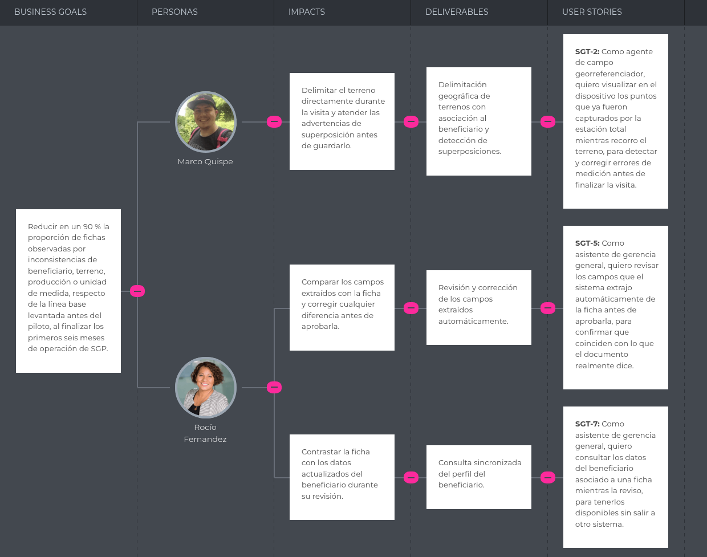

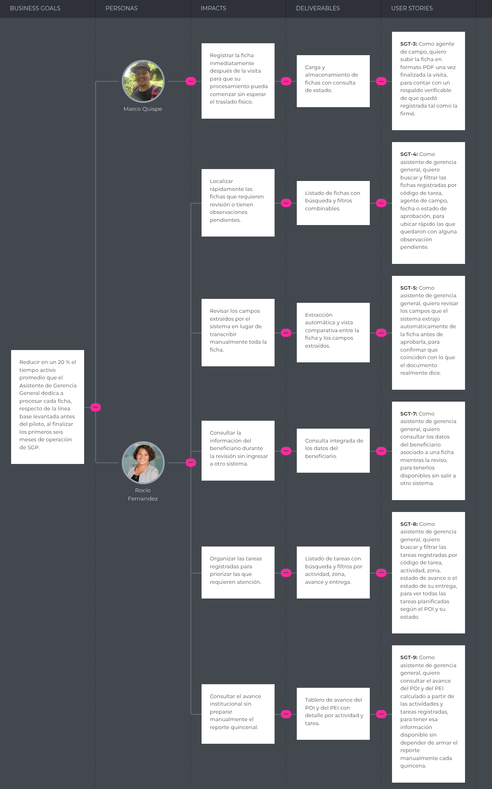

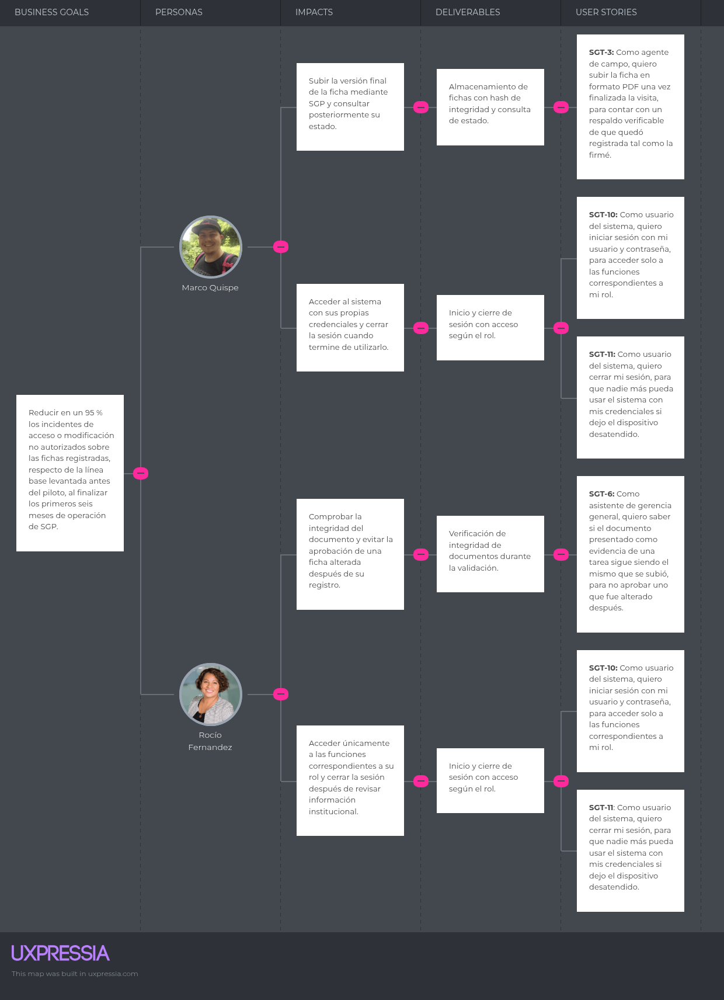

## Product Backlog

Se presentan las historias de usuario priorizadas por dependencia técnica y valor de negocio.

El backlog se mantiene en YouTrack, donde cada historia está registrada como una issue del proyecto SGT. La siguiente captura muestra su estado actual, y el tablero completo puede consultarse en [soulware.youtrack.cloud](https://soulware.youtrack.cloud/issues/SGT).

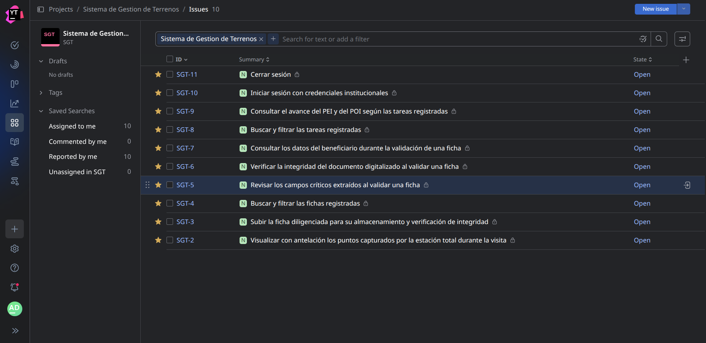

A continuación se detalla el orden de implementación de cada historia.

<table style="width: 100%; border-collapse: collapse; border: 1px solid #333; font-family: Arial, sans-serif; font-size: 14px;">
    <thead>
        <tr>
            <th scope="col" style="border: 1px solid #333; padding: 8px 10px; text-align: left;"># Orden</th>
            <th scope="col" style="border: 1px solid #333; padding: 8px 10px; text-align: left;">User Story ID</th>
            <th scope="col" style="border: 1px solid #333; padding: 8px 10px; text-align: left;">Título</th>
            <th scope="col" style="border: 1px solid #333; padding: 8px 10px; text-align: left;">Descripción</th>
            <th scope="col" style="border: 1px solid #333; padding: 8px 10px; text-align: left;">Story Points</th>
        </tr>
    </thead>
    <tbody>
        <tr>
            <td style="border: 1px solid #333; padding: 8px 10px; vertical-align: top;">1</td>
            <td style="border: 1px solid #333; padding: 8px 10px; vertical-align: top;">SGT-10</td>
            <td style="border: 1px solid #333; padding: 8px 10px; vertical-align: top;">Iniciar sesión con credenciales institucionales</td>
            <td style="border: 1px solid #333; padding: 8px 10px; vertical-align: top;">Como usuario del sistema, quiero iniciar sesión con mi usuario y contraseña, para acceder solo a las funciones correspondientes a mi rol.</td>
            <td style="border: 1px solid #333; padding: 8px 10px; vertical-align: top;">5</td>
        </tr>
        <tr>
            <td style="border: 1px solid #333; padding: 8px 10px; vertical-align: top;">2</td>
            <td style="border: 1px solid #333; padding: 8px 10px; vertical-align: top;">SGT-11</td>
            <td style="border: 1px solid #333; padding: 8px 10px; vertical-align: top;">Cerrar sesión</td>
            <td style="border: 1px solid #333; padding: 8px 10px; vertical-align: top;">Como usuario del sistema, quiero cerrar mi sesión, para que nadie más pueda usar el sistema con mis credenciales si dejo el dispositivo desatendido.</td>
            <td style="border: 1px solid #333; padding: 8px 10px; vertical-align: top;">3</td>
        </tr>
        <tr>
            <td style="border: 1px solid #333; padding: 8px 10px; vertical-align: top;">3</td>
            <td style="border: 1px solid #333; padding: 8px 10px; vertical-align: top;">SGT-2</td>
            <td style="border: 1px solid #333; padding: 8px 10px; vertical-align: top;">Visualizar con antelación los puntos capturados por la estación total durante la visita</td>
            <td style="border: 1px solid #333; padding: 8px 10px; vertical-align: top;">Como agente de campo georreferenciador, quiero visualizar en el dispositivo los puntos que ya fueron capturados por la estación total mientras recorro el terreno, para detectar y corregir errores de medición antes de finalizar la visita.</td>
            <td style="border: 1px solid #333; padding: 8px 10px; vertical-align: top;">5</td>
        </tr>
        <tr>
            <td style="border: 1px solid #333; padding: 8px 10px; vertical-align: top;">4</td>
            <td style="border: 1px solid #333; padding: 8px 10px; vertical-align: top;">SGT-3</td>
            <td style="border: 1px solid #333; padding: 8px 10px; vertical-align: top;">Subir la ficha diligenciada para su almacenamiento y verificación de integridad</td>
            <td style="border: 1px solid #333; padding: 8px 10px; vertical-align: top;">Como agente de campo, quiero subir la ficha en formato PDF una vez finalizada la visita, para contar con un respaldo verificable de que quedó registrada tal como la firmé.</td>
            <td style="border: 1px solid #333; padding: 8px 10px; vertical-align: top;">8</td>
        </tr>
        <tr>
            <td style="border: 1px solid #333; padding: 8px 10px; vertical-align: top;">5</td>
            <td style="border: 1px solid #333; padding: 8px 10px; vertical-align: top;">SGT-6</td>
            <td style="border: 1px solid #333; padding: 8px 10px; vertical-align: top;">Verificar la integridad del documento digitalizado al validar una ficha</td>
            <td style="border: 1px solid #333; padding: 8px 10px; vertical-align: top;">Como asistente de gerencia general, quiero saber si el documento presentado como evidencia de una tarea sigue siendo el mismo que se subió, para no aprobar uno que fue alterado después.</td>
            <td style="border: 1px solid #333; padding: 8px 10px; vertical-align: top;">3</td>
        </tr>
        <tr>
            <td style="border: 1px solid #333; padding: 8px 10px; vertical-align: top;">6</td>
            <td style="border: 1px solid #333; padding: 8px 10px; vertical-align: top;">SGT-5</td>
            <td style="border: 1px solid #333; padding: 8px 10px; vertical-align: top;">Revisar los campos críticos extraídos al validar una ficha</td>
            <td style="border: 1px solid #333; padding: 8px 10px; vertical-align: top;">Como asistente de gerencia general, quiero revisar los campos que el sistema extrajo automáticamente de la ficha antes de aprobarla, para confirmar que coinciden con lo que el documento realmente dice.</td>
            <td style="border: 1px solid #333; padding: 8px 10px; vertical-align: top;">3</td>
        </tr>
        <tr>
            <td style="border: 1px solid #333; padding: 8px 10px; vertical-align: top;">7</td>
            <td style="border: 1px solid #333; padding: 8px 10px; vertical-align: top;">SGT-7</td>
            <td style="border: 1px solid #333; padding: 8px 10px; vertical-align: top;">Consultar los datos del beneficiario durante la validación de una ficha</td>
            <td style="border: 1px solid #333; padding: 8px 10px; vertical-align: top;">Como asistente de gerencia general, quiero consultar los datos del beneficiario asociado a una ficha mientras la reviso, para tenerlos disponibles sin salir a otro sistema.</td>
            <td style="border: 1px solid #333; padding: 8px 10px; vertical-align: top;">2</td>
        </tr>
        <tr>
            <td style="border: 1px solid #333; padding: 8px 10px; vertical-align: top;">8</td>
            <td style="border: 1px solid #333; padding: 8px 10px; vertical-align: top;">SGT-4</td>
            <td style="border: 1px solid #333; padding: 8px 10px; vertical-align: top;">Buscar y filtrar las fichas registradas</td>
            <td style="border: 1px solid #333; padding: 8px 10px; vertical-align: top;">Como asistente de gerencia general, quiero buscar y filtrar las fichas registradas por código de tarea, agente de campo, fecha o estado de aprobación, para ubicar rápido las que quedaron con alguna observación pendiente.</td>
            <td style="border: 1px solid #333; padding: 8px 10px; vertical-align: top;">2</td>
        </tr>
        <tr>
            <td style="border: 1px solid #333; padding: 8px 10px; vertical-align: top;">9</td>
            <td style="border: 1px solid #333; padding: 8px 10px; vertical-align: top;">SGT-8</td>
            <td style="border: 1px solid #333; padding: 8px 10px; vertical-align: top;">Buscar y filtrar las tareas registradas</td>
            <td style="border: 1px solid #333; padding: 8px 10px; vertical-align: top;">Como asistente de gerencia general, quiero buscar y filtrar las tareas registradas por código de tarea, actividad, zona, estado de avance o el estado de su entrega, para ver todas las tareas planificadas según el POI y su estado.</td>
            <td style="border: 1px solid #333; padding: 8px 10px; vertical-align: top;">2</td>
        </tr>
        <tr>
            <td style="border: 1px solid #333; padding: 8px 10px; vertical-align: top;">10</td>
            <td style="border: 1px solid #333; padding: 8px 10px; vertical-align: top;">SGT-9</td>
            <td style="border: 1px solid #333; padding: 8px 10px; vertical-align: top;">Consultar el avance del PEI y del POI según las tareas registradas</td>
            <td style="border: 1px solid #333; padding: 8px 10px; vertical-align: top;">Como asistente de gerencia general, quiero consultar el avance del POI y del PEI calculado a partir de las actividades y tareas registradas, para tener esa información disponible sin depender de armar el reporte manualmente cada quincena.</td>
            <td style="border: 1px solid #333; padding: 8px 10px; vertical-align: top;">2</td>
        </tr>
    </tbody>
</table>

# Capítulo IV: Strategic-Level Software Design

## Strategic-Level Attribute-Driven Design

### Design Purpose

El programa de apoyo agrícola opera hoy con procesos manuales, sistemas aislados entre sí y un apego al papel como fuente de verdad. El propósito de este diseño es definir una arquitectura para SGT que reduzca esa carga con mejoras puntuales sobre el flujo existente, cada una respaldada por una User Story del Product Backlog.

Las mejoras por segmento objetivo son las siguientes.

**Agente de campo georreferenciador**
- Detecta y corrige los errores de medición durante la misma visita.
- Cuenta con un respaldo verificable de su trabajo.

**Funcionario administrativo**
- Ubica con rapidez las fichas y tareas que requieren atención.
- Verifica los datos extraídos en lugar de transcribir cada ficha.
- Toma decisiones con la certeza de la integridad de los documentos.
- Dispone de los datos necesarios para tomar decisiones en un solo lugar.
- Obtiene el avance del POI y del PEI sin elaborar el reporte manualmente cada quincena.

### Attribute-Driven Design Inputs

Esta sección reúne los tres tipos de Input que alimentan el proceso de Attribute-Driven Design. La funcionalidad primaria selecciona las User Stories con mayor impacto sobre la arquitectura, los Quality Attribute Scenarios recogen la primera versión de los atributos de calidad que la solución debe satisfacer, y los Constraints establecen las restricciones impuestas por el negocio que el diseño debe respetar.

#### Primary Functionality (Primary User Stories)

Se identifica las funcionalidades prioritarias para el usuario, con las cuales se trabajara para identificar los atributos de calidad en secciones posteriores.

<table style="width: 100%; border-collapse: collapse; border: 1px solid #333; font-family: Arial, sans-serif; font-size: 14px;">
    <thead>
        <tr>
            <th style="border: 1px solid #333; padding: 8px 10px; text-align: left;">Epic / Story ID</th>
            <th style="border: 1px solid #333; padding: 8px 10px; text-align: left;">Título</th>
            <th style="border: 1px solid #333; padding: 8px 10px; text-align: left;">Descripción</th>
            <th style="border: 1px solid #333; padding: 8px 10px; text-align: left;">Criterios de Aceptación</th>
            <th style="border: 1px solid #333; padding: 8px 10px; text-align: left;">Relacionado con (Epic ID)</th>
        </tr>
    </thead>
    <tbody>
        <tr>
            <td style="border: 1px solid #333; padding: 8px 10px; vertical-align: top;">SGT-2</td>
            <td style="border: 1px solid #333; padding: 8px 10px; vertical-align: top;">Visualizar con antelación los puntos capturados por la estación total durante la visita</td>
            <td style="border: 1px solid #333; padding: 8px 10px; vertical-align: top;">Como agente de campo georreferenciador, quiero visualizar en el dispositivo los puntos que ya fueron capturados por la estación total mientras recorro el terreno, para detectar y corregir errores de medición antes de finalizar la visita.</td>
            <td style="border: 1px solid #333; padding: 8px 10px; vertical-align: top;">
                <ul>
                    <!-- Criterio BDD -->
                    <li>
                        <strong>Scenario:</strong> Visualización de puntos capturados sin anomalías 
                        <strong>Given</strong> el agente de campo se encuentra en el terreno del beneficiario 
                        <strong>When</strong> la estación total envía la totalidad de los puntos del terreno 
                        <strong>Then</strong> el sistema muestra la posición de cada punto capturado en el mapa 
                    </li>
                </ul>
            </td>
            <td style="border: 1px solid #333; padding: 8px 10px; vertical-align: top;">EP-01</td>
        </tr>
        <tr>
            <td style="border: 1px solid #333; padding: 8px 10px; vertical-align: top;">SGT-3</td>
            <td style="border: 1px solid #333; padding: 8px 10px; vertical-align: top;">Subir la ficha diligenciada para su almacenamiento y verificación de integridad</td>
            <td style="border: 1px solid #333; padding: 8px 10px; vertical-align: top;">Como agente de campo, quiero subir la ficha en formato PDF una vez finalizada la visita, para contar con un respaldo verificable de que quedó registrada tal como la firmé.</td>
            <td style="border: 1px solid #333; padding: 8px 10px; vertical-align: top;">
                <ul>
                    <!-- Criterio BDD -->
                    <li>
                        <strong>Scenario:</strong> Subida de la ficha 
                        <strong>Given</strong> el agente de campo completó el diligenciamiento físico de la ficha 
                        <strong>When</strong> el agente sube la ficha en formato PDF 
                        <strong>Then</strong> el sistema almacena el archivo y calcula su hash de integridad 
                        <strong>And</strong> notifica al agente que la ficha quedó registrada 
                    </li>
                    <!-- Criterio NON-BDD -->
                    <li>El agente puede consultar en cualquier momento el estado de la ficha subida, sin depender de que otra persona se lo confirme.</li>
                </ul>
            </td>
            <td style="border: 1px solid #333; padding: 8px 10px; vertical-align: top;">EP-02</td>
        </tr>
        <tr>
            <td style="border: 1px solid #333; padding: 8px 10px; vertical-align: top;">SGT-5</td>
            <td style="border: 1px solid #333; padding: 8px 10px; vertical-align: top;">Revisar los campos críticos extraídos al validar una ficha</td>
            <td style="border: 1px solid #333; padding: 8px 10px; vertical-align: top;">Como asistente de gerencia general, quiero revisar los campos que el sistema extrajo automáticamente de la ficha antes de aprobarla, para confirmar que coinciden con lo que el documento realmente dice.</td>
            <td style="border: 1px solid #333; padding: 8px 10px; vertical-align: top;">
                <ul>
                    <!-- Criterio BDD -->
                    <li>
                        <strong>Scenario:</strong> Extracción coincide con el documento 
                        <strong>Given</strong> el asistente de gerencia general está revisando una ficha cuyos campos ya fueron extraídos automáticamente 
                        <strong>When</strong> el asistente compara cada campo extraído contra el documento 
                        <strong>Then</strong> el sistema le permite confirmar el campo como correcto 
                    </li>
                    <!-- Criterio BDD -->
                    <li>
                        <strong>Scenario:</strong> Extracción no coincide con el documento 
                        <strong>Given</strong> el asistente de gerencia general está revisando una ficha cuyos campos ya fueron extraídos automáticamente 
                        <strong>When</strong> el asistente detecta que un campo extraído no corresponde a lo que dice el documento 
                        <strong>Then</strong> el sistema le permite corregir ese campo 
                    </li>
                    <!-- Criterio NON-BDD -->
                    <li>El asistente puede ver el documento y el campo extraído uno al lado del otro, sin tener que alternar entre pantallas.</li>
                    <!-- Criterio NON-BDD -->
                    <li>Un campo se considera corregido manualmente si el usuario ingresa un valor diferente del propuesto por la IA.</li>
                </ul>
            </td>
            <td style="border: 1px solid #333; padding: 8px 10px; vertical-align: top;">EP-03</td>
        </tr>
        <tr>
            <td style="border: 1px solid #333; padding: 8px 10px; vertical-align: top;">SGT-6</td>
            <td style="border: 1px solid #333; padding: 8px 10px; vertical-align: top;">Verificar la integridad del documento digitalizado al validar una ficha</td>
            <td style="border: 1px solid #333; padding: 8px 10px; vertical-align: top;">Como asistente de gerencia general, quiero saber si el documento presentado como evidencia de una tarea sigue siendo el mismo que se subió, para no aprobar uno que fue alterado después.</td>
            <td style="border: 1px solid #333; padding: 8px 10px; vertical-align: top;">
                <ul>
                    <!-- Criterio BDD -->
                    <li>
                        <strong>Scenario:</strong> Documento inalterado 
                        <strong>Given</strong> el asistente de gerencia general va a validar la ficha presentada como evidencia de haber completado la tarea 
                        <strong>And</strong> el archivo no ha sido modificado desde que se subió 
                        <strong>When</strong> el asistente inicia la validación del documento 
                        <strong>Then</strong> el sistema confirma que el documento es íntegro 
                    </li>
                    <!-- Criterio BDD -->
                    <li>
                        <strong>Scenario:</strong> Documento alterado 
                        <strong>Given</strong> el asistente de gerencia general va a validar la ficha presentada como evidencia de haber completado la tarea 
                        <strong>And</strong> el archivo fue modificado después de haberse subido 
                        <strong>When</strong> el asistente inicia la validación del documento 
                        <strong>Then</strong> el sistema advierte que el documento fue modificado después de subido 
                        <strong>And</strong> bloquea la aprobación de la ficha hasta que se resuelva la discrepancia 
                    </li>
                </ul>
            </td>
            <td style="border: 1px solid #333; padding: 8px 10px; vertical-align: top;">EP-03</td>
        </tr>
        <tr>
            <td style="border: 1px solid #333; padding: 8px 10px; vertical-align: top;">SGT-10</td>
            <td style="border: 1px solid #333; padding: 8px 10px; vertical-align: top;">Iniciar sesión con credenciales institucionales</td>
            <td style="border: 1px solid #333; padding: 8px 10px; vertical-align: top;">Como usuario del sistema, quiero iniciar sesión con mi usuario y contraseña, para acceder solo a las funciones correspondientes a mi rol.</td>
            <td style="border: 1px solid #333; padding: 8px 10px; vertical-align: top;">
                <ul>
                    <!-- Criterio BDD -->
                    <li>
                        <strong>Scenario:</strong> Credenciales válidas 
                        <strong>Given</strong> el usuario cuenta con una cuenta activa en el sistema 
                        <strong>When</strong> ingresa su usuario y contraseña correctos 
                        <strong>Then</strong> el sistema le da acceso a las funciones correspondientes a su rol 
                    </li>
                    <!-- Criterio BDD -->
                    <li>
                        <strong>Scenario:</strong> Credenciales inválidas 
                        <strong>Given</strong> el usuario cuenta con una cuenta activa en el sistema 
                        <strong>When</strong> ingresa un usuario o contraseña incorrectos 
                        <strong>Then</strong> el sistema deniega el acceso 
                        <strong>And</strong> le indica que las credenciales no son válidas 
                    </li>
                    <!-- Criterio NON-BDD -->
                    <li>El sistema no distingue si el error corresponde al usuario o a la contraseña, para no dar pistas ante intentos de acceso no autorizados.</li>
                </ul>
            </td>
            <td style="border: 1px solid #333; padding: 8px 10px; vertical-align: top;">EP-05</td>
        </tr>
    </tbody>
</table>

#### Quality attribute Scenarios

    <table style="width: 100%; border-collapse: collapse; border: 1px solid #333;">
        <thead>
            <tr>
                <th style="border: 1px solid #333; padding: 8px 10px; text-align: left;">Atributo</th>
                <th style="border: 1px solid #333; padding: 8px 10px; text-align: left;">Fuente</th>
                <th style="border: 1px solid #333; padding: 8px 10px; text-align: left;">Estímulo</th>
                <th style="border: 1px solid #333; padding: 8px 10px; text-align: left;">Artefacto</th>
                <th style="border: 1px solid #333; padding: 8px 10px; text-align: left;">Entorno</th>
                <th style="border: 1px solid #333; padding: 8px 10px; text-align: left;">Respuesta</th>
                <th style="border: 1px solid #333; padding: 8px 10px; text-align: left;">Medida</th>
            </tr>
        </thead>
        <tbody>
            <tr>
                <td style="border: 1px solid #333; padding: 10px; vertical-align: top; text-align: left;">Seguridad</td>
                <td style="border: 1px solid #333; padding: 10px; vertical-align: top; text-align: left;">Externo</td>
                <td style="border: 1px solid #333; padding: 10px; vertical-align: top; text-align: left;">Tratar de modificar informe de beneficiario</td>
                <td style="border: 1px solid #333; padding: 10px; vertical-align: top; text-align: left;">Informe protegido con Blockchain</td>
                <td style="border: 1px solid #333; padding: 10px; vertical-align: top; text-align: left;">Operatividad</td>
                <td style="border: 1px solid #333; padding: 10px; vertical-align: top; text-align: left;">Veces que el documento original se modifico sin aprobación</td>
                <td style="border: 1px solid #333; padding: 10px; vertical-align: top; text-align: left;">= 0</td>
            </tr>
            <tr>
                <td style="border: 1px solid #333; padding: 10px; vertical-align: top; text-align: left;">Usabilidad</td>
                <td style="border: 1px solid #333; padding: 10px; vertical-align: top; text-align: left;">Usuario</td>
                <td style="border: 1px solid #333; padding: 10px; vertical-align: top; text-align: left;">Consulta de terreno de beneficiarios por primera vez</td>
                <td style="border: 1px solid #333; padding: 10px; vertical-align: top; text-align: left;">Mapa interactivo</td>
                <td style="border: 1px solid #333; padding: 10px; vertical-align: top; text-align: left;">Operatividad</td>
                <td style="border: 1px solid #333; padding: 10px; vertical-align: top; text-align: left;">Tiempo para entender el flujo de consulta</td>
                <td style="border: 1px solid #333; padding: 10px; vertical-align: top; text-align: left;">&lt;5 minutos</td>
            </tr>
            <tr>
                <td style="border: 1px solid #333; padding: 10px; vertical-align: top; text-align: left;">Interoperabilidad</td>
                <td style="border: 1px solid #333; padding: 10px; vertical-align: top; text-align: left;">Sistema</td>
                <td style="border: 1px solid #333; padding: 10px; vertical-align: top; text-align: left;">Consulta de información a otros sistemas</td>
                <td style="border: 1px solid #333; padding: 10px; vertical-align: top; text-align: left;">API de integración</td>
                <td style="border: 1px solid #333; padding: 10px; vertical-align: top; text-align: left;">Operatividad</td>
                <td style="border: 1px solid #333; padding: 10px; vertical-align: top; text-align: left;">Sistemas legados que interoperan con la solución</td>
                <td style="border: 1px solid #333; padding: 10px; vertical-align: top; text-align: left;">&gt; 1</td>
            </tr>
        </tbody>
    </table>

#### Constraints

Las restricciones provienen de las entrevistas de elicitación y limitan las decisiones de diseño.

    <table style="width: 100%; border-collapse: collapse; border: 1px solid #333;">
        <thead>
            <tr>
                <th style="border: 1px solid #333; padding: 8px 10px; text-align: left;">Technical Story ID</th>
                <th style="border: 1px solid #333; padding: 8px 10px; text-align: left;">Título</th>
                <th style="border: 1px solid #333; padding: 8px 10px; text-align: left;">Descripción</th>
                <th style="border: 1px solid #333; padding: 8px 10px; text-align: left;">Criterios de Aceptación</th>
                <th style="border: 1px solid #333; padding: 8px 10px; text-align: left;">Relacionado con (Epic ID)</th>
            </tr>
        </thead>
        <tbody>
            <tr>
                <td style="border: 1px solid #333; padding: 10px; vertical-align: top; text-align: left;">TS-01</td>
                <td style="border: 1px solid #333; padding: 10px; vertical-align: top; text-align: left;">Datos de beneficiarios dentro de la institución</td>
                <td style="border: 1px solid #333; padding: 10px; vertical-align: top; text-align: left;">Los datos de los beneficiarios no pueden enviarse a servicios en la nube, por una restricción institucional.</td>
                <td style="border: 1px solid #333; padding: 10px; vertical-align: top; text-align: left;">Ningún componente que procese o almacene datos de beneficiarios se ejecuta en un servicio externo a la institución.</td>
                <td style="border: 1px solid #333; padding: 10px; vertical-align: top; text-align: left;">EP-02, EP-03</td>
            </tr>
            <tr>
                <td style="border: 1px solid #333; padding: 10px; vertical-align: top; text-align: left;">TS-02</td>
                <td style="border: 1px solid #333; padding: 10px; vertical-align: top; text-align: left;">Ficha física firmada como documento oficial</td>
                <td style="border: 1px solid #333; padding: 10px; vertical-align: top; text-align: left;">El acta física firmada es la fuente de valor oficial del expediente, por lo que el sistema conserva su versión digitalizada en PDF como respaldo.</td>
                <td style="border: 1px solid #333; padding: 10px; vertical-align: top; text-align: left;">Toda ficha registrada conserva el PDF subido sin modificaciones y su hash de integridad.</td>
                <td style="border: 1px solid #333; padding: 10px; vertical-align: top; text-align: left;">EP-02</td>
            </tr>
        </tbody>
    </table>

### Architectural Drivers Backlog

El backlog de drivers se construyó a partir de las User Stories de Primary Functionality, los Quality Attribute Scenarios y los Constraints. Cada driver se calificó según su importancia para los stakeholders y su impacto en la complejidad técnica de la arquitectura, y la tabla ordena primero los de importancia e impacto altos.

    <table style="width: 100%; border-collapse: collapse; border: 1px solid #333;">
        <thead>
            <tr>
                <th style="border: 1px solid #333; padding: 8px 10px; text-align: left;">Driver ID</th>
                <th style="border: 1px solid #333; padding: 8px 10px; text-align: left;">Título de Driver</th>
                <th style="border: 1px solid #333; padding: 8px 10px; text-align: left;">Descripción</th>
                <th style="border: 1px solid #333; padding: 8px 10px; text-align: left;">Importancia para Stakeholders</th>
                <th style="border: 1px solid #333; padding: 8px 10px; text-align: left;">Impacto en Architecture Technical Complexity</th>
            </tr>
        </thead>
        <tbody>
            <tr>
                <td style="border: 1px solid #333; padding: 10px; vertical-align: top; text-align: left;">DRV-01</td>
                <td style="border: 1px solid #333; padding: 10px; vertical-align: top; text-align: left;">Integridad de las fichas subidas</td>
                <td style="border: 1px solid #333; padding: 10px; vertical-align: top; text-align: left;">Detectar cualquier modificación de una ficha después de su subida (SGT-3, SGT-6, escenario de Seguridad).</td>
                <td style="border: 1px solid #333; padding: 10px; vertical-align: top; text-align: left;">High</td>
                <td style="border: 1px solid #333; padding: 10px; vertical-align: top; text-align: left;">High</td>
            </tr>
            <tr>
                <td style="border: 1px solid #333; padding: 10px; vertical-align: top; text-align: left;">DRV-02</td>
                <td style="border: 1px solid #333; padding: 10px; vertical-align: top; text-align: left;">Datos de beneficiarios dentro de la institución</td>
                <td style="border: 1px solid #333; padding: 10px; vertical-align: top; text-align: left;">Procesar y almacenar los datos de beneficiarios sin usar servicios en la nube (TS-01).</td>
                <td style="border: 1px solid #333; padding: 10px; vertical-align: top; text-align: left;">High</td>
                <td style="border: 1px solid #333; padding: 10px; vertical-align: top; text-align: left;">High</td>
            </tr>
            <tr>
                <td style="border: 1px solid #333; padding: 10px; vertical-align: top; text-align: left;">DRV-03</td>
                <td style="border: 1px solid #333; padding: 10px; vertical-align: top; text-align: left;">Interoperabilidad con otros sistemas</td>
                <td style="border: 1px solid #333; padding: 10px; vertical-align: top; text-align: left;">Consultar información de más de un sistema institucional mediante una API de integración (escenario de Interoperabilidad).</td>
                <td style="border: 1px solid #333; padding: 10px; vertical-align: top; text-align: left;">High</td>
                <td style="border: 1px solid #333; padding: 10px; vertical-align: top; text-align: left;">High</td>
            </tr>
            <tr>
                <td style="border: 1px solid #333; padding: 10px; vertical-align: top; text-align: left;">DRV-04</td>
                <td style="border: 1px solid #333; padding: 10px; vertical-align: top; text-align: left;">Extracción automática de campos de la ficha</td>
                <td style="border: 1px solid #333; padding: 10px; vertical-align: top; text-align: left;">Extraer los campos críticos de la ficha para su revisión y corrección por el asistente (SGT-5).</td>
                <td style="border: 1px solid #333; padding: 10px; vertical-align: top; text-align: left;">High</td>
                <td style="border: 1px solid #333; padding: 10px; vertical-align: top; text-align: left;">High</td>
            </tr>
            <tr>
                <td style="border: 1px solid #333; padding: 10px; vertical-align: top; text-align: left;">DRV-05</td>
                <td style="border: 1px solid #333; padding: 10px; vertical-align: top; text-align: left;">Acceso según el rol del usuario</td>
                <td style="border: 1px solid #333; padding: 10px; vertical-align: top; text-align: left;">Restringir las funciones disponibles según el rol de cada usuario (SGT-10).</td>
                <td style="border: 1px solid #333; padding: 10px; vertical-align: top; text-align: left;">High</td>
                <td style="border: 1px solid #333; padding: 10px; vertical-align: top; text-align: left;">Medium</td>
            </tr>
            <tr>
                <td style="border: 1px solid #333; padding: 10px; vertical-align: top; text-align: left;">DRV-06</td>
                <td style="border: 1px solid #333; padding: 10px; vertical-align: top; text-align: left;">Visualización de puntos capturados</td>
                <td style="border: 1px solid #333; padding: 10px; vertical-align: top; text-align: left;">Mostrar en un mapa interactivo los puntos enviados por la estación total (SGT-2, escenario de Usabilidad).</td>
                <td style="border: 1px solid #333; padding: 10px; vertical-align: top; text-align: left;">Medium</td>
                <td style="border: 1px solid #333; padding: 10px; vertical-align: top; text-align: left;">Medium</td>
            </tr>
            <tr>
                <td style="border: 1px solid #333; padding: 10px; vertical-align: top; text-align: left;">DRV-07</td>
                <td style="border: 1px solid #333; padding: 10px; vertical-align: top; text-align: left;">Conservación de la ficha oficial</td>
                <td style="border: 1px solid #333; padding: 10px; vertical-align: top; text-align: left;">Conservar el PDF de la ficha firmada como respaldo del expediente (TS-02).</td>
                <td style="border: 1px solid #333; padding: 10px; vertical-align: top; text-align: left;">Medium</td>
                <td style="border: 1px solid #333; padding: 10px; vertical-align: top; text-align: left;">Low</td>
            </tr>
        </tbody>
    </table>

### Architectural Design Decisions

Primera iteración de ADD, sobre los drivers de importancia e impacto altos: DRV-01, DRV-02 y DRV-03. Cada patrón se evaluó por cumplimiento del driver, cumplimiento de los Constraints y esfuerzo de implementación.

DRV-01: se selecciona el hash del PDF almacenado con el registro de la ficha (SGT-3 y SGT-6), porque cumple la medida de cero modificaciones no detectadas con el menor esfuerzo.

DRV-02: se selecciona el despliegue on-premise, porque es el único que cumple TS-01 sin condiciones adicionales.

DRV-03: se selecciona un adaptador por sistema externo detrás de la API de integración, porque aísla los cambios de cada sistema.

Candidate Pattern Evaluation Matrix:

    <table style="width: 100%; border-collapse: collapse; border: 1px solid #333;">
        <thead>
            <tr>
                <th style="border: 1px solid #333; padding: 8px 10px; text-align: left;">Driver ID</th>
                <th style="border: 1px solid #333; padding: 8px 10px; text-align: left;">Título de Driver</th>
                <th style="border: 1px solid #333; padding: 8px 10px; text-align: left;">Patrón</th>
                <th style="border: 1px solid #333; padding: 8px 10px; text-align: left;">Pro</th>
                <th style="border: 1px solid #333; padding: 8px 10px; text-align: left;">Con</th>
            </tr>
        </thead>
        <tbody>
            <tr>
                <td style="border: 1px solid #333; padding: 10px; vertical-align: top; text-align: left;">DRV-01</td>
                <td style="border: 1px solid #333; padding: 10px; vertical-align: top; text-align: left;">Integridad de las fichas subidas</td>
                <td style="border: 1px solid #333; padding: 10px; vertical-align: top; text-align: left;">Hash almacenado con el registro</td>
                <td style="border: 1px solid #333; padding: 10px; vertical-align: top; text-align: left;">Cumple SGT-3 y SGT-6 con bajo esfuerzo.</td>
                <td style="border: 1px solid #333; padding: 10px; vertical-align: top; text-align: left;">Depende de que la base de datos no sea alterada.</td>
            </tr>
            <tr>
                <td style="border: 1px solid #333; padding: 10px; vertical-align: top; text-align: left;">DRV-01</td>
                <td style="border: 1px solid #333; padding: 10px; vertical-align: top; text-align: left;">Integridad de las fichas subidas</td>
                <td style="border: 1px solid #333; padding: 10px; vertical-align: top; text-align: left;">Registro con Blockchain</td>
                <td style="border: 1px solid #333; padding: 10px; vertical-align: top; text-align: left;">Hace inalterable el registro de la ficha.</td>
                <td style="border: 1px solid #333; padding: 10px; vertical-align: top; text-align: left;">Exige infraestructura adicional y mayor esfuerzo.</td>
            </tr>
            <tr>
                <td style="border: 1px solid #333; padding: 10px; vertical-align: top; text-align: left;">DRV-01</td>
                <td style="border: 1px solid #333; padding: 10px; vertical-align: top; text-align: left;">Integridad de las fichas subidas</td>
                <td style="border: 1px solid #333; padding: 10px; vertical-align: top; text-align: left;">Almacenamiento de solo escritura</td>
                <td style="border: 1px solid #333; padding: 10px; vertical-align: top; text-align: left;">Impide sobrescribir el archivo subido.</td>
                <td style="border: 1px solid #333; padding: 10px; vertical-align: top; text-align: left;">No permite verificar que el archivo sea el original.</td>
            </tr>
            <tr>
                <td style="border: 1px solid #333; padding: 10px; vertical-align: top; text-align: left;">DRV-02</td>
                <td style="border: 1px solid #333; padding: 10px; vertical-align: top; text-align: left;">Datos de beneficiarios dentro de la institución</td>
                <td style="border: 1px solid #333; padding: 10px; vertical-align: top; text-align: left;">Despliegue on-premise</td>
                <td style="border: 1px solid #333; padding: 10px; vertical-align: top; text-align: left;">Cumple TS-01.</td>
                <td style="border: 1px solid #333; padding: 10px; vertical-align: top; text-align: left;">Requiere infraestructura y mantenimiento propios.</td>
            </tr>
            <tr>
                <td style="border: 1px solid #333; padding: 10px; vertical-align: top; text-align: left;">DRV-02</td>
                <td style="border: 1px solid #333; padding: 10px; vertical-align: top; text-align: left;">Datos de beneficiarios dentro de la institución</td>
                <td style="border: 1px solid #333; padding: 10px; vertical-align: top; text-align: left;">Despliegue híbrido</td>
                <td style="border: 1px solid #333; padding: 10px; vertical-align: top; text-align: left;">Aprovecha la nube para componentes sin datos de beneficiarios.</td>
                <td style="border: 1px solid #333; padding: 10px; vertical-align: top; text-align: left;">Requiere separar y controlar qué datos salen.</td>
            </tr>
            <tr>
                <td style="border: 1px solid #333; padding: 10px; vertical-align: top; text-align: left;">DRV-02</td>
                <td style="border: 1px solid #333; padding: 10px; vertical-align: top; text-align: left;">Datos de beneficiarios dentro de la institución</td>
                <td style="border: 1px solid #333; padding: 10px; vertical-align: top; text-align: left;">Nube con anonimización</td>
                <td style="border: 1px solid #333; padding: 10px; vertical-align: top; text-align: left;">Reduce el costo de infraestructura.</td>
                <td style="border: 1px solid #333; padding: 10px; vertical-align: top; text-align: left;">Puede incumplir TS-01.</td>
            </tr>
            <tr>
                <td style="border: 1px solid #333; padding: 10px; vertical-align: top; text-align: left;">DRV-03</td>
                <td style="border: 1px solid #333; padding: 10px; vertical-align: top; text-align: left;">Interoperabilidad con otros sistemas</td>
                <td style="border: 1px solid #333; padding: 10px; vertical-align: top; text-align: left;">Adaptador por sistema externo</td>
                <td style="border: 1px solid #333; padding: 10px; vertical-align: top; text-align: left;">Aísla los cambios de cada sistema.</td>
                <td style="border: 1px solid #333; padding: 10px; vertical-align: top; text-align: left;">Añade un componente por cada sistema integrado.</td>
            </tr>
            <tr>
                <td style="border: 1px solid #333; padding: 10px; vertical-align: top; text-align: left;">DRV-03</td>
                <td style="border: 1px solid #333; padding: 10px; vertical-align: top; text-align: left;">Interoperabilidad con otros sistemas</td>
                <td style="border: 1px solid #333; padding: 10px; vertical-align: top; text-align: left;">Integración punto a punto</td>
                <td style="border: 1px solid #333; padding: 10px; vertical-align: top; text-align: left;">Es la más simple de implementar.</td>
                <td style="border: 1px solid #333; padding: 10px; vertical-align: top; text-align: left;">El acoplamiento crece con cada sistema nuevo.</td>
            </tr>
            <tr>
                <td style="border: 1px solid #333; padding: 10px; vertical-align: top; text-align: left;">DRV-03</td>
                <td style="border: 1px solid #333; padding: 10px; vertical-align: top; text-align: left;">Interoperabilidad con otros sistemas</td>
                <td style="border: 1px solid #333; padding: 10px; vertical-align: top; text-align: left;">Bus de servicios empresariales</td>
                <td style="border: 1px solid #333; padding: 10px; vertical-align: top; text-align: left;">Centraliza la integración.</td>
                <td style="border: 1px solid #333; padding: 10px; vertical-align: top; text-align: left;">Introduce una infraestructura pesada para pocos sistemas.</td>
            </tr>
        </tbody>
    </table>

### Quality Attribute Scenario Refinements

Se refinan los Quality Attribute Scenarios de Primary Functionality, en orden de prioridad según el Architectural Drivers Backlog. Cada cuadro completa los campos del escenario y registra las preguntas que quedan abiertas.

Refinamiento 1: Seguridad

    <table style="width: 100%; border-collapse: collapse; border: 1px solid #333;">
        <thead>
            <tr>
                <th style="border: 1px solid #333; padding: 8px 10px; text-align: left;">Campo</th>
                <th style="border: 1px solid #333; padding: 8px 10px; text-align: left;">Contenido</th>
            </tr>
        </thead>
        <tbody>
            <tr>
                <td style="border: 1px solid #333; padding: 10px; vertical-align: top; text-align: left;">Scenario(s)</td>
                <td style="border: 1px solid #333; padding: 10px; vertical-align: top; text-align: left;">Intento de modificar una ficha ya subida.</td>
            </tr>
            <tr>
                <td style="border: 1px solid #333; padding: 10px; vertical-align: top; text-align: left;">Business Goals</td>
                <td style="border: 1px solid #333; padding: 10px; vertical-align: top; text-align: left;">Que la ficha aprobada coincida con la que subió el agente de campo (SGT-3, SGT-6).</td>
            </tr>
            <tr>
                <td style="border: 1px solid #333; padding: 10px; vertical-align: top; text-align: left;">Relevant Quality Attributes</td>
                <td style="border: 1px solid #333; padding: 10px; vertical-align: top; text-align: left;">Seguridad</td>
            </tr>
            <tr>
                <td style="border: 1px solid #333; padding: 10px; vertical-align: top; text-align: left;">Stimulus</td>
                <td style="border: 1px solid #333; padding: 10px; vertical-align: top; text-align: left;">Se intenta modificar el PDF de una ficha después de su subida.</td>
            </tr>
            <tr>
                <td style="border: 1px solid #333; padding: 10px; vertical-align: top; text-align: left;">Stimulus Source</td>
                <td style="border: 1px solid #333; padding: 10px; vertical-align: top; text-align: left;">Actor externo.</td>
            </tr>
            <tr>
                <td style="border: 1px solid #333; padding: 10px; vertical-align: top; text-align: left;">Environment</td>
                <td style="border: 1px solid #333; padding: 10px; vertical-align: top; text-align: left;">Operación normal.</td>
            </tr>
            <tr>
                <td style="border: 1px solid #333; padding: 10px; vertical-align: top; text-align: left;">Artifact (if known)</td>
                <td style="border: 1px solid #333; padding: 10px; vertical-align: top; text-align: left;">Repositorio de fichas y verificación de integridad.</td>
            </tr>
            <tr>
                <td style="border: 1px solid #333; padding: 10px; vertical-align: top; text-align: left;">Response</td>
                <td style="border: 1px solid #333; padding: 10px; vertical-align: top; text-align: left;">El sistema detecta la diferencia con el hash registrado y marca el documento como alterado.</td>
            </tr>
            <tr>
                <td style="border: 1px solid #333; padding: 10px; vertical-align: top; text-align: left;">Response Measure</td>
                <td style="border: 1px solid #333; padding: 10px; vertical-align: top; text-align: left;">0 modificaciones no detectadas.</td>
            </tr>
            <tr>
                <td style="border: 1px solid #333; padding: 10px; vertical-align: top; text-align: left;">Questions</td>
                <td style="border: 1px solid #333; padding: 10px; vertical-align: top; text-align: left;">¿Qué mecanismo respalda el registro de integridad: hash en base de datos o Blockchain?</td>
            </tr>
            <tr>
                <td style="border: 1px solid #333; padding: 10px; vertical-align: top; text-align: left;">Issues</td>
                <td style="border: 1px solid #333; padding: 10px; vertical-align: top; text-align: left;">El escenario original nombra Blockchain como artefacto, y esa decisión sigue evaluándose en DRV-01.</td>
            </tr>
        </tbody>
    </table>

Refinamiento 2: Interoperabilidad

    <table style="width: 100%; border-collapse: collapse; border: 1px solid #333;">
        <thead>
            <tr>
                <th style="border: 1px solid #333; padding: 8px 10px; text-align: left;">Campo</th>
                <th style="border: 1px solid #333; padding: 8px 10px; text-align: left;">Contenido</th>
            </tr>
        </thead>
        <tbody>
            <tr>
                <td style="border: 1px solid #333; padding: 10px; vertical-align: top; text-align: left;">Scenario(s)</td>
                <td style="border: 1px solid #333; padding: 10px; vertical-align: top; text-align: left;">Consulta de información a otros sistemas.</td>
            </tr>
            <tr>
                <td style="border: 1px solid #333; padding: 10px; vertical-align: top; text-align: left;">Business Goals</td>
                <td style="border: 1px solid #333; padding: 10px; vertical-align: top; text-align: left;">Reducir el traslado manual de información entre sistemas aislados.</td>
            </tr>
            <tr>
                <td style="border: 1px solid #333; padding: 10px; vertical-align: top; text-align: left;">Relevant Quality Attributes</td>
                <td style="border: 1px solid #333; padding: 10px; vertical-align: top; text-align: left;">Interoperabilidad</td>
            </tr>
            <tr>
                <td style="border: 1px solid #333; padding: 10px; vertical-align: top; text-align: left;">Stimulus</td>
                <td style="border: 1px solid #333; padding: 10px; vertical-align: top; text-align: left;">El sistema consulta información a otro sistema institucional.</td>
            </tr>
            <tr>
                <td style="border: 1px solid #333; padding: 10px; vertical-align: top; text-align: left;">Stimulus Source</td>
                <td style="border: 1px solid #333; padding: 10px; vertical-align: top; text-align: left;">Sistema.</td>
            </tr>
            <tr>
                <td style="border: 1px solid #333; padding: 10px; vertical-align: top; text-align: left;">Environment</td>
                <td style="border: 1px solid #333; padding: 10px; vertical-align: top; text-align: left;">Operación normal.</td>
            </tr>
            <tr>
                <td style="border: 1px solid #333; padding: 10px; vertical-align: top; text-align: left;">Artifact (if known)</td>
                <td style="border: 1px solid #333; padding: 10px; vertical-align: top; text-align: left;">API de integración.</td>
            </tr>
            <tr>
                <td style="border: 1px solid #333; padding: 10px; vertical-align: top; text-align: left;">Response</td>
                <td style="border: 1px solid #333; padding: 10px; vertical-align: top; text-align: left;">El sistema obtiene la información del sistema consultado.</td>
            </tr>
            <tr>
                <td style="border: 1px solid #333; padding: 10px; vertical-align: top; text-align: left;">Response Measure</td>
                <td style="border: 1px solid #333; padding: 10px; vertical-align: top; text-align: left;">Más de un sistema con el que interopera.</td>
            </tr>
            <tr>
                <td style="border: 1px solid #333; padding: 10px; vertical-align: top; text-align: left;">Questions</td>
                <td style="border: 1px solid #333; padding: 10px; vertical-align: top; text-align: left;">¿Con qué sistemas institucionales debe interoperar y con qué formato de intercambio?</td>
            </tr>
            <tr>
                <td style="border: 1px solid #333; padding: 10px; vertical-align: top; text-align: left;">Issues</td>
                <td style="border: 1px solid #333; padding: 10px; vertical-align: top; text-align: left;">Las entrevistas indican que hoy no existe integración automática entre los sistemas.</td>
            </tr>
        </tbody>
    </table>

Refinamiento 3: Usabilidad

    <table style="width: 100%; border-collapse: collapse; border: 1px solid #333;">
        <thead>
            <tr>
                <th style="border: 1px solid #333; padding: 8px 10px; text-align: left;">Campo</th>
                <th style="border: 1px solid #333; padding: 8px 10px; text-align: left;">Contenido</th>
            </tr>
        </thead>
        <tbody>
            <tr>
                <td style="border: 1px solid #333; padding: 10px; vertical-align: top; text-align: left;">Scenario(s)</td>
                <td style="border: 1px solid #333; padding: 10px; vertical-align: top; text-align: left;">Primera consulta de los terrenos de los beneficiarios.</td>
            </tr>
            <tr>
                <td style="border: 1px solid #333; padding: 10px; vertical-align: top; text-align: left;">Business Goals</td>
                <td style="border: 1px solid #333; padding: 10px; vertical-align: top; text-align: left;">Que el agente de campo detecte y corrija errores de medición durante la misma visita (SGT-2).</td>
            </tr>
            <tr>
                <td style="border: 1px solid #333; padding: 10px; vertical-align: top; text-align: left;">Relevant Quality Attributes</td>
                <td style="border: 1px solid #333; padding: 10px; vertical-align: top; text-align: left;">Usabilidad</td>
            </tr>
            <tr>
                <td style="border: 1px solid #333; padding: 10px; vertical-align: top; text-align: left;">Stimulus</td>
                <td style="border: 1px solid #333; padding: 10px; vertical-align: top; text-align: left;">Un usuario consulta los terrenos de los beneficiarios por primera vez.</td>
            </tr>
            <tr>
                <td style="border: 1px solid #333; padding: 10px; vertical-align: top; text-align: left;">Stimulus Source</td>
                <td style="border: 1px solid #333; padding: 10px; vertical-align: top; text-align: left;">Usuario.</td>
            </tr>
            <tr>
                <td style="border: 1px solid #333; padding: 10px; vertical-align: top; text-align: left;">Environment</td>
                <td style="border: 1px solid #333; padding: 10px; vertical-align: top; text-align: left;">Operación normal.</td>
            </tr>
            <tr>
                <td style="border: 1px solid #333; padding: 10px; vertical-align: top; text-align: left;">Artifact (if known)</td>
                <td style="border: 1px solid #333; padding: 10px; vertical-align: top; text-align: left;">Mapa interactivo.</td>
            </tr>
            <tr>
                <td style="border: 1px solid #333; padding: 10px; vertical-align: top; text-align: left;">Response</td>
                <td style="border: 1px solid #333; padding: 10px; vertical-align: top; text-align: left;">El usuario comprende el flujo de consulta.</td>
            </tr>
            <tr>
                <td style="border: 1px solid #333; padding: 10px; vertical-align: top; text-align: left;">Response Measure</td>
                <td style="border: 1px solid #333; padding: 10px; vertical-align: top; text-align: left;">Menos de 5 minutos.</td>
            </tr>
            <tr>
                <td style="border: 1px solid #333; padding: 10px; vertical-align: top; text-align: left;">Questions</td>
                <td style="border: 1px solid #333; padding: 10px; vertical-align: top; text-align: left;">¿Cómo se determina que el usuario comprendió el flujo?</td>
            </tr>
            <tr>
                <td style="border: 1px solid #333; padding: 10px; vertical-align: top; text-align: left;">Issues</td>
                <td style="border: 1px solid #333; padding: 10px; vertical-align: top; text-align: left;">Ninguna.</td>
            </tr>
        </tbody>
    </table>

## Strategic-Level Domain-Driven Design

### EventStorming

A continuación se detalla el proceso de EventStorming seguido por el equipo para la identificación de contextos.

En primer lugar, se identificaron los eventos correspondientes al dominio. 
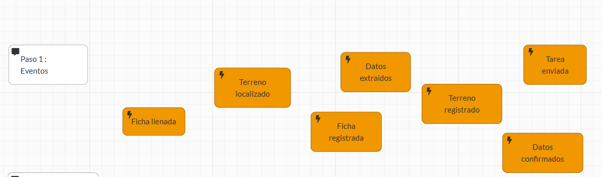

Posteriormente esos eventos se ordenaron secuencialmente de izquierda a derecha.
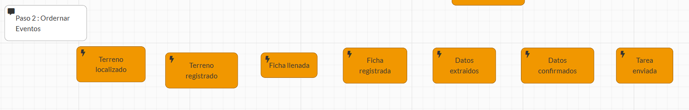

Como siguiente paso se procedió a identificar los comandos que desencadenan los eventos identificados. En nuestro caso, solo un evento era desencadenado por otro, luego todos eran desencadenados por comandos.
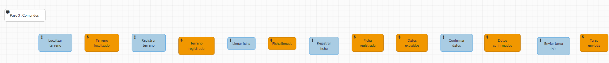

Continuando con los pasos, identificamos los roles asociados a los comandos, es decir, sus ejecutantes. En este paso aparecieron, obviamente, el agente de campo y los asesores de Gerencia General. También apareció el sistema como un rol, ya que es el que ejecuta algunos comandos dentro del flujo.
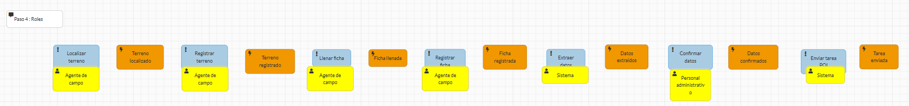

En consecuencia, habiendo identificado los roles, identificamos las politicas del dominio. En este caso, siendo la coherencia que existe entre un terreno y su dueño, y el beneficiario al que se le hace seguimiento.
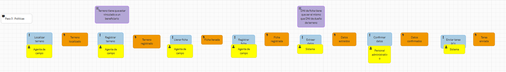

Luego, identificamos los sistemas externos con los cuales se comunica SGT, en este caso siendo el sistema de beneficiarios (sistema que permitirá conocer la información de los beneficiarios de la entidad), sistema POI (sistema al cual se hara un envío de información por cada ficha validada) y el modelo de IA (que se representa como un sistema externo debido a su naturaleza).
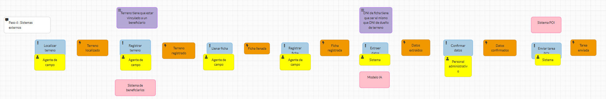

Habiendo identificado ello, analizamos y detallamos las vistas que influirian en el sistema. En este paso ya detallamos el uso de la web y la aplicación móvil.
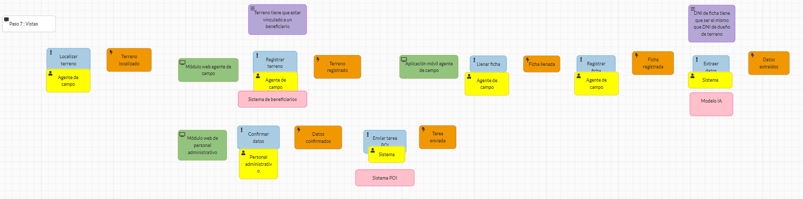

Como uno de los últimos pasos, identificamos los agregados en base a lo planteado hasta el momento. En este caso, Terreno y Ficha vendrían a ser los agregados del dominio.
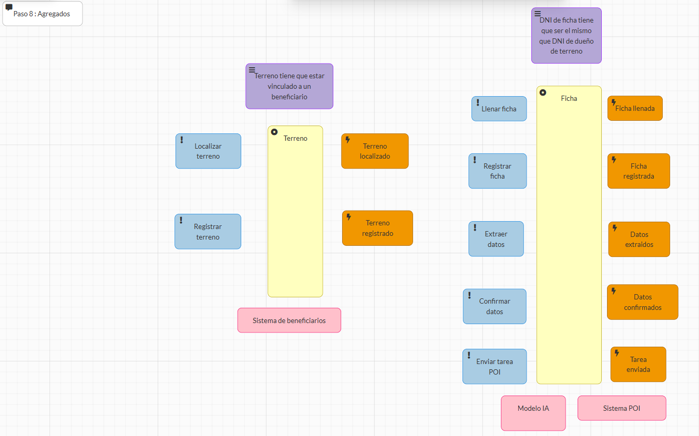

Para concluir el proceso de EventStorming, identificamos los contextos vinculados al planteo del equipo. En primer lugar, y más importantes (ya que serán los que vamos a desarrollar nosotros) se encuentran el contexto de SGT y el contexto de IA. Mientras que los contextos de Beneficiarios y POI representan contextos con los cuales SGT se va a comunicar, más no se mapea a detalle esos contextos, ya que no estan dentro del alcance.
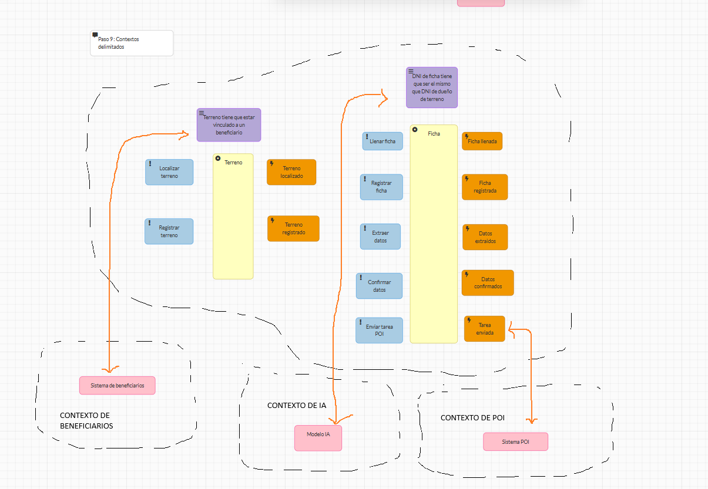

### Candidate Context Discovery

Como parte del proceso de EventStorming, paralelamente se fue barajando los posibles contextos a desarrollar. 

Sin embargo, debido a la naturaleza del SGT y su alcance acotado, los contextos identificados (y finales) fueron determinados rapidamente.

### Domain Message Flows Modeling

Para ejemplificar como cada contexto se vincula y comunica uno con otro detallamos los 3 flujos más representativos de SGT.

En primer lugar, mapeamos el flujo que tiene un asistente de campo para el mapeo de un terreno dentro del sistema web. Lo que hace aquí es crear un espacio virtual con las coordenadas reales del terreno del beneficiario. Obviamente este proceso se realiza dentro del contexto del SGT, sin embargo, tiene una comunicación con el contexto de beneficiarios para hacer el match entre el DNI de beneficiario que llega para el mapeo del terreno con el beneficiario que ya se encuentra dentro del sistema de beneficiarios. El terreno solo se crea si el beneficiario se encuentra en el sistema de beneficiarios.

En segundo lugar, se mapeo el flujo de mandar la ficha. El proceso empieza con el asistente de campo tomando foto con la aplicación móvil a la ficha realizada en campo, esta ficha viaja al contexto del SGT y este la traslada al contexto de la IA, donde se analiza y extrae la información de la foto. Al procesar ello, el contexto SGT guarda la información y ya esta disponible para validación de asesores de Gerencia General.

Finalmente, se mapeo el flujo de validar una ficha, en el cual se involucra los asesores de Gerencia General, quienes a través de la web observan la información extraída por el modelo de IA y la imagen real. En caso se valide exitosamente la ficha, se envia esa información al contexto POI para contribuir al avance de una actividad.

### Bounded Context Canvases

Como parte del analisis de los contextos identificados se desarrollo su canvas respectivo.

En primer lugar se analizo el contexto SGT. Este contexto es el CORE del sistema, interactua directamente con el Frontend del usuario proporcionando todos los endpoints del sistema. Además se comunica con los contextos de Beneficiarios, POI y el modelo de IA.
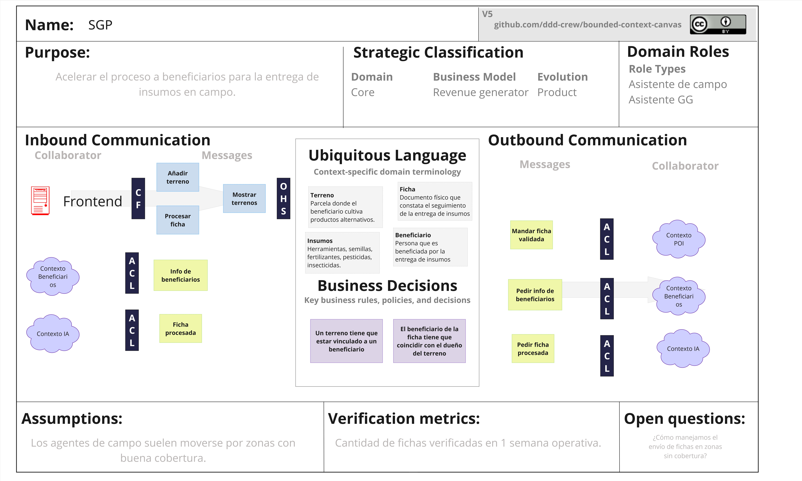

Luego se analizo el contexto de Beneficiarios, que se trata de un contexto externo. Este contexto, tiene como único propósito dentro del sistema, proporcionar información de los beneficiarios. Se comunica con el contexto SGT.
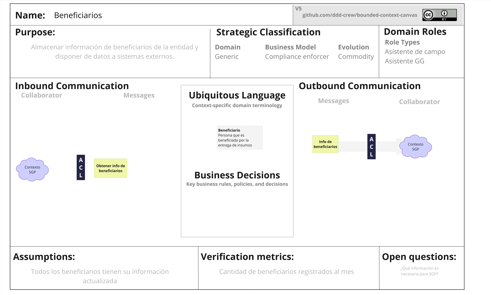

A su vez se analizo el contexto de POI, este contexto, al igual que el anterior, es un contexto externo. Tiene como único propósito recibir información sobre las fichas validadas por asesoria de Gerencia General. 
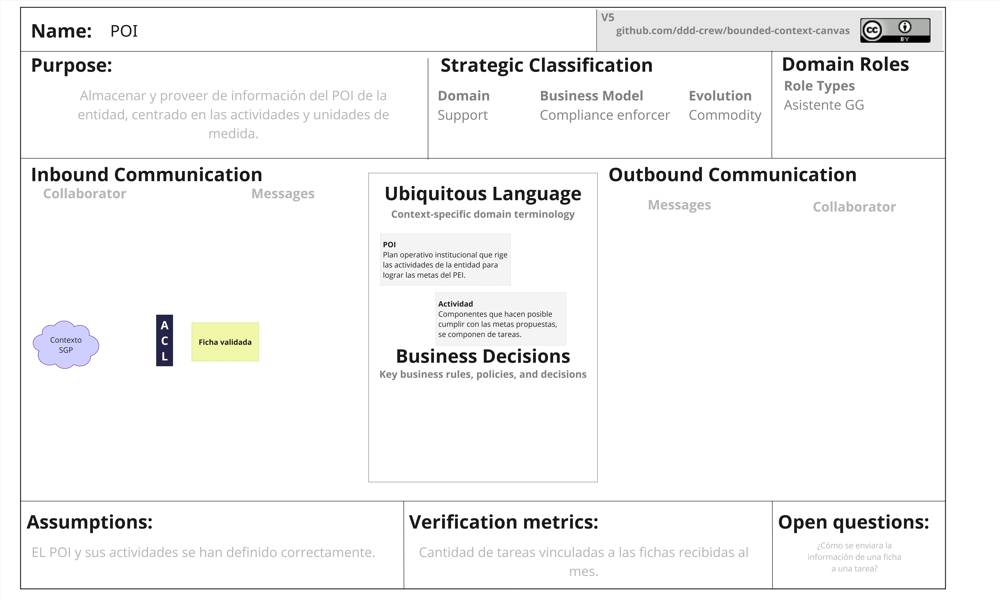

Finalmente, el contexto de IA es una mejora al proceso actual. Es meramente tecnologico y busca reducir la carga operativa de Gerencia General. Tiene como propósito analizar las fichas a través de fotos, extraer su información relevante y permitir su validación con Gerencia General.
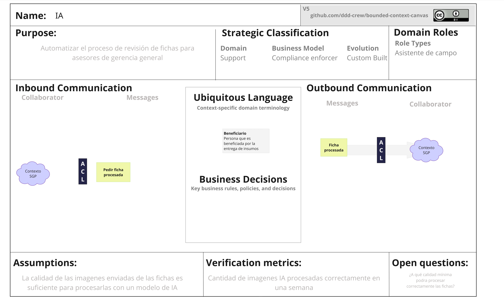

### Context Mapping

Habiendo mapeado los contextos involucrados en SGT, se definió su comunicación. 

El contexto SGT se comunica tanto con Beneficiarios, POI y el modelo de IA.
Todas las comunicaciones siguen el patrón Customer/Supplier. Siendo, en todos los casos SGT el Customer.

La relación del contexto de SGT con el contexto de Beneficiarios es sencilla. SGT consume un endpoint (OHS) del contexto de Beneficiarios y mediante un ACL rescata lo estrictamente necesario para el sistema.

La relación del contexto SGT con el contexto de POI sigue el mismo patrón, sin embargo, SGT no pide información, sino que la envía. En este caso, el contexto de SGT prepara un recurso con los lineamientos del POST (OHS) del sistema POI y envía un avance para una actividad.

Finalmente, la comunicación entre el contexto SGT con el contexto de IA es a través de un endpoint (OHS), el modelo de IA recibe la imagen, extrae los datos y los manda en un formato que SGT ya conoce. Por tanto, SGT no necesita modificar lo que llega al contexto (CNF).
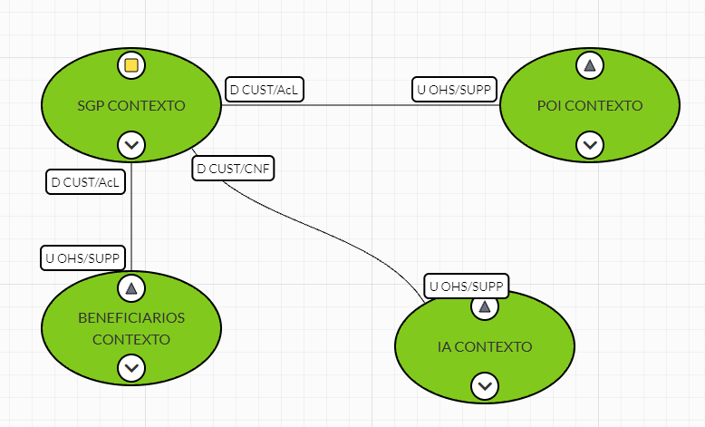

## Software Architecture

### Software Architecture System Landscape Diagram

Representa el panorama global de la solución con respecto a los usuarios y la organización que lo utiliza. En esta vista se identifican todas las personas y el entorno de su contexto de trabajo tomando en cuenta la solución.

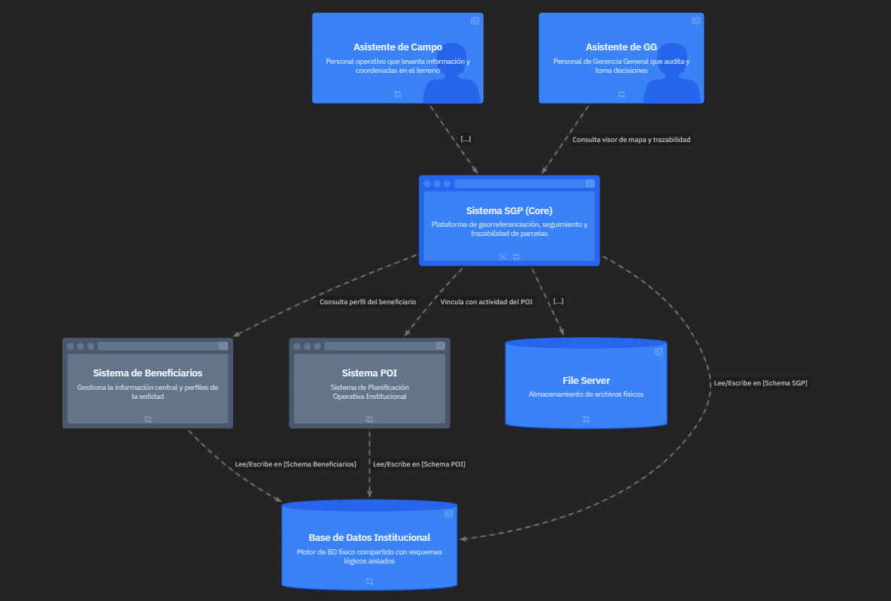

### Software Architecture Context Level Diagrams

Este diagrama representa la situación a gran escala de la arquitectura de la solución planteada. En este caso, tenemos el sistema SGT en el centro del diagrama, es utilizado por ambos usuarios y se comunica con los sistemas de beneficiarios y POI.
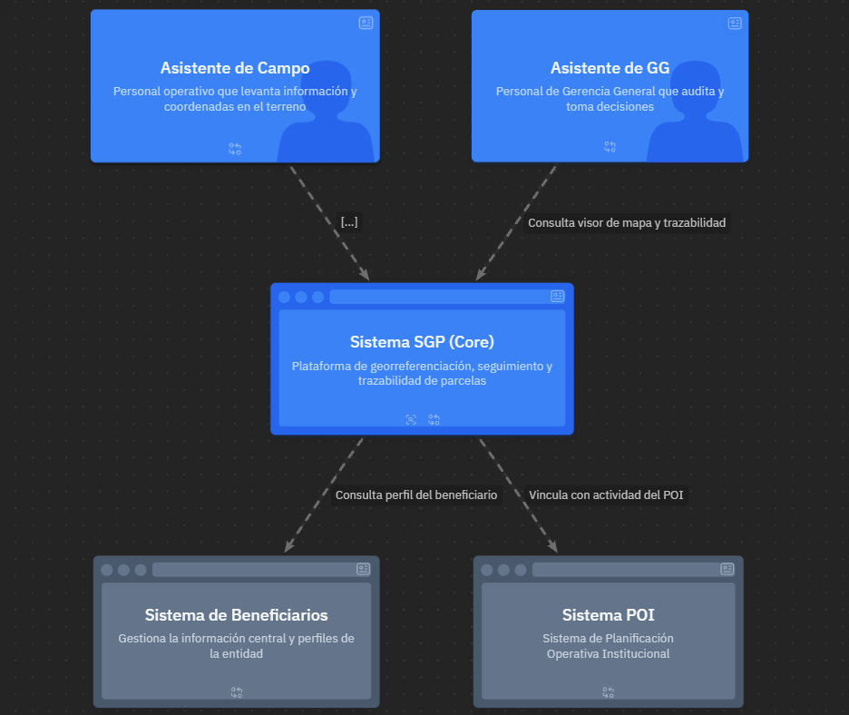

### Software Architecture Container Level Diagrams

Ahondamos al diagrama de contenedores, dentro del sistema SGT contamos con dos interfaces: aplicación móvil y aplicación web, ambos se comunican con el servicio SGT que contiene toda la lógica de negocio del sistema. 
Este servicio se comunica con un modelo de IA que extrae información de las fichas que llegan al servicio SGT. Todos los archivos se guardan en el File Server Institucional.
Los servicios externos de Beneficiarios y POI se comunican por llamadas REST con el Servicio SGT, y todos los servicios guardan su información en una única base de datos institucional en distintos esquemas.
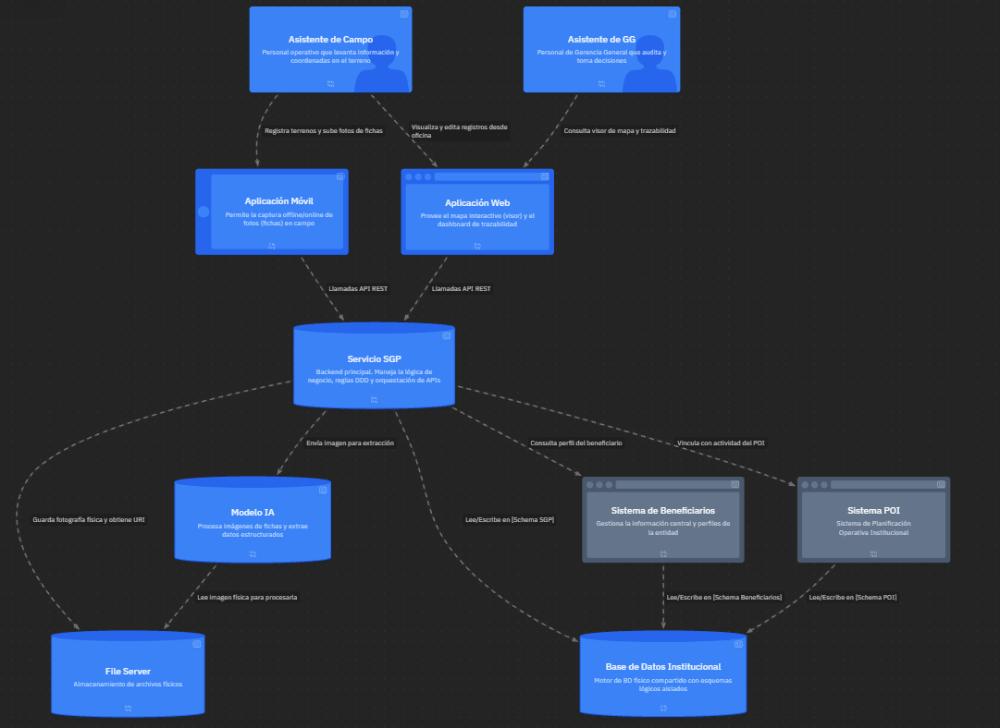

### Software Architecture Deployment Diagrams

Finalmente, el diagrama de despliegue contempla la infraestructura actual de la institución y como manejan las aplicaciones empresariales. El servicio SGT sera desplegado en un .war dentro de un Apache Tomcat 9 dentro del Servidor de Aplicaciones. Al igual que el Modelo de IA.
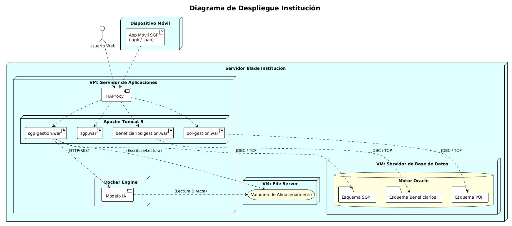

# Conclusiones

## Conclusiones y recomendaciones

El equipo completó el levantamiento y el análisis de requisitos, y definió la arquitectura estratégica de SGT.

Resultados de avance:
- Las entrevistas confirman el Problem Statement: los tres entrevistados trabajan con más de un sistema sin integración automática, y dos de tres trasladan la información campo por campo de forma manual.
- Los assumptions sobre los segmentos se sostienen: los tres condicionan la aprobación de un dato a poder rastrearlo hasta su acta de origen.
- Las entrevistas aportaron dos hallazgos nuevos: la unidad de medida es la principal fuente de errores en el origen del dato, y existe una restricción institucional sobre el uso de servicios en la nube.
- El Product Backlog reúne 10 User Stories agrupadas en 5 épicas, y el Capítulo IV documenta 7 architectural drivers y 2 constraints.

# Bibliografía

Aguado-Riveros, U. I., Espinoza-Quispe, L. E., Santillán-Enciso, C. L., Silva-Infantes, M., Barrionuevo-Inca-Roca, Y. A., Astuñaupa-Flores, S. N., Poma-Lagos, L. A., Navarro-Véliz, J. A., & González-Prida, V. (2026). *Reducing administrative burden through simplification and document management in local governments: Evidence from a district-level public organization*. Societies, 16(3), 91. https://doi.org/10.3390/soc16030091

Burch, T. (2016, January 6). *Data is the crop: GNSS used by surveyors and farmers*. GPS World. https://www.gpsworld.com/data-is-the-crop-gnss-used-by-surveyors-and-farmers/

Cohn, M. (2004). *User stories applied: For agile software development*. Addison-Wesley.

Hyperscience. (n.d.). *US public sector intelligent automation solutions*. Retrieved September 15, 2026, from https://www.hyperscience.ai/solutions/public-sector/

International Food Policy Research Institute. (2025, December 2). *Beyond the algorithm: The need for farmer participation and data justice in digital agricultural technology*. IFPRI Blog. https://www.ifpri.org/blog/beyond-the-algorithm-the-need-for-farmer-participation-and-data-justice-in-digital-agricultural-technology/

OECD. (2026). *Digital governments at a turning point*. In *Digital Government Outlook 2026*. OECD Publishing. https://www.oecd.org/en/publications/digital-government-outlook_0496b2bc-en/full-report/digital-governments-at-a-turning-point_0491aad4.html

OpenG2P. (n.d.). *OpenG2P*. Retrieved September 15, 2026, from https://www.openg2p.org/

OpenSPP. (n.d.). *Farmer registry*. OpenSPP Documentation. Retrieved September 15, 2026, from https://docs.openspp.org/explanation/farmer_registry

The Canton Group. (2025, June 9). *Breaking down silos: Why government IT systems need interoperability for digital transformation*. https://cantongroup.com/insights/breaking-down-silos-why-government-it-systems-need-interoperability-digital-transformation

World Bank. (2025, October 22). *A journey of a thousand miles begins with a single step: How Malawi's reform is just the beginning for smallholder farmers*. https://www.worldbank.org/en/news/feature/2025/10/21/how-malawi-s-reform-is-just-the-beginning-for-smallholder-farmers

# Anexos

## Videos de Exposiciones

