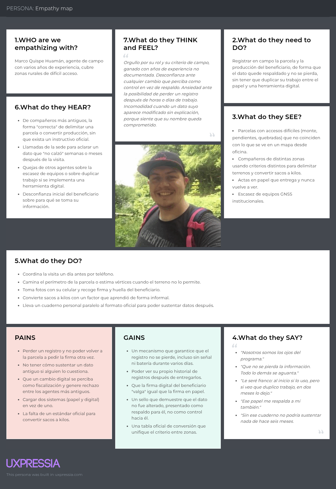
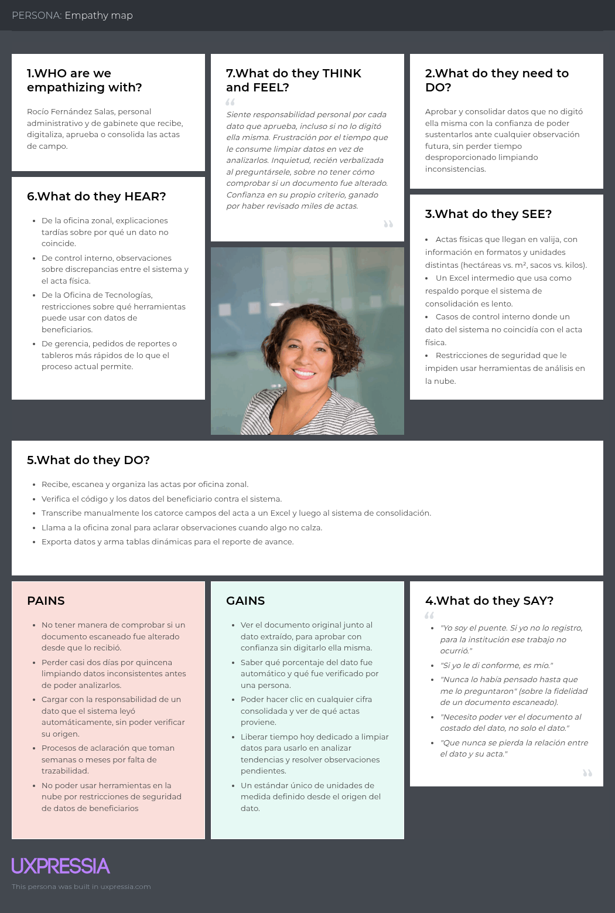
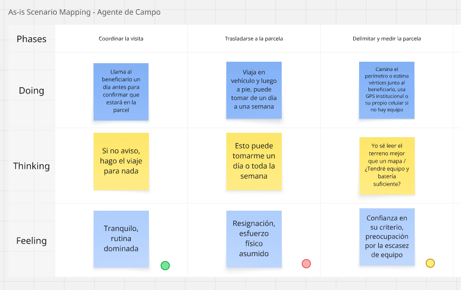
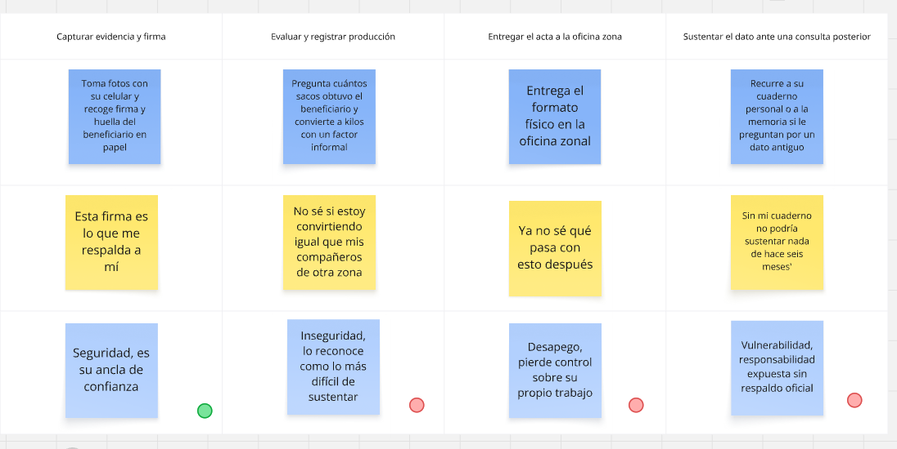
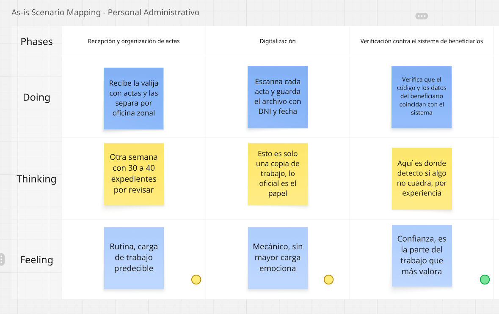
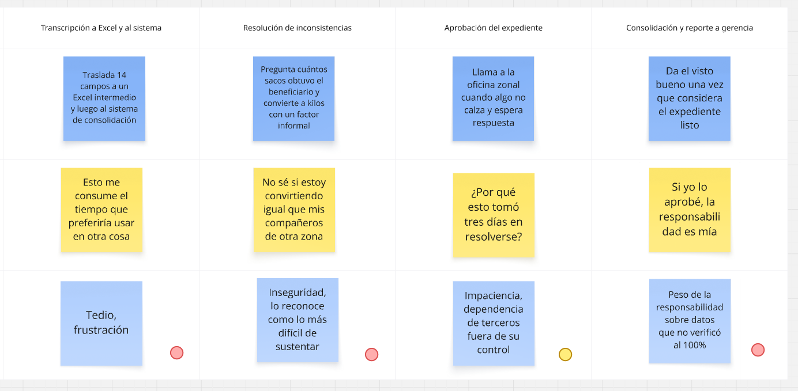

    

        
    

    
Universidad Peruana de Ciencias Aplicadas

    
Carrera de Ingeniería de Software

    <h2 style="font-size: 18px; margin: 15px 0 0 0;">ASI0728</h2>
    <h2 style="font-size: 18px; margin: 10px 0 10px 0;">Arquitecturas de Software Emergentes</h2>
    
NRC

    <h2 style="font-size: 18px; margin: 5px 0;">9075</h2>
    <h2 style="font-size: 18px; margin: 10px 0 5px 0;">Informe de Trabajo Final</h2>
    
Docente

    <h2 style="font-size: 18px; margin: 5px 0 40px 0;">Vega Calero, Wilder Aurelio</h2>
    
Equipo

    <h2 style="font-size: 18px; margin: 0px 0 40px 0;">Soulware</h2>
    
Proyecto

    <h2 style="font-size: 18px; margin: 0px 0 30px 0;">SGP</h2>
    
<strong>Integrantes:</strong>

    <table style="width: max-content; border-collapse: collapse; margin: 0 auto 50px auto;">
        <thead>
            <tr>
                <th style="border: 0px; text-align: left; padding: 5px 15px 5px 0;">Código</th>
                <th style="border: 0px; text-align: left; padding: 5px 0 5px 15px;">Apellidos y Nombres</th>
            </tr>
        </thead>
        <tbody>
            <tr>
                <td style="border: 0px; text-align: left; padding: 5px 15px 5px 0;">20221g120</td>
                <td style="border: 0px; text-align: left; padding: 5px 0 5px 15px;">Crispin Ramos, Daniel Franco</td>
            </tr>
            <tr>
                <td style="border: 0px; text-align: left; padding: 5px 15px 5px 0;">202310210</td>
                <td style="border: 0px; text-align: left; padding: 5px 0 5px 15px;">Esteban Roman, Henry Kalet</td>
            </tr>
            <tr>
                <td style="border: 0px; text-align: left; padding: 5px 15px 5px 0;">202220783</td>
                <td style="border: 0px; text-align: left; padding: 5px 0 5px 15px;">Orozco Torres, Álvaro Joaquín</td>
            </tr>
            <tr>
                <td style="border: 0px; text-align: left; padding: 5px 15px 5px 0;">20221e247</td>
                <td style="border: 0px; text-align: left; padding: 5px 0 5px 15px;">Reaño Delgadillo, Henry Paolo</td>
            </tr>
            <tr>
                <td style="border: 0px; text-align: left; padding: 5px 15px 5px 0;">20231a778</td>
                <td style="border: 0px; text-align: left; padding: 5px 0 5px 15px;">Vilca Saboya, Diego Alejandro</td>
            </tr>
        </tbody>
    </table>
    

        
Periodo 2620

    

# Registro de Versiones del Informe

# Project Report Collaboration Insights

# Contenido

- [Carátula](#carátula)
- [Registro de Versiones del Informe](#registro-de-versiones-del-informe)
- [Project Report Collaboration Insights](#project-report-collaboration-insights)
- [Student Outcome](#student-outcome)
- [Capítulo I: Introducción](#capítulo-i-introducción)
  - [Startup Profile](#startup-profile)
    - [Descripción de la Startup](#descripción-de-la-startup)
    - [Perfiles de integrantes del equipo](#perfiles-de-integrantes-del-equipo)
  - [Solution Profile](#solution-profile)
    - [Antecedentes y problemática](#antecedentes-y-problemática)
    - [Lean UX Process](#lean-ux-process)
      - [Lean UX Problem Statements](#lean-ux-problem-statements)
      - [Lean UX Assumptions](#lean-ux-assumptions)
      - [Lean UX Hypothesis Statements](#lean-ux-hypothesis-statements)
      - [Lean UX Canvas](#lean-ux-canvas)
  - [Segmentos objetivo](#segmentos-objetivo)
- [Capítulo II: Requirements Elicitation & Analysis](#capítulo-ii-requirements-elicitation--analysis)
  - [Competidores](#competidores)
    - [Análisis competitivo](#análisis-competitivo)
    - [Estrategias y tácticas frente a competidores](#estrategias-y-tácticas-frente-a-competidores)
  - [Entrevistas](#entrevistas)
    - [Diseño de entrevistas](#needfinding-diseno)
    - [Registro de entrevistas](#needfinding-registro)
    - [Análisis de entrevistas](#análisis-de-entrevistas)
  - [Needfinding](#needfinding)
    - [User Personas](#user-personas)
    - [User Task Matrix](#user-task-matrix)
    - [Empathy Mapping](#empathy-mapping)
    - [As-is Scenario Mapping](#as-is-scenario-mapping)
  - [Ubiquitous Language](#ubiquitous-language)
- [Capítulo III: Requirements Specification](#capítulo-iii-requirements-specification)
  - [To-Be Scenario Mapping](#to-be-scenario-mapping)
  - [User Stories](#user-stories)
  - [Impact Mapping](#impact-mapping)
  - [Product Backlog](#product-backlog)
- [Capítulo IV: Strategic-Level Software Design](#capítulo-iv-strategic-level-software-design)
  - [Strategic-Level Attribute-Driven Design](#strategic-level-attribute-driven-design)
    - [Design Purpose](#design-purpose)
    - [Attribute-Driven Design Inputs](#attribute-driven-design-inputs)
      - [Primary Functionality (Primary User Stories)](#primary-functionality-primary-user-stories)
      - [Quality attribute Scenarios](#quality-attribute-scenarios)
      - [Constraints](#constraints)
    - [Architectural Drivers Backlog](#architectural-drivers-backlog)
    - [Architectural Design Decisions](#architectural-design-decisions)
    - [Quality Attribute Scenario Refinements](#quality-attribute-scenario-refinements)
  - [Strategic-Level Domain-Driven Design](#strategic-level-domain-driven-design)
    - [EventStorming](#eventstorming)
    - [Candidate Context Discovery](#candidate-context-discovery)
    - [Domain Message Flows Modeling](#domain-message-flows-modeling)
    - [Bounded Context Canvases](#bounded-context-canvases)
    - [Context Mapping](#context-mapping)
  - [Software Architecture](#software-architecture)
    - [Software Architecture System Landscape Diagram](#software-architecture-system-landscape-diagram)
    - [Software Architecture Context Level Diagrams](#software-architecture-context-level-diagrams)
    - [Software Architecture Container Level Diagrams](#software-architecture-container-level-diagrams)
    - [Software Architecture Deployment Diagrams](#software-architecture-deployment-diagrams)
- [Conclusiones](#conclusiones)
  - [Conclusiones y recomendaciones](#conclusiones-y-recomendaciones)
  - [Video About-The-Team](#video-about-the-team)
- [Bibliografía](#bibliografía)
- [Anexos](#anexos)
  - [Videos de Exposiciones](#videos-de-exposiciones)

# Student Outcome

# Capítulo I: Introducción

## Startup Profile

### Descripción de la Startup

Soulware es una startup peruana dedicada al desarrollo de soluciones de software orientadas a la transformación digital de negocios y organizaciones. Su propuesta se enfoca en construir productos digitales que combinan un diseño centrado en el usuario con arquitecturas de software modernas, escalables y mantenibles.

El equipo está conformado por estudiantes de Ingeniería de Software que comparten el interés por aplicar tecnologías emergentes a problemas reales, trabajando bajo un enfoque ágil y colaborativo a lo largo de todo el ciclo de vida del producto, desde la investigación y el diseño hasta la implementación y el despliegue.

La visión de Soulware es convertirse en un referente en el desarrollo de soluciones innovadoras e inclusivas, generando valor tanto para los usuarios finales como para el negocio que las adopta, mediante productos digitales confiables y de buena calidad.

### Perfiles de integrantes del equipo

    <table style="width: 100%; border-collapse: collapse; border: 1px solid #333; table-layout: fixed;">
        <colgroup>
            <col style="width: 150px;">
            <col>
        </colgroup>
        <thead>
            <tr>
                <th style="border: 1px solid #333; padding: 8px 10px; text-align: left;">Foto</th>
                <th style="border: 1px solid #333; padding: 8px 10px; text-align: left;">Perfil</th>
            </tr>
        </thead>
        <tbody>
            <tr>
                <td style="border: 1px solid #333; padding: 10px; text-align: center; vertical-align: top;">
                    
                </td>
                <td style="border: 1px solid #333; padding: 10px; vertical-align: top;">
                    
<strong>Crispin Ramos, Daniel Franco</strong>

                    
Código: 20221g120

                    
Carrera: Ingeniería de Software

                    
Cuento con experiencia en Java y Angular para el desarrollo de aplicaciones, además de conocimientos en Domain-Driven Design y en el modelado y administración de bases de datos MySQL.

                </td>
            </tr>
            <tr>
                <td style="border: 1px solid #333; padding: 10px; text-align: center; vertical-align: top;">
                    
                </td>
                <td style="border: 1px solid #333; padding: 10px; vertical-align: top;">
                    
<strong>Esteban Roman, Henry Kalet</strong>

                    
Código: 202310210

                    
Carrera: Ingeniería de Software

                    
Cuento con conocimientos básicos en Java y C# para el desarrollo de aplicaciones.

                </td>
            </tr>
            <tr>
                <td style="border: 1px solid #333; padding: 10px; text-align: center; vertical-align: top;">
                    
                </td>
                <td style="border: 1px solid #333; padding: 10px; vertical-align: top;">
                    
<strong>Orozco Torres, Álvaro Joaquín</strong>

                    
Código: 202220783

                    
Carrera: Ingeniería de Software

                    
Cuento con experiencia en Java, PostgreSQL, JUnit, ArchUnit y Rust, además de conocimientos en diseño de servicios y APIs.

                </td>
            </tr>
            <tr>
                <td style="border: 1px solid #333; padding: 10px; text-align: center; vertical-align: top;">
                    
                </td>
                <td style="border: 1px solid #333; padding: 10px; vertical-align: top;">
                    
<strong>Reaño Delgadillo, Henry Paolo</strong>

                    
Código: 20221e247

                    
Carrera: Ingeniería de Software

                    
Cuento con experiencia en Java y React, además de conocimientos en Domain-Driven Design, JUnit y bases de datos Oracle.

                </td>
            </tr>
            <tr>
                <td style="border: 1px solid #333; padding: 10px; text-align: center; vertical-align: top;">
                    
                </td>
                <td style="border: 1px solid #333; padding: 10px; vertical-align: top;">
                    
<strong>Vilca Saboya, Diego Alejandro</strong>

                    
Código: 20231a778

                    
Carrera: Ingeniería de Software

                    
Cuento con experiencia en Java, Kotlin y React, además de conocimientos en Domain-Driven Design, bases de datos MySQL y JUnit.

                </td>
            </tr>
        </tbody>
    </table>

## Solution Profile

### Antecedentes y problemática

Una entidad pública de nuestro país gestiona un programa de apoyo agrícola mediante el cual entrega insumos a productores registrados para el cultivo de sus parcelas. Como en muchas entidades gubernamentales, sus procesos administrativos se apoyan en sistemas construidos en distintos momentos y para distintas necesidades puntuales, que hoy operan de forma aislada entre sí. Esta fragmentación obliga al personal a mover información de un sistema a otro de forma manual, en lugar de que los sistemas la compartan automáticamente.

La OCDE señala que, aunque la mayoría de sus países miembro ya cuentan con algún sistema de interoperabilidad de datos para el sector público, en promedio solo el 56% de las instituciones públicas que disponen de dicho sistema lo utilizan efectivamente para compartir información entre sí, y que la infraestructura digital de gobierno suele quedar subutilizada porque las inversiones no llegan a funcionar como un sistema integrado (OECD, 2026). En la misma línea, la falta de interoperabilidad entre plataformas de gobierno se traduce en procesos manuales y dependientes de papel que reducen la productividad del personal, generan brechas en los reportes y multiplican el trabajo de conciliar registros entre áreas (The Canton Group, 2025).

En las administraciones públicas locales del Perú persisten prácticas de gestión documental basadas en papel y registros fragmentados pese a los esfuerzos de digitalización, lo que mantiene a la gestión documental como la función de gobernanza que respalda la trazabilidad y la confiabilidad de los actos administrativos (Aguado-Riveros et al., 2026). En esta institución, esa misma lógica condiciona los flujos operativos y administrativos. Los archivos físicos en la práctica funcionan como fuente de verdad, pero los sistemas digitalizados operan con copias digitalizadas. A diferencia de los archivos físicos, las alteraciones o manipulaciones sobre una copia digitalizada no dejan un rastro visible ni verificable, por lo que el personal no puede confiar en que dicha copia siga siendo idéntica al documento físico que le dio origen.

El proyecto se propone mejorar un flujo operacional concreto, correspondiente a un servicio de apoyo brindado a los ciudadanos para la producción de productos alternativos. El flujo actualmente se puede describir de la siguiente manera:
1. Una persona natural accede como beneficiaria de la organización tras un proceso de evaluación a cargo de un área funcional específica con su propio sistema.
2. Esta persona decide registrar una o varias parcelas en las que realizará actividades agrícolas para la producción de productos alternativos.
3. Un agente de campo es enviado a constatar la posición geográfica exacta de la parcela que se pretende registrar a su nombre.
4. Posteriormente, este mismo agente tiene que registrar las coordenadas y registrarlas a nombre del beneficiario mediante un sistema de geolocalización.
5. De forma periódica, agentes de campo realizarán evaluaciones presencialmente al beneficiario para constatar las actividades realizadas y la producción obtenida, elaborando un reporte en físico con un formato establecido.
6. Este documento se hace llegar a la sede central de la institución, en donde es digitalizado y posteriormente almacenado.
7. Un administrativo adquiere acceso a la copia digitalizada y constata los datos registrados sobre la evaluación en dicho sistema.
8. Tras haber constatado, los datos son subidos manualmente a otro sistema que agrega los datos para visualizar el avance del Plan Estratégico Institucional (PEI) y del Plan Operativo Institucional (POI).

Enunciado del problema: la ausencia de un mecanismo que integre automáticamente la georreferenciación capturada en campo, los reportes de evaluación de producción una vez digitalizados y el traslado de esa información a los sistemas que consolidan el avance del PEI y del POI, sumada a la falta de una garantía sobre la integridad de los documentos digitalizados frente a su versión física original, obliga al personal a verificar y trasladar datos de forma manual, lo que ralentiza el proceso, consume tiempo del personal y del beneficiario, e introduce riesgo de error humano en el registro de la información.

    <table style="width: 100%; border-collapse: collapse; border: 1px solid #333; table-layout: fixed;">
        <colgroup>
            <col style="width: 150px;">
            <col>
        </colgroup>
        <thead>
            <tr>
                <th style="border: 1px solid #333; padding: 8px 10px; text-align: left;">Pregunta</th>
                <th style="border: 1px solid #333; padding: 8px 10px; text-align: left;">Respuesta</th>
            </tr>
        </thead>
        <tbody>
            <tr>
                <td style="border: 1px solid #333; padding: 10px; vertical-align: top;"><strong>Who</strong> ¿Quién?</td>
                <td style="border: 1px solid #333; padding: 10px; vertical-align: top;">Los agentes de campo que capturan la georreferenciación y las evaluaciones de producción, los beneficiarios evaluados, y el asistente de gerencia general que digitaliza, verifica y traslada esa información entre sistemas.</td>
            </tr>
            <tr>
                <td style="border: 1px solid #333; padding: 10px; vertical-align: top;"><strong>What</strong> ¿Qué?</td>
                <td style="border: 1px solid #333; padding: 10px; vertical-align: top;">La dependencia de procesos manuales para trasladar y conciliar la georreferenciación, los reportes de evaluación de producción y los documentos digitalizados entre los sistemas que la organización utiliza.</td>
            </tr>
            <tr>
                <td style="border: 1px solid #333; padding: 10px; vertical-align: top;"><strong>Where</strong> ¿Dónde?</td>
                <td style="border: 1px solid #333; padding: 10px; vertical-align: top;">En el flujo operativo del programa de apoyo agrícola, desde el registro de la parcela y la evaluación en campo hasta la consolidación de esa información en los sistemas que reportan el avance del PEI y del POI.</td>
            </tr>
            <tr>
                <td style="border: 1px solid #333; padding: 10px; vertical-align: top;"><strong>When</strong> ¿Cuándo?</td>
                <td style="border: 1px solid #333; padding: 10px; vertical-align: top;">En cada ciclo de registro de parcelas y de evaluación periódica en campo, lo que ocurre de forma recurrente durante la ejecución del programa.</td>
            </tr>
            <tr>
                <td style="border: 1px solid #333; padding: 10px; vertical-align: top;"><strong>Why</strong> ¿Por qué?</td>
                <td style="border: 1px solid #333; padding: 10px; vertical-align: top;">Porque no existe un mecanismo que integre automáticamente la georreferenciación capturada en campo con el registro del beneficiario, ni que traslade los reportes de evaluación digitalizados hacia los sistemas de consolidación, ni que garantice que el documento digitalizado sigue siendo idéntico al documento físico original.</td>
            </tr>
            <tr>
                <td style="border: 1px solid #333; padding: 10px; vertical-align: top;"><strong>How</strong> ¿Cómo?</td>
                <td style="border: 1px solid #333; padding: 10px; vertical-align: top;">El agente de campo registra las coordenadas de la parcela en un sistema de geolocalización aparte y elabora el reporte de evaluación en físico; ese reporte se digitaliza en la sede central, y el asistente de gerencia general verifica los datos y los traslada manualmente al sistema que agrega la información del PEI y del POI.</td>
            </tr>
            <tr>
                <td style="border: 1px solid #333; padding: 10px; vertical-align: top;"><strong>How Much</strong> ¿Cuánto?</td>
                <td style="border: 1px solid #333; padding: 10px; vertical-align: top;">El impacto se refleja en el tiempo que el personal dedica a verificar y trasladar manualmente los datos entre sistemas, en el riesgo de error humano en cada traslado, y en la falta de garantía sobre la integridad de los documentos digitalizados frente a su versión física.</td>
            </tr>
        </tbody>
    </table>

### Lean UX Process

#### Lean UX Problem Statements

El estado actual de la gestión administrativa de programas públicos de apoyo agrícola se ha enfocado principalmente en el funcionamiento individual de flujos de usuario, sin generar una integración completa.

Lo que las plataformas administrativas existentes no resuelven es la integración automática entre estos puntos de captura de información y los sistemas externos que los reciben, ni la posibilidad de verificar que un registro digitalizado sigue siendo idéntico al dato entregado originalmente, lo que obliga al personal a transcribir y conciliar datos manualmente entre sistemas aislados y a operar sin certeza sobre la integridad de esos registros.

#### Lean UX Assumptions

Business outcomes:
- Reducción del asistente de gerencia general en un 20%.
- Reducción de inconsistencias de datos en un 90%.
- Reducción de accesos y modificaciones no autorizadas a los datos en un 95%.

Users:
- Asistente de gerencia general.
- Agente de campo.

Solutions / features:
- Integración con el sistema que registra a los beneficiarios.
- Integración directa de mediciones de terreno al sistema.
- Extracción de datos automática con IA.
- Integración con plataforma analítica de Plan Operativo Institucional (POI).
- Integridad de datos blockchain.

User outcomes:
- Trabajar con datos actualizados que provee el área que registra a los beneficiarios.
- Reportar la georreferenciación directamente durante la visita a campo.
- Reducir el tiempo de registro por documento.
- Dejar de trasladar manualmente los resultados de evaluación de producción al sistema que consolida el avance del POI.
- Confiar en que el documento digitalizado sigue siendo idéntico al que proveyó el beneficiario.

#### Lean UX Hypothesis Statements

- Reducción de inconsistencias de datos en un 90% si el asistente de gerencia general logra trabajar con datos actualizados que provee el área que registra a los beneficiarios mediante la integración con el sistema que registra a los productores.

- Reducción de inconsistencias de datos en un 90% si el agente de campo logra reportar la georreferenciación directamente durante la visita a campo mediante la integración directa de mediciones de terreno al sistema.

- Reducción del asistente de gerencia general en un 20% si el asistente de gerencia general logra reducir el tiempo de registro por documento mediante la extracción de datos automática con IA.

- Reducción de inconsistencias de datos en un 90% si el asistente de gerencia general logra dejar de trasladar manualmente los resultados de evaluación de producción al sistema que consolida el avance del POI mediante la integración con plataforma analítica de Plan Operativo Institucional (POI).

- Reducción de accesos y modificaciones no autorizadas a los datos en un 95% si el asistente de gerencia general logra confiar en que el documento digitalizado sigue siendo idéntico al que proveyó el beneficiario mediante la integridad de datos blockchain.

#### Lean UX Canvas

El siguiente lienzo resume el proceso Lean UX: el problema de negocio, los resultados esperados, los usuarios, la solución propuesta y las hipótesis que la sustentan.

## Segmentos objetivo

El dominio del problema involucra tres segmentos, todos vinculados al mismo programa público de apoyo agrícola.

**Funcionario administrativo**
Recibe los documentos PDF del programa y registra su contenido en la plataforma interna.
- Personal permanente de la entidad.
- Maneja herramientas ofimáticas básicas.
- Sin formación técnica en sistemas necesariamente.

**Agente de campo georreferenciador**
Recorre las parcelas y captura sus coordenadas con un dispositivo GNSS para construir la geomalla del programa.
- El mapeo con GNSS reduce el levantamiento de una parcela de días a horas frente al método tradicional (Burch, 2016).
- Práctica extendida entre agrimensores y agricultores para digitalizar y verificar el uso del suelo (Burch, 2016).

**Productor beneficiario**
Recibe insumos del programa y reporta periódicamente en PDF la producción obtenida de su parcela.
- Segmento numeroso y disperso geográficamente, con acceso desigual a conectividad y herramientas digitales.
- Suele interactuar con múltiples plataformas desconectadas entre sí, cada una con su propio registro (IFPRI, 2025).
- Un registro único de productores, enlazado con insumos y resultados, es clave para resolver esa fragmentación (World Bank, 2025).

# Capítulo II: Requirements Elicitation & Analysis

## Competidores

### Análisis competitivo

### Estrategias y tácticas frente a competidores

## Entrevistas

<h3 id="needfinding-diseno">Diseño de entrevistas</h3>

Para diseñar las entrevistas se elaboraron dos bloques de preguntas, diferenciados según el segmento objetivo. Cada bloque recoge información objetiva sobre el contexto de trabajo, los instrumentos que se utilizan y el recorrido que sigue la información, e información subjetiva sobre percepciones, frustraciones y expectativas frente a una posible solución digital. Las preguntas se plantearon de forma abierta y apoyadas en el relato de casos concretos, de modo que el entrevistado describiera lo que hace realmente y no lo que indica el procedimiento.

**Segmento 1: Agente de campo georreferenciador**

Preguntas sobre la problemática:
- ¿Cómo le explicaría a alguien de fuera qué hace un agente de campo y por qué su trabajo importa para el programa?
- ¿Qué parte de su trabajo es la que nadie podría hacer desde un escritorio en la sede?
- El formato en papel se usa desde hace años. ¿Qué es lo que ese formato hace bien y que habría que conservar sí o sí?
- ¿Qué tiene que aprender un agente nuevo que no está escrito en ningún manual?
- Lléveme a su última visita de registro: ¿cómo llegó, con quién estuvo, qué fue lo primero que hizo?
- Cuando delimita la parcela, ¿cómo decide el recorrido, perímetro completo, vértices o un punto referencial? ¿Quién le enseñó ese criterio?
- ¿Cómo sabe que la medición quedó bien? ¿Hay algo que revise antes de retirarse?
- Además de la coordenada, ¿qué más registra durante la visita?
- Cuando el beneficiario está presente, ¿qué le muestra o le explica sobre lo que acaba de quedar registrado?
- En la evaluación periódica, ¿cómo obtiene la cantidad producida? ¿Se la declara el beneficiario, la estima usted, la pesa?
- Una vez que entrega el formato lleno, ¿qué pasa con ese documento? ¿Se entera si le hicieron alguna observación?
- Si dentro de seis meses alguien de la sede le pregunta por un dato de esa acta, ¿cómo lo sustenta usted?
- ¿Le ha tocado que un dato que usted registró aparezca distinto más adelante? ¿Cómo se aclaró?

Preguntas sobre la solución:
- Si el registro pudiera quedar cerrado en la misma parcela, con la foto y la firma incluidas, ¿qué tendría que cumplir esa herramienta para que usted la firme con la misma tranquilidad con la que firma el papel?
- ¿Qué datos del beneficiario le gustaría tener ya cargados antes de llegar a la parcela?
- Si su acta quedara con un sello que permita demostrar después que nadie le cambió nada, ¿a usted personalmente en qué le serviría?
- ¿Qué haría con el tiempo que hoy se le va en registrar y volver a registrar lo mismo?
- Si usted fuera quien diseña esta herramienta, ¿qué es lo primero que no debería fallar nunca?

**Segmento 2: Funcionario administrativo**

Preguntas sobre la problemática:
- ¿Cómo le describiría su trabajo a alguien que nunca ha estado en la institución?
- ¿Qué parte del proceso depende de su criterio y no podría hacerla alguien sin experiencia?
- Del procedimiento actual, ¿qué es lo que funciona bien y habría que conservar?
- Lléveme por el último expediente que cerró, desde que llegó hasta que el dato quedó reflejado en el sistema.
- ¿Qué campos exactamente traslada de un documento a otro?
- ¿Cómo decide que un expediente está listo? ¿Qué revisa antes de darlo por bueno?
- Cuénteme el último caso en que algo no calzó. ¿Qué hizo?
- ¿Cuántos expedientes maneja en una semana y cuánto le toma cada uno?
- ¿Qué le da valor oficial al expediente?
- Si dentro de un año alguien cuestiona un dato, ¿cómo lo sustenta usted?
- ¿Ha habido algún caso en que se haya puesto en duda un documento digitalizado?

Preguntas sobre la solución:
- Si un sistema le presentara los campos ya leídos del documento, ¿cuáles revisaría siempre antes de aprobar?
- ¿Qué tendría que ver en pantalla para aprobar con tranquilidad un dato que usted no digitó?
- Si el sistema se equivoca en un campo, ¿quién debería responder y cómo se corrige?
- ¿En qué usaría el tiempo que hoy dedica a digitar?
- Si usted diseñara esto, ¿qué es lo primero que no debería fallar nunca?

<h3 id="needfinding-registro">Registro de entrevistas</h3>

**Segmento Agentes de Campo: Entrevistado 1**

| Atributo | Detalle |
| --- | --- |
| Nombre | Teófilo Quispe Mamani |
| Edad | 46 |
| Sexo | Masculino |
| Distrito | Kimbiri |
| Ocupación | Agente de campo georreferenciador, 7 años en el puesto |
| Fecha de entrevista | Pendiente de completar |
| Timing | Pendiente de completar |
| Video | Pendiente de completar |
| Captura | Pendiente de completar |
| Resumen | Teófilo trabaja en zona alta y define su rol como el de los ojos del programa, ya que sin la verificación presencial se estarían entregando insumos sin respaldo. Considera que el conocimiento de las personas y del terreno es lo que no puede hacerse desde la sede, porque en un mapa se ve un cuadrado y él sabe que ese cuadrado tiene una quebrada al medio y que la mitad no es cultivable. Del formato en papel rescata la firma y la huella del beneficiario, porque acredita que ambos estuvieron presentes y lo respalda a él si aparece un problema. En su última visita coordinó por teléfono el día anterior, viajó en camioneta y caminó cuarenta minutos hasta la parcela. Delimita recorriendo el perímetro y marcando vértices cuando el terreno lo permite; cuando hay monte o pendiente fuerte toma los vértices que alcanza y estima el resto con el beneficiario, criterio que aprendió de un compañero antiguo y que no figura en ningún instructivo. Además de la coordenada llena el formato, toma fotografías con su celular personal y recoge la firma y la huella, y envía las fotos por WhatsApp cuando encuentra señal, lo que le genera acumulación y pérdida de referencia sobre a qué parcela corresponde cada imagen. En la evaluación de producción la cantidad se la declara el beneficiario y él verifica lo que puede: si la cosecha está presente estima por sacos y si ya fue vendida no tiene forma de contrastarla. Convierte a kilogramos usando entre cuarenta y cinco y cincuenta kilos por saco según el producto, y advierte que no todos los agentes aplican el mismo factor. Como no le queda copia del formato, sustenta cualquier consulta posterior con un cuaderno propio que lleva por iniciativa personal. Tuvo un caso en que una cantidad apareció distinta en el sistema y se corrigió contrastando con ese cuaderno, aunque quedó la incomodidad de parecer responsable del error, y reconoce que se resolvió porque lo conocen y no porque existiera forma de comprobarlo. Sobre la propuesta pone tres condiciones para firmar con la misma tranquilidad que el papel: que la información no se pierda, que pueda ver lo que registró y que la firma del beneficiario tenga validez. Advierte que si tuviera que seguir llevando el papel además de la herramienta, la usaría al inicio por obligación y la abandonaría en unos dos meses, como ha ocurrido con otras cosas que les han dado. Valora el sello de integridad como respaldo personal, ya que la responsabilidad de lo registrado recae sobre su firma, pero señala que si se presenta como fiscalización va a generar resistencia. Lo que no debería fallar nunca, según él, es que se pierda la información registrada, porque no puede volver a subir cuatro horas a pedir una firma otra vez. |

**Segmento Agentes de Campo: Entrevistado 2**

| Atributo | Detalle |
| --- | --- |
| Nombre | Rosa Elena Huamán Ccahuana |
| Edad | 34 |
| Sexo | Femenino |
| Distrito | Río Tambo |
| Ocupación | Agente de campo georreferenciadora, 3 años en el puesto |
| Fecha de entrevista | Pendiente de completar |
| Timing | Pendiente de completar |
| Video | Pendiente de completar |
| Captura | Pendiente de completar |
| Resumen | Rosa Elena atiende parcelas que están a dos días de viaje, con tramos donde no entra vehículo, de modo que una salida suya no dura un día sino una semana. Se describe como la única presencia del programa que esa población ve en meses. Sostiene que casi todo su trabajo depende de su criterio, porque es ella quien decide si una parcela se puede medir completa, si el terreno da y si vale la pena volver, y nadie en la sede puede tomar esa decisión porque nadie ha estado ahí. Del formato en papel valora que funciona siempre, no se apaga ni se descarga, y advierte que eso debe tenerse muy en cuenta antes de proponer otra cosa. Mide con el GPS de la oficina zonal cuando hay equipo disponible, pero como son varios agentes y hay pocos equipos, aproximadamente una de cada tres salidas la realiza sin equipo institucional y mide con una aplicación que descargó en su celular personal, situación que no se reporta. En su zona casi nunca puede recorrer el perímetro por el monte cerrado, así que toma un punto referencial al centro y los vértices que alcanza, y conversa el resto con el beneficiario, por lo que el área que consigna en el formato es una estimación. Cuando el beneficiario está presente le muestra la pantalla con el punto y le explica que esa es su parcela y que ese punto queda registrado a su nombre, práctica que le enseñaron para reducir la desconfianza inicial de la gente, que suele pensar que se mide para quitarles algo. La cantidad producida se la declaran y ella calcula a partir del número de sacos, usando cuarenta kilos por saco porque así se lo enseñaron en su oficina zonal; sabe que en otras zonas se usa otro número, lo ha conversado con compañeros sin llegar a un acuerdo, y señala que nadie les ha entregado una tabla oficial. Deja el formato en la oficina zonal y de ahí va en valija, sin enterarse de nada más salvo que la llamen para corregir, lo que suele ocurrir cuando ya está en otra zona y debe hacer memoria de algo de un mes atrás. No lleva cuaderno aparte porque no le alcanza el tiempo, de modo que si le preguntan por un dato antiguo responde de memoria y, si no recuerda, lo dice. Para confiar en un registro cerrado en la parcela pide que el equipo dure varios días y que, si el celular se malogra, no pierda la semana entera de trabajo. Añade un punto que según ella nadie pregunta: recibir un equipo caro para llevar a campo la pone en riesgo personal, porque en algunas zonas uno no quiere andar mostrando aparatos. Le gustaría tener cargadas de antemano las parcelas que el beneficiario ya tiene registradas, porque le ha ocurrido llegar y encontrar una parcela adicional sin saber si otro agente ya la registró el año anterior, lo que luego aparece duplicado en la sede y se le consulta a ella. Lo que no debería fallar nunca es que el registro aguante, ya que no necesita que sea bonito sino que después de seis días en campo conserve todo lo levantado. |

**Segmento Agentes de Campo: Entrevistado 3**

| Atributo | Detalle |
| --- | --- |
| Nombre | Jhon Alexis Vargas Pinedo |
| Edad | 26 |
| Sexo | Masculino |
| Distrito | Tocache |
| Ocupación | Agente de campo georreferenciador, 8 meses en el puesto |
| Fecha de entrevista | Pendiente de completar |
| Timing | Pendiente de completar |
| Video | Pendiente de completar |
| Captura | Pendiente de completar |
| Resumen | Jhon Alexis es el agente con menos tiempo en el puesto y señala que lo que más le costó aprender fue el criterio, porque nadie le explicó cómo delimitar una parcela: salió dos veces con un compañero, observó cómo lo hacía y de ahí lo enviaron solo, de modo que reproduce lo que vio sin saber si es lo correcto o si es la costumbre de esa persona. Al conversarlo con otros agentes confirmó que cada uno lo hace distinto, uno recorre todo el perímetro y otro toma cuatro puntos, y él toma el perímetro cuando se puede porque le parece más serio, aunque se demora el doble que los demás. Reconoce que el papel le complica, pero entiende que la firma del beneficiario es necesaria y considera que el resto de los datos y las casillas podrían estar en otro lado. Por iniciativa propia se creó un formulario en Google Forms que llena desde el celular en la parcela para no perder información, y luego copia los datos al sistema y al formato en papel. Lo hizo porque al inicio se le mojó un formato en la mochila y tuvo que volver a subir a la parcela. En ese formulario registra nombre, DNI, coordenadas, cultivo, área, cantidad, observaciones y una fotografía, prácticamente lo mismo que el formato oficial pero con guardado automático. Tres o cuatro compañeros ya le pidieron el enlace, sin que se trate de una herramienta oficial. La cantidad producida se la declara el beneficiario en sacos y él multiplica por cincuenta kilos, factor que le indicó un compañero y del que no tiene certeza. Tuvo un caso en que un área que él registró apareció más pequeña en el sistema y, al preguntar, le respondieron que había sido ajustada en la sede sin precisar quién ni por qué; no reclamó por ser nuevo, pero le habría gustado saberlo porque el nombre que figura en ese registro es el suyo. Considera que cerrar el registro en la parcela sería un avance enorme porque es lo que ya hace de forma artesanal con su formulario, y su única condición es que la firma digital tenga validez, en cuyo caso dejaría el papel de inmediato. Aun si tuviera que llevar ambos lo usaría, porque ya lo hace, aunque advierte que los compañeros con más antigüedad lo verán como trabajo adicional. Lo que no debería fallar nunca, para él, es poder consultar lo que ya registró antes, ya que hoy entrega el formato y no le queda nada, mientras que con su formulario al menos conserva su historial. |

**Segmento Funcionarios Administrativos: Entrevistado 1**

| Atributo | Detalle |
| --- | --- |
| Nombre | María Fernanda Esteban Román |
| Edad | 23 |
| Sexo | Femenino |
| Distrito | Ate |
| Ocupación | Asistente administrativa de gerencia general, 5 años en el puesto |
| Fecha de entrevista | Pendiente de completar |
| Timing | Pendiente de completar |
| Video | Pendiente de completar |
| Captura | Pendiente de completar |
| Resumen | María Fernanda recibe las actas que llegan de las oficinas zonales, las escanea, las verifica contra el sistema de beneficiarios y registra los datos, de modo que todo lo que llega de campo pasa por ella antes de existir en el sistema. Antes de este puesto estuvo dos años en archivo, por lo que conoce cómo se maneja la documentación física. Maneja entre treinta y cuarenta expedientes por semana, según cómo llegue la valija, y trabaja con tres sistemas: el de registro de beneficiarios, el de consolidación donde se reporta el avance y un Excel propio que usa como paso intermedio. Se describe como el puente del proceso, porque si ella no registra un documento, para la institución ese trabajo no ocurrió. Ubica su criterio en detectar cuando algo no cuadra, ya que un formato puede estar completo y bien llenado y aun así advertir que el nombre no corresponde al código o que la cantidad es desproporcionada para el área, algo que solo distingue quien ya ha visto miles de expedientes. Del procedimiento actual conservaría que todo queda con su acta física archivada, porque ante una auditoría ahí está el papel firmado. Al describir el último expediente que cerró detalla que la valija llegó el lunes con treinta y dos actas, que las separa por oficina zonal, las escanea en la multifuncional y las guarda nombrando el archivo con el DNI y la fecha; luego abre el sistema de beneficiarios, verifica que la persona exista y que el código coincida, pasa los datos a su Excel intermedio y al final de la semana lo usa para digitar en el sistema de consolidación. Utiliza el Excel intermedio porque el sistema de consolidación es lento y, si se cae a la mitad, pierde lo avanzado. Los campos que traslada de un documento a otro son catorce: código de beneficiario, DNI, apellidos y nombres, código de parcela, coordenada este, coordenada norte, fecha de evaluación, cultivo, área en hectáreas, cantidad producida, unidad de medida, nombre del agente, número de acta y observaciones. Cada expediente le toma entre veinticinco y treinta minutos contando el escaneo y la verificación, y supera la hora cuando hay observaciones. Estima que uno de cada seis expedientes presenta alguna observación, siendo lo más frecuente las unidades y los nombres mal escritos. Como último caso en que algo no calzó relata un acta que consignaba ochocientos kilos, cifra imposible para el área registrada; al llamar a la oficina zonal le informaron que el agente había anotado sacos y que alguien convirtió mal, y la corrección le tomó tres días. Sobre la fidelidad de los documentos escaneados indica que nunca se le ha cuestionado uno, pero reconoce que tampoco tendría cómo comprobarlo, ya que si alguien abriera el archivo escaneado y lo modificara ella no se daría cuenta, y señala que no lo había pensado hasta que se lo preguntaron. Si un sistema le presentara los campos ya leídos, revisaría siempre el DNI, el código de beneficiario, la cantidad con su unidad y la fecha. Al inicio revisaría todos los campos, no por desconfianza sino para observar cómo se equivoca el sistema, y después de dos o tres meses pasaría a revisar solo lo marcado como dudoso. Asume que la responsabilidad por un error sería suya porque es quien aprueba, y por eso necesita poder ver el documento al costado del dato y no solamente el dato. El tiempo que hoy dedica a digitar lo usaría en perseguir las observaciones, que hoy quedan pendientes semanas porque no alcanza a llamar zona por zona y son lo que realmente traba el proceso. Lo que no debería fallar nunca es la relación entre el dato y su acta de origen, porque mientras pueda abrir el acta y ver de dónde salió cada número, el resto lo maneja. |

**Segmento Funcionarios Administrativos: Entrevistado 2**

| Atributo | Detalle |
| --- | --- |
| Nombre | Bruno Rolando Núñez Gallegos |
| Edad | 28 |
| Sexo | Masculino |
| Distrito | San Borja |
| Ocupación | Coordinador del área, 9 años en la institución |
| Fecha de entrevista | Pendiente de completar |
| Timing | Pendiente de completar |
| Video | Pendiente de completar |
| Captura | Pendiente de completar |
| Resumen | Bruno empezó como analista y pasó a coordinación hace cuatro años. No digita: revisa lo que consolidan las asistentes, da la conformidad y eso es lo que sube al reporte, de modo que su firma está en lo que ve la gerencia y es quien responde si algo sale mal. Por quincena revisa entre ciento veinte y ciento cincuenta expedientes, que es lo que procesan las tres asistentes del área. Trabaja principalmente con el sistema de consolidación y con los reportes que le preparan, y ha participado en las coordinaciones con la Oficina de Tecnologías cuando se intentó la carga masiva. Ubica su criterio en decidir qué se reporta y qué se observa, porque a veces llega información incompleta y hay que definir si se reporta parcial o se espera, decisión con consecuencias porque el avance del POI se mide con eso. Del procedimiento actual conservaría la cadena de responsabilidad, ya que cada documento tiene un responsable en cada etapa, el agente que lo levanta, la asistente que lo registra y él que lo aprueba, algo que según indica no existe en muchas instituciones. Describe que la valija llega quincenalmente, que las asistentes procesan durante esa quincena y que él revisa al cierre, de modo que entre el día de la visita y el reporte que ve la gerencia pueden pasar tres semanas, o cuatro si la zona es lejana. La información entra al sistema que consolida el POI a mano, campo por campo; hubo un intento de carga masiva con una plantilla de Excel, pero la validación rechazaba la mitad de los registros por formato y se dejó de usar. Sobre integraciones indica que el tema lo maneja la Oficina de Tecnologías y que, por lo que sabe, hoy no hay nada automático, remitiendo la respuesta técnica a esa oficina. Señala que el valor oficial del expediente lo da el acta física firmada, que el escaneo es una copia de trabajo y que lo que se reporta es el registro del sistema, pero que ante una controversia el que manda es el papel. Relata un caso en que control interno observó un acta cuyos datos en el sistema no coincidían con el físico; se determinó que fue error de digitación, pero el proceso de aclaración tomó casi dos meses y hubo que rastrear el acta original en archivo. Lo que habría acelerado ese proceso, según él, es poder demostrar de entrada cuál era la versión original y quién la modificó, ya que armar esa historia tomó semanas a base de correos y de preguntar a la gente qué recordaba. Recibiría bien un mecanismo que permita demostrar que un documento no fue alterado, pero advierte que hay que cuidar cómo se presenta: si el personal entiende que es para vigilarlos habrá resistencia e incluso el sindicato podría pronunciarse, mientras que presentado como respaldo frente a observaciones de control hay apertura. Indica que él no revisa campo por campo porque para eso están las asistentes, y que lo que necesita es saber qué porcentaje del expediente fue procesado automáticamente y qué fue verificado por una persona, ya que si va a firmar necesita saber sobre qué está firmando. El tiempo liberado del equipo lo usaría en análisis, porque hoy nadie mira tendencias y solo se reporta, y en cerrar los expedientes observados, que es donde se acumula el trabajo. Lo que no debería fallar nunca es la trazabilidad, porque tiene que poder decir en cualquier momento y ante cualquiera de dónde salió cada número y quién lo aprobó, y si el sistema no le da eso, no lo firma. |

**Segmento Funcionarios Administrativos: Entrevistado 3**

| Atributo | Detalle |
| --- | --- |
| Nombre | Iván Alejandro Reyes Carrizales |
| Edad | 23 |
| Sexo | Masculino |
| Distrito | Ate |
| Ocupación | Analista de planeamiento, 2 años en el puesto |
| Fecha de entrevista | Pendiente de completar |
| Timing | Pendiente de completar |
| Video | Pendiente de completar |
| Captura | Pendiente de completar |
| Resumen | Iván consolida el avance del POI. Viene de planeamiento en otra entidad, por lo que conoce el marco del PEI y del POI, aunque el proceso operativo lo aprendió en la institución. Toma lo que ya está registrado en el sistema, lo cruza con las metas y arma el reporte de avance por indicador; no toca las actas, trabaja con la data ya cargada. El trabajo es quincenal y cada reporte consolida entre doscientos cincuenta y trescientos registros, y armarlo le toma casi dos días completos. Exporta del sistema de consolidación a Excel y ahí trabaja con tablas dinámicas, armando la parte visual a mano cada quincena. Pidió usar una herramienta de análisis en línea y no se la autorizaron. De esos dos días, lo que más tiempo le consume es limpiar la data, porque llegan nombres escritos de tres maneras distintas, unidades mezcladas y fechas en formatos diferentes, de modo que antes de calcular cualquier cosa tiene que uniformizar, y eso es lo que realmente consume el tiempo y no el análisis. Del procedimiento actual conservaría que los indicadores están bien definidos, ya que se sabe qué se mide y contra qué meta, y sostiene que el problema no es la definición sino que la data llega tarde y sucia. Precisa que para cuando reporta, la información de campo tiene entre tres y cinco semanas, por lo que la gerencia toma decisiones mirando algo que ya pasó. Indica que la gerencia ha pedido un tablero que puedan consultar cuando quieran sin esperar su reporte, que se intentó con una herramienta que ya tienen pero quedó a medias porque la data no estaba consistente, y concluye que sin resolver el origen del dato el tablero no sirve. Sobre integraciones señala que existe una base de datos detrás del sistema de consolidación, pero que el acceso lo controla la Oficina de Tecnologías y que hay una restricción importante: no se permite que datos de beneficiarios salgan a servicios externos en la nube. Conoce esa restricción porque se la aplicaron cuando pidió la herramienta de análisis en línea, y estima que debe estar recogida en la directiva de seguridad de la información, documento que puede facilitar la Oficina de Tecnologías. Los campos que más problemas le dan al consolidar son la unidad de medida, el área de la parcela porque a veces viene en hectáreas y a veces en metros cuadrados, y el código de parcela porque en algunos casos llega vacío y hay que rastrearlo. Si los datos llegaran ya validados y consistentes, sostiene que cambiaría todo su trabajo, porque pasaría de limpiar a analizar y podría señalar en qué zonas el avance está cayendo y por qué, que es lo que la gerencia realmente quiere saber y hoy nadie responde. Confiaría en un reporte generado automáticamente solo si puede ver de dónde sale cada número, es decir poder hacer clic en un total y ver qué actas lo componen, y advierte que si es una caja negra no lo firma ni lo presenta. Lo que no debería fallar nunca es la consistencia de las unidades, porque si la unidad de medida no está resuelta en el origen, cualquier tablero que se arme estará mal y nadie se dará cuenta hasta que sea tarde. |

### Análisis de entrevistas

Las entrevistas se realizaron a un total de seis participantes, tres agentes de campo georreferenciadores y tres funcionarios administrativos vinculados al programa de apoyo agrícola. El objetivo fue comprender el recorrido real que sigue la información desde la visita a la parcela hasta el reporte de avance institucional, identificar dónde se origina el error y contrastar las hipótesis del proyecto con la experiencia de quienes ejecutan el proceso. A continuación se presenta el análisis por segmento, con el sustento estadístico de las características objetivas y subjetivas identificadas.

**Segmento: Agentes de campo georreferenciadores**

Total entrevistados: 3
Edades: 26, 34 y 46 años
Distritos: Kimbiri, Río Tambo y Tocache
Experiencia en el puesto: 8 meses, 3 años y 7 años
Fechas: pendientes de completar

Características objetivas:
- Registran la evaluación de producción en el formato en papel establecido: 3/3 (100%)
- Obtienen la cantidad producida a partir de lo declarado por el beneficiario: 3/3 (100%)
- Convierten sacos a kilogramos aplicando un factor aprendido de manera informal: 3/3 (100%)
- Aplican un factor de conversión distinto al de sus compañeros: 3/3 (100%)
- Aprendieron el criterio de delimitación observando a otro agente, sin instructivo: 3/3 (100%)
- No conservan copia del formato una vez que lo entregan: 3/3 (100%)
- No cuentan con un medio institucional para sustentar un dato registrado meses atrás: 3/3 (100%)
- Llevan un registro paralelo propio para conservar evidencia de lo levantado: 2/3 (66%)
- Toman fotografías de la visita con su teléfono personal: 2/3 (66%)
- Han visto un dato suyo modificado en la sede sin recibir explicación: 2/3 (66%)
- Han medido parcelas con su teléfono personal por falta de equipo GNSS institucional: 1/3 (33%)

Características subjetivas:
- Identifican la firma y la huella del beneficiario como el elemento del formato que debe conservarse: 2/3 (66%)
- Condicionan la adopción de una herramienta digital a que la firma del beneficiario tenga validez: 2/3 (66%)
- Piden poder consultar su propio historial de registros: 2/3 (66%)
- Señalan la pérdida de la información registrada como el fallo más grave posible: 2/3 (66%)
- Advierten que el personal con más antigüedad abandonaría la herramienta si duplica el trabajo: 2/3 (66%)
- Valoran del formato en papel que funciona sin depender de batería ni conectividad: 1/3 (33%)
- Perciben un sello de integridad como respaldo personal frente a observaciones posteriores: 1/3 (33%)
- Advierten que la propuesta generará resistencia si se presenta como fiscalización: 1/3 (33%)
- Mencionan riesgo personal por portar equipos de valor en zonas alejadas: 1/3 (33%)
- Muestran al beneficiario el punto registrado para reducir su desconfianza: 1/3 (33%)

El hallazgo más consistente de este segmento es que la cantidad producida no se mide, se declara, y que la conversión de sacos a kilogramos queda a criterio de cada agente. Los tres entrevistados aplican factores distintos, de cuarenta, de cincuenta y de un rango entre cuarenta y cinco y cincuenta kilos por saco, y ninguno ha recibido una tabla oficial. El error, por lo tanto, se origina antes de cualquier digitalización. El segundo hallazgo es que ningún agente conserva evidencia institucional de lo que registró: dos resolvieron esa carencia por cuenta propia, con un cuaderno y con un formulario en Google Forms, y el tercero simplemente responde de memoria.

**Segmento: Funcionarios administrativos**

Total entrevistados: 3
Edades: 23, 23 y 28 años
Distritos: Ate y San Borja
Cargos: asistente administrativa de gerencia general, coordinador de área y analista de planeamiento
Experiencia en el puesto: 2, 5 y 9 años
Fechas: pendientes de completar

Características objetivas:
- Trabajan con más de un sistema institucional para una misma información: 3/3 (100%)
- Coinciden en que hoy no existe integración automática entre esos sistemas: 3/3 (100%)
- Recurren a Excel como herramienta intermedia o de trabajo: 2/3 (66%)
- El traslado de información entre sistemas se realiza de forma manual, campo por campo: 2/3 (66%)
- Identifican la unidad de medida como el campo que más errores genera: 2/3 (66%)
- Reconocen el acta física firmada como la fuente de valor oficial del expediente: 2/3 (66%)
- Sitúan entre tres y cinco semanas el ciclo desde la visita de campo hasta el reporte de gerencia: 2/3 (66%)
- Reportan un intento previo de carga masiva abandonado por rechazo de validaciones: 1/3 (33%)
- Señalan una restricción institucional que impide enviar datos de beneficiarios a servicios en la nube: 1/3 (33%)

Características subjetivas:
- Condicionan la aprobación de un dato a poder rastrearlo hasta su acta de origen: 3/3 (100%)
- Rechazarían un resultado automático cuyo origen no puedan verificar: 3/3 (100%)
- Usarían el tiempo liberado en análisis y en el seguimiento de observaciones pendientes: 3/3 (100%)
- Sostienen que nunca se ha comprobado la fidelidad de un documento escaneado y que no habría cómo hacerlo: 2/3 (66%)
- Prefieren revisar todos los campos al inicio hasta conocer el comportamiento del sistema: 1/3 (33%)
- Advierten que la propuesta generará resistencia si se presenta como fiscalización: 1/3 (33%)
- Señalan que la gerencia toma decisiones con información desactualizada: 1/3 (33%)
- Identifican la limpieza de datos, y no el análisis, como lo que consume la mayor parte de su tiempo: 1/3 (33%)

En volumen, la asistente procesa entre treinta y cuarenta expedientes por semana, con un tiempo de veinticinco a treinta minutos por expediente que supera la hora cuando hay observaciones, y estima que uno de cada seis expedientes presenta alguna. El coordinador revisa entre ciento veinte y ciento cincuenta expedientes por quincena, procesados por tres asistentes. El analista consolida entre doscientos cincuenta y trescientos registros por quincena e invierte casi dos días completos en armar el reporte, de los cuales la mayor parte se destina a uniformizar la data antes de calcular.

El aporte más relevante de este segmento es el detalle exacto de los campos que se trasladan manualmente de un documento a otro. Son catorce: código de beneficiario, DNI, apellidos y nombres, código de parcela, coordenada este, coordenada norte, fecha de evaluación, cultivo, área en hectáreas, cantidad producida, unidad de medida, nombre del agente, número de acta y observaciones. De estos, la asistente identifica cuatro que revisaría siempre antes de aprobar aunque un sistema los hubiera leído automáticamente: el DNI, el código de beneficiario, la cantidad con su unidad y la fecha de evaluación.

**Conclusión general**

El análisis confirma que el problema no se limita al traslado manual de información entre sistemas aislados, sino que comienza en el origen del dato, donde la cantidad producida se declara y se convierte sin un criterio uniforme. Cualquier automatización posterior arrastrará ese error si no se resuelve en campo. Las dos condiciones que ambos segmentos plantean de forma independiente son la trazabilidad completa entre el dato y su acta de origen y la posibilidad de verificar que un documento no fue alterado, lo que respalda tanto la integración propuesta como el componente de integridad documental. Por último, las entrevistas dejan una advertencia clara sobre la adopción: la herramienta debe reemplazar trabajo y no sumarse a él, y la propuesta debe comunicarse como respaldo para el personal y no como mecanismo de control, ya que de lo contrario enfrentará resistencia en ambos segmentos.

## Needfinding

### User Personas

A continuación se presentan los artefactos de user persona elaborados para cada segmento objetivo.

**Agente de Campo**  
Representa a quien registra en campo la georreferenciación de las parcelas y la producción de los beneficiarios, bajo condiciones de conectividad limitada y acceso difícil. Su necesidad principal es no perder el registro capturado y poder sustentarlo ante cualquier cuestionamiento posterior, incluso cuando hoy no cuenta con un mecanismo oficial para hacerlo.

**Personal Administrativo y de Gabinete**  
Representa a quien recibe, digitaliza, aprueba y consolida la información que llega desde campo, agrupando los roles de asistente administrativa, coordinador de aprobación y analista de consolidación identificados en las entrevistas. Su necesidad principal es poder confiar en un dato que no digitó personalmente y demostrar en cualquier momento de dónde proviene cada cifra que aprueba o reporta.

### User Task Matrix

En esta sección se presenta el User Task Matrix, que consolida las tareas que realizan los dos User Persona construidos a partir del Needfinding: Marco Quispe Huamán (Agente de Campo) y Rocío Fernández Salas (Personal Administrativo y de Gabinete).Las tareas listadas corresponden a actividades que ambos segmentos realizan independientemente de la existencia de una solución de software, no se incluyen funcionalidades ni características de ningún sistema.

<table style="width: 100%; border-collapse: collapse; border: 1px solid #333; font-family: Arial, sans-serif; font-size: 14px;">
    <thead>
        <tr>
            <th rowspan="2" style="border: 1px solid #333; padding: 8px 10px; text-align: left;">Tarea</th>
            <th colspan="2" style="border: 1px solid #333; padding: 8px 10px; text-align: center;">Marco Quispe Huamán Agente de Campo</th>
            <th colspan="2" style="border: 1px solid #333; padding: 8px 10px; text-align: center;">Rocío Fernández Salas Personal Administrativo y de Gabinete</th>
        </tr>
        <tr>
            <th style="border: 1px solid #333; padding: 8px 10px; text-align: center;">Frecuencia</th>
            <th style="border: 1px solid #333; padding: 8px 10px; text-align: center;">Importancia</th>
            <th style="border: 1px solid #333; padding: 8px 10px; text-align: center;">Frecuencia</th>
            <th style="border: 1px solid #333; padding: 8px 10px; text-align: center;">Importancia</th>
        </tr>
    </thead>
    <tbody>
        <tr><td style="border: 1px solid #333; padding: 8px 10px;">Coordinar la visita con el beneficiario antes de ir a la parcela</td><td style="border: 1px solid #333; padding: 8px 10px; text-align: center;">Alta</td><td style="border: 1px solid #333; padding: 8px 10px; text-align: center;">Alta</td><td style="border: 1px solid #333; padding: 8px 10px; text-align: center;">—</td><td style="border: 1px solid #333; padding: 8px 10px; text-align: center;">—</td></tr>
        <tr><td style="border: 1px solid #333; padding: 8px 10px;">Trasladarse hasta la parcela</td><td style="border: 1px solid #333; padding: 8px 10px; text-align: center;">Alta</td><td style="border: 1px solid #333; padding: 8px 10px; text-align: center;">Media</td><td style="border: 1px solid #333; padding: 8px 10px; text-align: center;">—</td><td style="border: 1px solid #333; padding: 8px 10px; text-align: center;">—</td></tr>
        <tr><td style="border: 1px solid #333; padding: 8px 10px;">Delimitar y medir el área de la parcela</td><td style="border: 1px solid #333; padding: 8px 10px; text-align: center;">Alta</td><td style="border: 1px solid #333; padding: 8px 10px; text-align: center;">Alta</td><td style="border: 1px solid #333; padding: 8px 10px; text-align: center;">—</td><td style="border: 1px solid #333; padding: 8px 10px; text-align: center;">—</td></tr>
        <tr><td style="border: 1px solid #333; padding: 8px 10px;">Capturar evidencia de la visita (fotos, firma y huella del beneficiario)</td><td style="border: 1px solid #333; padding: 8px 10px; text-align: center;">Alta</td><td style="border: 1px solid #333; padding: 8px 10px; text-align: center;">Alta</td><td style="border: 1px solid #333; padding: 8px 10px; text-align: center;">—</td><td style="border: 1px solid #333; padding: 8px 10px; text-align: center;">—</td></tr>
        <tr><td style="border: 1px solid #333; padding: 8px 10px;">Estimar y convertir la cantidad de producción declarada (sacos a kilos)</td><td style="border: 1px solid #333; padding: 8px 10px; text-align: center;">Media</td><td style="border: 1px solid #333; padding: 8px 10px; text-align: center;">Alta</td><td style="border: 1px solid #333; padding: 8px 10px; text-align: center;">—</td><td style="border: 1px solid #333; padding: 8px 10px; text-align: center;">—</td></tr>
        <tr><td style="border: 1px solid #333; padding: 8px 10px;">Completar el acta de registro con los datos de la visita</td><td style="border: 1px solid #333; padding: 8px 10px; text-align: center;">Alta</td><td style="border: 1px solid #333; padding: 8px 10px; text-align: center;">Alta</td><td style="border: 1px solid #333; padding: 8px 10px; text-align: center;">—</td><td style="border: 1px solid #333; padding: 8px 10px; text-align: center;">—</td></tr>
        <tr><td style="border: 1px solid #333; padding: 8px 10px;">Entregar el acta y la evidencia a la oficina zonal</td><td style="border: 1px solid #333; padding: 8px 10px; text-align: center;">Alta</td><td style="border: 1px solid #333; padding: 8px 10px; text-align: center;">Media</td><td style="border: 1px solid #333; padding: 8px 10px; text-align: center;">—</td><td style="border: 1px solid #333; padding: 8px 10px; text-align: center;">—</td></tr>
        <tr><td style="border: 1px solid #333; padding: 8px 10px;">Recibir y organizar las actas físicas que llegan de campo</td><td style="border: 1px solid #333; padding: 8px 10px; text-align: center;">—</td><td style="border: 1px solid #333; padding: 8px 10px; text-align: center;">—</td><td style="border: 1px solid #333; padding: 8px 10px; text-align: center;">Alta</td><td style="border: 1px solid #333; padding: 8px 10px; text-align: center;">Media</td></tr>
        <tr><td style="border: 1px solid #333; padding: 8px 10px;">Digitalizar (escanear) las actas</td><td style="border: 1px solid #333; padding: 8px 10px; text-align: center;">—</td><td style="border: 1px solid #333; padding: 8px 10px; text-align: center;">—</td><td style="border: 1px solid #333; padding: 8px 10px; text-align: center;">Alta</td><td style="border: 1px solid #333; padding: 8px 10px; text-align: center;">Media</td></tr>
        <tr><td style="border: 1px solid #333; padding: 8px 10px;">Verificar los datos del acta contra el sistema de beneficiarios</td><td style="border: 1px solid #333; padding: 8px 10px; text-align: center;">—</td><td style="border: 1px solid #333; padding: 8px 10px; text-align: center;">—</td><td style="border: 1px solid #333; padding: 8px 10px; text-align: center;">Alta</td><td style="border: 1px solid #333; padding: 8px 10px; text-align: center;">Alta</td></tr>
        <tr><td style="border: 1px solid #333; padding: 8px 10px;">Transcribir los datos del acta al sistema de consolidación</td><td style="border: 1px solid #333; padding: 8px 10px; text-align: center;">—</td><td style="border: 1px solid #333; padding: 8px 10px; text-align: center;">—</td><td style="border: 1px solid #333; padding: 8px 10px; text-align: center;">Alta</td><td style="border: 1px solid #333; padding: 8px 10px; text-align: center;">Baja</td></tr>
        <tr><td style="border: 1px solid #333; padding: 8px 10px;">Detectar y resolver inconsistencias en los datos registrados</td><td style="border: 1px solid #333; padding: 8px 10px; text-align: center;">—</td><td style="border: 1px solid #333; padding: 8px 10px; text-align: center;">—</td><td style="border: 1px solid #333; padding: 8px 10px; text-align: center;">Media</td><td style="border: 1px solid #333; padding: 8px 10px; text-align: center;">Alta</td></tr>
        <tr><td style="border: 1px solid #333; padding: 8px 10px;">Aprobar el expediente una vez verificado</td><td style="border: 1px solid #333; padding: 8px 10px; text-align: center;">—</td><td style="border: 1px solid #333; padding: 8px 10px; text-align: center;">—</td><td style="border: 1px solid #333; padding: 8px 10px; text-align: center;">Alta</td><td style="border: 1px solid #333; padding: 8px 10px; text-align: center;">Alta</td></tr>
        <tr><td style="border: 1px solid #333; padding: 8px 10px;">Consolidar los expedientes aprobados en el reporte de avance</td><td style="border: 1px solid #333; padding: 8px 10px; text-align: center;">—</td><td style="border: 1px solid #333; padding: 8px 10px; text-align: center;">—</td><td style="border: 1px solid #333; padding: 8px 10px; text-align: center;">Media</td><td style="border: 1px solid #333; padding: 8px 10px; text-align: center;">Alta</td></tr>
        <tr><td style="border: 1px solid #333; padding: 8px 10px;">Sustentar el origen de un dato registrado ante un cuestionamiento posterior</td><td style="border: 1px solid #333; padding: 8px 10px; text-align: center;">Media</td><td style="border: 1px solid #333; padding: 8px 10px; text-align: center;">Alta</td><td style="border: 1px solid #333; padding: 8px 10px; text-align: center;">Baja</td><td style="border: 1px solid #333; padding: 8px 10px; text-align: center;">Alta</td></tr>
    </tbody>
</table>

Para Marco, las tareas de mayor frecuencia e importancia combinadas son delimitar y medir la parcela, capturar la evidencia de la visita y completar el acta. Todo eso es el núcleo de su trabajo, requiere su criterio de campo y sustentación de su propia responsabilidad legal frente al beneficiario y la institución. Para Rocío, las de mayor peso son verificar los datos contra el sistema de beneficiarios y aprobar el expediente. Las tareas donde recae directamente su responsabilidad ("si yo le di conforme, es mío") y donde su experiencia acumulada marca la diferencia frente a alguien sin criterio formado.

La diferencia más notoria aparece en transcribir los datos al sistema, porque es una tarea de alta frecuencia para Rocío, pero de baja importancia respecto a sus propios objetivos, ya que no requiere su criterio y le consume el tiempo que preferiría dedicar a resolver observaciones pendientes o a analizar tendencias. Esto la convierte en la tarea con mayor potencial de automatización sin afectar el juicio experto de la persona. En el caso de Marco, estimar y convertir la producción combina una frecuencia media con una importancia alta y es, a la vez, su mayor fuente de error, ya que no existe un factor de conversión oficial entre sacos y kilos.

La coincidencia más relevante entre ambos segmentos es sustentar el origen de un dato registrado ante un cuestionamiento posterior. Ambos la consideran de alta importancia, pero ninguno cuenta hoy con un mecanismo confiable para resolverla. Marco depende de un cuaderno personal o de su memoria, en cambio, Rocío depende del acta física archivada como única prueba ante una auditoría. En términos generales, las tareas de ambos segmentos no se superponen en el proceso. Marco genera el dato en el origen (en campo), mientras que Rocío lo valida y consolida en oficina, solo convergen en la necesidad compartida de poder demostrar la trazabilidad de ese dato en cualquier momento.

### Empathy Mapping

A continuación se presenta los Empathy Map de cada User persona, colocando a cada uno en el centro del lienzo. El equipo completó cada sección del lienzo (qué dice, qué piensa y siente, qué ve, qué hace, qué escucha, pains y gains) con observaciones extraídas directamente del análisis de las seis entrevistas de Needfinding correspondientes a cada segmento, evitando suposiciones sin respaldo en la investigación.

**Agente de Campo**  
El empathy map evidencia la tensión central de Marco entre confiar en un formato en papel que nunca falla y la necesidad de un respaldo digital que no le duplique el trabajo ni comprometa su responsabilidad frente a lo que registra.

**Personal Administrativo y de Gabinete**  
El empathy map recoge la tensión central de Rocío entre aprobar y consolidar información que no captura ella misma, y la falta de un mecanismo que le permita verificar el origen de cada dato antes de responsabilizarse por él.

### As-is Scenario Mapping

El As-Is Scenario Mapping se elaboró en Miro, con una preparación previa revisando el análisis de entrevistas, lluvia de ideas individual por fase (Doing, Thinking, Feeling) y una revisión conjunta donde se nombraron las fases y se etiquetó cada una con un punto de color. Verde indica una fase positiva para el usuario, amarillo una fase nuetral, y rojo una fase negativa. Se elaboró un mapa por cada User Persona, dividido en dos capturas por claridad.

**Agente de Campo**

Blank areas identificadas: qué tan seguido se cuestiona un dato antiguo y qué pasa cuando ocurre, qué tanta resistencia real hay entre agentes antiguos frente a uno más digital, y si existe una tabla oficial de conversión saco-kilo.

**Personal Administrativo y de Gabinete**

Blank areas identificadas: con qué frecuencia ocurre una observación de control interno, qué dice exactamente la directiva de seguridad sobre datos de beneficiarios en la nube, y si asistente, coordinador y analista coordinan directamente sobre un mismo expediente.

## Ubiquitous Language

El siguiente glosario recoge los términos del dominio de negocio identificados a partir del análisis de entrevistas y de la descripción del programa de apoyo agrícola. Se excluyen deliberadamente términos técnicos de ingeniería de software: solo se incluyen conceptos que ya forman parte del lenguaje que usan a diario el personal del programa, los agentes de campo y los beneficiarios.

**Agricultural Input (Insumo agrícola)**  
Recurso o material que el programa entrega a un beneficiario registrado para el cultivo de su parcela.

**Approval (Aprobación)**  
Acto por el cual un responsable autorizado da conformidad a un expediente ya verificado, habilitándolo para ser consolidado en el reporte institucional.

**Beneficiary (Beneficiario)**  
Productor registrado en el programa que recibe insumos agrícolas y reporta periódicamente la producción obtenida de su parcela.

**Case File (Expediente)**  
Conjunto de documentos y datos referidos a un registro o reporte de un beneficiario, que debe quedar completo y verificado antes de ser aprobado.

**Chain of Custody (Cadena de responsabilidad)**  
Identificación clara de la persona responsable de un dato en cada etapa del proceso, desde su captura en campo hasta su aprobación.

**Conversion Factor (Factor de conversión)**  
Relación utilizada para convertir la cantidad de producción declarada por el beneficiario en una unidad informal (como el saco) a la unidad oficial de reporte (kilogramos).

**Field Act (Acta de campo)**  
Documento que registra los datos de una visita de campo: delimitación de la parcela, producción evaluada, y la firma y huella del beneficiario.

**Field Agent (Agente de Campo)**  
Persona encargada de visitar las parcelas de los beneficiarios para verificar su existencia, delimitarlas y registrar la producción declarada.

**Geomesh (Geomalla)**  
Conjunto de las parcelas georreferenciadas de todos los beneficiarios del programa.

**Institutional Operational Plan / POI (Plan Operativo Institucional)**  
Plan anual que traduce los objetivos estratégicos del programa en metas medibles, contra el cual se reporta el avance periódico.

**Institutional Strategic Plan / PEI (Plan Estratégico Institucional)**  
Plan de mediano plazo que define los objetivos estratégicos del programa, base sobre la que se construye el Plan Operativo Institucional.

**Internal Control Observation (Observación de control interno)**  
Hallazgo formal levantado por el área de control interno de la entidad ante una discrepancia entre el dato reportado y su documento de respaldo.

**Parcel (Parcela)**  
Unidad de terreno registrada a nombre de un beneficiario dentro del programa.

**Parcel Boundary (Delimitación de parcela)**  
Contorno geográfico que define el área de una parcela registrada.

**Production Report (Reporte de producción)**  
Documento que el beneficiario presenta periódicamente, declarando la cantidad de producción obtenida en su parcela registrada.

**Progress Report (Reporte de avance)**  
Informe periódico que consolida los indicadores del programa y se presenta a la gerencia para seguimiento del Plan Operativo Institucional.

**Sack (Saco)**  
Unidad informal en la que el beneficiario suele declarar la cantidad de producción obtenida, antes de ser convertida a la unidad oficial de reporte.

**Yield (Producción)**  
Cantidad de producto agrícola obtenida en una parcela durante un periodo de evaluación.

**Zonal Office (Oficina zonal)**  
Unidad administrativa intermedia entre el trabajo de campo y la sede central del programa, por donde pasan las actas antes de llegar a consolidación.

# Capítulo III: Requirements Specification

## To-Be Scenario Mapping

## User Stories

## Impact Mapping

## Product Backlog

# Capítulo IV: Strategic-Level Software Design

## Strategic-Level Attribute-Driven Design

### Design Purpose

### Attribute-Driven Design Inputs

#### Primary Functionality (Primary User Stories)

#### Quality attribute Scenarios

#### Constraints

### Architectural Drivers Backlog

### Architectural Design Decisions

### Quality Attribute Scenario Refinements

## Strategic-Level Domain-Driven Design

### EventStorming

### Candidate Context Discovery

### Domain Message Flows Modeling

### Bounded Context Canvases

### Context Mapping

## Software Architecture

### Software Architecture System Landscape Diagram

### Software Architecture Context Level Diagrams

### Software Architecture Container Level Diagrams

### Software Architecture Deployment Diagrams

# Conclusiones

## Conclusiones y recomendaciones

## Video About-The-Team

# Bibliografía

Aguado-Riveros, U. I., Espinoza-Quispe, L. E., Santillán-Enciso, C. L., Silva-Infantes, M., Barrionuevo-Inca-Roca, Y. A., Astuñaupa-Flores, S. N., Poma-Lagos, L. A., Navarro-Véliz, J. A., & González-Prida, V. (2026). *Reducing administrative burden through simplification and document management in local governments: Evidence from a district-level public organization*. Societies, 16(3), 91. https://doi.org/10.3390/soc16030091

Burch, T. (2016, January 6). *Data is the crop: GNSS used by surveyors and farmers*. GPS World. https://www.gpsworld.com/data-is-the-crop-gnss-used-by-surveyors-and-farmers/

International Food Policy Research Institute. (2025, December 2). *Beyond the algorithm: The need for farmer participation and data justice in digital agricultural technology*. IFPRI Blog. https://www.ifpri.org/blog/beyond-the-algorithm-the-need-for-farmer-participation-and-data-justice-in-digital-agricultural-technology/

OECD. (2026). *Digital governments at a turning point*. In *Digital Government Outlook 2026*. OECD Publishing. https://www.oecd.org/en/publications/digital-government-outlook_0496b2bc-en/full-report/digital-governments-at-a-turning-point_0491aad4.html

The Canton Group. (2025, June 9). *Breaking down silos: Why government IT systems need interoperability for digital transformation*. https://cantongroup.com/insights/breaking-down-silos-why-government-it-systems-need-interoperability-digital-transformation

World Bank. (2025, October 22). *A journey of a thousand miles begins with a single step: How Malawi's reform is just the beginning for smallholder farmers*. https://www.worldbank.org/en/news/feature/2025/10/21/how-malawi-s-reform-is-just-the-beginning-for-smallholder-farmers

# Anexos

## Videos de Exposiciones

