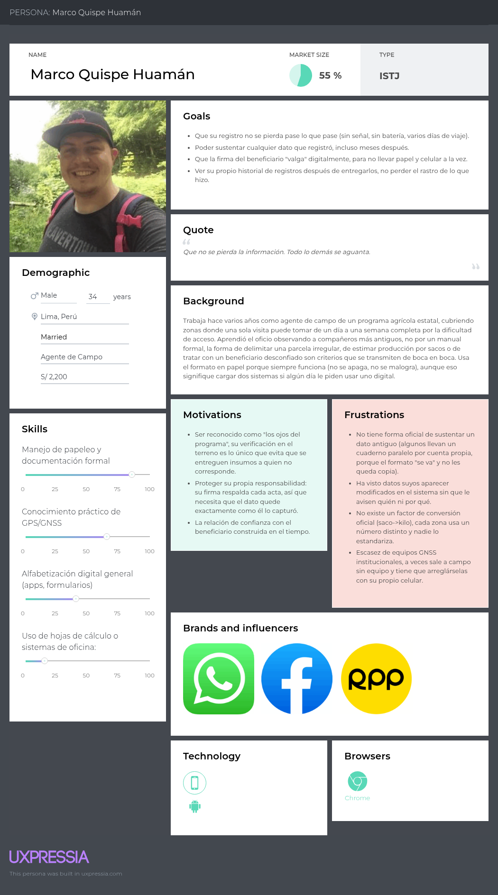
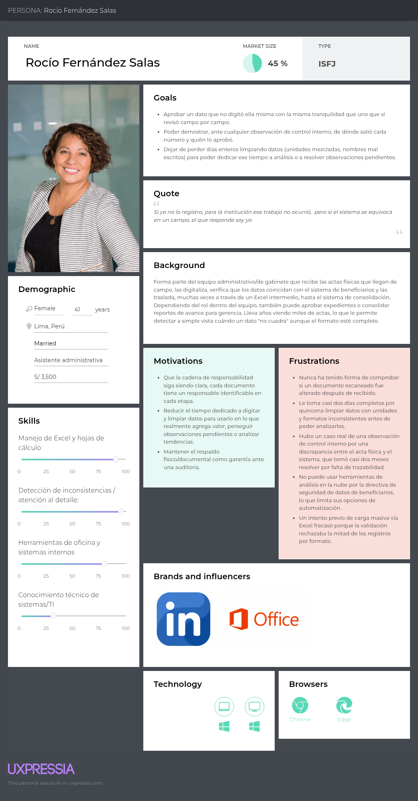

# Registro de Versiones del Informe

# Project Report Collaboration Insights

# Contenido

- [Carátula](#carátula)
- [Registro de Versiones del Informe](#registro-de-versiones-del-informe)
- [Project Report Collaboration Insights](#project-report-collaboration-insights)
- [Student Outcome](#student-outcome)
- [Capítulo I: Introducción](#capítulo-i-introducción)
  - [Startup Profile](#startup-profile)
    - [Descripción de la Startup](#descripción-de-la-startup)
    - [Perfiles de integrantes del equipo](#perfiles-de-integrantes-del-equipo)
  - [Solution Profile](#solution-profile)
    - [Antecedentes y problemática](#antecedentes-y-problemática)
    - [Lean UX Process](#lean-ux-process)
      - [Lean UX Problem Statements](#lean-ux-problem-statements)
      - [Lean UX Assumptions](#lean-ux-assumptions)
      - [Lean UX Hypothesis Statements](#lean-ux-hypothesis-statements)
      - [Lean UX Canvas](#lean-ux-canvas)
  - [Segmentos objetivo](#segmentos-objetivo)
- [Capítulo II: Requirements Elicitation & Analysis](#capítulo-ii-requirements-elicitation--analysis)
  - [Competidores](#competidores)
    - [Análisis competitivo](#análisis-competitivo)
    - [Estrategias y tácticas frente a competidores](#estrategias-y-tácticas-frente-a-competidores)
  - [Entrevistas](#entrevistas)
    - [Diseño de entrevistas](#needfinding-diseno)
    - [Registro de entrevistas](#needfinding-registro)
    - [Análisis de entrevistas](#análisis-de-entrevistas)
  - [Needfinding](#needfinding)
    - [User Personas](#user-personas)
    - [User Task Matrix](#user-task-matrix)
    - [Empathy Mapping](#empathy-mapping)
    - [As-is Scenario Mapping](#as-is-scenario-mapping)
  - [Ubiquitous Language](#ubiquitous-language)
- [Capítulo III: Requirements Specification](#capítulo-iii-requirements-specification)
  - [To-Be Scenario Mapping](#to-be-scenario-mapping)
  - [User Stories](#user-stories)
  - [Impact Mapping](#impact-mapping)
  - [Product Backlog](#product-backlog)
- [Capítulo IV: Strategic-Level Software Design](#capítulo-iv-strategic-level-software-design)
  - [Strategic-Level Attribute-Driven Design](#strategic-level-attribute-driven-design)
    - [Design Purpose](#design-purpose)
    - [Attribute-Driven Design Inputs](#attribute-driven-design-inputs)
      - [Primary Functionality (Primary User Stories)](#primary-functionality-primary-user-stories)
      - [Quality attribute Scenarios](#quality-attribute-scenarios)
      - [Constraints](#constraints)
    - [Architectural Drivers Backlog](#architectural-drivers-backlog)
    - [Architectural Design Decisions](#architectural-design-decisions)
    - [Quality Attribute Scenario Refinements](#quality-attribute-scenario-refinements)
  - [Strategic-Level Domain-Driven Design](#strategic-level-domain-driven-design)
    - [EventStorming](#eventstorming)
    - [Candidate Context Discovery](#candidate-context-discovery)
    - [Domain Message Flows Modeling](#domain-message-flows-modeling)
    - [Bounded Context Canvases](#bounded-context-canvases)
    - [Context Mapping](#context-mapping)
  - [Software Architecture](#software-architecture)
    - [Software Architecture System Landscape Diagram](#software-architecture-system-landscape-diagram)
    - [Software Architecture Context Level Diagrams](#software-architecture-context-level-diagrams)
    - [Software Architecture Container Level Diagrams](#software-architecture-container-level-diagrams)
    - [Software Architecture Deployment Diagrams](#software-architecture-deployment-diagrams)
- [Conclusiones](#conclusiones)
  - [Conclusiones y recomendaciones](#conclusiones-y-recomendaciones)
  - [Video About-The-Team](#video-about-the-team)
- [Bibliografía](#bibliografía)
- [Anexos](#anexos)
  - [Videos de Exposiciones](#videos-de-exposiciones)

# Student Outcome

# Capítulo I: Introducción

## Startup Profile

### Descripción de la Startup

### Perfiles de integrantes del equipo

## Solution Profile

### Antecedentes y problemática

### Lean UX Process

#### Lean UX Problem Statements

#### Lean UX Assumptions

#### Lean UX Hypothesis Statements

#### Lean UX Canvas

## Segmentos objetivo

# Capítulo II: Requirements Elicitation & Analysis

## Competidores

### Análisis competitivo

### Estrategias y tácticas frente a competidores

## Entrevistas

<h3 id="needfinding-diseno">Diseño de entrevistas</h3>

<h3 id="needfinding-registro">Registro de entrevistas</h3>

### Análisis de entrevistas

## Needfinding

### User Personas

A continuación se presentan los artefactos de user persona elaborados para cada segmento objetivo.

**Agente de Campo**  
Representa a quien registra en campo la georreferenciación de las parcelas y la producción de los beneficiarios, bajo condiciones de conectividad limitada y acceso difícil. Su necesidad principal es no perder el registro capturado y poder sustentarlo ante cualquier cuestionamiento posterior, incluso cuando hoy no cuenta con un mecanismo oficial para hacerlo.

**Personal Administrativo y de Gabinete**  
Representa a quien recibe, digitaliza, aprueba y consolida la información que llega desde campo, agrupando los roles de asistente administrativa, coordinador de aprobación y analista de consolidación identificados en las entrevistas. Su necesidad principal es poder confiar en un dato que no digitó personalmente y demostrar en cualquier momento de dónde proviene cada cifra que aprueba o reporta.

### User Task Matrix

En esta sección se presenta el User Task Matrix, que consolida las tareas que realizan los dos User Persona construidos a partir del Needfinding: Marco Quispe Huamán (Agente de Campo) y Rocío Fernández Salas (Personal Administrativo y de Gabinete).Las tareas listadas corresponden a actividades que ambos segmentos realizan independientemente de la existencia de una solución de software, no se incluyen funcionalidades ni características de ningún sistema.

<table style="width: 100%; border-collapse: collapse; border: 1px solid #333; font-family: Arial, sans-serif; font-size: 14px;">
    <thead>
        <tr>
            <th rowspan="2" style="border: 1px solid #333; padding: 8px 10px; text-align: left;">Tarea</th>
            <th colspan="2" style="border: 1px solid #333; padding: 8px 10px; text-align: center;">Marco Quispe Huamán Agente de Campo</th>
            <th colspan="2" style="border: 1px solid #333; padding: 8px 10px; text-align: center;">Rocío Fernández Salas Personal Administrativo y de Gabinete</th>
        </tr>
        <tr>
            <th style="border: 1px solid #333; padding: 8px 10px; text-align: center;">Frecuencia</th>
            <th style="border: 1px solid #333; padding: 8px 10px; text-align: center;">Importancia</th>
            <th style="border: 1px solid #333; padding: 8px 10px; text-align: center;">Frecuencia</th>
            <th style="border: 1px solid #333; padding: 8px 10px; text-align: center;">Importancia</th>
        </tr>
    </thead>
    <tbody>
        <tr><td style="border: 1px solid #333; padding: 8px 10px;">Coordinar la visita con el beneficiario antes de ir a la parcela</td><td style="border: 1px solid #333; padding: 8px 10px; text-align: center;">Alta</td><td style="border: 1px solid #333; padding: 8px 10px; text-align: center;">Alta</td><td style="border: 1px solid #333; padding: 8px 10px; text-align: center;">—</td><td style="border: 1px solid #333; padding: 8px 10px; text-align: center;">—</td></tr>
        <tr><td style="border: 1px solid #333; padding: 8px 10px;">Trasladarse hasta la parcela</td><td style="border: 1px solid #333; padding: 8px 10px; text-align: center;">Alta</td><td style="border: 1px solid #333; padding: 8px 10px; text-align: center;">Media</td><td style="border: 1px solid #333; padding: 8px 10px; text-align: center;">—</td><td style="border: 1px solid #333; padding: 8px 10px; text-align: center;">—</td></tr>
        <tr><td style="border: 1px solid #333; padding: 8px 10px;">Delimitar y medir el área de la parcela</td><td style="border: 1px solid #333; padding: 8px 10px; text-align: center;">Alta</td><td style="border: 1px solid #333; padding: 8px 10px; text-align: center;">Alta</td><td style="border: 1px solid #333; padding: 8px 10px; text-align: center;">—</td><td style="border: 1px solid #333; padding: 8px 10px; text-align: center;">—</td></tr>
        <tr><td style="border: 1px solid #333; padding: 8px 10px;">Capturar evidencia de la visita (fotos, firma y huella del beneficiario)</td><td style="border: 1px solid #333; padding: 8px 10px; text-align: center;">Alta</td><td style="border: 1px solid #333; padding: 8px 10px; text-align: center;">Alta</td><td style="border: 1px solid #333; padding: 8px 10px; text-align: center;">—</td><td style="border: 1px solid #333; padding: 8px 10px; text-align: center;">—</td></tr>
        <tr><td style="border: 1px solid #333; padding: 8px 10px;">Estimar y convertir la cantidad de producción declarada (sacos a kilos)</td><td style="border: 1px solid #333; padding: 8px 10px; text-align: center;">Media</td><td style="border: 1px solid #333; padding: 8px 10px; text-align: center;">Alta</td><td style="border: 1px solid #333; padding: 8px 10px; text-align: center;">—</td><td style="border: 1px solid #333; padding: 8px 10px; text-align: center;">—</td></tr>
        <tr><td style="border: 1px solid #333; padding: 8px 10px;">Completar el acta de registro con los datos de la visita</td><td style="border: 1px solid #333; padding: 8px 10px; text-align: center;">Alta</td><td style="border: 1px solid #333; padding: 8px 10px; text-align: center;">Alta</td><td style="border: 1px solid #333; padding: 8px 10px; text-align: center;">—</td><td style="border: 1px solid #333; padding: 8px 10px; text-align: center;">—</td></tr>
        <tr><td style="border: 1px solid #333; padding: 8px 10px;">Entregar el acta y la evidencia a la oficina zonal</td><td style="border: 1px solid #333; padding: 8px 10px; text-align: center;">Alta</td><td style="border: 1px solid #333; padding: 8px 10px; text-align: center;">Media</td><td style="border: 1px solid #333; padding: 8px 10px; text-align: center;">—</td><td style="border: 1px solid #333; padding: 8px 10px; text-align: center;">—</td></tr>
        <tr><td style="border: 1px solid #333; padding: 8px 10px;">Recibir y organizar las actas físicas que llegan de campo</td><td style="border: 1px solid #333; padding: 8px 10px; text-align: center;">—</td><td style="border: 1px solid #333; padding: 8px 10px; text-align: center;">—</td><td style="border: 1px solid #333; padding: 8px 10px; text-align: center;">Alta</td><td style="border: 1px solid #333; padding: 8px 10px; text-align: center;">Media</td></tr>
        <tr><td style="border: 1px solid #333; padding: 8px 10px;">Digitalizar (escanear) las actas</td><td style="border: 1px solid #333; padding: 8px 10px; text-align: center;">—</td><td style="border: 1px solid #333; padding: 8px 10px; text-align: center;">—</td><td style="border: 1px solid #333; padding: 8px 10px; text-align: center;">Alta</td><td style="border: 1px solid #333; padding: 8px 10px; text-align: center;">Media</td></tr>
        <tr><td style="border: 1px solid #333; padding: 8px 10px;">Verificar los datos del acta contra el sistema de beneficiarios</td><td style="border: 1px solid #333; padding: 8px 10px; text-align: center;">—</td><td style="border: 1px solid #333; padding: 8px 10px; text-align: center;">—</td><td style="border: 1px solid #333; padding: 8px 10px; text-align: center;">Alta</td><td style="border: 1px solid #333; padding: 8px 10px; text-align: center;">Alta</td></tr>
        <tr><td style="border: 1px solid #333; padding: 8px 10px;">Transcribir los datos del acta al sistema de consolidación</td><td style="border: 1px solid #333; padding: 8px 10px; text-align: center;">—</td><td style="border: 1px solid #333; padding: 8px 10px; text-align: center;">—</td><td style="border: 1px solid #333; padding: 8px 10px; text-align: center;">Alta</td><td style="border: 1px solid #333; padding: 8px 10px; text-align: center;">Baja</td></tr>
        <tr><td style="border: 1px solid #333; padding: 8px 10px;">Detectar y resolver inconsistencias en los datos registrados</td><td style="border: 1px solid #333; padding: 8px 10px; text-align: center;">—</td><td style="border: 1px solid #333; padding: 8px 10px; text-align: center;">—</td><td style="border: 1px solid #333; padding: 8px 10px; text-align: center;">Media</td><td style="border: 1px solid #333; padding: 8px 10px; text-align: center;">Alta</td></tr>
        <tr><td style="border: 1px solid #333; padding: 8px 10px;">Aprobar el expediente una vez verificado</td><td style="border: 1px solid #333; padding: 8px 10px; text-align: center;">—</td><td style="border: 1px solid #333; padding: 8px 10px; text-align: center;">—</td><td style="border: 1px solid #333; padding: 8px 10px; text-align: center;">Alta</td><td style="border: 1px solid #333; padding: 8px 10px; text-align: center;">Alta</td></tr>
        <tr><td style="border: 1px solid #333; padding: 8px 10px;">Consolidar los expedientes aprobados en el reporte de avance</td><td style="border: 1px solid #333; padding: 8px 10px; text-align: center;">—</td><td style="border: 1px solid #333; padding: 8px 10px; text-align: center;">—</td><td style="border: 1px solid #333; padding: 8px 10px; text-align: center;">Media</td><td style="border: 1px solid #333; padding: 8px 10px; text-align: center;">Alta</td></tr>
        <tr><td style="border: 1px solid #333; padding: 8px 10px;">Sustentar el origen de un dato registrado ante un cuestionamiento posterior</td><td style="border: 1px solid #333; padding: 8px 10px; text-align: center;">Media</td><td style="border: 1px solid #333; padding: 8px 10px; text-align: center;">Alta</td><td style="border: 1px solid #333; padding: 8px 10px; text-align: center;">Baja</td><td style="border: 1px solid #333; padding: 8px 10px; text-align: center;">Alta</td></tr>
    </tbody>
</table>

Para Marco, las tareas de mayor frecuencia e importancia combinadas son delimitar y medir la parcela, capturar la evidencia de la visita y completar el acta. Todo eso es el núcleo de su trabajo, requiere su criterio de campo y sustentación de su propia responsabilidad legal frente al beneficiario y la institución. Para Rocío, las de mayor peso son verificar los datos contra el sistema de beneficiarios y aprobar el expediente. Las tareas donde recae directamente su responsabilidad ("si yo le di conforme, es mío") y donde su experiencia acumulada marca la diferencia frente a alguien sin criterio formado.

La diferencia más notoria aparece en transcribir los datos al sistema, porque es una tarea de alta frecuencia para Rocío, pero de baja importancia respecto a sus propios objetivos, ya que no requiere su criterio y le consume el tiempo que preferiría dedicar a resolver observaciones pendientes o a analizar tendencias. Esto la convierte en la tarea con mayor potencial de automatización sin afectar el juicio experto de la persona. En el caso de Marco, estimar y convertir la producción combina una frecuencia media con una importancia alta y es, a la vez, su mayor fuente de error, ya que no existe un factor de conversión oficial entre sacos y kilos.

La coincidencia más relevante entre ambos segmentos es sustentar el origen de un dato registrado ante un cuestionamiento posterior. Ambos la consideran de alta importancia, pero ninguno cuenta hoy con un mecanismo confiable para resolverla. Marco depende de un cuaderno personal o de su memoria, en cambio, Rocío depende del acta física archivada como única prueba ante una auditoría. En términos generales, las tareas de ambos segmentos no se superponen en el proceso. Marco genera el dato en el origen (en campo), mientras que Rocío lo valida y consolida en oficina, solo convergen en la necesidad compartida de poder demostrar la trazabilidad de ese dato en cualquier momento.

### Empathy Mapping

### As-is Scenario Mapping

## Ubiquitous Language

# Capítulo III: Requirements Specification

## To-Be Scenario Mapping

## User Stories

## Impact Mapping

## Product Backlog

# Capítulo IV: Strategic-Level Software Design

## Strategic-Level Attribute-Driven Design

### Design Purpose

### Attribute-Driven Design Inputs

#### Primary Functionality (Primary User Stories)

#### Quality attribute Scenarios

#### Constraints

### Architectural Drivers Backlog

### Architectural Design Decisions

### Quality Attribute Scenario Refinements

## Strategic-Level Domain-Driven Design

### EventStorming

### Candidate Context Discovery

### Domain Message Flows Modeling

### Bounded Context Canvases

### Context Mapping

## Software Architecture

### Software Architecture System Landscape Diagram

### Software Architecture Context Level Diagrams

### Software Architecture Container Level Diagrams

### Software Architecture Deployment Diagrams

# Conclusiones

## Conclusiones y recomendaciones

## Video About-The-Team

# Bibliografía

# Anexos

## Videos de Exposiciones

