

    

        
    

    
Universidad Peruana de Ciencias Aplicadas

    
Carrera de Ingeniería de Software

    <h2 style="font-size: 18px; margin: 15px 0 0 0;">ASI0728</h2>
    <h2 style="font-size: 18px; margin: 10px 0 10px 0;">Arquitecturas de Software Emergentes</h2>
    
NRC

    <h2 style="font-size: 18px; margin: 5px 0;">9075</h2>
    <h2 style="font-size: 18px; margin: 10px 0 5px 0;">Informe de Trabajo Final</h2>
    
Docente

    <h2 style="font-size: 18px; margin: 5px 0 40px 0;">Vega Calero, Wilder Aurelio</h2>
    
Equipo

    <h2 style="font-size: 18px; margin: 0px 0 40px 0;">Soulware</h2>
    
Proyecto

    <h2 style="font-size: 18px; margin: 0px 0 30px 0;">SGT</h2>
    
<strong>Integrantes:</strong>

    <table style="width: max-content; border-collapse: collapse; margin: 0 auto 50px auto;">
        <thead>
            <tr>
                <th style="border: 0px; text-align: left; padding: 5px 15px 5px 0;">Código</th>
                <th style="border: 0px; text-align: left; padding: 5px 0 5px 15px;">Apellidos y Nombres</th>
            </tr>
        </thead>
        <tbody>
            <tr>
                <td style="border: 0px; text-align: left; padding: 5px 15px 5px 0;">20221g120</td>
                <td style="border: 0px; text-align: left; padding: 5px 0 5px 15px;">Crispin Ramos, Daniel Franco</td>
            </tr>
            <tr>
                <td style="border: 0px; text-align: left; padding: 5px 15px 5px 0;">202310210</td>
                <td style="border: 0px; text-align: left; padding: 5px 0 5px 15px;">Esteban Roman, Henry Kalet</td>
            </tr>
            <tr>
                <td style="border: 0px; text-align: left; padding: 5px 15px 5px 0;">202220783</td>
                <td style="border: 0px; text-align: left; padding: 5px 0 5px 15px;">Orozco Torres, Álvaro Joaquín</td>
            </tr>
            <tr>
                <td style="border: 0px; text-align: left; padding: 5px 15px 5px 0;">20221e247</td>
                <td style="border: 0px; text-align: left; padding: 5px 0 5px 15px;">Reaño Delgadillo, Henry Paolo</td>
            </tr>
            <tr>
                <td style="border: 0px; text-align: left; padding: 5px 15px 5px 0;">20231a778</td>
                <td style="border: 0px; text-align: left; padding: 5px 0 5px 15px;">Vilca Saboya, Diego Alejandro</td>
            </tr>
        </tbody>
    </table>
    

        
Periodo 2620

    

# Registro de Versiones del Informe

Esta sección resume las modificaciones relevantes realizadas al informe durante el ciclo de vida del proyecto. Cada versión corresponde a la incorporación, corrección o mejora de una o más secciones, y todas las registradas a la fecha forman parte del avance hacia las entregas TB1 y TP1.

    <table style="width: 100%; border-collapse: collapse; border: 1px solid #333;">
        <thead>
            <tr>
                <th style="border: 1px solid #333; padding: 8px 10px; text-align: left;">Versión</th>
                <th style="border: 1px solid #333; padding: 8px 10px; text-align: left;">Fecha</th>
                <th style="border: 1px solid #333; padding: 8px 10px; text-align: left;">Autor</th>
                <th style="border: 1px solid #333; padding: 8px 10px; text-align: left;">Descripción de modificación</th>
            </tr>
        </thead>
        <tbody>
            <tr>
                <td style="border: 1px solid #333; padding: 10px; vertical-align: top; text-align: left;">1.0.0</td>
                <td style="border: 1px solid #333; padding: 10px; vertical-align: top; text-align: left;">2026-09-20</td>
                <td style="border: 1px solid #333; padding: 10px; vertical-align: top; text-align: left;">Crispin Ramos, Daniel Franco Esteban Román, Henry Kalet Orozco Torres, Álvaro Joaquín Reaño Delgadillo, Henry Paolo Vilca Saboya, Diego Alejandro</td>
                <td style="border: 1px solid #333; padding: 10px; vertical-align: top; text-align: left;">Versión inicial del informe para la entrega TB1. Estructura base del repositorio, configuración de mdm y del workflow de CI. Carátula Registro de Versiones del Informe Project Report Collaboration Insights Student Outcome Capítulo I: Introducción - Startup Profile - Solution Profile: antecedentes y problemática bajo 5W+2H, Lean UX Process - Segmentos objetivo Capítulo II: Requirements Elicitation & Analysis - Competidores - Entrevistas: diseño, registro y análisis - Needfinding: User Personas, User Task Matrix, Empathy Mapping y As-Is Scenario Mapping - Ubiquitous Language Capítulo III: Requirements Specification - To-Be Scenario Mapping - User Stories - Impact Mapping - Product Backlog Capítulo IV: Strategic-Level Software Design - Attribute-Driven Design - Strategic-Level Domain-Driven Design - Software Architecture Conclusiones Bibliografía</td>
            </tr>
            <tr>
                <td style="border: 1px solid #333; padding: 10px; vertical-align: top; text-align: left;">2.0.0</td>
                <td style="border: 1px solid #333; padding: 10px; vertical-align: top; text-align: left;">2026-10-09</td>
                <td style="border: 1px solid #333; padding: 10px; vertical-align: top; text-align: left;">Crispin Ramos, Daniel Franco Esteban Román, Henry Kalet Orozco Torres, Álvaro Joaquín Reaño Delgadillo, Henry Paolo Vilca Saboya, Diego Alejandro</td>
                <td style="border: 1px solid #333; padding: 10px; vertical-align: top; text-align: left;">Incorporación de los Capítulos V y VI para la entrega TP1. Capítulo V: Tactical-Level Software Design - Bounded Contexts: Beneficiarios, Directory, IdentityProvider, Monitoring, People, Planning y Plots - Por cada contexto: Domain Layer, Interface Layer, Application Layer, Infrastructure Layer, diagramas de componentes, de clases y de base de datos - Ajuste del formato de las tablas para la exportación a PDF en tamaño A4 Capítulo VI: Solution UX Design - Style Guidelines: General y Web, Mobile &amp; Devices - Information Architecture: Organization, Labeling, SEO Tags y Meta Tags, Navigation y Searching Systems - Landing Page UI Design: wireframes y mock-ups - Applications UX/UI Design: wireframes y wireflows Actualización de Registro de Versiones, Student Outcome, Conclusiones y Bibliografía.</td>
            </tr>
        </tbody>
    </table>

# Project Report Collaboration Insights

URL del repositorio para el Project Report: [https://github.com/Soulware-Emergentes/report](https://github.com/Soulware-Emergentes/report)

Se utilizó GitHub como plataforma de control de versiones y colaboración en equipo, dentro de la organización pública Soulware-Emergentes. Se siguió el flujo de trabajo GitFlow con las ramas principales main y develop, y ramas de trabajo por capítulo y por sección para cada contribución individual, que se integran a develop mediante pull request. El documento combinado se genera automáticamente desde las secciones en Markdown, de modo que ningún integrante lo edita a mano y los conflictos se reducen a la sección que cada uno está redactando.

Los integrantes del equipo y sus nombres de usuario en GitHub son los siguientes:

    <table style="width: 100%; border-collapse: collapse; border: 1px solid #333;">
        <thead>
            <tr>
                <th style="border: 1px solid #333; padding: 8px 10px; text-align: left;">Integrante</th>
                <th style="border: 1px solid #333; padding: 8px 10px; text-align: left;">Código</th>
                <th style="border: 1px solid #333; padding: 8px 10px; text-align: left;">Nombre en GitHub</th>
            </tr>
        </thead>
        <tbody>
            <tr>
                <td style="border: 1px solid #333; padding: 10px; vertical-align: top; text-align: left;">Crispin Ramos, Daniel Franco</td>
                <td style="border: 1px solid #333; padding: 10px; vertical-align: top; text-align: left;">20221g120</td>
                <td style="border: 1px solid #333; padding: 10px; vertical-align: top; text-align: left;">danielcr04</td>
            </tr>
            <tr>
                <td style="border: 1px solid #333; padding: 10px; vertical-align: top; text-align: left;">Esteban Román, Henry Kalet</td>
                <td style="border: 1px solid #333; padding: 10px; vertical-align: top; text-align: left;">202310210</td>
                <td style="border: 1px solid #333; padding: 10px; vertical-align: top; text-align: left;">kalet123-commit</td>
            </tr>
            <tr>
                <td style="border: 1px solid #333; padding: 10px; vertical-align: top; text-align: left;">Orozco Torres, Álvaro Joaquín</td>
                <td style="border: 1px solid #333; padding: 10px; vertical-align: top; text-align: left;">202220783</td>
                <td style="border: 1px solid #333; padding: 10px; vertical-align: top; text-align: left;">overGDev</td>
            </tr>
            <tr>
                <td style="border: 1px solid #333; padding: 10px; vertical-align: top; text-align: left;">Reaño Delgadillo, Henry Paolo</td>
                <td style="border: 1px solid #333; padding: 10px; vertical-align: top; text-align: left;">20221e247</td>
                <td style="border: 1px solid #333; padding: 10px; vertical-align: top; text-align: left;">PaoloHRRR</td>
            </tr>
            <tr>
                <td style="border: 1px solid #333; padding: 10px; vertical-align: top; text-align: left;">Vilca Saboya, Diego Alejandro</td>
                <td style="border: 1px solid #333; padding: 10px; vertical-align: top; text-align: left;">20231a778</td>
                <td style="border: 1px solid #333; padding: 10px; vertical-align: top; text-align: left;">diesoks</td>
            </tr>
        </tbody>
    </table>

**TB1**

Tareas asignadas

Para el desarrollo del TB1, cada participante del equipo realizó las siguientes tareas:

    <table style="width: 100%; border-collapse: collapse; border: 1px solid #333;">
        <thead>
            <tr>
                <th style="border: 1px solid #333; padding: 8px 10px; text-align: left;">Integrante</th>
                <th style="border: 1px solid #333; padding: 8px 10px; text-align: left;">Tareas asignadas</th>
            </tr>
        </thead>
        <tbody>
            <tr>
                <td style="border: 1px solid #333; padding: 10px; vertical-align: top; text-align: left;">Crispin Ramos, Daniel Franco</td>
                <td style="border: 1px solid #333; padding: 10px; vertical-align: top; text-align: left;">Capítulo III: To-Be Scenario Mapping para ambos User Persona, con la elaboración de los mapas y su redacción comparativa frente al As-Is. Impact Mapping, incluyendo la formulación de los objetivos SMART y la vinculación de cada rama con sus User Stories. Actualización de los identificadores de User Story referenciados en el Impact Mapping.</td>
            </tr>
            <tr>
                <td style="border: 1px solid #333; padding: 10px; vertical-align: top; text-align: left;">Esteban Román, Henry Kalet</td>
                <td style="border: 1px solid #333; padding: 10px; vertical-align: top; text-align: left;">Capítulo II: diseño de entrevistas para ambos segmentos, registro de las seis entrevistas con sus fichas completas y análisis de entrevistas con el sustento estadístico por segmento. Incorporación de los datos reales de los entrevistados, enlaces de video, timing y capturas. Registro de Versiones del Informe, Project Report Collaboration Insights y Student Outcome.</td>
            </tr>
            <tr>
                <td style="border: 1px solid #333; padding: 10px; vertical-align: top; text-align: left;">Orozco Torres, Álvaro Joaquín</td>
                <td style="border: 1px solid #333; padding: 10px; vertical-align: top; text-align: left;">Estructura base del repositorio, configuración de mdm y del workflow de CI. Carátula, perfiles del equipo y descripción de la startup. Capítulo I: Solution Profile y Segmentos objetivo. Capítulo II: análisis competitivo y estrategias frente a competidores. Capítulo III: User Stories y Product Backlog. Capítulo IV: Architectural Drivers Backlog, Architectural Design Decisions y Quality Attribute Scenario Refinements. Conclusiones y bibliografía.</td>
            </tr>
            <tr>
                <td style="border: 1px solid #333; padding: 10px; vertical-align: top; text-align: left;">Reaño Delgadillo, Henry Paolo</td>
                <td style="border: 1px solid #333; padding: 10px; vertical-align: top; text-align: left;">Capítulo IV: primera versión del Attribute-Driven Design con el Design Purpose y sus inputs. Strategic-Level Domain-Driven Design completo, incluyendo EventStorming, Candidate Context Discovery, Domain Message Flows Modeling, Bounded Context Canvases y Context Mapping. Software Architecture con los diagramas de System Landscape, Context, Container y Deployment.</td>
            </tr>
            <tr>
                <td style="border: 1px solid #333; padding: 10px; vertical-align: top; text-align: left;">Vilca Saboya, Diego Alejandro</td>
                <td style="border: 1px solid #333; padding: 10px; vertical-align: top; text-align: left;">Capítulo II: Needfinding completo, con la elaboración de las fichas de User Persona, el User Task Matrix, los Empathy Maps y los As-Is Scenario Mapping para ambos segmentos. Ubiquitous Language con los términos del dominio del programa de apoyo agrícola.</td>
            </tr>
        </tbody>
    </table>

GitHub Collaboration Insights

Para el TB1 el equipo trabajó en la organización [https://github.com/Soulware-Emergentes](https://github.com/Soulware-Emergentes), que contiene el repositorio report con el informe del proyecto, gestionado con el flujo GitFlow y ramas de trabajo por sección para cada integrante.

Gráfico de commits por integrante durante TB1:

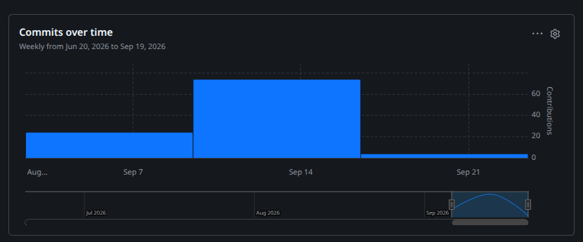

Gráfico de red (network graph) de ramas en el repositorio durante TB1:

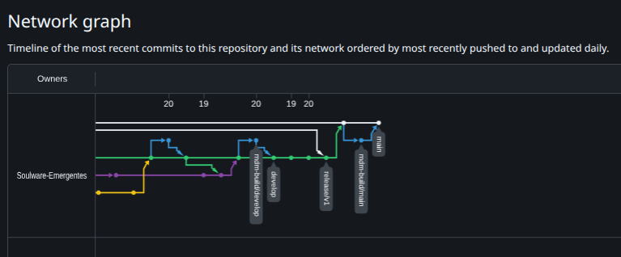

Contribuciones de los integrantes durante TB1:

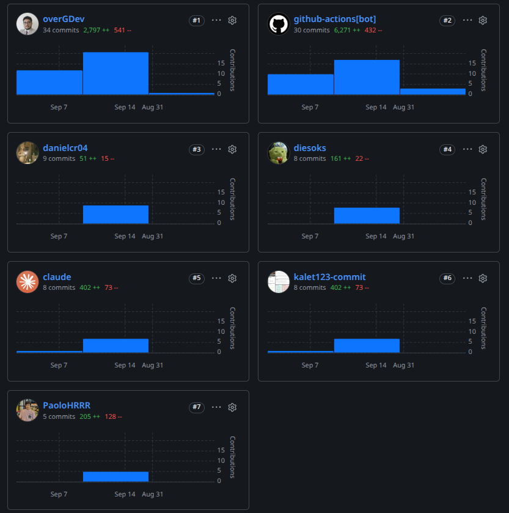

**TP1**

Tareas asignadas

Para el desarrollo del TP1, cada participante del equipo realizó las siguientes tareas:

    <table style="width: 100%; border-collapse: collapse; border: 1px solid #333;">
        <thead>
            <tr>
                <th style="border: 1px solid #333; padding: 8px 10px; text-align: left;">Integrante</th>
                <th style="border: 1px solid #333; padding: 8px 10px; text-align: left;">Tareas asignadas</th>
            </tr>
        </thead>
        <tbody>
            <tr>
                <td style="border: 1px solid #333; padding: 10px; vertical-align: top; text-align: left;">Crispin Ramos, Daniel Franco</td>
                <td style="border: 1px solid #333; padding: 10px; vertical-align: top; text-align: left;">Capítulo VI: Landing Page UI Design, con los wireframes y los mock-ups de la landing page informativa de SGT, incluyendo la estructura y el orden de lectura de la página y la aplicación de la identidad visual definida en la guía de estilos.</td>
            </tr>
            <tr>
                <td style="border: 1px solid #333; padding: 10px; vertical-align: top; text-align: left;">Esteban Román, Henry Kalet</td>
                <td style="border: 1px solid #333; padding: 10px; vertical-align: top; text-align: left;">Capítulo VI: Applications UX/UI Design, con los wireframes de las aplicaciones móvil Android y web, y seis wireflows con su User Goal, Task Flow, recorrido principal y respuestas alternativas, vinculados a las User Stories SGT-10 y SGT-2.</td>
            </tr>
            <tr>
                <td style="border: 1px solid #333; padding: 10px; vertical-align: top; text-align: left;">Orozco Torres, Álvaro Joaquín</td>
                <td style="border: 1px solid #333; padding: 10px; vertical-align: top; text-align: left;">Capítulo V: Tactical-Level Software Design, elaborado junto con Paolo. Bounded Contexts Beneficiarios, Directory, IdentityProvider, Monitoring, People, Planning y Plots, con sus capas Domain, Interface, Application e Infrastructure y sus diagramas de componentes, de clases y de base de datos.</td>
            </tr>
            <tr>
                <td style="border: 1px solid #333; padding: 10px; vertical-align: top; text-align: left;">Reaño Delgadillo, Henry Paolo</td>
                <td style="border: 1px solid #333; padding: 10px; vertical-align: top; text-align: left;">Capítulo V: Tactical-Level Software Design, elaborado junto con Álvaro. Bounded Contexts Beneficiarios, Directory, IdentityProvider, Monitoring, People, Planning y Plots, con sus capas Domain, Interface, Application e Infrastructure y sus diagramas de componentes, de clases y de base de datos.</td>
            </tr>
            <tr>
                <td style="border: 1px solid #333; padding: 10px; vertical-align: top; text-align: left;">Vilca Saboya, Diego Alejandro</td>
                <td style="border: 1px solid #333; padding: 10px; vertical-align: top; text-align: left;">Capítulo VI: Style Guidelines general y Web, Mobile &amp; Devices, con los colores, la tipografía, el espaciado, los componentes y el logotipo en Figma. Information Architecture con los Organization, Labeling, Navigation y Searching Systems y los SEO Tags y Meta Tags. Ajuste del formato de las tablas del Capítulo V para la exportación a PDF en tamaño A4. Actualización de Registro de Versiones, Conclusiones, Student Outcome y Project Report Collaboration Insights para el TP1.</td>
            </tr>
        </tbody>
    </table>

GitHub Collaboration Insights

Para el TP1 el equipo trabajó en la organización [https://github.com/Soulware-Emergentes](https://github.com/Soulware-Emergentes), que contiene el repositorio report con el informe del proyecto, gestionado con el flujo GitFlow y ramas de trabajo por capítulo y por sección para cada integrante.

Gráfico de commits por integrante durante TP1:

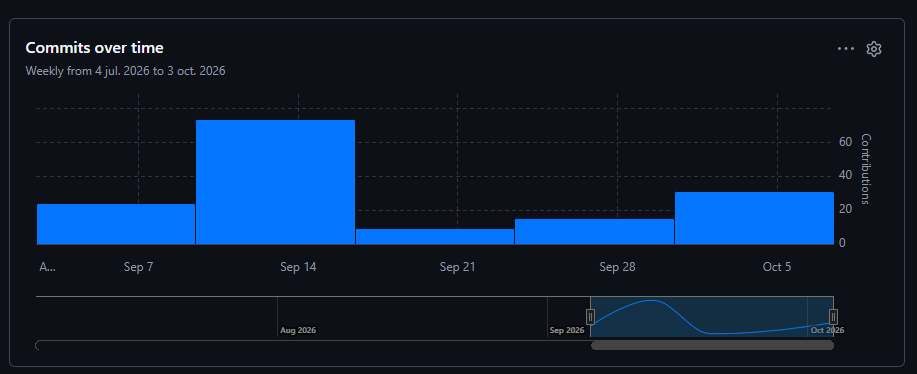

Gráfico de red (network graph) de ramas en el repositorio durante TP1:

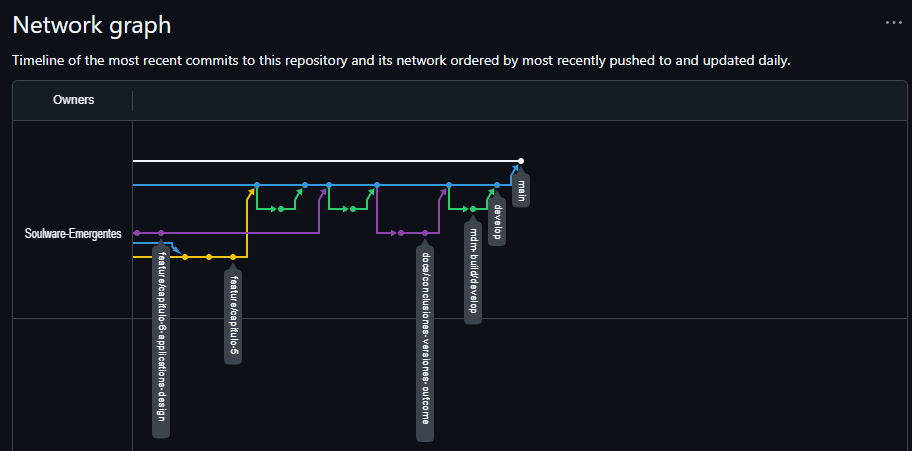

Contribuciones de los integrantes durante TP1:

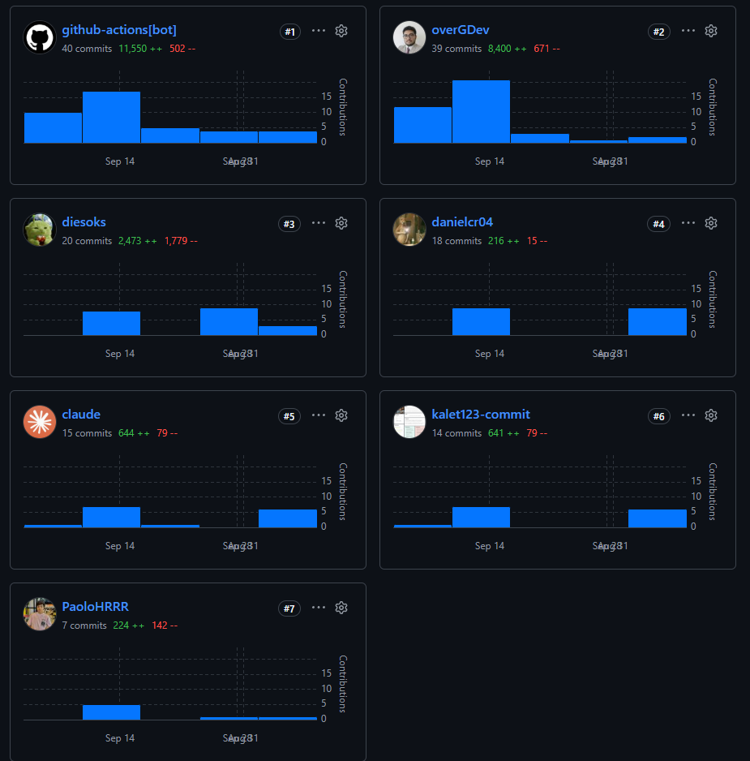

# Contenido

- [Carátula](#carátula)
- [Registro de Versiones del Informe](#registro-de-versiones-del-informe)
- [Project Report Collaboration Insights](#project-report-collaboration-insights)
- [Student Outcome](#student-outcome)
- [Capítulo I: Introducción](#capítulo-i-introducción)
  - [Startup Profile](#startup-profile)
    - [Descripción de la Startup](#descripción-de-la-startup)
    - [Perfiles de integrantes del equipo](#perfiles-de-integrantes-del-equipo)
  - [Solution Profile](#solution-profile)
    - [Antecedentes y problemática](#antecedentes-y-problemática)
    - [Lean UX Process](#lean-ux-process)
      - [Lean UX Problem Statements](#lean-ux-problem-statements)
      - [Lean UX Assumptions](#lean-ux-assumptions)
      - [Lean UX Hypothesis Statements](#lean-ux-hypothesis-statements)
      - [Lean UX Canvas](#lean-ux-canvas)
  - [Segmentos objetivo](#segmentos-objetivo)
- [Capítulo II: Requirements Elicitation & Analysis](#capítulo-ii-requirements-elicitation--analysis)
  - [Competidores](#competidores)
    - [Análisis competitivo](#análisis-competitivo)
    - [Estrategias y tácticas frente a competidores](#estrategias-y-tácticas-frente-a-competidores)
  - [Entrevistas](#entrevistas)
    - [Diseño de entrevistas](#needfinding-diseno)
    - [Registro de entrevistas](#needfinding-registro)
    - [Análisis de entrevistas](#análisis-de-entrevistas)
  - [Needfinding](#needfinding)
    - [User Personas](#user-personas)
    - [User Task Matrix](#user-task-matrix)
    - [Empathy Mapping](#empathy-mapping)
    - [As-is Scenario Mapping](#as-is-scenario-mapping)
  - [Ubiquitous Language](#ubiquitous-language)
- [Capítulo III: Requirements Specification](#capítulo-iii-requirements-specification)
  - [To-Be Scenario Mapping](#to-be-scenario-mapping)
  - [User Stories](#user-stories)
  - [Impact Mapping](#impact-mapping)
  - [Product Backlog](#product-backlog)
- [Capítulo IV: Strategic-Level Software Design](#capítulo-iv-strategic-level-software-design)
  - [Strategic-Level Attribute-Driven Design](#strategic-level-attribute-driven-design)
    - [Design Purpose](#design-purpose)
    - [Attribute-Driven Design Inputs](#attribute-driven-design-inputs)
      - [Primary Functionality (Primary User Stories)](#primary-functionality-primary-user-stories)
      - [Quality attribute Scenarios](#quality-attribute-scenarios)
      - [Constraints](#constraints)
    - [Architectural Drivers Backlog](#architectural-drivers-backlog)
    - [Architectural Design Decisions](#architectural-design-decisions)
    - [Quality Attribute Scenario Refinements](#quality-attribute-scenario-refinements)
  - [Strategic-Level Domain-Driven Design](#strategic-level-domain-driven-design)
    - [EventStorming](#eventstorming)
    - [Candidate Context Discovery](#candidate-context-discovery)
    - [Domain Message Flows Modeling](#domain-message-flows-modeling)
    - [Bounded Context Canvases](#bounded-context-canvases)
    - [Context Mapping](#context-mapping)
  - [Software Architecture](#software-architecture)
    - [Software Architecture System Landscape Diagram](#software-architecture-system-landscape-diagram)
    - [Software Architecture Context Level Diagrams](#software-architecture-context-level-diagrams)
    - [Software Architecture Container Level Diagrams](#software-architecture-container-level-diagrams)
    - [Software Architecture Deployment Diagrams](#software-architecture-deployment-diagrams)
- [Capítulo V: Tactical-Level Software Design](#capítulo-v-tactical-level-software-design)
  - [Bounded Context: Monitoring](#bounded-context-monitoring)
    - [Domain Layer](#monitoring-domain-layer)
    - [Interface Layer](#monitoring-interface-layer)
    - [Application Layer](#monitoring-application-layer)
    - [Infrastructure Layer](#monitoring-infrastructure-layer)
    - [Bounded Context Software Architecture Component Level Diagrams](#monitoring-component-level)
    - [Bounded Context Software Architecture Code Level Diagrams](#monitoring-code-level)
      - [Bounded Context Domain Layer Class Diagrams](#monitoring-class-diagram)
      - [Bounded Context Database Design Diagram](#monitoring-db-diagram)
  - [Bounded Context: Plots](#bounded-context-plots)
    - [Domain Layer](#plots-domain-layer)
    - [Interface Layer](#plots-interface-layer)
    - [Application Layer](#plots-application-layer)
    - [Infrastructure Layer](#plots-infrastructure-layer)
    - [Bounded Context Software Architecture Component Level Diagrams](#plots-component-level)
    - [Bounded Context Software Architecture Code Level Diagrams](#plots-code-level)
      - [Bounded Context Domain Layer Class Diagrams](#plots-class-diagram)
      - [Bounded Context Database Design Diagram](#plots-db-diagram)
  - [Bounded Context: People](#bounded-context-people)
    - [Domain Layer](#people-domain-layer)
    - [Application Layer](#people-application-layer)
    - [Infrastructure Layer](#people-infrastructure-layer)
    - [Bounded Context Software Architecture Component Level Diagrams](#people-component-level)
    - [Bounded Context Software Architecture Code Level Diagrams](#people-code-level)
      - [Bounded Context Domain Layer Class Diagrams](#people-class-diagram)
  - [Bounded Context: Planning](#bounded-context-planning)
    - [Domain Layer](#planning-domain-layer)
    - [Interface Layer](#planning-interface-layer)
    - [Application Layer](#planning-application-layer)
    - [Infrastructure Layer](#planning-infrastructure-layer)
    - [Bounded Context Software Architecture Component Level Diagrams](#planning-component-level)
    - [Bounded Context Software Architecture Code Level Diagrams](#planning-code-level)
      - [Bounded Context Domain Layer Class Diagrams](#planning-class-diagram)
      - [Bounded Context Database Design Diagram](#planning-db-diagram)
  - [Bounded Context: Directory](#bounded-context-directory)
    - [Domain Layer](#directory-domain-layer)
    - [Interface Layer](#directory-interface-layer)
    - [Application Layer](#directory-application-layer)
    - [Infrastructure Layer](#directory-infrastructure-layer)
    - [Bounded Context Software Architecture Component Level Diagrams](#directory-component-level)
    - [Bounded Context Software Architecture Code Level Diagrams](#directory-code-level)
      - [Bounded Context Domain Layer Class Diagrams](#directory-class-diagram)
      - [Bounded Context Database Design Diagram](#directory-db-diagram)
  - [Bounded Context: Identity Provider](#bounded-context-identity-provider)
    - [Domain Layer](#identityprovider-domain-layer)
    - [Interface Layer](#identityprovider-interface-layer)
    - [Application Layer](#identityprovider-application-layer)
    - [Infrastructure Layer](#identityprovider-infrastructure-layer)
    - [Bounded Context Software Architecture Component Level Diagrams](#identityprovider-component-level)
    - [Bounded Context Software Architecture Code Level Diagrams](#identityprovider-code-level)
      - [Bounded Context Domain Layer Class Diagrams](#identityprovider-class-diagram)
      - [Bounded Context Database Design Diagram](#identityprovider-db-diagram)
  - [Bounded Context: Beneficiarios](#bounded-context-beneficiarios)
    - [Domain Layer](#beneficiarios-domain-layer)
    - [Interface Layer](#beneficiarios-interface-layer)
    - [Application Layer](#beneficiarios-application-layer)
    - [Infrastructure Layer](#beneficiarios-infrastructure-layer)
    - [Bounded Context Software Architecture Component Level Diagrams](#beneficiarios-component-level)
    - [Bounded Context Software Architecture Code Level Diagrams](#beneficiarios-code-level)
      - [Bounded Context Domain Layer Class Diagrams](#beneficiarios-class-diagram)
      - [Bounded Context Database Design Diagram](#beneficiarios-db-diagram)
- [Capítulo VI: Solution UX Design](#capítulo-vi-solution-ux-design)
  - [Style Guidelines](#style-guidelines)
    - [General Style Guidelines](#general-style-guidelines)
    - [Web, Mobile & Devices Style Guidelines](#web-mobile--devices-style-guidelines)
  - [Information Architecture](#information-architecture)
    - [Organization Systems](#organization-systems)
    - [Labeling Systems](#labeling-systems)
    - [Searching Systems](#searching-systems)
    - [SEO Tags and Meta Tags](#seo-tags-and-meta-tags)
    - [Navigation Systems](#navigation-systems)
  - [Landing Page UI Design](#landing-page-ui-design)
    - [Landing Page Wireframe](#landing-page-wireframe)
    - [Landing Page Mock-up](#landing-page-mock-up)
  - [Applications UX/UI Design](#applications-ux-ui-design)
    - [Applications Wireframes](#applications-wireframes)
    - [Applications Wireflow Diagrams](#applications-wireflow-diagrams)
- [Conclusiones](#conclusiones)
  - [Conclusiones y recomendaciones](#conclusiones-y-recomendaciones)
- [Bibliografía](#bibliografía)
- [Anexos](#anexos)
  - [Videos de Exposiciones](#videos-de-exposiciones)

# Student Outcome

El curso contribuye al cumplimiento del Student Outcome ABET: ABET – EAC - Student Outcome 3

Criterio: Capacidad de comunicarse efectivamente con un rango de audiencias.

En el siguiente cuadro se describe las acciones realizadas y enunciados de conclusiones por parte del grupo, que permiten sustentar el haber alcanzado el logro del ABET – EAC - Student Outcome 3.

<table style="width: 100%; border-collapse: collapse; border: 1px solid #333; font-family: Arial, sans-serif; font-size: 14px;">
    <thead>
        <tr>
            <th style="border: 1px solid #333; padding: 8px 10px; text-align: left; width: 18%;">Criterio específico</th>
            <th style="border: 1px solid #333; padding: 8px 10px; text-align: left; width: 52%;">Acciones realizadas</th>
            <th style="border: 1px solid #333; padding: 8px 10px; text-align: left; width: 30%;">Conclusiones</th>
        </tr>
    </thead>
    <tbody>
        <tr>
            <td style="border: 1px solid #333; padding: 10px; vertical-align: top;">3.c1. Comunica oralmente sus ideas y/o resultados con objetividad a público de diferentes especialidades y niveles jerárquicos, en el marco del desarrollo de un proyecto en ingeniería.</td>
            <td style="border: 1px solid #333; padding: 10px; vertical-align: top;">
                
<strong>Crispin Ramos, Daniel Franco</strong> 
                TB1: Condujo la sesión de trabajo en la que el equipo revisó el As-Is de cada User Persona y acordó las fases del To-Be, explicando ante integrantes con distinto grado de conocimiento del dominio por qué cada cambio respondía a una frustración concreta levantada en campo. Expuso el Impact Mapping al equipo y sustentó oralmente la formulación de los objetivos SMART y su trazabilidad hasta las User Stories. 
                TP1: Presentó al equipo los wireframes y mock-ups de la landing page, explicando el orden de lectura de la página, desde qué es el sistema hasta quiénes intervienen, y por qué el acceso del personal autorizado se distingue del recorrido informativo público.

                
<strong>Esteban Román, Henry Kalet</strong> 
                TB1: Condujo las seis entrevistas de Needfinding ante representantes de dos segmentos sin formación técnica en sistemas, adaptando el lenguaje para evitar terminología de ingeniería y apoyándose en el relato de casos concretos en lugar de preguntas abstractas. Presentó al equipo el análisis de entrevistas y comunicó los dos hallazgos que modificaban el alcance del proyecto. 
                TP1: Presentó al equipo los wireframes y wireflows de las aplicaciones web y móvil, explicando en cada objetivo el recorrido principal y las respuestas alternativas, de modo que integrantes que no participaron en el diseño pudieran seguir cada pantalla.

                
<strong>Orozco Torres, Álvaro Joaquín</strong> 
                TB1: Explicó al equipo el flujo de trabajo GitFlow y el funcionamiento del generador del documento, dirigiéndose a integrantes con distinto nivel de familiaridad con control de versiones. Sustentó oralmente las decisiones de diseño arquitectónico frente a los drivers de mayor impacto, contrastando ante el equipo los patrones alternativos evaluados y los criterios que llevaron a descartarlos. 
                TP1: Explicó al equipo la descomposición de SGT en bounded contexts y la dependencia entre ellos, traduciendo conceptos de arquitectura táctica, como la separación entre dominio e infraestructura, a integrantes que trabajaban en la interfaz.

                
<strong>Reaño Delgadillo, Henry Paolo</strong> 
                TB1: Facilitó la sesión de EventStorming, guiando al equipo por los nueve pasos desde la identificación de eventos hasta la delimitación de los bounded contexts, y traduciendo conceptos de Domain-Driven Design a un lenguaje comprensible para integrantes con distinto grado de experiencia. Explicó los diagramas C4 relacionando el despliegue on-premise con la restricción institucional levantada en las entrevistas. 
                TP1: Explicó al equipo los diagramas de componentes y de clases de cada contexto, mostrando cómo las capas de dominio, aplicación e interfaz se relacionan con las pantallas y con sistemas externos como POI.

                
<strong>Vilca Saboya, Diego Alejandro</strong> 
                TB1: Condujo las sesiones de elaboración de Empathy Maps y As-Is Scenario Mapping, moderando los aportes individuales y consolidando las observaciones del equipo en un solo lienzo por User Persona. Presentó el User Task Matrix explicando la distinción entre las tareas que el segmento realiza con o sin software y las funcionalidades del producto. 
                TP1: Explicó al equipo las decisiones de la guía de estilos y de la arquitectura de información, apoyándose en las fichas de persona del Capítulo II para justificar la plataforma móvil y los roles de cada pantalla web, y sustentó que las ilustraciones se presenten como referenciales y no como diseño final.

            </td>
            <td style="border: 1px solid #333; padding: 10px; vertical-align: top;">
                
<strong>Conclusiones TB1:</strong> Durante el TB1 el equipo comprobó que la comunicación oral fue determinante en dos momentos distintos: la recolección de información con usuarios ajenos al dominio técnico y la construcción colectiva de los artefactos de diseño. Las entrevistas obligaron a adaptar el lenguaje al del entrevistado, quien describe su trabajo en términos de fichas, sacos y visitas y no de sistemas o integraciones. Las sesiones de EventStorming y de mapeo de escenarios exigieron lo contrario, que cada integrante explicara su razonamiento técnico ante compañeros con distinto grado de conocimiento del dominio. El resultado fue que decisiones como la delimitación de los bounded contexts o la priorización del Product Backlog se tomaron con acuerdo explícito del equipo y no por imposición de quien redactaba la sección.

                
<strong>Conclusiones TP1:</strong> Durante el TP1 la comunicación oral sirvió para alinear trabajos hechos en niveles distintos del producto. Las decisiones del Capítulo V, formuladas en lenguaje de arquitectura, debieron explicarse a quienes diseñaban las pantallas, y las decisiones de interfaz a quienes definían los contextos. Una reunión de equipo permitió acordar que la aplicación móvil registra y envía como borrador la medición de la estación total y que la web valida los terrenos y gestiona las fichas, un acuerdo que luego se reflejó en los wireframes, los wireflows y la arquitectura de información.

            </td>
        </tr>
        <tr>
            <td style="border: 1px solid #333; padding: 10px; vertical-align: top;">3.c2. Comunica en forma escrita ideas y/o resultados con objetividad a público de diferentes especialidades y niveles jerárquicos, en el marco del desarrollo de un proyecto en ingeniería.</td>
            <td style="border: 1px solid #333; padding: 10px; vertical-align: top;">
                
<strong>Crispin Ramos, Daniel Franco</strong> 
                TB1: Redactó las secciones de To-Be Scenario Mapping e Impact Mapping, describiendo por escrito el contraste entre el escenario actual y el propuesto para cada User Persona. Documentó los objetivos SMART indicando la mejora medible, la línea base y el plazo, de modo que un lector externo pueda verificar cómo se evaluará el resultado. 
                TP1: Redactó la sección de Landing Page UI Design, con los wireframes y mock-ups que describen la estructura y la identidad visual de la página informativa de SGT, relacionando cada decisión con la guía de estilos.

                
<strong>Esteban Román, Henry Kalet</strong> 
                TB1: Redactó el diseño, el registro y el análisis de entrevistas del Capítulo II, incluyendo las seis fichas de entrevistado con su resumen descriptivo y el análisis con sustento estadístico por segmento. Elaboró el Registro de Versiones del Informe, el Project Report Collaboration Insights y la presente sección de Student Outcome. 
                TP1: Redactó la sección de Applications UX/UI Design, con los wireframes de las aplicaciones web y móvil y seis wireflows que describen, objetivo por objetivo, el Task Flow, el recorrido principal y la respuesta alternativa, vinculados a las User Stories.

                
<strong>Orozco Torres, Álvaro Joaquín</strong> 
                TB1: Redactó el Solution Profile con la problemática estructurada bajo 5W+2H, el análisis competitivo, las User Stories con criterios de aceptación en formato Gherkin, el Architectural Drivers Backlog, las Architectural Design Decisions y las conclusiones. Documentó además las convenciones de trabajo del repositorio para que el equipo pudiera seguirlas sin asistencia. 
                TP1: Redactó junto con Paolo el Capítulo V, describiendo en cada bounded context las capas de dominio, interfaz, aplicación e infraestructura, con sus clases, reglas de negocio y operaciones, de modo que un desarrollador que no participó en el diseño pueda implementarlas.

                
<strong>Reaño Delgadillo, Henry Paolo</strong> 
                TB1: Redactó el Capítulo IV en sus componentes de Domain-Driven Design y Software Architecture, explicando por escrito el proceso de EventStorming paso a paso, los flujos de mensajes entre contextos, los patrones de Context Mapping aplicados y la lectura de cada diagrama C4 para un lector que no participó en su elaboración. 
                TP1: Redactó junto con Álvaro el Capítulo V, documentando los diagramas de componentes, de clases y de base de datos de cada contexto y las operaciones que expone cada uno.

                
<strong>Vilca Saboya, Diego Alejandro</strong> 
                TB1: Redactó las secciones de Needfinding, describiendo el proceso seguido para elaborar cada artefacto y el análisis de las tareas de mayor frecuencia e importancia. Elaboró el Ubiquitous Language definiendo los términos del dominio en inglés con su equivalente en español, de modo que el vocabulario sea común entre el equipo y los stakeholders del programa. 
                TP1: Redactó la Style Guidelines general y la de web y móvil, y la Information Architecture, definiendo en Figma los colores, la tipografía, el espaciado y los componentes, y las reglas de organización, etiquetado, navegación y búsqueda.

            </td>
            <td style="border: 1px solid #333; padding: 10px; vertical-align: top;">
                
<strong>Conclusiones TB1:</strong> La redacción del informe se realizó de forma distribuida sobre un mismo documento, lo que obligó al equipo a acordar convenciones comunes de estilo y estructura desde el inicio en lugar de uniformizar al final. El trabajo por secciones independientes bajo control de versiones permitió que cinco personas escribieran en paralelo manteniendo un registro auditable de quién redactó cada parte y cuándo. El equipo también constató que escribir para un lector externo exige un nivel de precisión distinto al de la conversación interna: afirmaciones que en una reunión se daban por entendidas tuvieron que sustentarse en una cita bibliográfica, en una respuesta concreta de entrevista o en una decisión de diseño documentada con sus alternativas.

                
<strong>Conclusiones TP1:</strong> En el TP1 la redacción se dirigió a dos lectores distintos: quienes implementarán el sistema, que necesitan clases, operaciones y reglas de negocio precisas, y quienes evaluarán la experiencia de usuario, que necesitan ver el criterio detrás de cada pantalla. El equipo respondió escribiendo cada decisión de interfaz junto con su sustento, citando las fuentes que respaldan los principios de diseño y aclarando por escrito cuando una ilustración es referencial y no el diseño final.

            </td>
        </tr>
    </tbody>
</table>

# Capítulo I: Introducción

## Startup Profile

### Descripción de la Startup

Soulware es una startup peruana dedicada al desarrollo de soluciones de software orientadas a la transformación digital de negocios y organizaciones. Su propuesta se enfoca en construir productos digitales que combinan un diseño centrado en el usuario con arquitecturas de software modernas, escalables y mantenibles.

El equipo está conformado por estudiantes de Ingeniería de Software que comparten el interés por aplicar tecnologías emergentes a problemas reales, trabajando bajo un enfoque ágil y colaborativo a lo largo de todo el ciclo de vida del producto, desde la investigación y el diseño hasta la implementación y el despliegue.

La visión de Soulware es convertirse en un referente en el desarrollo de soluciones innovadoras e inclusivas, generando valor tanto para los usuarios finales como para el negocio que las adopta, mediante productos digitales confiables y de buena calidad.

### Perfiles de integrantes del equipo

    <table style="width: 100%; border-collapse: collapse; border: 1px solid #333; table-layout: fixed;">
        <colgroup>
            <col style="width: 150px;">
            <col>
        </colgroup>
        <thead>
            <tr>
                <th style="border: 1px solid #333; padding: 8px 10px; text-align: left;">Foto</th>
                <th style="border: 1px solid #333; padding: 8px 10px; text-align: left;">Perfil</th>
            </tr>
        </thead>
        <tbody>
            <tr>
                <td style="border: 1px solid #333; padding: 10px; text-align: center; vertical-align: top;">
                    
                </td>
                <td style="border: 1px solid #333; padding: 10px; vertical-align: top;">
                    
<strong>Crispin Ramos, Daniel Franco</strong>

                    
Código: 20221g120

                    
Carrera: Ingeniería de Software

                    
Cuento con experiencia en Java y Angular para el desarrollo de aplicaciones, además de conocimientos en Domain-Driven Design y en el modelado y administración de bases de datos MySQL.

                </td>
            </tr>
            <tr>
                <td style="border: 1px solid #333; padding: 10px; text-align: center; vertical-align: top;">
                    
                </td>
                <td style="border: 1px solid #333; padding: 10px; vertical-align: top;">
                    
<strong>Esteban Roman, Henry Kalet</strong>

                    
Código: 202310210

                    
Carrera: Ingeniería de Software

                    
Cuento con conocimientos básicos en Java y C# para el desarrollo de aplicaciones.

                </td>
            </tr>
            <tr>
                <td style="border: 1px solid #333; padding: 10px; text-align: center; vertical-align: top;">
                    
                </td>
                <td style="border: 1px solid #333; padding: 10px; vertical-align: top;">
                    
<strong>Orozco Torres, Álvaro Joaquín</strong>

                    
Código: 202220783

                    
Carrera: Ingeniería de Software

                    
Cuento con experiencia en Java, PostgreSQL, JUnit, ArchUnit y Rust, además de conocimientos en diseño de servicios y APIs.

                </td>
            </tr>
            <tr>
                <td style="border: 1px solid #333; padding: 10px; text-align: center; vertical-align: top;">
                    
                </td>
                <td style="border: 1px solid #333; padding: 10px; vertical-align: top;">
                    
<strong>Reaño Delgadillo, Henry Paolo</strong>

                    
Código: 20221e247

                    
Carrera: Ingeniería de Software

                    
Cuento con experiencia en Java y React, además de conocimientos en Domain-Driven Design, JUnit y bases de datos Oracle.

                </td>
            </tr>
            <tr>
                <td style="border: 1px solid #333; padding: 10px; text-align: center; vertical-align: top;">
                    
                </td>
                <td style="border: 1px solid #333; padding: 10px; vertical-align: top;">
                    
<strong>Vilca Saboya, Diego Alejandro</strong>

                    
Código: 20231a778

                    
Carrera: Ingeniería de Software

                    
Cuento con experiencia en Java, Kotlin y React, además de conocimientos en Domain-Driven Design, bases de datos MySQL y JUnit.

                </td>
            </tr>
        </tbody>
    </table>

## Solution Profile

### Antecedentes y problemática

Una entidad pública de nuestro país gestiona un programa de apoyo agrícola mediante el cual entrega insumos a productores registrados para el cultivo de sus parcelas. Como en muchas entidades gubernamentales, sus procesos administrativos se apoyan en sistemas construidos en distintos momentos y para distintas necesidades puntuales, que hoy operan de forma aislada entre sí. Esta fragmentación obliga al personal a mover información de un sistema a otro de forma manual, en lugar de que los sistemas la compartan automáticamente.

La OCDE señala que, aunque la mayoría de sus países miembro ya cuentan con algún sistema de interoperabilidad de datos para el sector público, en promedio solo el 56% de las instituciones públicas que disponen de dicho sistema lo utilizan efectivamente para compartir información entre sí, y que la infraestructura digital de gobierno suele quedar subutilizada porque las inversiones no llegan a funcionar como un sistema integrado (OECD, 2026). En la misma línea, la falta de interoperabilidad entre plataformas de gobierno se traduce en procesos manuales y dependientes de papel que reducen la productividad del personal, generan brechas en los reportes y multiplican el trabajo de conciliar registros entre áreas (The Canton Group, 2025).

En las administraciones públicas locales del Perú persisten prácticas de gestión documental basadas en papel y registros fragmentados pese a los esfuerzos de digitalización, lo que mantiene a la gestión documental como la función de gobernanza que respalda la trazabilidad y la confiabilidad de los actos administrativos (Aguado-Riveros et al., 2026). En esta institución, esa misma lógica condiciona los flujos operativos y administrativos. Los archivos físicos en la práctica funcionan como fuente de verdad, pero los sistemas digitalizados operan con copias digitalizadas. A diferencia de los archivos físicos, las alteraciones o manipulaciones sobre una copia digitalizada no dejan un rastro visible ni verificable, por lo que el personal no puede confiar en que dicha copia siga siendo idéntica al documento físico que le dio origen.

El proyecto se propone mejorar un flujo operacional concreto, correspondiente a un servicio de apoyo brindado a los ciudadanos para la producción de productos alternativos. El flujo actualmente se puede describir de la siguiente manera:
1. Una persona natural accede como beneficiaria de la organización tras un proceso de evaluación a cargo de un área funcional específica con su propio sistema.
2. Esta persona decide registrar una o varias parcelas en las que realizará actividades agrícolas para la producción de productos alternativos.
3. Un agente de campo es enviado a constatar la posición geográfica exacta de la parcela que se pretende registrar a su nombre.
4. Posteriormente, este mismo agente tiene que registrar las coordenadas y registrarlas a nombre del beneficiario mediante un sistema de geolocalización.
5. De forma periódica, agentes de campo realizarán evaluaciones presencialmente al beneficiario para constatar las actividades realizadas y la producción obtenida, elaborando un reporte en físico con un formato establecido.
6. Este documento se hace llegar a la sede central de la institución, en donde es digitalizado y posteriormente almacenado.
7. Un administrativo adquiere acceso a la copia digitalizada y constata los datos registrados sobre la evaluación en dicho sistema.
8. Tras haber constatado, los datos son subidos manualmente a otro sistema que agrega los datos para visualizar el avance del Plan Estratégico Institucional (PEI) y del Plan Operativo Institucional (POI).

Enunciado del problema: la ausencia de un mecanismo que integre automáticamente la georreferenciación capturada en campo, los reportes de evaluación de producción una vez digitalizados y el traslado de esa información a los sistemas que consolidan el avance del PEI y del POI, sumada a la falta de una garantía sobre la integridad de los documentos digitalizados frente a su versión física original, obliga al personal a verificar y trasladar datos de forma manual, lo que ralentiza el proceso, consume tiempo del personal y del beneficiario, e introduce riesgo de error humano en el registro de la información.

    <table style="width: 100%; border-collapse: collapse; border: 1px solid #333; table-layout: fixed;">
        <colgroup>
            <col style="width: 150px;">
            <col>
        </colgroup>
        <thead>
            <tr>
                <th style="border: 1px solid #333; padding: 8px 10px; text-align: left;">Pregunta</th>
                <th style="border: 1px solid #333; padding: 8px 10px; text-align: left;">Respuesta</th>
            </tr>
        </thead>
        <tbody>
            <tr>
                <td style="border: 1px solid #333; padding: 10px; vertical-align: top;"><strong>Who</strong> ¿Quién?</td>
                <td style="border: 1px solid #333; padding: 10px; vertical-align: top;">Los agentes de campo que capturan la georreferenciación y las evaluaciones de producción, los beneficiarios evaluados, y el asistente de gerencia general que digitaliza, verifica y traslada esa información entre sistemas.</td>
            </tr>
            <tr>
                <td style="border: 1px solid #333; padding: 10px; vertical-align: top;"><strong>What</strong> ¿Qué?</td>
                <td style="border: 1px solid #333; padding: 10px; vertical-align: top;">La dependencia de procesos manuales para trasladar y conciliar la georreferenciación, los reportes de evaluación de producción y los documentos digitalizados entre los sistemas que la organización utiliza.</td>
            </tr>
            <tr>
                <td style="border: 1px solid #333; padding: 10px; vertical-align: top;"><strong>Where</strong> ¿Dónde?</td>
                <td style="border: 1px solid #333; padding: 10px; vertical-align: top;">En el flujo operativo del programa de apoyo agrícola, desde el registro de la parcela y la evaluación en campo hasta la consolidación de esa información en los sistemas que reportan el avance del PEI y del POI.</td>
            </tr>
            <tr>
                <td style="border: 1px solid #333; padding: 10px; vertical-align: top;"><strong>When</strong> ¿Cuándo?</td>
                <td style="border: 1px solid #333; padding: 10px; vertical-align: top;">En cada ciclo de registro de parcelas y de evaluación periódica en campo, lo que ocurre de forma recurrente durante la ejecución del programa.</td>
            </tr>
            <tr>
                <td style="border: 1px solid #333; padding: 10px; vertical-align: top;"><strong>Why</strong> ¿Por qué?</td>
                <td style="border: 1px solid #333; padding: 10px; vertical-align: top;">Porque no existe un mecanismo que integre automáticamente la georreferenciación capturada en campo con el registro del beneficiario, ni que traslade los reportes de evaluación digitalizados hacia los sistemas de consolidación, ni que garantice que el documento digitalizado sigue siendo idéntico al documento físico original.</td>
            </tr>
            <tr>
                <td style="border: 1px solid #333; padding: 10px; vertical-align: top;"><strong>How</strong> ¿Cómo?</td>
                <td style="border: 1px solid #333; padding: 10px; vertical-align: top;">El agente de campo registra las coordenadas de la parcela en un sistema de geolocalización aparte y elabora el reporte de evaluación en físico; ese reporte se digitaliza en la sede central, y el asistente de gerencia general verifica los datos y los traslada manualmente al sistema que agrega la información del PEI y del POI.</td>
            </tr>
            <tr>
                <td style="border: 1px solid #333; padding: 10px; vertical-align: top;"><strong>How Much</strong> ¿Cuánto?</td>
                <td style="border: 1px solid #333; padding: 10px; vertical-align: top;">El impacto se refleja en el tiempo que el personal dedica a verificar y trasladar manualmente los datos entre sistemas, en el riesgo de error humano en cada traslado, y en la falta de garantía sobre la integridad de los documentos digitalizados frente a su versión física.</td>
            </tr>
        </tbody>
    </table>

### Lean UX Process

#### Lean UX Problem Statements

El estado actual de la gestión administrativa de programas públicos de apoyo agrícola se ha enfocado principalmente en el funcionamiento individual de flujos de usuario, sin generar una integración completa.

Lo que las plataformas administrativas existentes no resuelven es la integración automática entre estos puntos de captura de información y los sistemas externos que los reciben, ni la posibilidad de verificar que un registro digitalizado sigue siendo idéntico al dato entregado originalmente, lo que obliga al personal a transcribir y conciliar datos manualmente entre sistemas aislados y a operar sin certeza sobre la integridad de esos registros.

#### Lean UX Assumptions

Business outcomes:
- Reducción de la carga operativa del personal administrativo en un 20%.
- Reducción de inconsistencias de datos en un 90%.
- Reducción de accesos y modificaciones no autorizadas a los datos en un 95%.

Users:
- Asistente de gerencia general.
- Agente de campo.

Solutions / features:
- Integración con el sistema que registra a los beneficiarios.
- Integración directa de mediciones de terreno al sistema.
- Extracción de datos automática con IA.
- Integración con plataforma analítica de Plan Operativo Institucional (POI).
- Integridad de datos blockchain.

User outcomes:
- Trabajar con datos actualizados que provee el área que registra a los beneficiarios.
- Reportar la georreferenciación directamente durante la visita a campo.
- Reducir el tiempo de registro por documento.
- Dejar de trasladar manualmente los resultados de evaluación de producción al sistema que consolida el avance del POI.
- Confiar en que el documento digitalizado sigue siendo idéntico al que proveyó el beneficiario.

#### Lean UX Hypothesis Statements

- Reducción de inconsistencias de datos en un 90% si el asistente de gerencia general logra trabajar con datos actualizados que provee el área que registra a los beneficiarios mediante la integración con el sistema que registra a los productores.

- Reducción de inconsistencias de datos en un 90% si el agente de campo logra reportar la georreferenciación directamente durante la visita a campo mediante la integración directa de mediciones de terreno al sistema.

- Reducción de la carga operativa del personal administrativo en un 20% si el asistente de gerencia general logra reducir el tiempo de registro por documento mediante la extracción de datos automática con IA.

- Reducción de inconsistencias de datos en un 90% si el asistente de gerencia general logra dejar de trasladar manualmente los resultados de evaluación de producción al sistema que consolida el avance del POI mediante la integración con plataforma analítica de Plan Operativo Institucional (POI).

- Reducción de accesos y modificaciones no autorizadas a los datos en un 95% si el asistente de gerencia general logra confiar en que el documento digitalizado sigue siendo idéntico al que proveyó el beneficiario mediante la integridad de datos blockchain.

#### Lean UX Canvas

El siguiente lienzo resume el proceso Lean UX: el problema de negocio, los resultados esperados, los usuarios, la solución propuesta y las hipótesis que la sustentan.

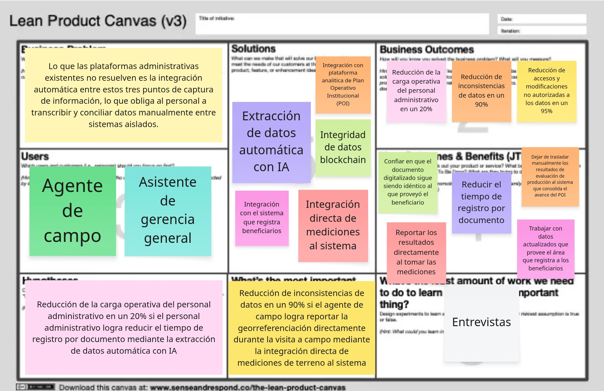

## Segmentos objetivo

El dominio del problema involucra tres segmentos, todos vinculados al mismo programa público de apoyo agrícola.

**Funcionario administrativo**
Recibe los documentos PDF del programa y registra su contenido en la plataforma interna.
- Personal permanente de la entidad.
- Maneja herramientas ofimáticas básicas.
- Sin formación técnica en sistemas necesariamente.

**Agente de campo georreferenciador**
Recorre las parcelas y captura sus coordenadas con un dispositivo GNSS para construir la geomalla del programa.
- El mapeo con GNSS reduce el levantamiento de una parcela de días a horas frente al método tradicional (Burch, 2016).
- Práctica extendida entre agrimensores y agricultores para digitalizar y verificar el uso del suelo (Burch, 2016).

**Productor beneficiario**
Recibe insumos del programa y reporta periódicamente en PDF la producción obtenida de su parcela.
- Segmento numeroso y disperso geográficamente, con acceso desigual a conectividad y herramientas digitales.
- Suele interactuar con múltiples plataformas desconectadas entre sí, cada una con su propio registro (IFPRI, 2025).
- Un registro único de productores, enlazado con insumos y resultados, es clave para resolver esa fragmentación (World Bank, 2025).

# Capítulo II: Requirements Elicitation & Analysis

## Competidores

### Análisis competitivo

Dado que la startup se orienta a un programa de una entidad pública (interoperabilidad de datos administrativos, extracción de documentos y georreferenciación de campo) y no a un mercado masivo de consumo, el panorama competitivo relevante se escapa del rubro de seguridad física analizado arriba. Por ello se realiza un segundo análisis, enfocado en soluciones de interoperabilidad de datos gubernamentales y procesamiento inteligente de documentos (IDP) para el sector público.

<table>
    <thead>
        <tr>
            <th scope="col" colspan="6"><strong>Competitive Analysis Landscape: Interoperabilidad y Automatización Documental en el Sector Público<strong></th>
        </tr>
    </thead>
    <tbody>
        <!-- Introduction header -->
        <tr>
            <th scope="row" colspan="2">¿Por qué llevar a cabo este análisis?</th>
            <td colspan="4">A diferencia del análisis anterior, el target de esta startup no es un mercado masivo sino una entidad pública con procesos administrativos fragmentados. Este segundo análisis identifica soluciones orientadas a la interoperabilidad de datos gubernamentales y a la extracción automática de información desde documentos, un panorama más acotado y especializado.</td>
        </tr>
        <!-- Companies header -->
        <tr>
            <th scope="row" colspan="2"></th>
            <td style="width: 25%; vertical-align: top;">Soulware</td>
            <td style="width: 25%; vertical-align: top;">OpenG2P</td>
            <td style="width: 25%; vertical-align: top;">OpenSPP (Farmer Registry)</td>
            <td style="width: 25%; vertical-align: top;">Hyperscience</td>
        </tr>
        <!-- Profile -->
        <!-- Profile: Overview -->
        <tr>
            <th scope="row" rowspan="2">Perfil</th>
            <th scope="row">Overview</th>
            <td>Solución para automatizar la integración de documentos PDF y datos de georreferenciación de campo con la plataforma administrativa de un programa público.</td>
            <td>Plataforma de código abierto y bien público digital (Digital Public Good) que permite a gobiernos y organismos humanitarios digitalizar y automatizar la entrega de beneficios sociales, desde el registro hasta la distribución.</td>
            <td>Registro de agricultores de código abierto, construido sobre Odoo, orientado a programas de protección social agrícola y diseñado para interoperar con otros registros y fuentes de datos geoespaciales.</td>
            <td>Plataforma de procesamiento inteligente de documentos (IDP) usada por agencias de gobierno de Estados Unidos para automatizar la captura de datos desde formularios y documentos en papel o PDF.</td>
        </tr>
        <!-- Profile: Ventaja competitiva -->
        <tr>
            <th scope="row">Ventaja competitiva ¿Qué valor ofrece a los clientes?</th>
            <td>Integración específica entre extracción de documentos PDF, datos GNSS de campo y la plataforma administrativa propia del programa, sin requerir que el personal transcriba manualmente.</td>
            <td>Interoperabilidad como principio de diseño central (G2P Connect, DCI, GovStack), evitando la recolección duplicada de datos entre registros gubernamentales ya existentes.</td>
            <td>Modelo de datos especializado para el sector agrícola, con capacidad de enlazar registros administrativos del productor con información geoespacial de sus parcelas.</td>
            <td>Alta precisión de extracción (más de 99%) validada en despliegues de gran escala (VA, SSA, programas SNAP estatales) con flujo human-in-the-loop para casos de baja confianza.</td>
        </tr>
        <!-- Perfil de Marketing -->
        <!-- Perfil de Marketing: Mercado Objetivo -->
        <tr>
            <th scope="row" rowspan="2">Perfil de Marketing</th>
            <th scope="row">Mercado objetivo</th>
            <td>Entidades públicas que administran programas de apoyo con procesos manuales de transcripción y registro geoespacial.</td>
            <td>Gobiernos y organismos humanitarios que administran programas de transferencias y beneficios sociales.</td>
            <td>Ministerios de agricultura, agencias de protección social agrícola y ONGs de desarrollo rural y seguridad alimentaria.</td>
            <td>Agencias de gobierno federal y estatal de Estados Unidos con altos volúmenes de documentos en papel o PDF.</td>
        </tr>
        <!-- Perfil de Marketing: Estrategias de marketing -->
        <tr>
            <th scope="row">Estrategias de marketing</th>
            <td>Posicionamiento como solución a medida para la problemática específica de un programa público, con foco en reducción de tiempo de transcripción y error humano.</td>
            <td>Posicionamiento como bien público digital (Digital Public Good) respaldado por organismos como el PNUD, con adopción impulsada por estándares abiertos de interoperabilidad.</td>
            <td>Posicionamiento como componente especializado dentro del ecosistema OpenSPP, dirigido a programas de protección social con componente agrícola.</td>
            <td>Casos de éxito cuantificados (ahorro de horas, reducción de errores en SNAP) y relación sostenida de varios años con agencias federales como la VA y la SSA.</td>
        </tr>
        <!-- Perfil de Producto -->
        <!-- Perfil de Producto: Productos & Servicios -->
        <tr>
            <th scope="row" rowspan="3">Perfil de Producto</th>
            <th scope="row">Productos & Servicios</th>
            <td>
                * Extracción automática de datos desde documentos PDF 
                * Enlace de datos de georreferenciación GNSS con registros administrativos 
                * Integración con la plataforma administrativa del programa
            </td>
            <td>
                * Registro social (Social Registry) 
                * Gestión de programas y beneficiarios (PBMS) 
                * Distribución digital de transferencias monetarias 
                * Conectores de interoperabilidad (G2P Connect, DCI)
            </td>
            <td>
                * Registro de agricultores 
                * Integración con sistemas de información geográfica (GIS) 
                * Interoperabilidad con registros de identidad nacional y CRVS 
                * Gestión de datos de parcelas y condiciones agrícolas
            </td>
            <td>
                * Clasificación automática de documentos 
                * Extracción de campos mediante OCR y machine learning 
                * Redacción de datos sensibles 
                * Flujo human-in-the-loop para validación de baja confianza
            </td>
        </tr>
        <!-- Perfil de Producto: Precios y Costos -->
        <tr>
            <th scope="row">Precios & Costos</th>
            <td>No aplica (solución en desarrollo, sin modelo de precios definido aún).</td>
            <td>Código abierto, sin licenciamiento; el costo recae en la implementación y el soporte técnico.</td>
            <td>Código abierto, sin licenciamiento; el costo recae en la implementación sobre la infraestructura Odoo.</td>
            <td>Licenciamiento empresarial por volumen de documentos procesados, orientado a contratos de gran escala con agencias de gobierno.</td>
        </tr>
        <!-- Perfil de Producto: Canales de distribución -->
        <tr>
            <th scope="row">Canales de distribución (Web y/o Móvil)</th>
            <td>Implementación directa sobre la plataforma administrativa existente de la entidad pública.</td>
            <td>Distribución vía repositorios abiertos (GitHub) e implementadores certificados, con soporte de organismos multilaterales.</td>
            <td>Distribución vía repositorios abiertos e implementadores del ecosistema Odoo/OpenSPP.</td>
            <td>Venta directa a agencias de gobierno mediante procesos de contratación pública (procurement) federal y estatal.</td>
        </tr>
        <!-- Análisis SWOT -->
        <tr>
            <th scope="row" rowspan="4">Análisis SWOT</th>
            <th scope="row">Fortalezas</th>
            <td>
                * Solución diseñada específicamente para el flujo del programa (documentos PDF + GNSS + plataforma propia) 
                * Bajo costo relativo al estar acotada a un caso de uso concreto
            </td>
            <td>
                * Respaldo como Digital Public Good y de organismos multilaterales 
                * Estándares abiertos de interoperabilidad ya adoptados por múltiples gobiernos
            </td>
            <td>
                * Especialización en el dominio agrícola 
                * Interoperabilidad nativa con GIS y registros de identidad
            </td>
            <td>
                * Precisión de extracción validada a gran escala 
                * Trayectoria de varios años con agencias federales de alto volumen
            </td>
        </tr>
        <tr>
            <th scope="row">Debilidades</th>
            <td>
                * Alcance limitado a un único programa/entidad, sin trayectoria previa 
                * Sin componente de interoperabilidad estándar (G2P Connect, DCI) aún
            </td>
            <td>
                * Requiere capacidad técnica interna o de un implementador para desplegarse 
                * No incluye extracción automática de documentos PDF como componente nativo
            </td>
            <td>
                * Dependencia del ecosistema Odoo 
                * Enfoque limitado al dominio agrícola, no generalizable a otros programas públicos
            </td>
            <td>
                * Costo elevado, orientado a contratos de gran escala 
                * No resuelve la interoperabilidad de georreferenciación de campo como componente propio
            </td>
        </tr>
        <tr>
            <th scope="row">Oportunidades</th>
            <td>
                * Creciente presión de organismos como la OCDE para mejorar la interoperabilidad de datos en gobierno 
                * Posibilidad de escalar la solución a otros programas públicos con problemáticas similares
            </td>
            <td>
                * Expansión de la adopción de estándares de interoperabilidad (GovStack) en más países 
                * Creciente digitalización de programas de protección social
            </td>
            <td>
                * Digitalización de registros agrícolas en países en desarrollo 
                * Integración con nuevas fuentes de datos satelitales y climáticos
            </td>
            <td>
                * Modernización de agencias federales impulsada por mandatos de digitalización 
                * Adopción creciente de IA generativa para complementar la extracción de documentos
            </td>
        </tr>
        <tr>
            <th scope="row">Amenazas</th>
            <td>
                * Adopción de plataformas de interoperabilidad estándar (como OpenG2P) por parte de la entidad pública en lugar de una solución a medida 
                * Resistencia al cambio en procesos administrativos ya establecidos
            </td>
            <td>
                * Competencia de proveedores comerciales de IDP con mayor precisión de extracción 
                * Fragmentación de estándares de interoperabilidad entre distintos organismos
            </td>
            <td>
                * Baja disponibilidad de conectividad e infraestructura digital en zonas rurales 
                * Competencia de registros nacionales construidos a medida por cada gobierno
            </td>
            <td>
                * Presión de costos frente a soluciones de código abierto 
                * Cambios en políticas de contratación pública que dificulten renovaciones
            </td>
        </tr>
    </tbody>
</table>

### Estrategias y tácticas frente a competidores

A partir del análisis competitivo, la startup no compite en el mismo terreno que las plataformas de interoperabilidad de código abierto (OpenG2P, OpenSPP) ni que los proveedores comerciales de IDP a gran escala (Hyperscience). Frente a ellos, la posición más defendible no es la de liderazgo en costos, sino la de enfoque en el flujo operativo específico del programa y la de diferenciación técnica en los puntos que ninguno de esos competidores resuelve como componente propio: la integración conjunta de georreferenciación de campo, reportes digitalizados y garantía de integridad documental.

**Estrategia de enfoque: especialización en el flujo operativo del programa**

Consiste en concentrar la propuesta de valor en el flujo operativo concreto del programa de apoyo agrícola, en lugar de intentar ofrecer una plataforma de interoperabilidad genérica como OpenG2P u OpenSPP. Esto permite construir una solución ajustada a los sistemas y procesos ya existentes en la institución, sin exigirle una migración hacia un ecosistema externo.

- Priorizar la integración con los sistemas administrativos ya utilizados por la institución (registro de beneficiarios, geolocalización, consolidación del PEI/POI), en vez de proponer su reemplazo.
- Acotar el alcance funcional a los tres puntos de fricción identificados en el flujo (georreferenciación, digitalización de reportes de evaluación y traslado de datos), evitando construir capacidades genéricas de interoperabilidad que la institución no necesita.

**Estrategia de diferenciación: garantía de integridad documental e integración multi-fuente**

Consiste en diferenciar la solución de los competidores identificados mediante dos capacidades que ninguno de ellos resuelve de forma nativa: la verificación de que un documento digitalizado sigue siendo idéntico a su versión física original, y la integración conjunta de datos de georreferenciación GNSS con reportes digitalizados dentro de un mismo flujo.

- Incorporar un mecanismo de verificación de integridad sobre los documentos digitalizados, de forma que el personal pueda confiar en la copia digital sin depender del archivo físico como única fuente de verdad.
- Enlazar de forma automática los datos de georreferenciación capturados en campo con el registro administrativo del beneficiario y su parcela, cerrando la brecha que hoy obliga a mantener esa información desconectada.
- Automatizar la extracción de datos desde los reportes de evaluación digitalizados hacia los sistemas de consolidación del PEI y del POI, reduciendo el traslado manual de datos que hoy realiza el personal administrativo.
- Mantener la solución acotada a un costo de implementación bajo, aprovechando que su alcance específico evita la complejidad y el costo asociados a una plataforma de interoperabilidad de propósito general.

## Entrevistas

<h3 id="needfinding-diseno">Diseño de entrevistas</h3>

Para diseñar las entrevistas se elaboraron dos bloques de preguntas, diferenciados según el segmento objetivo. Cada bloque recoge información objetiva sobre el contexto de trabajo, los instrumentos que se utilizan y el recorrido que sigue la información, e información subjetiva sobre percepciones, frustraciones y expectativas frente a una posible solución digital. Las preguntas se plantearon de forma abierta y apoyadas en el relato de casos concretos, de modo que el entrevistado describiera lo que hace realmente y no lo que indica el procedimiento.

**Segmento 1: Agente de campo georreferenciador**

Preguntas sobre la problemática:
- ¿Cómo le explicaría a alguien de fuera qué hace un agente de campo y por qué su trabajo importa para el programa?
- ¿Qué parte de su trabajo es la que nadie podría hacer desde un escritorio en la sede?
- El formato en papel se usa desde hace años. ¿Qué es lo que ese formato hace bien y que habría que conservar sí o sí?
- ¿Qué tiene que aprender un agente nuevo que no está escrito en ningún manual?
- Lléveme a su última visita de registro: ¿cómo llegó, con quién estuvo, qué fue lo primero que hizo?
- Cuando delimita la parcela, ¿cómo decide el recorrido, perímetro completo, vértices o un punto referencial? ¿Quién le enseñó ese criterio?
- ¿Cómo sabe que la medición quedó bien? ¿Hay algo que revise antes de retirarse?
- Además de la coordenada, ¿qué más registra durante la visita?
- Cuando el beneficiario está presente, ¿qué le muestra o le explica sobre lo que acaba de quedar registrado?
- En la evaluación periódica, ¿cómo obtiene la cantidad producida? ¿Se la declara el beneficiario, la estima usted, la pesa?
- Una vez que entrega el formato lleno, ¿qué pasa con ese documento? ¿Se entera si le hicieron alguna observación?
- Si dentro de seis meses alguien de la sede le pregunta por un dato de esa acta, ¿cómo lo sustenta usted?
- ¿Le ha tocado que un dato que usted registró aparezca distinto más adelante? ¿Cómo se aclaró?

Preguntas sobre la solución:
- Si el registro pudiera quedar cerrado en la misma parcela, con la foto y la firma incluidas, ¿qué tendría que cumplir esa herramienta para que usted la firme con la misma tranquilidad con la que firma el papel?
- ¿Qué datos del beneficiario le gustaría tener ya cargados antes de llegar a la parcela?
- Si su acta quedara con un sello que permita demostrar después que nadie le cambió nada, ¿a usted personalmente en qué le serviría?
- ¿Qué haría con el tiempo que hoy se le va en registrar y volver a registrar lo mismo?
- Si usted fuera quien diseña esta herramienta, ¿qué es lo primero que no debería fallar nunca?

**Segmento 2: Funcionario administrativo**

Preguntas sobre la problemática:
- ¿Cómo le describiría su trabajo a alguien que nunca ha estado en la institución?
- ¿Qué parte del proceso depende de su criterio y no podría hacerla alguien sin experiencia?
- Del procedimiento actual, ¿qué es lo que funciona bien y habría que conservar?
- Lléveme por el último expediente que cerró, desde que llegó hasta que el dato quedó reflejado en el sistema.
- ¿Qué campos exactamente traslada de un documento a otro?
- ¿Cómo decide que un expediente está listo? ¿Qué revisa antes de darlo por bueno?
- Cuénteme el último caso en que algo no calzó. ¿Qué hizo?
- ¿Cuántos expedientes maneja en una semana y cuánto le toma cada uno?
- ¿Qué le da valor oficial al expediente?
- Si dentro de un año alguien cuestiona un dato, ¿cómo lo sustenta usted?
- ¿Ha habido algún caso en que se haya puesto en duda un documento digitalizado?

Preguntas sobre la solución:
- Si un sistema le presentara los campos ya leídos del documento, ¿cuáles revisaría siempre antes de aprobar?
- ¿Qué tendría que ver en pantalla para aprobar con tranquilidad un dato que usted no digitó?
- Si el sistema se equivoca en un campo, ¿quién debería responder y cómo se corrige?
- ¿En qué usaría el tiempo que hoy dedica a digitar?
- Si usted diseñara esto, ¿qué es lo primero que no debería fallar nunca?

<h3 id="needfinding-registro">Registro de entrevistas</h3>

Los seis entrevistados son user proxies (Cohn, 2004): personas que conocen y representan el trabajo del agente de campo y del funcionario administrativo, pero no son ellas mismas el beneficiario del programa, el usuario final de la solución.

**Segmento Agentes de Campo: Entrevistado 1**

    <table style="width: 100%; border-collapse: collapse; border: 1px solid #333;">
        <thead>
            <tr>
                <th style="border: 1px solid #333; padding: 8px 10px; text-align: left;">Atributo</th>
                <th style="border: 1px solid #333; padding: 8px 10px; text-align: left;">Detalle</th>
            </tr>
        </thead>
        <tbody>
            <tr>
                <td style="border: 1px solid #333; padding: 10px; vertical-align: top; text-align: left;">Nombre</td>
                <td style="border: 1px solid #333; padding: 10px; vertical-align: top; text-align: left;">Osvalo Eliott Rosado</td>
            </tr>
            <tr>
                <td style="border: 1px solid #333; padding: 10px; vertical-align: top; text-align: left;">Edad</td>
                <td style="border: 1px solid #333; padding: 10px; vertical-align: top; text-align: left;">26</td>
            </tr>
            <tr>
                <td style="border: 1px solid #333; padding: 10px; vertical-align: top; text-align: left;">Sexo</td>
                <td style="border: 1px solid #333; padding: 10px; vertical-align: top; text-align: left;">Masculino</td>
            </tr>
            <tr>
                <td style="border: 1px solid #333; padding: 10px; vertical-align: top; text-align: left;">Distrito</td>
                <td style="border: 1px solid #333; padding: 10px; vertical-align: top; text-align: left;">Ate</td>
            </tr>
            <tr>
                <td style="border: 1px solid #333; padding: 10px; vertical-align: top; text-align: left;">Ocupación</td>
                <td style="border: 1px solid #333; padding: 10px; vertical-align: top; text-align: left;">Agente de campo georreferenciador, 7 años en el puesto</td>
            </tr>
            <tr>
                <td style="border: 1px solid #333; padding: 10px; vertical-align: top; text-align: left;">Fecha de entrevista</td>
                <td style="border: 1px solid #333; padding: 10px; vertical-align: top; text-align: left;">15/09/2026</td>
            </tr>
            <tr>
                <td style="border: 1px solid #333; padding: 10px; vertical-align: top; text-align: left;">Timing</td>
                <td style="border: 1px solid #333; padding: 10px; vertical-align: top; text-align: left;">00:00 - 04:31</td>
            </tr>
            <tr>
                <td style="border: 1px solid #333; padding: 10px; vertical-align: top; text-align: left;">Video</td>
                <td style="border: 1px solid #333; padding: 10px; vertical-align: top; text-align: left;"><a href="https://upcedupe-my.sharepoint.com/:v:/g/personal/u202310210_upc_edu_pe/IQDoW5jNib-XRo6vXxarolKhAZTR0RJpyPWy4wGtPAMX_6g?e=HMrxue">Ver video</a></td>
            </tr>
            <tr>
                <td style="border: 1px solid #333; padding: 10px; vertical-align: top; text-align: left;">Captura</td>
                <td style="border: 1px solid #333; padding: 10px; vertical-align: top; text-align: left;"></td>
            </tr>
            <tr>
                <td style="border: 1px solid #333; padding: 10px; vertical-align: top; text-align: left;">Resumen</td>
                <td style="border: 1px solid #333; padding: 10px; vertical-align: top; text-align: left;">Osvalo trabaja en zona alta y define su rol como el de los ojos del programa, ya que sin la verificación presencial se estarían entregando insumos sin respaldo. Considera que el conocimiento de las personas y del terreno es lo que no puede hacerse desde la sede, porque en un mapa se ve un cuadrado y él sabe que ese cuadrado tiene una quebrada al medio y que la mitad no es cultivable. Del formato en papel rescata la firma y la huella del beneficiario, porque acredita que ambos estuvieron presentes y lo respalda a él si aparece un problema. En su última visita coordinó por teléfono el día anterior, viajó en camioneta y caminó cuarenta minutos hasta la parcela. Delimita recorriendo el perímetro y marcando vértices cuando el terreno lo permite; cuando hay monte o pendiente fuerte toma los vértices que alcanza y estima el resto con el beneficiario, criterio que aprendió de un compañero antiguo y que no figura en ningún instructivo. Además de la coordenada llena el formato, toma fotografías con su celular personal y recoge la firma y la huella, y envía las fotos por WhatsApp cuando encuentra señal, lo que le genera acumulación y pérdida de referencia sobre a qué parcela corresponde cada imagen. En la evaluación de producción la cantidad se la declara el beneficiario y él verifica lo que puede: si la cosecha está presente estima por sacos y si ya fue vendida no tiene forma de contrastarla. Convierte a kilogramos usando entre cuarenta y cinco y cincuenta kilos por saco según el producto, y advierte que no todos los agentes aplican el mismo factor. Como no le queda copia del formato, sustenta cualquier consulta posterior con un cuaderno propio que lleva por iniciativa personal. Tuvo un caso en que una cantidad apareció distinta en el sistema y se corrigió contrastando con ese cuaderno, aunque quedó la incomodidad de parecer responsable del error, y reconoce que se resolvió porque lo conocen y no porque existiera forma de comprobarlo. Sobre la propuesta pone tres condiciones para firmar con la misma tranquilidad que el papel: que la información no se pierda, que pueda ver lo que registró y que la firma del beneficiario tenga validez. Advierte que si tuviera que seguir llevando el papel además de la herramienta, la usaría al inicio por obligación y la abandonaría en unos dos meses, como ha ocurrido con otras cosas que les han dado. Valora el sello de integridad como respaldo personal, ya que la responsabilidad de lo registrado recae sobre su firma, pero señala que si se presenta como fiscalización va a generar resistencia. Lo que no debería fallar nunca, según él, es que se pierda la información registrada, porque no puede volver a subir cuatro horas a pedir una firma otra vez.</td>
            </tr>
        </tbody>
    </table>

**Segmento Agentes de Campo: Entrevistado 2**

    <table style="width: 100%; border-collapse: collapse; border: 1px solid #333;">
        <thead>
            <tr>
                <th style="border: 1px solid #333; padding: 8px 10px; text-align: left;">Atributo</th>
                <th style="border: 1px solid #333; padding: 8px 10px; text-align: left;">Detalle</th>
            </tr>
        </thead>
        <tbody>
            <tr>
                <td style="border: 1px solid #333; padding: 10px; vertical-align: top; text-align: left;">Nombre</td>
                <td style="border: 1px solid #333; padding: 10px; vertical-align: top; text-align: left;">Mauricio Andrés Canchis Fernández</td>
            </tr>
            <tr>
                <td style="border: 1px solid #333; padding: 10px; vertical-align: top; text-align: left;">Edad</td>
                <td style="border: 1px solid #333; padding: 10px; vertical-align: top; text-align: left;">25</td>
            </tr>
            <tr>
                <td style="border: 1px solid #333; padding: 10px; vertical-align: top; text-align: left;">Sexo</td>
                <td style="border: 1px solid #333; padding: 10px; vertical-align: top; text-align: left;">Masculino</td>
            </tr>
            <tr>
                <td style="border: 1px solid #333; padding: 10px; vertical-align: top; text-align: left;">Distrito</td>
                <td style="border: 1px solid #333; padding: 10px; vertical-align: top; text-align: left;">Santiago de Surco</td>
            </tr>
            <tr>
                <td style="border: 1px solid #333; padding: 10px; vertical-align: top; text-align: left;">Ocupación</td>
                <td style="border: 1px solid #333; padding: 10px; vertical-align: top; text-align: left;">Agente de campo georreferenciador, 3 años en el puesto</td>
            </tr>
            <tr>
                <td style="border: 1px solid #333; padding: 10px; vertical-align: top; text-align: left;">Fecha de entrevista</td>
                <td style="border: 1px solid #333; padding: 10px; vertical-align: top; text-align: left;">15/09/2026</td>
            </tr>
            <tr>
                <td style="border: 1px solid #333; padding: 10px; vertical-align: top; text-align: left;">Timing</td>
                <td style="border: 1px solid #333; padding: 10px; vertical-align: top; text-align: left;">04:31 - 09:10</td>
            </tr>
            <tr>
                <td style="border: 1px solid #333; padding: 10px; vertical-align: top; text-align: left;">Video</td>
                <td style="border: 1px solid #333; padding: 10px; vertical-align: top; text-align: left;"><a href="https://upcedupe-my.sharepoint.com/:v:/g/personal/u202310210_upc_edu_pe/IQDoW5jNib-XRo6vXxarolKhAZTR0RJpyPWy4wGtPAMX_6g?e=HMrxue">Ver video</a></td>
            </tr>
            <tr>
                <td style="border: 1px solid #333; padding: 10px; vertical-align: top; text-align: left;">Captura</td>
                <td style="border: 1px solid #333; padding: 10px; vertical-align: top; text-align: left;"></td>
            </tr>
            <tr>
                <td style="border: 1px solid #333; padding: 10px; vertical-align: top; text-align: left;">Resumen</td>
                <td style="border: 1px solid #333; padding: 10px; vertical-align: top; text-align: left;">Mauricio atiende parcelas que están a dos días de viaje, con tramos donde no entra vehículo, de modo que una salida suya no dura un día sino una semana. Se describe como la única presencia del programa que esa población ve en meses. Sostiene que casi todo su trabajo depende de su criterio, porque es él quien decide si una parcela se puede medir completa, si el terreno da y si vale la pena volver, y nadie en la sede puede tomar esa decisión porque nadie ha estado ahí. Del formato en papel valora que funciona siempre, no se apaga ni se descarga, y advierte que eso debe tenerse muy en cuenta antes de proponer otra cosa. Mide con el GPS de la oficina zonal cuando hay equipo disponible, pero como son varios agentes y hay pocos equipos, aproximadamente una de cada tres salidas la realiza sin equipo institucional y mide con una aplicación que descargó en su celular personal, situación que no se reporta. En su zona casi nunca puede recorrer el perímetro por el monte cerrado, así que toma un punto referencial al centro y los vértices que alcanza, y conversa el resto con el beneficiario, por lo que el área que consigna en el formato es una estimación. Cuando el beneficiario está presente le muestra la pantalla con el punto y le explica que esa es su parcela y que ese punto queda registrado a su nombre, práctica que le enseñaron para reducir la desconfianza inicial de la gente, que suele pensar que se mide para quitarles algo. La cantidad producida se la declaran y él calcula a partir del número de sacos, usando cuarenta kilos por saco porque así se lo enseñaron en su oficina zonal; sabe que en otras zonas se usa otro número, lo ha conversado con compañeros sin llegar a un acuerdo, y señala que nadie les ha entregado una tabla oficial. Deja el formato en la oficina zonal y de ahí va en valija, sin enterarse de nada más salvo que lo llamen para corregir, lo que suele ocurrir cuando ya está en otra zona y debe hacer memoria de algo de un mes atrás. No lleva cuaderno aparte porque no le alcanza el tiempo, de modo que si le preguntan por un dato antiguo responde de memoria y, si no recuerda, lo dice. Para confiar en un registro cerrado en la parcela pide que el equipo dure varios días y que, si el celular se malogra, no pierda la semana entera de trabajo. Añade un punto que según él nadie pregunta: recibir un equipo caro para llevar a campo lo pone en riesgo personal, porque en algunas zonas uno no quiere andar mostrando aparatos. Le gustaría tener cargadas de antemano las parcelas que el beneficiario ya tiene registradas, porque le ha ocurrido llegar y encontrar una parcela adicional sin saber si otro agente ya la registró el año anterior, lo que luego aparece duplicado en la sede y se le consulta a él. Lo que no debería fallar nunca es que el registro aguante, ya que no necesita que sea bonito sino que después de seis días en campo conserve todo lo levantado.</td>
            </tr>
        </tbody>
    </table>

**Segmento Agentes de Campo: Entrevistado 3**

    <table style="width: 100%; border-collapse: collapse; border: 1px solid #333;">
        <thead>
            <tr>
                <th style="border: 1px solid #333; padding: 8px 10px; text-align: left;">Atributo</th>
                <th style="border: 1px solid #333; padding: 8px 10px; text-align: left;">Detalle</th>
            </tr>
        </thead>
        <tbody>
            <tr>
                <td style="border: 1px solid #333; padding: 10px; vertical-align: top; text-align: left;">Nombre</td>
                <td style="border: 1px solid #333; padding: 10px; vertical-align: top; text-align: left;">Kerry Baquerrizo</td>
            </tr>
            <tr>
                <td style="border: 1px solid #333; padding: 10px; vertical-align: top; text-align: left;">Edad</td>
                <td style="border: 1px solid #333; padding: 10px; vertical-align: top; text-align: left;">26</td>
            </tr>
            <tr>
                <td style="border: 1px solid #333; padding: 10px; vertical-align: top; text-align: left;">Sexo</td>
                <td style="border: 1px solid #333; padding: 10px; vertical-align: top; text-align: left;">Masculino</td>
            </tr>
            <tr>
                <td style="border: 1px solid #333; padding: 10px; vertical-align: top; text-align: left;">Distrito</td>
                <td style="border: 1px solid #333; padding: 10px; vertical-align: top; text-align: left;">Ate</td>
            </tr>
            <tr>
                <td style="border: 1px solid #333; padding: 10px; vertical-align: top; text-align: left;">Ocupación</td>
                <td style="border: 1px solid #333; padding: 10px; vertical-align: top; text-align: left;">Agente de campo georreferenciador, 8 meses en el puesto</td>
            </tr>
            <tr>
                <td style="border: 1px solid #333; padding: 10px; vertical-align: top; text-align: left;">Fecha de entrevista</td>
                <td style="border: 1px solid #333; padding: 10px; vertical-align: top; text-align: left;">15/09/2026</td>
            </tr>
            <tr>
                <td style="border: 1px solid #333; padding: 10px; vertical-align: top; text-align: left;">Timing</td>
                <td style="border: 1px solid #333; padding: 10px; vertical-align: top; text-align: left;">09:10 - 13:45</td>
            </tr>
            <tr>
                <td style="border: 1px solid #333; padding: 10px; vertical-align: top; text-align: left;">Video</td>
                <td style="border: 1px solid #333; padding: 10px; vertical-align: top; text-align: left;"><a href="https://upcedupe-my.sharepoint.com/:v:/g/personal/u202310210_upc_edu_pe/IQDoW5jNib-XRo6vXxarolKhAZTR0RJpyPWy4wGtPAMX_6g?e=HMrxue">Ver video</a></td>
            </tr>
            <tr>
                <td style="border: 1px solid #333; padding: 10px; vertical-align: top; text-align: left;">Captura</td>
                <td style="border: 1px solid #333; padding: 10px; vertical-align: top; text-align: left;"></td>
            </tr>
            <tr>
                <td style="border: 1px solid #333; padding: 10px; vertical-align: top; text-align: left;">Resumen</td>
                <td style="border: 1px solid #333; padding: 10px; vertical-align: top; text-align: left;">Kerry es el agente con menos tiempo en el puesto y señala que lo que más le costó aprender fue el criterio, porque nadie le explicó cómo delimitar una parcela: salió dos veces con un compañero, observó cómo lo hacía y de ahí lo enviaron solo, de modo que reproduce lo que vio sin saber si es lo correcto o si es la costumbre de esa persona. Al conversarlo con otros agentes confirmó que cada uno lo hace distinto, uno recorre todo el perímetro y otro toma cuatro puntos, y él toma el perímetro cuando se puede porque le parece más serio, aunque se demora el doble que los demás. Reconoce que el papel le complica, pero entiende que la firma del beneficiario es necesaria y considera que el resto de los datos y las casillas podrían estar en otro lado. Por iniciativa propia se creó un formulario en Google Forms que llena desde el celular en la parcela para no perder información, y luego copia los datos al sistema y al formato en papel. Lo hizo porque al inicio se le mojó un formato en la mochila y tuvo que volver a subir a la parcela. En ese formulario registra nombre, DNI, coordenadas, cultivo, área, cantidad, observaciones y una fotografía, prácticamente lo mismo que el formato oficial pero con guardado automático. Tres o cuatro compañeros ya le pidieron el enlace, sin que se trate de una herramienta oficial. La cantidad producida se la declara el beneficiario en sacos y él multiplica por cincuenta kilos, factor que le indicó un compañero y del que no tiene certeza. Tuvo un caso en que un área que él registró apareció más pequeña en el sistema y, al preguntar, le respondieron que había sido ajustada en la sede sin precisar quién ni por qué; no reclamó por ser nuevo, pero le habría gustado saberlo porque el nombre que figura en ese registro es el suyo. Considera que cerrar el registro en la parcela sería un avance enorme porque es lo que ya hace de forma artesanal con su formulario, y su única condición es que la firma digital tenga validez, en cuyo caso dejaría el papel de inmediato. Aun si tuviera que llevar ambos lo usaría, porque ya lo hace, aunque advierte que los compañeros con más antigüedad lo verán como trabajo adicional. Lo que no debería fallar nunca, para él, es poder consultar lo que ya registró antes, ya que hoy entrega el formato y no le queda nada, mientras que con su formulario al menos conserva su historial.</td>
            </tr>
        </tbody>
    </table>

**Segmento Funcionarios Administrativos: Entrevistado 1**

    <table style="width: 100%; border-collapse: collapse; border: 1px solid #333;">
        <thead>
            <tr>
                <th style="border: 1px solid #333; padding: 8px 10px; text-align: left;">Atributo</th>
                <th style="border: 1px solid #333; padding: 8px 10px; text-align: left;">Detalle</th>
            </tr>
        </thead>
        <tbody>
            <tr>
                <td style="border: 1px solid #333; padding: 10px; vertical-align: top; text-align: left;">Nombre</td>
                <td style="border: 1px solid #333; padding: 10px; vertical-align: top; text-align: left;">María Fernanda Esteban Román</td>
            </tr>
            <tr>
                <td style="border: 1px solid #333; padding: 10px; vertical-align: top; text-align: left;">Edad</td>
                <td style="border: 1px solid #333; padding: 10px; vertical-align: top; text-align: left;">23</td>
            </tr>
            <tr>
                <td style="border: 1px solid #333; padding: 10px; vertical-align: top; text-align: left;">Sexo</td>
                <td style="border: 1px solid #333; padding: 10px; vertical-align: top; text-align: left;">Femenino</td>
            </tr>
            <tr>
                <td style="border: 1px solid #333; padding: 10px; vertical-align: top; text-align: left;">Distrito</td>
                <td style="border: 1px solid #333; padding: 10px; vertical-align: top; text-align: left;">Ate</td>
            </tr>
            <tr>
                <td style="border: 1px solid #333; padding: 10px; vertical-align: top; text-align: left;">Ocupación</td>
                <td style="border: 1px solid #333; padding: 10px; vertical-align: top; text-align: left;">Asistente administrativa de gerencia general, 5 años en el puesto</td>
            </tr>
            <tr>
                <td style="border: 1px solid #333; padding: 10px; vertical-align: top; text-align: left;">Fecha de entrevista</td>
                <td style="border: 1px solid #333; padding: 10px; vertical-align: top; text-align: left;">15/09/2026</td>
            </tr>
            <tr>
                <td style="border: 1px solid #333; padding: 10px; vertical-align: top; text-align: left;">Timing</td>
                <td style="border: 1px solid #333; padding: 10px; vertical-align: top; text-align: left;">13:45 - 18:51</td>
            </tr>
            <tr>
                <td style="border: 1px solid #333; padding: 10px; vertical-align: top; text-align: left;">Video</td>
                <td style="border: 1px solid #333; padding: 10px; vertical-align: top; text-align: left;"><a href="https://upcedupe-my.sharepoint.com/:v:/g/personal/u202310210_upc_edu_pe/IQDoW5jNib-XRo6vXxarolKhAZTR0RJpyPWy4wGtPAMX_6g?e=HMrxue">Ver video</a></td>
            </tr>
            <tr>
                <td style="border: 1px solid #333; padding: 10px; vertical-align: top; text-align: left;">Captura</td>
                <td style="border: 1px solid #333; padding: 10px; vertical-align: top; text-align: left;"></td>
            </tr>
            <tr>
                <td style="border: 1px solid #333; padding: 10px; vertical-align: top; text-align: left;">Resumen</td>
                <td style="border: 1px solid #333; padding: 10px; vertical-align: top; text-align: left;">María Fernanda recibe las actas que llegan de las oficinas zonales, las escanea, las verifica contra el sistema de beneficiarios y registra los datos, de modo que todo lo que llega de campo pasa por ella antes de existir en el sistema. Antes de este puesto estuvo dos años en archivo, por lo que conoce cómo se maneja la documentación física. Maneja entre treinta y cuarenta expedientes por semana, según cómo llegue la valija, y trabaja con tres sistemas: el de registro de beneficiarios, el de consolidación donde se reporta el avance y un Excel propio que usa como paso intermedio. Se describe como el puente del proceso, porque si ella no registra un documento, para la institución ese trabajo no ocurrió. Ubica su criterio en detectar cuando algo no cuadra, ya que un formato puede estar completo y bien llenado y aun así advertir que el nombre no corresponde al código o que la cantidad es desproporcionada para el área, algo que solo distingue quien ya ha visto miles de expedientes. Del procedimiento actual conservaría que todo queda con su acta física archivada, porque ante una auditoría ahí está el papel firmado. Al describir el último expediente que cerró detalla que la valija llegó el lunes con treinta y dos actas, que las separa por oficina zonal, las escanea en la multifuncional y las guarda nombrando el archivo con el DNI y la fecha; luego abre el sistema de beneficiarios, verifica que la persona exista y que el código coincida, pasa los datos a su Excel intermedio y al final de la semana lo usa para digitar en el sistema de consolidación. Utiliza el Excel intermedio porque el sistema de consolidación es lento y, si se cae a la mitad, pierde lo avanzado. Los campos que traslada de un documento a otro son catorce: código de beneficiario, DNI, apellidos y nombres, código de parcela, coordenada este, coordenada norte, fecha de evaluación, cultivo, área en hectáreas, cantidad producida, unidad de medida, nombre del agente, número de acta y observaciones. Cada expediente le toma entre veinticinco y treinta minutos contando el escaneo y la verificación, y supera la hora cuando hay observaciones. Estima que uno de cada seis expedientes presenta alguna observación, siendo lo más frecuente las unidades y los nombres mal escritos. Como último caso en que algo no calzó relata un acta que consignaba ochocientos kilos, cifra imposible para el área registrada; al llamar a la oficina zonal le informaron que el agente había anotado sacos y que alguien convirtió mal, y la corrección le tomó tres días. Sobre la fidelidad de los documentos escaneados indica que nunca se le ha cuestionado uno, pero reconoce que tampoco tendría cómo comprobarlo, ya que si alguien abriera el archivo escaneado y lo modificara ella no se daría cuenta, y señala que no lo había pensado hasta que se lo preguntaron. Si un sistema le presentara los campos ya leídos, revisaría siempre el DNI, el código de beneficiario, la cantidad con su unidad y la fecha. Al inicio revisaría todos los campos, no por desconfianza sino para observar cómo se equivoca el sistema, y después de dos o tres meses pasaría a revisar solo lo marcado como dudoso. Asume que la responsabilidad por un error sería suya porque es quien aprueba, y por eso necesita poder ver el documento al costado del dato y no solamente el dato. El tiempo que hoy dedica a digitar lo usaría en perseguir las observaciones, que hoy quedan pendientes semanas porque no alcanza a llamar zona por zona y son lo que realmente traba el proceso. Lo que no debería fallar nunca es la relación entre el dato y su acta de origen, porque mientras pueda abrir el acta y ver de dónde salió cada número, el resto lo maneja.</td>
            </tr>
        </tbody>
    </table>

**Segmento Funcionarios Administrativos: Entrevistado 2**

    <table style="width: 100%; border-collapse: collapse; border: 1px solid #333;">
        <thead>
            <tr>
                <th style="border: 1px solid #333; padding: 8px 10px; text-align: left;">Atributo</th>
                <th style="border: 1px solid #333; padding: 8px 10px; text-align: left;">Detalle</th>
            </tr>
        </thead>
        <tbody>
            <tr>
                <td style="border: 1px solid #333; padding: 10px; vertical-align: top; text-align: left;">Nombre</td>
                <td style="border: 1px solid #333; padding: 10px; vertical-align: top; text-align: left;">Bruno Rolando Núñez Gallegos</td>
            </tr>
            <tr>
                <td style="border: 1px solid #333; padding: 10px; vertical-align: top; text-align: left;">Edad</td>
                <td style="border: 1px solid #333; padding: 10px; vertical-align: top; text-align: left;">28</td>
            </tr>
            <tr>
                <td style="border: 1px solid #333; padding: 10px; vertical-align: top; text-align: left;">Sexo</td>
                <td style="border: 1px solid #333; padding: 10px; vertical-align: top; text-align: left;">Masculino</td>
            </tr>
            <tr>
                <td style="border: 1px solid #333; padding: 10px; vertical-align: top; text-align: left;">Distrito</td>
                <td style="border: 1px solid #333; padding: 10px; vertical-align: top; text-align: left;">San Borja</td>
            </tr>
            <tr>
                <td style="border: 1px solid #333; padding: 10px; vertical-align: top; text-align: left;">Ocupación</td>
                <td style="border: 1px solid #333; padding: 10px; vertical-align: top; text-align: left;">Coordinador del área, 9 años en la institución</td>
            </tr>
            <tr>
                <td style="border: 1px solid #333; padding: 10px; vertical-align: top; text-align: left;">Fecha de entrevista</td>
                <td style="border: 1px solid #333; padding: 10px; vertical-align: top; text-align: left;">15/09/2026</td>
            </tr>
            <tr>
                <td style="border: 1px solid #333; padding: 10px; vertical-align: top; text-align: left;">Timing</td>
                <td style="border: 1px solid #333; padding: 10px; vertical-align: top; text-align: left;">18:51 - 23:58</td>
            </tr>
            <tr>
                <td style="border: 1px solid #333; padding: 10px; vertical-align: top; text-align: left;">Video</td>
                <td style="border: 1px solid #333; padding: 10px; vertical-align: top; text-align: left;"><a href="https://upcedupe-my.sharepoint.com/:v:/g/personal/u202310210_upc_edu_pe/IQDoW5jNib-XRo6vXxarolKhAZTR0RJpyPWy4wGtPAMX_6g?e=HMrxue">Ver video</a></td>
            </tr>
            <tr>
                <td style="border: 1px solid #333; padding: 10px; vertical-align: top; text-align: left;">Captura</td>
                <td style="border: 1px solid #333; padding: 10px; vertical-align: top; text-align: left;"></td>
            </tr>
            <tr>
                <td style="border: 1px solid #333; padding: 10px; vertical-align: top; text-align: left;">Resumen</td>
                <td style="border: 1px solid #333; padding: 10px; vertical-align: top; text-align: left;">Bruno empezó como analista y pasó a coordinación hace cuatro años. No digita: revisa lo que consolidan las asistentes, da la conformidad y eso es lo que sube al reporte, de modo que su firma está en lo que ve la gerencia y es quien responde si algo sale mal. Por quincena revisa entre ciento veinte y ciento cincuenta expedientes, que es lo que procesan las tres asistentes del área. Trabaja principalmente con el sistema de consolidación y con los reportes que le preparan, y ha participado en las coordinaciones con la Oficina de Tecnologías cuando se intentó la carga masiva. Ubica su criterio en decidir qué se reporta y qué se observa, porque a veces llega información incompleta y hay que definir si se reporta parcial o se espera, decisión con consecuencias porque el avance del POI se mide con eso. Del procedimiento actual conservaría la cadena de responsabilidad, ya que cada documento tiene un responsable en cada etapa, el agente que lo levanta, la asistente que lo registra y él que lo aprueba, algo que según indica no existe en muchas instituciones. Describe que la valija llega quincenalmente, que las asistentes procesan durante esa quincena y que él revisa al cierre, de modo que entre el día de la visita y el reporte que ve la gerencia pueden pasar tres semanas, o cuatro si la zona es lejana. La información entra al sistema que consolida el POI a mano, campo por campo; hubo un intento de carga masiva con una plantilla de Excel, pero la validación rechazaba la mitad de los registros por formato y se dejó de usar. Sobre integraciones indica que el tema lo maneja la Oficina de Tecnologías y que, por lo que sabe, hoy no hay nada automático, remitiendo la respuesta técnica a esa oficina. Señala que el valor oficial del expediente lo da el acta física firmada, que el escaneo es una copia de trabajo y que lo que se reporta es el registro del sistema, pero que ante una controversia el que manda es el papel. Relata un caso en que control interno observó un acta cuyos datos en el sistema no coincidían con el físico; se determinó que fue error de digitación, pero el proceso de aclaración tomó casi dos meses y hubo que rastrear el acta original en archivo. Lo que habría acelerado ese proceso, según él, es poder demostrar de entrada cuál era la versión original y quién la modificó, ya que armar esa historia tomó semanas a base de correos y de preguntar a la gente qué recordaba. Recibiría bien un mecanismo que permita demostrar que un documento no fue alterado, pero advierte que hay que cuidar cómo se presenta: si el personal entiende que es para vigilarlos habrá resistencia e incluso el sindicato podría pronunciarse, mientras que presentado como respaldo frente a observaciones de control hay apertura. Indica que él no revisa campo por campo porque para eso están las asistentes, y que lo que necesita es saber qué porcentaje del expediente fue procesado automáticamente y qué fue verificado por una persona, ya que si va a firmar necesita saber sobre qué está firmando. El tiempo liberado del equipo lo usaría en análisis, porque hoy nadie mira tendencias y solo se reporta, y en cerrar los expedientes observados, que es donde se acumula el trabajo. Lo que no debería fallar nunca es la trazabilidad, porque tiene que poder decir en cualquier momento y ante cualquiera de dónde salió cada número y quién lo aprobó, y si el sistema no le da eso, no lo firma.</td>
            </tr>
        </tbody>
    </table>

**Segmento Funcionarios Administrativos: Entrevistado 3**

    <table style="width: 100%; border-collapse: collapse; border: 1px solid #333;">
        <thead>
            <tr>
                <th style="border: 1px solid #333; padding: 8px 10px; text-align: left;">Atributo</th>
                <th style="border: 1px solid #333; padding: 8px 10px; text-align: left;">Detalle</th>
            </tr>
        </thead>
        <tbody>
            <tr>
                <td style="border: 1px solid #333; padding: 10px; vertical-align: top; text-align: left;">Nombre</td>
                <td style="border: 1px solid #333; padding: 10px; vertical-align: top; text-align: left;">Iván Alejandro Reyes Carrizales</td>
            </tr>
            <tr>
                <td style="border: 1px solid #333; padding: 10px; vertical-align: top; text-align: left;">Edad</td>
                <td style="border: 1px solid #333; padding: 10px; vertical-align: top; text-align: left;">23</td>
            </tr>
            <tr>
                <td style="border: 1px solid #333; padding: 10px; vertical-align: top; text-align: left;">Sexo</td>
                <td style="border: 1px solid #333; padding: 10px; vertical-align: top; text-align: left;">Masculino</td>
            </tr>
            <tr>
                <td style="border: 1px solid #333; padding: 10px; vertical-align: top; text-align: left;">Distrito</td>
                <td style="border: 1px solid #333; padding: 10px; vertical-align: top; text-align: left;">Ate</td>
            </tr>
            <tr>
                <td style="border: 1px solid #333; padding: 10px; vertical-align: top; text-align: left;">Ocupación</td>
                <td style="border: 1px solid #333; padding: 10px; vertical-align: top; text-align: left;">Analista de planeamiento, 2 años en el puesto</td>
            </tr>
            <tr>
                <td style="border: 1px solid #333; padding: 10px; vertical-align: top; text-align: left;">Fecha de entrevista</td>
                <td style="border: 1px solid #333; padding: 10px; vertical-align: top; text-align: left;">15/09/2026</td>
            </tr>
            <tr>
                <td style="border: 1px solid #333; padding: 10px; vertical-align: top; text-align: left;">Timing</td>
                <td style="border: 1px solid #333; padding: 10px; vertical-align: top; text-align: left;">23:58 - 28:13</td>
            </tr>
            <tr>
                <td style="border: 1px solid #333; padding: 10px; vertical-align: top; text-align: left;">Video</td>
                <td style="border: 1px solid #333; padding: 10px; vertical-align: top; text-align: left;"><a href="https://upcedupe-my.sharepoint.com/:v:/g/personal/u202310210_upc_edu_pe/IQDoW5jNib-XRo6vXxarolKhAZTR0RJpyPWy4wGtPAMX_6g?e=HMrxue">Ver video</a></td>
            </tr>
            <tr>
                <td style="border: 1px solid #333; padding: 10px; vertical-align: top; text-align: left;">Captura</td>
                <td style="border: 1px solid #333; padding: 10px; vertical-align: top; text-align: left;"></td>
            </tr>
            <tr>
                <td style="border: 1px solid #333; padding: 10px; vertical-align: top; text-align: left;">Resumen</td>
                <td style="border: 1px solid #333; padding: 10px; vertical-align: top; text-align: left;">Iván consolida el avance del POI. Viene de planeamiento en otra entidad, por lo que conoce el marco del PEI y del POI, aunque el proceso operativo lo aprendió en la institución. Toma lo que ya está registrado en el sistema, lo cruza con las metas y arma el reporte de avance por indicador; no toca las actas, trabaja con la data ya cargada. El trabajo es quincenal y cada reporte consolida entre doscientos cincuenta y trescientos registros, y armarlo le toma casi dos días completos. Exporta del sistema de consolidación a Excel y ahí trabaja con tablas dinámicas, armando la parte visual a mano cada quincena. Pidió usar una herramienta de análisis en línea y no se la autorizaron. De esos dos días, lo que más tiempo le consume es limpiar la data, porque llegan nombres escritos de tres maneras distintas, unidades mezcladas y fechas en formatos diferentes, de modo que antes de calcular cualquier cosa tiene que uniformizar, y eso es lo que realmente consume el tiempo y no el análisis. Del procedimiento actual conservaría que los indicadores están bien definidos, ya que se sabe qué se mide y contra qué meta, y sostiene que el problema no es la definición sino que la data llega tarde y sucia. Precisa que para cuando reporta, la información de campo tiene entre tres y cinco semanas, por lo que la gerencia toma decisiones mirando algo que ya pasó. Indica que la gerencia ha pedido un tablero que puedan consultar cuando quieran sin esperar su reporte, que se intentó con una herramienta que ya tienen pero quedó a medias porque la data no estaba consistente, y concluye que sin resolver el origen del dato el tablero no sirve. Sobre integraciones señala que existe una base de datos detrás del sistema de consolidación, pero que el acceso lo controla la Oficina de Tecnologías y que hay una restricción importante: no se permite que datos de beneficiarios salgan a servicios externos en la nube. Conoce esa restricción porque se la aplicaron cuando pidió la herramienta de análisis en línea, y estima que debe estar recogida en la directiva de seguridad de la información, documento que puede facilitar la Oficina de Tecnologías. Los campos que más problemas le dan al consolidar son la unidad de medida, el área de la parcela porque a veces viene en hectáreas y a veces en metros cuadrados, y el código de parcela porque en algunos casos llega vacío y hay que rastrearlo. Si los datos llegaran ya validados y consistentes, sostiene que cambiaría todo su trabajo, porque pasaría de limpiar a analizar y podría señalar en qué zonas el avance está cayendo y por qué, que es lo que la gerencia realmente quiere saber y hoy nadie responde. Confiaría en un reporte generado automáticamente solo si puede ver de dónde sale cada número, es decir poder hacer clic en un total y ver qué actas lo componen, y advierte que si es una caja negra no lo firma ni lo presenta. Lo que no debería fallar nunca es la consistencia de las unidades, porque si la unidad de medida no está resuelta en el origen, cualquier tablero que se arme estará mal y nadie se dará cuenta hasta que sea tarde.</td>
            </tr>
        </tbody>
    </table>

### Análisis de entrevistas

Las entrevistas se realizaron a un total de seis participantes, tres agentes de campo georreferenciadores y tres funcionarios administrativos vinculados al programa de apoyo agrícola. El objetivo fue comprender el recorrido real que sigue la información desde la visita a la parcela hasta el reporte de avance institucional, identificar dónde se origina el error y contrastar las hipótesis del proyecto con la experiencia de quienes ejecutan el proceso. A continuación se presenta el análisis por segmento, con el sustento estadístico de las características objetivas y subjetivas identificadas.

**Segmento: Agentes de campo georreferenciadores**

Total entrevistados: 3
Edades: 25, 26 y 26 años
Distritos: Ate y Santiago de Surco
Experiencia en el puesto: 8 meses, 3 años y 7 años
Fechas: 15/09/2026

Características objetivas:
- Registran la evaluación de producción en el formato en papel establecido: 3/3 (100%)
- Obtienen la cantidad producida a partir de lo declarado por el beneficiario: 3/3 (100%)
- Convierten sacos a kilogramos aplicando un factor aprendido de manera informal: 3/3 (100%)
- Aplican un factor de conversión distinto al de sus compañeros: 3/3 (100%)
- Aprendieron el criterio de delimitación observando a otro agente, sin instructivo: 3/3 (100%)
- No conservan copia del formato una vez que lo entregan: 3/3 (100%)
- No cuentan con un medio institucional para sustentar un dato registrado meses atrás: 3/3 (100%)
- Llevan un registro paralelo propio para conservar evidencia de lo levantado: 2/3 (66%)
- Toman fotografías de la visita con su teléfono personal: 2/3 (66%)
- Han visto un dato suyo modificado en la sede sin recibir explicación: 2/3 (66%)
- Han medido parcelas con su teléfono personal por falta de equipo GNSS institucional: 1/3 (33%)

Características subjetivas:
- Identifican la firma y la huella del beneficiario como el elemento del formato que debe conservarse: 2/3 (66%)
- Condicionan la adopción de una herramienta digital a que la firma del beneficiario tenga validez: 2/3 (66%)
- Piden poder consultar su propio historial de registros: 2/3 (66%)
- Señalan la pérdida de la información registrada como el fallo más grave posible: 2/3 (66%)
- Advierten que el personal con más antigüedad abandonaría la herramienta si duplica el trabajo: 2/3 (66%)
- Valoran del formato en papel que funciona sin depender de batería ni conectividad: 1/3 (33%)
- Perciben un sello de integridad como respaldo personal frente a observaciones posteriores: 1/3 (33%)
- Advierten que la propuesta generará resistencia si se presenta como fiscalización: 1/3 (33%)
- Mencionan riesgo personal por portar equipos de valor en zonas alejadas: 1/3 (33%)
- Muestran al beneficiario el punto registrado para reducir su desconfianza: 1/3 (33%)

El hallazgo más consistente de este segmento es que la cantidad producida no se mide, se declara, y que la conversión de sacos a kilogramos queda a criterio de cada agente. Los tres entrevistados aplican factores distintos, de cuarenta, de cincuenta y de un rango entre cuarenta y cinco y cincuenta kilos por saco, y ninguno ha recibido una tabla oficial. El error, por lo tanto, se origina antes de cualquier digitalización. El segundo hallazgo es que ningún agente conserva evidencia institucional de lo que registró: dos resolvieron esa carencia por cuenta propia, con un cuaderno y con un formulario en Google Forms, y el tercero simplemente responde de memoria.

**Segmento: Funcionarios administrativos**

Total entrevistados: 3
Edades: 23, 23 y 28 años
Distritos: Ate y San Borja
Cargos: asistente administrativa de gerencia general, coordinador de área y analista de planeamiento
Experiencia en el puesto: 2, 5 y 9 años
Fechas: 15/09/2026

Características objetivas:
- Trabajan con más de un sistema institucional para una misma información: 3/3 (100%)
- Coinciden en que hoy no existe integración automática entre esos sistemas: 3/3 (100%)
- Recurren a Excel como herramienta intermedia o de trabajo: 2/3 (66%)
- El traslado de información entre sistemas se realiza de forma manual, campo por campo: 2/3 (66%)
- Identifican la unidad de medida como el campo que más errores genera: 2/3 (66%)
- Reconocen el acta física firmada como la fuente de valor oficial del expediente: 2/3 (66%)
- Sitúan entre tres y cinco semanas el ciclo desde la visita de campo hasta el reporte de gerencia: 2/3 (66%)
- Reportan un intento previo de carga masiva abandonado por rechazo de validaciones: 1/3 (33%)
- Señalan una restricción institucional que impide enviar datos de beneficiarios a servicios en la nube: 1/3 (33%)

Características subjetivas:
- Condicionan la aprobación de un dato a poder rastrearlo hasta su acta de origen: 3/3 (100%)
- Rechazarían un resultado automático cuyo origen no puedan verificar: 3/3 (100%)
- Usarían el tiempo liberado en análisis y en el seguimiento de observaciones pendientes: 3/3 (100%)
- Sostienen que nunca se ha comprobado la fidelidad de un documento escaneado y que no habría cómo hacerlo: 2/3 (66%)
- Prefieren revisar todos los campos al inicio hasta conocer el comportamiento del sistema: 1/3 (33%)
- Advierten que la propuesta generará resistencia si se presenta como fiscalización: 1/3 (33%)
- Señalan que la gerencia toma decisiones con información desactualizada: 1/3 (33%)
- Identifican la limpieza de datos, y no el análisis, como lo que consume la mayor parte de su tiempo: 1/3 (33%)

En volumen, la asistente procesa entre treinta y cuarenta expedientes por semana, con un tiempo de veinticinco a treinta minutos por expediente que supera la hora cuando hay observaciones, y estima que uno de cada seis expedientes presenta alguna. El coordinador revisa entre ciento veinte y ciento cincuenta expedientes por quincena, procesados por tres asistentes. El analista consolida entre doscientos cincuenta y trescientos registros por quincena e invierte casi dos días completos en armar el reporte, de los cuales la mayor parte se destina a uniformizar la data antes de calcular.

El aporte más relevante de este segmento es el detalle exacto de los campos que se trasladan manualmente de un documento a otro. Son catorce: código de beneficiario, DNI, apellidos y nombres, código de parcela, coordenada este, coordenada norte, fecha de evaluación, cultivo, área en hectáreas, cantidad producida, unidad de medida, nombre del agente, número de acta y observaciones. De estos, la asistente identifica cuatro que revisaría siempre antes de aprobar aunque un sistema los hubiera leído automáticamente: el DNI, el código de beneficiario, la cantidad con su unidad y la fecha de evaluación.

**Conclusión general**

El análisis confirma que el problema no se limita al traslado manual de información entre sistemas aislados, sino que comienza en el origen del dato, donde la cantidad producida se declara y se convierte sin un criterio uniforme. Cualquier automatización posterior arrastrará ese error si no se resuelve en campo. Las dos condiciones que ambos segmentos plantean de forma independiente son la trazabilidad completa entre el dato y su acta de origen y la posibilidad de verificar que un documento no fue alterado, lo que respalda tanto la integración propuesta como el componente de integridad documental. Por último, las entrevistas dejan una advertencia clara sobre la adopción: la herramienta debe reemplazar trabajo y no sumarse a él, y la propuesta debe comunicarse como respaldo para el personal y no como mecanismo de control, ya que de lo contrario enfrentará resistencia en ambos segmentos.

## Needfinding

### User Personas

A continuación se presentan los artefactos de user persona elaborados para cada segmento objetivo, modelados a través de los roles que intervienen en el proceso con los nombres formales usados en el dominio.

**Agente de Campo**  
Representa a quien registra en campo la georreferenciación de las parcelas y la producción de los beneficiarios, bajo condiciones de conectividad limitada y acceso difícil. Su necesidad principal es no perder el registro capturado y poder sustentarlo ante cualquier cuestionamiento posterior, incluso cuando hoy no cuenta con un mecanismo oficial para hacerlo.

**Asistente de Gerencia General**  
Representa a quien recibe, aprueba y consolida la información que llega desde campo, agrupando los roles de asistente administrativa, coordinador de aprobación y analista de consolidación identificados en las entrevistas. Su necesidad principal es poder confiar en un dato que no digitó personalmente y demostrar en cualquier momento de dónde proviene cada cifra que aprueba o reporta.

### User Task Matrix

En esta sección se presenta el User Task Matrix, que consolida las tareas que realizan los dos User Persona construidos a partir del Needfinding: Marco Quispe Huamán (Agente de Campo) y Rocío Fernández Salas (Asistente de Gerencia General).Las tareas listadas corresponden a actividades que ambos segmentos realizan independientemente de la existencia de una solución de software, no se incluyen funcionalidades ni características de ningún sistema.

<table style="width: 100%; border-collapse: collapse; border: 1px solid #333; font-family: Arial, sans-serif; font-size: 14px;">
    <thead>
        <tr>
            <th rowspan="2" style="border: 1px solid #333; padding: 8px 10px; text-align: left;">Tarea</th>
            <th colspan="2" style="border: 1px solid #333; padding: 8px 10px; text-align: center;">Marco Quispe Huamán Agente de Campo</th>
            <th colspan="2" style="border: 1px solid #333; padding: 8px 10px; text-align: center;">Rocío Fernández Salas Asistente de Gerencia General</th>
        </tr>
        <tr>
            <th style="border: 1px solid #333; padding: 8px 10px; text-align: center;">Frecuencia</th>
            <th style="border: 1px solid #333; padding: 8px 10px; text-align: center;">Importancia</th>
            <th style="border: 1px solid #333; padding: 8px 10px; text-align: center;">Frecuencia</th>
            <th style="border: 1px solid #333; padding: 8px 10px; text-align: center;">Importancia</th>
        </tr>
    </thead>
    <tbody>
        <tr><td style="border: 1px solid #333; padding: 8px 10px;">Coordinar la visita con el beneficiario antes de ir a la parcela</td><td style="border: 1px solid #333; padding: 8px 10px; text-align: center;">Alta</td><td style="border: 1px solid #333; padding: 8px 10px; text-align: center;">Alta</td><td style="border: 1px solid #333; padding: 8px 10px; text-align: center;">—</td><td style="border: 1px solid #333; padding: 8px 10px; text-align: center;">—</td></tr>
        <tr><td style="border: 1px solid #333; padding: 8px 10px;">Trasladarse hasta la parcela</td><td style="border: 1px solid #333; padding: 8px 10px; text-align: center;">Alta</td><td style="border: 1px solid #333; padding: 8px 10px; text-align: center;">Media</td><td style="border: 1px solid #333; padding: 8px 10px; text-align: center;">—</td><td style="border: 1px solid #333; padding: 8px 10px; text-align: center;">—</td></tr>
        <tr><td style="border: 1px solid #333; padding: 8px 10px;">Delimitar y medir el área de la parcela</td><td style="border: 1px solid #333; padding: 8px 10px; text-align: center;">Alta</td><td style="border: 1px solid #333; padding: 8px 10px; text-align: center;">Alta</td><td style="border: 1px solid #333; padding: 8px 10px; text-align: center;">—</td><td style="border: 1px solid #333; padding: 8px 10px; text-align: center;">—</td></tr>
        <tr><td style="border: 1px solid #333; padding: 8px 10px;">Capturar evidencia de la visita (fotos, firma y huella del beneficiario)</td><td style="border: 1px solid #333; padding: 8px 10px; text-align: center;">Alta</td><td style="border: 1px solid #333; padding: 8px 10px; text-align: center;">Alta</td><td style="border: 1px solid #333; padding: 8px 10px; text-align: center;">—</td><td style="border: 1px solid #333; padding: 8px 10px; text-align: center;">—</td></tr>
        <tr><td style="border: 1px solid #333; padding: 8px 10px;">Estimar y convertir la cantidad de producción declarada (sacos a kilos)</td><td style="border: 1px solid #333; padding: 8px 10px; text-align: center;">Media</td><td style="border: 1px solid #333; padding: 8px 10px; text-align: center;">Alta</td><td style="border: 1px solid #333; padding: 8px 10px; text-align: center;">—</td><td style="border: 1px solid #333; padding: 8px 10px; text-align: center;">—</td></tr>
        <tr><td style="border: 1px solid #333; padding: 8px 10px;">Completar el acta de registro con los datos de la visita</td><td style="border: 1px solid #333; padding: 8px 10px; text-align: center;">Alta</td><td style="border: 1px solid #333; padding: 8px 10px; text-align: center;">Alta</td><td style="border: 1px solid #333; padding: 8px 10px; text-align: center;">—</td><td style="border: 1px solid #333; padding: 8px 10px; text-align: center;">—</td></tr>
        <tr><td style="border: 1px solid #333; padding: 8px 10px;">Entregar el acta y la evidencia a la oficina zonal</td><td style="border: 1px solid #333; padding: 8px 10px; text-align: center;">Alta</td><td style="border: 1px solid #333; padding: 8px 10px; text-align: center;">Media</td><td style="border: 1px solid #333; padding: 8px 10px; text-align: center;">—</td><td style="border: 1px solid #333; padding: 8px 10px; text-align: center;">—</td></tr>
        <tr><td style="border: 1px solid #333; padding: 8px 10px;">Recibir y organizar las actas físicas que llegan de campo</td><td style="border: 1px solid #333; padding: 8px 10px; text-align: center;">—</td><td style="border: 1px solid #333; padding: 8px 10px; text-align: center;">—</td><td style="border: 1px solid #333; padding: 8px 10px; text-align: center;">Alta</td><td style="border: 1px solid #333; padding: 8px 10px; text-align: center;">Media</td></tr>
        <tr><td style="border: 1px solid #333; padding: 8px 10px;">Digitalizar (escanear) las actas</td><td style="border: 1px solid #333; padding: 8px 10px; text-align: center;">—</td><td style="border: 1px solid #333; padding: 8px 10px; text-align: center;">—</td><td style="border: 1px solid #333; padding: 8px 10px; text-align: center;">Alta</td><td style="border: 1px solid #333; padding: 8px 10px; text-align: center;">Media</td></tr>
        <tr><td style="border: 1px solid #333; padding: 8px 10px;">Verificar los datos del acta contra el sistema de beneficiarios</td><td style="border: 1px solid #333; padding: 8px 10px; text-align: center;">—</td><td style="border: 1px solid #333; padding: 8px 10px; text-align: center;">—</td><td style="border: 1px solid #333; padding: 8px 10px; text-align: center;">Alta</td><td style="border: 1px solid #333; padding: 8px 10px; text-align: center;">Alta</td></tr>
        <tr><td style="border: 1px solid #333; padding: 8px 10px;">Transcribir los datos del acta al sistema de consolidación</td><td style="border: 1px solid #333; padding: 8px 10px; text-align: center;">—</td><td style="border: 1px solid #333; padding: 8px 10px; text-align: center;">—</td><td style="border: 1px solid #333; padding: 8px 10px; text-align: center;">Alta</td><td style="border: 1px solid #333; padding: 8px 10px; text-align: center;">Baja</td></tr>
        <tr><td style="border: 1px solid #333; padding: 8px 10px;">Detectar y resolver inconsistencias en los datos registrados</td><td style="border: 1px solid #333; padding: 8px 10px; text-align: center;">—</td><td style="border: 1px solid #333; padding: 8px 10px; text-align: center;">—</td><td style="border: 1px solid #333; padding: 8px 10px; text-align: center;">Media</td><td style="border: 1px solid #333; padding: 8px 10px; text-align: center;">Alta</td></tr>
        <tr><td style="border: 1px solid #333; padding: 8px 10px;">Aprobar el expediente una vez verificado</td><td style="border: 1px solid #333; padding: 8px 10px; text-align: center;">—</td><td style="border: 1px solid #333; padding: 8px 10px; text-align: center;">—</td><td style="border: 1px solid #333; padding: 8px 10px; text-align: center;">Alta</td><td style="border: 1px solid #333; padding: 8px 10px; text-align: center;">Alta</td></tr>
        <tr><td style="border: 1px solid #333; padding: 8px 10px;">Consolidar los expedientes aprobados en el reporte de avance</td><td style="border: 1px solid #333; padding: 8px 10px; text-align: center;">—</td><td style="border: 1px solid #333; padding: 8px 10px; text-align: center;">—</td><td style="border: 1px solid #333; padding: 8px 10px; text-align: center;">Media</td><td style="border: 1px solid #333; padding: 8px 10px; text-align: center;">Alta</td></tr>
        <tr><td style="border: 1px solid #333; padding: 8px 10px;">Sustentar el origen de un dato registrado ante un cuestionamiento posterior</td><td style="border: 1px solid #333; padding: 8px 10px; text-align: center;">Media</td><td style="border: 1px solid #333; padding: 8px 10px; text-align: center;">Alta</td><td style="border: 1px solid #333; padding: 8px 10px; text-align: center;">Baja</td><td style="border: 1px solid #333; padding: 8px 10px; text-align: center;">Alta</td></tr>
    </tbody>
</table>

Para Marco, las tareas de mayor frecuencia e importancia combinadas son delimitar y medir la parcela, capturar la evidencia de la visita y completar el acta. Todo eso es el núcleo de su trabajo, requiere su criterio de campo y sustentación de su propia responsabilidad legal frente al beneficiario y la institución. Para Rocío, las de mayor peso son verificar los datos contra el sistema de beneficiarios y aprobar el expediente. Las tareas donde recae directamente su responsabilidad ("si yo le di conforme, es mío") y donde su experiencia acumulada marca la diferencia frente a alguien sin criterio formado.

La diferencia más notoria aparece en transcribir los datos al sistema, porque es una tarea de alta frecuencia para Rocío, pero de baja importancia respecto a sus propios objetivos, ya que no requiere su criterio y le consume el tiempo que preferiría dedicar a resolver observaciones pendientes o a analizar tendencias. Esto la convierte en la tarea con mayor potencial de automatización sin afectar el juicio experto de la persona. En el caso de Marco, estimar y convertir la producción combina una frecuencia media con una importancia alta y es, a la vez, su mayor fuente de error, ya que no existe un factor de conversión oficial entre sacos y kilos.

La coincidencia más relevante entre ambos segmentos es sustentar el origen de un dato registrado ante un cuestionamiento posterior. Ambos la consideran de alta importancia, pero ninguno cuenta hoy con un mecanismo confiable para resolverla. Marco depende de un cuaderno personal o de su memoria, en cambio, Rocío depende del acta física archivada como única prueba ante una auditoría. En términos generales, las tareas de ambos segmentos no se superponen en el proceso. Marco genera el dato en el origen (en campo), mientras que Rocío lo valida y consolida en oficina, solo convergen en la necesidad compartida de poder demostrar la trazabilidad de ese dato en cualquier momento.

### Empathy Mapping

A continuación se presenta los Empathy Map de cada User persona, colocando a cada uno en el centro del lienzo. El equipo completó cada sección del lienzo (qué dice, qué piensa y siente, qué ve, qué hace, qué escucha, pains y gains) con observaciones extraídas directamente del análisis de las seis entrevistas de Needfinding correspondientes a cada segmento, evitando suposiciones sin respaldo en la investigación.

**Agente de Campo**  
El empathy map evidencia la tensión central de Marco entre confiar en un formato en papel que nunca falla y la necesidad de un respaldo digital que no le duplique el trabajo ni comprometa su responsabilidad frente a lo que registra.

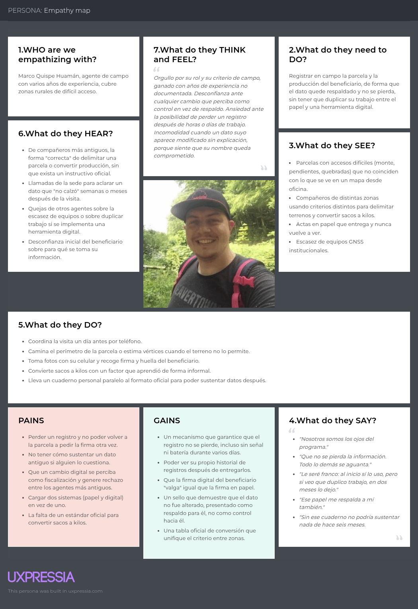

**Asistente de Gerencia General**  
El empathy map recoge la tensión central de Rocío entre aprobar y consolidar información que no captura ella misma, y la falta de un mecanismo que le permita verificar el origen de cada dato antes de responsabilizarse por él.

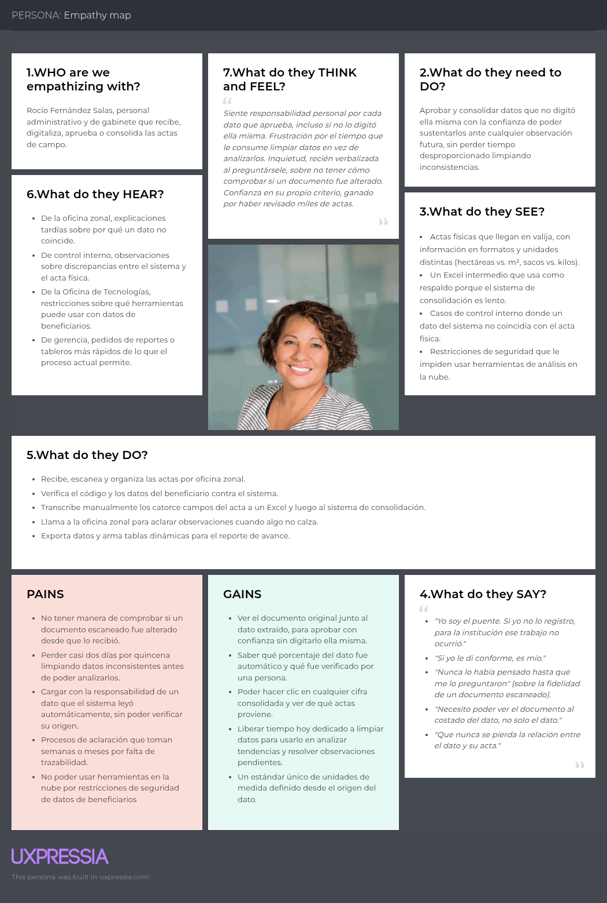

### As-is Scenario Mapping

El As-Is Scenario Mapping se elaboró en Miro, con una preparación previa revisando el análisis de entrevistas, lluvia de ideas individual por fase (Doing, Thinking, Feeling) y una revisión conjunta donde se nombraron las fases y se etiquetó cada una con un punto de color. Verde indica una fase positiva para el usuario, amarillo una fase nuetral, y rojo una fase negativa. Se elaboró un mapa por cada User Persona, dividido en dos capturas por claridad.

**Agente de Campo**

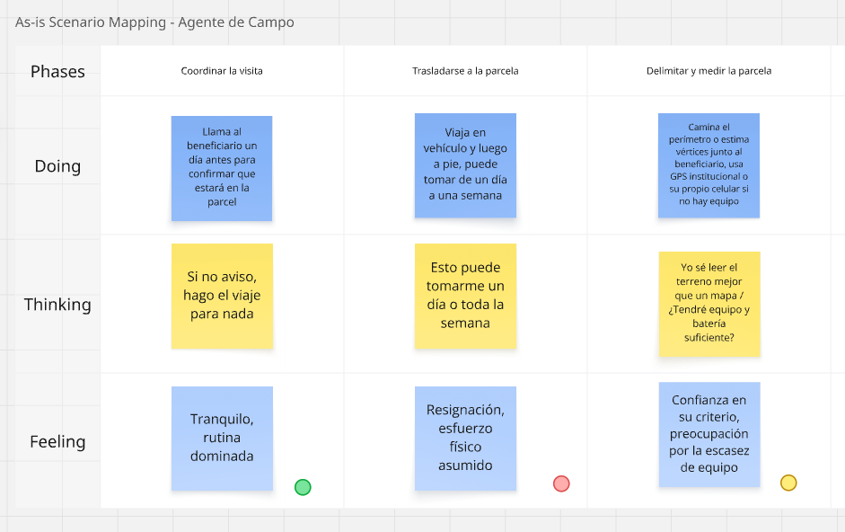

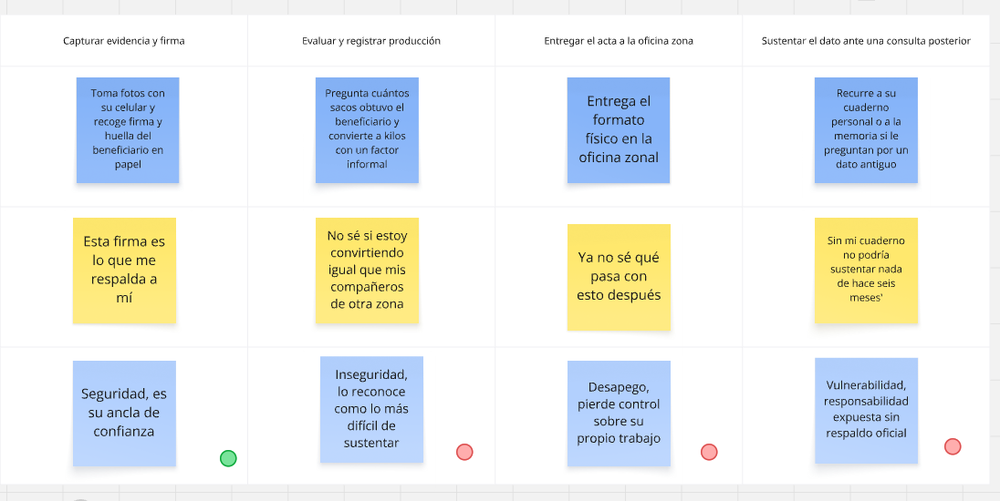

Blank areas identificadas: qué tan seguido se cuestiona un dato antiguo y qué pasa cuando ocurre, qué tanta resistencia real hay entre agentes antiguos frente a uno más digital, y si existe una tabla oficial de conversión saco-kilo.

**Asistente de Gerencia General**

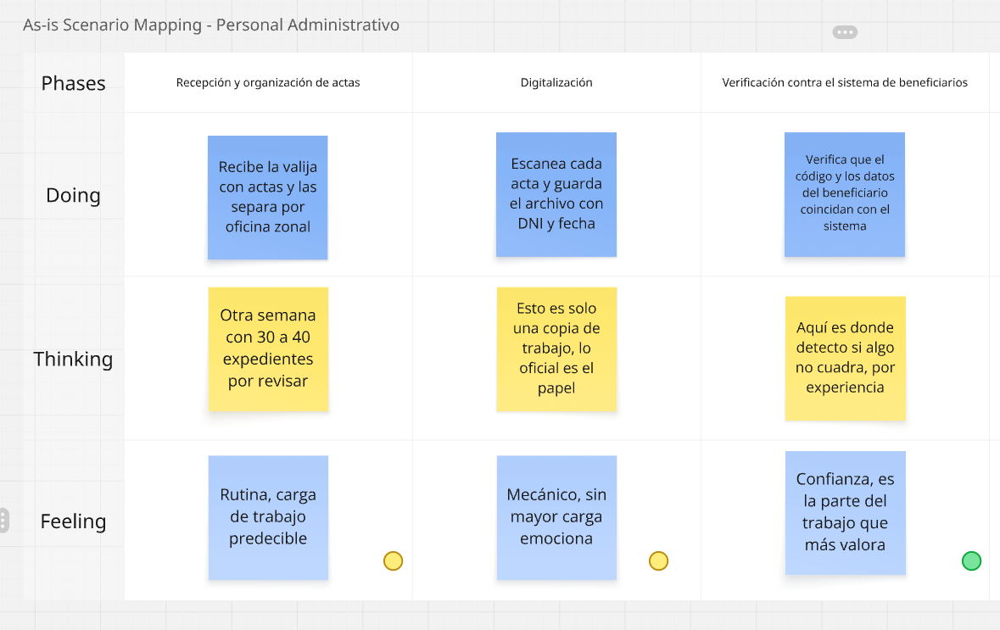

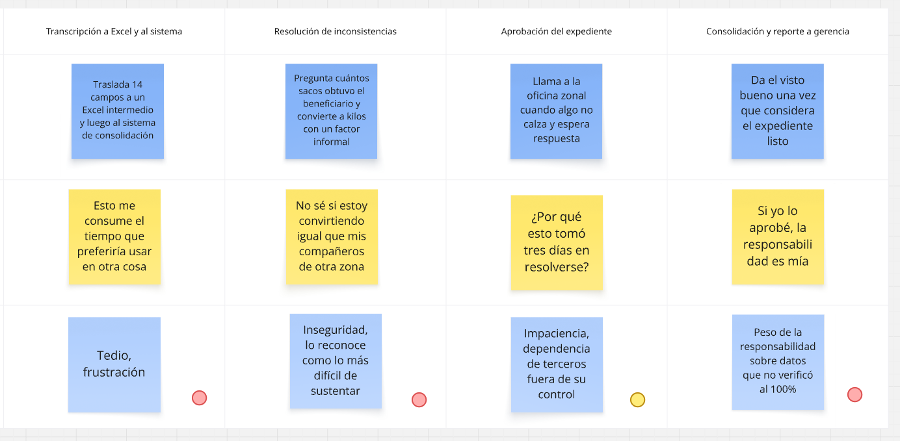

Blank areas identificadas: con qué frecuencia ocurre una observación de control interno, qué dice exactamente la directiva de seguridad sobre datos de beneficiarios en la nube, y si asistente, coordinador y analista coordinan directamente sobre un mismo expediente.

## Ubiquitous Language

Los entrevistados son user proxies (Cohn, 2004): personas que conocen y representan el trabajo del usuario final, pero no son ellas mismas ese usuario final. Por eso el lenguaje del dominio no se limita a lo recogido en esas entrevistas, sino que se extrajo directamente de un miembro del equipo que ha laborado en la entidad y conoce sus procesos de primera mano.

Se excluyen deliberadamente términos técnicos de ingeniería de software: solo se incluyen conceptos que ya forman parte del lenguaje que usan a diario el personal del programa, los agentes de campo y los beneficiarios.

**Activity (Actividad)**  
Conjunto de tareas del Plan Operativo Institucional agrupadas bajo una misma línea de trabajo, cuyo avance se mide a partir del cumplimiento de las tareas que la componen.

**Agricultural Input (Insumo agrícola)**  
Recurso o material que el programa entrega a un beneficiario registrado para el cultivo de su terreno.

**Approval (Aprobación)**  
Acto por el cual un responsable autorizado da conformidad a una ficha ya verificada, habilitándolo para ser tomado en cuenta como terminado dentro del POI.

**Beneficiary (Beneficiario)**  
Productor registrado en el programa que recibe insumos agrícolas y reporta periódicamente la producción obtenida de su terreno.

**Chain of Custody (Cadena de responsabilidad)**  
Identificación clara de la persona responsable de un dato en cada etapa del proceso, desde su captura en campo hasta su aprobación.

**Field Agent (Agente de Campo)**  
Persona encargada de visitar los terrenos de los beneficiarios para verificar su existencia, delimitarlos y registrar la producción declarada.

**Field Sheet (Ficha)**  
Documento que registra los datos de una visita de campo: delimitación del terreno, producción evaluada, y la firma y huella del beneficiario.

**General Management Assistant (Asistente de Gerencia General)**  
Persona encargada de digitalizar las fichas que llegan de campo, verificar sus datos contra el registro de beneficiarios y trasladarlos al sistema que consolida el avance institucional.

**Institutional Operational Plan / POI (Plan Operativo Institucional)**  
Plan anual que traduce los objetivos estratégicos del programa en metas medibles, contra el cual se reporta el avance periódico.

**Institutional Strategic Plan / PEI (Plan Estratégico Institucional)**  
Plan de mediano plazo que define los objetivos estratégicos del programa, base sobre la que se construye el Plan Operativo Institucional.

**Internal Control Observation (Observación de control interno)**  
Hallazgo formal levantado por el área de control interno de la entidad ante una discrepancia entre el dato reportado y su documento de respaldo.

**Land (Terreno)**  
Unidad de terreno registrada a nombre de un beneficiario dentro del programa.

**Land Boundary (Delimitación de terreno)**  
Contorno geográfico que define el área de un terreno registrado. Es un polígono cerrado que se forma uniendo sus vértices en orden.

**Progress Report (Reporte de avance)**  
Informe periódico que consolida los indicadores del programa y se presenta a la gerencia para seguimiento del Plan Operativo Institucional.

**Task (Tarea)**  
Unidad mínima realizable del Plan Operativo Institucional, planificada de antemano y totalmente rastreada durante su ejecución.

**Vertex (Vértice)**  
Punto del perímetro de un terreno, expresado con sus coordenadas Este y Norte. Los vértices llegan en el archivo que genera la estación total o se ingresan a mano desde la web.

**Yield (Producción)**  
Cantidad de producto agrícola obtenida en un terreno durante un periodo de evaluación.

**Zonal Office (Oficina zonal)**  
Unidad administrativa intermedia entre el trabajo de campo y la sede central del programa, por donde pasan las fichas antes de llegar a consolidación.

# Capítulo III: Requirements Specification

## To-Be Scenario Mapping

Los To-Be Scenario Mapping presentan el proceso esperado para los dos User Persona con la incorporación de SGT. Cada mapa organiza la experiencia futura en las filas Phases, Doing, Thinking y Feeling, y permite observar cómo cambian sus actividades, percepciones y emociones respecto del escenario actual.

Para elaborar los mapas, el equipo inició con una etapa de preparación en la que revisó el escenario actual de cada User Persona y delimitó el proceso que debía representar. Luego, cada integrante realizó una lluvia de ideas individual sobre las acciones, pensamientos y emociones esperados. En la revisión conjunta se agruparon los aportes, se identificaron las fases como columnas y se acordó el nombre de cada una. Finalmente, los resultados se compararon con los As-Is Scenario Mapping para reconocer los cambios que podría ofrecer el proceso propuesto.

**Agente de Campo**

El escenario de Marco Quispe Huamán comprende la preparación de la visita, la identificación del terreno y la selección de uno existente o la delimitación de uno nuevo con el dispositivo. Después de evaluar la producción y completar la ficha física, el agente la digitaliza en formato PDF, la asocia con la tarea, el beneficiario y el terreno correspondientes, y confirma que quedó registrada en SGT.

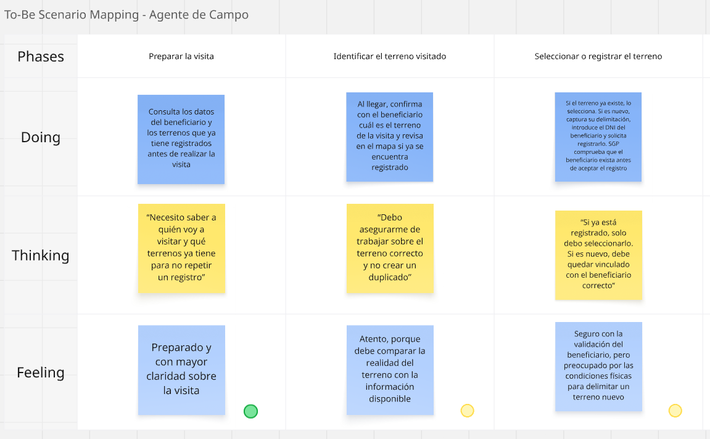

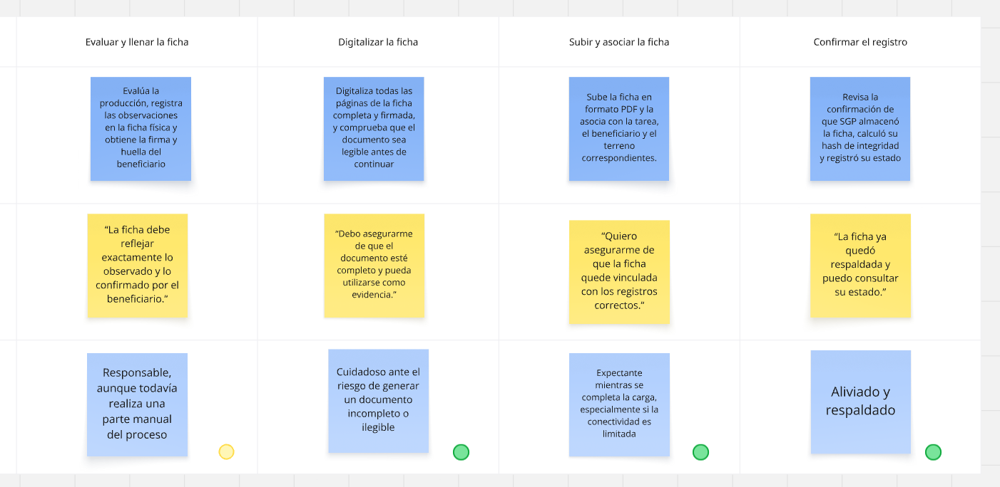

En comparación con el As-Is, el agente puede consultar los terrenos registrados antes de la visita, delimitar uno nuevo con el dispositivo y subir la ficha en formato PDF. Esto reduce los registros duplicados y permite respaldar el documento sin depender únicamente de su traslado físico.

**Asistente de Gerencia General**

El escenario de Rocío Fernández Salas comienza con la búsqueda de una ficha pendiente de revisión. La asistente comprueba la integridad del documento, consulta el beneficiario y el terreno asociados, compara el PDF con los datos extraídos y corrige cualquier diferencia antes de aprobar la ficha. Finalmente, consulta en SGT la actualización de la tarea y su contribución al avance del POI y del PEI.

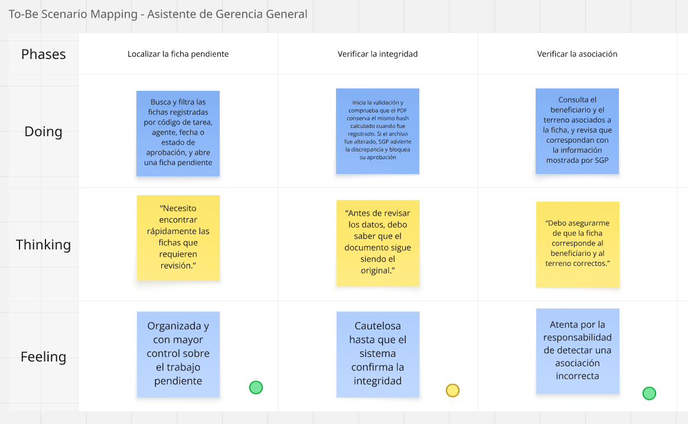

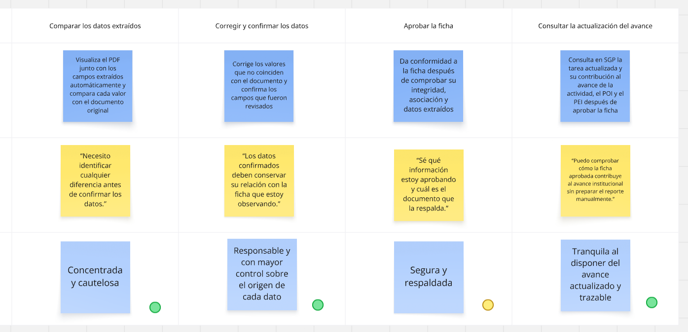

Frente al As-Is, la asistente puede localizar las fichas pendientes y deja de transcribir toda la información para concentrarse en verificar su integridad y sus datos. Después de la aprobación, puede consultar el avance institucional actualizado sin elaborar manualmente el reporte quincenal.

En conjunto, los escenarios conectan el registro realizado en campo con el seguimiento del POI y del PEI. El Agente de Campo conserva la responsabilidad sobre la visita, el terreno y la ficha, mientras que la Asistente de Gerencia General verifica el documento y sus datos antes de aprobarlos.

## User Stories

Se presenta a continuación el conjunto de User Stories planificadas para el alcance del proyecto.

<table style="width: 100%; border-collapse: collapse; border: 1px solid #333; font-family: Arial, sans-serif; font-size: 14px;">
    <thead>
        <tr>
            <th style="border: 1px solid #333; padding: 8px 10px; text-align: left;">Epic / Story ID</th>
            <th style="border: 1px solid #333; padding: 8px 10px; text-align: left;">Título</th>
            <th style="border: 1px solid #333; padding: 8px 10px; text-align: left;">Descripción</th>
            <th style="border: 1px solid #333; padding: 8px 10px; text-align: left;">Criterios de Aceptación</th>
            <th style="border: 1px solid #333; padding: 8px 10px; text-align: left;">Relacionado con (Epic ID)</th>
        </tr>
    </thead>
    <tbody>
        <tr>
            <td style="border: 1px solid #333; padding: 8px 10px; vertical-align: top;">EP-01</td>
            <td style="border: 1px solid #333; padding: 8px 10px; vertical-align: top;">Anexamiento de terrenos</td>
            <td style="border: 1px solid #333; padding: 8px 10px; vertical-align: top;">Registro de los terrenos de los beneficiarios a partir de los puntos capturados durante la visita de campo.</td>
            <td style="border: 1px solid #333; padding: 8px 10px; vertical-align: top;"></td>
            <td style="border: 1px solid #333; padding: 8px 10px; vertical-align: top;"></td>
        </tr>
        <tr>
            <td style="border: 1px solid #333; padding: 8px 10px; vertical-align: top;">EP-02</td>
            <td style="border: 1px solid #333; padding: 8px 10px; vertical-align: top;">Seguimiento de beneficiarios</td>
            <td style="border: 1px solid #333; padding: 8px 10px; vertical-align: top;">Seguimiento de los beneficiarios a partir de las fichas de evaluación que el agente de campo sube al finalizar cada visita.</td>
            <td style="border: 1px solid #333; padding: 8px 10px; vertical-align: top;"></td>
            <td style="border: 1px solid #333; padding: 8px 10px; vertical-align: top;"></td>
        </tr>
        <tr>
            <td style="border: 1px solid #333; padding: 8px 10px; vertical-align: top;">EP-03</td>
            <td style="border: 1px solid #333; padding: 8px 10px; vertical-align: top;">Validación y aprobación de fichas</td>
            <td style="border: 1px solid #333; padding: 8px 10px; vertical-align: top;">Validación y aprobación de las fichas registradas por el asistente de gerencia general.</td>
            <td style="border: 1px solid #333; padding: 8px 10px; vertical-align: top;"></td>
            <td style="border: 1px solid #333; padding: 8px 10px; vertical-align: top;"></td>
        </tr>
        <tr>
            <td style="border: 1px solid #333; padding: 8px 10px; vertical-align: top;">EP-04</td>
            <td style="border: 1px solid #333; padding: 8px 10px; vertical-align: top;">Seguimiento de objetivos estratégicos institucionales</td>
            <td style="border: 1px solid #333; padding: 8px 10px; vertical-align: top;">Seguimiento del avance del POI y del PEI a partir de las tareas registradas.</td>
            <td style="border: 1px solid #333; padding: 8px 10px; vertical-align: top;"></td>
            <td style="border: 1px solid #333; padding: 8px 10px; vertical-align: top;"></td>
        </tr>
        <tr>
            <td style="border: 1px solid #333; padding: 8px 10px; vertical-align: top;">EP-05</td>
            <td style="border: 1px solid #333; padding: 8px 10px; vertical-align: top;">Autenticación</td>
            <td style="border: 1px solid #333; padding: 8px 10px; vertical-align: top;">Acceso al sistema según el rol de cada usuario.</td>
            <td style="border: 1px solid #333; padding: 8px 10px; vertical-align: top;"></td>
            <td style="border: 1px solid #333; padding: 8px 10px; vertical-align: top;"></td>
        </tr>
        <tr>
            <td style="border: 1px solid #333; padding: 8px 10px; vertical-align: top;">SGT-2</td>
            <td style="border: 1px solid #333; padding: 8px 10px; vertical-align: top;">Enviar coordenadas de georreferenciación de terreno mediante archivo</td>
            <td style="border: 1px solid #333; padding: 8px 10px; vertical-align: top;">Como agente de campo, quiero enviar el archivo de coordenadas de una parcela que me da la estación total, para tener la parcela precargada en el sistema cuando la vaya a registrar.</td>
            <td style="border: 1px solid #333; padding: 8px 10px; vertical-align: top;">
                <ul>
                    <!-- Criterio BDD -->
                    <li>
                        <strong>Scenario:</strong> Envío de archivo de coordenadas exitoso 
                        <strong>Given</strong> el agente de campo se encuentra en el terreno del beneficiario 
                        <strong>When</strong> pasa el archivo de coordenadas a su celular 
                        <strong>AND</strong> envía el archivo de coordenadas por la aplicación móvil
                        <strong>Then</strong> el sistema crea una parcela en estado borrador con las coordenadas extraídas del archivo de coordenadas. 
                    </li>
                </ul>
            </td>
            <td style="border: 1px solid #333; padding: 8px 10px; vertical-align: top;">EP-01</td>
        </tr>
        <tr>
            <td style="border: 1px solid #333; padding: 8px 10px; vertical-align: top;">SGT-3</td>
            <td style="border: 1px solid #333; padding: 8px 10px; vertical-align: top;">Subir la ficha diligenciada para su almacenamiento y verificación de integridad</td>
            <td style="border: 1px solid #333; padding: 8px 10px; vertical-align: top;">Como agente de campo, quiero subir la ficha en formato PDF una vez finalizada la visita, para contar con un respaldo verificable de que quedó registrada tal como la firmé.</td>
            <td style="border: 1px solid #333; padding: 8px 10px; vertical-align: top;">
                <ul>
                    <!-- Criterio BDD -->
                    <li>
                        <strong>Scenario:</strong> Subida de la ficha 
                        <strong>Given</strong> el agente de campo completó el diligenciamiento físico de la ficha 
                        <strong>When</strong> el agente sube la ficha en formato PDF 
                        <strong>Then</strong> el sistema almacena el archivo y calcula su hash de integridad 
                        <strong>And</strong> notifica al agente que la ficha quedó registrada 
                    </li>
                    <!-- Criterio NON-BDD -->
                    <li>El agente puede consultar en cualquier momento el estado de la ficha subida, sin depender de que otra persona se lo confirme.</li>
                </ul>
            </td>
            <td style="border: 1px solid #333; padding: 8px 10px; vertical-align: top;">EP-02</td>
        </tr>
        <tr>
            <td style="border: 1px solid #333; padding: 8px 10px; vertical-align: top;">SGT-4</td>
            <td style="border: 1px solid #333; padding: 8px 10px; vertical-align: top;">Buscar y filtrar las fichas registradas</td>
            <td style="border: 1px solid #333; padding: 8px 10px; vertical-align: top;">Como asistente de gerencia general, quiero buscar y filtrar las fichas registradas por código de tarea, agente de campo, fecha o estado de aprobación, para ubicar rápido las que quedaron con alguna observación pendiente.</td>
            <td style="border: 1px solid #333; padding: 8px 10px; vertical-align: top;">
                <ul>
                    <!-- Criterio BDD -->
                    <li>
                        <strong>Scenario:</strong> Filtrado por estado de aprobación 
                        <strong>Given</strong> el asistente de gerencia general está en el listado de fichas 
                        <strong>When</strong> filtra el listado por estado de aprobación 
                        <strong>Then</strong> el sistema muestra solo las fichas que coinciden con ese estado 
                    </li>
                    <!-- Criterio NON-BDD -->
                    <li>Los filtros por código de tarea, agente de campo y fecha pueden combinarse entre sí en una misma búsqueda.</li>
                </ul>
            </td>
            <td style="border: 1px solid #333; padding: 8px 10px; vertical-align: top;">EP-03</td>
        </tr>
        <tr>
            <td style="border: 1px solid #333; padding: 8px 10px; vertical-align: top;">SGT-5</td>
            <td style="border: 1px solid #333; padding: 8px 10px; vertical-align: top;">Revisar los campos críticos extraídos al validar una ficha</td>
            <td style="border: 1px solid #333; padding: 8px 10px; vertical-align: top;">Como asistente de gerencia general, quiero revisar los campos que el sistema extrajo automáticamente de la ficha antes de aprobarla, para confirmar que coinciden con lo que el documento realmente dice.</td>
            <td style="border: 1px solid #333; padding: 8px 10px; vertical-align: top;">
                <ul>
                    <!-- Criterio BDD -->
                    <li>
                        <strong>Scenario:</strong> Extracción coincide con el documento 
                        <strong>Given</strong> el asistente de gerencia general está revisando una ficha cuyos campos ya fueron extraídos automáticamente 
                        <strong>When</strong> el asistente compara cada campo extraído contra el documento 
                        <strong>Then</strong> el sistema le permite confirmar el campo como correcto 
                    </li>
                    <!-- Criterio BDD -->
                    <li>
                        <strong>Scenario:</strong> Extracción no coincide con el documento 
                        <strong>Given</strong> el asistente de gerencia general está revisando una ficha cuyos campos ya fueron extraídos automáticamente 
                        <strong>When</strong> el asistente detecta que un campo extraído no corresponde a lo que dice el documento 
                        <strong>Then</strong> el sistema le permite corregir ese campo 
                    </li>
                    <!-- Criterio NON-BDD -->
                    <li>El asistente puede ver el documento y el campo extraído uno al lado del otro, sin tener que alternar entre pantallas.</li>
                    <!-- Criterio NON-BDD -->
                    <li>Un campo se considera corregido manualmente si el usuario ingresa un valor diferente del propuesto por la IA.</li>
                </ul>
            </td>
            <td style="border: 1px solid #333; padding: 8px 10px; vertical-align: top;">EP-03</td>
        </tr>
        <tr>
            <td style="border: 1px solid #333; padding: 8px 10px; vertical-align: top;">SGT-6</td>
            <td style="border: 1px solid #333; padding: 8px 10px; vertical-align: top;">Verificar la integridad del documento digitalizado al validar una ficha</td>
            <td style="border: 1px solid #333; padding: 8px 10px; vertical-align: top;">Como asistente de gerencia general, quiero saber si el documento presentado como evidencia de una tarea sigue siendo el mismo que se subió, para no aprobar uno que fue alterado después.</td>
            <td style="border: 1px solid #333; padding: 8px 10px; vertical-align: top;">
                <ul>
                    <!-- Criterio BDD -->
                    <li>
                        <strong>Scenario:</strong> Documento inalterado 
                        <strong>Given</strong> el asistente de gerencia general va a validar la ficha presentada como evidencia de haber completado la tarea 
                        <strong>And</strong> el archivo no ha sido modificado desde que se subió 
                        <strong>When</strong> el asistente inicia la validación del documento 
                        <strong>Then</strong> el sistema confirma que el documento es íntegro 
                    </li>
                    <!-- Criterio BDD -->
                    <li>
                        <strong>Scenario:</strong> Documento alterado 
                        <strong>Given</strong> el asistente de gerencia general va a validar la ficha presentada como evidencia de haber completado la tarea 
                        <strong>And</strong> el archivo fue modificado después de haberse subido 
                        <strong>When</strong> el asistente inicia la validación del documento 
                        <strong>Then</strong> el sistema advierte que el documento fue modificado después de subido 
                        <strong>And</strong> bloquea la aprobación de la ficha hasta que se resuelva la discrepancia 
                    </li>
                </ul>
            </td>
            <td style="border: 1px solid #333; padding: 8px 10px; vertical-align: top;">EP-03</td>
        </tr>
        <tr>
            <td style="border: 1px solid #333; padding: 8px 10px; vertical-align: top;">SGT-7</td>
            <td style="border: 1px solid #333; padding: 8px 10px; vertical-align: top;">Consultar los datos del beneficiario durante la validación de una ficha</td>
            <td style="border: 1px solid #333; padding: 8px 10px; vertical-align: top;">Como asistente de gerencia general, quiero consultar los datos del beneficiario asociado a una ficha mientras la reviso, para tenerlos disponibles sin salir a otro sistema.</td>
            <td style="border: 1px solid #333; padding: 8px 10px; vertical-align: top;">
                <ul>
                    <!-- Criterio BDD -->
                    <li>
                        <strong>Scenario:</strong> Consulta del perfil del beneficiario 
                        <strong>Given</strong> el asistente de gerencia general está revisando una ficha 
                        <strong>When</strong> el asistente consulta los datos del beneficiario asociado a esa ficha 
                        <strong>Then</strong> el sistema muestra el perfil del beneficiario tal como está en el registro que lo origina 
                    </li>
                    <!-- Criterio NON-BDD -->
                    <li>Los datos mostrados se mantienen sincronizados con el registro de beneficiarios, sin traslado manual del dato.</li>
                </ul>
            </td>
            <td style="border: 1px solid #333; padding: 8px 10px; vertical-align: top;">EP-03</td>
        </tr>
        <tr>
            <td style="border: 1px solid #333; padding: 8px 10px; vertical-align: top;">SGT-8</td>
            <td style="border: 1px solid #333; padding: 8px 10px; vertical-align: top;">Buscar y filtrar las tareas registradas</td>
            <td style="border: 1px solid #333; padding: 8px 10px; vertical-align: top;">Como asistente de gerencia general, quiero buscar y filtrar las tareas registradas por código de tarea, actividad, zona, estado de avance o el estado de su entrega, para ver todas las tareas planificadas según el POI y su estado.</td>
            <td style="border: 1px solid #333; padding: 8px 10px; vertical-align: top;">
                <ul>
                    <!-- Criterio BDD -->
                    <li>
                        <strong>Scenario:</strong> Filtrado por estado de avance 
                        <strong>Given</strong> el asistente de gerencia general está en el listado de tareas 
                        <strong>When</strong> filtra el listado por estado de avance 
                        <strong>Then</strong> el sistema muestra solo las tareas que coinciden con ese estado 
                    </li>
                    <!-- Criterio BDD -->
                    <li>
                        <strong>Scenario:</strong> Filtrado por tareas con entrega pendiente de confirmación en cadena 
                        <strong>Given</strong> el asistente de gerencia general está en el listado de tareas 
                        <strong>When</strong> filtra el listado por tareas cuya entrega aún no ha sido confirmada en la cadena de bloques 
                        <strong>Then</strong> el sistema muestra solo esas tareas 
                    </li>
                    <!-- Criterio BDD -->
                    <li>
                        <strong>Scenario:</strong> Filtrado por tareas con entrega lista para validar 
                        <strong>Given</strong> el asistente de gerencia general está en el listado de tareas 
                        <strong>When</strong> filtra el listado por tareas cuya entrega ya fue confirmada en la cadena de bloques 
                        <strong>Then</strong> el sistema muestra solo esas tareas 
                    </li>
                    <!-- Criterio NON-BDD -->
                    <li>Los filtros por código de tarea, actividad y zona pueden combinarse entre sí y con los anteriores en una misma búsqueda.</li>
                </ul>
            </td>
            <td style="border: 1px solid #333; padding: 8px 10px; vertical-align: top;">EP-04</td>
        </tr>
        <tr>
            <td style="border: 1px solid #333; padding: 8px 10px; vertical-align: top;">SGT-9</td>
            <td style="border: 1px solid #333; padding: 8px 10px; vertical-align: top;">Consultar el avance del PEI y del POI según las tareas registradas</td>
            <td style="border: 1px solid #333; padding: 8px 10px; vertical-align: top;">Como asistente de gerencia general, quiero consultar el avance del POI y del PEI calculado a partir de las actividades y tareas registradas, para tener esa información disponible sin depender de armar el reporte manualmente cada quincena.</td>
            <td style="border: 1px solid #333; padding: 8px 10px; vertical-align: top;">
                <ul>
                    <!-- Criterio BDD -->
                    <li>
                        <strong>Scenario:</strong> Consulta del avance por actividad 
                        <strong>Given</strong> el asistente de gerencia general abre el tablero de avance 
                        <strong>When</strong> consulta el avance de una actividad 
                        <strong>Then</strong> el sistema muestra el porcentaje de tareas completadas frente al total planificado para esa actividad 
                        <strong>And</strong> lo refleja en el avance correspondiente del POI y del PEI 
                    </li>
                    <!-- Criterio BDD -->
                    <li>
                        <strong>Scenario:</strong> Trazabilidad del dato agregado 
                        <strong>Given</strong> el asistente de gerencia general está consultando el avance de una actividad 
                        <strong>When</strong> selecciona el porcentaje mostrado 
                        <strong>Then</strong> el sistema muestra las tareas que lo componen 
                    </li>
                    <!-- Criterio BDD -->
                    <li>
                        <strong>Scenario:</strong> Consulta de la tendencia de avance en el tiempo 
                        <strong>Given</strong> el asistente de gerencia general está consultando el avance de una actividad 
                        <strong>When</strong> consulta su evolución en un rango de fechas 
                        <strong>Then</strong> el sistema muestra el porcentaje de avance registrado en cada punto de ese rango 
                        <strong>And</strong> señala si el ritmo de avance se desaceleró respecto al periodo anterior 
                    </li>
                    <!-- Criterio NON-BDD -->
                    <li>El avance se recalcula automáticamente a medida que se aprueban tareas, sin depender de un cierre quincenal manual.</li>
                </ul>
            </td>
            <td style="border: 1px solid #333; padding: 8px 10px; vertical-align: top;">EP-04</td>
        </tr>
        <tr>
            <td style="border: 1px solid #333; padding: 8px 10px; vertical-align: top;">SGT-10</td>
            <td style="border: 1px solid #333; padding: 8px 10px; vertical-align: top;">Iniciar sesión con credenciales institucionales</td>
            <td style="border: 1px solid #333; padding: 8px 10px; vertical-align: top;">Como usuario del sistema, quiero iniciar sesión con mi usuario y contraseña, para acceder solo a las funciones correspondientes a mi rol.</td>
            <td style="border: 1px solid #333; padding: 8px 10px; vertical-align: top;">
                <ul>
                    <!-- Criterio BDD -->
                    <li>
                        <strong>Scenario:</strong> Credenciales válidas 
                        <strong>Given</strong> el usuario cuenta con una cuenta activa en el sistema 
                        <strong>When</strong> ingresa su usuario y contraseña correctos 
                        <strong>Then</strong> el sistema le da acceso a las funciones correspondientes a su rol 
                    </li>
                    <!-- Criterio BDD -->
                    <li>
                        <strong>Scenario:</strong> Credenciales inválidas 
                        <strong>Given</strong> el usuario cuenta con una cuenta activa en el sistema 
                        <strong>When</strong> ingresa un usuario o contraseña incorrectos 
                        <strong>Then</strong> el sistema deniega el acceso 
                        <strong>And</strong> le indica que las credenciales no son válidas 
                    </li>
                    <!-- Criterio NON-BDD -->
                    <li>El sistema no distingue si el error corresponde al usuario o a la contraseña, para no dar pistas ante intentos de acceso no autorizados.</li>
                </ul>
            </td>
            <td style="border: 1px solid #333; padding: 8px 10px; vertical-align: top;">EP-05</td>
        </tr>
        <tr>
            <td style="border: 1px solid #333; padding: 8px 10px; vertical-align: top;">SGT-11</td>
            <td style="border: 1px solid #333; padding: 8px 10px; vertical-align: top;">Cerrar sesión</td>
            <td style="border: 1px solid #333; padding: 8px 10px; vertical-align: top;">Como usuario del sistema, quiero cerrar mi sesión, para que nadie más pueda usar el sistema con mis credenciales si dejo el dispositivo desatendido.</td>
            <td style="border: 1px solid #333; padding: 8px 10px; vertical-align: top;">
                <ul>
                    <!-- Criterio BDD -->
                    <li>
                        <strong>Scenario:</strong> Cierre de sesión 
                        <strong>Given</strong> el usuario tiene una sesión activa 
                        <strong>When</strong> cierra sesión 
                        <strong>Then</strong> el sistema termina la sesión 
                        <strong>And</strong> exige volver a iniciar sesión para continuar usando el sistema 
                    </li>
                </ul>
            </td>
            <td style="border: 1px solid #333; padding: 8px 10px; vertical-align: top;">EP-05</td>
        </tr>
    </tbody>
</table>

## Impact Mapping

El Impact Mapping relaciona los objetivos del negocio con los cambios de comportamiento esperados en los User Persona y con las funcionalidades que SGT debe ofrecer para favorecerlos. Para su elaboración se utilizaron las fichas de Marco Quispe Huamán, Agente de Campo, y Rocío Fernández Salas, Asistente de Gerencia General, junto con las User Stories definidas para el producto.

El equipo partió de los resultados de negocio planteados durante Lean UX y los formuló como objetivos SMART, indicando una mejora medible, una línea base y un plazo de seis meses. Luego identificó qué User Persona puede contribuir a cada objetivo, describió el comportamiento necesario como impacto y propuso los entregables del producto que lo hacen posible. Por último, cada rama se vinculó con las User Stories correspondientes, conservando su redacción en el formato «Como..., quiero..., para...».

Los objetivos definidos fueron reducir en un 20 % el tiempo activo promedio dedicado a procesar cada ficha, disminuir en un 90 % las fichas observadas por inconsistencias y reducir en un 95 % los incidentes de acceso o modificación no autorizados. En los tres casos, el resultado se compara con la línea base levantada antes del piloto y debe alcanzarse al finalizar los primeros seis meses de operación de SGT.

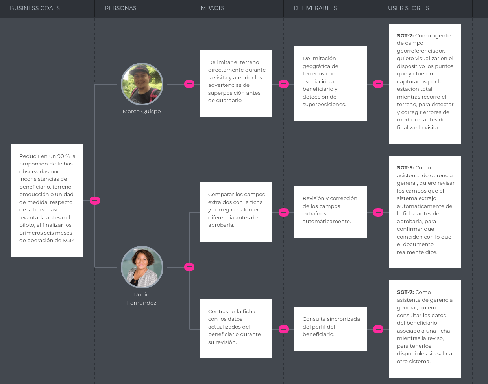

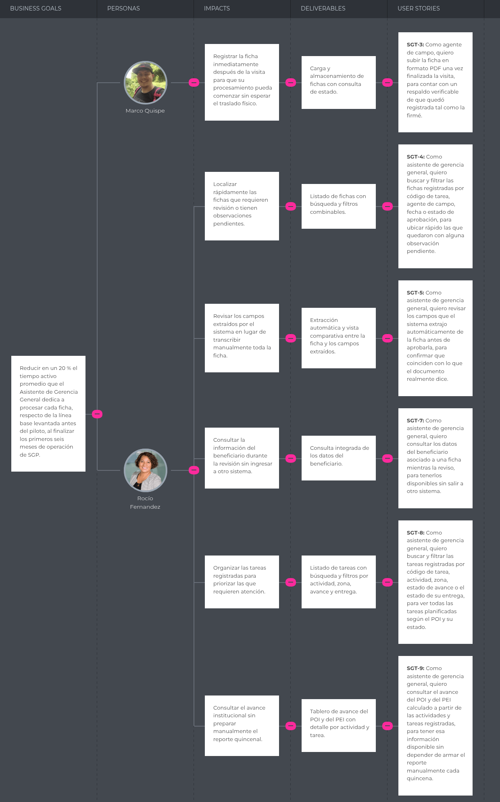

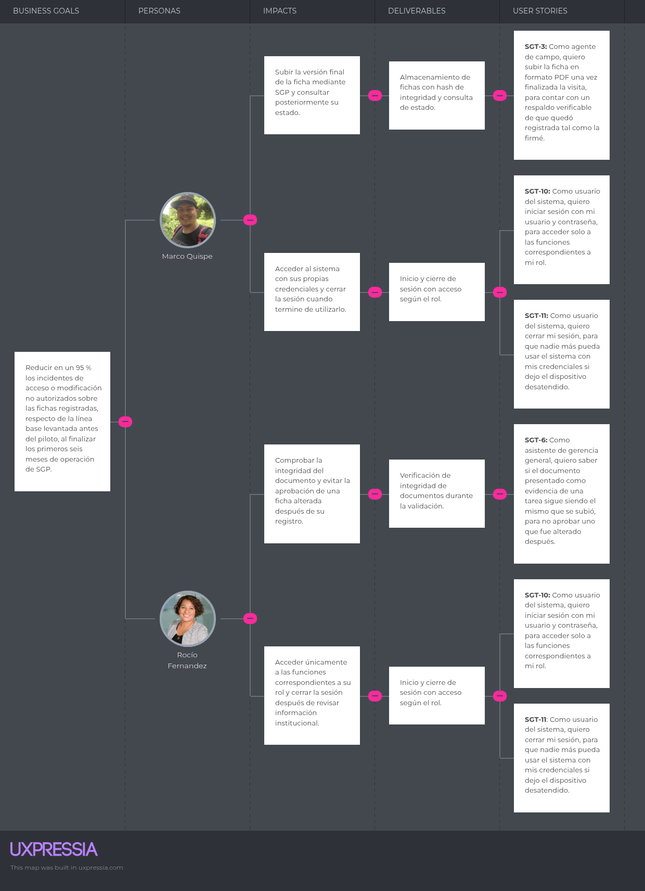

## Product Backlog

Se presentan las historias de usuario priorizadas por dependencia técnica y valor de negocio.

El backlog se mantiene en YouTrack, donde cada historia está registrada como una issue del proyecto SGT. La siguiente captura muestra su estado actual, y el tablero completo puede consultarse en [soulware.youtrack.cloud](https://soulware.youtrack.cloud/issues/SGT).

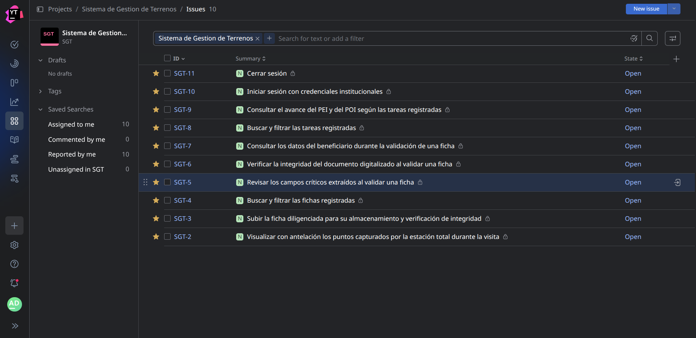

A continuación se detalla el orden de implementación de cada historia.

<table style="width: 100%; border-collapse: collapse; border: 1px solid #333; font-family: Arial, sans-serif; font-size: 14px;">
    <thead>
        <tr>
            <th scope="col" style="border: 1px solid #333; padding: 8px 10px; text-align: left;"># Orden</th>
            <th scope="col" style="border: 1px solid #333; padding: 8px 10px; text-align: left;">User Story ID</th>
            <th scope="col" style="border: 1px solid #333; padding: 8px 10px; text-align: left;">Título</th>
            <th scope="col" style="border: 1px solid #333; padding: 8px 10px; text-align: left;">Descripción</th>
            <th scope="col" style="border: 1px solid #333; padding: 8px 10px; text-align: left;">Story Points</th>
        </tr>
    </thead>
    <tbody>
        <tr>
            <td style="border: 1px solid #333; padding: 8px 10px; vertical-align: top;">1</td>
            <td style="border: 1px solid #333; padding: 8px 10px; vertical-align: top;">SGT-10</td>
            <td style="border: 1px solid #333; padding: 8px 10px; vertical-align: top;">Iniciar sesión con credenciales institucionales</td>
            <td style="border: 1px solid #333; padding: 8px 10px; vertical-align: top;">Como usuario del sistema, quiero iniciar sesión con mi usuario y contraseña, para acceder solo a las funciones correspondientes a mi rol.</td>
            <td style="border: 1px solid #333; padding: 8px 10px; vertical-align: top;">5</td>
        </tr>
        <tr>
            <td style="border: 1px solid #333; padding: 8px 10px; vertical-align: top;">2</td>
            <td style="border: 1px solid #333; padding: 8px 10px; vertical-align: top;">SGT-11</td>
            <td style="border: 1px solid #333; padding: 8px 10px; vertical-align: top;">Cerrar sesión</td>
            <td style="border: 1px solid #333; padding: 8px 10px; vertical-align: top;">Como usuario del sistema, quiero cerrar mi sesión, para que nadie más pueda usar el sistema con mis credenciales si dejo el dispositivo desatendido.</td>
            <td style="border: 1px solid #333; padding: 8px 10px; vertical-align: top;">3</td>
        </tr>
        <tr>
            <td style="border: 1px solid #333; padding: 8px 10px; vertical-align: top;">3</td>
            <td style="border: 1px solid #333; padding: 8px 10px; vertical-align: top;">SGT-2</td>
            <td style="border: 1px solid #333; padding: 8px 10px; vertical-align: top;">Enviar coordenadas de georreferenciación de terreno mediante archivo</td>
            <td style="border: 1px solid #333; padding: 8px 10px; vertical-align: top;">Como agente de campo, quiero enviar el archivo de coordenadas de una parcela que me da la estación total, para tener la parcela precargada en el sistema cuando la vaya a registrar.</td>
            <td style="border: 1px solid #333; padding: 8px 10px; vertical-align: top;">5</td>
        </tr>
        <tr>
            <td style="border: 1px solid #333; padding: 8px 10px; vertical-align: top;">4</td>
            <td style="border: 1px solid #333; padding: 8px 10px; vertical-align: top;">SGT-3</td>
            <td style="border: 1px solid #333; padding: 8px 10px; vertical-align: top;">Subir la ficha diligenciada para su almacenamiento y verificación de integridad</td>
            <td style="border: 1px solid #333; padding: 8px 10px; vertical-align: top;">Como agente de campo, quiero subir la ficha en formato PDF una vez finalizada la visita, para contar con un respaldo verificable de que quedó registrada tal como la firmé.</td>
            <td style="border: 1px solid #333; padding: 8px 10px; vertical-align: top;">8</td>
        </tr>
        <tr>
            <td style="border: 1px solid #333; padding: 8px 10px; vertical-align: top;">5</td>
            <td style="border: 1px solid #333; padding: 8px 10px; vertical-align: top;">SGT-6</td>
            <td style="border: 1px solid #333; padding: 8px 10px; vertical-align: top;">Verificar la integridad del documento digitalizado al validar una ficha</td>
            <td style="border: 1px solid #333; padding: 8px 10px; vertical-align: top;">Como asistente de gerencia general, quiero saber si el documento presentado como evidencia de una tarea sigue siendo el mismo que se subió, para no aprobar uno que fue alterado después.</td>
            <td style="border: 1px solid #333; padding: 8px 10px; vertical-align: top;">3</td>
        </tr>
        <tr>
            <td style="border: 1px solid #333; padding: 8px 10px; vertical-align: top;">6</td>
            <td style="border: 1px solid #333; padding: 8px 10px; vertical-align: top;">SGT-5</td>
            <td style="border: 1px solid #333; padding: 8px 10px; vertical-align: top;">Revisar los campos críticos extraídos al validar una ficha</td>
            <td style="border: 1px solid #333; padding: 8px 10px; vertical-align: top;">Como asistente de gerencia general, quiero revisar los campos que el sistema extrajo automáticamente de la ficha antes de aprobarla, para confirmar que coinciden con lo que el documento realmente dice.</td>
            <td style="border: 1px solid #333; padding: 8px 10px; vertical-align: top;">3</td>
        </tr>
        <tr>
            <td style="border: 1px solid #333; padding: 8px 10px; vertical-align: top;">7</td>
            <td style="border: 1px solid #333; padding: 8px 10px; vertical-align: top;">SGT-7</td>
            <td style="border: 1px solid #333; padding: 8px 10px; vertical-align: top;">Consultar los datos del beneficiario durante la validación de una ficha</td>
            <td style="border: 1px solid #333; padding: 8px 10px; vertical-align: top;">Como asistente de gerencia general, quiero consultar los datos del beneficiario asociado a una ficha mientras la reviso, para tenerlos disponibles sin salir a otro sistema.</td>
            <td style="border: 1px solid #333; padding: 8px 10px; vertical-align: top;">2</td>
        </tr>
        <tr>
            <td style="border: 1px solid #333; padding: 8px 10px; vertical-align: top;">8</td>
            <td style="border: 1px solid #333; padding: 8px 10px; vertical-align: top;">SGT-4</td>
            <td style="border: 1px solid #333; padding: 8px 10px; vertical-align: top;">Buscar y filtrar las fichas registradas</td>
            <td style="border: 1px solid #333; padding: 8px 10px; vertical-align: top;">Como asistente de gerencia general, quiero buscar y filtrar las fichas registradas por código de tarea, agente de campo, fecha o estado de aprobación, para ubicar rápido las que quedaron con alguna observación pendiente.</td>
            <td style="border: 1px solid #333; padding: 8px 10px; vertical-align: top;">2</td>
        </tr>
        <tr>
            <td style="border: 1px solid #333; padding: 8px 10px; vertical-align: top;">9</td>
            <td style="border: 1px solid #333; padding: 8px 10px; vertical-align: top;">SGT-8</td>
            <td style="border: 1px solid #333; padding: 8px 10px; vertical-align: top;">Buscar y filtrar las tareas registradas</td>
            <td style="border: 1px solid #333; padding: 8px 10px; vertical-align: top;">Como asistente de gerencia general, quiero buscar y filtrar las tareas registradas por código de tarea, actividad, zona, estado de avance o el estado de su entrega, para ver todas las tareas planificadas según el POI y su estado.</td>
            <td style="border: 1px solid #333; padding: 8px 10px; vertical-align: top;">2</td>
        </tr>
        <tr>
            <td style="border: 1px solid #333; padding: 8px 10px; vertical-align: top;">10</td>
            <td style="border: 1px solid #333; padding: 8px 10px; vertical-align: top;">SGT-9</td>
            <td style="border: 1px solid #333; padding: 8px 10px; vertical-align: top;">Consultar el avance del PEI y del POI según las tareas registradas</td>
            <td style="border: 1px solid #333; padding: 8px 10px; vertical-align: top;">Como asistente de gerencia general, quiero consultar el avance del POI y del PEI calculado a partir de las actividades y tareas registradas, para tener esa información disponible sin depender de armar el reporte manualmente cada quincena.</td>
            <td style="border: 1px solid #333; padding: 8px 10px; vertical-align: top;">2</td>
        </tr>
    </tbody>
</table>

# Capítulo IV: Strategic-Level Software Design

## Strategic-Level Attribute-Driven Design

### Design Purpose

El programa de apoyo agrícola opera hoy con procesos manuales, sistemas aislados entre sí y un apego al papel como fuente de verdad. El propósito de este diseño es definir una arquitectura para SGT que reduzca esa carga con mejoras puntuales sobre el flujo existente, cada una respaldada por una User Story del Product Backlog.

Las mejoras por segmento objetivo son las siguientes.

**Agente de campo georreferenciador**
- Detecta y corrige los errores de medición durante la misma visita.
- Cuenta con un respaldo verificable de su trabajo.

**Funcionario administrativo**
- Ubica con rapidez las fichas y tareas que requieren atención.
- Verifica los datos extraídos en lugar de transcribir cada ficha.
- Toma decisiones con la certeza de la integridad de los documentos.
- Dispone de los datos necesarios para tomar decisiones en un solo lugar.
- Obtiene el avance del POI y del PEI sin elaborar el reporte manualmente cada quincena.

### Attribute-Driven Design Inputs

Esta sección reúne los tres tipos de Input que alimentan el proceso de Attribute-Driven Design. La funcionalidad primaria selecciona las User Stories con mayor impacto sobre la arquitectura, los Quality Attribute Scenarios recogen la primera versión de los atributos de calidad que la solución debe satisfacer, y los Constraints establecen las restricciones impuestas por el negocio que el diseño debe respetar.

#### Primary Functionality (Primary User Stories)

Se identifica las funcionalidades prioritarias para el usuario, con las cuales se trabajara para identificar los atributos de calidad en secciones posteriores.

<table style="width: 100%; border-collapse: collapse; border: 1px solid #333; font-family: Arial, sans-serif; font-size: 14px;">
    <thead>
        <tr>
            <th style="border: 1px solid #333; padding: 8px 10px; text-align: left;">Epic / Story ID</th>
            <th style="border: 1px solid #333; padding: 8px 10px; text-align: left;">Título</th>
            <th style="border: 1px solid #333; padding: 8px 10px; text-align: left;">Descripción</th>
            <th style="border: 1px solid #333; padding: 8px 10px; text-align: left;">Criterios de Aceptación</th>
            <th style="border: 1px solid #333; padding: 8px 10px; text-align: left;">Relacionado con (Epic ID)</th>
        </tr>
    </thead>
    <tbody>
        <tr>
            <td style="border: 1px solid #333; padding: 8px 10px; vertical-align: top;">SGT-2</td>
            <td style="border: 1px solid #333; padding: 8px 10px; vertical-align: top;">Enviar coordenadas de georreferenciación de terreno mediante archivo</td>
            <td style="border: 1px solid #333; padding: 8px 10px; vertical-align: top;">Como agente de campo, quiero enviar el archivo de coordenadas de una parcela que me da la estación total, para tener la parcela precargada en el sistema cuando la vaya a registrar.</td>
            <td style="border: 1px solid #333; padding: 8px 10px; vertical-align: top;">
                <ul>
                    <!-- Criterio BDD -->
                    <li>
                        <strong>Scenario:</strong> Envío de archivo de coordenadas exitoso 
                        <strong>Given</strong> el agente de campo se encuentra en el terreno del beneficiario 
                        <strong>When</strong> pasa el archivo de coordenadas a su celular 
                        <strong>AND</strong> envía el archivo de coordenadas por la aplicación móvil
                        <strong>Then</strong> el sistema crea una parcela en estado borrador con las coordenadas extraídas del archivo de coordenadas. 
                    </li>
                </ul>
            </td>
            <td style="border: 1px solid #333; padding: 8px 10px; vertical-align: top;">EP-01</td>
        </tr>
        <tr>
            <td style="border: 1px solid #333; padding: 8px 10px; vertical-align: top;">SGT-3</td>
            <td style="border: 1px solid #333; padding: 8px 10px; vertical-align: top;">Subir la ficha diligenciada para su almacenamiento y verificación de integridad</td>
            <td style="border: 1px solid #333; padding: 8px 10px; vertical-align: top;">Como agente de campo, quiero subir la ficha en formato PDF una vez finalizada la visita, para contar con un respaldo verificable de que quedó registrada tal como la firmé.</td>
            <td style="border: 1px solid #333; padding: 8px 10px; vertical-align: top;">
                <ul>
                    <!-- Criterio BDD -->
                    <li>
                        <strong>Scenario:</strong> Subida de la ficha 
                        <strong>Given</strong> el agente de campo completó el diligenciamiento físico de la ficha 
                        <strong>When</strong> el agente sube la ficha en formato PDF 
                        <strong>Then</strong> el sistema almacena el archivo y calcula su hash de integridad 
                        <strong>And</strong> notifica al agente que la ficha quedó registrada 
                    </li>
                    <!-- Criterio NON-BDD -->
                    <li>El agente puede consultar en cualquier momento el estado de la ficha subida, sin depender de que otra persona se lo confirme.</li>
                </ul>
            </td>
            <td style="border: 1px solid #333; padding: 8px 10px; vertical-align: top;">EP-02</td>
        </tr>
        <tr>
            <td style="border: 1px solid #333; padding: 8px 10px; vertical-align: top;">SGT-5</td>
            <td style="border: 1px solid #333; padding: 8px 10px; vertical-align: top;">Revisar los campos críticos extraídos al validar una ficha</td>
            <td style="border: 1px solid #333; padding: 8px 10px; vertical-align: top;">Como asistente de gerencia general, quiero revisar los campos que el sistema extrajo automáticamente de la ficha antes de aprobarla, para confirmar que coinciden con lo que el documento realmente dice.</td>
            <td style="border: 1px solid #333; padding: 8px 10px; vertical-align: top;">
                <ul>
                    <!-- Criterio BDD -->
                    <li>
                        <strong>Scenario:</strong> Extracción coincide con el documento 
                        <strong>Given</strong> el asistente de gerencia general está revisando una ficha cuyos campos ya fueron extraídos automáticamente 
                        <strong>When</strong> el asistente compara cada campo extraído contra el documento 
                        <strong>Then</strong> el sistema le permite confirmar el campo como correcto 
                    </li>
                    <!-- Criterio BDD -->
                    <li>
                        <strong>Scenario:</strong> Extracción no coincide con el documento 
                        <strong>Given</strong> el asistente de gerencia general está revisando una ficha cuyos campos ya fueron extraídos automáticamente 
                        <strong>When</strong> el asistente detecta que un campo extraído no corresponde a lo que dice el documento 
                        <strong>Then</strong> el sistema le permite corregir ese campo 
                    </li>
                    <!-- Criterio NON-BDD -->
                    <li>El asistente puede ver el documento y el campo extraído uno al lado del otro, sin tener que alternar entre pantallas.</li>
                    <!-- Criterio NON-BDD -->
                    <li>Un campo se considera corregido manualmente si el usuario ingresa un valor diferente del propuesto por la IA.</li>
                </ul>
            </td>
            <td style="border: 1px solid #333; padding: 8px 10px; vertical-align: top;">EP-03</td>
        </tr>
        <tr>
            <td style="border: 1px solid #333; padding: 8px 10px; vertical-align: top;">SGT-6</td>
            <td style="border: 1px solid #333; padding: 8px 10px; vertical-align: top;">Verificar la integridad del documento digitalizado al validar una ficha</td>
            <td style="border: 1px solid #333; padding: 8px 10px; vertical-align: top;">Como asistente de gerencia general, quiero saber si el documento presentado como evidencia de una tarea sigue siendo el mismo que se subió, para no aprobar uno que fue alterado después.</td>
            <td style="border: 1px solid #333; padding: 8px 10px; vertical-align: top;">
                <ul>
                    <!-- Criterio BDD -->
                    <li>
                        <strong>Scenario:</strong> Documento inalterado 
                        <strong>Given</strong> el asistente de gerencia general va a validar la ficha presentada como evidencia de haber completado la tarea 
                        <strong>And</strong> el archivo no ha sido modificado desde que se subió 
                        <strong>When</strong> el asistente inicia la validación del documento 
                        <strong>Then</strong> el sistema confirma que el documento es íntegro 
                    </li>
                    <!-- Criterio BDD -->
                    <li>
                        <strong>Scenario:</strong> Documento alterado 
                        <strong>Given</strong> el asistente de gerencia general va a validar la ficha presentada como evidencia de haber completado la tarea 
                        <strong>And</strong> el archivo fue modificado después de haberse subido 
                        <strong>When</strong> el asistente inicia la validación del documento 
                        <strong>Then</strong> el sistema advierte que el documento fue modificado después de subido 
                        <strong>And</strong> bloquea la aprobación de la ficha hasta que se resuelva la discrepancia 
                    </li>
                </ul>
            </td>
            <td style="border: 1px solid #333; padding: 8px 10px; vertical-align: top;">EP-03</td>
        </tr>
        <tr>
            <td style="border: 1px solid #333; padding: 8px 10px; vertical-align: top;">SGT-10</td>
            <td style="border: 1px solid #333; padding: 8px 10px; vertical-align: top;">Iniciar sesión con credenciales institucionales</td>
            <td style="border: 1px solid #333; padding: 8px 10px; vertical-align: top;">Como usuario del sistema, quiero iniciar sesión con mi usuario y contraseña, para acceder solo a las funciones correspondientes a mi rol.</td>
            <td style="border: 1px solid #333; padding: 8px 10px; vertical-align: top;">
                <ul>
                    <!-- Criterio BDD -->
                    <li>
                        <strong>Scenario:</strong> Credenciales válidas 
                        <strong>Given</strong> el usuario cuenta con una cuenta activa en el sistema 
                        <strong>When</strong> ingresa su usuario y contraseña correctos 
                        <strong>Then</strong> el sistema le da acceso a las funciones correspondientes a su rol 
                    </li>
                    <!-- Criterio BDD -->
                    <li>
                        <strong>Scenario:</strong> Credenciales inválidas 
                        <strong>Given</strong> el usuario cuenta con una cuenta activa en el sistema 
                        <strong>When</strong> ingresa un usuario o contraseña incorrectos 
                        <strong>Then</strong> el sistema deniega el acceso 
                        <strong>And</strong> le indica que las credenciales no son válidas 
                    </li>
                    <!-- Criterio NON-BDD -->
                    <li>El sistema no distingue si el error corresponde al usuario o a la contraseña, para no dar pistas ante intentos de acceso no autorizados.</li>
                </ul>
            </td>
            <td style="border: 1px solid #333; padding: 8px 10px; vertical-align: top;">EP-05</td>
        </tr>
    </tbody>
</table>

#### Quality attribute Scenarios

    <table style="width: 100%; border-collapse: collapse; border: 1px solid #333;">
        <thead>
            <tr>
                <th style="border: 1px solid #333; padding: 8px 10px; text-align: left;">Atributo</th>
                <th style="border: 1px solid #333; padding: 8px 10px; text-align: left;">Fuente</th>
                <th style="border: 1px solid #333; padding: 8px 10px; text-align: left;">Estímulo</th>
                <th style="border: 1px solid #333; padding: 8px 10px; text-align: left;">Artefacto</th>
                <th style="border: 1px solid #333; padding: 8px 10px; text-align: left;">Entorno</th>
                <th style="border: 1px solid #333; padding: 8px 10px; text-align: left;">Respuesta</th>
                <th style="border: 1px solid #333; padding: 8px 10px; text-align: left;">Medida</th>
            </tr>
        </thead>
        <tbody>
            <tr>
                <td style="border: 1px solid #333; padding: 10px; vertical-align: top; text-align: left;">Seguridad</td>
                <td style="border: 1px solid #333; padding: 10px; vertical-align: top; text-align: left;">Externo</td>
                <td style="border: 1px solid #333; padding: 10px; vertical-align: top; text-align: left;">Tratar de modificar informe de beneficiario</td>
                <td style="border: 1px solid #333; padding: 10px; vertical-align: top; text-align: left;">Informe protegido con Blockchain</td>
                <td style="border: 1px solid #333; padding: 10px; vertical-align: top; text-align: left;">Operatividad</td>
                <td style="border: 1px solid #333; padding: 10px; vertical-align: top; text-align: left;">Veces que el documento original se modifico sin aprobación</td>
                <td style="border: 1px solid #333; padding: 10px; vertical-align: top; text-align: left;">= 0</td>
            </tr>
            <tr>
                <td style="border: 1px solid #333; padding: 10px; vertical-align: top; text-align: left;">Usabilidad</td>
                <td style="border: 1px solid #333; padding: 10px; vertical-align: top; text-align: left;">Usuario</td>
                <td style="border: 1px solid #333; padding: 10px; vertical-align: top; text-align: left;">Consulta de terreno de beneficiarios por primera vez</td>
                <td style="border: 1px solid #333; padding: 10px; vertical-align: top; text-align: left;">Mapa interactivo</td>
                <td style="border: 1px solid #333; padding: 10px; vertical-align: top; text-align: left;">Operatividad</td>
                <td style="border: 1px solid #333; padding: 10px; vertical-align: top; text-align: left;">Tiempo para entender el flujo de consulta</td>
                <td style="border: 1px solid #333; padding: 10px; vertical-align: top; text-align: left;">&lt;5 minutos</td>
            </tr>
            <tr>
                <td style="border: 1px solid #333; padding: 10px; vertical-align: top; text-align: left;">Interoperabilidad</td>
                <td style="border: 1px solid #333; padding: 10px; vertical-align: top; text-align: left;">Sistema</td>
                <td style="border: 1px solid #333; padding: 10px; vertical-align: top; text-align: left;">Consulta de información a otros sistemas</td>
                <td style="border: 1px solid #333; padding: 10px; vertical-align: top; text-align: left;">API de integración</td>
                <td style="border: 1px solid #333; padding: 10px; vertical-align: top; text-align: left;">Operatividad</td>
                <td style="border: 1px solid #333; padding: 10px; vertical-align: top; text-align: left;">Sistemas legados que interoperan con la solución</td>
                <td style="border: 1px solid #333; padding: 10px; vertical-align: top; text-align: left;">&gt; 1</td>
            </tr>
        </tbody>
    </table>

#### Constraints

Las restricciones provienen de las entrevistas de elicitación y limitan las decisiones de diseño.

    <table style="width: 100%; border-collapse: collapse; border: 1px solid #333;">
        <thead>
            <tr>
                <th style="border: 1px solid #333; padding: 8px 10px; text-align: left;">Technical Story ID</th>
                <th style="border: 1px solid #333; padding: 8px 10px; text-align: left;">Título</th>
                <th style="border: 1px solid #333; padding: 8px 10px; text-align: left;">Descripción</th>
                <th style="border: 1px solid #333; padding: 8px 10px; text-align: left;">Criterios de Aceptación</th>
                <th style="border: 1px solid #333; padding: 8px 10px; text-align: left;">Relacionado con (Epic ID)</th>
            </tr>
        </thead>
        <tbody>
            <tr>
                <td style="border: 1px solid #333; padding: 10px; vertical-align: top; text-align: left;">TS-01</td>
                <td style="border: 1px solid #333; padding: 10px; vertical-align: top; text-align: left;">Datos de beneficiarios dentro de la institución</td>
                <td style="border: 1px solid #333; padding: 10px; vertical-align: top; text-align: left;">Los datos de los beneficiarios no pueden enviarse a servicios en la nube, por una restricción institucional.</td>
                <td style="border: 1px solid #333; padding: 10px; vertical-align: top; text-align: left;">Ningún componente que procese o almacene datos de beneficiarios se ejecuta en un servicio externo a la institución.</td>
                <td style="border: 1px solid #333; padding: 10px; vertical-align: top; text-align: left;">EP-02, EP-03</td>
            </tr>
            <tr>
                <td style="border: 1px solid #333; padding: 10px; vertical-align: top; text-align: left;">TS-02</td>
                <td style="border: 1px solid #333; padding: 10px; vertical-align: top; text-align: left;">Ficha física firmada como documento oficial</td>
                <td style="border: 1px solid #333; padding: 10px; vertical-align: top; text-align: left;">El acta física firmada es la fuente de valor oficial del expediente, por lo que el sistema conserva su versión digitalizada en PDF como respaldo.</td>
                <td style="border: 1px solid #333; padding: 10px; vertical-align: top; text-align: left;">Toda ficha registrada conserva el PDF subido sin modificaciones y su hash de integridad.</td>
                <td style="border: 1px solid #333; padding: 10px; vertical-align: top; text-align: left;">EP-02</td>
            </tr>
        </tbody>
    </table>

### Architectural Drivers Backlog

El backlog de drivers se construyó a partir de las User Stories de Primary Functionality, los Quality Attribute Scenarios y los Constraints. Cada driver se calificó según su importancia para los stakeholders y su impacto en la complejidad técnica de la arquitectura, y la tabla ordena primero los de importancia e impacto altos.

    <table style="width: 100%; border-collapse: collapse; border: 1px solid #333;">
        <thead>
            <tr>
                <th style="border: 1px solid #333; padding: 8px 10px; text-align: left;">Driver ID</th>
                <th style="border: 1px solid #333; padding: 8px 10px; text-align: left;">Título de Driver</th>
                <th style="border: 1px solid #333; padding: 8px 10px; text-align: left;">Descripción</th>
                <th style="border: 1px solid #333; padding: 8px 10px; text-align: left;">Importancia para Stakeholders</th>
                <th style="border: 1px solid #333; padding: 8px 10px; text-align: left;">Impacto en Architecture Technical Complexity</th>
            </tr>
        </thead>
        <tbody>
            <tr>
                <td style="border: 1px solid #333; padding: 10px; vertical-align: top; text-align: left;">DRV-01</td>
                <td style="border: 1px solid #333; padding: 10px; vertical-align: top; text-align: left;">Integridad de las fichas subidas</td>
                <td style="border: 1px solid #333; padding: 10px; vertical-align: top; text-align: left;">Detectar cualquier modificación de una ficha después de su subida (SGT-3, SGT-6, escenario de Seguridad).</td>
                <td style="border: 1px solid #333; padding: 10px; vertical-align: top; text-align: left;">High</td>
                <td style="border: 1px solid #333; padding: 10px; vertical-align: top; text-align: left;">High</td>
            </tr>
            <tr>
                <td style="border: 1px solid #333; padding: 10px; vertical-align: top; text-align: left;">DRV-02</td>
                <td style="border: 1px solid #333; padding: 10px; vertical-align: top; text-align: left;">Datos de beneficiarios dentro de la institución</td>
                <td style="border: 1px solid #333; padding: 10px; vertical-align: top; text-align: left;">Procesar y almacenar los datos de beneficiarios sin usar servicios en la nube (TS-01).</td>
                <td style="border: 1px solid #333; padding: 10px; vertical-align: top; text-align: left;">High</td>
                <td style="border: 1px solid #333; padding: 10px; vertical-align: top; text-align: left;">High</td>
            </tr>
            <tr>
                <td style="border: 1px solid #333; padding: 10px; vertical-align: top; text-align: left;">DRV-03</td>
                <td style="border: 1px solid #333; padding: 10px; vertical-align: top; text-align: left;">Interoperabilidad con otros sistemas</td>
                <td style="border: 1px solid #333; padding: 10px; vertical-align: top; text-align: left;">Consultar información de más de un sistema institucional mediante una API de integración (escenario de Interoperabilidad).</td>
                <td style="border: 1px solid #333; padding: 10px; vertical-align: top; text-align: left;">High</td>
                <td style="border: 1px solid #333; padding: 10px; vertical-align: top; text-align: left;">High</td>
            </tr>
            <tr>
                <td style="border: 1px solid #333; padding: 10px; vertical-align: top; text-align: left;">DRV-04</td>
                <td style="border: 1px solid #333; padding: 10px; vertical-align: top; text-align: left;">Extracción automática de campos de la ficha</td>
                <td style="border: 1px solid #333; padding: 10px; vertical-align: top; text-align: left;">Extraer los campos críticos de la ficha para su revisión y corrección por el asistente (SGT-5).</td>
                <td style="border: 1px solid #333; padding: 10px; vertical-align: top; text-align: left;">High</td>
                <td style="border: 1px solid #333; padding: 10px; vertical-align: top; text-align: left;">High</td>
            </tr>
            <tr>
                <td style="border: 1px solid #333; padding: 10px; vertical-align: top; text-align: left;">DRV-05</td>
                <td style="border: 1px solid #333; padding: 10px; vertical-align: top; text-align: left;">Acceso según el rol del usuario</td>
                <td style="border: 1px solid #333; padding: 10px; vertical-align: top; text-align: left;">Restringir las funciones disponibles según el rol de cada usuario (SGT-10).</td>
                <td style="border: 1px solid #333; padding: 10px; vertical-align: top; text-align: left;">High</td>
                <td style="border: 1px solid #333; padding: 10px; vertical-align: top; text-align: left;">Medium</td>
            </tr>
            <tr>
                <td style="border: 1px solid #333; padding: 10px; vertical-align: top; text-align: left;">DRV-06</td>
                <td style="border: 1px solid #333; padding: 10px; vertical-align: top; text-align: left;">Visualización de puntos capturados</td>
                <td style="border: 1px solid #333; padding: 10px; vertical-align: top; text-align: left;">Mostrar en un mapa interactivo los puntos pre cargados de las parcelas por los archivos de coordenadas (SGT-2, escenario de Usabilidad).</td>
                <td style="border: 1px solid #333; padding: 10px; vertical-align: top; text-align: left;">Medium</td>
                <td style="border: 1px solid #333; padding: 10px; vertical-align: top; text-align: left;">Medium</td>
            </tr>
            <tr>
                <td style="border: 1px solid #333; padding: 10px; vertical-align: top; text-align: left;">DRV-07</td>
                <td style="border: 1px solid #333; padding: 10px; vertical-align: top; text-align: left;">Conservación de la ficha oficial</td>
                <td style="border: 1px solid #333; padding: 10px; vertical-align: top; text-align: left;">Conservar el PDF de la ficha firmada como respaldo del expediente (TS-02).</td>
                <td style="border: 1px solid #333; padding: 10px; vertical-align: top; text-align: left;">Medium</td>
                <td style="border: 1px solid #333; padding: 10px; vertical-align: top; text-align: left;">Low</td>
            </tr>
        </tbody>
    </table>

### Architectural Design Decisions

Primera iteración de ADD, sobre los drivers de importancia e impacto altos: DRV-01, DRV-02 y DRV-03. Cada patrón se evaluó por cumplimiento del driver, cumplimiento de los Constraints y esfuerzo de implementación.

DRV-01: se selecciona el hash del PDF almacenado con el registro de la ficha (SGT-3 y SGT-6), porque cumple la medida de cero modificaciones no detectadas con el menor esfuerzo.

DRV-02: se selecciona el despliegue on-premise, porque es el único que cumple TS-01 sin condiciones adicionales.

DRV-03: se selecciona un adaptador por sistema externo detrás de la API de integración, porque aísla los cambios de cada sistema.

Candidate Pattern Evaluation Matrix:

    <table style="width: 100%; border-collapse: collapse; border: 1px solid #333;">
        <thead>
            <tr>
                <th style="border: 1px solid #333; padding: 8px 10px; text-align: left;">Driver ID</th>
                <th style="border: 1px solid #333; padding: 8px 10px; text-align: left;">Título de Driver</th>
                <th style="border: 1px solid #333; padding: 8px 10px; text-align: left;">Patrón</th>
                <th style="border: 1px solid #333; padding: 8px 10px; text-align: left;">Pro</th>
                <th style="border: 1px solid #333; padding: 8px 10px; text-align: left;">Con</th>
            </tr>
        </thead>
        <tbody>
            <tr>
                <td style="border: 1px solid #333; padding: 10px; vertical-align: top; text-align: left;">DRV-01</td>
                <td style="border: 1px solid #333; padding: 10px; vertical-align: top; text-align: left;">Integridad de las fichas subidas</td>
                <td style="border: 1px solid #333; padding: 10px; vertical-align: top; text-align: left;">Hash almacenado con el registro</td>
                <td style="border: 1px solid #333; padding: 10px; vertical-align: top; text-align: left;">Cumple SGT-3 y SGT-6 con bajo esfuerzo.</td>
                <td style="border: 1px solid #333; padding: 10px; vertical-align: top; text-align: left;">Depende de que la base de datos no sea alterada.</td>
            </tr>
            <tr>
                <td style="border: 1px solid #333; padding: 10px; vertical-align: top; text-align: left;">DRV-01</td>
                <td style="border: 1px solid #333; padding: 10px; vertical-align: top; text-align: left;">Integridad de las fichas subidas</td>
                <td style="border: 1px solid #333; padding: 10px; vertical-align: top; text-align: left;">Registro con Blockchain</td>
                <td style="border: 1px solid #333; padding: 10px; vertical-align: top; text-align: left;">Hace inalterable el registro de la ficha.</td>
                <td style="border: 1px solid #333; padding: 10px; vertical-align: top; text-align: left;">Exige infraestructura adicional y mayor esfuerzo.</td>
            </tr>
            <tr>
                <td style="border: 1px solid #333; padding: 10px; vertical-align: top; text-align: left;">DRV-01</td>
                <td style="border: 1px solid #333; padding: 10px; vertical-align: top; text-align: left;">Integridad de las fichas subidas</td>
                <td style="border: 1px solid #333; padding: 10px; vertical-align: top; text-align: left;">Almacenamiento de solo escritura</td>
                <td style="border: 1px solid #333; padding: 10px; vertical-align: top; text-align: left;">Impide sobrescribir el archivo subido.</td>
                <td style="border: 1px solid #333; padding: 10px; vertical-align: top; text-align: left;">No permite verificar que el archivo sea el original.</td>
            </tr>
            <tr>
                <td style="border: 1px solid #333; padding: 10px; vertical-align: top; text-align: left;">DRV-02</td>
                <td style="border: 1px solid #333; padding: 10px; vertical-align: top; text-align: left;">Datos de beneficiarios dentro de la institución</td>
                <td style="border: 1px solid #333; padding: 10px; vertical-align: top; text-align: left;">Despliegue on-premise</td>
                <td style="border: 1px solid #333; padding: 10px; vertical-align: top; text-align: left;">Cumple TS-01.</td>
                <td style="border: 1px solid #333; padding: 10px; vertical-align: top; text-align: left;">Requiere infraestructura y mantenimiento propios.</td>
            </tr>
            <tr>
                <td style="border: 1px solid #333; padding: 10px; vertical-align: top; text-align: left;">DRV-02</td>
                <td style="border: 1px solid #333; padding: 10px; vertical-align: top; text-align: left;">Datos de beneficiarios dentro de la institución</td>
                <td style="border: 1px solid #333; padding: 10px; vertical-align: top; text-align: left;">Despliegue híbrido</td>
                <td style="border: 1px solid #333; padding: 10px; vertical-align: top; text-align: left;">Aprovecha la nube para componentes sin datos de beneficiarios.</td>
                <td style="border: 1px solid #333; padding: 10px; vertical-align: top; text-align: left;">Requiere separar y controlar qué datos salen.</td>
            </tr>
            <tr>
                <td style="border: 1px solid #333; padding: 10px; vertical-align: top; text-align: left;">DRV-02</td>
                <td style="border: 1px solid #333; padding: 10px; vertical-align: top; text-align: left;">Datos de beneficiarios dentro de la institución</td>
                <td style="border: 1px solid #333; padding: 10px; vertical-align: top; text-align: left;">Nube con anonimización</td>
                <td style="border: 1px solid #333; padding: 10px; vertical-align: top; text-align: left;">Reduce el costo de infraestructura.</td>
                <td style="border: 1px solid #333; padding: 10px; vertical-align: top; text-align: left;">Puede incumplir TS-01.</td>
            </tr>
            <tr>
                <td style="border: 1px solid #333; padding: 10px; vertical-align: top; text-align: left;">DRV-03</td>
                <td style="border: 1px solid #333; padding: 10px; vertical-align: top; text-align: left;">Interoperabilidad con otros sistemas</td>
                <td style="border: 1px solid #333; padding: 10px; vertical-align: top; text-align: left;">Adaptador por sistema externo</td>
                <td style="border: 1px solid #333; padding: 10px; vertical-align: top; text-align: left;">Aísla los cambios de cada sistema.</td>
                <td style="border: 1px solid #333; padding: 10px; vertical-align: top; text-align: left;">Añade un componente por cada sistema integrado.</td>
            </tr>
            <tr>
                <td style="border: 1px solid #333; padding: 10px; vertical-align: top; text-align: left;">DRV-03</td>
                <td style="border: 1px solid #333; padding: 10px; vertical-align: top; text-align: left;">Interoperabilidad con otros sistemas</td>
                <td style="border: 1px solid #333; padding: 10px; vertical-align: top; text-align: left;">Integración punto a punto</td>
                <td style="border: 1px solid #333; padding: 10px; vertical-align: top; text-align: left;">Es la más simple de implementar.</td>
                <td style="border: 1px solid #333; padding: 10px; vertical-align: top; text-align: left;">El acoplamiento crece con cada sistema nuevo.</td>
            </tr>
            <tr>
                <td style="border: 1px solid #333; padding: 10px; vertical-align: top; text-align: left;">DRV-03</td>
                <td style="border: 1px solid #333; padding: 10px; vertical-align: top; text-align: left;">Interoperabilidad con otros sistemas</td>
                <td style="border: 1px solid #333; padding: 10px; vertical-align: top; text-align: left;">Bus de servicios empresariales</td>
                <td style="border: 1px solid #333; padding: 10px; vertical-align: top; text-align: left;">Centraliza la integración.</td>
                <td style="border: 1px solid #333; padding: 10px; vertical-align: top; text-align: left;">Introduce una infraestructura pesada para pocos sistemas.</td>
            </tr>
        </tbody>
    </table>

### Quality Attribute Scenario Refinements

Se refinan los Quality Attribute Scenarios de Primary Functionality, en orden de prioridad según el Architectural Drivers Backlog. Cada cuadro completa los campos del escenario y registra las preguntas que quedan abiertas.

Refinamiento 1: Seguridad

    <table style="width: 100%; border-collapse: collapse; border: 1px solid #333;">
        <thead>
            <tr>
                <th style="border: 1px solid #333; padding: 8px 10px; text-align: left;">Campo</th>
                <th style="border: 1px solid #333; padding: 8px 10px; text-align: left;">Contenido</th>
            </tr>
        </thead>
        <tbody>
            <tr>
                <td style="border: 1px solid #333; padding: 10px; vertical-align: top; text-align: left;">Scenario(s)</td>
                <td style="border: 1px solid #333; padding: 10px; vertical-align: top; text-align: left;">Intento de modificar una ficha ya subida.</td>
            </tr>
            <tr>
                <td style="border: 1px solid #333; padding: 10px; vertical-align: top; text-align: left;">Business Goals</td>
                <td style="border: 1px solid #333; padding: 10px; vertical-align: top; text-align: left;">Que la ficha aprobada coincida con la que subió el agente de campo (SGT-3, SGT-6).</td>
            </tr>
            <tr>
                <td style="border: 1px solid #333; padding: 10px; vertical-align: top; text-align: left;">Relevant Quality Attributes</td>
                <td style="border: 1px solid #333; padding: 10px; vertical-align: top; text-align: left;">Seguridad</td>
            </tr>
            <tr>
                <td style="border: 1px solid #333; padding: 10px; vertical-align: top; text-align: left;">Stimulus</td>
                <td style="border: 1px solid #333; padding: 10px; vertical-align: top; text-align: left;">Se intenta modificar el PDF de una ficha después de su subida.</td>
            </tr>
            <tr>
                <td style="border: 1px solid #333; padding: 10px; vertical-align: top; text-align: left;">Stimulus Source</td>
                <td style="border: 1px solid #333; padding: 10px; vertical-align: top; text-align: left;">Actor externo.</td>
            </tr>
            <tr>
                <td style="border: 1px solid #333; padding: 10px; vertical-align: top; text-align: left;">Environment</td>
                <td style="border: 1px solid #333; padding: 10px; vertical-align: top; text-align: left;">Operación normal.</td>
            </tr>
            <tr>
                <td style="border: 1px solid #333; padding: 10px; vertical-align: top; text-align: left;">Artifact (if known)</td>
                <td style="border: 1px solid #333; padding: 10px; vertical-align: top; text-align: left;">Repositorio de fichas y verificación de integridad.</td>
            </tr>
            <tr>
                <td style="border: 1px solid #333; padding: 10px; vertical-align: top; text-align: left;">Response</td>
                <td style="border: 1px solid #333; padding: 10px; vertical-align: top; text-align: left;">El sistema detecta la diferencia con el hash registrado y marca el documento como alterado.</td>
            </tr>
            <tr>
                <td style="border: 1px solid #333; padding: 10px; vertical-align: top; text-align: left;">Response Measure</td>
                <td style="border: 1px solid #333; padding: 10px; vertical-align: top; text-align: left;">0 modificaciones no detectadas.</td>
            </tr>
            <tr>
                <td style="border: 1px solid #333; padding: 10px; vertical-align: top; text-align: left;">Questions</td>
                <td style="border: 1px solid #333; padding: 10px; vertical-align: top; text-align: left;">¿Qué mecanismo respalda el registro de integridad: hash en base de datos o Blockchain?</td>
            </tr>
            <tr>
                <td style="border: 1px solid #333; padding: 10px; vertical-align: top; text-align: left;">Issues</td>
                <td style="border: 1px solid #333; padding: 10px; vertical-align: top; text-align: left;">El escenario original nombra Blockchain como artefacto, y esa decisión sigue evaluándose en DRV-01.</td>
            </tr>
        </tbody>
    </table>

Refinamiento 2: Interoperabilidad

    <table style="width: 100%; border-collapse: collapse; border: 1px solid #333;">
        <thead>
            <tr>
                <th style="border: 1px solid #333; padding: 8px 10px; text-align: left;">Campo</th>
                <th style="border: 1px solid #333; padding: 8px 10px; text-align: left;">Contenido</th>
            </tr>
        </thead>
        <tbody>
            <tr>
                <td style="border: 1px solid #333; padding: 10px; vertical-align: top; text-align: left;">Scenario(s)</td>
                <td style="border: 1px solid #333; padding: 10px; vertical-align: top; text-align: left;">Consulta de información a otros sistemas.</td>
            </tr>
            <tr>
                <td style="border: 1px solid #333; padding: 10px; vertical-align: top; text-align: left;">Business Goals</td>
                <td style="border: 1px solid #333; padding: 10px; vertical-align: top; text-align: left;">Reducir el traslado manual de información entre sistemas aislados.</td>
            </tr>
            <tr>
                <td style="border: 1px solid #333; padding: 10px; vertical-align: top; text-align: left;">Relevant Quality Attributes</td>
                <td style="border: 1px solid #333; padding: 10px; vertical-align: top; text-align: left;">Interoperabilidad</td>
            </tr>
            <tr>
                <td style="border: 1px solid #333; padding: 10px; vertical-align: top; text-align: left;">Stimulus</td>
                <td style="border: 1px solid #333; padding: 10px; vertical-align: top; text-align: left;">El sistema consulta información a otro sistema institucional.</td>
            </tr>
            <tr>
                <td style="border: 1px solid #333; padding: 10px; vertical-align: top; text-align: left;">Stimulus Source</td>
                <td style="border: 1px solid #333; padding: 10px; vertical-align: top; text-align: left;">Sistema.</td>
            </tr>
            <tr>
                <td style="border: 1px solid #333; padding: 10px; vertical-align: top; text-align: left;">Environment</td>
                <td style="border: 1px solid #333; padding: 10px; vertical-align: top; text-align: left;">Operación normal.</td>
            </tr>
            <tr>
                <td style="border: 1px solid #333; padding: 10px; vertical-align: top; text-align: left;">Artifact (if known)</td>
                <td style="border: 1px solid #333; padding: 10px; vertical-align: top; text-align: left;">API de integración.</td>
            </tr>
            <tr>
                <td style="border: 1px solid #333; padding: 10px; vertical-align: top; text-align: left;">Response</td>
                <td style="border: 1px solid #333; padding: 10px; vertical-align: top; text-align: left;">El sistema obtiene la información del sistema consultado.</td>
            </tr>
            <tr>
                <td style="border: 1px solid #333; padding: 10px; vertical-align: top; text-align: left;">Response Measure</td>
                <td style="border: 1px solid #333; padding: 10px; vertical-align: top; text-align: left;">Más de un sistema con el que interopera.</td>
            </tr>
            <tr>
                <td style="border: 1px solid #333; padding: 10px; vertical-align: top; text-align: left;">Questions</td>
                <td style="border: 1px solid #333; padding: 10px; vertical-align: top; text-align: left;">¿Con qué sistemas institucionales debe interoperar y con qué formato de intercambio?</td>
            </tr>
            <tr>
                <td style="border: 1px solid #333; padding: 10px; vertical-align: top; text-align: left;">Issues</td>
                <td style="border: 1px solid #333; padding: 10px; vertical-align: top; text-align: left;">Las entrevistas indican que hoy no existe integración automática entre los sistemas.</td>
            </tr>
        </tbody>
    </table>

Refinamiento 3: Usabilidad

    <table style="width: 100%; border-collapse: collapse; border: 1px solid #333;">
        <thead>
            <tr>
                <th style="border: 1px solid #333; padding: 8px 10px; text-align: left;">Campo</th>
                <th style="border: 1px solid #333; padding: 8px 10px; text-align: left;">Contenido</th>
            </tr>
        </thead>
        <tbody>
            <tr>
                <td style="border: 1px solid #333; padding: 10px; vertical-align: top; text-align: left;">Scenario(s)</td>
                <td style="border: 1px solid #333; padding: 10px; vertical-align: top; text-align: left;">Primera consulta de los terrenos de los beneficiarios.</td>
            </tr>
            <tr>
                <td style="border: 1px solid #333; padding: 10px; vertical-align: top; text-align: left;">Business Goals</td>
                <td style="border: 1px solid #333; padding: 10px; vertical-align: top; text-align: left;">Que el agente de campo detecte y corrija errores de medición en el registro de una parcela con coordenadas pre cargadas (SGT-2).</td>
            </tr>
            <tr>
                <td style="border: 1px solid #333; padding: 10px; vertical-align: top; text-align: left;">Relevant Quality Attributes</td>
                <td style="border: 1px solid #333; padding: 10px; vertical-align: top; text-align: left;">Usabilidad</td>
            </tr>
            <tr>
                <td style="border: 1px solid #333; padding: 10px; vertical-align: top; text-align: left;">Stimulus</td>
                <td style="border: 1px solid #333; padding: 10px; vertical-align: top; text-align: left;">Un usuario consulta los terrenos de los beneficiarios por primera vez.</td>
            </tr>
            <tr>
                <td style="border: 1px solid #333; padding: 10px; vertical-align: top; text-align: left;">Stimulus Source</td>
                <td style="border: 1px solid #333; padding: 10px; vertical-align: top; text-align: left;">Usuario.</td>
            </tr>
            <tr>
                <td style="border: 1px solid #333; padding: 10px; vertical-align: top; text-align: left;">Environment</td>
                <td style="border: 1px solid #333; padding: 10px; vertical-align: top; text-align: left;">Operación normal.</td>
            </tr>
            <tr>
                <td style="border: 1px solid #333; padding: 10px; vertical-align: top; text-align: left;">Artifact (if known)</td>
                <td style="border: 1px solid #333; padding: 10px; vertical-align: top; text-align: left;">Mapa interactivo.</td>
            </tr>
            <tr>
                <td style="border: 1px solid #333; padding: 10px; vertical-align: top; text-align: left;">Response</td>
                <td style="border: 1px solid #333; padding: 10px; vertical-align: top; text-align: left;">El usuario comprende el flujo de consulta.</td>
            </tr>
            <tr>
                <td style="border: 1px solid #333; padding: 10px; vertical-align: top; text-align: left;">Response Measure</td>
                <td style="border: 1px solid #333; padding: 10px; vertical-align: top; text-align: left;">Menos de 5 minutos.</td>
            </tr>
            <tr>
                <td style="border: 1px solid #333; padding: 10px; vertical-align: top; text-align: left;">Questions</td>
                <td style="border: 1px solid #333; padding: 10px; vertical-align: top; text-align: left;">¿Cómo se determina que el usuario comprendió el flujo?</td>
            </tr>
            <tr>
                <td style="border: 1px solid #333; padding: 10px; vertical-align: top; text-align: left;">Issues</td>
                <td style="border: 1px solid #333; padding: 10px; vertical-align: top; text-align: left;">Ninguna.</td>
            </tr>
        </tbody>
    </table>

## Strategic-Level Domain-Driven Design

### EventStorming

A continuación se detalla el proceso de EventStorming seguido por el equipo para la identificación de contextos.

En primer lugar, se identificaron los eventos correspondientes al dominio. 
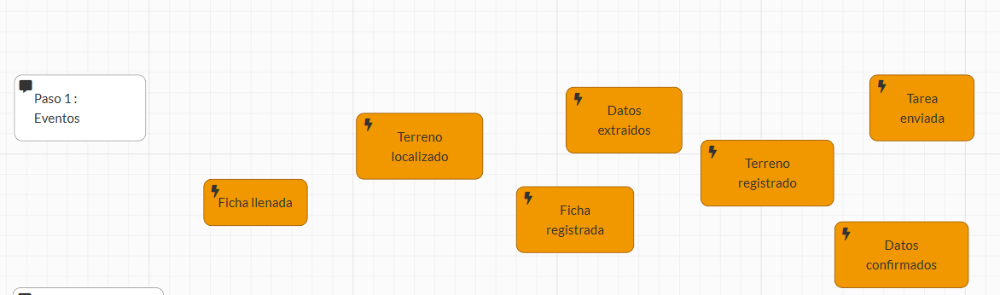

Posteriormente esos eventos se ordenaron secuencialmente de izquierda a derecha.
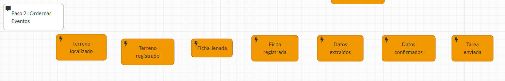

Como siguiente paso se procedió a identificar los comandos que desencadenan los eventos identificados. En nuestro caso, solo un evento era desencadenado por otro, luego todos eran desencadenados por comandos.
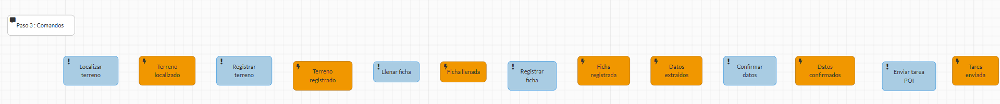

Continuando con los pasos, identificamos los roles asociados a los comandos, es decir, sus ejecutantes. En este paso aparecieron, obviamente, el agente de campo y los asesores de Gerencia General. También apareció el sistema como un rol, ya que es el que ejecuta algunos comandos dentro del flujo.
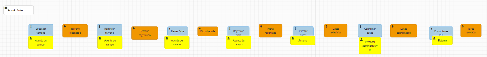

En consecuencia, habiendo identificado los roles, identificamos las politicas del dominio. En este caso, siendo la coherencia que existe entre un terreno y su dueño, y el beneficiario al que se le hace seguimiento.
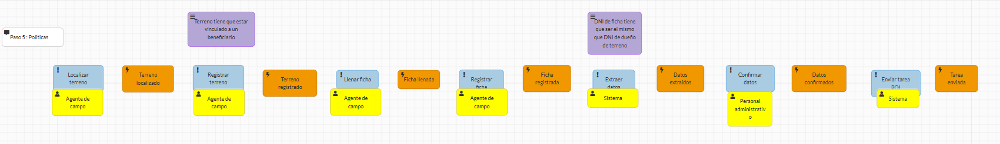

Luego, identificamos los sistemas externos con los cuales se comunica SGT, en este caso siendo el sistema de beneficiarios (sistema que permitirá conocer la información de los beneficiarios de la entidad), sistema POI (sistema al cual se hara un envío de información por cada ficha validada) y el modelo de IA (que se representa como un sistema externo debido a su naturaleza).
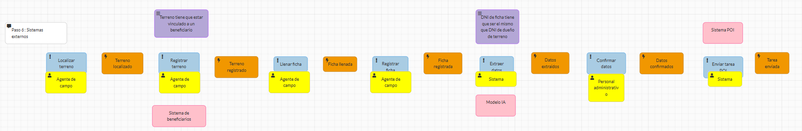

Habiendo identificado ello, analizamos y detallamos las vistas que influirian en el sistema. En este paso ya detallamos el uso de la web y la aplicación móvil.
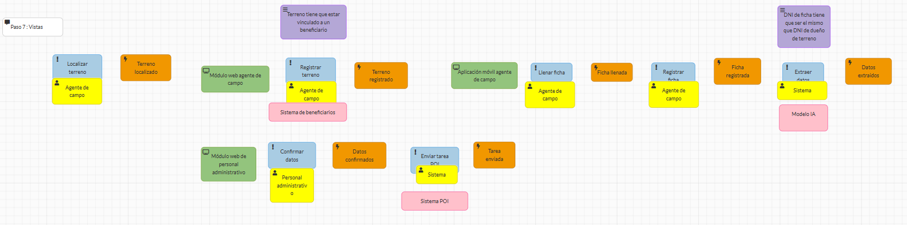

Como uno de los últimos pasos, identificamos los agregados en base a lo planteado hasta el momento. En este caso, Terreno y Ficha vendrían a ser los agregados del dominio.
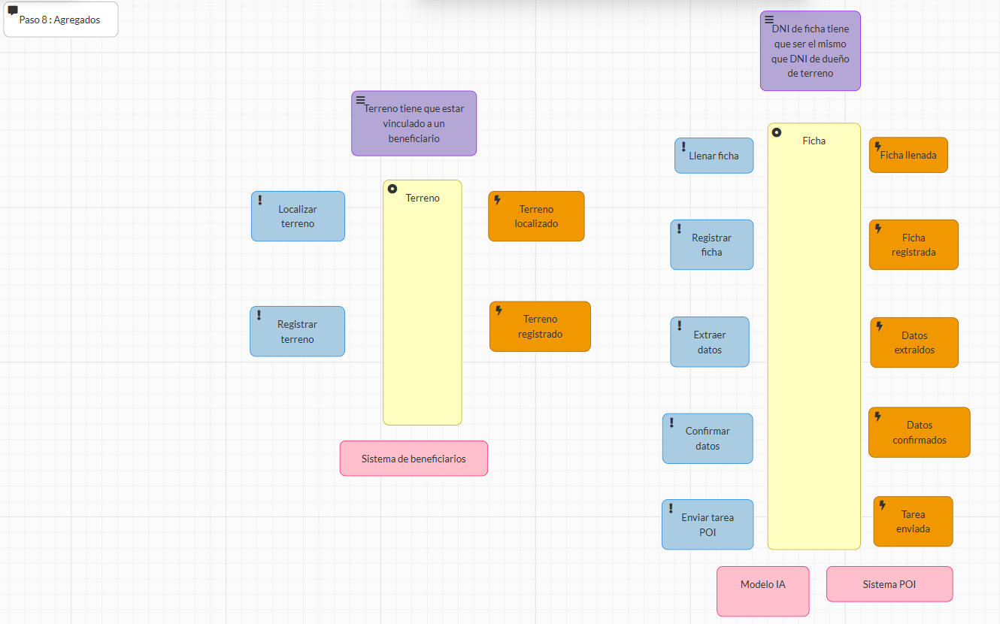

Para concluir el proceso de EventStorming, identificamos los contextos vinculados al planteo del equipo. En primer lugar, y más importantes (ya que serán los que vamos a desarrollar nosotros) se encuentran el contexto de SGT y el contexto de IA. Mientras que los contextos de Beneficiarios y POI representan contextos con los cuales SGT se va a comunicar, más no se mapea a detalle esos contextos, ya que no estan dentro del alcance.
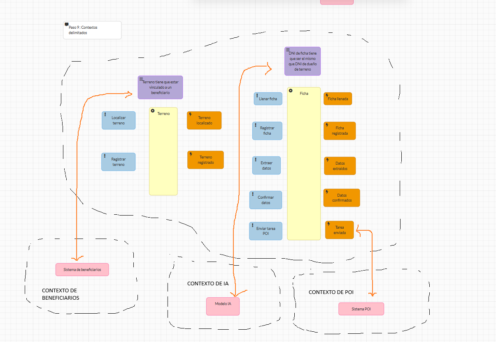

### Candidate Context Discovery

Como parte del proceso de EventStorming, paralelamente se fueron barajando los posibles contextos a desarrollar. Debido a la naturaleza del SGT y su alcance acotado, los contextos candidatos se determinaron rápidamente: SGT como contexto central, Beneficiarios y POI como sistemas con los que se integra, e IA como apoyo a la revisión de las fichas.

Al pasar al diseño táctico, los contextos se refinaron en los siguientes, que son los que implementa la solución:

<table style="width: 100%; border-collapse: collapse; border: 1px solid #333; font-family: Arial, sans-serif; font-size: 14px;">
    <thead>
        <tr>
            <th style="border: 1px solid #333; padding: 8px 10px; text-align: left; width: 22%;">Contexto</th>
            <th style="border: 1px solid #333; padding: 8px 10px; text-align: left; width: 50%;">Responsabilidad</th>
            <th style="border: 1px solid #333; padding: 8px 10px; text-align: left; width: 28%;">Implementación</th>
        </tr>
    </thead>
    <tbody>
        <tr>
            <td style="border: 1px solid #333; padding: 10px; vertical-align: top;">Monitoring</td>
            <td style="border: 1px solid #333; padding: 10px; vertical-align: top;">Envío, entrega y revisión de las fichas de evaluación.</td>
            <td style="border: 1px solid #333; padding: 10px; vertical-align: top;">Módulo del servicio sgt</td>
        </tr>
        <tr>
            <td style="border: 1px solid #333; padding: 10px; vertical-align: top;">Plots</td>
            <td style="border: 1px solid #333; padding: 10px; vertical-align: top;">Registro de los terrenos de los beneficiarios.</td>
            <td style="border: 1px solid #333; padding: 10px; vertical-align: top;">Módulo del servicio sgt</td>
        </tr>
        <tr>
            <td style="border: 1px solid #333; padding: 10px; vertical-align: top;">People</td>
            <td style="border: 1px solid #333; padding: 10px; vertical-align: top;">Resolución de beneficiarios y personal desde los sistemas que los administran.</td>
            <td style="border: 1px solid #333; padding: 10px; vertical-align: top;">Módulo del servicio sgt</td>
        </tr>
        <tr>
            <td style="border: 1px solid #333; padding: 10px; vertical-align: top;">Planning</td>
            <td style="border: 1px solid #333; padding: 10px; vertical-align: top;">Planes, objetivos, actividades y tareas del POI, y el registro de sus entregas.</td>
            <td style="border: 1px solid #333; padding: 10px; vertical-align: top;">Servicio poi</td>
        </tr>
        <tr>
            <td style="border: 1px solid #333; padding: 10px; vertical-align: top;">Directory</td>
            <td style="border: 1px solid #333; padding: 10px; vertical-align: top;">Directorio del personal de la organización.</td>
            <td style="border: 1px solid #333; padding: 10px; vertical-align: top;">Módulo del servicio staff</td>
        </tr>
        <tr>
            <td style="border: 1px solid #333; padding: 10px; vertical-align: top;">Identity Provider</td>
            <td style="border: 1px solid #333; padding: 10px; vertical-align: top;">Autenticación de personas y servicios, y emisión de tokens.</td>
            <td style="border: 1px solid #333; padding: 10px; vertical-align: top;">Módulo del servicio staff</td>
        </tr>
        <tr>
            <td style="border: 1px solid #333; padding: 10px; vertical-align: top;">Beneficiarios</td>
            <td style="border: 1px solid #333; padding: 10px; vertical-align: top;">Registro institucional de beneficiarios.</td>
            <td style="border: 1px solid #333; padding: 10px; vertical-align: top;">Servicio beneficiarios</td>
        </tr>
        <tr>
            <td style="border: 1px solid #333; padding: 10px; vertical-align: top;">IA</td>
            <td style="border: 1px solid #333; padding: 10px; vertical-align: top;">Extracción automática de los campos de la ficha.</td>
            <td style="border: 1px solid #333; padding: 10px; vertical-align: top;">Planificado (DRV-04)</td>
        </tr>
    </tbody>
</table>

El contexto SGT se divide en tres módulos de un monolito modular, porque fichas, terrenos y personas cambian por razones distintas pero comparten despliegue y base de datos. Staff reúne el directorio y el proveedor de identidad que usan todos los servicios para autenticar a las personas según su rol (EP-05).

### Domain Message Flows Modeling

Para ejemplificar como cada contexto se vincula y comunica uno con otro detallamos los 3 flujos más representativos de SGT.

En primer lugar, mapeamos el flujo con el que el agente de campo registra un terreno desde la aplicación móvil. El agente envía el documento legal del beneficiario, el ubigeo del distrito y los vértices del perímetro medidos por la estación total, con su zona UTM. El módulo Plots verifica que el beneficiario no tenga otro terreno registrado y que el perímetro no se superponga con los terrenos vecinos más allá de la tolerancia, y solo entonces registra el terreno.

En segundo lugar, se mapeó el flujo de mandar la ficha. El agente de campo pide a SGT un enlace firmado, sube con él el PDF de la ficha al almacén de objetos y envía la ficha indicando la tarea del POI a la que corresponde. El módulo Monitoring verifica que el PDF esté subido, asigna a la ficha su código y, una vez confirmado el envío, registra la entrega en el contexto Planning de POI. Si POI acepta la entrega, la ficha queda lista para revisión; si la rechaza porque la tarea no existe o ya tiene una entrega, la ficha se anula. Con el contexto de IA, la ficha enviada pasará además por la extracción automática de sus campos antes de la revisión.

Finalmente, se mapeó el flujo de validar una ficha, en el cual intervienen los asistentes de Gerencia General a través de la web. El asistente descarga el PDF y lo contrasta con la tarea; si la evidencia corresponde a otra tarea, reasigna la ficha y POI mueve la entrega o la intercambia con la de esa tarea. Al aprobar la ficha, el asistente confirma el beneficiario, los insumos y las fechas que figuran en el documento, y SGT completa la tarea en POI para que cuente en el avance de su actividad. Al rechazarla, SGT reabre la tarea en POI para que reciba una nueva entrega.

### Bounded Context Canvases

Como parte del análisis de los contextos identificados se desarrolló su canvas respectivo.

En primer lugar se analizó el contexto SGT. Este contexto es el CORE del sistema e interactúa directamente con las aplicaciones web y móvil, proporcionando los endpoints de terrenos y fichas. Internamente se divide en los módulos Monitoring, Plots y People, y se comunica con los contextos de Beneficiarios, POI, Staff y el modelo de IA.

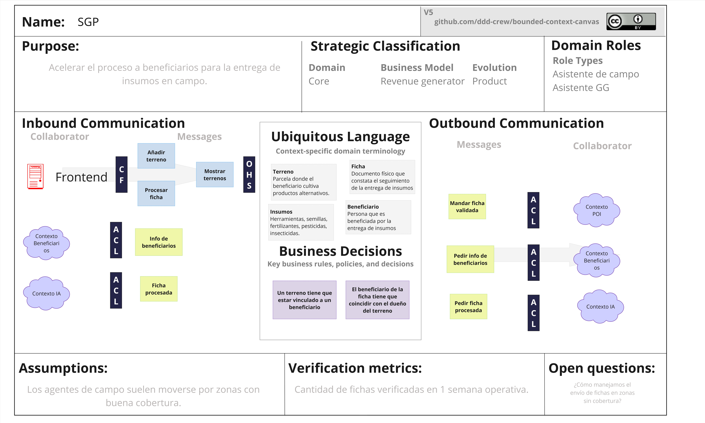

Luego se analizó el contexto de Beneficiarios, que representa el registro institucional de beneficiarios. Su único propósito dentro del sistema es proporcionar la información de los beneficiarios a partir de su documento legal. Se comunica con el contexto SGT.

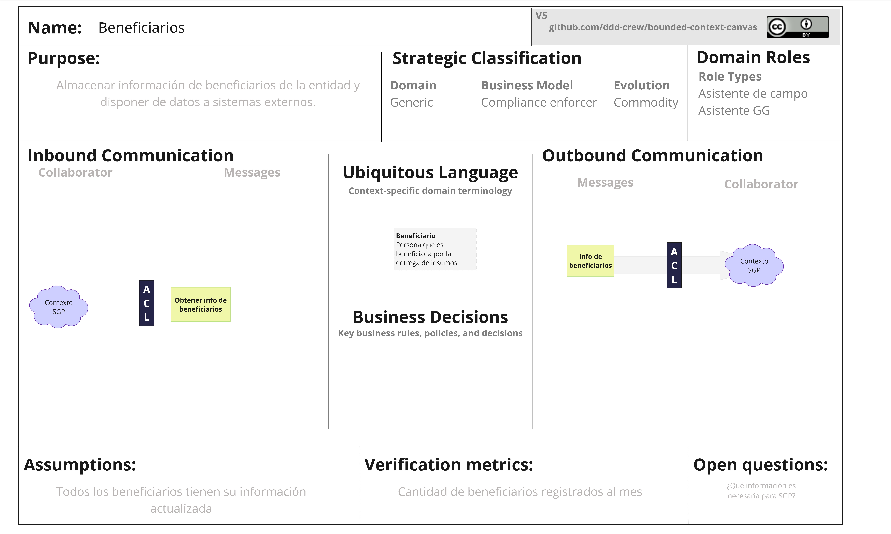

A su vez se analizó el contexto de POI. Mantiene los planes, objetivos, actividades y tareas del Plan Operativo Institucional, y registra la entrega de cada tarea y su revisión. Recibe de SGT las entregas de las fichas enviadas y el resultado de su revisión por los asistentes de Gerencia General.

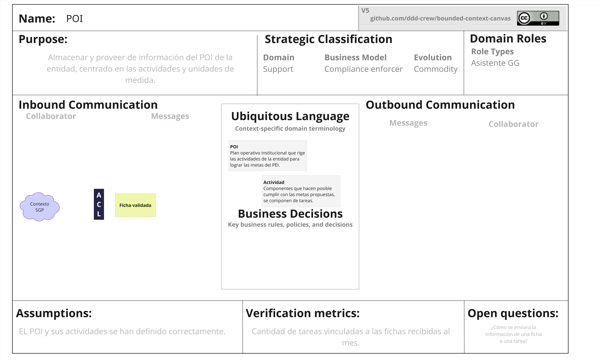

El contexto de Staff reúne el directorio del personal y el proveedor de identidad de la organización. Autentica a las personas que usan las aplicaciones, decide qué roles tienen en cada API según los grupos del directorio a los que pertenecen, y emite los tokens de servicio con los que SGT llama a los demás contextos.

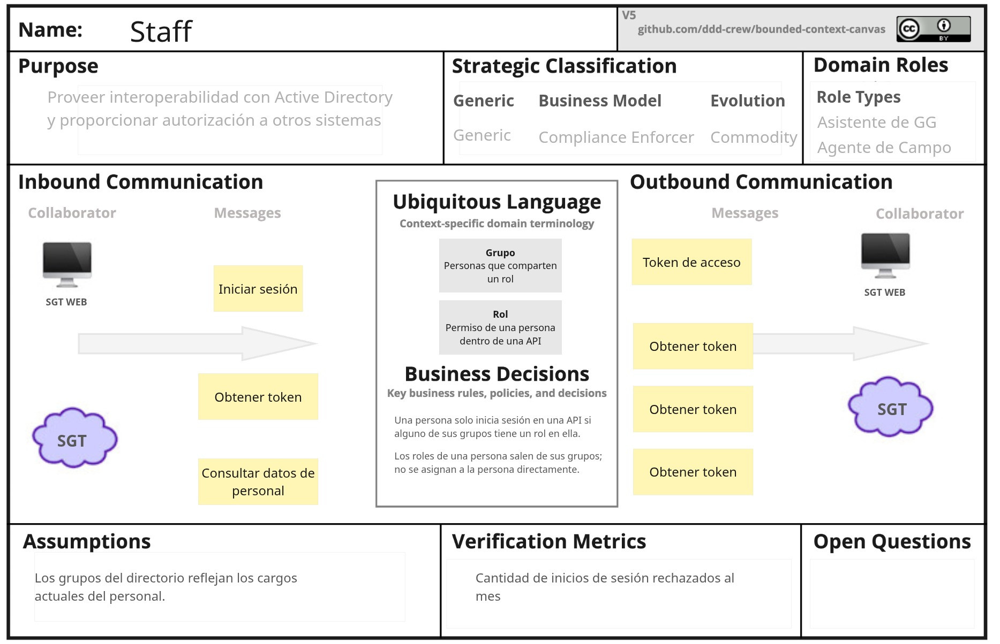

Finalmente, el contexto de IA es una mejora planificada al proceso actual. Es meramente tecnológico y busca reducir la carga operativa de Gerencia General. Tiene como propósito analizar las fichas, extraer su información relevante y permitir su validación con Gerencia General.

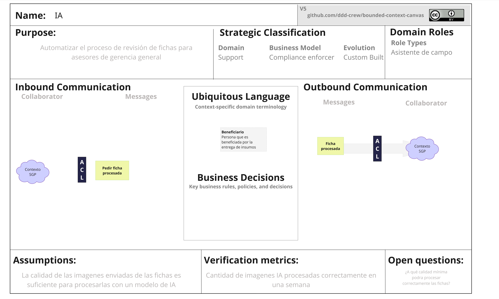

### Context Mapping

Habiendo mapeado los contextos involucrados en SGT, se definió su comunicación.

La relación de Monitoring con Planning sigue el patrón Customer/Supplier, con Monitoring como Customer. Planning expone su API de tareas como Open Host Service, y Monitoring la consume a través de la interfaz de dominio TaskLedger, que actúa como Anticorruption Layer: el modelo de la ficha solo conoce las entregas y sus respuestas. SGT envía información a POI en cada paso de la ficha: registra la entrega, la completa, la reabre o la reasigna.

La relación de People con Beneficiarios y con Directory es también Customer/Supplier. Ambos exponen un endpoint de búsqueda por lotes (OHS), y People rescata lo estrictamente necesario mediante un ACL, para entregarlo a los demás módulos de SGT como su lenguaje publicado. Monitoring y Plots se refieren a las personas solo por las identidades de ese lenguaje publicado.

Identity Provider expone los protocolos OAuth 2.1 y OpenID Connect como Open Host Service y su formato de token como Published Language. SGT, POI y Beneficiarios se conforman a ese lenguaje (Conformist): validan los tokens con la clave que publica Identity Provider y leen de ellos el sujeto, los roles o los scopes. Identity Provider, a su vez, consulta a Directory para autenticar a las personas y conocer sus grupos.

Finalmente, la comunicación entre SGT y el contexto de IA, planificada, será a través de un endpoint (OHS): el modelo de IA recibe el documento, extrae los datos y los manda en un formato que SGT ya conoce. Por tanto, SGT no necesita modificar lo que llega al contexto (CNF).

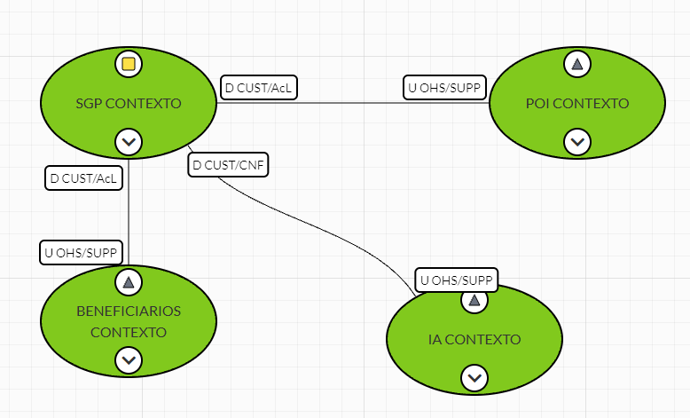

## Software Architecture

### Software Architecture System Landscape Diagram

Representa el panorama global de la solución con respecto a los usuarios y la organización que lo utiliza. En esta vista se identifican el agente de campo y el asistente de Gerencia General, y los sistemas de la institución con los que trabajan: SGT, POI, Staff y Beneficiarios, además del modelo de IA planificado.

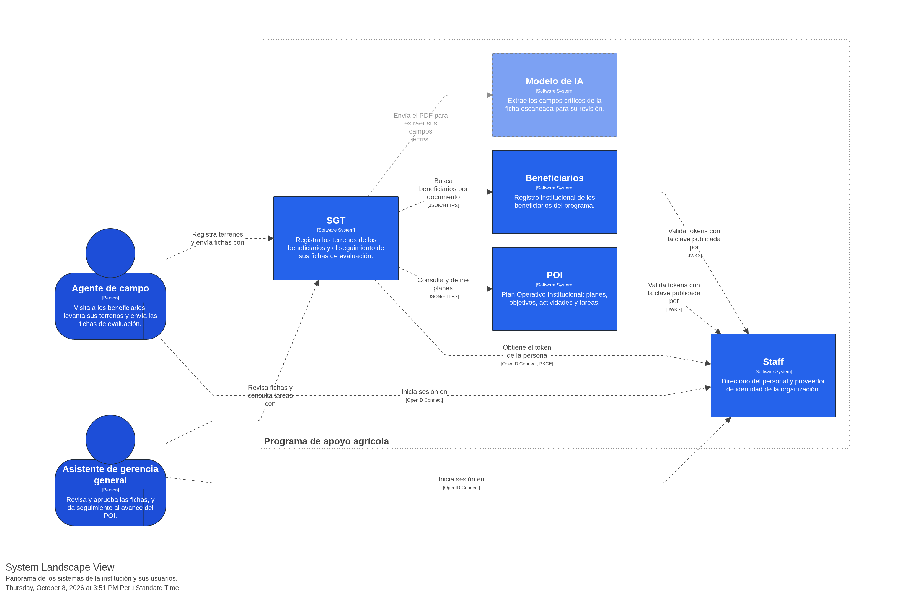

### Software Architecture Context Level Diagrams

Este diagrama representa la situación a gran escala de la arquitectura de la solución planteada. En este caso, tenemos el sistema SGT en el centro del diagrama: lo utilizan ambos usuarios, que inician sesión a través de Staff, y se comunica con los sistemas de POI, Beneficiarios y Staff, y con el modelo de IA planificado. Además, el diagrama muestra la infraestructura institucional que comparten los sistemas: el File Server, donde SGT guarda los PDF escaneados de las fichas, y la Base de Datos Institucional, un único motor con un esquema lógico aislado por servicio.

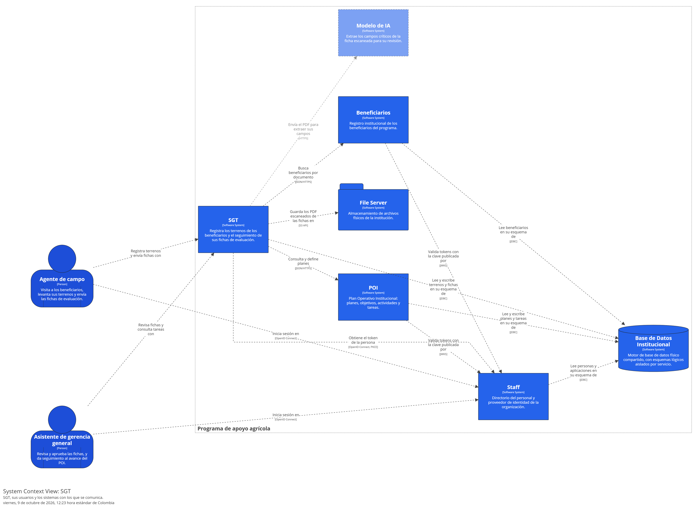

### Software Architecture Container Level Diagrams

Ahondamos al diagrama de contenedores. Dentro del sistema SGT contamos con dos interfaces, la aplicación móvil y la aplicación web, que obtienen el token de la persona de Staff y se comunican con la API de SGT, que contiene la lógica de negocio de terrenos y fichas. La aplicación web también consulta los planes y tareas directamente en la API de POI.

Los PDF de las fichas se guardan en un almacén de objetos compatible con S3: las aplicaciones los suben y descargan directamente con enlaces firmados que emite la API de SGT, de modo que los archivos no pasan por la API. La API de SGT guarda terrenos y fichas en su propia base de datos PostgreSQL con PostGIS, y se comunica por REST con POI, Beneficiarios y el directorio de Staff usando tokens de servicio que obtiene de Staff. Cada servicio tiene su propia base de datos.

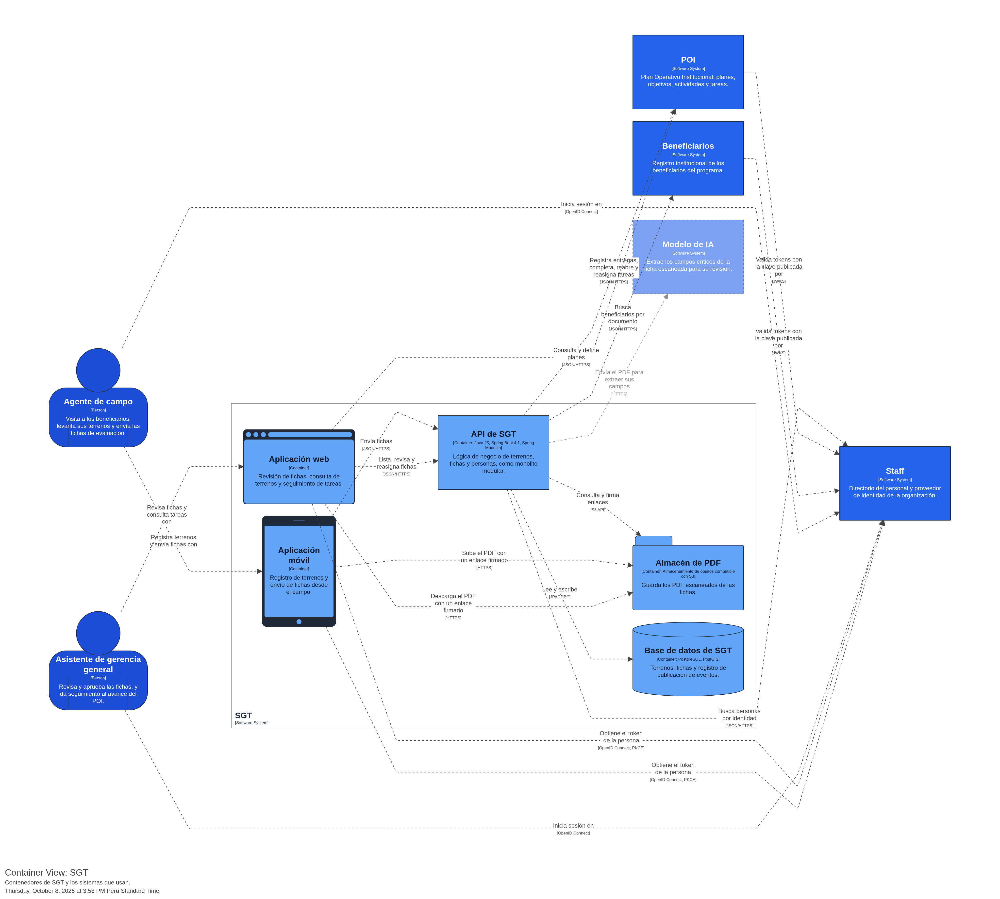

### Software Architecture Deployment Diagrams

Finalmente, el diagrama de despliegue contempla la infraestructura on-premise de la institución, en línea con la decisión de DRV-02. Cada API se despliega como una aplicación Spring Boot ejecutable, con su Tomcat embebido, en el servidor de aplicaciones, detrás de Nginx como proxy inverso y balanceador de carga; la API de SGT puede ejecutarse en varias instancias. Las bases de datos de cada servicio residen en PostgreSQL en el servidor de base de datos, con PgBouncer agrupando las conexiones de las instancias. Los PDF se guardan en el almacenamiento de objetos del servidor de archivos, y la aplicación web se sirve como archivos estáticos.

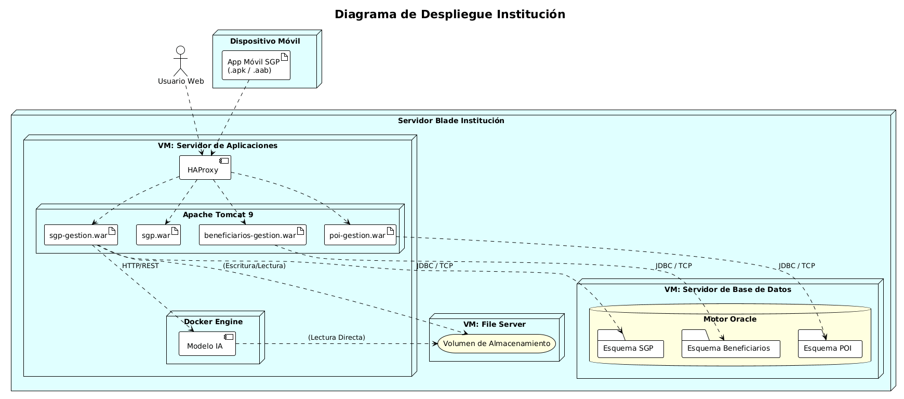

# Capítulo V: Tactical-Level Software Design

## Bounded Context: Monitoring

Monitoring es el módulo de sgt que sigue a cada beneficiario a través de las fichas de evaluación que el agente de campo entrega al terminar una visita. Una ficha llega como un PDF escaneado y queda asociada a una tarea del POI; el asistente de gerencia general la revisa y la aprueba o la rechaza. Cada paso de la ficha se refleja en poi: la entrega de la ficha ocupa la tarea, la aprobación la completa y el rechazo la devuelve a la lista de pendientes.

El módulo depende de dos contextos más. De People toma las identidades de las personas que intervienen (el documento legal del beneficiario, el agente de campo y el asistente de gerencia general). De Planning, en poi, consume el registro de tareas a través de una interfaz de dominio, de modo que el modelo de la ficha nunca conoce el protocolo con el que se habla con poi.

<h3 id="monitoring-domain-layer">Domain Layer</h3>

El núcleo del módulo es el agregado FieldSheet. Guarda la evidencia de la visita, que no cambia una vez enviada, y registra quién la envió, qué respondió poi a su entrega y, cuando se revisa, quién la revisó, cuándo y con qué resultado. Lo que el PDF dice (el beneficiario, los insumos usados y las fechas) solo se almacena al aprobar la ficha, porque es el revisor quien lo confirma.

Además de su identidad técnica, cada ficha recibe al enviarse un código de negocio con el formato FI-0032-2026: su número entre las fichas enviadas en el año y ese año. La numeración vuelve a empezar en 1 cada año y llega hasta 9999. El agregado calcula el código a partir de la última ficha enviada en el mismo año, que recibe como parámetro.

El ciclo de vida avanza en un solo sentido. Una ficha se envía (SUBMITTED); si poi acepta la entrega pasa a DELIVERED, y si la rechaza porque la tarea no existe o ya tiene una entrega queda anulada (VOIDED). Solo una ficha entregada se aprueba (APPROVED) o se rechaza (REJECTED), y una ficha rechazada no se reabre: una evaluación corregida se envía como una ficha nueva.

<table style="width: 100%; border-collapse: collapse; border: 1px solid #333; font-family: Arial, sans-serif; font-size: 12px; table-layout: fixed; overflow-wrap: anywhere; word-break: break-word;">
    <thead>
        <tr>
            <th style="border: 1px solid #333; padding: 6px 8px; text-align: left; width: 21%;">Clase</th>
            <th style="border: 1px solid #333; padding: 6px 8px; text-align: left; width: 13%;">Categoría</th>
            <th style="border: 1px solid #333; padding: 6px 8px; text-align: left; width: 16%;">Propósito</th>
            <th style="border: 1px solid #333; padding: 6px 8px; text-align: left; width: 25%;">Atributos</th>
            <th style="border: 1px solid #333; padding: 6px 8px; text-align: left; width: 25%;">Métodos</th>
        </tr>
    </thead>
    <tbody>
        <tr>
            <td style="border: 1px solid #333; padding: 6px 8px; vertical-align: top;">FieldSheet</td>
            <td style="border: 1px solid #333; padding: 6px 8px; vertical-align: top;">Aggregate Root</td>
            <td style="border: 1px solid #333; padding: 6px 8px; vertical-align: top;">Representa la evaluación de un beneficiario enviada por un agente de campo y la revisión que recibe.</td>
            <td style="border: 1px solid #333; padding: 6px 8px; vertical-align: top;">- id: FieldSheetId - code: FieldSheetCode - taskCode: TaskCode - status: FieldSheetStatus - beneficiaryLegalDocument: BeneficiaryLegalDocument - usedSupplies: List&lt;Supply&gt; - evaluationDate: EvaluationDate - securementDate: SecurementDate - scan: FieldSheetScan - submittedBy: FieldAgentId - submissionDate: SubmissionDate - reviewedBy: GeneralManagementAssistantId - reviewDate: ReviewDate</td>
            <td style="border: 1px solid #333; padding: 6px 8px; vertical-align: top;">+ submit(id, taskCode, scan, submittedBy, submissionDate, lastOfYear): FieldSheet + reconstitute(...): FieldSheet + approve(reviewer, reviewDate, beneficiaryLegalDocument, usedSupplies, evaluationDate, securementDate): void + reject(reviewer, reviewDate): void + recordDeliveryAccepted(): void + recordDeliveryRefused(): void + relinkTo(taskCode): void</td>
        </tr>
        <tr>
            <td style="border: 1px solid #333; padding: 6px 8px; vertical-align: top;">FieldSheetId</td>
            <td style="border: 1px solid #333; padding: 6px 8px; vertical-align: top;">Aggregate Id</td>
            <td style="border: 1px solid #333; padding: 6px 8px; vertical-align: top;">Identifica una ficha; forma parte del lenguaje publicado del módulo.</td>
            <td style="border: 1px solid #333; padding: 6px 8px; vertical-align: top;">+ value: UUID</td>
            <td style="border: 1px solid #333; padding: 6px 8px; vertical-align: top;">Ninguno</td>
        </tr>
        <tr>
            <td style="border: 1px solid #333; padding: 6px 8px; vertical-align: top;">FieldSheetSubmitted</td>
            <td style="border: 1px solid #333; padding: 6px 8px; vertical-align: top;">Domain Event</td>
            <td style="border: 1px solid #333; padding: 6px 8px; vertical-align: top;">Anuncia que se envió una ficha y que su entrega debe llegar a poi.</td>
            <td style="border: 1px solid #333; padding: 6px 8px; vertical-align: top;">+ fieldSheetId: FieldSheetId + occurredOn: Instant</td>
            <td style="border: 1px solid #333; padding: 6px 8px; vertical-align: top;">Ninguno</td>
        </tr>
        <tr>
            <td style="border: 1px solid #333; padding: 6px 8px; vertical-align: top;">FieldSheetApproved</td>
            <td style="border: 1px solid #333; padding: 6px 8px; vertical-align: top;">Domain Event</td>
            <td style="border: 1px solid #333; padding: 6px 8px; vertical-align: top;">Anuncia que se aprobó una ficha; forma parte del lenguaje publicado del módulo.</td>
            <td style="border: 1px solid #333; padding: 6px 8px; vertical-align: top;">+ fieldSheetId: FieldSheetId + occurredOn: Instant</td>
            <td style="border: 1px solid #333; padding: 6px 8px; vertical-align: top;">Ninguno</td>
        </tr>
        <tr>
            <td style="border: 1px solid #333; padding: 6px 8px; vertical-align: top;">FieldSheetRejected</td>
            <td style="border: 1px solid #333; padding: 6px 8px; vertical-align: top;">Domain Event</td>
            <td style="border: 1px solid #333; padding: 6px 8px; vertical-align: top;">Anuncia que se rechazó una ficha y que su tarea necesita una nueva entrega.</td>
            <td style="border: 1px solid #333; padding: 6px 8px; vertical-align: top;">+ fieldSheetId: FieldSheetId + occurredOn: Instant</td>
            <td style="border: 1px solid #333; padding: 6px 8px; vertical-align: top;">Ninguno</td>
        </tr>
        <tr>
            <td style="border: 1px solid #333; padding: 6px 8px; vertical-align: top;">FieldSheetCode</td>
            <td style="border: 1px solid #333; padding: 6px 8px; vertical-align: top;">Value Object</td>
            <td style="border: 1px solid #333; padding: 6px 8px; vertical-align: top;">Identidad de negocio de la ficha: su número en el año y el año, con el formato FI-0032-2026.</td>
            <td style="border: 1px solid #333; padding: 6px 8px; vertical-align: top;">+ number: int + year: SubmissionYear</td>
            <td style="border: 1px solid #333; padding: 6px 8px; vertical-align: top;">+ first(year): FieldSheetCode + parse(text): FieldSheetCode + next(): FieldSheetCode + value(): String</td>
        </tr>
        <tr>
            <td style="border: 1px solid #333; padding: 6px 8px; vertical-align: top;">SubmissionYear</td>
            <td style="border: 1px solid #333; padding: 6px 8px; vertical-align: top;">Value Object</td>
            <td style="border: 1px solid #333; padding: 6px 8px; vertical-align: top;">Año de envío de la ficha, dentro del cual se numera su código.</td>
            <td style="border: 1px solid #333; padding: 6px 8px; vertical-align: top;">+ value: int</td>
            <td style="border: 1px solid #333; padding: 6px 8px; vertical-align: top;">+ of(submissionDate): SubmissionYear</td>
        </tr>
        <tr>
            <td style="border: 1px solid #333; padding: 6px 8px; vertical-align: top;">TaskCode</td>
            <td style="border: 1px solid #333; padding: 6px 8px; vertical-align: top;">Value Object</td>
            <td style="border: 1px solid #333; padding: 6px 8px; vertical-align: top;">Código de la tarea del POI a la que corresponde la ficha, con el formato 2025-2030-01-03-0032.</td>
            <td style="border: 1px solid #333; padding: 6px 8px; vertical-align: top;">+ value: String</td>
            <td style="border: 1px solid #333; padding: 6px 8px; vertical-align: top;">Ninguno</td>
        </tr>
        <tr>
            <td style="border: 1px solid #333; padding: 6px 8px; vertical-align: top;">FieldSheetScan</td>
            <td style="border: 1px solid #333; padding: 6px 8px; vertical-align: top;">Value Object</td>
            <td style="border: 1px solid #333; padding: 6px 8px; vertical-align: top;">PDF escaneado que sirve de evidencia, tal como lo guarda el almacén de objetos.</td>
            <td style="border: 1px solid #333; padding: 6px 8px; vertical-align: top;">+ key: ScanKey + sizeInBytes: long</td>
            <td style="border: 1px solid #333; padding: 6px 8px; vertical-align: top;">Ninguno</td>
        </tr>
        <tr>
            <td style="border: 1px solid #333; padding: 6px 8px; vertical-align: top;">ScanKey</td>
            <td style="border: 1px solid #333; padding: 6px 8px; vertical-align: top;">Value Object</td>
            <td style="border: 1px solid #333; padding: 6px 8px; vertical-align: top;">Ubicación del PDF en el almacén de objetos.</td>
            <td style="border: 1px solid #333; padding: 6px 8px; vertical-align: top;">+ value: String</td>
            <td style="border: 1px solid #333; padding: 6px 8px; vertical-align: top;">Ninguno</td>
        </tr>
        <tr>
            <td style="border: 1px solid #333; padding: 6px 8px; vertical-align: top;">FieldSheetStatus</td>
            <td style="border: 1px solid #333; padding: 6px 8px; vertical-align: top;">Value Object (enum)</td>
            <td style="border: 1px solid #333; padding: 6px 8px; vertical-align: top;">Etapa de la revisión en la que se encuentra la ficha.</td>
            <td style="border: 1px solid #333; padding: 6px 8px; vertical-align: top;">SUBMITTED DELIVERED APPROVED REJECTED VOIDED</td>
            <td style="border: 1px solid #333; padding: 6px 8px; vertical-align: top;">Ninguno</td>
        </tr>
        <tr>
            <td style="border: 1px solid #333; padding: 6px 8px; vertical-align: top;">Supply</td>
            <td style="border: 1px solid #333; padding: 6px 8px; vertical-align: top;">Value Object</td>
            <td style="border: 1px solid #333; padding: 6px 8px; vertical-align: top;">Insumo agrícola usado por el beneficiario y su cantidad.</td>
            <td style="border: 1px solid #333; padding: 6px 8px; vertical-align: top;">+ name: SupplyName + quantity: Quantity</td>
            <td style="border: 1px solid #333; padding: 6px 8px; vertical-align: top;">Ninguno</td>
        </tr>
        <tr>
            <td style="border: 1px solid #333; padding: 6px 8px; vertical-align: top;">SupplyName</td>
            <td style="border: 1px solid #333; padding: 6px 8px; vertical-align: top;">Value Object</td>
            <td style="border: 1px solid #333; padding: 6px 8px; vertical-align: top;">Nombre del insumo según lo denomina el programa.</td>
            <td style="border: 1px solid #333; padding: 6px 8px; vertical-align: top;">+ value: String</td>
            <td style="border: 1px solid #333; padding: 6px 8px; vertical-align: top;">Ninguno</td>
        </tr>
        <tr>
            <td style="border: 1px solid #333; padding: 6px 8px; vertical-align: top;">Quantity</td>
            <td style="border: 1px solid #333; padding: 6px 8px; vertical-align: top;">Value Object</td>
            <td style="border: 1px solid #333; padding: 6px 8px; vertical-align: top;">Cantidad no negativa de un insumo y su unidad.</td>
            <td style="border: 1px solid #333; padding: 6px 8px; vertical-align: top;">+ value: BigDecimal + unit: MeasurementUnit</td>
            <td style="border: 1px solid #333; padding: 6px 8px; vertical-align: top;">Ninguno</td>
        </tr>
        <tr>
            <td style="border: 1px solid #333; padding: 6px 8px; vertical-align: top;">MeasurementUnit</td>
            <td style="border: 1px solid #333; padding: 6px 8px; vertical-align: top;">Value Object (enum)</td>
            <td style="border: 1px solid #333; padding: 6px 8px; vertical-align: top;">Unidad en la que se expresa una cantidad.</td>
            <td style="border: 1px solid #333; padding: 6px 8px; vertical-align: top;">KILOGRAM LITER UNIT</td>
            <td style="border: 1px solid #333; padding: 6px 8px; vertical-align: top;">Ninguno</td>
        </tr>
        <tr>
            <td style="border: 1px solid #333; padding: 6px 8px; vertical-align: top;">SubmissionDate</td>
            <td style="border: 1px solid #333; padding: 6px 8px; vertical-align: top;">Value Object</td>
            <td style="border: 1px solid #333; padding: 6px 8px; vertical-align: top;">Momento en que el agente de campo envió la ficha.</td>
            <td style="border: 1px solid #333; padding: 6px 8px; vertical-align: top;">+ value: LocalDateTime</td>
            <td style="border: 1px solid #333; padding: 6px 8px; vertical-align: top;">Ninguno</td>
        </tr>
        <tr>
            <td style="border: 1px solid #333; padding: 6px 8px; vertical-align: top;">EvaluationDate</td>
            <td style="border: 1px solid #333; padding: 6px 8px; vertical-align: top;">Value Object</td>
            <td style="border: 1px solid #333; padding: 6px 8px; vertical-align: top;">Momento en que el agente de campo realizó la evaluación.</td>
            <td style="border: 1px solid #333; padding: 6px 8px; vertical-align: top;">+ value: LocalDateTime</td>
            <td style="border: 1px solid #333; padding: 6px 8px; vertical-align: top;">Ninguno</td>
        </tr>
        <tr>
            <td style="border: 1px solid #333; padding: 6px 8px; vertical-align: top;">SecurementDate</td>
            <td style="border: 1px solid #333; padding: 6px 8px; vertical-align: top;">Value Object</td>
            <td style="border: 1px solid #333; padding: 6px 8px; vertical-align: top;">Momento de aseguramiento que consigna la ficha.</td>
            <td style="border: 1px solid #333; padding: 6px 8px; vertical-align: top;">+ value: LocalDateTime</td>
            <td style="border: 1px solid #333; padding: 6px 8px; vertical-align: top;">Ninguno</td>
        </tr>
        <tr>
            <td style="border: 1px solid #333; padding: 6px 8px; vertical-align: top;">ReviewDate</td>
            <td style="border: 1px solid #333; padding: 6px 8px; vertical-align: top;">Value Object</td>
            <td style="border: 1px solid #333; padding: 6px 8px; vertical-align: top;">Momento en que el asistente de gerencia general revisó la ficha.</td>
            <td style="border: 1px solid #333; padding: 6px 8px; vertical-align: top;">+ value: LocalDateTime</td>
            <td style="border: 1px solid #333; padding: 6px 8px; vertical-align: top;">Ninguno</td>
        </tr>
        <tr>
            <td style="border: 1px solid #333; padding: 6px 8px; vertical-align: top;">ExecutionDate</td>
            <td style="border: 1px solid #333; padding: 6px 8px; vertical-align: top;">Value Object</td>
            <td style="border: 1px solid #333; padding: 6px 8px; vertical-align: top;">Día en que se realizó el trabajo que la entrega reporta a poi.</td>
            <td style="border: 1px solid #333; padding: 6px 8px; vertical-align: top;">+ value: LocalDate</td>
            <td style="border: 1px solid #333; padding: 6px 8px; vertical-align: top;">Ninguno</td>
        </tr>
        <tr>
            <td style="border: 1px solid #333; padding: 6px 8px; vertical-align: top;">DeliveryOutcome</td>
            <td style="border: 1px solid #333; padding: 6px 8px; vertical-align: top;">Value Object (enum)</td>
            <td style="border: 1px solid #333; padding: 6px 8px; vertical-align: top;">Respuesta de poi a la entrega registrada para una tarea.</td>
            <td style="border: 1px solid #333; padding: 6px 8px; vertical-align: top;">ACCEPTED REFUSED</td>
            <td style="border: 1px solid #333; padding: 6px 8px; vertical-align: top;">Ninguno</td>
        </tr>
        <tr>
            <td style="border: 1px solid #333; padding: 6px 8px; vertical-align: top;">RelinkOutcome</td>
            <td style="border: 1px solid #333; padding: 6px 8px; vertical-align: top;">Value Object</td>
            <td style="border: 1px solid #333; padding: 6px 8px; vertical-align: top;">Respuesta de poi a una reasignación, con la ficha intercambiada cuando corresponde.</td>
            <td style="border: 1px solid #333; padding: 6px 8px; vertical-align: top;">+ result: RelinkResult + swappedWith: FieldSheetId</td>
            <td style="border: 1px solid #333; padding: 6px 8px; vertical-align: top;">Ninguno</td>
        </tr>
        <tr>
            <td style="border: 1px solid #333; padding: 6px 8px; vertical-align: top;">RelinkResult</td>
            <td style="border: 1px solid #333; padding: 6px 8px; vertical-align: top;">Value Object (enum)</td>
            <td style="border: 1px solid #333; padding: 6px 8px; vertical-align: top;">Acción que tomó poi con una entrega reasignada a otra tarea.</td>
            <td style="border: 1px solid #333; padding: 6px 8px; vertical-align: top;">MOVED SWAPPED REFUSED</td>
            <td style="border: 1px solid #333; padding: 6px 8px; vertical-align: top;">Ninguno</td>
        </tr>
        <tr>
            <td style="border: 1px solid #333; padding: 6px 8px; vertical-align: top;">FieldSheetRepository</td>
            <td style="border: 1px solid #333; padding: 6px 8px; vertical-align: top;">Repository</td>
            <td style="border: 1px solid #333; padding: 6px 8px; vertical-align: top;">Persiste y recupera agregados FieldSheet.</td>
            <td style="border: 1px solid #333; padding: 6px 8px; vertical-align: top;">Ninguno</td>
            <td style="border: 1px solid #333; padding: 6px 8px; vertical-align: top;">+ save(fieldSheet): FieldSheet + getById(id): FieldSheet + getAllByIds(ids): List&lt;FieldSheet&gt; + delete(fieldSheet): void + findLastSubmittedIn(year): Optional&lt;FieldSheet&gt;</td>
        </tr>
        <tr>
            <td style="border: 1px solid #333; padding: 6px 8px; vertical-align: top;">ScanStore</td>
            <td style="border: 1px solid #333; padding: 6px 8px; vertical-align: top;">Domain Service</td>
            <td style="border: 1px solid #333; padding: 6px 8px; vertical-align: top;">Consulta el almacén de objetos al que el agente de campo sube el PDF.</td>
            <td style="border: 1px solid #333; padding: 6px 8px; vertical-align: top;">Ninguno</td>
            <td style="border: 1px solid #333; padding: 6px 8px; vertical-align: top;">+ inspect(key): FieldSheetScan</td>
        </tr>
        <tr>
            <td style="border: 1px solid #333; padding: 6px 8px; vertical-align: top;">TaskLedger</td>
            <td style="border: 1px solid #333; padding: 6px 8px; vertical-align: top;">Domain Service</td>
            <td style="border: 1px solid #333; padding: 6px 8px; vertical-align: top;">Registro de poi sobre qué tareas tienen entrega y cómo se revisó cada una.</td>
            <td style="border: 1px solid #333; padding: 6px 8px; vertical-align: top;">Ninguno</td>
            <td style="border: 1px solid #333; padding: 6px 8px; vertical-align: top;">+ registerDelivery(taskCode, fieldSheetId, executionDate): DeliveryOutcome + relink(taskCode, fromTaskCode, fieldSheetId): RelinkOutcome + complete(taskCode, fieldSheetId): void + reopen(taskCode, fieldSheetId): void</td>
        </tr>
    </tbody>
</table>

FieldSheet referencia a las personas por las identidades que publica People: BeneficiaryLegalDocument para el beneficiario, FieldAgentId para quien envía la ficha y GeneralManagementAssistantId para quien la revisa. Esas clases se detallan en el contexto People.

TaskLedger y ScanStore son interfaces del dominio que la capa de infraestructura implementa. TaskLedger trata la negativa de poi como una respuesta válida, y cada operación identifica a la ficha que hizo la entrega, de modo que repetir un paso que ya llegó a poi no cambia nada.

Las reglas de negocio del módulo se protegen con las siguientes excepciones. Todas heredan de BusinessRuleViolationException, salvo FieldSheetNotFoundException, que hereda de EntityNotFoundException.

<table style="width: 100%; border-collapse: collapse; border: 1px solid #333; font-family: Arial, sans-serif; font-size: 14px; table-layout: fixed; overflow-wrap: anywhere; word-break: break-word;">
    <thead>
        <tr>
            <th style="border: 1px solid #333; padding: 8px 10px; text-align: left; width: 35%;">Excepción</th>
            <th style="border: 1px solid #333; padding: 8px 10px; text-align: left; width: 65%;">Regla de negocio que protege</th>
        </tr>
    </thead>
    <tbody>
        <tr>
            <td style="border: 1px solid #333; padding: 10px; vertical-align: top;">MissingFieldSheetCodeException</td>
            <td style="border: 1px solid #333; padding: 10px; vertical-align: top;">Toda ficha tiene código.</td>
        </tr>
        <tr>
            <td style="border: 1px solid #333; padding: 10px; vertical-align: top;">InvalidFieldSheetCodeException</td>
            <td style="border: 1px solid #333; padding: 10px; vertical-align: top;">El código de ficha tiene el formato FI-número-año, con un número de 1 a 9999.</td>
        </tr>
        <tr>
            <td style="border: 1px solid #333; padding: 10px; vertical-align: top;">InvalidSubmissionYearException</td>
            <td style="border: 1px solid #333; padding: 10px; vertical-align: top;">El año de envío tiene cuatro dígitos.</td>
        </tr>
        <tr>
            <td style="border: 1px solid #333; padding: 10px; vertical-align: top;">FieldSheetNumbersExhaustedException</td>
            <td style="border: 1px solid #333; padding: 10px; vertical-align: top;">Un año numera como máximo 9999 fichas.</td>
        </tr>
        <tr>
            <td style="border: 1px solid #333; padding: 10px; vertical-align: top;">MissingTaskCodeException</td>
            <td style="border: 1px solid #333; padding: 10px; vertical-align: top;">Toda ficha se envía para una tarea, y una reasignación siempre indica la tarea de destino.</td>
        </tr>
        <tr>
            <td style="border: 1px solid #333; padding: 10px; vertical-align: top;">InvalidTaskCodeException</td>
            <td style="border: 1px solid #333; padding: 10px; vertical-align: top;">El código de tarea sigue el formato de años del plan, objetivo, actividad y número de tarea.</td>
        </tr>
        <tr>
            <td style="border: 1px solid #333; padding: 10px; vertical-align: top;">MissingScanException</td>
            <td style="border: 1px solid #333; padding: 10px; vertical-align: top;">Toda ficha tiene un PDF escaneado como evidencia.</td>
        </tr>
        <tr>
            <td style="border: 1px solid #333; padding: 10px; vertical-align: top;">BlankScanKeyException</td>
            <td style="border: 1px solid #333; padding: 10px; vertical-align: top;">La ubicación del PDF en el almacén de objetos no está vacía.</td>
        </tr>
        <tr>
            <td style="border: 1px solid #333; padding: 10px; vertical-align: top;">EmptyScanException</td>
            <td style="border: 1px solid #333; padding: 10px; vertical-align: top;">El PDF enviado tiene contenido.</td>
        </tr>
        <tr>
            <td style="border: 1px solid #333; padding: 10px; vertical-align: top;">ScanNotUploadedException</td>
            <td style="border: 1px solid #333; padding: 10px; vertical-align: top;">El PDF existe en el almacén de objetos antes de registrar la ficha.</td>
        </tr>
        <tr>
            <td style="border: 1px solid #333; padding: 10px; vertical-align: top;">MissingSubmitterException</td>
            <td style="border: 1px solid #333; padding: 10px; vertical-align: top;">Toda ficha registra al agente de campo que la envió.</td>
        </tr>
        <tr>
            <td style="border: 1px solid #333; padding: 10px; vertical-align: top;">MissingSubmissionDateException</td>
            <td style="border: 1px solid #333; padding: 10px; vertical-align: top;">Toda ficha registra cuándo se envió.</td>
        </tr>
        <tr>
            <td style="border: 1px solid #333; padding: 10px; vertical-align: top;">MissingReviewerException</td>
            <td style="border: 1px solid #333; padding: 10px; vertical-align: top;">Toda revisión registra al asistente de gerencia general que la hizo.</td>
        </tr>
        <tr>
            <td style="border: 1px solid #333; padding: 10px; vertical-align: top;">MissingReviewDateException</td>
            <td style="border: 1px solid #333; padding: 10px; vertical-align: top;">Toda revisión registra cuándo se hizo.</td>
        </tr>
        <tr>
            <td style="border: 1px solid #333; padding: 10px; vertical-align: top;">ReviewBeforeSubmissionException</td>
            <td style="border: 1px solid #333; padding: 10px; vertical-align: top;">Una ficha no se revisa antes de su envío.</td>
        </tr>
        <tr>
            <td style="border: 1px solid #333; padding: 10px; vertical-align: top;">ReviewerIsSubmitterException</td>
            <td style="border: 1px solid #333; padding: 10px; vertical-align: top;">Nadie revisa una ficha que envió.</td>
        </tr>
        <tr>
            <td style="border: 1px solid #333; padding: 10px; vertical-align: top;">MissingBeneficiaryException</td>
            <td style="border: 1px solid #333; padding: 10px; vertical-align: top;">Una ficha aprobada identifica al beneficiario evaluado.</td>
        </tr>
        <tr>
            <td style="border: 1px solid #333; padding: 10px; vertical-align: top;">MissingEvaluationDateException</td>
            <td style="border: 1px solid #333; padding: 10px; vertical-align: top;">Una ficha aprobada indica cuándo se realizó la evaluación.</td>
        </tr>
        <tr>
            <td style="border: 1px solid #333; padding: 10px; vertical-align: top;">MissingSecurementDateException</td>
            <td style="border: 1px solid #333; padding: 10px; vertical-align: top;">Una fecha de aseguramiento, cuando se indica, tiene valor.</td>
        </tr>
        <tr>
            <td style="border: 1px solid #333; padding: 10px; vertical-align: top;">MissingExecutionDateException</td>
            <td style="border: 1px solid #333; padding: 10px; vertical-align: top;">Una entrega a poi indica el día en que se realizó el trabajo.</td>
        </tr>
        <tr>
            <td style="border: 1px solid #333; padding: 10px; vertical-align: top;">BlankSupplyNameException</td>
            <td style="border: 1px solid #333; padding: 10px; vertical-align: top;">Todo insumo tiene nombre.</td>
        </tr>
        <tr>
            <td style="border: 1px solid #333; padding: 10px; vertical-align: top;">NegativeQuantityException</td>
            <td style="border: 1px solid #333; padding: 10px; vertical-align: top;">La cantidad de un insumo no es negativa.</td>
        </tr>
        <tr>
            <td style="border: 1px solid #333; padding: 10px; vertical-align: top;">MissingMeasurementUnitException</td>
            <td style="border: 1px solid #333; padding: 10px; vertical-align: top;">Toda cantidad indica su unidad.</td>
        </tr>
        <tr>
            <td style="border: 1px solid #333; padding: 10px; vertical-align: top;">FieldSheetNotSubmittedException</td>
            <td style="border: 1px solid #333; padding: 10px; vertical-align: top;">La respuesta de poi a una entrega se registra una sola vez, sobre una ficha enviada.</td>
        </tr>
        <tr>
            <td style="border: 1px solid #333; padding: 10px; vertical-align: top;">FieldSheetNotDeliveredException</td>
            <td style="border: 1px solid #333; padding: 10px; vertical-align: top;">Solo se revisa o reasigna una ficha cuya entrega aceptó poi.</td>
        </tr>
        <tr>
            <td style="border: 1px solid #333; padding: 10px; vertical-align: top;">FieldSheetAlreadyReviewedException</td>
            <td style="border: 1px solid #333; padding: 10px; vertical-align: top;">Una ficha aprobada o rechazada no se vuelve a revisar ni se reasigna.</td>
        </tr>
        <tr>
            <td style="border: 1px solid #333; padding: 10px; vertical-align: top;">InvalidRelinkOutcomeException</td>
            <td style="border: 1px solid #333; padding: 10px; vertical-align: top;">La respuesta de poi a una reasignación nombra otra ficha solo cuando hubo intercambio.</td>
        </tr>
        <tr>
            <td style="border: 1px solid #333; padding: 10px; vertical-align: top;">RelinkRefusedException</td>
            <td style="border: 1px solid #333; padding: 10px; vertical-align: top;">Una reasignación que poi rechaza no cambia la tarea de la ficha.</td>
        </tr>
        <tr>
            <td style="border: 1px solid #333; padding: 10px; vertical-align: top;">MissingFieldSheetIdException</td>
            <td style="border: 1px solid #333; padding: 10px; vertical-align: top;">Toda ficha tiene identidad.</td>
        </tr>
        <tr>
            <td style="border: 1px solid #333; padding: 10px; vertical-align: top;">UnknownFieldSheetStatusException</td>
            <td style="border: 1px solid #333; padding: 10px; vertical-align: top;">Un filtro por estado nombra un estado que existe.</td>
        </tr>
        <tr>
            <td style="border: 1px solid #333; padding: 10px; vertical-align: top;">InvalidSubmissionDayException</td>
            <td style="border: 1px solid #333; padding: 10px; vertical-align: top;">Un día de envío para filtrar se escribe como fecha, por ejemplo 2026-10-01.</td>
        </tr>
        <tr>
            <td style="border: 1px solid #333; padding: 10px; vertical-align: top;">InvertedSubmissionRangeException</td>
            <td style="border: 1px solid #333; padding: 10px; vertical-align: top;">Un rango de días de envío no termina antes de empezar.</td>
        </tr>
        <tr>
            <td style="border: 1px solid #333; padding: 10px; vertical-align: top;">FieldSheetNotFoundException</td>
            <td style="border: 1px solid #333; padding: 10px; vertical-align: top;">Las operaciones sobre una ficha se refieren a una ficha registrada.</td>
        </tr>
    </tbody>
</table>

<h3 id="monitoring-interface-layer">Interface Layer</h3>

La capa de interfaz de Monitoring tiene dos tipos de entrada: un controlador REST que atiende a la aplicación web y a la aplicación móvil, y tres consumidores de eventos que reaccionan a los eventos del agregado FieldSheet.

Todas las solicitudes llevan el token de acceso de una persona emitido por staff. El componente compartido CallerArgumentResolver entrega a cada controlador un Caller construido con el sujeto y los roles del token, y el mapper de cada contexto exige el rol con el que se ejecuta la operación; un llamador que no actúa en ese rol recibe una respuesta 403.

<table style="width: 100%; border-collapse: collapse; border: 1px solid #333; font-family: Arial, sans-serif; font-size: 14px; table-layout: fixed; overflow-wrap: anywhere; word-break: break-word;">
    <thead>
        <tr>
            <th style="border: 1px solid #333; padding: 8px 10px; text-align: left; width: 38%;">Método y ruta</th>
            <th style="border: 1px solid #333; padding: 8px 10px; text-align: left; width: 42%;">Operación</th>
            <th style="border: 1px solid #333; padding: 8px 10px; text-align: left; width: 20%;">Rol</th>
        </tr>
    </thead>
    <tbody>
        <tr>
            <td style="border: 1px solid #333; padding: 10px; vertical-align: top;">POST /api/v1/field-sheets/scan-uploads</td>
            <td style="border: 1px solid #333; padding: 10px; vertical-align: top;">Entrega un enlace firmado para subir el PDF de una ficha nueva.</td>
            <td style="border: 1px solid #333; padding: 10px; vertical-align: top;">field-agent</td>
        </tr>
        <tr>
            <td style="border: 1px solid #333; padding: 10px; vertical-align: top;">POST /api/v1/field-sheets</td>
            <td style="border: 1px solid #333; padding: 10px; vertical-align: top;">Envía una ficha para una tarea, con el PDF ya subido.</td>
            <td style="border: 1px solid #333; padding: 10px; vertical-align: top;">field-agent</td>
        </tr>
        <tr>
            <td style="border: 1px solid #333; padding: 10px; vertical-align: top;">GET /api/v1/field-sheets</td>
            <td style="border: 1px solid #333; padding: 10px; vertical-align: top;">Lista una página de fichas con filtros y orden.</td>
            <td style="border: 1px solid #333; padding: 10px; vertical-align: top;">Cualquier rol</td>
        </tr>
        <tr>
            <td style="border: 1px solid #333; padding: 10px; vertical-align: top;">GET /api/v1/field-sheets/{fieldSheetId}</td>
            <td style="border: 1px solid #333; padding: 10px; vertical-align: top;">Devuelve el detalle de una ficha.</td>
            <td style="border: 1px solid #333; padding: 10px; vertical-align: top;">Cualquier rol</td>
        </tr>
        <tr>
            <td style="border: 1px solid #333; padding: 10px; vertical-align: top;">GET /api/v1/field-sheets/{fieldSheetId}/scan</td>
            <td style="border: 1px solid #333; padding: 10px; vertical-align: top;">Entrega un enlace firmado para descargar el PDF.</td>
            <td style="border: 1px solid #333; padding: 10px; vertical-align: top;">Cualquier rol</td>
        </tr>
        <tr>
            <td style="border: 1px solid #333; padding: 10px; vertical-align: top;">POST /api/v1/field-sheets/{fieldSheetId}/approval</td>
            <td style="border: 1px solid #333; padding: 10px; vertical-align: top;">Aprueba la ficha con los datos confirmados.</td>
            <td style="border: 1px solid #333; padding: 10px; vertical-align: top;">general-management-assistant</td>
        </tr>
        <tr>
            <td style="border: 1px solid #333; padding: 10px; vertical-align: top;">POST /api/v1/field-sheets/{fieldSheetId}/rejection</td>
            <td style="border: 1px solid #333; padding: 10px; vertical-align: top;">Rechaza la ficha.</td>
            <td style="border: 1px solid #333; padding: 10px; vertical-align: top;">general-management-assistant</td>
        </tr>
        <tr>
            <td style="border: 1px solid #333; padding: 10px; vertical-align: top;">POST /api/v1/field-sheets/{fieldSheetId}/relink</td>
            <td style="border: 1px solid #333; padding: 10px; vertical-align: top;">Reasigna la ficha a otra tarea.</td>
            <td style="border: 1px solid #333; padding: 10px; vertical-align: top;">Cualquier rol</td>
        </tr>
    </tbody>
</table>

<table style="width: 100%; border-collapse: collapse; border: 1px solid #333; font-family: Arial, sans-serif; font-size: 12px; table-layout: fixed; overflow-wrap: anywhere; word-break: break-word;">
    <thead>
        <tr>
            <th style="border: 1px solid #333; padding: 6px 8px; text-align: left; width: 21%;">Clase</th>
            <th style="border: 1px solid #333; padding: 6px 8px; text-align: left; width: 13%;">Categoría</th>
            <th style="border: 1px solid #333; padding: 6px 8px; text-align: left; width: 16%;">Propósito</th>
            <th style="border: 1px solid #333; padding: 6px 8px; text-align: left; width: 25%;">Atributos</th>
            <th style="border: 1px solid #333; padding: 6px 8px; text-align: left; width: 25%;">Métodos</th>
        </tr>
    </thead>
    <tbody>
        <tr>
            <td style="border: 1px solid #333; padding: 6px 8px; vertical-align: top;">FieldSheetController</td>
            <td style="border: 1px solid #333; padding: 6px 8px; vertical-align: top;">Controller</td>
            <td style="border: 1px solid #333; padding: 6px 8px; vertical-align: top;">Expone las operaciones de fichas como recursos REST.</td>
            <td style="border: 1px solid #333; padding: 6px 8px; vertical-align: top;">- fieldSheetCommandService: FieldSheetCommandService - fieldSheetQueryService: FieldSheetQueryService</td>
            <td style="border: 1px solid #333; padding: 6px 8px; vertical-align: top;">+ scanUpload(): ScanLinkResponse + submit(request, caller): FieldSheetResponse + page(status, code, taskCode, submittedFrom, submittedTo, sort, direction, page, size): FieldSheetsPageResponse + fieldSheet(fieldSheetId): FieldSheetResponse + scan(fieldSheetId): ScanLinkResponse + approve(fieldSheetId, request, caller): FieldSheetResponse + reject(fieldSheetId, caller): FieldSheetResponse + relink(fieldSheetId, request): FieldSheetResponse</td>
        </tr>
        <tr>
            <td style="border: 1px solid #333; padding: 6px 8px; vertical-align: top;">FieldSheetWireMapper</td>
            <td style="border: 1px solid #333; padding: 6px 8px; vertical-align: top;">Wire Mapper</td>
            <td style="border: 1px solid #333; padding: 6px 8px; vertical-align: top;">Traduce solicitudes en comandos y criterios, exige el rol del llamador y traduce resultados en respuestas.</td>
            <td style="border: 1px solid #333; padding: 6px 8px; vertical-align: top;">Ninguno</td>
            <td style="border: 1px solid #333; padding: 6px 8px; vertical-align: top;">+ toSubmitFieldSheet(request, caller): SubmitFieldSheet + toApproveFieldSheet(...): ApproveFieldSheet + toRejectFieldSheet(fieldSheetId, caller): RejectFieldSheet + toRelinkFieldSheet(fieldSheetId, request): RelinkFieldSheet + toFieldSheetsPage(...): FieldSheetsPage + toFieldSheetResponse(result): FieldSheetResponse + toFieldSheetsPageResponse(result): FieldSheetsPageResponse + toScanLinkResponse(result): ScanLinkResponse</td>
        </tr>
        <tr>
            <td style="border: 1px solid #333; padding: 6px 8px; vertical-align: top;">SubmitFieldSheetRequest</td>
            <td style="border: 1px solid #333; padding: 6px 8px; vertical-align: top;">Request</td>
            <td style="border: 1px solid #333; padding: 6px 8px; vertical-align: top;">Cuerpo del envío de una ficha.</td>
            <td style="border: 1px solid #333; padding: 6px 8px; vertical-align: top;">+ taskCode: String + scanKey: String</td>
            <td style="border: 1px solid #333; padding: 6px 8px; vertical-align: top;">Ninguno</td>
        </tr>
        <tr>
            <td style="border: 1px solid #333; padding: 6px 8px; vertical-align: top;">ApproveFieldSheetRequest</td>
            <td style="border: 1px solid #333; padding: 6px 8px; vertical-align: top;">Request</td>
            <td style="border: 1px solid #333; padding: 6px 8px; vertical-align: top;">Cuerpo de la aprobación con los datos confirmados.</td>
            <td style="border: 1px solid #333; padding: 6px 8px; vertical-align: top;">+ beneficiaryDocumentType, beneficiaryDocumentNumber: String + usedSupplies: List&lt;SupplyRequest&gt; + evaluationDate, securementDate: LocalDateTime</td>
            <td style="border: 1px solid #333; padding: 6px 8px; vertical-align: top;">Ninguno</td>
        </tr>
        <tr>
            <td style="border: 1px solid #333; padding: 6px 8px; vertical-align: top;">RelinkFieldSheetRequest</td>
            <td style="border: 1px solid #333; padding: 6px 8px; vertical-align: top;">Request</td>
            <td style="border: 1px solid #333; padding: 6px 8px; vertical-align: top;">Cuerpo de la reasignación.</td>
            <td style="border: 1px solid #333; padding: 6px 8px; vertical-align: top;">+ taskCode: String</td>
            <td style="border: 1px solid #333; padding: 6px 8px; vertical-align: top;">Ninguno</td>
        </tr>
        <tr>
            <td style="border: 1px solid #333; padding: 6px 8px; vertical-align: top;">SupplyRequest</td>
            <td style="border: 1px solid #333; padding: 6px 8px; vertical-align: top;">Request</td>
            <td style="border: 1px solid #333; padding: 6px 8px; vertical-align: top;">Insumo confirmado por el revisor.</td>
            <td style="border: 1px solid #333; padding: 6px 8px; vertical-align: top;">+ name: String + amount: BigDecimal + unit: String</td>
            <td style="border: 1px solid #333; padding: 6px 8px; vertical-align: top;">Ninguno</td>
        </tr>
        <tr>
            <td style="border: 1px solid #333; padding: 6px 8px; vertical-align: top;">FieldSheetResponse</td>
            <td style="border: 1px solid #333; padding: 6px 8px; vertical-align: top;">Response</td>
            <td style="border: 1px solid #333; padding: 6px 8px; vertical-align: top;">Detalle de una ficha.</td>
            <td style="border: 1px solid #333; padding: 6px 8px; vertical-align: top;">+ id, code, taskCode, status + beneficiaryDocumentType, beneficiaryDocumentNumber + usedSupplies: List&lt;SupplyResponse&gt; + evaluationDate, securementDate + submittedBy, submissionDate, reviewedBy, reviewDate</td>
            <td style="border: 1px solid #333; padding: 6px 8px; vertical-align: top;">Ninguno</td>
        </tr>
        <tr>
            <td style="border: 1px solid #333; padding: 6px 8px; vertical-align: top;">FieldSheetSummaryResponse</td>
            <td style="border: 1px solid #333; padding: 6px 8px; vertical-align: top;">Response</td>
            <td style="border: 1px solid #333; padding: 6px 8px; vertical-align: top;">Ficha dentro de una página.</td>
            <td style="border: 1px solid #333; padding: 6px 8px; vertical-align: top;">+ id, code, taskCode, status + submittedBy, submissionDate</td>
            <td style="border: 1px solid #333; padding: 6px 8px; vertical-align: top;">Ninguno</td>
        </tr>
        <tr>
            <td style="border: 1px solid #333; padding: 6px 8px; vertical-align: top;">FieldSheetsPageResponse</td>
            <td style="border: 1px solid #333; padding: 6px 8px; vertical-align: top;">Response</td>
            <td style="border: 1px solid #333; padding: 6px 8px; vertical-align: top;">Página de fichas.</td>
            <td style="border: 1px solid #333; padding: 6px 8px; vertical-align: top;">+ content: List&lt;FieldSheetSummaryResponse&gt; + totalPages, totalElements + actualPage, pageSize</td>
            <td style="border: 1px solid #333; padding: 6px 8px; vertical-align: top;">Ninguno</td>
        </tr>
        <tr>
            <td style="border: 1px solid #333; padding: 6px 8px; vertical-align: top;">SupplyResponse</td>
            <td style="border: 1px solid #333; padding: 6px 8px; vertical-align: top;">Response</td>
            <td style="border: 1px solid #333; padding: 6px 8px; vertical-align: top;">Insumo de una ficha aprobada.</td>
            <td style="border: 1px solid #333; padding: 6px 8px; vertical-align: top;">+ name: String + amount: BigDecimal + unit: String</td>
            <td style="border: 1px solid #333; padding: 6px 8px; vertical-align: top;">Ninguno</td>
        </tr>
        <tr>
            <td style="border: 1px solid #333; padding: 6px 8px; vertical-align: top;">ScanLinkResponse</td>
            <td style="border: 1px solid #333; padding: 6px 8px; vertical-align: top;">Response</td>
            <td style="border: 1px solid #333; padding: 6px 8px; vertical-align: top;">Enlace firmado al PDF y su vencimiento.</td>
            <td style="border: 1px solid #333; padding: 6px 8px; vertical-align: top;">+ key: String + url: String + expiresAt: Instant</td>
            <td style="border: 1px solid #333; padding: 6px 8px; vertical-align: top;">Ninguno</td>
        </tr>
        <tr>
            <td style="border: 1px solid #333; padding: 6px 8px; vertical-align: top;">FieldSheetSubmittedHandler</td>
            <td style="border: 1px solid #333; padding: 6px 8px; vertical-align: top;">Event Handler</td>
            <td style="border: 1px solid #333; padding: 6px 8px; vertical-align: top;">Al enviarse una ficha, ejecuta su entrega a poi.</td>
            <td style="border: 1px solid #333; padding: 6px 8px; vertical-align: top;">- fieldSheetCommandService: FieldSheetCommandService</td>
            <td style="border: 1px solid #333; padding: 6px 8px; vertical-align: top;">+ on(FieldSheetSubmitted): void</td>
        </tr>
        <tr>
            <td style="border: 1px solid #333; padding: 6px 8px; vertical-align: top;">FieldSheetApprovedHandler</td>
            <td style="border: 1px solid #333; padding: 6px 8px; vertical-align: top;">Event Handler</td>
            <td style="border: 1px solid #333; padding: 6px 8px; vertical-align: top;">Al aprobarse una ficha, completa su tarea en poi.</td>
            <td style="border: 1px solid #333; padding: 6px 8px; vertical-align: top;">- fieldSheetCommandService: FieldSheetCommandService</td>
            <td style="border: 1px solid #333; padding: 6px 8px; vertical-align: top;">+ on(FieldSheetApproved): void</td>
        </tr>
        <tr>
            <td style="border: 1px solid #333; padding: 6px 8px; vertical-align: top;">FieldSheetRejectedHandler</td>
            <td style="border: 1px solid #333; padding: 6px 8px; vertical-align: top;">Event Handler</td>
            <td style="border: 1px solid #333; padding: 6px 8px; vertical-align: top;">Al rechazarse una ficha, reabre su tarea en poi.</td>
            <td style="border: 1px solid #333; padding: 6px 8px; vertical-align: top;">- fieldSheetCommandService: FieldSheetCommandService</td>
            <td style="border: 1px solid #333; padding: 6px 8px; vertical-align: top;">+ on(FieldSheetRejected): void</td>
        </tr>
    </tbody>
</table>

Los consumidores de eventos se registran con @ApplicationModuleListener de Spring Modulith. El evento se guarda en la tabla de publicación de eventos dentro de la misma transacción que cambió la ficha, y el consumidor se ejecuta después de confirmarla; si falla, la publicación queda pendiente y se vuelve a intentar.

<h3 id="monitoring-application-layer">Application Layer</h3>

La capa de aplicación separa la escritura de la lectura. FieldSheetCommandService recibe las intenciones de cambio y delega cada una en su Command Handler, que carga el agregado, ejecuta la regla de dominio y lo guarda en la misma transacción. FieldSheetQueryService responde las consultas a través de puertos de proyección, sin pasar por el agregado.

SubmitFieldSheetHandler se ejecuta con aislamiento SERIALIZABLE, porque el código de la ficha sale de la última ficha del año: si dos envíos concurrentes leen la misma última ficha, la base de datos rechaza uno de ellos al confirmar.

<table style="width: 100%; border-collapse: collapse; border: 1px solid #333; font-family: Arial, sans-serif; font-size: 12px; table-layout: fixed; overflow-wrap: anywhere; word-break: break-word;">
    <thead>
        <tr>
            <th style="border: 1px solid #333; padding: 6px 8px; text-align: left; width: 21%;">Clase</th>
            <th style="border: 1px solid #333; padding: 6px 8px; text-align: left; width: 13%;">Categoría</th>
            <th style="border: 1px solid #333; padding: 6px 8px; text-align: left; width: 16%;">Propósito</th>
            <th style="border: 1px solid #333; padding: 6px 8px; text-align: left; width: 25%;">Atributos</th>
            <th style="border: 1px solid #333; padding: 6px 8px; text-align: left; width: 25%;">Métodos</th>
        </tr>
    </thead>
    <tbody>
        <tr>
            <td style="border: 1px solid #333; padding: 6px 8px; vertical-align: top;">FieldSheetCommandService</td>
            <td style="border: 1px solid #333; padding: 6px 8px; vertical-align: top;">Command Service</td>
            <td style="border: 1px solid #333; padding: 6px 8px; vertical-align: top;">Punto de entrada de escritura del módulo.</td>
            <td style="border: 1px solid #333; padding: 6px 8px; vertical-align: top;">- submitFieldSheetHandler - approveFieldSheetHandler - rejectFieldSheetHandler - relinkFieldSheetHandler - deliverFieldSheetHandler - completeTaskHandler - reopenTaskHandler</td>
            <td style="border: 1px solid #333; padding: 6px 8px; vertical-align: top;">+ submit(SubmitFieldSheet): FieldSheetId + approve(ApproveFieldSheet): void + reject(RejectFieldSheet): void + relink(RelinkFieldSheet): void + deliver(DeliverFieldSheet): void + completeTask(CompleteTask): void + reopenTask(ReopenTask): void</td>
        </tr>
        <tr>
            <td style="border: 1px solid #333; padding: 6px 8px; vertical-align: top;">SubmitFieldSheet</td>
            <td style="border: 1px solid #333; padding: 6px 8px; vertical-align: top;">Command</td>
            <td style="border: 1px solid #333; padding: 6px 8px; vertical-align: top;">Envía una ficha para una tarea del POI en nombre del agente de campo.</td>
            <td style="border: 1px solid #333; padding: 6px 8px; vertical-align: top;">+ taskCode: TaskCode + scanKey: ScanKey + submittedBy: FieldAgentId</td>
            <td style="border: 1px solid #333; padding: 6px 8px; vertical-align: top;">Ninguno</td>
        </tr>
        <tr>
            <td style="border: 1px solid #333; padding: 6px 8px; vertical-align: top;">ApproveFieldSheet</td>
            <td style="border: 1px solid #333; padding: 6px 8px; vertical-align: top;">Command</td>
            <td style="border: 1px solid #333; padding: 6px 8px; vertical-align: top;">Aprueba una ficha entregada y confirma lo que dice su PDF.</td>
            <td style="border: 1px solid #333; padding: 6px 8px; vertical-align: top;">+ fieldSheetId: FieldSheetId + reviewer: GeneralManagementAssistantId + beneficiary: BeneficiaryLegalDocument + usedSupplies: List&lt;Supply&gt; + evaluationDate: EvaluationDate + securementDate: SecurementDate</td>
            <td style="border: 1px solid #333; padding: 6px 8px; vertical-align: top;">Ninguno</td>
        </tr>
        <tr>
            <td style="border: 1px solid #333; padding: 6px 8px; vertical-align: top;">RejectFieldSheet</td>
            <td style="border: 1px solid #333; padding: 6px 8px; vertical-align: top;">Command</td>
            <td style="border: 1px solid #333; padding: 6px 8px; vertical-align: top;">Rechaza la evaluación de una ficha entregada.</td>
            <td style="border: 1px solid #333; padding: 6px 8px; vertical-align: top;">+ fieldSheetId: FieldSheetId + reviewer: GeneralManagementAssistantId</td>
            <td style="border: 1px solid #333; padding: 6px 8px; vertical-align: top;">Ninguno</td>
        </tr>
        <tr>
            <td style="border: 1px solid #333; padding: 6px 8px; vertical-align: top;">RelinkFieldSheet</td>
            <td style="border: 1px solid #333; padding: 6px 8px; vertical-align: top;">Command</td>
            <td style="border: 1px solid #333; padding: 6px 8px; vertical-align: top;">Reasigna una ficha en revisión a la tarea a la que corresponde su evidencia.</td>
            <td style="border: 1px solid #333; padding: 6px 8px; vertical-align: top;">+ fieldSheetId: FieldSheetId + taskCode: TaskCode</td>
            <td style="border: 1px solid #333; padding: 6px 8px; vertical-align: top;">Ninguno</td>
        </tr>
        <tr>
            <td style="border: 1px solid #333; padding: 6px 8px; vertical-align: top;">DeliverFieldSheet</td>
            <td style="border: 1px solid #333; padding: 6px 8px; vertical-align: top;">Command</td>
            <td style="border: 1px solid #333; padding: 6px 8px; vertical-align: top;">Entrega una ficha enviada a poi y registra su respuesta.</td>
            <td style="border: 1px solid #333; padding: 6px 8px; vertical-align: top;">+ fieldSheetId: FieldSheetId</td>
            <td style="border: 1px solid #333; padding: 6px 8px; vertical-align: top;">Ninguno</td>
        </tr>
        <tr>
            <td style="border: 1px solid #333; padding: 6px 8px; vertical-align: top;">CompleteTask</td>
            <td style="border: 1px solid #333; padding: 6px 8px; vertical-align: top;">Command</td>
            <td style="border: 1px solid #333; padding: 6px 8px; vertical-align: top;">Completa la tarea del POI de una ficha aprobada.</td>
            <td style="border: 1px solid #333; padding: 6px 8px; vertical-align: top;">+ fieldSheetId: FieldSheetId</td>
            <td style="border: 1px solid #333; padding: 6px 8px; vertical-align: top;">Ninguno</td>
        </tr>
        <tr>
            <td style="border: 1px solid #333; padding: 6px 8px; vertical-align: top;">ReopenTask</td>
            <td style="border: 1px solid #333; padding: 6px 8px; vertical-align: top;">Command</td>
            <td style="border: 1px solid #333; padding: 6px 8px; vertical-align: top;">Devuelve a pendientes la tarea del POI de una ficha rechazada.</td>
            <td style="border: 1px solid #333; padding: 6px 8px; vertical-align: top;">+ fieldSheetId: FieldSheetId</td>
            <td style="border: 1px solid #333; padding: 6px 8px; vertical-align: top;">Ninguno</td>
        </tr>
        <tr>
            <td style="border: 1px solid #333; padding: 6px 8px; vertical-align: top;">SubmitFieldSheetHandler</td>
            <td style="border: 1px solid #333; padding: 6px 8px; vertical-align: top;">Command Handler</td>
            <td style="border: 1px solid #333; padding: 6px 8px; vertical-align: top;">Verifica que el PDF esté subido y registra la ficha con el código siguiente a la última ficha del año.</td>
            <td style="border: 1px solid #333; padding: 6px 8px; vertical-align: top;">- fieldSheetRepository: FieldSheetRepository - scanStore: ScanStore</td>
            <td style="border: 1px solid #333; padding: 6px 8px; vertical-align: top;">+ handle(SubmitFieldSheet): FieldSheetId</td>
        </tr>
        <tr>
            <td style="border: 1px solid #333; padding: 6px 8px; vertical-align: top;">ApproveFieldSheetHandler</td>
            <td style="border: 1px solid #333; padding: 6px 8px; vertical-align: top;">Command Handler</td>
            <td style="border: 1px solid #333; padding: 6px 8px; vertical-align: top;">Registra la aprobación con los datos que confirmó el revisor.</td>
            <td style="border: 1px solid #333; padding: 6px 8px; vertical-align: top;">- fieldSheetRepository: FieldSheetRepository</td>
            <td style="border: 1px solid #333; padding: 6px 8px; vertical-align: top;">+ handle(ApproveFieldSheet): void</td>
        </tr>
        <tr>
            <td style="border: 1px solid #333; padding: 6px 8px; vertical-align: top;">RejectFieldSheetHandler</td>
            <td style="border: 1px solid #333; padding: 6px 8px; vertical-align: top;">Command Handler</td>
            <td style="border: 1px solid #333; padding: 6px 8px; vertical-align: top;">Registra el rechazo de la ficha.</td>
            <td style="border: 1px solid #333; padding: 6px 8px; vertical-align: top;">- fieldSheetRepository: FieldSheetRepository</td>
            <td style="border: 1px solid #333; padding: 6px 8px; vertical-align: top;">+ handle(RejectFieldSheet): void</td>
        </tr>
        <tr>
            <td style="border: 1px solid #333; padding: 6px 8px; vertical-align: top;">RelinkFieldSheetHandler</td>
            <td style="border: 1px solid #333; padding: 6px 8px; vertical-align: top;">Command Handler</td>
            <td style="border: 1px solid #333; padding: 6px 8px; vertical-align: top;">Consulta a poi la reasignación y reasigna la ficha, junto con la ficha intercambiada cuando poi las intercambia.</td>
            <td style="border: 1px solid #333; padding: 6px 8px; vertical-align: top;">- fieldSheetRepository: FieldSheetRepository - taskLedger: TaskLedger</td>
            <td style="border: 1px solid #333; padding: 6px 8px; vertical-align: top;">+ handle(RelinkFieldSheet): void</td>
        </tr>
        <tr>
            <td style="border: 1px solid #333; padding: 6px 8px; vertical-align: top;">DeliverFieldSheetHandler</td>
            <td style="border: 1px solid #333; padding: 6px 8px; vertical-align: top;">Command Handler</td>
            <td style="border: 1px solid #333; padding: 6px 8px; vertical-align: top;">Registra la entrega en poi y marca la ficha como entregada o anulada según la respuesta.</td>
            <td style="border: 1px solid #333; padding: 6px 8px; vertical-align: top;">- fieldSheetRepository: FieldSheetRepository - taskLedger: TaskLedger</td>
            <td style="border: 1px solid #333; padding: 6px 8px; vertical-align: top;">+ handle(DeliverFieldSheet): void</td>
        </tr>
        <tr>
            <td style="border: 1px solid #333; padding: 6px 8px; vertical-align: top;">CompleteTaskHandler</td>
            <td style="border: 1px solid #333; padding: 6px 8px; vertical-align: top;">Command Handler</td>
            <td style="border: 1px solid #333; padding: 6px 8px; vertical-align: top;">Completa en poi la tarea de la ficha aprobada.</td>
            <td style="border: 1px solid #333; padding: 6px 8px; vertical-align: top;">- fieldSheetRepository: FieldSheetRepository - taskLedger: TaskLedger</td>
            <td style="border: 1px solid #333; padding: 6px 8px; vertical-align: top;">+ handle(CompleteTask): void</td>
        </tr>
        <tr>
            <td style="border: 1px solid #333; padding: 6px 8px; vertical-align: top;">ReopenTaskHandler</td>
            <td style="border: 1px solid #333; padding: 6px 8px; vertical-align: top;">Command Handler</td>
            <td style="border: 1px solid #333; padding: 6px 8px; vertical-align: top;">Reabre en poi la tarea de la ficha rechazada.</td>
            <td style="border: 1px solid #333; padding: 6px 8px; vertical-align: top;">- fieldSheetRepository: FieldSheetRepository - taskLedger: TaskLedger</td>
            <td style="border: 1px solid #333; padding: 6px 8px; vertical-align: top;">+ handle(ReopenTask): void</td>
        </tr>
        <tr>
            <td style="border: 1px solid #333; padding: 6px 8px; vertical-align: top;">FieldSheetQueryService</td>
            <td style="border: 1px solid #333; padding: 6px 8px; vertical-align: top;">Query Service</td>
            <td style="border: 1px solid #333; padding: 6px 8px; vertical-align: top;">Punto de entrada de lectura sobre fichas y sus PDF.</td>
            <td style="border: 1px solid #333; padding: 6px 8px; vertical-align: top;">- fieldSheetProjection: FieldSheetProjection - scanLinkProjection: ScanLinkProjection</td>
            <td style="border: 1px solid #333; padding: 6px 8px; vertical-align: top;">+ page(FieldSheetsPage): FieldSheetsPageResult + byId(FieldSheetById): FieldSheetResult + uploadSlot(ScanUploadSlot): ScanLinkResult + scan(ScanOfFieldSheet): ScanLinkResult</td>
        </tr>
        <tr>
            <td style="border: 1px solid #333; padding: 6px 8px; vertical-align: top;">FieldSheetsPage</td>
            <td style="border: 1px solid #333; padding: 6px 8px; vertical-align: top;">Query Criteria</td>
            <td style="border: 1px solid #333; padding: 6px 8px; vertical-align: top;">Página de fichas, filtrada opcionalmente por estado, código, código de tarea y rango de días de envío, y ordenada por la columna indicada.</td>
            <td style="border: 1px solid #333; padding: 6px 8px; vertical-align: top;">+ status, code, taskCode: String + submittedFrom, submittedTo: String + sort, direction: String + page, size: int</td>
            <td style="border: 1px solid #333; padding: 6px 8px; vertical-align: top;">Ninguno</td>
        </tr>
        <tr>
            <td style="border: 1px solid #333; padding: 6px 8px; vertical-align: top;">FieldSheetById</td>
            <td style="border: 1px solid #333; padding: 6px 8px; vertical-align: top;">Query Criteria</td>
            <td style="border: 1px solid #333; padding: 6px 8px; vertical-align: top;">Una ficha por su identidad.</td>
            <td style="border: 1px solid #333; padding: 6px 8px; vertical-align: top;">+ id: UUID</td>
            <td style="border: 1px solid #333; padding: 6px 8px; vertical-align: top;">Ninguno</td>
        </tr>
        <tr>
            <td style="border: 1px solid #333; padding: 6px 8px; vertical-align: top;">ScanOfFieldSheet</td>
            <td style="border: 1px solid #333; padding: 6px 8px; vertical-align: top;">Query Criteria</td>
            <td style="border: 1px solid #333; padding: 6px 8px; vertical-align: top;">PDF de una ficha, para descargarlo.</td>
            <td style="border: 1px solid #333; padding: 6px 8px; vertical-align: top;">+ fieldSheetId: UUID</td>
            <td style="border: 1px solid #333; padding: 6px 8px; vertical-align: top;">Ninguno</td>
        </tr>
        <tr>
            <td style="border: 1px solid #333; padding: 6px 8px; vertical-align: top;">ScanUploadSlot</td>
            <td style="border: 1px solid #333; padding: 6px 8px; vertical-align: top;">Query Criteria</td>
            <td style="border: 1px solid #333; padding: 6px 8px; vertical-align: top;">Espacio en el almacén de objetos para subir el PDF de una ficha nueva.</td>
            <td style="border: 1px solid #333; padding: 6px 8px; vertical-align: top;">Ninguno</td>
            <td style="border: 1px solid #333; padding: 6px 8px; vertical-align: top;">Ninguno</td>
        </tr>
        <tr>
            <td style="border: 1px solid #333; padding: 6px 8px; vertical-align: top;">FieldSheetResult</td>
            <td style="border: 1px solid #333; padding: 6px 8px; vertical-align: top;">Query Result</td>
            <td style="border: 1px solid #333; padding: 6px 8px; vertical-align: top;">Detalle de una ficha con lo que confirmó su revisión.</td>
            <td style="border: 1px solid #333; padding: 6px 8px; vertical-align: top;">+ id, code, taskCode, status + beneficiaryDocumentType, beneficiaryDocumentNumber + usedSupplies: List&lt;SupplyResult&gt; + evaluationDate, securementDate + submittedBy, submissionDate + reviewedBy, reviewDate</td>
            <td style="border: 1px solid #333; padding: 6px 8px; vertical-align: top;">Ninguno</td>
        </tr>
        <tr>
            <td style="border: 1px solid #333; padding: 6px 8px; vertical-align: top;">FieldSheetSummaryResult</td>
            <td style="border: 1px solid #333; padding: 6px 8px; vertical-align: top;">Query Result</td>
            <td style="border: 1px solid #333; padding: 6px 8px; vertical-align: top;">Ficha dentro de un listado.</td>
            <td style="border: 1px solid #333; padding: 6px 8px; vertical-align: top;">+ id, code, taskCode, status + submittedBy, submissionDate</td>
            <td style="border: 1px solid #333; padding: 6px 8px; vertical-align: top;">Ninguno</td>
        </tr>
        <tr>
            <td style="border: 1px solid #333; padding: 6px 8px; vertical-align: top;">FieldSheetsPageResult</td>
            <td style="border: 1px solid #333; padding: 6px 8px; vertical-align: top;">Query Result</td>
            <td style="border: 1px solid #333; padding: 6px 8px; vertical-align: top;">Página de fichas en el orden solicitado.</td>
            <td style="border: 1px solid #333; padding: 6px 8px; vertical-align: top;">+ content: List&lt;FieldSheetSummaryResult&gt; + totalPages: int + totalElements: long + actualPage, pageSize: int</td>
            <td style="border: 1px solid #333; padding: 6px 8px; vertical-align: top;">Ninguno</td>
        </tr>
        <tr>
            <td style="border: 1px solid #333; padding: 6px 8px; vertical-align: top;">SupplyResult</td>
            <td style="border: 1px solid #333; padding: 6px 8px; vertical-align: top;">Query Result</td>
            <td style="border: 1px solid #333; padding: 6px 8px; vertical-align: top;">Insumo confirmado por el revisor.</td>
            <td style="border: 1px solid #333; padding: 6px 8px; vertical-align: top;">+ name: String + amount: BigDecimal + unit: String</td>
            <td style="border: 1px solid #333; padding: 6px 8px; vertical-align: top;">Ninguno</td>
        </tr>
        <tr>
            <td style="border: 1px solid #333; padding: 6px 8px; vertical-align: top;">ScanLinkResult</td>
            <td style="border: 1px solid #333; padding: 6px 8px; vertical-align: top;">Query Result</td>
            <td style="border: 1px solid #333; padding: 6px 8px; vertical-align: top;">Enlace firmado y temporal a un PDF en el almacén de objetos.</td>
            <td style="border: 1px solid #333; padding: 6px 8px; vertical-align: top;">+ key: String + url: String + expiresAt: Instant</td>
            <td style="border: 1px solid #333; padding: 6px 8px; vertical-align: top;">Ninguno</td>
        </tr>
        <tr>
            <td style="border: 1px solid #333; padding: 6px 8px; vertical-align: top;">FieldSheetProjection</td>
            <td style="border: 1px solid #333; padding: 6px 8px; vertical-align: top;">Projection</td>
            <td style="border: 1px solid #333; padding: 6px 8px; vertical-align: top;">Puerto de lectura de las fichas almacenadas.</td>
            <td style="border: 1px solid #333; padding: 6px 8px; vertical-align: top;">Ninguno</td>
            <td style="border: 1px solid #333; padding: 6px 8px; vertical-align: top;">+ findPage(FieldSheetsPage): FieldSheetsPageResult + findById(FieldSheetById): Optional&lt;FieldSheetResult&gt; + findScanKey(ScanOfFieldSheet): Optional&lt;String&gt;</td>
        </tr>
        <tr>
            <td style="border: 1px solid #333; padding: 6px 8px; vertical-align: top;">ScanLinkProjection</td>
            <td style="border: 1px solid #333; padding: 6px 8px; vertical-align: top;">Projection</td>
            <td style="border: 1px solid #333; padding: 6px 8px; vertical-align: top;">Puerto que emite enlaces firmados al almacén de objetos.</td>
            <td style="border: 1px solid #333; padding: 6px 8px; vertical-align: top;">Ninguno</td>
            <td style="border: 1px solid #333; padding: 6px 8px; vertical-align: top;">+ uploadLink(ScanUploadSlot): ScanLinkResult + downloadLink(key): ScanLinkResult</td>
        </tr>
    </tbody>
</table>

Tres comandos se ejecutan como reacción a los eventos del agregado, a través de los consumidores de eventos del módulo. FieldSheetSubmitted desencadena DeliverFieldSheet, FieldSheetApproved desencadena CompleteTask y FieldSheetRejected desencadena ReopenTask. Así, la comunicación con poi ocurre después de confirmar la transacción que cambió la ficha, y una falla de poi se reintenta sin deshacer el envío ni la revisión.

Las capacidades del módulo atienden las siguientes historias de usuario:

<table style="width: 100%; border-collapse: collapse; border: 1px solid #333; font-family: Arial, sans-serif; font-size: 14px; table-layout: fixed; overflow-wrap: anywhere; word-break: break-word;">
    <thead>
        <tr>
            <th style="border: 1px solid #333; padding: 8px 10px; text-align: left; width: 50%;">Capacidad</th>
            <th style="border: 1px solid #333; padding: 8px 10px; text-align: left; width: 50%;">Historia de usuario</th>
        </tr>
    </thead>
    <tbody>
        <tr>
            <td style="border: 1px solid #333; padding: 10px; vertical-align: top;">ScanUploadSlot y SubmitFieldSheet</td>
            <td style="border: 1px solid #333; padding: 10px; vertical-align: top;">SGT-3: subir la ficha diligenciada</td>
        </tr>
        <tr>
            <td style="border: 1px solid #333; padding: 10px; vertical-align: top;">FieldSheetsPage y FieldSheetById</td>
            <td style="border: 1px solid #333; padding: 10px; vertical-align: top;">SGT-4: buscar y filtrar las fichas registradas</td>
        </tr>
        <tr>
            <td style="border: 1px solid #333; padding: 10px; vertical-align: top;">ApproveFieldSheet, RejectFieldSheet y RelinkFieldSheet</td>
            <td style="border: 1px solid #333; padding: 10px; vertical-align: top;">EP-03: validación y aprobación de fichas</td>
        </tr>
        <tr>
            <td style="border: 1px solid #333; padding: 10px; vertical-align: top;">ScanOfFieldSheet</td>
            <td style="border: 1px solid #333; padding: 10px; vertical-align: top;">SGT-6: verificar el documento digitalizado</td>
        </tr>
        <tr>
            <td style="border: 1px solid #333; padding: 10px; vertical-align: top;">DeliverFieldSheet, CompleteTask y ReopenTask</td>
            <td style="border: 1px solid #333; padding: 10px; vertical-align: top;">EP-04: seguimiento de objetivos estratégicos institucionales</td>
        </tr>
    </tbody>
</table>

<h3 id="monitoring-infrastructure-layer">Infrastructure Layer</h3>

La capa de infraestructura implementa los puertos del dominio y de la aplicación contra tres sistemas: la base de datos PostgreSQL de sgt, el almacén de objetos compatible con S3 que guarda los PDF y la API REST de poi.

<table style="width: 100%; border-collapse: collapse; border: 1px solid #333; font-family: Arial, sans-serif; font-size: 12px; table-layout: fixed; overflow-wrap: anywhere; word-break: break-word;">
    <thead>
        <tr>
            <th style="border: 1px solid #333; padding: 6px 8px; text-align: left; width: 21%;">Clase</th>
            <th style="border: 1px solid #333; padding: 6px 8px; text-align: left; width: 13%;">Categoría</th>
            <th style="border: 1px solid #333; padding: 6px 8px; text-align: left; width: 16%;">Propósito</th>
            <th style="border: 1px solid #333; padding: 6px 8px; text-align: left; width: 25%;">Atributos</th>
            <th style="border: 1px solid #333; padding: 6px 8px; text-align: left; width: 25%;">Métodos</th>
        </tr>
    </thead>
    <tbody>
        <tr>
            <td style="border: 1px solid #333; padding: 6px 8px; vertical-align: top;">JpaFieldSheetRepositoryAdapter</td>
            <td style="border: 1px solid #333; padding: 6px 8px; vertical-align: top;">Repository Adapter</td>
            <td style="border: 1px solid #333; padding: 6px 8px; vertical-align: top;">Implementa FieldSheetRepository con JPA, traduciendo entre el agregado y su entidad.</td>
            <td style="border: 1px solid #333; padding: 6px 8px; vertical-align: top;">- jpaRepository: FieldSheetJpaRepository</td>
            <td style="border: 1px solid #333; padding: 6px 8px; vertical-align: top;">+ save(fieldSheet): FieldSheet + getById(id): FieldSheet + findLastSubmittedIn(year): Optional&lt;FieldSheet&gt;</td>
        </tr>
        <tr>
            <td style="border: 1px solid #333; padding: 6px 8px; vertical-align: top;">FieldSheetEntity</td>
            <td style="border: 1px solid #333; padding: 6px 8px; vertical-align: top;">JPA Entity</td>
            <td style="border: 1px solid #333; padding: 6px 8px; vertical-align: top;">Fila de la tabla field_sheets con sus insumos.</td>
            <td style="border: 1px solid #333; padding: 6px 8px; vertical-align: top;">id, code, taskCode, status beneficiaryDocumentType, beneficiaryDocumentNumber evaluationDate, securementDate scanKey, scanSize submittedBy, submissionDate, reviewedBy, reviewDate supplies: List&lt;SupplyRow&gt;</td>
            <td style="border: 1px solid #333; padding: 6px 8px; vertical-align: top;">Getters</td>
        </tr>
        <tr>
            <td style="border: 1px solid #333; padding: 6px 8px; vertical-align: top;">SupplyRow</td>
            <td style="border: 1px solid #333; padding: 6px 8px; vertical-align: top;">JPA Embeddable</td>
            <td style="border: 1px solid #333; padding: 6px 8px; vertical-align: top;">Fila de la tabla field_sheet_supplies.</td>
            <td style="border: 1px solid #333; padding: 6px 8px; vertical-align: top;">name: String amount: BigDecimal unit: String</td>
            <td style="border: 1px solid #333; padding: 6px 8px; vertical-align: top;">Getters</td>
        </tr>
        <tr>
            <td style="border: 1px solid #333; padding: 6px 8px; vertical-align: top;">FieldSheetJpaRepository</td>
            <td style="border: 1px solid #333; padding: 6px 8px; vertical-align: top;">Spring Data Repository</td>
            <td style="border: 1px solid #333; padding: 6px 8px; vertical-align: top;">Acceso JPA a field_sheets.</td>
            <td style="border: 1px solid #333; padding: 6px 8px; vertical-align: top;">Ninguno</td>
            <td style="border: 1px solid #333; padding: 6px 8px; vertical-align: top;">Métodos derivados de JpaRepository</td>
        </tr>
        <tr>
            <td style="border: 1px solid #333; padding: 6px 8px; vertical-align: top;">JdbcFieldSheetProjection</td>
            <td style="border: 1px solid #333; padding: 6px 8px; vertical-align: top;">Projection Adapter</td>
            <td style="border: 1px solid #333; padding: 6px 8px; vertical-align: top;">Implementa FieldSheetProjection con consultas SQL sobre field_sheets y field_sheet_supplies.</td>
            <td style="border: 1px solid #333; padding: 6px 8px; vertical-align: top;">- jdbc: NamedParameterJdbcTemplate</td>
            <td style="border: 1px solid #333; padding: 6px 8px; vertical-align: top;">+ findPage(FieldSheetsPage): FieldSheetsPageResult + findById(FieldSheetById): Optional&lt;FieldSheetResult&gt; + findScanKey(ScanOfFieldSheet): Optional&lt;String&gt;</td>
        </tr>
        <tr>
            <td style="border: 1px solid #333; padding: 6px 8px; vertical-align: top;">ObjectStoreConfiguration</td>
            <td style="border: 1px solid #333; padding: 6px 8px; vertical-align: top;">Configuration</td>
            <td style="border: 1px solid #333; padding: 6px 8px; vertical-align: top;">Crea el cliente S3 y el firmador de enlaces hacia el almacén de objetos.</td>
            <td style="border: 1px solid #333; padding: 6px 8px; vertical-align: top;">Ninguno</td>
            <td style="border: 1px solid #333; padding: 6px 8px; vertical-align: top;">+ scanStoreClient(): S3Client + scanStorePresigner(): S3Presigner</td>
        </tr>
        <tr>
            <td style="border: 1px solid #333; padding: 6px 8px; vertical-align: top;">ObjectStoreScanStore</td>
            <td style="border: 1px solid #333; padding: 6px 8px; vertical-align: top;">Domain Service Adapter</td>
            <td style="border: 1px solid #333; padding: 6px 8px; vertical-align: top;">Implementa ScanStore consultando los metadatos del objeto subido.</td>
            <td style="border: 1px solid #333; padding: 6px 8px; vertical-align: top;">- client: S3Client - bucket: String</td>
            <td style="border: 1px solid #333; padding: 6px 8px; vertical-align: top;">+ inspect(key): FieldSheetScan</td>
        </tr>
        <tr>
            <td style="border: 1px solid #333; padding: 6px 8px; vertical-align: top;">ObjectStoreScanLinkProjection</td>
            <td style="border: 1px solid #333; padding: 6px 8px; vertical-align: top;">Projection Adapter</td>
            <td style="border: 1px solid #333; padding: 6px 8px; vertical-align: top;">Implementa ScanLinkProjection con enlaces firmados de subida y descarga válidos por 15 minutos.</td>
            <td style="border: 1px solid #333; padding: 6px 8px; vertical-align: top;">- presigner: S3Presigner - bucket: String</td>
            <td style="border: 1px solid #333; padding: 6px 8px; vertical-align: top;">+ uploadLink(ScanUploadSlot): ScanLinkResult + downloadLink(key): ScanLinkResult</td>
        </tr>
        <tr>
            <td style="border: 1px solid #333; padding: 6px 8px; vertical-align: top;">HttpTaskLedger</td>
            <td style="border: 1px solid #333; padding: 6px 8px; vertical-align: top;">Domain Service Adapter</td>
            <td style="border: 1px solid #333; padding: 6px 8px; vertical-align: top;">Implementa TaskLedger contra la API de tareas de poi, autenticándose con un token de servicio.</td>
            <td style="border: 1px solid #333; padding: 6px 8px; vertical-align: top;">- client: RestClient</td>
            <td style="border: 1px solid #333; padding: 6px 8px; vertical-align: top;">+ registerDelivery(taskCode, fieldSheetId, executionDate): DeliveryOutcome + relink(taskCode, fromTaskCode, fieldSheetId): RelinkOutcome + complete(taskCode, fieldSheetId): void + reopen(taskCode, fieldSheetId): void</td>
        </tr>
    </tbody>
</table>

HttpTaskLedger traduce las negativas de poi en respuestas del dominio (REFUSED) y cualquier otra falla en una InfrastructureException, de modo que el paso se reintenta. Las llamadas a poi usan un token obtenido de staff con el flujo client credentials, a través del componente compartido OAuth2ServiceTokens, y nunca reenvían el token de la persona que originó la solicitud.

<table style="width: 100%; border-collapse: collapse; border: 1px solid #333; font-family: Arial, sans-serif; font-size: 14px; table-layout: fixed; overflow-wrap: anywhere; word-break: break-word;">
    <thead>
        <tr>
            <th style="border: 1px solid #333; padding: 8px 10px; text-align: left; width: 40%;">Operación de TaskLedger</th>
            <th style="border: 1px solid #333; padding: 8px 10px; text-align: left; width: 60%;">Llamada a poi</th>
        </tr>
    </thead>
    <tbody>
        <tr>
            <td style="border: 1px solid #333; padding: 10px; vertical-align: top;">registerDelivery</td>
            <td style="border: 1px solid #333; padding: 10px; vertical-align: top;">POST /api/v1/tasks/{taskCode}/delivery</td>
        </tr>
        <tr>
            <td style="border: 1px solid #333; padding: 10px; vertical-align: top;">relink</td>
            <td style="border: 1px solid #333; padding: 10px; vertical-align: top;">POST /api/v1/tasks/{taskCode}/delivery/relink</td>
        </tr>
        <tr>
            <td style="border: 1px solid #333; padding: 10px; vertical-align: top;">complete</td>
            <td style="border: 1px solid #333; padding: 10px; vertical-align: top;">POST /api/v1/tasks/{taskCode}/completion</td>
        </tr>
        <tr>
            <td style="border: 1px solid #333; padding: 10px; vertical-align: top;">reopen</td>
            <td style="border: 1px solid #333; padding: 10px; vertical-align: top;">POST /api/v1/tasks/{taskCode}/reopening</td>
        </tr>
    </tbody>
</table>

<h3 id="monitoring-component-level">Bounded Context Software Architecture Component Level Diagrams</h3>

El siguiente diagrama de componentes del modelo C4 muestra los componentes de Monitoring dentro de la API de SGT y los contenedores con los que se comunican. Se elaboró en Structurizr, en la vista Componentes-Monitoring del workspace de la solución.

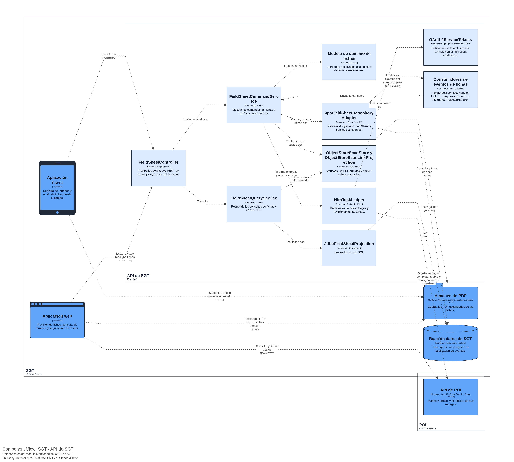

FieldSheetController recibe las solicitudes de la aplicación móvil y de la aplicación web y las dirige a FieldSheetCommandService o a FieldSheetQueryService. Los comandos aplican las reglas del modelo de dominio y guardan la ficha con JpaFieldSheetRepositoryAdapter, que publica los eventos del agregado. Los consumidores de eventos reciben esos eventos después de confirmada la transacción y envían a FieldSheetCommandService los comandos que informan a poi a través de HttpTaskLedger, que obtiene su token de OAuth2ServiceTokens. Los PDF se suben y descargan directamente en el almacén de objetos con enlaces firmados que emite ObjectStoreScanLinkProjection.

<h3 id="monitoring-code-level">Bounded Context Software Architecture Code Level Diagrams</h3>

<h4 id="monitoring-class-diagram">Bounded Context Domain Layer Class Diagrams</h4>

El siguiente diagrama de clases UML muestra la capa de dominio de Monitoring, junto con las identidades que toma del lenguaje publicado de People. Se elaboró en LucidChart.

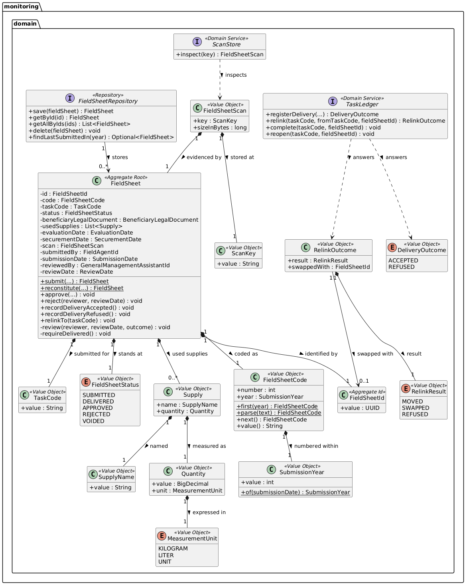

FieldSheet compone todos sus objetos de valor: la identidad, el código de ficha, el código de tarea, el estado, el PDF escaneado y los insumos confirmados. Las fechas aparecen como atributos tipados con sus objetos de valor, sin clase propia en el diagrama. FieldSheetCode compone el año de envío en el que se numera. Las personas se referencian por identidad, con multiplicidad 0..1 para el beneficiario y el revisor, porque solo se conocen tras la revisión. Las interfaces TaskLedger y ScanStore expresan lo que el dominio necesita de poi y del almacén de objetos sin depender de su implementación.

<h4 id="monitoring-db-diagram">Bounded Context Database Design Diagram</h4>

El siguiente diagrama de base de datos muestra las tablas de Monitoring en la base de datos PostgreSQL de sgt. Se elaboró en LucidChart a partir de las migraciones Flyway del servicio.

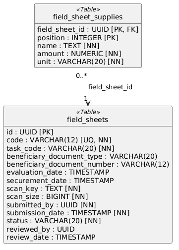

La tabla field_sheets guarda una fila por ficha, con el código único FI-número-año, el código de la tarea de poi y la ubicación y el tamaño del PDF en el almacén de objetos. Las personas se guardan como identidades sin clave foránea, porque pertenecen a otros sistemas. Las restricciones CHECK repiten las reglas del agregado: el revisor y la fecha de revisión aparecen juntos, el tipo y el número del documento del beneficiario aparecen juntos, y una ficha aprobada tiene beneficiario y fecha de evaluación. La tabla field_sheet_supplies guarda los insumos de cada ficha en orden, con clave primaria compuesta por la ficha y la posición, y se elimina en cascada con su ficha.

## Bounded Context: Plots

Plots es el módulo de sgt que registra los terrenos de los beneficiarios a partir de los puntos que la estación total captura durante la visita de campo, y atiende la épica EP-01 (anexamiento de terrenos). Cada terreno queda asociado al documento legal de su titular, que toma del lenguaje publicado de People, y al ubigeo del distrito en el que se encuentra.

<h3 id="plots-domain-layer">Domain Layer</h3>

El agregado Plot protege dos reglas que abarcan más de un terreno: un beneficiario tiene un solo terreno registrado, y dos terrenos registrados no se superponen en más de la tolerancia permitida (un metro cuadrado). Como ambas reglas dependen de otros agregados, el método de fábrica register recibe el terreno que ya tiene el titular, si lo hay, y los terrenos vecinos, y decide con ellos antes de crear el agregado.

El cálculo del área compartida entre dos polígonos, que pueden ser no convexos, se delega en la interfaz de dominio PlotGeometry, que la infraestructura implementa con una librería de geometría.

<table style="width: 100%; border-collapse: collapse; border: 1px solid #333; font-family: Arial, sans-serif; font-size: 12px; table-layout: fixed; overflow-wrap: anywhere; word-break: break-word;">
    <thead>
        <tr>
            <th style="border: 1px solid #333; padding: 6px 8px; text-align: left; width: 21%;">Clase</th>
            <th style="border: 1px solid #333; padding: 6px 8px; text-align: left; width: 13%;">Categoría</th>
            <th style="border: 1px solid #333; padding: 6px 8px; text-align: left; width: 16%;">Propósito</th>
            <th style="border: 1px solid #333; padding: 6px 8px; text-align: left; width: 25%;">Atributos</th>
            <th style="border: 1px solid #333; padding: 6px 8px; text-align: left; width: 25%;">Métodos</th>
        </tr>
    </thead>
    <tbody>
        <tr>
            <td style="border: 1px solid #333; padding: 6px 8px; vertical-align: top;">Plot</td>
            <td style="border: 1px solid #333; padding: 6px 8px; vertical-align: top;">Aggregate Root</td>
            <td style="border: 1px solid #333; padding: 6px 8px; vertical-align: top;">Representa un terreno levantado y registrado a nombre de un beneficiario.</td>
            <td style="border: 1px solid #333; padding: 6px 8px; vertical-align: top;">- id: PlotId - owner: BeneficiaryLegalDocument - boundary: PlotBoundary - ubigeo: Ubigeo - registrationDate: RegistrationDate ~ OVERLAP_TOLERANCE: OverlapTolerance</td>
            <td style="border: 1px solid #333; padding: 6px 8px; vertical-align: top;">+ register(id, owner, boundary, ubigeo, registrationDate, ownersPlot, neighbours, geometry): Plot + reconstitute(id, owner, boundary, ubigeo, registrationDate): Plot - overlaps(other, geometry): boolean</td>
        </tr>
        <tr>
            <td style="border: 1px solid #333; padding: 6px 8px; vertical-align: top;">PlotId</td>
            <td style="border: 1px solid #333; padding: 6px 8px; vertical-align: top;">Aggregate Id</td>
            <td style="border: 1px solid #333; padding: 6px 8px; vertical-align: top;">Identifica un terreno.</td>
            <td style="border: 1px solid #333; padding: 6px 8px; vertical-align: top;">+ value: UUID</td>
            <td style="border: 1px solid #333; padding: 6px 8px; vertical-align: top;">Ninguno</td>
        </tr>
        <tr>
            <td style="border: 1px solid #333; padding: 6px 8px; vertical-align: top;">PlotBoundary</td>
            <td style="border: 1px solid #333; padding: 6px 8px; vertical-align: top;">Value Object</td>
            <td style="border: 1px solid #333; padding: 6px 8px; vertical-align: top;">Perímetro levantado del terreno: sus vértices en orden y la zona UTM en que se midieron. Descarta el vértice repetido que cierra el anillo.</td>
            <td style="border: 1px solid #333; padding: 6px 8px; vertical-align: top;">+ zone: UtmZone + vertices: List&lt;SurveyPoint&gt;</td>
            <td style="border: 1px solid #333; padding: 6px 8px; vertical-align: top;">Ninguno</td>
        </tr>
        <tr>
            <td style="border: 1px solid #333; padding: 6px 8px; vertical-align: top;">SurveyPoint</td>
            <td style="border: 1px solid #333; padding: 6px 8px; vertical-align: top;">Value Object</td>
            <td style="border: 1px solid #333; padding: 6px 8px; vertical-align: top;">Vértice medido por la estación total, proyectado en la zona UTM del perímetro.</td>
            <td style="border: 1px solid #333; padding: 6px 8px; vertical-align: top;">+ easting: double + northing: double</td>
            <td style="border: 1px solid #333; padding: 6px 8px; vertical-align: top;">Ninguno</td>
        </tr>
        <tr>
            <td style="border: 1px solid #333; padding: 6px 8px; vertical-align: top;">UtmZone</td>
            <td style="border: 1px solid #333; padding: 6px 8px; vertical-align: top;">Value Object (enum)</td>
            <td style="border: 1px solid #333; padding: 6px 8px; vertical-align: top;">Zona UTM WGS84 de las coordenadas, con su código EPSG.</td>
            <td style="border: 1px solid #333; padding: 6px 8px; vertical-align: top;">ZONE_17S (32717) ZONE_18S (32718) ZONE_19S (32719)</td>
            <td style="border: 1px solid #333; padding: 6px 8px; vertical-align: top;">+ epsgCode(): int</td>
        </tr>
        <tr>
            <td style="border: 1px solid #333; padding: 6px 8px; vertical-align: top;">Ubigeo</td>
            <td style="border: 1px solid #333; padding: 6px 8px; vertical-align: top;">Value Object</td>
            <td style="border: 1px solid #333; padding: 6px 8px; vertical-align: top;">Código INEI de seis dígitos del distrito donde se encuentra el terreno.</td>
            <td style="border: 1px solid #333; padding: 6px 8px; vertical-align: top;">+ value: String</td>
            <td style="border: 1px solid #333; padding: 6px 8px; vertical-align: top;">Ninguno</td>
        </tr>
        <tr>
            <td style="border: 1px solid #333; padding: 6px 8px; vertical-align: top;">RegistrationDate</td>
            <td style="border: 1px solid #333; padding: 6px 8px; vertical-align: top;">Value Object</td>
            <td style="border: 1px solid #333; padding: 6px 8px; vertical-align: top;">Momento en que se registró el terreno.</td>
            <td style="border: 1px solid #333; padding: 6px 8px; vertical-align: top;">+ value: LocalDateTime</td>
            <td style="border: 1px solid #333; padding: 6px 8px; vertical-align: top;">Ninguno</td>
        </tr>
        <tr>
            <td style="border: 1px solid #333; padding: 6px 8px; vertical-align: top;">SharedArea</td>
            <td style="border: 1px solid #333; padding: 6px 8px; vertical-align: top;">Value Object</td>
            <td style="border: 1px solid #333; padding: 6px 8px; vertical-align: top;">Área común entre dos terrenos, en metros cuadrados.</td>
            <td style="border: 1px solid #333; padding: 6px 8px; vertical-align: top;">+ squareMeters: BigDecimal</td>
            <td style="border: 1px solid #333; padding: 6px 8px; vertical-align: top;">Ninguno</td>
        </tr>
        <tr>
            <td style="border: 1px solid #333; padding: 6px 8px; vertical-align: top;">OverlapTolerance</td>
            <td style="border: 1px solid #333; padding: 6px 8px; vertical-align: top;">Value Object</td>
            <td style="border: 1px solid #333; padding: 6px 8px; vertical-align: top;">Área compartida admitida antes de considerar que dos terrenos se superponen.</td>
            <td style="border: 1px solid #333; padding: 6px 8px; vertical-align: top;">+ squareMeters: BigDecimal</td>
            <td style="border: 1px solid #333; padding: 6px 8px; vertical-align: top;">+ isExceededBy(shared): boolean</td>
        </tr>
        <tr>
            <td style="border: 1px solid #333; padding: 6px 8px; vertical-align: top;">PlotRepository</td>
            <td style="border: 1px solid #333; padding: 6px 8px; vertical-align: top;">Repository</td>
            <td style="border: 1px solid #333; padding: 6px 8px; vertical-align: top;">Persiste y recupera agregados Plot.</td>
            <td style="border: 1px solid #333; padding: 6px 8px; vertical-align: top;">Ninguno</td>
            <td style="border: 1px solid #333; padding: 6px 8px; vertical-align: top;">+ save(plot): Plot + getById(id): Plot + getAllByIds(ids): List&lt;Plot&gt; + delete(plot): void + findIntersecting(boundary): List&lt;Plot&gt; + findOwnedBy(owner): Optional&lt;Plot&gt;</td>
        </tr>
        <tr>
            <td style="border: 1px solid #333; padding: 6px 8px; vertical-align: top;">PlotGeometry</td>
            <td style="border: 1px solid #333; padding: 6px 8px; vertical-align: top;">Domain Service</td>
            <td style="border: 1px solid #333; padding: 6px 8px; vertical-align: top;">Mide la relación entre los perímetros de dos terrenos sobre el terreno real.</td>
            <td style="border: 1px solid #333; padding: 6px 8px; vertical-align: top;">Ninguno</td>
            <td style="border: 1px solid #333; padding: 6px 8px; vertical-align: top;">+ sharedArea(first, second): SharedArea</td>
        </tr>
    </tbody>
</table>

Las reglas de negocio del módulo se protegen con las siguientes excepciones. Todas heredan de BusinessRuleViolationException, salvo PlotNotFoundException y BeneficiaryHoldsNoPlotException, que heredan de EntityNotFoundException.

<table style="width: 100%; border-collapse: collapse; border: 1px solid #333; font-family: Arial, sans-serif; font-size: 14px; table-layout: fixed; overflow-wrap: anywhere; word-break: break-word;">
    <thead>
        <tr>
            <th style="border: 1px solid #333; padding: 8px 10px; text-align: left; width: 35%;">Excepción</th>
            <th style="border: 1px solid #333; padding: 8px 10px; text-align: left; width: 65%;">Regla de negocio que protege</th>
        </tr>
    </thead>
    <tbody>
        <tr>
            <td style="border: 1px solid #333; padding: 10px; vertical-align: top;">MissingPlotIdException</td>
            <td style="border: 1px solid #333; padding: 10px; vertical-align: top;">Todo terreno tiene identidad.</td>
        </tr>
        <tr>
            <td style="border: 1px solid #333; padding: 10px; vertical-align: top;">MissingPlotOwnerException</td>
            <td style="border: 1px solid #333; padding: 10px; vertical-align: top;">Todo terreno está registrado a nombre de un beneficiario.</td>
        </tr>
        <tr>
            <td style="border: 1px solid #333; padding: 10px; vertical-align: top;">MissingPlotBoundaryException</td>
            <td style="border: 1px solid #333; padding: 10px; vertical-align: top;">Todo terreno tiene un perímetro levantado.</td>
        </tr>
        <tr>
            <td style="border: 1px solid #333; padding: 10px; vertical-align: top;">MissingPlotUbigeoException</td>
            <td style="border: 1px solid #333; padding: 10px; vertical-align: top;">Todo terreno indica el ubigeo donde se encuentra.</td>
        </tr>
        <tr>
            <td style="border: 1px solid #333; padding: 10px; vertical-align: top;">MissingRegistrationDateException</td>
            <td style="border: 1px solid #333; padding: 10px; vertical-align: top;">Todo terreno registra cuándo se registró.</td>
        </tr>
        <tr>
            <td style="border: 1px solid #333; padding: 10px; vertical-align: top;">MissingUtmZoneException</td>
            <td style="border: 1px solid #333; padding: 10px; vertical-align: top;">Todo perímetro indica la zona UTM de sus coordenadas.</td>
        </tr>
        <tr>
            <td style="border: 1px solid #333; padding: 10px; vertical-align: top;">TooFewBoundaryVerticesException</td>
            <td style="border: 1px solid #333; padding: 10px; vertical-align: top;">Un perímetro tiene al menos tres vértices distintos.</td>
        </tr>
        <tr>
            <td style="border: 1px solid #333; padding: 10px; vertical-align: top;">NonFiniteSurveyPointException</td>
            <td style="border: 1px solid #333; padding: 10px; vertical-align: top;">Las coordenadas de un vértice son números finitos.</td>
        </tr>
        <tr>
            <td style="border: 1px solid #333; padding: 10px; vertical-align: top;">MissingUbigeoException</td>
            <td style="border: 1px solid #333; padding: 10px; vertical-align: top;">Un ubigeo tiene valor.</td>
        </tr>
        <tr>
            <td style="border: 1px solid #333; padding: 10px; vertical-align: top;">InvalidUbigeoException</td>
            <td style="border: 1px solid #333; padding: 10px; vertical-align: top;">Un ubigeo tiene exactamente seis dígitos.</td>
        </tr>
        <tr>
            <td style="border: 1px solid #333; padding: 10px; vertical-align: top;">InvalidRegionException</td>
            <td style="border: 1px solid #333; padding: 10px; vertical-align: top;">Una región consultada es un departamento, una provincia o un distrito: dos, cuatro o seis dígitos.</td>
        </tr>
        <tr>
            <td style="border: 1px solid #333; padding: 10px; vertical-align: top;">NegativeSharedAreaException</td>
            <td style="border: 1px solid #333; padding: 10px; vertical-align: top;">El área compartida entre dos terrenos no es negativa.</td>
        </tr>
        <tr>
            <td style="border: 1px solid #333; padding: 10px; vertical-align: top;">NegativeOverlapToleranceException</td>
            <td style="border: 1px solid #333; padding: 10px; vertical-align: top;">La tolerancia de superposición no es negativa.</td>
        </tr>
        <tr>
            <td style="border: 1px solid #333; padding: 10px; vertical-align: top;">BeneficiaryAlreadyHoldsPlotException</td>
            <td style="border: 1px solid #333; padding: 10px; vertical-align: top;">Un beneficiario tiene un solo terreno registrado.</td>
        </tr>
        <tr>
            <td style="border: 1px solid #333; padding: 10px; vertical-align: top;">OverlappingPlotException</td>
            <td style="border: 1px solid #333; padding: 10px; vertical-align: top;">Un terreno nuevo no comparte con sus vecinos más área que la tolerancia.</td>
        </tr>
        <tr>
            <td style="border: 1px solid #333; padding: 10px; vertical-align: top;">PlotNotFoundException</td>
            <td style="border: 1px solid #333; padding: 10px; vertical-align: top;">Las operaciones sobre un terreno se refieren a un terreno registrado.</td>
        </tr>
        <tr>
            <td style="border: 1px solid #333; padding: 10px; vertical-align: top;">BeneficiaryHoldsNoPlotException</td>
            <td style="border: 1px solid #333; padding: 10px; vertical-align: top;">La consulta del terreno de un beneficiario se refiere a un beneficiario con terreno registrado.</td>
        </tr>
    </tbody>
</table>

<h3 id="plots-interface-layer">Interface Layer</h3>

La capa de interfaz de Plots es un controlador REST que atiende a la aplicación del agente de campo.

Todas las solicitudes llevan el token de acceso de una persona emitido por staff. El componente compartido CallerArgumentResolver entrega a cada controlador un Caller construido con el sujeto y los roles del token, y el mapper de cada contexto exige el rol con el que se ejecuta la operación; un llamador que no actúa en ese rol recibe una respuesta 403.

<table style="width: 100%; border-collapse: collapse; border: 1px solid #333; font-family: Arial, sans-serif; font-size: 14px; table-layout: fixed; overflow-wrap: anywhere; word-break: break-word;">
    <thead>
        <tr>
            <th style="border: 1px solid #333; padding: 8px 10px; text-align: left; width: 38%;">Método y ruta</th>
            <th style="border: 1px solid #333; padding: 8px 10px; text-align: left; width: 42%;">Operación</th>
            <th style="border: 1px solid #333; padding: 8px 10px; text-align: left; width: 20%;">Rol</th>
        </tr>
    </thead>
    <tbody>
        <tr>
            <td style="border: 1px solid #333; padding: 10px; vertical-align: top;">POST /api/v1/plots</td>
            <td style="border: 1px solid #333; padding: 10px; vertical-align: top;">Registra un terreno.</td>
            <td style="border: 1px solid #333; padding: 10px; vertical-align: top;">field-agent</td>
        </tr>
        <tr>
            <td style="border: 1px solid #333; padding: 10px; vertical-align: top;">GET /api/v1/plots?region=</td>
            <td style="border: 1px solid #333; padding: 10px; vertical-align: top;">Lista los terrenos de un departamento, provincia o distrito.</td>
            <td style="border: 1px solid #333; padding: 10px; vertical-align: top;">field-agent</td>
        </tr>
        <tr>
            <td style="border: 1px solid #333; padding: 10px; vertical-align: top;">GET /api/v1/plots/owner?documentType=&amp;documentNumber=</td>
            <td style="border: 1px solid #333; padding: 10px; vertical-align: top;">Devuelve el terreno de un beneficiario.</td>
            <td style="border: 1px solid #333; padding: 10px; vertical-align: top;">field-agent</td>
        </tr>
        <tr>
            <td style="border: 1px solid #333; padding: 10px; vertical-align: top;">GET /api/v1/plots/{plotId}</td>
            <td style="border: 1px solid #333; padding: 10px; vertical-align: top;">Devuelve un terreno por su identidad.</td>
            <td style="border: 1px solid #333; padding: 10px; vertical-align: top;">field-agent</td>
        </tr>
    </tbody>
</table>

<table style="width: 100%; border-collapse: collapse; border: 1px solid #333; font-family: Arial, sans-serif; font-size: 12px; table-layout: fixed; overflow-wrap: anywhere; word-break: break-word;">
    <thead>
        <tr>
            <th style="border: 1px solid #333; padding: 6px 8px; text-align: left; width: 21%;">Clase</th>
            <th style="border: 1px solid #333; padding: 6px 8px; text-align: left; width: 13%;">Categoría</th>
            <th style="border: 1px solid #333; padding: 6px 8px; text-align: left; width: 16%;">Propósito</th>
            <th style="border: 1px solid #333; padding: 6px 8px; text-align: left; width: 25%;">Atributos</th>
            <th style="border: 1px solid #333; padding: 6px 8px; text-align: left; width: 25%;">Métodos</th>
        </tr>
    </thead>
    <tbody>
        <tr>
            <td style="border: 1px solid #333; padding: 6px 8px; vertical-align: top;">PlotController</td>
            <td style="border: 1px solid #333; padding: 6px 8px; vertical-align: top;">Controller</td>
            <td style="border: 1px solid #333; padding: 6px 8px; vertical-align: top;">Expone las operaciones de terrenos como recursos REST.</td>
            <td style="border: 1px solid #333; padding: 6px 8px; vertical-align: top;">- plotCommandService: PlotCommandService - plotQueryService: PlotQueryService</td>
            <td style="border: 1px solid #333; padding: 6px 8px; vertical-align: top;">+ register(request, caller): PlotResponse + inRegion(region, caller): PlotsResponse + ofOwner(documentType, documentNumber, caller): PlotResponse + plot(plotId, caller): PlotResponse</td>
        </tr>
        <tr>
            <td style="border: 1px solid #333; padding: 6px 8px; vertical-align: top;">PlotWireMapper</td>
            <td style="border: 1px solid #333; padding: 6px 8px; vertical-align: top;">Wire Mapper</td>
            <td style="border: 1px solid #333; padding: 6px 8px; vertical-align: top;">Traduce solicitudes en comandos y criterios, exige el rol del llamador y traduce resultados en respuestas.</td>
            <td style="border: 1px solid #333; padding: 6px 8px; vertical-align: top;">Ninguno</td>
            <td style="border: 1px solid #333; padding: 6px 8px; vertical-align: top;">+ toRegisterPlot(request, caller): RegisterPlot + toPlotById(plotId, caller): PlotById + toPlotsInRegion(region, caller): PlotsInRegion + toPlotOfOwner(documentType, documentNumber, caller): PlotOfOwner + toPlotResponse(result): PlotResponse + toPlotsResponse(result): PlotsResponse</td>
        </tr>
        <tr>
            <td style="border: 1px solid #333; padding: 6px 8px; vertical-align: top;">RegisterPlotRequest</td>
            <td style="border: 1px solid #333; padding: 6px 8px; vertical-align: top;">Request</td>
            <td style="border: 1px solid #333; padding: 6px 8px; vertical-align: top;">Cuerpo del registro de un terreno.</td>
            <td style="border: 1px solid #333; padding: 6px 8px; vertical-align: top;">+ ownerDocumentType, ownerDocumentNumber: String + ubigeo, utmZone: String + boundary: List&lt;VertexRequest&gt;</td>
            <td style="border: 1px solid #333; padding: 6px 8px; vertical-align: top;">Ninguno</td>
        </tr>
        <tr>
            <td style="border: 1px solid #333; padding: 6px 8px; vertical-align: top;">VertexRequest</td>
            <td style="border: 1px solid #333; padding: 6px 8px; vertical-align: top;">Request</td>
            <td style="border: 1px solid #333; padding: 6px 8px; vertical-align: top;">Vértice del perímetro en coordenadas UTM.</td>
            <td style="border: 1px solid #333; padding: 6px 8px; vertical-align: top;">+ easting: double + northing: double</td>
            <td style="border: 1px solid #333; padding: 6px 8px; vertical-align: top;">Ninguno</td>
        </tr>
        <tr>
            <td style="border: 1px solid #333; padding: 6px 8px; vertical-align: top;">PlotResponse</td>
            <td style="border: 1px solid #333; padding: 6px 8px; vertical-align: top;">Response</td>
            <td style="border: 1px solid #333; padding: 6px 8px; vertical-align: top;">Terreno registrado.</td>
            <td style="border: 1px solid #333; padding: 6px 8px; vertical-align: top;">+ id: UUID + ownerDocumentType, ownerDocumentNumber + ubigeo, utmZone + boundary: List&lt;VertexResponse&gt; + registrationDate</td>
            <td style="border: 1px solid #333; padding: 6px 8px; vertical-align: top;">Ninguno</td>
        </tr>
        <tr>
            <td style="border: 1px solid #333; padding: 6px 8px; vertical-align: top;">PlotsResponse</td>
            <td style="border: 1px solid #333; padding: 6px 8px; vertical-align: top;">Response</td>
            <td style="border: 1px solid #333; padding: 6px 8px; vertical-align: top;">Listado de terrenos.</td>
            <td style="border: 1px solid #333; padding: 6px 8px; vertical-align: top;">+ plots: List&lt;PlotResponse&gt;</td>
            <td style="border: 1px solid #333; padding: 6px 8px; vertical-align: top;">Ninguno</td>
        </tr>
        <tr>
            <td style="border: 1px solid #333; padding: 6px 8px; vertical-align: top;">VertexResponse</td>
            <td style="border: 1px solid #333; padding: 6px 8px; vertical-align: top;">Response</td>
            <td style="border: 1px solid #333; padding: 6px 8px; vertical-align: top;">Vértice del perímetro en coordenadas UTM.</td>
            <td style="border: 1px solid #333; padding: 6px 8px; vertical-align: top;">+ easting: double + northing: double</td>
            <td style="border: 1px solid #333; padding: 6px 8px; vertical-align: top;">Ninguno</td>
        </tr>
    </tbody>
</table>

<h3 id="plots-application-layer">Application Layer</h3>

La capa de aplicación expone el registro de terrenos y dos consultas. RegisterPlotHandler se ejecuta con aislamiento SERIALIZABLE, porque las reglas de superposición y de titular único abarcan varios agregados: si dos registros concurrentes leen los mismos vecinos, la base de datos rechaza uno de ellos al confirmar, y al reintentarlo se encuentra el terreno ya registrado y se informa la superposición.

<table style="width: 100%; border-collapse: collapse; border: 1px solid #333; font-family: Arial, sans-serif; font-size: 12px; table-layout: fixed; overflow-wrap: anywhere; word-break: break-word;">
    <thead>
        <tr>
            <th style="border: 1px solid #333; padding: 6px 8px; text-align: left; width: 21%;">Clase</th>
            <th style="border: 1px solid #333; padding: 6px 8px; text-align: left; width: 13%;">Categoría</th>
            <th style="border: 1px solid #333; padding: 6px 8px; text-align: left; width: 16%;">Propósito</th>
            <th style="border: 1px solid #333; padding: 6px 8px; text-align: left; width: 25%;">Atributos</th>
            <th style="border: 1px solid #333; padding: 6px 8px; text-align: left; width: 25%;">Métodos</th>
        </tr>
    </thead>
    <tbody>
        <tr>
            <td style="border: 1px solid #333; padding: 6px 8px; vertical-align: top;">PlotCommandService</td>
            <td style="border: 1px solid #333; padding: 6px 8px; vertical-align: top;">Command Service</td>
            <td style="border: 1px solid #333; padding: 6px 8px; vertical-align: top;">Punto de entrada de escritura del módulo.</td>
            <td style="border: 1px solid #333; padding: 6px 8px; vertical-align: top;">- registerPlotHandler: RegisterPlotHandler</td>
            <td style="border: 1px solid #333; padding: 6px 8px; vertical-align: top;">+ register(RegisterPlot): PlotId</td>
        </tr>
        <tr>
            <td style="border: 1px solid #333; padding: 6px 8px; vertical-align: top;">RegisterPlot</td>
            <td style="border: 1px solid #333; padding: 6px 8px; vertical-align: top;">Command</td>
            <td style="border: 1px solid #333; padding: 6px 8px; vertical-align: top;">Registra un terreno levantado a nombre de un beneficiario.</td>
            <td style="border: 1px solid #333; padding: 6px 8px; vertical-align: top;">+ owner: BeneficiaryLegalDocument + boundary: PlotBoundary + ubigeo: Ubigeo</td>
            <td style="border: 1px solid #333; padding: 6px 8px; vertical-align: top;">Ninguno</td>
        </tr>
        <tr>
            <td style="border: 1px solid #333; padding: 6px 8px; vertical-align: top;">RegisterPlotHandler</td>
            <td style="border: 1px solid #333; padding: 6px 8px; vertical-align: top;">Command Handler</td>
            <td style="border: 1px solid #333; padding: 6px 8px; vertical-align: top;">Carga el terreno del titular y los vecinos que intersecan el perímetro, y registra el terreno nuevo.</td>
            <td style="border: 1px solid #333; padding: 6px 8px; vertical-align: top;">- plotRepository: PlotRepository - plotGeometry: PlotGeometry</td>
            <td style="border: 1px solid #333; padding: 6px 8px; vertical-align: top;">+ handle(RegisterPlot): PlotId</td>
        </tr>
        <tr>
            <td style="border: 1px solid #333; padding: 6px 8px; vertical-align: top;">PlotQueryService</td>
            <td style="border: 1px solid #333; padding: 6px 8px; vertical-align: top;">Query Service</td>
            <td style="border: 1px solid #333; padding: 6px 8px; vertical-align: top;">Punto de entrada de lectura sobre terrenos.</td>
            <td style="border: 1px solid #333; padding: 6px 8px; vertical-align: top;">- plotProjection: PlotProjection</td>
            <td style="border: 1px solid #333; padding: 6px 8px; vertical-align: top;">+ byId(PlotById): PlotResult + inRegion(PlotsInRegion): PlotsResult + ofOwner(PlotOfOwner): PlotResult</td>
        </tr>
        <tr>
            <td style="border: 1px solid #333; padding: 6px 8px; vertical-align: top;">PlotById</td>
            <td style="border: 1px solid #333; padding: 6px 8px; vertical-align: top;">Query Criteria</td>
            <td style="border: 1px solid #333; padding: 6px 8px; vertical-align: top;">Un terreno por su identidad.</td>
            <td style="border: 1px solid #333; padding: 6px 8px; vertical-align: top;">+ id: UUID</td>
            <td style="border: 1px solid #333; padding: 6px 8px; vertical-align: top;">Ninguno</td>
        </tr>
        <tr>
            <td style="border: 1px solid #333; padding: 6px 8px; vertical-align: top;">PlotsInRegion</td>
            <td style="border: 1px solid #333; padding: 6px 8px; vertical-align: top;">Query Criteria</td>
            <td style="border: 1px solid #333; padding: 6px 8px; vertical-align: top;">Terrenos ubicados en un departamento, provincia o distrito.</td>
            <td style="border: 1px solid #333; padding: 6px 8px; vertical-align: top;">+ region: String</td>
            <td style="border: 1px solid #333; padding: 6px 8px; vertical-align: top;">Ninguno</td>
        </tr>
        <tr>
            <td style="border: 1px solid #333; padding: 6px 8px; vertical-align: top;">PlotOfOwner</td>
            <td style="border: 1px solid #333; padding: 6px 8px; vertical-align: top;">Query Criteria</td>
            <td style="border: 1px solid #333; padding: 6px 8px; vertical-align: top;">Terreno registrado a nombre de un beneficiario.</td>
            <td style="border: 1px solid #333; padding: 6px 8px; vertical-align: top;">+ documentType: String + documentNumber: String</td>
            <td style="border: 1px solid #333; padding: 6px 8px; vertical-align: top;">Ninguno</td>
        </tr>
        <tr>
            <td style="border: 1px solid #333; padding: 6px 8px; vertical-align: top;">PlotResult</td>
            <td style="border: 1px solid #333; padding: 6px 8px; vertical-align: top;">Query Result</td>
            <td style="border: 1px solid #333; padding: 6px 8px; vertical-align: top;">Terreno registrado, con su perímetro en coordenadas UTM.</td>
            <td style="border: 1px solid #333; padding: 6px 8px; vertical-align: top;">+ id: UUID + ownerDocumentType, ownerDocumentNumber + ubigeo, utmZone + boundary: List&lt;VertexResult&gt; + registrationDate: LocalDateTime</td>
            <td style="border: 1px solid #333; padding: 6px 8px; vertical-align: top;">Ninguno</td>
        </tr>
        <tr>
            <td style="border: 1px solid #333; padding: 6px 8px; vertical-align: top;">PlotsResult</td>
            <td style="border: 1px solid #333; padding: 6px 8px; vertical-align: top;">Query Result</td>
            <td style="border: 1px solid #333; padding: 6px 8px; vertical-align: top;">Terrenos ordenados por ubigeo y fecha de registro.</td>
            <td style="border: 1px solid #333; padding: 6px 8px; vertical-align: top;">+ plots: List&lt;PlotResult&gt;</td>
            <td style="border: 1px solid #333; padding: 6px 8px; vertical-align: top;">Ninguno</td>
        </tr>
        <tr>
            <td style="border: 1px solid #333; padding: 6px 8px; vertical-align: top;">VertexResult</td>
            <td style="border: 1px solid #333; padding: 6px 8px; vertical-align: top;">Query Result</td>
            <td style="border: 1px solid #333; padding: 6px 8px; vertical-align: top;">Vértice de un perímetro en coordenadas de su zona UTM.</td>
            <td style="border: 1px solid #333; padding: 6px 8px; vertical-align: top;">+ easting: double + northing: double</td>
            <td style="border: 1px solid #333; padding: 6px 8px; vertical-align: top;">Ninguno</td>
        </tr>
        <tr>
            <td style="border: 1px solid #333; padding: 6px 8px; vertical-align: top;">PlotProjection</td>
            <td style="border: 1px solid #333; padding: 6px 8px; vertical-align: top;">Projection</td>
            <td style="border: 1px solid #333; padding: 6px 8px; vertical-align: top;">Puerto de lectura de los terrenos almacenados.</td>
            <td style="border: 1px solid #333; padding: 6px 8px; vertical-align: top;">Ninguno</td>
            <td style="border: 1px solid #333; padding: 6px 8px; vertical-align: top;">+ findById(PlotById): Optional&lt;PlotResult&gt; + findInRegion(PlotsInRegion): List&lt;PlotResult&gt; + findOfOwner(PlotOfOwner): Optional&lt;PlotResult&gt;</td>
        </tr>
    </tbody>
</table>

La consulta por región compara el ubigeo por prefijo, de modo que una misma consulta sirve para los tres niveles de la división administrativa.

<h3 id="plots-infrastructure-layer">Infrastructure Layer</h3>

La capa de infraestructura guarda los terrenos en PostgreSQL con la extensión PostGIS y delega en la librería JTS el cálculo geométrico que el dominio pide a PlotGeometry.

<table style="width: 100%; border-collapse: collapse; border: 1px solid #333; font-family: Arial, sans-serif; font-size: 12px; table-layout: fixed; overflow-wrap: anywhere; word-break: break-word;">
    <thead>
        <tr>
            <th style="border: 1px solid #333; padding: 6px 8px; text-align: left; width: 16%;">Clase</th>
            <th style="border: 1px solid #333; padding: 6px 8px; text-align: left; width: 13%;">Categoría</th>
            <th style="border: 1px solid #333; padding: 6px 8px; text-align: left; width: 21%;">Propósito</th>
            <th style="border: 1px solid #333; padding: 6px 8px; text-align: left; width: 22.5%;">Atributos</th>
            <th style="border: 1px solid #333; padding: 6px 8px; text-align: left; width: 27.5%;">Métodos</th>
        </tr>
    </thead>
    <tbody>
        <tr>
            <td style="border: 1px solid #333; padding: 6px 8px; vertical-align: top;">JpaPlotRepositoryAdapter</td>
            <td style="border: 1px solid #333; padding: 6px 8px; vertical-align: top;">Repository Adapter</td>
            <td style="border: 1px solid #333; padding: 6px 8px; vertical-align: top;">Implementa PlotRepository con JPA y consultas espaciales nativas.</td>
            <td style="border: 1px solid #333; padding: 6px 8px; vertical-align: top;">- jpaRepository: PlotJpaRepository</td>
            <td style="border: 1px solid #333; padding: 6px 8px; vertical-align: top;">+ save(plot): Plot + getById(id): Plot + findIntersecting(boundary): List&lt;Plot&gt; + findOwnedBy(owner): Optional&lt;Plot&gt;</td>
        </tr>
        <tr>
            <td style="border: 1px solid #333; padding: 6px 8px; vertical-align: top;">PlotEntity</td>
            <td style="border: 1px solid #333; padding: 6px 8px; vertical-align: top;">JPA Entity</td>
            <td style="border: 1px solid #333; padding: 6px 8px; vertical-align: top;">Fila de la tabla plots, con el perímetro como polígono PostGIS.</td>
            <td style="border: 1px solid #333; padding: 6px 8px; vertical-align: top;">id: UUID ownerDocumentType, ownerDocumentNumber boundary: Polygon ubigeo: String registrationDate: LocalDateTime</td>
            <td style="border: 1px solid #333; padding: 6px 8px; vertical-align: top;">Getters</td>
        </tr>
        <tr>
            <td style="border: 1px solid #333; padding: 6px 8px; vertical-align: top;">PlotJpaRepository</td>
            <td style="border: 1px solid #333; padding: 6px 8px; vertical-align: top;">Spring Data Repository</td>
            <td style="border: 1px solid #333; padding: 6px 8px; vertical-align: top;">Acceso JPA a plots, con la consulta nativa de terrenos que intersecan un perímetro.</td>
            <td style="border: 1px solid #333; padding: 6px 8px; vertical-align: top;">Ninguno</td>
            <td style="border: 1px solid #333; padding: 6px 8px; vertical-align: top;">+ findIntersecting(...): List&lt;PlotEntity&gt;</td>
        </tr>
        <tr>
            <td style="border: 1px solid #333; padding: 6px 8px; vertical-align: top;">PlotGeometries</td>
            <td style="border: 1px solid #333; padding: 6px 8px; vertical-align: top;">Mapper</td>
            <td style="border: 1px solid #333; padding: 6px 8px; vertical-align: top;">Convierte un PlotBoundary en polígono con el SRID de su zona UTM, y un polígono almacenado de vuelta en zona y vértices.</td>
            <td style="border: 1px solid #333; padding: 6px 8px; vertical-align: top;">Ninguno</td>
            <td style="border: 1px solid #333; padding: 6px 8px; vertical-align: top;">~ toPolygon(boundary): Polygon ~ toBoundary(polygon): PlotBoundary</td>
        </tr>
        <tr>
            <td style="border: 1px solid #333; padding: 6px 8px; vertical-align: top;">JtsPlotGeometry</td>
            <td style="border: 1px solid #333; padding: 6px 8px; vertical-align: top;">Domain Service Adapter</td>
            <td style="border: 1px solid #333; padding: 6px 8px; vertical-align: top;">Implementa PlotGeometry calculando con JTS el área de la intersección de dos perímetros.</td>
            <td style="border: 1px solid #333; padding: 6px 8px; vertical-align: top;">Ninguno</td>
            <td style="border: 1px solid #333; padding: 6px 8px; vertical-align: top;">+ sharedArea(first, second): SharedArea</td>
        </tr>
        <tr>
            <td style="border: 1px solid #333; padding: 6px 8px; vertical-align: top;">JdbcPlotProjection</td>
            <td style="border: 1px solid #333; padding: 6px 8px; vertical-align: top;">Projection Adapter</td>
            <td style="border: 1px solid #333; padding: 6px 8px; vertical-align: top;">Implementa PlotProjection con consultas SQL sobre plots.</td>
            <td style="border: 1px solid #333; padding: 6px 8px; vertical-align: top;">- jdbc: NamedParameterJdbcTemplate</td>
            <td style="border: 1px solid #333; padding: 6px 8px; vertical-align: top;">+ findById(PlotById): Optional&lt;PlotResult&gt; + findInRegion(PlotsInRegion): List&lt;PlotResult&gt; + findOfOwner(PlotOfOwner): Optional&lt;PlotResult&gt;</td>
        </tr>
    </tbody>
</table>

La tabla plots guarda el perímetro en las coordenadas UTM en que se midió y, además, una columna footprint generada en coordenadas geográficas WGS84 con un índice espacial GIST. Así, la búsqueda de vecinos compara terrenos medidos en zonas UTM distintas, y la consulta por región usa un índice sobre el prefijo del ubigeo.

<h3 id="plots-component-level">Bounded Context Software Architecture Component Level Diagrams</h3>

El siguiente diagrama de componentes del modelo C4 muestra los componentes de Plots dentro de la API de SGT y los contenedores con los que se comunican. Se elaboró en Structurizr, en la vista Componentes-Plots del workspace de la solución.

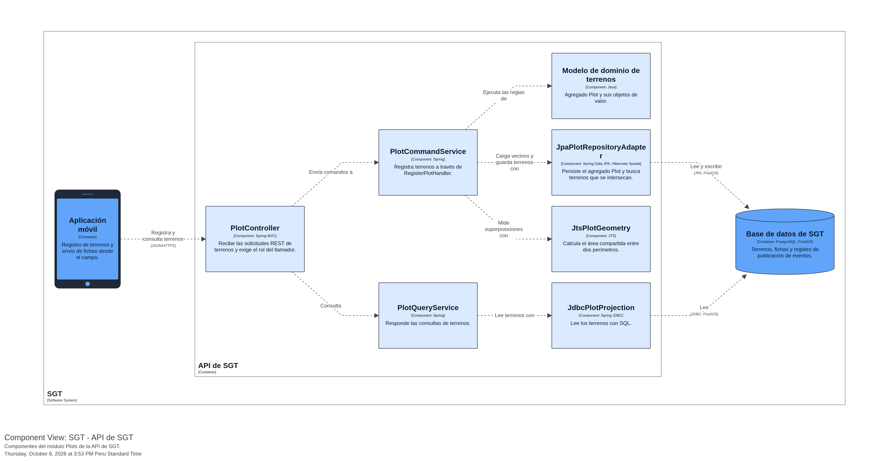

PlotController recibe las solicitudes de la aplicación móvil. PlotCommandService carga los terrenos vecinos con JpaPlotRepositoryAdapter, mide la superposición con JtsPlotGeometry y guarda el terreno nuevo. Las consultas se resuelven con JdbcPlotProjection sobre la base de datos de SGT con PostGIS.

<h3 id="plots-code-level">Bounded Context Software Architecture Code Level Diagrams</h3>

<h4 id="plots-class-diagram">Bounded Context Domain Layer Class Diagrams</h4>

El siguiente diagrama de clases UML muestra la capa de dominio de Plots, junto con el documento legal que toma del lenguaje publicado de People. Se elaboró en LucidChart.

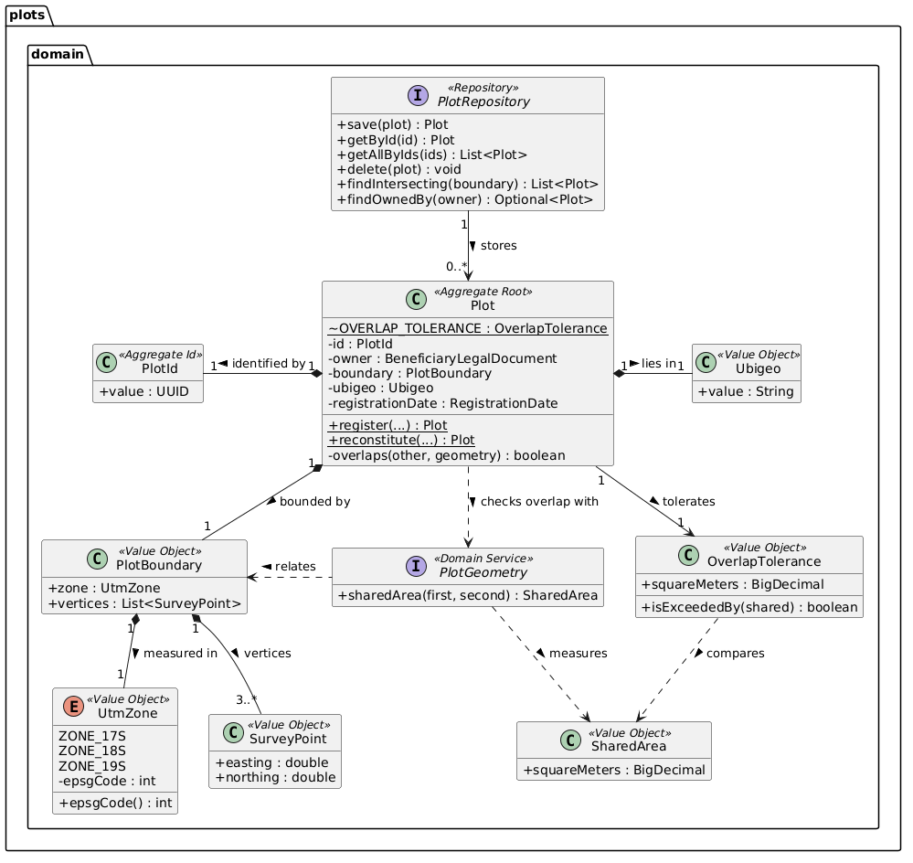

Plot compone su identidad, su perímetro y su ubigeo, y referencia a su titular por el documento legal. PlotBoundary compone entre tres y muchos vértices SurveyPoint y la zona UTM en que se midieron. La regla de superposición se apoya en PlotGeometry, que devuelve un SharedArea, y en la tolerancia OverlapTolerance que el agregado mantiene como constante.

<h4 id="plots-db-diagram">Bounded Context Database Design Diagram</h4>

El siguiente diagrama de base de datos muestra las tablas de Plots en la base de datos PostgreSQL de sgt. Se elaboró en LucidChart a partir de las migraciones Flyway del servicio.

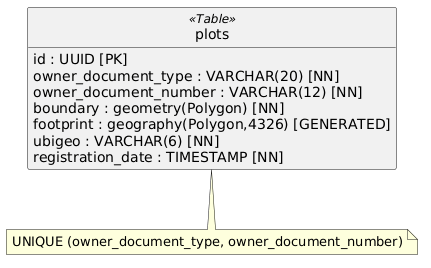

La tabla plots guarda una fila por terreno. El perímetro se almacena como polígono PostGIS en el sistema de referencia de su zona UTM, y la columna footprint, generada a partir de él, lo guarda en coordenadas geográficas WGS84 con un índice GIST para la búsqueda de terrenos que se intersecan. La restricción única sobre el tipo y el número de documento del titular respalda la regla de un terreno por beneficiario, y el índice sobre el ubigeo con text_pattern_ops atiende las consultas por prefijo de región.

## Bounded Context: People

People es el módulo de sgt que representa a las personas a las que se refieren los demás módulos: los beneficiarios y el personal de la organización. Los otros módulos solo guardan identidades; los datos personales se resuelven aquí, a partir de los sistemas que los administran, el registro de beneficiarios y el directorio de staff. Funciona como una capa anticorrupción entre sgt y esos sistemas.

<h3 id="people-domain-layer">Domain Layer</h3>

People no tiene agregados propios, porque sgt no es dueño de los datos de ninguna persona. Su modelo de dominio es el lenguaje publicado que comparten los demás módulos: las identidades con las que Monitoring y Plots se refieren a las personas, y los perfiles con los que el módulo responde cuando una lectura necesita mostrar datos personales.

Las identidades del personal son el objectGUID de su cuenta en el directorio, que se mantiene aunque cambie el nombre de usuario. FieldAgentId y GeneralManagementAssistantId son tipos distintos aunque apunten a la misma cuenta, de modo que el compilador impide usar a un revisor donde se espera a un agente de campo.

<table style="width: 100%; border-collapse: collapse; border: 1px solid #333; font-family: Arial, sans-serif; font-size: 12px; table-layout: fixed; overflow-wrap: anywhere; word-break: break-word;">
    <thead>
        <tr>
            <th style="border: 1px solid #333; padding: 6px 8px; text-align: left; width: 21%;">Clase</th>
            <th style="border: 1px solid #333; padding: 6px 8px; text-align: left; width: 13%;">Categoría</th>
            <th style="border: 1px solid #333; padding: 6px 8px; text-align: left; width: 16%;">Propósito</th>
            <th style="border: 1px solid #333; padding: 6px 8px; text-align: left; width: 25%;">Atributos</th>
            <th style="border: 1px solid #333; padding: 6px 8px; text-align: left; width: 25%;">Métodos</th>
        </tr>
    </thead>
    <tbody>
        <tr>
            <td style="border: 1px solid #333; padding: 6px 8px; vertical-align: top;">BeneficiaryLegalDocument</td>
            <td style="border: 1px solid #333; padding: 6px 8px; vertical-align: top;">Value Object</td>
            <td style="border: 1px solid #333; padding: 6px 8px; vertical-align: top;">Documento legal que identifica a un beneficiario.</td>
            <td style="border: 1px solid #333; padding: 6px 8px; vertical-align: top;">+ type: LegalDocumentType + number: String</td>
            <td style="border: 1px solid #333; padding: 6px 8px; vertical-align: top;">Ninguno</td>
        </tr>
        <tr>
            <td style="border: 1px solid #333; padding: 6px 8px; vertical-align: top;">LegalDocumentType</td>
            <td style="border: 1px solid #333; padding: 6px 8px; vertical-align: top;">Value Object (enum)</td>
            <td style="border: 1px solid #333; padding: 6px 8px; vertical-align: top;">Tipo de documento legal y el formato que exige a su número.</td>
            <td style="border: 1px solid #333; padding: 6px 8px; vertical-align: top;">DNI (8 dígitos) FOREIGNER_ID_CARD (9 a 12 caracteres) PASSPORT (6 a 12 caracteres)</td>
            <td style="border: 1px solid #333; padding: 6px 8px; vertical-align: top;">+ matches(number): boolean</td>
        </tr>
        <tr>
            <td style="border: 1px solid #333; padding: 6px 8px; vertical-align: top;">FieldAgentId</td>
            <td style="border: 1px solid #333; padding: 6px 8px; vertical-align: top;">Value Object</td>
            <td style="border: 1px solid #333; padding: 6px 8px; vertical-align: top;">Identidad del agente de campo que visita el terreno y realiza la evaluación.</td>
            <td style="border: 1px solid #333; padding: 6px 8px; vertical-align: top;">+ value: UUID</td>
            <td style="border: 1px solid #333; padding: 6px 8px; vertical-align: top;">Ninguno</td>
        </tr>
        <tr>
            <td style="border: 1px solid #333; padding: 6px 8px; vertical-align: top;">GeneralManagementAssistantId</td>
            <td style="border: 1px solid #333; padding: 6px 8px; vertical-align: top;">Value Object</td>
            <td style="border: 1px solid #333; padding: 6px 8px; vertical-align: top;">Identidad del asistente de gerencia general que revisa las evaluaciones.</td>
            <td style="border: 1px solid #333; padding: 6px 8px; vertical-align: top;">+ value: UUID</td>
            <td style="border: 1px solid #333; padding: 6px 8px; vertical-align: top;">Ninguno</td>
        </tr>
        <tr>
            <td style="border: 1px solid #333; padding: 6px 8px; vertical-align: top;">BeneficiaryProfile</td>
            <td style="border: 1px solid #333; padding: 6px 8px; vertical-align: top;">Value Object</td>
            <td style="border: 1px solid #333; padding: 6px 8px; vertical-align: top;">Datos personales de un beneficiario según el registro de beneficiarios.</td>
            <td style="border: 1px solid #333; padding: 6px 8px; vertical-align: top;">+ document: BeneficiaryLegalDocument + names: String + paternalSurname: String + maternalSurname: String + dateOfBirth: LocalDate + ubigeo: String</td>
            <td style="border: 1px solid #333; padding: 6px 8px; vertical-align: top;">Ninguno</td>
        </tr>
        <tr>
            <td style="border: 1px solid #333; padding: 6px 8px; vertical-align: top;">FieldAgentProfile</td>
            <td style="border: 1px solid #333; padding: 6px 8px; vertical-align: top;">Value Object</td>
            <td style="border: 1px solid #333; padding: 6px 8px; vertical-align: top;">Datos de un agente de campo según el directorio.</td>
            <td style="border: 1px solid #333; padding: 6px 8px; vertical-align: top;">+ id: FieldAgentId + username: String + displayName: String</td>
            <td style="border: 1px solid #333; padding: 6px 8px; vertical-align: top;">Ninguno</td>
        </tr>
        <tr>
            <td style="border: 1px solid #333; padding: 6px 8px; vertical-align: top;">GeneralManagementAssistantProfile</td>
            <td style="border: 1px solid #333; padding: 6px 8px; vertical-align: top;">Value Object</td>
            <td style="border: 1px solid #333; padding: 6px 8px; vertical-align: top;">Datos de un asistente de gerencia general según el directorio.</td>
            <td style="border: 1px solid #333; padding: 6px 8px; vertical-align: top;">+ id: GeneralManagementAssistantId + username: String + displayName: String</td>
            <td style="border: 1px solid #333; padding: 6px 8px; vertical-align: top;">Ninguno</td>
        </tr>
    </tbody>
</table>

Las reglas de este lenguaje se protegen con las siguientes excepciones, que heredan de BusinessRuleViolationException.

<table style="width: 100%; border-collapse: collapse; border: 1px solid #333; font-family: Arial, sans-serif; font-size: 14px; table-layout: fixed; overflow-wrap: anywhere; word-break: break-word;">
    <thead>
        <tr>
            <th style="border: 1px solid #333; padding: 8px 10px; text-align: left; width: 35%;">Excepción</th>
            <th style="border: 1px solid #333; padding: 8px 10px; text-align: left; width: 65%;">Regla de negocio que protege</th>
        </tr>
    </thead>
    <tbody>
        <tr>
            <td style="border: 1px solid #333; padding: 10px; vertical-align: top;">MissingLegalDocumentTypeException</td>
            <td style="border: 1px solid #333; padding: 10px; vertical-align: top;">Todo documento legal indica su tipo.</td>
        </tr>
        <tr>
            <td style="border: 1px solid #333; padding: 10px; vertical-align: top;">InvalidLegalDocumentNumberException</td>
            <td style="border: 1px solid #333; padding: 10px; vertical-align: top;">El número del documento tiene el formato que exige su tipo.</td>
        </tr>
        <tr>
            <td style="border: 1px solid #333; padding: 10px; vertical-align: top;">MissingStaffIdException</td>
            <td style="border: 1px solid #333; padding: 10px; vertical-align: top;">Toda identidad del personal tiene valor.</td>
        </tr>
    </tbody>
</table>

<h3 id="people-application-layer">Application Layer</h3>

La capa de aplicación ofrece a los demás módulos la interfaz PeopleApi, que resuelve identidades en perfiles. Las búsquedas reciben un lote, para que un listado resuelva a todas sus personas en una sola llamada, y una identidad que el sistema dueño no conoce simplemente no aparece en la respuesta.

<table style="width: 100%; border-collapse: collapse; border: 1px solid #333; font-family: Arial, sans-serif; font-size: 12px; table-layout: fixed; overflow-wrap: anywhere; word-break: break-word;">
    <thead>
        <tr>
            <th style="border: 1px solid #333; padding: 6px 8px; text-align: left; width: 21%;">Clase</th>
            <th style="border: 1px solid #333; padding: 6px 8px; text-align: left; width: 13%;">Categoría</th>
            <th style="border: 1px solid #333; padding: 6px 8px; text-align: left; width: 16%;">Propósito</th>
            <th style="border: 1px solid #333; padding: 6px 8px; text-align: left; width: 25%;">Atributos</th>
            <th style="border: 1px solid #333; padding: 6px 8px; text-align: left; width: 25%;">Métodos</th>
        </tr>
    </thead>
    <tbody>
        <tr>
            <td style="border: 1px solid #333; padding: 6px 8px; vertical-align: top;">PeopleApi</td>
            <td style="border: 1px solid #333; padding: 6px 8px; vertical-align: top;">Module API</td>
            <td style="border: 1px solid #333; padding: 6px 8px; vertical-align: top;">Contrato con el que otros módulos resuelven identidades en datos personales.</td>
            <td style="border: 1px solid #333; padding: 6px 8px; vertical-align: top;">Ninguno</td>
            <td style="border: 1px solid #333; padding: 6px 8px; vertical-align: top;">+ findBeneficiaries(documents): List&lt;BeneficiaryProfile&gt; + findFieldAgents(ids): List&lt;FieldAgentProfile&gt; + findGeneralManagementAssistants(ids): List&lt;GeneralManagementAssistantProfile&gt;</td>
        </tr>
        <tr>
            <td style="border: 1px solid #333; padding: 6px 8px; vertical-align: top;">PeopleApiService</td>
            <td style="border: 1px solid #333; padding: 6px 8px; vertical-align: top;">Application Service</td>
            <td style="border: 1px solid #333; padding: 6px 8px; vertical-align: top;">Implementa PeopleApi traduciendo identidades a criterios y resultados a perfiles.</td>
            <td style="border: 1px solid #333; padding: 6px 8px; vertical-align: top;">- beneficiaryQueryService: BeneficiaryQueryService - staffQueryService: StaffQueryService</td>
            <td style="border: 1px solid #333; padding: 6px 8px; vertical-align: top;">+ findBeneficiaries(documents): List&lt;BeneficiaryProfile&gt; + findFieldAgents(ids): List&lt;FieldAgentProfile&gt; + findGeneralManagementAssistants(ids): List&lt;GeneralManagementAssistantProfile&gt;</td>
        </tr>
        <tr>
            <td style="border: 1px solid #333; padding: 6px 8px; vertical-align: top;">BeneficiaryQueryService</td>
            <td style="border: 1px solid #333; padding: 6px 8px; vertical-align: top;">Query Service</td>
            <td style="border: 1px solid #333; padding: 6px 8px; vertical-align: top;">Busca beneficiarios por documento legal, sin repetir documentos.</td>
            <td style="border: 1px solid #333; padding: 6px 8px; vertical-align: top;">- beneficiaryProjection: BeneficiaryProjection</td>
            <td style="border: 1px solid #333; padding: 6px 8px; vertical-align: top;">+ byDocument(BeneficiariesByDocument): BeneficiariesResult</td>
        </tr>
        <tr>
            <td style="border: 1px solid #333; padding: 6px 8px; vertical-align: top;">BeneficiariesByDocument</td>
            <td style="border: 1px solid #333; padding: 6px 8px; vertical-align: top;">Query Criteria</td>
            <td style="border: 1px solid #333; padding: 6px 8px; vertical-align: top;">Beneficiarios a buscar por documento legal.</td>
            <td style="border: 1px solid #333; padding: 6px 8px; vertical-align: top;">+ documents: List&lt;BeneficiaryByDocument&gt;</td>
            <td style="border: 1px solid #333; padding: 6px 8px; vertical-align: top;">Ninguno</td>
        </tr>
        <tr>
            <td style="border: 1px solid #333; padding: 6px 8px; vertical-align: top;">BeneficiaryByDocument</td>
            <td style="border: 1px solid #333; padding: 6px 8px; vertical-align: top;">Query Criteria</td>
            <td style="border: 1px solid #333; padding: 6px 8px; vertical-align: top;">Un beneficiario a buscar por documento legal.</td>
            <td style="border: 1px solid #333; padding: 6px 8px; vertical-align: top;">+ type: String + number: String</td>
            <td style="border: 1px solid #333; padding: 6px 8px; vertical-align: top;">Ninguno</td>
        </tr>
        <tr>
            <td style="border: 1px solid #333; padding: 6px 8px; vertical-align: top;">BeneficiaryResult</td>
            <td style="border: 1px solid #333; padding: 6px 8px; vertical-align: top;">Query Result</td>
            <td style="border: 1px solid #333; padding: 6px 8px; vertical-align: top;">Beneficiario según lo devolvió el registro.</td>
            <td style="border: 1px solid #333; padding: 6px 8px; vertical-align: top;">+ documentType, documentNumber + names, paternalSurname, maternalSurname + dateOfBirth: LocalDate + ubigeo: String</td>
            <td style="border: 1px solid #333; padding: 6px 8px; vertical-align: top;">Ninguno</td>
        </tr>
        <tr>
            <td style="border: 1px solid #333; padding: 6px 8px; vertical-align: top;">BeneficiariesResult</td>
            <td style="border: 1px solid #333; padding: 6px 8px; vertical-align: top;">Query Result</td>
            <td style="border: 1px solid #333; padding: 6px 8px; vertical-align: top;">Beneficiarios encontrados.</td>
            <td style="border: 1px solid #333; padding: 6px 8px; vertical-align: top;">+ beneficiaries: List&lt;BeneficiaryResult&gt;</td>
            <td style="border: 1px solid #333; padding: 6px 8px; vertical-align: top;">Ninguno</td>
        </tr>
        <tr>
            <td style="border: 1px solid #333; padding: 6px 8px; vertical-align: top;">BeneficiaryProjection</td>
            <td style="border: 1px solid #333; padding: 6px 8px; vertical-align: top;">Projection</td>
            <td style="border: 1px solid #333; padding: 6px 8px; vertical-align: top;">Puerto de lectura del registro de beneficiarios.</td>
            <td style="border: 1px solid #333; padding: 6px 8px; vertical-align: top;">Ninguno</td>
            <td style="border: 1px solid #333; padding: 6px 8px; vertical-align: top;">+ findByDocuments(BeneficiariesByDocument): List&lt;BeneficiaryResult&gt;</td>
        </tr>
        <tr>
            <td style="border: 1px solid #333; padding: 6px 8px; vertical-align: top;">StaffQueryService</td>
            <td style="border: 1px solid #333; padding: 6px 8px; vertical-align: top;">Query Service</td>
            <td style="border: 1px solid #333; padding: 6px 8px; vertical-align: top;">Busca miembros del personal por la identidad de su cuenta.</td>
            <td style="border: 1px solid #333; padding: 6px 8px; vertical-align: top;">- personProjection: PersonProjection</td>
            <td style="border: 1px solid #333; padding: 6px 8px; vertical-align: top;">+ fieldAgentsById(StaffMembersById): StaffMembersResult + generalManagementAssistantsById(StaffMembersById): StaffMembersResult</td>
        </tr>
        <tr>
            <td style="border: 1px solid #333; padding: 6px 8px; vertical-align: top;">StaffMembersById</td>
            <td style="border: 1px solid #333; padding: 6px 8px; vertical-align: top;">Query Criteria</td>
            <td style="border: 1px solid #333; padding: 6px 8px; vertical-align: top;">Miembros del personal a buscar por GUID de cuenta.</td>
            <td style="border: 1px solid #333; padding: 6px 8px; vertical-align: top;">+ ids: List&lt;UUID&gt;</td>
            <td style="border: 1px solid #333; padding: 6px 8px; vertical-align: top;">Ninguno</td>
        </tr>
        <tr>
            <td style="border: 1px solid #333; padding: 6px 8px; vertical-align: top;">StaffMemberResult</td>
            <td style="border: 1px solid #333; padding: 6px 8px; vertical-align: top;">Query Result</td>
            <td style="border: 1px solid #333; padding: 6px 8px; vertical-align: top;">Miembro del personal según lo devolvió el directorio.</td>
            <td style="border: 1px solid #333; padding: 6px 8px; vertical-align: top;">+ id: UUID + username: String + displayName: String</td>
            <td style="border: 1px solid #333; padding: 6px 8px; vertical-align: top;">Ninguno</td>
        </tr>
        <tr>
            <td style="border: 1px solid #333; padding: 6px 8px; vertical-align: top;">StaffMembersResult</td>
            <td style="border: 1px solid #333; padding: 6px 8px; vertical-align: top;">Query Result</td>
            <td style="border: 1px solid #333; padding: 6px 8px; vertical-align: top;">Miembros del personal encontrados.</td>
            <td style="border: 1px solid #333; padding: 6px 8px; vertical-align: top;">+ staffMembers: List&lt;StaffMemberResult&gt;</td>
            <td style="border: 1px solid #333; padding: 6px 8px; vertical-align: top;">Ninguno</td>
        </tr>
        <tr>
            <td style="border: 1px solid #333; padding: 6px 8px; vertical-align: top;">PersonProjection</td>
            <td style="border: 1px solid #333; padding: 6px 8px; vertical-align: top;">Projection</td>
            <td style="border: 1px solid #333; padding: 6px 8px; vertical-align: top;">Puerto de lectura de las personas del directorio.</td>
            <td style="border: 1px solid #333; padding: 6px 8px; vertical-align: top;">Ninguno</td>
            <td style="border: 1px solid #333; padding: 6px 8px; vertical-align: top;">+ findByIds(ids): List&lt;StaffMemberResult&gt;</td>
        </tr>
    </tbody>
</table>

StaffQueryService resuelve a los agentes de campo y a los asistentes de gerencia general de la misma forma, porque el directorio registra a las personas sin las funciones que cumplen en sgt. Los dos métodos existen para que el rol con el que sgt registró a cada persona se lea en cada llamada. El módulo atiende la historia SGT-7 (consultar los datos del beneficiario durante la validación de una ficha).

<h3 id="people-infrastructure-layer">Infrastructure Layer</h3>

People no tiene capa de interfaz propia: los demás módulos lo usan a través de PeopleApi. Su capa de infraestructura implementa los dos puertos de proyección como clientes HTTP de los sistemas que administran a las personas. Ambos clientes se autentican con un token de servicio que sgt obtiene de staff con el flujo client credentials, y piden los datos por lotes.

<table style="width: 100%; border-collapse: collapse; border: 1px solid #333; font-family: Arial, sans-serif; font-size: 12px; table-layout: fixed; overflow-wrap: anywhere; word-break: break-word;">
    <thead>
        <tr>
            <th style="border: 1px solid #333; padding: 6px 8px; text-align: left; width: 21%;">Clase</th>
            <th style="border: 1px solid #333; padding: 6px 8px; text-align: left; width: 13%;">Categoría</th>
            <th style="border: 1px solid #333; padding: 6px 8px; text-align: left; width: 16%;">Propósito</th>
            <th style="border: 1px solid #333; padding: 6px 8px; text-align: left; width: 25%;">Atributos</th>
            <th style="border: 1px solid #333; padding: 6px 8px; text-align: left; width: 25%;">Métodos</th>
        </tr>
    </thead>
    <tbody>
        <tr>
            <td style="border: 1px solid #333; padding: 6px 8px; vertical-align: top;">HttpBeneficiaryProjection</td>
            <td style="border: 1px solid #333; padding: 6px 8px; vertical-align: top;">Projection Adapter</td>
            <td style="border: 1px solid #333; padding: 6px 8px; vertical-align: top;">Implementa BeneficiaryProjection contra el registro de beneficiarios.</td>
            <td style="border: 1px solid #333; padding: 6px 8px; vertical-align: top;">- client: RestClient</td>
            <td style="border: 1px solid #333; padding: 6px 8px; vertical-align: top;">+ findByDocuments(BeneficiariesByDocument): List&lt;BeneficiaryResult&gt;</td>
        </tr>
        <tr>
            <td style="border: 1px solid #333; padding: 6px 8px; vertical-align: top;">HttpPersonProjection</td>
            <td style="border: 1px solid #333; padding: 6px 8px; vertical-align: top;">Projection Adapter</td>
            <td style="border: 1px solid #333; padding: 6px 8px; vertical-align: top;">Implementa PersonProjection contra el directorio de staff.</td>
            <td style="border: 1px solid #333; padding: 6px 8px; vertical-align: top;">- client: RestClient</td>
            <td style="border: 1px solid #333; padding: 6px 8px; vertical-align: top;">+ findByIds(ids): List&lt;StaffMemberResult&gt;</td>
        </tr>
    </tbody>
</table>

Cada puerto se traduce en una llamada de lote al sistema que administra los datos:

<table style="width: 100%; border-collapse: collapse; border: 1px solid #333; font-family: Arial, sans-serif; font-size: 14px; table-layout: fixed; overflow-wrap: anywhere; word-break: break-word;">
    <thead>
        <tr>
            <th style="border: 1px solid #333; padding: 8px 10px; text-align: left; width: 40%;">Puerto</th>
            <th style="border: 1px solid #333; padding: 8px 10px; text-align: left; width: 60%;">Llamada</th>
        </tr>
    </thead>
    <tbody>
        <tr>
            <td style="border: 1px solid #333; padding: 10px; vertical-align: top;">BeneficiaryProjection.findByDocuments</td>
            <td style="border: 1px solid #333; padding: 10px; vertical-align: top;">POST /api/v1/beneficiaries/lookup (beneficiarios)</td>
        </tr>
        <tr>
            <td style="border: 1px solid #333; padding: 10px; vertical-align: top;">PersonProjection.findByIds</td>
            <td style="border: 1px solid #333; padding: 10px; vertical-align: top;">POST /api/v3/people/lookup (staff)</td>
        </tr>
    </tbody>
</table>

Una falla de red o una respuesta sin cuerpo se traduce en una InfrastructureException.

<h3 id="people-component-level">Bounded Context Software Architecture Component Level Diagrams</h3>

El siguiente diagrama de componentes del modelo C4 muestra los componentes de People dentro de la API de SGT y los contenedores con los que se comunican. Se elaboró en Structurizr, en la vista Componentes-People del workspace de la solución.

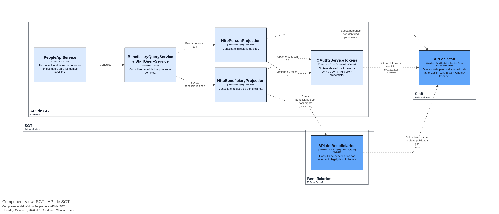

PeopleApiService es la entrada del módulo para los demás módulos de sgt. Delega en los servicios de consulta, que buscan beneficiarios en el registro de Beneficiarios y personal en el directorio de Staff a través de clientes HTTP. Ambos clientes obtienen su token de servicio de OAuth2ServiceTokens.

<h3 id="people-code-level">Bounded Context Software Architecture Code Level Diagrams</h3>

<h4 id="people-class-diagram">Bounded Context Domain Layer Class Diagrams</h4>

El siguiente diagrama de clases UML muestra el lenguaje publicado de People, que constituye su capa de dominio. Se elaboró en LucidChart.

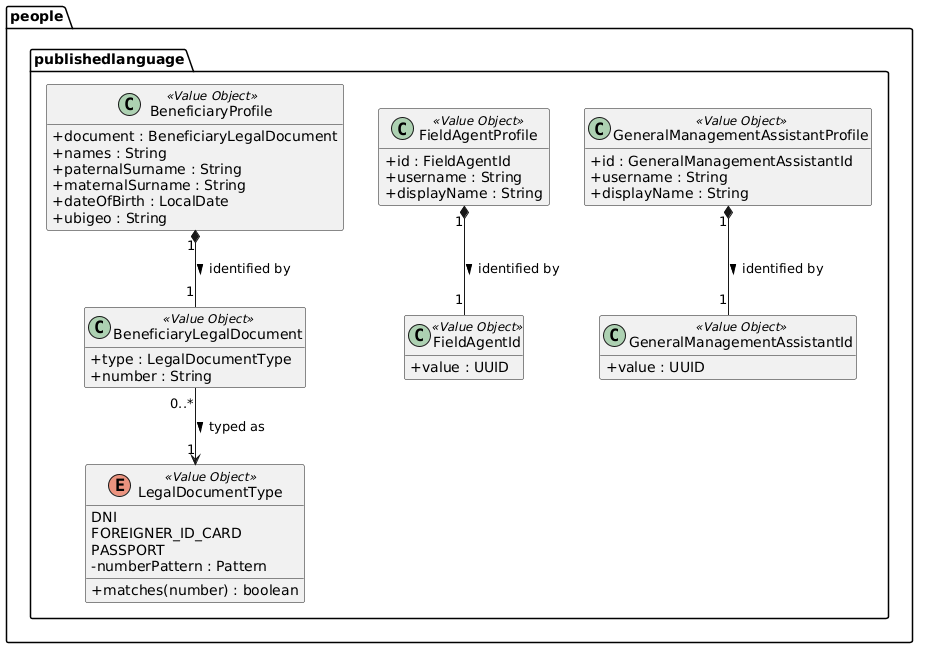

Cada perfil compone la identidad de la persona que describe: BeneficiaryProfile compone un BeneficiaryLegalDocument, y los perfiles del personal componen su identidad tipada. El tipo de documento valida el formato del número con su propio patrón.

## Bounded Context: Planning

Planning es el contexto del servicio poi que modela el Plan Operativo Institucional: los planes, los objetivos que persiguen, las actividades con las que se avanza en cada objetivo y las tareas planificadas bajo cada actividad. Es el registro de qué tareas tienen una entrega y cómo se revisó cada una, y atiende la épica EP-04 (seguimiento de objetivos estratégicos institucionales).

sgt se comunica con este contexto cada vez que una ficha cambia de estado: registra la entrega cuando se envía la ficha, completa la tarea cuando se aprueba, la reabre cuando se rechaza y reasigna la entrega cuando el revisor encuentra que la evidencia corresponde a otra tarea. Planning identifica a cada entrega por el identificador de la ficha que la hizo, sin conocer qué es una ficha.

<h3 id="planning-domain-layer">Domain Layer</h3>

El contexto tiene dos agregados. Plan contiene sus objetivos y las actividades de cada objetivo, y numera a ambos en el orden en que se definen, de modo que ningún código se elige a mano. Las tareas forman un agregado aparte, Task, porque cada actividad tiene miles de ellas y cada una cambia por su cuenta a medida que llegan las entregas; una tarea referencia a su actividad por identidad.

Task es una clase abstracta: cada tipo de tarea es una subclase que indica para qué se define, y todas reciben su entrega de la misma forma. BeneficiaryFollowUpTask es la visita de seguimiento a un beneficiario. El ciclo de vida de una tarea va de PENDING a DELIVERED al registrarse una entrega, y de DELIVERED a COMPLETED si la revisión la confirma o de vuelta a PENDING si la rechaza. Cada paso nombra la entrega a la que se refiere, de modo que un paso anunciado otra vez no cambia nada.

El plan sigue el avance de sus tareas sin contenerlas. Cada tarea anuncia con TaskDefined que se definió y con TaskCompleted que se completó, y el plan guarda en cada actividad las tareas que siguen abiertas. Una actividad está completa cuando tiene tareas y todas están completadas, un objetivo cuando tiene actividades y todas están completas, y el plan cuando tiene objetivos y todos están completos. Una tarea definida después reabre su actividad, y con ella el objetivo y el plan.

Los códigos son jerárquicos y forman la identidad de negocio: el plan se identifica por sus años (2025-2030), el objetivo agrega su número (2025-2030-01), la actividad el suyo (2025-2030-01-03) y la tarea un número de cuatro dígitos (2025-2030-01-03-0032).

<table style="width: 100%; border-collapse: collapse; border: 1px solid #333; font-family: Arial, sans-serif; font-size: 12px; table-layout: fixed; overflow-wrap: anywhere; word-break: break-word;">
    <thead>
        <tr>
            <th style="border: 1px solid #333; padding: 6px 8px; text-align: left; width: 21%;">Clase</th>
            <th style="border: 1px solid #333; padding: 6px 8px; text-align: left; width: 13%;">Categoría</th>
            <th style="border: 1px solid #333; padding: 6px 8px; text-align: left; width: 16%;">Propósito</th>
            <th style="border: 1px solid #333; padding: 6px 8px; text-align: left; width: 25%;">Atributos</th>
            <th style="border: 1px solid #333; padding: 6px 8px; text-align: left; width: 25%;">Métodos</th>
        </tr>
    </thead>
    <tbody>
        <tr>
            <td style="border: 1px solid #333; padding: 6px 8px; vertical-align: top;">Plan</td>
            <td style="border: 1px solid #333; padding: 6px 8px; vertical-align: top;">Aggregate Root</td>
            <td style="border: 1px solid #333; padding: 6px 8px; vertical-align: top;">Plan operativo institucional con sus objetivos y actividades.</td>
            <td style="border: 1px solid #333; padding: 6px 8px; vertical-align: top;">- id: PlanId - code: PlanCode - name: Name - description: Description - objectives: List&lt;Objective&gt;</td>
            <td style="border: 1px solid #333; padding: 6px 8px; vertical-align: top;">+ define(id, code, name, description, sameCode): Plan + reconstitute(id, code, name, description, objectives): Plan + defineObjective(id, name, description): void + defineActivity(objectiveId, id, name, description, measurementUnit, target): void + trackTask(activityId, taskId): void + recordTaskCompletion(activityId, taskId): void + isComplete(): boolean - activity(activityId): Activity</td>
        </tr>
        <tr>
            <td style="border: 1px solid #333; padding: 6px 8px; vertical-align: top;">Objective</td>
            <td style="border: 1px solid #333; padding: 6px 8px; vertical-align: top;">Entity</td>
            <td style="border: 1px solid #333; padding: 6px 8px; vertical-align: top;">Lo que el plan se propone lograr; su avance es el de sus actividades.</td>
            <td style="border: 1px solid #333; padding: 6px 8px; vertical-align: top;">- id: ObjectiveId - code: ObjectiveCode - name: Name - description: Description - activities: List&lt;Activity&gt;</td>
            <td style="border: 1px solid #333; padding: 6px 8px; vertical-align: top;">+ define(id, code, name, description): Objective + reconstitute(...): Objective + defineActivity(id, name, description, measurementUnit, target): void + activity(activityId): Optional&lt;Activity&gt; + isComplete(): boolean</td>
        </tr>
        <tr>
            <td style="border: 1px solid #333; padding: 6px 8px; vertical-align: top;">Activity</td>
            <td style="border: 1px solid #333; padding: 6px 8px; vertical-align: top;">Entity</td>
            <td style="border: 1px solid #333; padding: 6px 8px; vertical-align: top;">Trabajo con el que se avanza en un objetivo, medido en una unidad y con una meta. Cada tarea completada aporta una unidad, y guarda las tareas que siguen abiertas.</td>
            <td style="border: 1px solid #333; padding: 6px 8px; vertical-align: top;">- id: ActivityId - code: ActivityCode - name: Name - description: Description - measurementUnit: MeasurementUnit - target: Target - openTasks: Set&lt;TaskId&gt; - hasTasks: boolean</td>
            <td style="border: 1px solid #333; padding: 6px 8px; vertical-align: top;">+ define(...): Activity + reconstitute(...): Activity + trackTask(taskId): void + recordTaskCompletion(taskId): void + isComplete(): boolean</td>
        </tr>
        <tr>
            <td style="border: 1px solid #333; padding: 6px 8px; vertical-align: top;">Task</td>
            <td style="border: 1px solid #333; padding: 6px 8px; vertical-align: top;">Aggregate Root (abstracta)</td>
            <td style="border: 1px solid #333; padding: 6px 8px; vertical-align: top;">Trabajo planificado bajo una actividad y la entrega que lo reporta. Al completarse emite TaskCompleted.</td>
            <td style="border: 1px solid #333; padding: 6px 8px; vertical-align: top;">- id: TaskId - activityId: ActivityId - code: TaskCode - description: Description - status: TaskStatus - submissionId: SubmissionId - executionDate: ExecutionDate</td>
            <td style="border: 1px solid #333; padding: 6px 8px; vertical-align: top;">+ registerDelivery(submissionId, executionDate): void + complete(submissionId): void + reopen(submissionId): void + relinkDeliveryFrom(source, submissionId): void - holdsDeliveryOf(submissionId): boolean - release(): void</td>
        </tr>
        <tr>
            <td style="border: 1px solid #333; padding: 6px 8px; vertical-align: top;">BeneficiaryFollowUpTask</td>
            <td style="border: 1px solid #333; padding: 6px 8px; vertical-align: top;">Aggregate Root</td>
            <td style="border: 1px solid #333; padding: 6px 8px; vertical-align: top;">Visita de seguimiento a un beneficiario. Al definirse emite TaskDefined.</td>
            <td style="border: 1px solid #333; padding: 6px 8px; vertical-align: top;">- beneficiaryId: BeneficiaryId</td>
            <td style="border: 1px solid #333; padding: 6px 8px; vertical-align: top;">+ define(id, activityId, activityCode, lastTask, description, beneficiaryId): BeneficiaryFollowUpTask + reconstitute(...): BeneficiaryFollowUpTask</td>
        </tr>
        <tr>
            <td style="border: 1px solid #333; padding: 6px 8px; vertical-align: top;">PlanId, ObjectiveId, ActivityId, TaskId</td>
            <td style="border: 1px solid #333; padding: 6px 8px; vertical-align: top;">Aggregate Id / Entity Id</td>
            <td style="border: 1px solid #333; padding: 6px 8px; vertical-align: top;">Identidades técnicas de planes, objetivos, actividades y tareas.</td>
            <td style="border: 1px solid #333; padding: 6px 8px; vertical-align: top;">+ value: UUID</td>
            <td style="border: 1px solid #333; padding: 6px 8px; vertical-align: top;">Ninguno</td>
        </tr>
        <tr>
            <td style="border: 1px solid #333; padding: 6px 8px; vertical-align: top;">PlanCode</td>
            <td style="border: 1px solid #333; padding: 6px 8px; vertical-align: top;">Value Object</td>
            <td style="border: 1px solid #333; padding: 6px 8px; vertical-align: top;">Identidad de negocio del plan: los años que abarca.</td>
            <td style="border: 1px solid #333; padding: 6px 8px; vertical-align: top;">+ startYear: int + endYear: int</td>
            <td style="border: 1px solid #333; padding: 6px 8px; vertical-align: top;">+ parse(text): PlanCode + value(): String</td>
        </tr>
        <tr>
            <td style="border: 1px solid #333; padding: 6px 8px; vertical-align: top;">ObjectiveCode</td>
            <td style="border: 1px solid #333; padding: 6px 8px; vertical-align: top;">Value Object</td>
            <td style="border: 1px solid #333; padding: 6px 8px; vertical-align: top;">Código del plan seguido del número del objetivo.</td>
            <td style="border: 1px solid #333; padding: 6px 8px; vertical-align: top;">+ plan: PlanCode + number: int</td>
            <td style="border: 1px solid #333; padding: 6px 8px; vertical-align: top;">+ parse(text): ObjectiveCode + next(): ObjectiveCode + value(): String</td>
        </tr>
        <tr>
            <td style="border: 1px solid #333; padding: 6px 8px; vertical-align: top;">ActivityCode</td>
            <td style="border: 1px solid #333; padding: 6px 8px; vertical-align: top;">Value Object</td>
            <td style="border: 1px solid #333; padding: 6px 8px; vertical-align: top;">Código del objetivo seguido del número de la actividad.</td>
            <td style="border: 1px solid #333; padding: 6px 8px; vertical-align: top;">+ objective: ObjectiveCode + number: int</td>
            <td style="border: 1px solid #333; padding: 6px 8px; vertical-align: top;">+ parse(text): ActivityCode + next(): ActivityCode + value(): String</td>
        </tr>
        <tr>
            <td style="border: 1px solid #333; padding: 6px 8px; vertical-align: top;">TaskCode</td>
            <td style="border: 1px solid #333; padding: 6px 8px; vertical-align: top;">Value Object</td>
            <td style="border: 1px solid #333; padding: 6px 8px; vertical-align: top;">Código de la actividad seguido del número de la tarea.</td>
            <td style="border: 1px solid #333; padding: 6px 8px; vertical-align: top;">+ activity: ActivityCode + number: int</td>
            <td style="border: 1px solid #333; padding: 6px 8px; vertical-align: top;">+ parse(text): TaskCode + next(): TaskCode + value(): String</td>
        </tr>
        <tr>
            <td style="border: 1px solid #333; padding: 6px 8px; vertical-align: top;">TaskStatus</td>
            <td style="border: 1px solid #333; padding: 6px 8px; vertical-align: top;">Value Object (enum)</td>
            <td style="border: 1px solid #333; padding: 6px 8px; vertical-align: top;">Etapa de la tarea entre su planificación y su confirmación.</td>
            <td style="border: 1px solid #333; padding: 6px 8px; vertical-align: top;">PENDING DELIVERED COMPLETED</td>
            <td style="border: 1px solid #333; padding: 6px 8px; vertical-align: top;">Ninguno</td>
        </tr>
        <tr>
            <td style="border: 1px solid #333; padding: 6px 8px; vertical-align: top;">SubmissionId</td>
            <td style="border: 1px solid #333; padding: 6px 8px; vertical-align: top;">Value Object</td>
            <td style="border: 1px solid #333; padding: 6px 8px; vertical-align: top;">Identidad de la entrega según el sistema que la envía; en sgt, el identificador de la ficha.</td>
            <td style="border: 1px solid #333; padding: 6px 8px; vertical-align: top;">+ value: UUID</td>
            <td style="border: 1px solid #333; padding: 6px 8px; vertical-align: top;">Ninguno</td>
        </tr>
        <tr>
            <td style="border: 1px solid #333; padding: 6px 8px; vertical-align: top;">ExecutionDate</td>
            <td style="border: 1px solid #333; padding: 6px 8px; vertical-align: top;">Value Object</td>
            <td style="border: 1px solid #333; padding: 6px 8px; vertical-align: top;">Día en que se realizó el trabajo que reporta la entrega.</td>
            <td style="border: 1px solid #333; padding: 6px 8px; vertical-align: top;">+ value: LocalDate</td>
            <td style="border: 1px solid #333; padding: 6px 8px; vertical-align: top;">Ninguno</td>
        </tr>
        <tr>
            <td style="border: 1px solid #333; padding: 6px 8px; vertical-align: top;">BeneficiaryId</td>
            <td style="border: 1px solid #333; padding: 6px 8px; vertical-align: top;">Value Object</td>
            <td style="border: 1px solid #333; padding: 6px 8px; vertical-align: top;">Identidad del beneficiario que una tarea de seguimiento debe visitar.</td>
            <td style="border: 1px solid #333; padding: 6px 8px; vertical-align: top;">+ value: String</td>
            <td style="border: 1px solid #333; padding: 6px 8px; vertical-align: top;">Ninguno</td>
        </tr>
        <tr>
            <td style="border: 1px solid #333; padding: 6px 8px; vertical-align: top;">Name</td>
            <td style="border: 1px solid #333; padding: 6px 8px; vertical-align: top;">Value Object</td>
            <td style="border: 1px solid #333; padding: 6px 8px; vertical-align: top;">Nombre de un plan, objetivo o actividad.</td>
            <td style="border: 1px solid #333; padding: 6px 8px; vertical-align: top;">+ value: String</td>
            <td style="border: 1px solid #333; padding: 6px 8px; vertical-align: top;">Ninguno</td>
        </tr>
        <tr>
            <td style="border: 1px solid #333; padding: 6px 8px; vertical-align: top;">Description</td>
            <td style="border: 1px solid #333; padding: 6px 8px; vertical-align: top;">Value Object</td>
            <td style="border: 1px solid #333; padding: 6px 8px; vertical-align: top;">Descripción de un plan, objetivo, actividad o tarea.</td>
            <td style="border: 1px solid #333; padding: 6px 8px; vertical-align: top;">+ value: String</td>
            <td style="border: 1px solid #333; padding: 6px 8px; vertical-align: top;">Ninguno</td>
        </tr>
        <tr>
            <td style="border: 1px solid #333; padding: 6px 8px; vertical-align: top;">MeasurementUnit</td>
            <td style="border: 1px solid #333; padding: 6px 8px; vertical-align: top;">Value Object</td>
            <td style="border: 1px solid #333; padding: 6px 8px; vertical-align: top;">Unidad que una actividad cuenta hacia su meta.</td>
            <td style="border: 1px solid #333; padding: 6px 8px; vertical-align: top;">+ value: String</td>
            <td style="border: 1px solid #333; padding: 6px 8px; vertical-align: top;">Ninguno</td>
        </tr>
        <tr>
            <td style="border: 1px solid #333; padding: 6px 8px; vertical-align: top;">Target</td>
            <td style="border: 1px solid #333; padding: 6px 8px; vertical-align: top;">Value Object</td>
            <td style="border: 1px solid #333; padding: 6px 8px; vertical-align: top;">Cantidad de unidades que la actividad se propone entregar.</td>
            <td style="border: 1px solid #333; padding: 6px 8px; vertical-align: top;">+ units: long</td>
            <td style="border: 1px solid #333; padding: 6px 8px; vertical-align: top;">Ninguno</td>
        </tr>
        <tr>
            <td style="border: 1px solid #333; padding: 6px 8px; vertical-align: top;">TaskDefined</td>
            <td style="border: 1px solid #333; padding: 6px 8px; vertical-align: top;">Domain Event</td>
            <td style="border: 1px solid #333; padding: 6px 8px; vertical-align: top;">Anuncia que se definió una tarea bajo una actividad, que queda abierta hasta que la tarea se complete.</td>
            <td style="border: 1px solid #333; padding: 6px 8px; vertical-align: top;">+ taskId: TaskId + activityId: ActivityId + occurredOn: Instant</td>
            <td style="border: 1px solid #333; padding: 6px 8px; vertical-align: top;">Ninguno</td>
        </tr>
        <tr>
            <td style="border: 1px solid #333; padding: 6px 8px; vertical-align: top;">TaskCompleted</td>
            <td style="border: 1px solid #333; padding: 6px 8px; vertical-align: top;">Domain Event</td>
            <td style="border: 1px solid #333; padding: 6px 8px; vertical-align: top;">Anuncia que se completó una tarea porque la revisión confirmó su entrega.</td>
            <td style="border: 1px solid #333; padding: 6px 8px; vertical-align: top;">+ taskId: TaskId + activityId: ActivityId + occurredOn: Instant</td>
            <td style="border: 1px solid #333; padding: 6px 8px; vertical-align: top;">Ninguno</td>
        </tr>
        <tr>
            <td style="border: 1px solid #333; padding: 6px 8px; vertical-align: top;">PlanRepository</td>
            <td style="border: 1px solid #333; padding: 6px 8px; vertical-align: top;">Repository</td>
            <td style="border: 1px solid #333; padding: 6px 8px; vertical-align: top;">Persiste y recupera agregados Plan.</td>
            <td style="border: 1px solid #333; padding: 6px 8px; vertical-align: top;">Ninguno</td>
            <td style="border: 1px solid #333; padding: 6px 8px; vertical-align: top;">+ save(aggregate) + getById(id) + getAllByIds(ids) + delete(aggregate) + findByCode(code): Optional&lt;Plan&gt; + findByActivity(activityId): Optional&lt;Plan&gt;</td>
        </tr>
        <tr>
            <td style="border: 1px solid #333; padding: 6px 8px; vertical-align: top;">TaskRepository</td>
            <td style="border: 1px solid #333; padding: 6px 8px; vertical-align: top;">Repository</td>
            <td style="border: 1px solid #333; padding: 6px 8px; vertical-align: top;">Persiste y recupera agregados Task.</td>
            <td style="border: 1px solid #333; padding: 6px 8px; vertical-align: top;">Ninguno</td>
            <td style="border: 1px solid #333; padding: 6px 8px; vertical-align: top;">+ save(aggregate) + getById(id) + getAllByIds(ids) + delete(aggregate) + findByCode(code): Optional&lt;Task&gt; + findLastUnder(activityId): Optional&lt;Task&gt;</td>
        </tr>
    </tbody>
</table>

Las reglas de negocio del contexto se protegen con las siguientes excepciones. Las de entidad no encontrada (PlanNotFoundException, ObjectiveNotFoundException, ActivityNotFoundException, TaskNotFoundException y UnknownTaskCodeException) heredan de EntityNotFoundException; el resto hereda de BusinessRuleViolationException.

<table style="width: 100%; border-collapse: collapse; border: 1px solid #333; font-family: Arial, sans-serif; font-size: 14px; table-layout: fixed; overflow-wrap: anywhere; word-break: break-word;">
    <thead>
        <tr>
            <th style="border: 1px solid #333; padding: 8px 10px; text-align: left; width: 35%;">Excepción</th>
            <th style="border: 1px solid #333; padding: 8px 10px; text-align: left; width: 65%;">Regla de negocio que protege</th>
        </tr>
    </thead>
    <tbody>
        <tr>
            <td style="border: 1px solid #333; padding: 10px; vertical-align: top;">MissingPlanIdException, MissingObjectiveIdException, MissingActivityIdException, MissingTaskIdException</td>
            <td style="border: 1px solid #333; padding: 10px; vertical-align: top;">Todo plan, objetivo, actividad y tarea tiene identidad.</td>
        </tr>
        <tr>
            <td style="border: 1px solid #333; padding: 10px; vertical-align: top;">MissingPlanCodeException, MissingObjectiveCodeException, MissingActivityCodeException, MissingTaskCodeException</td>
            <td style="border: 1px solid #333; padding: 10px; vertical-align: top;">Todo plan, objetivo, actividad y tarea tiene código.</td>
        </tr>
        <tr>
            <td style="border: 1px solid #333; padding: 10px; vertical-align: top;">InvalidPlanCodeException</td>
            <td style="border: 1px solid #333; padding: 10px; vertical-align: top;">El código de plan son dos años de cuatro dígitos y el final no precede al inicial.</td>
        </tr>
        <tr>
            <td style="border: 1px solid #333; padding: 10px; vertical-align: top;">InvalidObjectiveCodeException, InvalidActivityCodeException</td>
            <td style="border: 1px solid #333; padding: 10px; vertical-align: top;">Objetivos y actividades se numeran de 01 a 99 dentro de su padre.</td>
        </tr>
        <tr>
            <td style="border: 1px solid #333; padding: 10px; vertical-align: top;">InvalidTaskCodeException</td>
            <td style="border: 1px solid #333; padding: 10px; vertical-align: top;">Las tareas se numeran de 0001 a 9999 dentro de su actividad.</td>
        </tr>
        <tr>
            <td style="border: 1px solid #333; padding: 10px; vertical-align: top;">PlanCodeTakenException</td>
            <td style="border: 1px solid #333; padding: 10px; vertical-align: top;">Dos planes no comparten código.</td>
        </tr>
        <tr>
            <td style="border: 1px solid #333; padding: 10px; vertical-align: top;">MissingNameException, BlankNameException</td>
            <td style="border: 1px solid #333; padding: 10px; vertical-align: top;">Todo plan, objetivo y actividad tiene nombre.</td>
        </tr>
        <tr>
            <td style="border: 1px solid #333; padding: 10px; vertical-align: top;">MissingDescriptionException, BlankDescriptionException</td>
            <td style="border: 1px solid #333; padding: 10px; vertical-align: top;">Todo plan, objetivo, actividad y tarea tiene descripción.</td>
        </tr>
        <tr>
            <td style="border: 1px solid #333; padding: 10px; vertical-align: top;">MissingMeasurementUnitException, BlankMeasurementUnitException</td>
            <td style="border: 1px solid #333; padding: 10px; vertical-align: top;">Toda actividad indica su unidad de medida.</td>
        </tr>
        <tr>
            <td style="border: 1px solid #333; padding: 10px; vertical-align: top;">MissingTargetException, NonPositiveTargetException</td>
            <td style="border: 1px solid #333; padding: 10px; vertical-align: top;">Toda actividad tiene una meta de al menos una unidad.</td>
        </tr>
        <tr>
            <td style="border: 1px solid #333; padding: 10px; vertical-align: top;">TaskWithoutActivityException</td>
            <td style="border: 1px solid #333; padding: 10px; vertical-align: top;">Toda tarea pertenece a una actividad.</td>
        </tr>
        <tr>
            <td style="border: 1px solid #333; padding: 10px; vertical-align: top;">MissingTaskStatusException</td>
            <td style="border: 1px solid #333; padding: 10px; vertical-align: top;">Toda tarea tiene un estado.</td>
        </tr>
        <tr>
            <td style="border: 1px solid #333; padding: 10px; vertical-align: top;">MissingBeneficiaryIdException, BlankBeneficiaryIdException</td>
            <td style="border: 1px solid #333; padding: 10px; vertical-align: top;">Toda tarea de seguimiento indica al beneficiario que se visita.</td>
        </tr>
        <tr>
            <td style="border: 1px solid #333; padding: 10px; vertical-align: top;">MissingSubmissionIdException</td>
            <td style="border: 1px solid #333; padding: 10px; vertical-align: top;">Toda entrega identifica a quien la hizo.</td>
        </tr>
        <tr>
            <td style="border: 1px solid #333; padding: 10px; vertical-align: top;">MissingExecutionDateException</td>
            <td style="border: 1px solid #333; padding: 10px; vertical-align: top;">Toda entrega indica el día en que se realizó el trabajo.</td>
        </tr>
        <tr>
            <td style="border: 1px solid #333; padding: 10px; vertical-align: top;">TaskNotPendingException</td>
            <td style="border: 1px solid #333; padding: 10px; vertical-align: top;">Solo una tarea pendiente recibe una entrega, y una tarea completada no recibe una reasignación.</td>
        </tr>
        <tr>
            <td style="border: 1px solid #333; padding: 10px; vertical-align: top;">TaskNotDeliveredException</td>
            <td style="border: 1px solid #333; padding: 10px; vertical-align: top;">Solo se completa, reabre o reasigna la entrega que la tarea tiene en revisión.</td>
        </tr>
        <tr>
            <td style="border: 1px solid #333; padding: 10px; vertical-align: top;">UnknownTaskStatusException</td>
            <td style="border: 1px solid #333; padding: 10px; vertical-align: top;">Las tareas solo se filtran por un estado en el que una tarea puede estar.</td>
        </tr>
        <tr>
            <td style="border: 1px solid #333; padding: 10px; vertical-align: top;">PlanNotFoundException, ObjectiveNotFoundException, ActivityNotFoundException, TaskNotFoundException, UnknownTaskCodeException</td>
            <td style="border: 1px solid #333; padding: 10px; vertical-align: top;">Las operaciones se refieren a planes, objetivos, actividades y tareas registrados.</td>
        </tr>
    </tbody>
</table>

<h3 id="planning-interface-layer">Interface Layer</h3>

La capa de interfaz de Planning tiene dos controladores REST y dos consumidores de eventos. PlanController atiende a las personas que administran el plan desde la aplicación web; TaskController atiende tanto a personas como a sgt, que registra y revisa las entregas de las tareas con un token de servicio. Los consumidores reciben los eventos de las tareas y actualizan el avance del plan.

La autorización depende del tipo de token. Los recursos de planes y la colección /api/v1/tasks exigen el token de una persona. Las rutas bajo /api/v1/tasks/ exigen un token de servicio con el scope tasks.read para las lecturas y tasks.write para las escrituras, que es el que staff otorga a sgt.

<table style="width: 100%; border-collapse: collapse; border: 1px solid #333; font-family: Arial, sans-serif; font-size: 14px; table-layout: fixed; overflow-wrap: anywhere; word-break: break-word;">
    <thead>
        <tr>
            <th style="border: 1px solid #333; padding: 8px 10px; text-align: left; width: 40%;">Método y ruta</th>
            <th style="border: 1px solid #333; padding: 8px 10px; text-align: left; width: 40%;">Operación</th>
            <th style="border: 1px solid #333; padding: 8px 10px; text-align: left; width: 20%;">Token</th>
        </tr>
    </thead>
    <tbody>
        <tr>
            <td style="border: 1px solid #333; padding: 10px; vertical-align: top;">GET /api/v1/plans</td>
            <td style="border: 1px solid #333; padding: 10px; vertical-align: top;">Lista los planes con sus objetivos y actividades.</td>
            <td style="border: 1px solid #333; padding: 10px; vertical-align: top;">Persona</td>
        </tr>
        <tr>
            <td style="border: 1px solid #333; padding: 10px; vertical-align: top;">POST /api/v1/plans</td>
            <td style="border: 1px solid #333; padding: 10px; vertical-align: top;">Define un plan.</td>
            <td style="border: 1px solid #333; padding: 10px; vertical-align: top;">Persona</td>
        </tr>
        <tr>
            <td style="border: 1px solid #333; padding: 10px; vertical-align: top;">POST /api/v1/plans/{planId}/objectives</td>
            <td style="border: 1px solid #333; padding: 10px; vertical-align: top;">Define un objetivo del plan.</td>
            <td style="border: 1px solid #333; padding: 10px; vertical-align: top;">Persona</td>
        </tr>
        <tr>
            <td style="border: 1px solid #333; padding: 10px; vertical-align: top;">POST /api/v1/plans/{planId}/objectives/{objectiveId}/activities</td>
            <td style="border: 1px solid #333; padding: 10px; vertical-align: top;">Define una actividad del objetivo.</td>
            <td style="border: 1px solid #333; padding: 10px; vertical-align: top;">Persona</td>
        </tr>
        <tr>
            <td style="border: 1px solid #333; padding: 10px; vertical-align: top;">GET /api/v1/tasks</td>
            <td style="border: 1px solid #333; padding: 10px; vertical-align: top;">Devuelve una página de tareas, filtrada por estado, código o actividad y ordenada por código, estado o fecha de ejecución.</td>
            <td style="border: 1px solid #333; padding: 10px; vertical-align: top;">Persona</td>
        </tr>
        <tr>
            <td style="border: 1px solid #333; padding: 10px; vertical-align: top;">POST /api/v1/tasks</td>
            <td style="border: 1px solid #333; padding: 10px; vertical-align: top;">Define una tarea de seguimiento a un beneficiario.</td>
            <td style="border: 1px solid #333; padding: 10px; vertical-align: top;">Persona</td>
        </tr>
        <tr>
            <td style="border: 1px solid #333; padding: 10px; vertical-align: top;">GET /api/v1/tasks/pending</td>
            <td style="border: 1px solid #333; padding: 10px; vertical-align: top;">Lista las tareas pendientes, opcionalmente de una actividad.</td>
            <td style="border: 1px solid #333; padding: 10px; vertical-align: top;">tasks.read</td>
        </tr>
        <tr>
            <td style="border: 1px solid #333; padding: 10px; vertical-align: top;">GET /api/v1/tasks/{taskCode}</td>
            <td style="border: 1px solid #333; padding: 10px; vertical-align: top;">Devuelve una tarea por su código.</td>
            <td style="border: 1px solid #333; padding: 10px; vertical-align: top;">tasks.read</td>
        </tr>
        <tr>
            <td style="border: 1px solid #333; padding: 10px; vertical-align: top;">POST /api/v1/tasks/{taskCode}/delivery</td>
            <td style="border: 1px solid #333; padding: 10px; vertical-align: top;">Registra la entrega de la tarea.</td>
            <td style="border: 1px solid #333; padding: 10px; vertical-align: top;">tasks.write</td>
        </tr>
        <tr>
            <td style="border: 1px solid #333; padding: 10px; vertical-align: top;">POST /api/v1/tasks/{taskCode}/delivery/relink</td>
            <td style="border: 1px solid #333; padding: 10px; vertical-align: top;">Reasigna una entrega a la tarea.</td>
            <td style="border: 1px solid #333; padding: 10px; vertical-align: top;">tasks.write</td>
        </tr>
        <tr>
            <td style="border: 1px solid #333; padding: 10px; vertical-align: top;">POST /api/v1/tasks/{taskCode}/completion</td>
            <td style="border: 1px solid #333; padding: 10px; vertical-align: top;">Completa la tarea.</td>
            <td style="border: 1px solid #333; padding: 10px; vertical-align: top;">tasks.write</td>
        </tr>
        <tr>
            <td style="border: 1px solid #333; padding: 10px; vertical-align: top;">POST /api/v1/tasks/{taskCode}/reopening</td>
            <td style="border: 1px solid #333; padding: 10px; vertical-align: top;">Reabre la tarea.</td>
            <td style="border: 1px solid #333; padding: 10px; vertical-align: top;">tasks.write</td>
        </tr>
    </tbody>
</table>

<table style="width: 100%; border-collapse: collapse; border: 1px solid #333; font-family: Arial, sans-serif; font-size: 12px; table-layout: fixed; overflow-wrap: anywhere; word-break: break-word;">
    <thead>
        <tr>
            <th style="border: 1px solid #333; padding: 6px 8px; text-align: left; width: 15%;">Clase</th>
            <th style="border: 1px solid #333; padding: 6px 8px; text-align: left; width: 13%;">Categoría</th>
            <th style="border: 1px solid #333; padding: 6px 8px; text-align: left; width: 20%;">Propósito</th>
            <th style="border: 1px solid #333; padding: 6px 8px; text-align: left; width: 22.5%;">Atributos</th>
            <th style="border: 1px solid #333; padding: 6px 8px; text-align: left; width: 29.5%;">Métodos</th>
        </tr>
    </thead>
    <tbody>
        <tr>
            <td style="border: 1px solid #333; padding: 6px 8px; vertical-align: top;">PlanController</td>
            <td style="border: 1px solid #333; padding: 6px 8px; vertical-align: top;">Controller</td>
            <td style="border: 1px solid #333; padding: 6px 8px; vertical-align: top;">Expone planes, objetivos y actividades como recursos REST.</td>
            <td style="border: 1px solid #333; padding: 6px 8px; vertical-align: top;">- planCommandService: PlanCommandService - planQueryService: PlanQueryService</td>
            <td style="border: 1px solid #333; padding: 6px 8px; vertical-align: top;">+ all(): PlansResponse + define(request): PlanResponse + defineObjective(planId, request): ObjectiveResponse + defineActivity(planId, objectiveId, request): ActivityResponse</td>
        </tr>
        <tr>
            <td style="border: 1px solid #333; padding: 6px 8px; vertical-align: top;">TaskController</td>
            <td style="border: 1px solid #333; padding: 6px 8px; vertical-align: top;">Controller</td>
            <td style="border: 1px solid #333; padding: 6px 8px; vertical-align: top;">Expone las tareas y sus entregas como recursos REST.</td>
            <td style="border: 1px solid #333; padding: 6px 8px; vertical-align: top;">- taskCommandService: TaskCommandService - taskQueryService: TaskQueryService - planQueryService: PlanQueryService</td>
            <td style="border: 1px solid #333; padding: 6px 8px; vertical-align: top;">+ page(status, code, activityCode, sort, direction, page, size): TasksPageResponse + defineBeneficiaryFollowUp(request): TaskResponse + pending(activityCode): PendingTasksResponse + task(taskCode): TaskResponse + registerDelivery(taskCode, request): TaskResponse + relinkDelivery(taskCode, request): TaskResponse + complete(taskCode, request): TaskResponse + reopen(taskCode, request): TaskResponse</td>
        </tr>
        <tr>
            <td style="border: 1px solid #333; padding: 6px 8px; vertical-align: top;">PlanWireMapper</td>
            <td style="border: 1px solid #333; padding: 6px 8px; vertical-align: top;">Wire Mapper</td>
            <td style="border: 1px solid #333; padding: 6px 8px; vertical-align: top;">Traduce solicitudes de planes en comandos y resultados en respuestas.</td>
            <td style="border: 1px solid #333; padding: 6px 8px; vertical-align: top;">Ninguno</td>
            <td style="border: 1px solid #333; padding: 6px 8px; vertical-align: top;">Métodos estáticos to*</td>
        </tr>
        <tr>
            <td style="border: 1px solid #333; padding: 6px 8px; vertical-align: top;">TaskWireMapper</td>
            <td style="border: 1px solid #333; padding: 6px 8px; vertical-align: top;">Wire Mapper</td>
            <td style="border: 1px solid #333; padding: 6px 8px; vertical-align: top;">Traduce solicitudes de tareas en comandos y criterios, y resultados en respuestas.</td>
            <td style="border: 1px solid #333; padding: 6px 8px; vertical-align: top;">Ninguno</td>
            <td style="border: 1px solid #333; padding: 6px 8px; vertical-align: top;">Métodos estáticos to*</td>
        </tr>
        <tr>
            <td style="border: 1px solid #333; padding: 6px 8px; vertical-align: top;">DefinePlanRequest</td>
            <td style="border: 1px solid #333; padding: 6px 8px; vertical-align: top;">Request</td>
            <td style="border: 1px solid #333; padding: 6px 8px; vertical-align: top;">Cuerpo de la definición de un plan.</td>
            <td style="border: 1px solid #333; padding: 6px 8px; vertical-align: top;">+ code, name, description: String</td>
            <td style="border: 1px solid #333; padding: 6px 8px; vertical-align: top;">Ninguno</td>
        </tr>
        <tr>
            <td style="border: 1px solid #333; padding: 6px 8px; vertical-align: top;">DefineObjectiveRequest</td>
            <td style="border: 1px solid #333; padding: 6px 8px; vertical-align: top;">Request</td>
            <td style="border: 1px solid #333; padding: 6px 8px; vertical-align: top;">Cuerpo de la definición de un objetivo.</td>
            <td style="border: 1px solid #333; padding: 6px 8px; vertical-align: top;">+ name, description: String</td>
            <td style="border: 1px solid #333; padding: 6px 8px; vertical-align: top;">Ninguno</td>
        </tr>
        <tr>
            <td style="border: 1px solid #333; padding: 6px 8px; vertical-align: top;">DefineActivityRequest</td>
            <td style="border: 1px solid #333; padding: 6px 8px; vertical-align: top;">Request</td>
            <td style="border: 1px solid #333; padding: 6px 8px; vertical-align: top;">Cuerpo de la definición de una actividad.</td>
            <td style="border: 1px solid #333; padding: 6px 8px; vertical-align: top;">+ name, description, measurementUnit: String + target: long</td>
            <td style="border: 1px solid #333; padding: 6px 8px; vertical-align: top;">Ninguno</td>
        </tr>
        <tr>
            <td style="border: 1px solid #333; padding: 6px 8px; vertical-align: top;">DefineBeneficiaryFollowUpTaskRequest</td>
            <td style="border: 1px solid #333; padding: 6px 8px; vertical-align: top;">Request</td>
            <td style="border: 1px solid #333; padding: 6px 8px; vertical-align: top;">Cuerpo de la definición de una tarea de seguimiento.</td>
            <td style="border: 1px solid #333; padding: 6px 8px; vertical-align: top;">+ activityId: UUID + description, beneficiaryId: String</td>
            <td style="border: 1px solid #333; padding: 6px 8px; vertical-align: top;">Ninguno</td>
        </tr>
        <tr>
            <td style="border: 1px solid #333; padding: 6px 8px; vertical-align: top;">RegisterDeliveryRequest</td>
            <td style="border: 1px solid #333; padding: 6px 8px; vertical-align: top;">Request</td>
            <td style="border: 1px solid #333; padding: 6px 8px; vertical-align: top;">Cuerpo del registro de una entrega.</td>
            <td style="border: 1px solid #333; padding: 6px 8px; vertical-align: top;">+ submissionId: UUID + executionDate: LocalDate</td>
            <td style="border: 1px solid #333; padding: 6px 8px; vertical-align: top;">Ninguno</td>
        </tr>
        <tr>
            <td style="border: 1px solid #333; padding: 6px 8px; vertical-align: top;">RelinkDeliveryRequest</td>
            <td style="border: 1px solid #333; padding: 6px 8px; vertical-align: top;">Request</td>
            <td style="border: 1px solid #333; padding: 6px 8px; vertical-align: top;">Cuerpo de la reasignación de una entrega.</td>
            <td style="border: 1px solid #333; padding: 6px 8px; vertical-align: top;">+ submissionId: UUID + fromTaskCode: String</td>
            <td style="border: 1px solid #333; padding: 6px 8px; vertical-align: top;">Ninguno</td>
        </tr>
        <tr>
            <td style="border: 1px solid #333; padding: 6px 8px; vertical-align: top;">ReviewedDeliveryRequest</td>
            <td style="border: 1px solid #333; padding: 6px 8px; vertical-align: top;">Request</td>
            <td style="border: 1px solid #333; padding: 6px 8px; vertical-align: top;">Cuerpo de la confirmación o el rechazo de una entrega.</td>
            <td style="border: 1px solid #333; padding: 6px 8px; vertical-align: top;">+ submissionId: UUID</td>
            <td style="border: 1px solid #333; padding: 6px 8px; vertical-align: top;">Ninguno</td>
        </tr>
        <tr>
            <td style="border: 1px solid #333; padding: 6px 8px; vertical-align: top;">PlanResponse, ObjectiveResponse, ActivityResponse, PlansResponse</td>
            <td style="border: 1px solid #333; padding: 6px 8px; vertical-align: top;">Response</td>
            <td style="border: 1px solid #333; padding: 6px 8px; vertical-align: top;">Plan con sus objetivos y actividades, y si cada uno está completo.</td>
            <td style="border: 1px solid #333; padding: 6px 8px; vertical-align: top;">+ id, code, name, description + completed: boolean + objectives / activities + measurementUnit, target (actividad)</td>
            <td style="border: 1px solid #333; padding: 6px 8px; vertical-align: top;">Ninguno</td>
        </tr>
        <tr>
            <td style="border: 1px solid #333; padding: 6px 8px; vertical-align: top;">TaskResponse</td>
            <td style="border: 1px solid #333; padding: 6px 8px; vertical-align: top;">Response</td>
            <td style="border: 1px solid #333; padding: 6px 8px; vertical-align: top;">Tarea con su estado y entrega.</td>
            <td style="border: 1px solid #333; padding: 6px 8px; vertical-align: top;">+ code, description, status + submissionId: UUID + executionDate: LocalDate + beneficiaryId: String</td>
            <td style="border: 1px solid #333; padding: 6px 8px; vertical-align: top;">Ninguno</td>
        </tr>
        <tr>
            <td style="border: 1px solid #333; padding: 6px 8px; vertical-align: top;">TasksPageResponse</td>
            <td style="border: 1px solid #333; padding: 6px 8px; vertical-align: top;">Response</td>
            <td style="border: 1px solid #333; padding: 6px 8px; vertical-align: top;">Página de tareas con el tamaño de la selección completa.</td>
            <td style="border: 1px solid #333; padding: 6px 8px; vertical-align: top;">+ content: List&lt;TaskResponse&gt; + totalPages: int + totalElements: long + actualPage, pageSize: int</td>
            <td style="border: 1px solid #333; padding: 6px 8px; vertical-align: top;">Ninguno</td>
        </tr>
        <tr>
            <td style="border: 1px solid #333; padding: 6px 8px; vertical-align: top;">PendingTaskResponse, PendingTasksResponse</td>
            <td style="border: 1px solid #333; padding: 6px 8px; vertical-align: top;">Response</td>
            <td style="border: 1px solid #333; padding: 6px 8px; vertical-align: top;">Tarea pendiente con los datos de su actividad.</td>
            <td style="border: 1px solid #333; padding: 6px 8px; vertical-align: top;">+ code, description + activityCode, activityDescription + measurementUnit</td>
            <td style="border: 1px solid #333; padding: 6px 8px; vertical-align: top;">Ninguno</td>
        </tr>
        <tr>
            <td style="border: 1px solid #333; padding: 6px 8px; vertical-align: top;">TaskDefinedHandler</td>
            <td style="border: 1px solid #333; padding: 6px 8px; vertical-align: top;">Event Handler</td>
            <td style="border: 1px solid #333; padding: 6px 8px; vertical-align: top;">Al definirse una tarea, la cuenta como abierta en el plan que contiene su actividad.</td>
            <td style="border: 1px solid #333; padding: 6px 8px; vertical-align: top;">- planCommandService: PlanCommandService</td>
            <td style="border: 1px solid #333; padding: 6px 8px; vertical-align: top;">+ on(TaskDefined): void</td>
        </tr>
        <tr>
            <td style="border: 1px solid #333; padding: 6px 8px; vertical-align: top;">TaskCompletedHandler</td>
            <td style="border: 1px solid #333; padding: 6px 8px; vertical-align: top;">Event Handler</td>
            <td style="border: 1px solid #333; padding: 6px 8px; vertical-align: top;">Al completarse una tarea, deja de contarla como abierta en el plan.</td>
            <td style="border: 1px solid #333; padding: 6px 8px; vertical-align: top;">- planCommandService: PlanCommandService</td>
            <td style="border: 1px solid #333; padding: 6px 8px; vertical-align: top;">+ on(TaskCompleted): void</td>
        </tr>
    </tbody>
</table>

Los consumidores de eventos se registran con @ApplicationModuleListener de Spring Modulith. El evento se guarda en la tabla de publicación de eventos dentro de la misma transacción que cambió la tarea, y el consumidor actualiza el plan después de confirmarla; si falla, la publicación queda pendiente y se vuelve a intentar.

<h3 id="planning-application-layer">Application Layer</h3>

La capa de aplicación tiene un servicio de comandos y uno de consultas por agregado. Los handlers que asignan números (objetivos, actividades y tareas) se ejecutan con aislamiento SERIALIZABLE: el número sale de lo que el padre ya tiene, y si dos definiciones concurrentes leen el mismo último número, la base de datos rechaza una de ellas al confirmar. TrackTaskHandler y RecordTaskCompletionHandler cargan el plan con un bloqueo de escritura, de modo que dos tareas del mismo plan que se definen o completan a la vez se aplican una después de la otra.

<table style="width: 100%; border-collapse: collapse; border: 1px solid #333; font-family: Arial, sans-serif; font-size: 12px; table-layout: fixed; overflow-wrap: anywhere; word-break: break-word;">
    <thead>
        <tr>
            <th style="border: 1px solid #333; padding: 6px 8px; text-align: left; width: 21%;">Clase</th>
            <th style="border: 1px solid #333; padding: 6px 8px; text-align: left; width: 13%;">Categoría</th>
            <th style="border: 1px solid #333; padding: 6px 8px; text-align: left; width: 16%;">Propósito</th>
            <th style="border: 1px solid #333; padding: 6px 8px; text-align: left; width: 25%;">Atributos</th>
            <th style="border: 1px solid #333; padding: 6px 8px; text-align: left; width: 25%;">Métodos</th>
        </tr>
    </thead>
    <tbody>
        <tr>
            <td style="border: 1px solid #333; padding: 6px 8px; vertical-align: top;">PlanCommandService</td>
            <td style="border: 1px solid #333; padding: 6px 8px; vertical-align: top;">Command Service</td>
            <td style="border: 1px solid #333; padding: 6px 8px; vertical-align: top;">Punto de entrada de escritura de planes, objetivos y actividades, y de las tareas abiertas de cada actividad.</td>
            <td style="border: 1px solid #333; padding: 6px 8px; vertical-align: top;">- definePlanHandler - defineObjectiveHandler - defineActivityHandler - trackTaskHandler - recordTaskCompletionHandler</td>
            <td style="border: 1px solid #333; padding: 6px 8px; vertical-align: top;">+ define(DefinePlan): PlanId + defineObjective(DefineObjective): void + defineActivity(DefineActivity): void + trackTask(TrackTask): void + recordTaskCompletion(RecordTaskCompletion): void</td>
        </tr>
        <tr>
            <td style="border: 1px solid #333; padding: 6px 8px; vertical-align: top;">DefinePlan</td>
            <td style="border: 1px solid #333; padding: 6px 8px; vertical-align: top;">Command</td>
            <td style="border: 1px solid #333; padding: 6px 8px; vertical-align: top;">Define un plan operativo.</td>
            <td style="border: 1px solid #333; padding: 6px 8px; vertical-align: top;">+ code: PlanCode + name: Name + description: Description</td>
            <td style="border: 1px solid #333; padding: 6px 8px; vertical-align: top;">Ninguno</td>
        </tr>
        <tr>
            <td style="border: 1px solid #333; padding: 6px 8px; vertical-align: top;">DefineObjective</td>
            <td style="border: 1px solid #333; padding: 6px 8px; vertical-align: top;">Command</td>
            <td style="border: 1px solid #333; padding: 6px 8px; vertical-align: top;">Define un objetivo bajo un plan.</td>
            <td style="border: 1px solid #333; padding: 6px 8px; vertical-align: top;">+ planId: PlanId + objectiveId: ObjectiveId + name: Name + description: Description</td>
            <td style="border: 1px solid #333; padding: 6px 8px; vertical-align: top;">Ninguno</td>
        </tr>
        <tr>
            <td style="border: 1px solid #333; padding: 6px 8px; vertical-align: top;">DefineActivity</td>
            <td style="border: 1px solid #333; padding: 6px 8px; vertical-align: top;">Command</td>
            <td style="border: 1px solid #333; padding: 6px 8px; vertical-align: top;">Define una actividad bajo un objetivo del plan.</td>
            <td style="border: 1px solid #333; padding: 6px 8px; vertical-align: top;">+ planId: PlanId + objectiveId: ObjectiveId + activityId: ActivityId + name, description + measurementUnit: MeasurementUnit + target: Target</td>
            <td style="border: 1px solid #333; padding: 6px 8px; vertical-align: top;">Ninguno</td>
        </tr>
        <tr>
            <td style="border: 1px solid #333; padding: 6px 8px; vertical-align: top;">TrackTask</td>
            <td style="border: 1px solid #333; padding: 6px 8px; vertical-align: top;">Command</td>
            <td style="border: 1px solid #333; padding: 6px 8px; vertical-align: top;">Cuenta como abierta una tarea definida bajo una actividad del plan.</td>
            <td style="border: 1px solid #333; padding: 6px 8px; vertical-align: top;">+ activityId: ActivityId + taskId: TaskId</td>
            <td style="border: 1px solid #333; padding: 6px 8px; vertical-align: top;">Ninguno</td>
        </tr>
        <tr>
            <td style="border: 1px solid #333; padding: 6px 8px; vertical-align: top;">RecordTaskCompletion</td>
            <td style="border: 1px solid #333; padding: 6px 8px; vertical-align: top;">Command</td>
            <td style="border: 1px solid #333; padding: 6px 8px; vertical-align: top;">Deja de contar como abierta una tarea completada.</td>
            <td style="border: 1px solid #333; padding: 6px 8px; vertical-align: top;">+ activityId: ActivityId + taskId: TaskId</td>
            <td style="border: 1px solid #333; padding: 6px 8px; vertical-align: top;">Ninguno</td>
        </tr>
        <tr>
            <td style="border: 1px solid #333; padding: 6px 8px; vertical-align: top;">DefinePlanHandler</td>
            <td style="border: 1px solid #333; padding: 6px 8px; vertical-align: top;">Command Handler</td>
            <td style="border: 1px solid #333; padding: 6px 8px; vertical-align: top;">Define el plan si ningún otro tiene su código.</td>
            <td style="border: 1px solid #333; padding: 6px 8px; vertical-align: top;">- planRepository: PlanRepository</td>
            <td style="border: 1px solid #333; padding: 6px 8px; vertical-align: top;">+ handle(DefinePlan): PlanId</td>
        </tr>
        <tr>
            <td style="border: 1px solid #333; padding: 6px 8px; vertical-align: top;">DefineObjectiveHandler</td>
            <td style="border: 1px solid #333; padding: 6px 8px; vertical-align: top;">Command Handler</td>
            <td style="border: 1px solid #333; padding: 6px 8px; vertical-align: top;">Define el objetivo con el siguiente número del plan.</td>
            <td style="border: 1px solid #333; padding: 6px 8px; vertical-align: top;">- planRepository: PlanRepository</td>
            <td style="border: 1px solid #333; padding: 6px 8px; vertical-align: top;">+ handle(DefineObjective): void</td>
        </tr>
        <tr>
            <td style="border: 1px solid #333; padding: 6px 8px; vertical-align: top;">DefineActivityHandler</td>
            <td style="border: 1px solid #333; padding: 6px 8px; vertical-align: top;">Command Handler</td>
            <td style="border: 1px solid #333; padding: 6px 8px; vertical-align: top;">Define la actividad con el siguiente número del objetivo.</td>
            <td style="border: 1px solid #333; padding: 6px 8px; vertical-align: top;">- planRepository: PlanRepository</td>
            <td style="border: 1px solid #333; padding: 6px 8px; vertical-align: top;">+ handle(DefineActivity): void</td>
        </tr>
        <tr>
            <td style="border: 1px solid #333; padding: 6px 8px; vertical-align: top;">TrackTaskHandler</td>
            <td style="border: 1px solid #333; padding: 6px 8px; vertical-align: top;">Command Handler</td>
            <td style="border: 1px solid #333; padding: 6px 8px; vertical-align: top;">Carga con bloqueo el plan que contiene la actividad y le registra la tarea abierta.</td>
            <td style="border: 1px solid #333; padding: 6px 8px; vertical-align: top;">- planRepository: PlanRepository</td>
            <td style="border: 1px solid #333; padding: 6px 8px; vertical-align: top;">+ handle(TrackTask): void</td>
        </tr>
        <tr>
            <td style="border: 1px solid #333; padding: 6px 8px; vertical-align: top;">RecordTaskCompletionHandler</td>
            <td style="border: 1px solid #333; padding: 6px 8px; vertical-align: top;">Command Handler</td>
            <td style="border: 1px solid #333; padding: 6px 8px; vertical-align: top;">Carga con bloqueo el plan que contiene la actividad y le registra la tarea completada.</td>
            <td style="border: 1px solid #333; padding: 6px 8px; vertical-align: top;">- planRepository: PlanRepository</td>
            <td style="border: 1px solid #333; padding: 6px 8px; vertical-align: top;">+ handle(RecordTaskCompletion): void</td>
        </tr>
        <tr>
            <td style="border: 1px solid #333; padding: 6px 8px; vertical-align: top;">TaskCommandService</td>
            <td style="border: 1px solid #333; padding: 6px 8px; vertical-align: top;">Command Service</td>
            <td style="border: 1px solid #333; padding: 6px 8px; vertical-align: top;">Punto de entrada de escritura de tareas.</td>
            <td style="border: 1px solid #333; padding: 6px 8px; vertical-align: top;">- defineBeneficiaryFollowUpTaskHandler - registerTaskDeliveryHandler - completeTaskHandler - reopenTaskHandler - relinkTaskDeliveryHandler</td>
            <td style="border: 1px solid #333; padding: 6px 8px; vertical-align: top;">+ defineBeneficiaryFollowUp(DefineBeneficiaryFollowUpTask): TaskId + registerDelivery(RegisterTaskDelivery): void + complete(CompleteTask): void + reopen(ReopenTask): void + relinkDelivery(RelinkTaskDelivery): void</td>
        </tr>
        <tr>
            <td style="border: 1px solid #333; padding: 6px 8px; vertical-align: top;">DefineBeneficiaryFollowUpTask</td>
            <td style="border: 1px solid #333; padding: 6px 8px; vertical-align: top;">Command</td>
            <td style="border: 1px solid #333; padding: 6px 8px; vertical-align: top;">Define una visita de seguimiento a un beneficiario bajo una actividad.</td>
            <td style="border: 1px solid #333; padding: 6px 8px; vertical-align: top;">+ activityId: ActivityId + activityCode: ActivityCode + description: Description + beneficiaryId: BeneficiaryId</td>
            <td style="border: 1px solid #333; padding: 6px 8px; vertical-align: top;">Ninguno</td>
        </tr>
        <tr>
            <td style="border: 1px solid #333; padding: 6px 8px; vertical-align: top;">RegisterTaskDelivery</td>
            <td style="border: 1px solid #333; padding: 6px 8px; vertical-align: top;">Command</td>
            <td style="border: 1px solid #333; padding: 6px 8px; vertical-align: top;">Registra la entrega de una tarea pendiente.</td>
            <td style="border: 1px solid #333; padding: 6px 8px; vertical-align: top;">+ taskCode: TaskCode + submissionId: SubmissionId + executionDate: ExecutionDate</td>
            <td style="border: 1px solid #333; padding: 6px 8px; vertical-align: top;">Ninguno</td>
        </tr>
        <tr>
            <td style="border: 1px solid #333; padding: 6px 8px; vertical-align: top;">CompleteTask</td>
            <td style="border: 1px solid #333; padding: 6px 8px; vertical-align: top;">Command</td>
            <td style="border: 1px solid #333; padding: 6px 8px; vertical-align: top;">Completa una tarea cuya entrega confirmó la revisión.</td>
            <td style="border: 1px solid #333; padding: 6px 8px; vertical-align: top;">+ taskCode: TaskCode + submissionId: SubmissionId</td>
            <td style="border: 1px solid #333; padding: 6px 8px; vertical-align: top;">Ninguno</td>
        </tr>
        <tr>
            <td style="border: 1px solid #333; padding: 6px 8px; vertical-align: top;">ReopenTask</td>
            <td style="border: 1px solid #333; padding: 6px 8px; vertical-align: top;">Command</td>
            <td style="border: 1px solid #333; padding: 6px 8px; vertical-align: top;">Devuelve a pendientes una tarea cuya entrega se rechazó.</td>
            <td style="border: 1px solid #333; padding: 6px 8px; vertical-align: top;">+ taskCode: TaskCode + submissionId: SubmissionId</td>
            <td style="border: 1px solid #333; padding: 6px 8px; vertical-align: top;">Ninguno</td>
        </tr>
        <tr>
            <td style="border: 1px solid #333; padding: 6px 8px; vertical-align: top;">RelinkTaskDelivery</td>
            <td style="border: 1px solid #333; padding: 6px 8px; vertical-align: top;">Command</td>
            <td style="border: 1px solid #333; padding: 6px 8px; vertical-align: top;">Reasigna una entrega a la tarea a la que corresponde su evidencia.</td>
            <td style="border: 1px solid #333; padding: 6px 8px; vertical-align: top;">+ taskCode: TaskCode + fromTaskCode: TaskCode + submissionId: SubmissionId</td>
            <td style="border: 1px solid #333; padding: 6px 8px; vertical-align: top;">Ninguno</td>
        </tr>
        <tr>
            <td style="border: 1px solid #333; padding: 6px 8px; vertical-align: top;">DefineBeneficiaryFollowUpTaskHandler</td>
            <td style="border: 1px solid #333; padding: 6px 8px; vertical-align: top;">Command Handler</td>
            <td style="border: 1px solid #333; padding: 6px 8px; vertical-align: top;">Define la tarea con el número siguiente a la última tarea de la actividad.</td>
            <td style="border: 1px solid #333; padding: 6px 8px; vertical-align: top;">- taskRepository: TaskRepository</td>
            <td style="border: 1px solid #333; padding: 6px 8px; vertical-align: top;">+ handle(DefineBeneficiaryFollowUpTask): TaskId</td>
        </tr>
        <tr>
            <td style="border: 1px solid #333; padding: 6px 8px; vertical-align: top;">RegisterTaskDeliveryHandler</td>
            <td style="border: 1px solid #333; padding: 6px 8px; vertical-align: top;">Command Handler</td>
            <td style="border: 1px solid #333; padding: 6px 8px; vertical-align: top;">Registra la entrega en la tarea indicada por su código.</td>
            <td style="border: 1px solid #333; padding: 6px 8px; vertical-align: top;">- taskRepository: TaskRepository</td>
            <td style="border: 1px solid #333; padding: 6px 8px; vertical-align: top;">+ handle(RegisterTaskDelivery): void</td>
        </tr>
        <tr>
            <td style="border: 1px solid #333; padding: 6px 8px; vertical-align: top;">CompleteTaskHandler</td>
            <td style="border: 1px solid #333; padding: 6px 8px; vertical-align: top;">Command Handler</td>
            <td style="border: 1px solid #333; padding: 6px 8px; vertical-align: top;">Completa la tarea indicada por su código.</td>
            <td style="border: 1px solid #333; padding: 6px 8px; vertical-align: top;">- taskRepository: TaskRepository</td>
            <td style="border: 1px solid #333; padding: 6px 8px; vertical-align: top;">+ handle(CompleteTask): void</td>
        </tr>
        <tr>
            <td style="border: 1px solid #333; padding: 6px 8px; vertical-align: top;">ReopenTaskHandler</td>
            <td style="border: 1px solid #333; padding: 6px 8px; vertical-align: top;">Command Handler</td>
            <td style="border: 1px solid #333; padding: 6px 8px; vertical-align: top;">Reabre la tarea indicada por su código.</td>
            <td style="border: 1px solid #333; padding: 6px 8px; vertical-align: top;">- taskRepository: TaskRepository</td>
            <td style="border: 1px solid #333; padding: 6px 8px; vertical-align: top;">+ handle(ReopenTask): void</td>
        </tr>
        <tr>
            <td style="border: 1px solid #333; padding: 6px 8px; vertical-align: top;">RelinkTaskDeliveryHandler</td>
            <td style="border: 1px solid #333; padding: 6px 8px; vertical-align: top;">Command Handler</td>
            <td style="border: 1px solid #333; padding: 6px 8px; vertical-align: top;">Mueve o intercambia la entrega entre dos tareas y guarda ambas.</td>
            <td style="border: 1px solid #333; padding: 6px 8px; vertical-align: top;">- taskRepository: TaskRepository</td>
            <td style="border: 1px solid #333; padding: 6px 8px; vertical-align: top;">+ handle(RelinkTaskDelivery): void</td>
        </tr>
        <tr>
            <td style="border: 1px solid #333; padding: 6px 8px; vertical-align: top;">PlanQueryService</td>
            <td style="border: 1px solid #333; padding: 6px 8px; vertical-align: top;">Query Service</td>
            <td style="border: 1px solid #333; padding: 6px 8px; vertical-align: top;">Punto de entrada de lectura de planes, objetivos y actividades.</td>
            <td style="border: 1px solid #333; padding: 6px 8px; vertical-align: top;">- planProjection: PlanProjection</td>
            <td style="border: 1px solid #333; padding: 6px 8px; vertical-align: top;">+ all(AllPlans): PlansResult + plan(PlanById): PlanResult + objective(ObjectiveById): ObjectiveResult + activity(ActivityById): ActivityResult</td>
        </tr>
        <tr>
            <td style="border: 1px solid #333; padding: 6px 8px; vertical-align: top;">AllPlans, PlanById, ObjectiveById, ActivityById</td>
            <td style="border: 1px solid #333; padding: 6px 8px; vertical-align: top;">Query Criteria</td>
            <td style="border: 1px solid #333; padding: 6px 8px; vertical-align: top;">Todos los planes, o un plan, objetivo o actividad por su identidad.</td>
            <td style="border: 1px solid #333; padding: 6px 8px; vertical-align: top;">+ planId, objectiveId o activityId: UUID</td>
            <td style="border: 1px solid #333; padding: 6px 8px; vertical-align: top;">Ninguno</td>
        </tr>
        <tr>
            <td style="border: 1px solid #333; padding: 6px 8px; vertical-align: top;">PlanResult, ObjectiveResult, ActivityResult, PlansResult</td>
            <td style="border: 1px solid #333; padding: 6px 8px; vertical-align: top;">Query Result</td>
            <td style="border: 1px solid #333; padding: 6px 8px; vertical-align: top;">Plan con sus objetivos y actividades, ordenados por código, y si cada uno está completo.</td>
            <td style="border: 1px solid #333; padding: 6px 8px; vertical-align: top;">+ id, code, name, description + completed: boolean + objectives / activities + measurementUnit, target (actividad)</td>
            <td style="border: 1px solid #333; padding: 6px 8px; vertical-align: top;">Ninguno</td>
        </tr>
        <tr>
            <td style="border: 1px solid #333; padding: 6px 8px; vertical-align: top;">PlanProjection</td>
            <td style="border: 1px solid #333; padding: 6px 8px; vertical-align: top;">Projection</td>
            <td style="border: 1px solid #333; padding: 6px 8px; vertical-align: top;">Puerto de lectura de los planes almacenados.</td>
            <td style="border: 1px solid #333; padding: 6px 8px; vertical-align: top;">Ninguno</td>
            <td style="border: 1px solid #333; padding: 6px 8px; vertical-align: top;">+ findAll(AllPlans): List&lt;PlanResult&gt; + findById(PlanById): Optional&lt;PlanResult&gt; + findObjective(ObjectiveById): Optional&lt;ObjectiveResult&gt; + findActivity(ActivityById): Optional&lt;ActivityResult&gt;</td>
        </tr>
        <tr>
            <td style="border: 1px solid #333; padding: 6px 8px; vertical-align: top;">TaskQueryService</td>
            <td style="border: 1px solid #333; padding: 6px 8px; vertical-align: top;">Query Service</td>
            <td style="border: 1px solid #333; padding: 6px 8px; vertical-align: top;">Punto de entrada de lectura de tareas.</td>
            <td style="border: 1px solid #333; padding: 6px 8px; vertical-align: top;">- pendingTaskProjection: PendingTaskProjection - taskProjection: TaskProjection</td>
            <td style="border: 1px solid #333; padding: 6px 8px; vertical-align: top;">+ pending(PendingTasks): PendingTasksResult + page(TasksPage): TasksPageResult + byId(TaskById): TaskResult + task(TaskByCode): TaskResult</td>
        </tr>
        <tr>
            <td style="border: 1px solid #333; padding: 6px 8px; vertical-align: top;">PendingTasks</td>
            <td style="border: 1px solid #333; padding: 6px 8px; vertical-align: top;">Query Criteria</td>
            <td style="border: 1px solid #333; padding: 6px 8px; vertical-align: top;">Tareas que esperan una entrega, opcionalmente de una sola actividad.</td>
            <td style="border: 1px solid #333; padding: 6px 8px; vertical-align: top;">+ activityCode: String</td>
            <td style="border: 1px solid #333; padding: 6px 8px; vertical-align: top;">Ninguno</td>
        </tr>
        <tr>
            <td style="border: 1px solid #333; padding: 6px 8px; vertical-align: top;">TasksPage</td>
            <td style="border: 1px solid #333; padding: 6px 8px; vertical-align: top;">Query Criteria</td>
            <td style="border: 1px solid #333; padding: 6px 8px; vertical-align: top;">Página de tareas filtrada por estado, código o actividad y ordenada por código, estado o fecha de ejecución.</td>
            <td style="border: 1px solid #333; padding: 6px 8px; vertical-align: top;">+ status, code, activityCode: String + sort, direction: String + page, size: int</td>
            <td style="border: 1px solid #333; padding: 6px 8px; vertical-align: top;">Ninguno</td>
        </tr>
        <tr>
            <td style="border: 1px solid #333; padding: 6px 8px; vertical-align: top;">TaskById, TaskByCode</td>
            <td style="border: 1px solid #333; padding: 6px 8px; vertical-align: top;">Query Criteria</td>
            <td style="border: 1px solid #333; padding: 6px 8px; vertical-align: top;">Una tarea por su identidad o su código.</td>
            <td style="border: 1px solid #333; padding: 6px 8px; vertical-align: top;">+ taskId: UUID o code: String</td>
            <td style="border: 1px solid #333; padding: 6px 8px; vertical-align: top;">Ninguno</td>
        </tr>
        <tr>
            <td style="border: 1px solid #333; padding: 6px 8px; vertical-align: top;">PendingTaskResult, PendingTasksResult</td>
            <td style="border: 1px solid #333; padding: 6px 8px; vertical-align: top;">Query Result</td>
            <td style="border: 1px solid #333; padding: 6px 8px; vertical-align: top;">Tarea pendiente con los datos de su actividad, ordenadas por código.</td>
            <td style="border: 1px solid #333; padding: 6px 8px; vertical-align: top;">+ code, description + activityCode, activityDescription + measurementUnit</td>
            <td style="border: 1px solid #333; padding: 6px 8px; vertical-align: top;">Ninguno</td>
        </tr>
        <tr>
            <td style="border: 1px solid #333; padding: 6px 8px; vertical-align: top;">TaskResult</td>
            <td style="border: 1px solid #333; padding: 6px 8px; vertical-align: top;">Query Result</td>
            <td style="border: 1px solid #333; padding: 6px 8px; vertical-align: top;">Tarea tal como el revisor contrasta la evidencia con ella.</td>
            <td style="border: 1px solid #333; padding: 6px 8px; vertical-align: top;">+ code, description, status + submissionId: UUID + executionDate: LocalDate + beneficiaryId: String</td>
            <td style="border: 1px solid #333; padding: 6px 8px; vertical-align: top;">Ninguno</td>
        </tr>
        <tr>
            <td style="border: 1px solid #333; padding: 6px 8px; vertical-align: top;">TasksPageResult</td>
            <td style="border: 1px solid #333; padding: 6px 8px; vertical-align: top;">Query Result</td>
            <td style="border: 1px solid #333; padding: 6px 8px; vertical-align: top;">Página de tareas con el tamaño de la selección completa.</td>
            <td style="border: 1px solid #333; padding: 6px 8px; vertical-align: top;">+ content: List&lt;TaskResult&gt; + totalPages: int + totalElements: long + actualPage, pageSize: int</td>
            <td style="border: 1px solid #333; padding: 6px 8px; vertical-align: top;">Ninguno</td>
        </tr>
        <tr>
            <td style="border: 1px solid #333; padding: 6px 8px; vertical-align: top;">PendingTaskProjection</td>
            <td style="border: 1px solid #333; padding: 6px 8px; vertical-align: top;">Projection</td>
            <td style="border: 1px solid #333; padding: 6px 8px; vertical-align: top;">Puerto de lectura de las tareas pendientes.</td>
            <td style="border: 1px solid #333; padding: 6px 8px; vertical-align: top;">Ninguno</td>
            <td style="border: 1px solid #333; padding: 6px 8px; vertical-align: top;">+ findPending(PendingTasks): List&lt;PendingTaskResult&gt;</td>
        </tr>
        <tr>
            <td style="border: 1px solid #333; padding: 6px 8px; vertical-align: top;">TaskProjection</td>
            <td style="border: 1px solid #333; padding: 6px 8px; vertical-align: top;">Projection</td>
            <td style="border: 1px solid #333; padding: 6px 8px; vertical-align: top;">Puerto de lectura de tareas, una a una o por páginas.</td>
            <td style="border: 1px solid #333; padding: 6px 8px; vertical-align: top;">Ninguno</td>
            <td style="border: 1px solid #333; padding: 6px 8px; vertical-align: top;">+ findByCode(TaskByCode): Optional&lt;TaskResult&gt; + findById(TaskById): Optional&lt;TaskResult&gt; + findPage(TasksPage): TasksPageResult</td>
        </tr>
    </tbody>
</table>

Las capacidades del contexto atienden las siguientes historias de usuario:

<table style="width: 100%; border-collapse: collapse; border: 1px solid #333; font-family: Arial, sans-serif; font-size: 14px; table-layout: fixed; overflow-wrap: anywhere; word-break: break-word;">
    <thead>
        <tr>
            <th style="border: 1px solid #333; padding: 8px 10px; text-align: left; width: 50%;">Capacidad</th>
            <th style="border: 1px solid #333; padding: 8px 10px; text-align: left; width: 50%;">Historia de usuario</th>
        </tr>
    </thead>
    <tbody>
        <tr>
            <td style="border: 1px solid #333; padding: 10px; vertical-align: top;">PendingTasks, TasksPage y TaskByCode</td>
            <td style="border: 1px solid #333; padding: 10px; vertical-align: top;">SGT-8: buscar y filtrar las tareas registradas</td>
        </tr>
        <tr>
            <td style="border: 1px solid #333; padding: 10px; vertical-align: top;">RegisterTaskDelivery, CompleteTask, ReopenTask y RelinkTaskDelivery</td>
            <td style="border: 1px solid #333; padding: 10px; vertical-align: top;">EP-03: validación y aprobación de fichas</td>
        </tr>
        <tr>
            <td style="border: 1px solid #333; padding: 10px; vertical-align: top;">DefinePlan, DefineObjective, DefineActivity, DefineBeneficiaryFollowUpTask, TrackTask y RecordTaskCompletion</td>
            <td style="border: 1px solid #333; padding: 10px; vertical-align: top;">EP-04: seguimiento de objetivos estratégicos institucionales</td>
        </tr>
    </tbody>
</table>

<h3 id="planning-infrastructure-layer">Infrastructure Layer</h3>

La capa de infraestructura guarda los planes y las tareas en la base de datos PostgreSQL de poi. Cada agregado tiene su adaptador de repositorio sobre JPA, y las consultas se responden con SQL directo sobre las mismas tablas.

<table style="width: 100%; border-collapse: collapse; border: 1px solid #333; font-family: Arial, sans-serif; font-size: 12px; table-layout: fixed; overflow-wrap: anywhere; word-break: break-word;">
    <thead>
        <tr>
            <th style="border: 1px solid #333; padding: 6px 8px; text-align: left; width: 21%;">Clase</th>
            <th style="border: 1px solid #333; padding: 6px 8px; text-align: left; width: 13%;">Categoría</th>
            <th style="border: 1px solid #333; padding: 6px 8px; text-align: left; width: 16%;">Propósito</th>
            <th style="border: 1px solid #333; padding: 6px 8px; text-align: left; width: 25%;">Atributos</th>
            <th style="border: 1px solid #333; padding: 6px 8px; text-align: left; width: 25%;">Métodos</th>
        </tr>
    </thead>
    <tbody>
        <tr>
            <td style="border: 1px solid #333; padding: 6px 8px; vertical-align: top;">JpaPlanRepositoryAdapter</td>
            <td style="border: 1px solid #333; padding: 6px 8px; vertical-align: top;">Repository Adapter</td>
            <td style="border: 1px solid #333; padding: 6px 8px; vertical-align: top;">Implementa PlanRepository con JPA, guardando el plan con sus objetivos y actividades, y publica los eventos del agregado.</td>
            <td style="border: 1px solid #333; padding: 6px 8px; vertical-align: top;">- delegate: PlanJpaRepository - publisher: ApplicationEventPublisher</td>
            <td style="border: 1px solid #333; padding: 6px 8px; vertical-align: top;">+ save(plan): Plan + getById(id): Plan + findByCode(code): Optional&lt;Plan&gt; + findByActivity(activityId): Optional&lt;Plan&gt;</td>
        </tr>
        <tr>
            <td style="border: 1px solid #333; padding: 6px 8px; vertical-align: top;">PlanEntity</td>
            <td style="border: 1px solid #333; padding: 6px 8px; vertical-align: top;">JPA Entity</td>
            <td style="border: 1px solid #333; padding: 6px 8px; vertical-align: top;">Fila de la tabla plans con sus objetivos.</td>
            <td style="border: 1px solid #333; padding: 6px 8px; vertical-align: top;">id, code, name, description, completed objectives: Set&lt;ObjectiveRow&gt;</td>
            <td style="border: 1px solid #333; padding: 6px 8px; vertical-align: top;">Getters</td>
        </tr>
        <tr>
            <td style="border: 1px solid #333; padding: 6px 8px; vertical-align: top;">ObjectiveRow</td>
            <td style="border: 1px solid #333; padding: 6px 8px; vertical-align: top;">JPA Entity</td>
            <td style="border: 1px solid #333; padding: 6px 8px; vertical-align: top;">Fila de la tabla objectives con sus actividades.</td>
            <td style="border: 1px solid #333; padding: 6px 8px; vertical-align: top;">id, code, name, description, completed activities: Set&lt;ActivityRow&gt;</td>
            <td style="border: 1px solid #333; padding: 6px 8px; vertical-align: top;">Getters</td>
        </tr>
        <tr>
            <td style="border: 1px solid #333; padding: 6px 8px; vertical-align: top;">ActivityRow</td>
            <td style="border: 1px solid #333; padding: 6px 8px; vertical-align: top;">JPA Entity</td>
            <td style="border: 1px solid #333; padding: 6px 8px; vertical-align: top;">Fila de la tabla activities, con sus tareas abiertas en activity_open_tasks.</td>
            <td style="border: 1px solid #333; padding: 6px 8px; vertical-align: top;">id, code, name, description measurementUnit, target hasTasks, completed openTasks: Set&lt;UUID&gt;</td>
            <td style="border: 1px solid #333; padding: 6px 8px; vertical-align: top;">Getters</td>
        </tr>
        <tr>
            <td style="border: 1px solid #333; padding: 6px 8px; vertical-align: top;">PlanJpaRepository</td>
            <td style="border: 1px solid #333; padding: 6px 8px; vertical-align: top;">Spring Data Repository</td>
            <td style="border: 1px solid #333; padding: 6px 8px; vertical-align: top;">Acceso JPA a plans.</td>
            <td style="border: 1px solid #333; padding: 6px 8px; vertical-align: top;">Ninguno</td>
            <td style="border: 1px solid #333; padding: 6px 8px; vertical-align: top;">+ findByCode(code): Optional&lt;PlanEntity&gt; + findByActivityId(activityId): Optional&lt;PlanEntity&gt;</td>
        </tr>
        <tr>
            <td style="border: 1px solid #333; padding: 6px 8px; vertical-align: top;">JpaTaskRepositoryAdapter</td>
            <td style="border: 1px solid #333; padding: 6px 8px; vertical-align: top;">Repository Adapter</td>
            <td style="border: 1px solid #333; padding: 6px 8px; vertical-align: top;">Implementa TaskRepository con JPA y reconstruye la subclase de tarea según su tipo.</td>
            <td style="border: 1px solid #333; padding: 6px 8px; vertical-align: top;">- delegate: TaskJpaRepository - publisher: ApplicationEventPublisher</td>
            <td style="border: 1px solid #333; padding: 6px 8px; vertical-align: top;">+ save(task): Task + getById(id): Task + findByCode(code): Optional&lt;Task&gt; + findLastUnder(activityId): Optional&lt;Task&gt;</td>
        </tr>
        <tr>
            <td style="border: 1px solid #333; padding: 6px 8px; vertical-align: top;">TaskEntity</td>
            <td style="border: 1px solid #333; padding: 6px 8px; vertical-align: top;">JPA Entity</td>
            <td style="border: 1px solid #333; padding: 6px 8px; vertical-align: top;">Fila de la tabla tasks; la columna kind indica el tipo de tarea.</td>
            <td style="border: 1px solid #333; padding: 6px 8px; vertical-align: top;">id, activityId, code, description kind, status submissionId, executionDate beneficiaryId</td>
            <td style="border: 1px solid #333; padding: 6px 8px; vertical-align: top;">Getters</td>
        </tr>
        <tr>
            <td style="border: 1px solid #333; padding: 6px 8px; vertical-align: top;">TaskJpaRepository</td>
            <td style="border: 1px solid #333; padding: 6px 8px; vertical-align: top;">Spring Data Repository</td>
            <td style="border: 1px solid #333; padding: 6px 8px; vertical-align: top;">Acceso JPA a tasks.</td>
            <td style="border: 1px solid #333; padding: 6px 8px; vertical-align: top;">Ninguno</td>
            <td style="border: 1px solid #333; padding: 6px 8px; vertical-align: top;">Métodos derivados de JpaRepository</td>
        </tr>
        <tr>
            <td style="border: 1px solid #333; padding: 6px 8px; vertical-align: top;">JdbcPlanProjection</td>
            <td style="border: 1px solid #333; padding: 6px 8px; vertical-align: top;">Projection Adapter</td>
            <td style="border: 1px solid #333; padding: 6px 8px; vertical-align: top;">Implementa PlanProjection con SQL sobre plans, objectives y activities.</td>
            <td style="border: 1px solid #333; padding: 6px 8px; vertical-align: top;">- jdbc: NamedParameterJdbcTemplate</td>
            <td style="border: 1px solid #333; padding: 6px 8px; vertical-align: top;">+ findAll(AllPlans): List&lt;PlanResult&gt; + findById(PlanById): Optional&lt;PlanResult&gt; + findObjective(ObjectiveById): Optional&lt;ObjectiveResult&gt; + findActivity(ActivityById): Optional&lt;ActivityResult&gt;</td>
        </tr>
        <tr>
            <td style="border: 1px solid #333; padding: 6px 8px; vertical-align: top;">JdbcTaskProjection</td>
            <td style="border: 1px solid #333; padding: 6px 8px; vertical-align: top;">Projection Adapter</td>
            <td style="border: 1px solid #333; padding: 6px 8px; vertical-align: top;">Implementa TaskProjection con SQL sobre tasks, y pagina uniendo tasks con activities.</td>
            <td style="border: 1px solid #333; padding: 6px 8px; vertical-align: top;">- jdbc: NamedParameterJdbcTemplate</td>
            <td style="border: 1px solid #333; padding: 6px 8px; vertical-align: top;">+ findByCode(TaskByCode): Optional&lt;TaskResult&gt; + findById(TaskById): Optional&lt;TaskResult&gt; + findPage(TasksPage): TasksPageResult</td>
        </tr>
        <tr>
            <td style="border: 1px solid #333; padding: 6px 8px; vertical-align: top;">JdbcPendingTaskProjection</td>
            <td style="border: 1px solid #333; padding: 6px 8px; vertical-align: top;">Projection Adapter</td>
            <td style="border: 1px solid #333; padding: 6px 8px; vertical-align: top;">Implementa PendingTaskProjection uniendo tasks con activities.</td>
            <td style="border: 1px solid #333; padding: 6px 8px; vertical-align: top;">- jdbc: NamedParameterJdbcTemplate</td>
            <td style="border: 1px solid #333; padding: 6px 8px; vertical-align: top;">+ findPending(PendingTasks): List&lt;PendingTaskResult&gt;</td>
        </tr>
    </tbody>
</table>

La tabla tasks guarda todos los tipos de tarea con una columna kind, y sus restricciones CHECK repiten las reglas del ciclo de vida: una tarea pendiente no tiene entrega, una entrega siempre trae su fecha de ejecución y una tarea de seguimiento siempre indica a su beneficiario.

El adaptador de planes guarda en cada fila de plans, objectives y activities si está completa, de modo que las consultas leen el avance sin recalcularlo. PlanJpaRepository.findByActivityId carga el plan con un bloqueo PESSIMISTIC_WRITE hasta que termina la transacción. La tabla activity_open_tasks no tiene clave foránea hacia tasks, porque las tareas son otro agregado y el plan solo guarda su identidad.

<h3 id="planning-component-level">Bounded Context Software Architecture Component Level Diagrams</h3>

El siguiente diagrama de componentes del modelo C4 muestra los componentes de Planning dentro de la API de POI y los contenedores con los que se comunican. Se elaboró en Structurizr, en la vista Componentes-Planning del workspace de la solución.

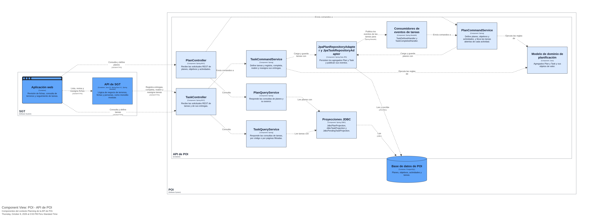

PlanController atiende a la aplicación web, y TaskController atiende tanto a la aplicación web como a la API de SGT, que registra y revisa las entregas de las tareas. Los servicios de comandos aplican las reglas del modelo de dominio y guardan los agregados con los adaptadores JPA; los servicios de consulta leen con proyecciones JDBC. Los adaptadores JPA publican los eventos de las tareas, y sus consumidores envían al servicio de comandos de planes las tareas que se definen y se completan, para que el plan lleve su avance.

<h3 id="planning-code-level">Bounded Context Software Architecture Code Level Diagrams</h3>

<h4 id="planning-class-diagram">Bounded Context Domain Layer Class Diagrams</h4>

La capa de dominio de Planning se presenta en dos diagramas de clases UML, uno por agregado. Se elaboraron en LucidChart.

El primer diagrama muestra el agregado Plan. Plan compone sus objetivos y cada objetivo compone sus actividades, con multiplicidad 0..* porque se definen después del plan.

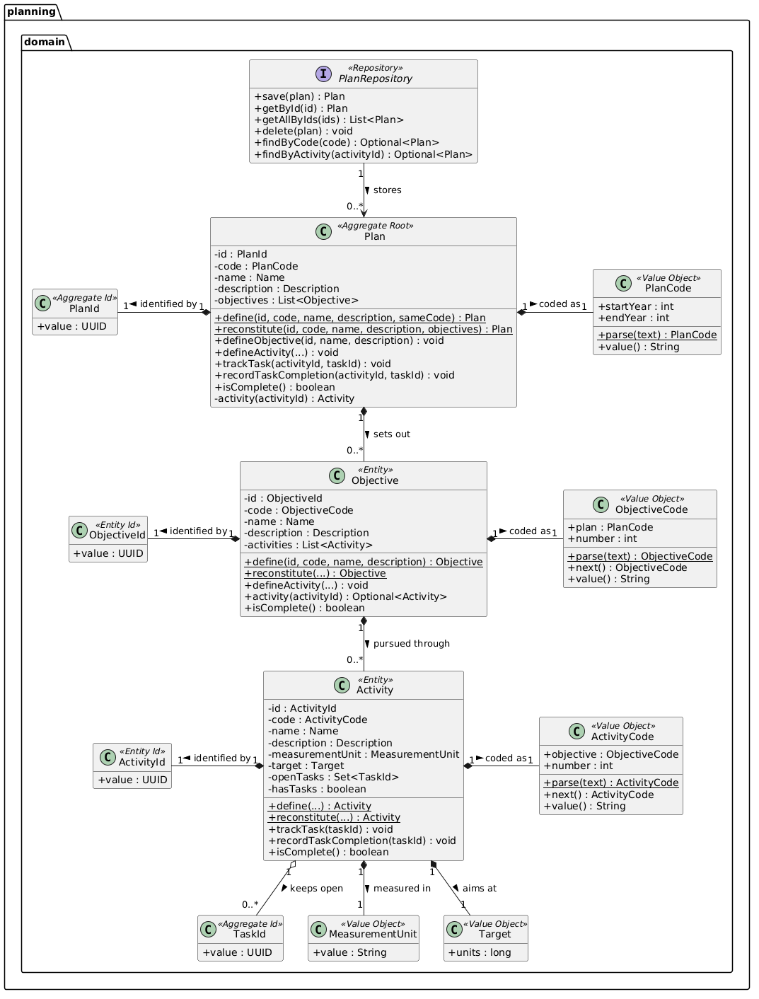

El segundo diagrama muestra el agregado Task. Task referencia a su actividad por identidad, ya que pertenece al agregado Plan, y BeneficiaryFollowUpTask la especializa.

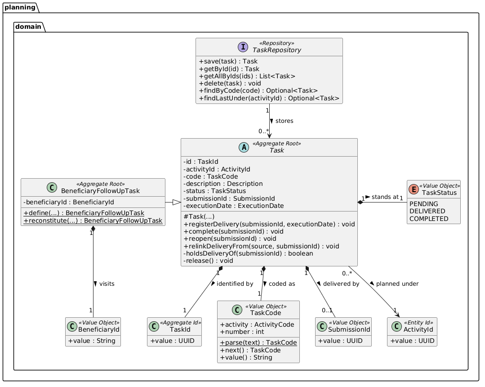

Name y Description aparecen como tipos de los atributos, sin clase propia en los diagramas.

<h4 id="planning-db-diagram">Bounded Context Database Design Diagram</h4>

El siguiente diagrama de base de datos muestra las tablas de Planning en la base de datos PostgreSQL de poi. Se elaboró en LucidChart a partir de las migraciones Flyway del servicio.

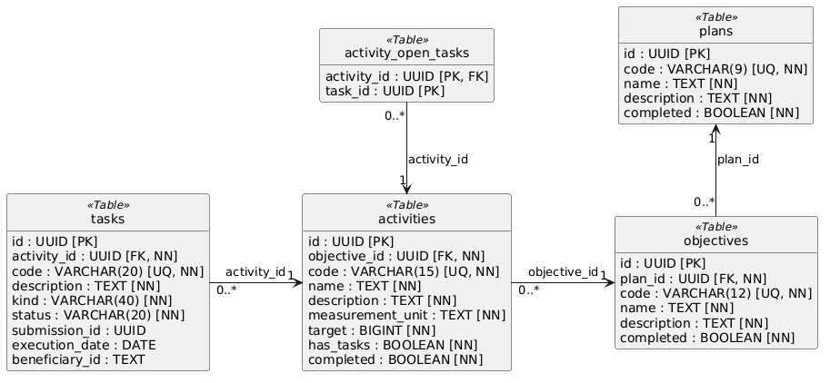

Las tablas plans, objectives y activities guardan el agregado Plan, cada una con una clave foránea hacia su padre y un código único. La tabla tasks guarda el agregado Task con una clave foránea hacia su actividad; la columna kind indica el tipo de tarea, y las restricciones CHECK exigen que una tarea pendiente no tenga entrega, que una entrega traiga su fecha de ejecución y que una tarea de seguimiento indique a su beneficiario. El índice sobre la actividad y el estado atiende la consulta de tareas pendientes.

## Bounded Context: Directory

Directory es el módulo del servicio staff que representa el directorio de personal de la organización. Responde las mismas preguntas que respondería un directorio LDAP: si una contraseña abre una cuenta, quiénes son ciertas personas y a qué grupos pertenece una persona. Las personas y los grupos se identifican por el objectGUID de su cuenta.

Sus consumidores son el módulo Identity Provider, que lo usa para autenticar a quien inicia sesión y para armar sus tokens, y el módulo People de sgt, que resuelve las identidades del personal en datos para mostrar.

<h3 id="directory-domain-layer">Domain Layer</h3>

El agregado Person describe a una persona del directorio. Su cargo y su área dicen quién es dentro de la organización y no le otorgan ningún permiso en ninguna aplicación; los permisos se asignan a grupos en Identity Provider. Una persona sin hash de contraseña es una entrada del directorio que no puede iniciar sesión.

<table style="width: 100%; border-collapse: collapse; border: 1px solid #333; font-family: Arial, sans-serif; font-size: 12px; table-layout: fixed; overflow-wrap: anywhere; word-break: break-word;">
    <thead>
        <tr>
            <th style="border: 1px solid #333; padding: 6px 8px; text-align: left; width: 21%;">Clase</th>
            <th style="border: 1px solid #333; padding: 6px 8px; text-align: left; width: 13%;">Categoría</th>
            <th style="border: 1px solid #333; padding: 6px 8px; text-align: left; width: 16%;">Propósito</th>
            <th style="border: 1px solid #333; padding: 6px 8px; text-align: left; width: 25%;">Atributos</th>
            <th style="border: 1px solid #333; padding: 6px 8px; text-align: left; width: 25%;">Métodos</th>
        </tr>
    </thead>
    <tbody>
        <tr>
            <td style="border: 1px solid #333; padding: 6px 8px; vertical-align: top;">Person</td>
            <td style="border: 1px solid #333; padding: 6px 8px; vertical-align: top;">Aggregate Root</td>
            <td style="border: 1px solid #333; padding: 6px 8px; vertical-align: top;">Persona del directorio de la organización.</td>
            <td style="border: 1px solid #333; padding: 6px 8px; vertical-align: top;">- id: PersonId - username: Username - displayName: DisplayName - jobTitle: JobTitle - department: Department - passwordHash: PasswordHash</td>
            <td style="border: 1px solid #333; padding: 6px 8px; vertical-align: top;">+ reconstitute(id, username, displayName, jobTitle, department, passwordHash): Person</td>
        </tr>
        <tr>
            <td style="border: 1px solid #333; padding: 6px 8px; vertical-align: top;">PersonId</td>
            <td style="border: 1px solid #333; padding: 6px 8px; vertical-align: top;">Aggregate Id</td>
            <td style="border: 1px solid #333; padding: 6px 8px; vertical-align: top;">objectGUID de la cuenta de la persona.</td>
            <td style="border: 1px solid #333; padding: 6px 8px; vertical-align: top;">+ value: UUID</td>
            <td style="border: 1px solid #333; padding: 6px 8px; vertical-align: top;">Ninguno</td>
        </tr>
        <tr>
            <td style="border: 1px solid #333; padding: 6px 8px; vertical-align: top;">Username</td>
            <td style="border: 1px solid #333; padding: 6px 8px; vertical-align: top;">Value Object</td>
            <td style="border: 1px solid #333; padding: 6px 8px; vertical-align: top;">Nombre de cuenta con el que la persona inicia sesión.</td>
            <td style="border: 1px solid #333; padding: 6px 8px; vertical-align: top;">+ value: String</td>
            <td style="border: 1px solid #333; padding: 6px 8px; vertical-align: top;">Ninguno</td>
        </tr>
        <tr>
            <td style="border: 1px solid #333; padding: 6px 8px; vertical-align: top;">DisplayName</td>
            <td style="border: 1px solid #333; padding: 6px 8px; vertical-align: top;">Value Object</td>
            <td style="border: 1px solid #333; padding: 6px 8px; vertical-align: top;">Nombre de la persona tal como se muestra a otros.</td>
            <td style="border: 1px solid #333; padding: 6px 8px; vertical-align: top;">+ value: String</td>
            <td style="border: 1px solid #333; padding: 6px 8px; vertical-align: top;">Ninguno</td>
        </tr>
        <tr>
            <td style="border: 1px solid #333; padding: 6px 8px; vertical-align: top;">JobTitle</td>
            <td style="border: 1px solid #333; padding: 6px 8px; vertical-align: top;">Value Object</td>
            <td style="border: 1px solid #333; padding: 6px 8px; vertical-align: top;">Cargo de la persona según el directorio.</td>
            <td style="border: 1px solid #333; padding: 6px 8px; vertical-align: top;">+ value: String</td>
            <td style="border: 1px solid #333; padding: 6px 8px; vertical-align: top;">Ninguno</td>
        </tr>
        <tr>
            <td style="border: 1px solid #333; padding: 6px 8px; vertical-align: top;">Department</td>
            <td style="border: 1px solid #333; padding: 6px 8px; vertical-align: top;">Value Object</td>
            <td style="border: 1px solid #333; padding: 6px 8px; vertical-align: top;">Área de la organización donde trabaja la persona.</td>
            <td style="border: 1px solid #333; padding: 6px 8px; vertical-align: top;">+ value: String</td>
            <td style="border: 1px solid #333; padding: 6px 8px; vertical-align: top;">Ninguno</td>
        </tr>
        <tr>
            <td style="border: 1px solid #333; padding: 6px 8px; vertical-align: top;">PasswordHash</td>
            <td style="border: 1px solid #333; padding: 6px 8px; vertical-align: top;">Value Object</td>
            <td style="border: 1px solid #333; padding: 6px 8px; vertical-align: top;">Hash BCrypt de la contraseña.</td>
            <td style="border: 1px solid #333; padding: 6px 8px; vertical-align: top;">+ value: String</td>
            <td style="border: 1px solid #333; padding: 6px 8px; vertical-align: top;">Ninguno</td>
        </tr>
        <tr>
            <td style="border: 1px solid #333; padding: 6px 8px; vertical-align: top;">PersonProfile</td>
            <td style="border: 1px solid #333; padding: 6px 8px; vertical-align: top;">Value Object (lenguaje publicado)</td>
            <td style="border: 1px solid #333; padding: 6px 8px; vertical-align: top;">Descripción de una persona que el directorio entrega a otros módulos.</td>
            <td style="border: 1px solid #333; padding: 6px 8px; vertical-align: top;">+ id: UUID + username: String + displayName: String + jobTitle: String + department: String</td>
            <td style="border: 1px solid #333; padding: 6px 8px; vertical-align: top;">Ninguno</td>
        </tr>
        <tr>
            <td style="border: 1px solid #333; padding: 6px 8px; vertical-align: top;">PersonRepository</td>
            <td style="border: 1px solid #333; padding: 6px 8px; vertical-align: top;">Repository</td>
            <td style="border: 1px solid #333; padding: 6px 8px; vertical-align: top;">Persiste y recupera agregados Person.</td>
            <td style="border: 1px solid #333; padding: 6px 8px; vertical-align: top;">Ninguno</td>
            <td style="border: 1px solid #333; padding: 6px 8px; vertical-align: top;">+ save(person): Person + getById(id): Person + getAllByIds(ids): List&lt;Person&gt; + delete(person): void</td>
        </tr>
    </tbody>
</table>

Las reglas del módulo se protegen con las siguientes excepciones. PersonNotFoundException hereda de EntityNotFoundException; el resto hereda de BusinessRuleViolationException.

<table style="width: 100%; border-collapse: collapse; border: 1px solid #333; font-family: Arial, sans-serif; font-size: 14px; table-layout: fixed; overflow-wrap: anywhere; word-break: break-word;">
    <thead>
        <tr>
            <th style="border: 1px solid #333; padding: 8px 10px; text-align: left; width: 35%;">Excepción</th>
            <th style="border: 1px solid #333; padding: 8px 10px; text-align: left; width: 65%;">Regla de negocio que protege</th>
        </tr>
    </thead>
    <tbody>
        <tr>
            <td style="border: 1px solid #333; padding: 10px; vertical-align: top;">MissingPersonIdException</td>
            <td style="border: 1px solid #333; padding: 10px; vertical-align: top;">Toda persona tiene identidad, también en una búsqueda por identidades.</td>
        </tr>
        <tr>
            <td style="border: 1px solid #333; padding: 10px; vertical-align: top;">MissingUsernameException, BlankUsernameException</td>
            <td style="border: 1px solid #333; padding: 10px; vertical-align: top;">Toda persona tiene nombre de cuenta.</td>
        </tr>
        <tr>
            <td style="border: 1px solid #333; padding: 10px; vertical-align: top;">MissingDisplayNameException, BlankDisplayNameException</td>
            <td style="border: 1px solid #333; padding: 10px; vertical-align: top;">Toda persona tiene un nombre visible.</td>
        </tr>
        <tr>
            <td style="border: 1px solid #333; padding: 10px; vertical-align: top;">MissingJobTitleException, BlankJobTitleException</td>
            <td style="border: 1px solid #333; padding: 10px; vertical-align: top;">Toda persona tiene cargo.</td>
        </tr>
        <tr>
            <td style="border: 1px solid #333; padding: 10px; vertical-align: top;">MissingDepartmentException, BlankDepartmentException</td>
            <td style="border: 1px solid #333; padding: 10px; vertical-align: top;">Toda persona tiene área.</td>
        </tr>
        <tr>
            <td style="border: 1px solid #333; padding: 10px; vertical-align: top;">BlankPasswordHashException</td>
            <td style="border: 1px solid #333; padding: 10px; vertical-align: top;">Un hash de contraseña, cuando existe, tiene valor.</td>
        </tr>
        <tr>
            <td style="border: 1px solid #333; padding: 10px; vertical-align: top;">TooManyPeopleRequestedException</td>
            <td style="border: 1px solid #333; padding: 10px; vertical-align: top;">Una búsqueda por identidades resuelve como máximo 100 personas.</td>
        </tr>
        <tr>
            <td style="border: 1px solid #333; padding: 10px; vertical-align: top;">PersonNotFoundException</td>
            <td style="border: 1px solid #333; padding: 10px; vertical-align: top;">Las operaciones sobre una persona se refieren a una persona del directorio.</td>
        </tr>
    </tbody>
</table>

<h3 id="directory-interface-layer">Interface Layer</h3>

La capa de interfaz del directorio es un controlador REST que otros servicios llaman con un token de servicio emitido por Identity Provider. Todas sus rutas exigen el scope people.read.

<table style="width: 100%; border-collapse: collapse; border: 1px solid #333; font-family: Arial, sans-serif; font-size: 14px; table-layout: fixed; overflow-wrap: anywhere; word-break: break-word;">
    <thead>
        <tr>
            <th style="border: 1px solid #333; padding: 8px 10px; text-align: left; width: 40%;">Método y ruta</th>
            <th style="border: 1px solid #333; padding: 8px 10px; text-align: left; width: 40%;">Operación</th>
            <th style="border: 1px solid #333; padding: 8px 10px; text-align: left; width: 20%;">Token</th>
        </tr>
    </thead>
    <tbody>
        <tr>
            <td style="border: 1px solid #333; padding: 10px; vertical-align: top;">GET /api/v3/people</td>
            <td style="border: 1px solid #333; padding: 10px; vertical-align: top;">Lista una página de personas con filtros y orden.</td>
            <td style="border: 1px solid #333; padding: 10px; vertical-align: top;">people.read</td>
        </tr>
        <tr>
            <td style="border: 1px solid #333; padding: 10px; vertical-align: top;">POST /api/v3/people/lookup</td>
            <td style="border: 1px solid #333; padding: 10px; vertical-align: top;">Resuelve hasta 100 identidades en personas, e informa las que nadie tiene.</td>
            <td style="border: 1px solid #333; padding: 10px; vertical-align: top;">people.read</td>
        </tr>
    </tbody>
</table>

<table style="width: 100%; border-collapse: collapse; border: 1px solid #333; font-family: Arial, sans-serif; font-size: 12px; table-layout: fixed; overflow-wrap: anywhere; word-break: break-word;">
    <thead>
        <tr>
            <th style="border: 1px solid #333; padding: 6px 8px; text-align: left; width: 21%;">Clase</th>
            <th style="border: 1px solid #333; padding: 6px 8px; text-align: left; width: 13%;">Categoría</th>
            <th style="border: 1px solid #333; padding: 6px 8px; text-align: left; width: 16%;">Propósito</th>
            <th style="border: 1px solid #333; padding: 6px 8px; text-align: left; width: 25%;">Atributos</th>
            <th style="border: 1px solid #333; padding: 6px 8px; text-align: left; width: 25%;">Métodos</th>
        </tr>
    </thead>
    <tbody>
        <tr>
            <td style="border: 1px solid #333; padding: 6px 8px; vertical-align: top;">PersonController</td>
            <td style="border: 1px solid #333; padding: 6px 8px; vertical-align: top;">Controller</td>
            <td style="border: 1px solid #333; padding: 6px 8px; vertical-align: top;">Expone las consultas del directorio como recursos REST.</td>
            <td style="border: 1px solid #333; padding: 6px 8px; vertical-align: top;">- personQueryService: PersonQueryService</td>
            <td style="border: 1px solid #333; padding: 6px 8px; vertical-align: top;">+ page(jobTitle, department, username, displayName, sort, direction, page, size): PeoplePageResponse + lookup(request): PeopleLookupResponse</td>
        </tr>
        <tr>
            <td style="border: 1px solid #333; padding: 6px 8px; vertical-align: top;">PersonWireMapper</td>
            <td style="border: 1px solid #333; padding: 6px 8px; vertical-align: top;">Wire Mapper</td>
            <td style="border: 1px solid #333; padding: 6px 8px; vertical-align: top;">Traduce parámetros y solicitudes en criterios, y resultados en respuestas.</td>
            <td style="border: 1px solid #333; padding: 6px 8px; vertical-align: top;">Ninguno</td>
            <td style="border: 1px solid #333; padding: 6px 8px; vertical-align: top;">Métodos estáticos to*</td>
        </tr>
        <tr>
            <td style="border: 1px solid #333; padding: 6px 8px; vertical-align: top;">PeopleLookupRequest</td>
            <td style="border: 1px solid #333; padding: 6px 8px; vertical-align: top;">Request</td>
            <td style="border: 1px solid #333; padding: 6px 8px; vertical-align: top;">Identidades a resolver.</td>
            <td style="border: 1px solid #333; padding: 6px 8px; vertical-align: top;">+ ids: List&lt;UUID&gt;</td>
            <td style="border: 1px solid #333; padding: 6px 8px; vertical-align: top;">Ninguno</td>
        </tr>
        <tr>
            <td style="border: 1px solid #333; padding: 6px 8px; vertical-align: top;">PersonResponse</td>
            <td style="border: 1px solid #333; padding: 6px 8px; vertical-align: top;">Response</td>
            <td style="border: 1px solid #333; padding: 6px 8px; vertical-align: top;">Persona del directorio.</td>
            <td style="border: 1px solid #333; padding: 6px 8px; vertical-align: top;">+ id: UUID + username, displayName + jobTitle, department</td>
            <td style="border: 1px solid #333; padding: 6px 8px; vertical-align: top;">Ninguno</td>
        </tr>
        <tr>
            <td style="border: 1px solid #333; padding: 6px 8px; vertical-align: top;">PeoplePageResponse</td>
            <td style="border: 1px solid #333; padding: 6px 8px; vertical-align: top;">Response</td>
            <td style="border: 1px solid #333; padding: 6px 8px; vertical-align: top;">Página de personas.</td>
            <td style="border: 1px solid #333; padding: 6px 8px; vertical-align: top;">+ content: List&lt;PersonResponse&gt; + totalPages, totalElements + page, size</td>
            <td style="border: 1px solid #333; padding: 6px 8px; vertical-align: top;">Ninguno</td>
        </tr>
        <tr>
            <td style="border: 1px solid #333; padding: 6px 8px; vertical-align: top;">PeopleLookupResponse</td>
            <td style="border: 1px solid #333; padding: 6px 8px; vertical-align: top;">Response</td>
            <td style="border: 1px solid #333; padding: 6px 8px; vertical-align: top;">Personas encontradas e identidades sin persona.</td>
            <td style="border: 1px solid #333; padding: 6px 8px; vertical-align: top;">+ found: List&lt;PersonResponse&gt; + notFound: List&lt;UUID&gt;</td>
            <td style="border: 1px solid #333; padding: 6px 8px; vertical-align: top;">Ninguno</td>
        </tr>
    </tbody>
</table>

<h3 id="directory-application-layer">Application Layer</h3>

La capa de aplicación del directorio es de solo lectura: las personas se cargan en el directorio y el servicio las consulta. Expone la interfaz DirectoryApi a los demás módulos de staff y tres servicios de consulta. Los puertos de proyección leen hoy de la base de datos y están definidos de forma que puedan leer de un directorio LDAP sin cambiar a sus consumidores.

<table style="width: 100%; border-collapse: collapse; border: 1px solid #333; font-family: Arial, sans-serif; font-size: 12px; table-layout: fixed; overflow-wrap: anywhere; word-break: break-word;">
    <thead>
        <tr>
            <th style="border: 1px solid #333; padding: 6px 8px; text-align: left; width: 21%;">Clase</th>
            <th style="border: 1px solid #333; padding: 6px 8px; text-align: left; width: 13%;">Categoría</th>
            <th style="border: 1px solid #333; padding: 6px 8px; text-align: left; width: 16%;">Propósito</th>
            <th style="border: 1px solid #333; padding: 6px 8px; text-align: left; width: 25%;">Atributos</th>
            <th style="border: 1px solid #333; padding: 6px 8px; text-align: left; width: 25%;">Métodos</th>
        </tr>
    </thead>
    <tbody>
        <tr>
            <td style="border: 1px solid #333; padding: 6px 8px; vertical-align: top;">DirectoryApi</td>
            <td style="border: 1px solid #333; padding: 6px 8px; vertical-align: top;">Module API</td>
            <td style="border: 1px solid #333; padding: 6px 8px; vertical-align: top;">Contrato que el directorio ofrece a los demás módulos.</td>
            <td style="border: 1px solid #333; padding: 6px 8px; vertical-align: top;">Ninguno</td>
            <td style="border: 1px solid #333; padding: 6px 8px; vertical-align: top;">+ authenticate(username, password): Optional&lt;UUID&gt; + findPeople(ids): List&lt;PersonProfile&gt; + groupsOf(personId): List&lt;UUID&gt;</td>
        </tr>
        <tr>
            <td style="border: 1px solid #333; padding: 6px 8px; vertical-align: top;">DirectoryApiService</td>
            <td style="border: 1px solid #333; padding: 6px 8px; vertical-align: top;">Application Service</td>
            <td style="border: 1px solid #333; padding: 6px 8px; vertical-align: top;">Implementa DirectoryApi a través de los servicios de consulta.</td>
            <td style="border: 1px solid #333; padding: 6px 8px; vertical-align: top;">- accountQueryService - personQueryService - groupQueryService</td>
            <td style="border: 1px solid #333; padding: 6px 8px; vertical-align: top;">+ authenticate(username, password): Optional&lt;UUID&gt; + findPeople(ids): List&lt;PersonProfile&gt; + groupsOf(personId): List&lt;UUID&gt;</td>
        </tr>
        <tr>
            <td style="border: 1px solid #333; padding: 6px 8px; vertical-align: top;">AccountQueryService</td>
            <td style="border: 1px solid #333; padding: 6px 8px; vertical-align: top;">Query Service</td>
            <td style="border: 1px solid #333; padding: 6px 8px; vertical-align: top;">Verifica las credenciales con las que una persona inicia sesión.</td>
            <td style="border: 1px solid #333; padding: 6px 8px; vertical-align: top;">- credentialProjection: CredentialProjection</td>
            <td style="border: 1px solid #333; padding: 6px 8px; vertical-align: top;">+ authenticate(Credentials): AuthenticationResult</td>
        </tr>
        <tr>
            <td style="border: 1px solid #333; padding: 6px 8px; vertical-align: top;">Credentials</td>
            <td style="border: 1px solid #333; padding: 6px 8px; vertical-align: top;">Query Criteria</td>
            <td style="border: 1px solid #333; padding: 6px 8px; vertical-align: top;">Usuario y contraseña ingresados; la contraseña nunca aparece en su representación textual.</td>
            <td style="border: 1px solid #333; padding: 6px 8px; vertical-align: top;">+ username: String + password: String</td>
            <td style="border: 1px solid #333; padding: 6px 8px; vertical-align: top;">+ toString(): String</td>
        </tr>
        <tr>
            <td style="border: 1px solid #333; padding: 6px 8px; vertical-align: top;">AuthenticationResult</td>
            <td style="border: 1px solid #333; padding: 6px 8px; vertical-align: top;">Query Result</td>
            <td style="border: 1px solid #333; padding: 6px 8px; vertical-align: top;">Resultado de verificar credenciales, con la identidad de la persona si son válidas.</td>
            <td style="border: 1px solid #333; padding: 6px 8px; vertical-align: top;">+ authenticated: boolean + personId: UUID</td>
            <td style="border: 1px solid #333; padding: 6px 8px; vertical-align: top;">Ninguno</td>
        </tr>
        <tr>
            <td style="border: 1px solid #333; padding: 6px 8px; vertical-align: top;">CredentialProjection</td>
            <td style="border: 1px solid #333; padding: 6px 8px; vertical-align: top;">Projection</td>
            <td style="border: 1px solid #333; padding: 6px 8px; vertical-align: top;">Puerto que verifica una contraseña contra el directorio.</td>
            <td style="border: 1px solid #333; padding: 6px 8px; vertical-align: top;">Ninguno</td>
            <td style="border: 1px solid #333; padding: 6px 8px; vertical-align: top;">+ findAuthenticated(Credentials): Optional&lt;UUID&gt;</td>
        </tr>
        <tr>
            <td style="border: 1px solid #333; padding: 6px 8px; vertical-align: top;">PersonQueryService</td>
            <td style="border: 1px solid #333; padding: 6px 8px; vertical-align: top;">Query Service</td>
            <td style="border: 1px solid #333; padding: 6px 8px; vertical-align: top;">Consulta personas por página con filtros, o por lotes de identidades.</td>
            <td style="border: 1px solid #333; padding: 6px 8px; vertical-align: top;">- personProjection: PersonProjection - MAX_LOOKUP_SIZE: int = 100</td>
            <td style="border: 1px solid #333; padding: 6px 8px; vertical-align: top;">+ page(PeoplePage): PeoplePageResult + lookup(PeopleById): PeopleLookupResult</td>
        </tr>
        <tr>
            <td style="border: 1px solid #333; padding: 6px 8px; vertical-align: top;">PeoplePage</td>
            <td style="border: 1px solid #333; padding: 6px 8px; vertical-align: top;">Query Criteria</td>
            <td style="border: 1px solid #333; padding: 6px 8px; vertical-align: top;">Página de personas, opcionalmente filtrada por cargo, área, usuario o nombre, y ordenada por la columna indicada.</td>
            <td style="border: 1px solid #333; padding: 6px 8px; vertical-align: top;">+ jobTitle, department + username, displayName + sort, direction + page, size: int</td>
            <td style="border: 1px solid #333; padding: 6px 8px; vertical-align: top;">Ninguno</td>
        </tr>
        <tr>
            <td style="border: 1px solid #333; padding: 6px 8px; vertical-align: top;">PeopleById</td>
            <td style="border: 1px solid #333; padding: 6px 8px; vertical-align: top;">Query Criteria</td>
            <td style="border: 1px solid #333; padding: 6px 8px; vertical-align: top;">Personas con los GUID indicados.</td>
            <td style="border: 1px solid #333; padding: 6px 8px; vertical-align: top;">+ ids: List&lt;UUID&gt;</td>
            <td style="border: 1px solid #333; padding: 6px 8px; vertical-align: top;">Ninguno</td>
        </tr>
        <tr>
            <td style="border: 1px solid #333; padding: 6px 8px; vertical-align: top;">PersonResult</td>
            <td style="border: 1px solid #333; padding: 6px 8px; vertical-align: top;">Query Result</td>
            <td style="border: 1px solid #333; padding: 6px 8px; vertical-align: top;">Persona tal como la conocen otros servicios.</td>
            <td style="border: 1px solid #333; padding: 6px 8px; vertical-align: top;">+ id: UUID + username, displayName + jobTitle, department</td>
            <td style="border: 1px solid #333; padding: 6px 8px; vertical-align: top;">Ninguno</td>
        </tr>
        <tr>
            <td style="border: 1px solid #333; padding: 6px 8px; vertical-align: top;">PeoplePageResult</td>
            <td style="border: 1px solid #333; padding: 6px 8px; vertical-align: top;">Query Result</td>
            <td style="border: 1px solid #333; padding: 6px 8px; vertical-align: top;">Página de personas en el orden solicitado.</td>
            <td style="border: 1px solid #333; padding: 6px 8px; vertical-align: top;">+ content: List&lt;PersonResult&gt; + totalPages: int + totalElements: long + page, size: int</td>
            <td style="border: 1px solid #333; padding: 6px 8px; vertical-align: top;">Ninguno</td>
        </tr>
        <tr>
            <td style="border: 1px solid #333; padding: 6px 8px; vertical-align: top;">PeopleLookupResult</td>
            <td style="border: 1px solid #333; padding: 6px 8px; vertical-align: top;">Query Result</td>
            <td style="border: 1px solid #333; padding: 6px 8px; vertical-align: top;">Personas encontradas y GUID que nadie tiene en el directorio.</td>
            <td style="border: 1px solid #333; padding: 6px 8px; vertical-align: top;">+ found: List&lt;PersonResult&gt; + notFound: List&lt;UUID&gt;</td>
            <td style="border: 1px solid #333; padding: 6px 8px; vertical-align: top;">Ninguno</td>
        </tr>
        <tr>
            <td style="border: 1px solid #333; padding: 6px 8px; vertical-align: top;">PersonProjection</td>
            <td style="border: 1px solid #333; padding: 6px 8px; vertical-align: top;">Projection</td>
            <td style="border: 1px solid #333; padding: 6px 8px; vertical-align: top;">Puerto de lectura de las personas del directorio.</td>
            <td style="border: 1px solid #333; padding: 6px 8px; vertical-align: top;">Ninguno</td>
            <td style="border: 1px solid #333; padding: 6px 8px; vertical-align: top;">+ findPage(PeoplePage): PeoplePageResult + findByIds(PeopleById): List&lt;PersonResult&gt;</td>
        </tr>
        <tr>
            <td style="border: 1px solid #333; padding: 6px 8px; vertical-align: top;">GroupQueryService</td>
            <td style="border: 1px solid #333; padding: 6px 8px; vertical-align: top;">Query Service</td>
            <td style="border: 1px solid #333; padding: 6px 8px; vertical-align: top;">Consulta los grupos a los que pertenece una persona.</td>
            <td style="border: 1px solid #333; padding: 6px 8px; vertical-align: top;">- groupMembershipProjection: GroupMembershipProjection</td>
            <td style="border: 1px solid #333; padding: 6px 8px; vertical-align: top;">+ groupsOf(GroupsOfPerson): GroupMembershipResult</td>
        </tr>
        <tr>
            <td style="border: 1px solid #333; padding: 6px 8px; vertical-align: top;">GroupsOfPerson</td>
            <td style="border: 1px solid #333; padding: 6px 8px; vertical-align: top;">Query Criteria</td>
            <td style="border: 1px solid #333; padding: 6px 8px; vertical-align: top;">Grupos de una persona.</td>
            <td style="border: 1px solid #333; padding: 6px 8px; vertical-align: top;">+ personId: UUID</td>
            <td style="border: 1px solid #333; padding: 6px 8px; vertical-align: top;">Ninguno</td>
        </tr>
        <tr>
            <td style="border: 1px solid #333; padding: 6px 8px; vertical-align: top;">GroupMembershipResult</td>
            <td style="border: 1px solid #333; padding: 6px 8px; vertical-align: top;">Query Result</td>
            <td style="border: 1px solid #333; padding: 6px 8px; vertical-align: top;">Identidades de los grupos de la persona.</td>
            <td style="border: 1px solid #333; padding: 6px 8px; vertical-align: top;">+ groupIds: List&lt;UUID&gt;</td>
            <td style="border: 1px solid #333; padding: 6px 8px; vertical-align: top;">Ninguno</td>
        </tr>
        <tr>
            <td style="border: 1px solid #333; padding: 6px 8px; vertical-align: top;">GroupMembershipProjection</td>
            <td style="border: 1px solid #333; padding: 6px 8px; vertical-align: top;">Projection</td>
            <td style="border: 1px solid #333; padding: 6px 8px; vertical-align: top;">Puerto de lectura de la pertenencia a grupos.</td>
            <td style="border: 1px solid #333; padding: 6px 8px; vertical-align: top;">Ninguno</td>
            <td style="border: 1px solid #333; padding: 6px 8px; vertical-align: top;">+ findGroupIds(GroupsOfPerson): List&lt;UUID&gt;</td>
        </tr>
    </tbody>
</table>

El módulo atiende la historia SGT-10 (iniciar sesión con credenciales institucionales) junto con Identity Provider, que usa authenticate para validar a quien inicia sesión.

<h3 id="directory-infrastructure-layer">Infrastructure Layer</h3>

La capa de infraestructura lee el directorio de la base de datos PostgreSQL de staff. Los puertos de proyección están separados por la pregunta que responden (credenciales, personas y grupos), de modo que cada uno puede pasar a leer de un directorio LDAP por separado.

<table style="width: 100%; border-collapse: collapse; border: 1px solid #333; font-family: Arial, sans-serif; font-size: 12px; table-layout: fixed; overflow-wrap: anywhere; word-break: break-word;">
    <thead>
        <tr>
            <th style="border: 1px solid #333; padding: 6px 8px; text-align: left; width: 21%;">Clase</th>
            <th style="border: 1px solid #333; padding: 6px 8px; text-align: left; width: 13%;">Categoría</th>
            <th style="border: 1px solid #333; padding: 6px 8px; text-align: left; width: 16%;">Propósito</th>
            <th style="border: 1px solid #333; padding: 6px 8px; text-align: left; width: 25%;">Atributos</th>
            <th style="border: 1px solid #333; padding: 6px 8px; text-align: left; width: 25%;">Métodos</th>
        </tr>
    </thead>
    <tbody>
        <tr>
            <td style="border: 1px solid #333; padding: 6px 8px; vertical-align: top;">JpaPersonRepositoryAdapter</td>
            <td style="border: 1px solid #333; padding: 6px 8px; vertical-align: top;">Repository Adapter</td>
            <td style="border: 1px solid #333; padding: 6px 8px; vertical-align: top;">Implementa PersonRepository con JPA.</td>
            <td style="border: 1px solid #333; padding: 6px 8px; vertical-align: top;">- delegate: PersonJpaRepository - publisher: ApplicationEventPublisher</td>
            <td style="border: 1px solid #333; padding: 6px 8px; vertical-align: top;">+ save(person): Person + getById(id): Person</td>
        </tr>
        <tr>
            <td style="border: 1px solid #333; padding: 6px 8px; vertical-align: top;">PersonEntity</td>
            <td style="border: 1px solid #333; padding: 6px 8px; vertical-align: top;">JPA Entity</td>
            <td style="border: 1px solid #333; padding: 6px 8px; vertical-align: top;">Fila de la tabla people.</td>
            <td style="border: 1px solid #333; padding: 6px 8px; vertical-align: top;">id, username, displayName jobTitle, department passwordHash</td>
            <td style="border: 1px solid #333; padding: 6px 8px; vertical-align: top;">Getters</td>
        </tr>
        <tr>
            <td style="border: 1px solid #333; padding: 6px 8px; vertical-align: top;">PersonJpaRepository</td>
            <td style="border: 1px solid #333; padding: 6px 8px; vertical-align: top;">Spring Data Repository</td>
            <td style="border: 1px solid #333; padding: 6px 8px; vertical-align: top;">Acceso JPA a people.</td>
            <td style="border: 1px solid #333; padding: 6px 8px; vertical-align: top;">Ninguno</td>
            <td style="border: 1px solid #333; padding: 6px 8px; vertical-align: top;">Métodos derivados de JpaRepository</td>
        </tr>
        <tr>
            <td style="border: 1px solid #333; padding: 6px 8px; vertical-align: top;">JdbcCredentialProjection</td>
            <td style="border: 1px solid #333; padding: 6px 8px; vertical-align: top;">Projection Adapter</td>
            <td style="border: 1px solid #333; padding: 6px 8px; vertical-align: top;">Implementa CredentialProjection comparando la contraseña con el hash BCrypt guardado.</td>
            <td style="border: 1px solid #333; padding: 6px 8px; vertical-align: top;">- jdbc: NamedParameterJdbcTemplate</td>
            <td style="border: 1px solid #333; padding: 6px 8px; vertical-align: top;">+ findAuthenticated(Credentials): Optional&lt;UUID&gt;</td>
        </tr>
        <tr>
            <td style="border: 1px solid #333; padding: 6px 8px; vertical-align: top;">JdbcPersonProjection</td>
            <td style="border: 1px solid #333; padding: 6px 8px; vertical-align: top;">Projection Adapter</td>
            <td style="border: 1px solid #333; padding: 6px 8px; vertical-align: top;">Implementa PersonProjection con SQL sobre people.</td>
            <td style="border: 1px solid #333; padding: 6px 8px; vertical-align: top;">- jdbc: NamedParameterJdbcTemplate</td>
            <td style="border: 1px solid #333; padding: 6px 8px; vertical-align: top;">+ findPage(PeoplePage): PeoplePageResult + findByIds(PeopleById): List&lt;PersonResult&gt;</td>
        </tr>
        <tr>
            <td style="border: 1px solid #333; padding: 6px 8px; vertical-align: top;">JdbcGroupMembershipProjection</td>
            <td style="border: 1px solid #333; padding: 6px 8px; vertical-align: top;">Projection Adapter</td>
            <td style="border: 1px solid #333; padding: 6px 8px; vertical-align: top;">Implementa GroupMembershipProjection con SQL sobre group_members.</td>
            <td style="border: 1px solid #333; padding: 6px 8px; vertical-align: top;">- jdbc: NamedParameterJdbcTemplate</td>
            <td style="border: 1px solid #333; padding: 6px 8px; vertical-align: top;">+ findGroupIds(GroupsOfPerson): List&lt;UUID&gt;</td>
        </tr>
    </tbody>
</table>

<h3 id="directory-component-level">Bounded Context Software Architecture Component Level Diagrams</h3>

El siguiente diagrama de componentes del modelo C4 muestra los componentes de Directory dentro de la API de Staff y los contenedores con los que se comunican. Se elaboró en Structurizr, en la vista Componentes-Directory del workspace de la solución.

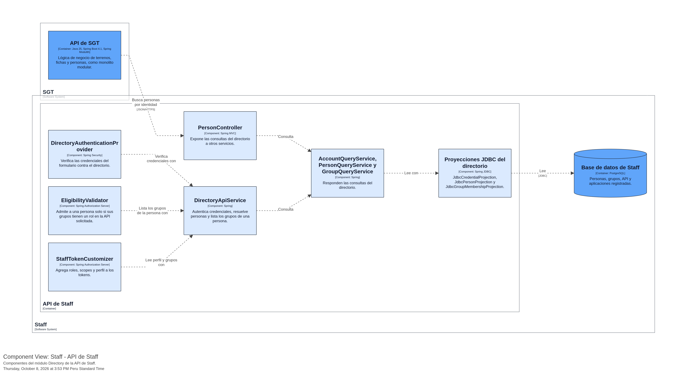

PersonController atiende las consultas de la API de SGT, y DirectoryApiService atiende a los componentes de Identity Provider dentro del mismo servicio. Ambos usan los servicios de consulta, que leen la base de datos de Staff con proyecciones JDBC.

<h3 id="directory-code-level">Bounded Context Software Architecture Code Level Diagrams</h3>

<h4 id="directory-class-diagram">Bounded Context Domain Layer Class Diagrams</h4>

El siguiente diagrama de clases UML muestra la capa de dominio de Directory, junto con su lenguaje publicado. Se elaboró en LucidChart.

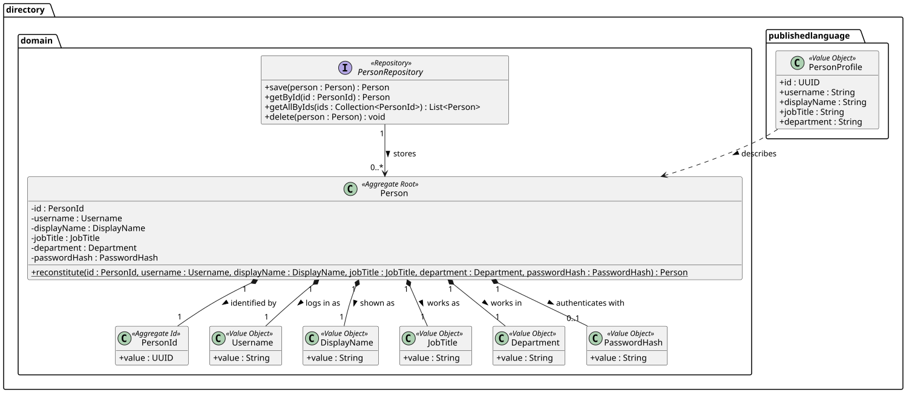

Person compone su identidad y los objetos de valor que la describen, con multiplicidad 0..1 para el hash de contraseña, que falta en las personas que no inician sesión. PersonProfile es la vista de la persona que el módulo entrega a otros.

<h4 id="directory-db-diagram">Bounded Context Database Design Diagram</h4>

El siguiente diagrama de base de datos muestra las tablas de Directory en la base de datos PostgreSQL de staff. Se elaboró en LucidChart a partir de las migraciones Flyway del servicio.

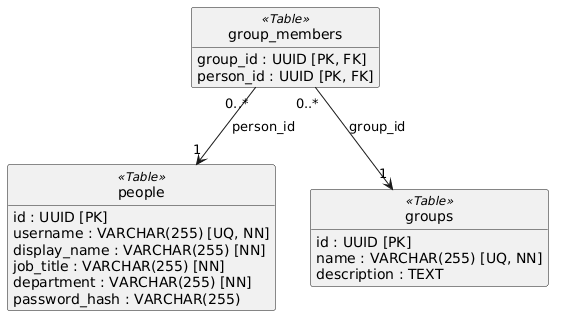

La tabla people guarda a las personas del directorio, con el nombre de usuario único y el hash de contraseña opcional. Las tablas groups y group_members guardan los grupos y la pertenencia de cada persona, con clave primaria compuesta y eliminación en cascada.

## Bounded Context: Identity Provider

Identity Provider es el módulo del servicio staff que emite los tokens con los que las aplicaciones de la organización autentican a las personas y a los servicios. Registra las aplicaciones cliente y las API que protege, y decide qué roles tiene una persona en cada API según los grupos del directorio a los que pertenece. Atiende la épica EP-05 (autenticación) y las historias SGT-10 y SGT-11.

<h3 id="identityprovider-domain-layer">Domain Layer</h3>

El dominio tiene dos agregados. ApiResource representa una API registrada, una por despliegue (por ejemplo, sgt-api-dev y sgt-api-prod), y define los roles que pueden tener las personas que la llaman y los scopes que se pueden otorgar a los servicios. Qué significa cada rol o scope lo decide la propia API.

ClientRegistration representa una aplicación registrada, también una por despliegue. Un cliente público, como un frontend, inicia sesión en nombre de las personas y prueba su identidad con PKCE; un cliente confidencial, como un backend, obtiene tokens para sí mismo con su secreto. Cualquiera de los dos solo obtiene tokens para las API a las que está vinculado.

<table style="width: 100%; border-collapse: collapse; border: 1px solid #333; font-family: Arial, sans-serif; font-size: 12px; table-layout: fixed; overflow-wrap: anywhere; word-break: break-word;">
    <thead>
        <tr>
            <th style="border: 1px solid #333; padding: 6px 8px; text-align: left; width: 21%;">Clase</th>
            <th style="border: 1px solid #333; padding: 6px 8px; text-align: left; width: 13%;">Categoría</th>
            <th style="border: 1px solid #333; padding: 6px 8px; text-align: left; width: 16%;">Propósito</th>
            <th style="border: 1px solid #333; padding: 6px 8px; text-align: left; width: 25%;">Atributos</th>
            <th style="border: 1px solid #333; padding: 6px 8px; text-align: left; width: 25%;">Métodos</th>
        </tr>
    </thead>
    <tbody>
        <tr>
            <td style="border: 1px solid #333; padding: 6px 8px; vertical-align: top;">ApiResource</td>
            <td style="border: 1px solid #333; padding: 6px 8px; vertical-align: top;">Aggregate Root</td>
            <td style="border: 1px solid #333; padding: 6px 8px; vertical-align: top;">API registrada en el proveedor de identidad.</td>
            <td style="border: 1px solid #333; padding: 6px 8px; vertical-align: top;">- id: ApiResourceId - identifier: ResourceIdentifier - roles: Set&lt;AppRole&gt; - scopes: Set&lt;ServiceScope&gt;</td>
            <td style="border: 1px solid #333; padding: 6px 8px; vertical-align: top;">+ reconstitute(id, identifier, roles, scopes): ApiResource</td>
        </tr>
        <tr>
            <td style="border: 1px solid #333; padding: 6px 8px; vertical-align: top;">ClientRegistration</td>
            <td style="border: 1px solid #333; padding: 6px 8px; vertical-align: top;">Aggregate Root</td>
            <td style="border: 1px solid #333; padding: 6px 8px; vertical-align: top;">Aplicación registrada que solicita tokens.</td>
            <td style="border: 1px solid #333; padding: 6px 8px; vertical-align: top;">- id: ClientRegistrationId - clientId: ClientId - kind: ClientKind - secretHash: ClientSecretHash - loginRedirectUris: Set&lt;RedirectUri&gt; - logoutRedirectUris: Set&lt;RedirectUri&gt; - resources: Set&lt;ResourceIdentifier&gt;</td>
            <td style="border: 1px solid #333; padding: 6px 8px; vertical-align: top;">+ reconstitute(id, clientId, kind, secretHash, loginRedirectUris, logoutRedirectUris, resources): ClientRegistration</td>
        </tr>
        <tr>
            <td style="border: 1px solid #333; padding: 6px 8px; vertical-align: top;">ApiResourceId</td>
            <td style="border: 1px solid #333; padding: 6px 8px; vertical-align: top;">Aggregate Id</td>
            <td style="border: 1px solid #333; padding: 6px 8px; vertical-align: top;">Identifica una API registrada.</td>
            <td style="border: 1px solid #333; padding: 6px 8px; vertical-align: top;">+ value: UUID</td>
            <td style="border: 1px solid #333; padding: 6px 8px; vertical-align: top;">Ninguno</td>
        </tr>
        <tr>
            <td style="border: 1px solid #333; padding: 6px 8px; vertical-align: top;">ClientRegistrationId</td>
            <td style="border: 1px solid #333; padding: 6px 8px; vertical-align: top;">Aggregate Id</td>
            <td style="border: 1px solid #333; padding: 6px 8px; vertical-align: top;">Identifica el registro de una aplicación.</td>
            <td style="border: 1px solid #333; padding: 6px 8px; vertical-align: top;">+ value: UUID</td>
            <td style="border: 1px solid #333; padding: 6px 8px; vertical-align: top;">Ninguno</td>
        </tr>
        <tr>
            <td style="border: 1px solid #333; padding: 6px 8px; vertical-align: top;">ResourceIdentifier</td>
            <td style="border: 1px solid #333; padding: 6px 8px; vertical-align: top;">Value Object</td>
            <td style="border: 1px solid #333; padding: 6px 8px; vertical-align: top;">Nombre de la API en los tokens: la audiencia del token y el scope que lo solicita.</td>
            <td style="border: 1px solid #333; padding: 6px 8px; vertical-align: top;">+ value: String</td>
            <td style="border: 1px solid #333; padding: 6px 8px; vertical-align: top;">Ninguno</td>
        </tr>
        <tr>
            <td style="border: 1px solid #333; padding: 6px 8px; vertical-align: top;">AppRole</td>
            <td style="border: 1px solid #333; padding: 6px 8px; vertical-align: top;">Value Object</td>
            <td style="border: 1px solid #333; padding: 6px 8px; vertical-align: top;">Rol que una API define para las personas que la llaman.</td>
            <td style="border: 1px solid #333; padding: 6px 8px; vertical-align: top;">+ value: String</td>
            <td style="border: 1px solid #333; padding: 6px 8px; vertical-align: top;">Ninguno</td>
        </tr>
        <tr>
            <td style="border: 1px solid #333; padding: 6px 8px; vertical-align: top;">ServiceScope</td>
            <td style="border: 1px solid #333; padding: 6px 8px; vertical-align: top;">Value Object</td>
            <td style="border: 1px solid #333; padding: 6px 8px; vertical-align: top;">Permiso que una API define para los servicios que la llaman por cuenta propia.</td>
            <td style="border: 1px solid #333; padding: 6px 8px; vertical-align: top;">+ value: String</td>
            <td style="border: 1px solid #333; padding: 6px 8px; vertical-align: top;">Ninguno</td>
        </tr>
        <tr>
            <td style="border: 1px solid #333; padding: 6px 8px; vertical-align: top;">ClientId</td>
            <td style="border: 1px solid #333; padding: 6px 8px; vertical-align: top;">Value Object</td>
            <td style="border: 1px solid #333; padding: 6px 8px; vertical-align: top;">Nombre público de una aplicación registrada.</td>
            <td style="border: 1px solid #333; padding: 6px 8px; vertical-align: top;">+ value: String</td>
            <td style="border: 1px solid #333; padding: 6px 8px; vertical-align: top;">Ninguno</td>
        </tr>
        <tr>
            <td style="border: 1px solid #333; padding: 6px 8px; vertical-align: top;">ClientKind</td>
            <td style="border: 1px solid #333; padding: 6px 8px; vertical-align: top;">Value Object (enum)</td>
            <td style="border: 1px solid #333; padding: 6px 8px; vertical-align: top;">Indica si la aplicación puede guardar un secreto.</td>
            <td style="border: 1px solid #333; padding: 6px 8px; vertical-align: top;">PUBLIC CONFIDENTIAL</td>
            <td style="border: 1px solid #333; padding: 6px 8px; vertical-align: top;">Ninguno</td>
        </tr>
        <tr>
            <td style="border: 1px solid #333; padding: 6px 8px; vertical-align: top;">ClientSecretHash</td>
            <td style="border: 1px solid #333; padding: 6px 8px; vertical-align: top;">Value Object</td>
            <td style="border: 1px solid #333; padding: 6px 8px; vertical-align: top;">Hash BCrypt del secreto de un cliente confidencial.</td>
            <td style="border: 1px solid #333; padding: 6px 8px; vertical-align: top;">+ value: String</td>
            <td style="border: 1px solid #333; padding: 6px 8px; vertical-align: top;">Ninguno</td>
        </tr>
        <tr>
            <td style="border: 1px solid #333; padding: 6px 8px; vertical-align: top;">RedirectUri</td>
            <td style="border: 1px solid #333; padding: 6px 8px; vertical-align: top;">Value Object</td>
            <td style="border: 1px solid #333; padding: 6px 8px; vertical-align: top;">Dirección a la que el proveedor puede devolver a la aplicación.</td>
            <td style="border: 1px solid #333; padding: 6px 8px; vertical-align: top;">+ value: String</td>
            <td style="border: 1px solid #333; padding: 6px 8px; vertical-align: top;">Ninguno</td>
        </tr>
    </tbody>
</table>

Las reglas del módulo se protegen con las siguientes excepciones, que heredan de BusinessRuleViolationException.

<table style="width: 100%; border-collapse: collapse; border: 1px solid #333; font-family: Arial, sans-serif; font-size: 14px; table-layout: fixed; overflow-wrap: anywhere; word-break: break-word;">
    <thead>
        <tr>
            <th style="border: 1px solid #333; padding: 8px 10px; text-align: left; width: 60%;">Excepción</th>
            <th style="border: 1px solid #333; padding: 8px 10px; text-align: left; width: 40%;">Regla de negocio que protege</th>
        </tr>
    </thead>
    <tbody>
        <tr>
            <td style="border: 1px solid #333; padding: 10px; vertical-align: top;">MissingApiResourceIdException, MissingClientRegistrationIdException</td>
            <td style="border: 1px solid #333; padding: 10px; vertical-align: top;">Toda API y toda aplicación registrada tienen identidad.</td>
        </tr>
        <tr>
            <td style="border: 1px solid #333; padding: 10px; vertical-align: top;">MissingResourceIdentifierException</td>
            <td style="border: 1px solid #333; padding: 10px; vertical-align: top;">Toda API tiene un identificador.</td>
        </tr>
        <tr>
            <td style="border: 1px solid #333; padding: 10px; vertical-align: top;">MissingClientIdException</td>
            <td style="border: 1px solid #333; padding: 10px; vertical-align: top;">Toda aplicación tiene un nombre público.</td>
        </tr>
        <tr>
            <td style="border: 1px solid #333; padding: 10px; vertical-align: top;">MissingClientKindException</td>
            <td style="border: 1px solid #333; padding: 10px; vertical-align: top;">Toda aplicación indica si es pública o confidencial.</td>
        </tr>
        <tr>
            <td style="border: 1px solid #333; padding: 10px; vertical-align: top;">ConfidentialClientWithoutSecretException</td>
            <td style="border: 1px solid #333; padding: 10px; vertical-align: top;">Un cliente confidencial tiene secreto.</td>
        </tr>
        <tr>
            <td style="border: 1px solid #333; padding: 10px; vertical-align: top;">PublicClientWithSecretException</td>
            <td style="border: 1px solid #333; padding: 10px; vertical-align: top;">Un cliente público no tiene secreto.</td>
        </tr>
        <tr>
            <td style="border: 1px solid #333; padding: 10px; vertical-align: top;">InvalidResourceIdentifierException, InvalidAppRoleException, InvalidServiceScopeException, InvalidClientIdException, InvalidRedirectUriException, InvalidClientSecretHashException</td>
            <td style="border: 1px solid #333; padding: 10px; vertical-align: top;">Identificadores, roles, scopes, nombres de cliente, direcciones y hashes no están vacíos ni contienen espacios.</td>
        </tr>
    </tbody>
</table>

<h3 id="identityprovider-interface-layer">Interface Layer</h3>

El proveedor de identidad expone los endpoints estándar de OAuth 2.1 y OpenID Connect a través de Spring Authorization Server, configurado en la capa de infraestructura, y un formulario de inicio de sesión. Las aplicaciones públicas inician sesión en nombre de las personas con el flujo authorization code con PKCE; las aplicaciones confidenciales, como sgt, obtienen tokens para sí mismas con el flujo client credentials.

<table style="width: 100%; border-collapse: collapse; border: 1px solid #333; font-family: Arial, sans-serif; font-size: 14px; table-layout: fixed; overflow-wrap: anywhere; word-break: break-word;">
    <thead>
        <tr>
            <th style="border: 1px solid #333; padding: 8px 10px; text-align: left; width: 40%;">Endpoint</th>
            <th style="border: 1px solid #333; padding: 8px 10px; text-align: left; width: 60%;">Uso</th>
        </tr>
    </thead>
    <tbody>
        <tr>
            <td style="border: 1px solid #333; padding: 10px; vertical-align: top;">GET /oauth2/authorize</td>
            <td style="border: 1px solid #333; padding: 10px; vertical-align: top;">Inicia el flujo authorization code de una persona.</td>
        </tr>
        <tr>
            <td style="border: 1px solid #333; padding: 10px; vertical-align: top;">GET, POST /login</td>
            <td style="border: 1px solid #333; padding: 10px; vertical-align: top;">Muestra y procesa el formulario de inicio de sesión.</td>
        </tr>
        <tr>
            <td style="border: 1px solid #333; padding: 10px; vertical-align: top;">POST /oauth2/token</td>
            <td style="border: 1px solid #333; padding: 10px; vertical-align: top;">Emite tokens de acceso, de identidad y de actualización.</td>
        </tr>
        <tr>
            <td style="border: 1px solid #333; padding: 10px; vertical-align: top;">GET /oauth2/jwks</td>
            <td style="border: 1px solid #333; padding: 10px; vertical-align: top;">Publica la clave con la que se firman los tokens, para que las API los validen.</td>
        </tr>
        <tr>
            <td style="border: 1px solid #333; padding: 10px; vertical-align: top;">GET /.well-known/openid-configuration</td>
            <td style="border: 1px solid #333; padding: 10px; vertical-align: top;">Publica la configuración del emisor.</td>
        </tr>
        <tr>
            <td style="border: 1px solid #333; padding: 10px; vertical-align: top;">GET /userinfo</td>
            <td style="border: 1px solid #333; padding: 10px; vertical-align: top;">Devuelve los datos de la persona autenticada.</td>
        </tr>
        <tr>
            <td style="border: 1px solid #333; padding: 10px; vertical-align: top;">POST /connect/logout</td>
            <td style="border: 1px solid #333; padding: 10px; vertical-align: top;">Cierra la sesión de la persona.</td>
        </tr>
    </tbody>
</table>

Un inicio de sesión nombra una sola API y, opcionalmente, el rol con el que la persona va a actuar. El token de acceso de una persona lleva como sujeto su objectGUID, en roles el rol activo y en eligible_roles todos los roles que sus grupos tienen en esa API, para que el frontend ofrezca cambiar de rol. El token de un servicio lleva como sujeto su client id y en scope solo lo que se le otorgó. La claim token_use distingue ambos tipos, y cada API decide cuál acepta.

<h3 id="identityprovider-application-layer">Application Layer</h3>

La capa de aplicación del proveedor de identidad define los puertos de lectura que usa el servidor de autorización. No tiene comandos: los registros de aplicaciones y API, y las asignaciones de roles y scopes, se cargan en la base de datos. El flujo de autenticación lo conduce el servidor de autorización de la capa de infraestructura, que consulta estos puertos y la interfaz DirectoryApi del módulo Directory.

<table style="width: 100%; border-collapse: collapse; border: 1px solid #333; font-family: Arial, sans-serif; font-size: 12px; table-layout: fixed; overflow-wrap: anywhere; word-break: break-word;">
    <thead>
        <tr>
            <th style="border: 1px solid #333; padding: 6px 8px; text-align: left; width: 21%;">Clase</th>
            <th style="border: 1px solid #333; padding: 6px 8px; text-align: left; width: 13%;">Categoría</th>
            <th style="border: 1px solid #333; padding: 6px 8px; text-align: left; width: 16%;">Propósito</th>
            <th style="border: 1px solid #333; padding: 6px 8px; text-align: left; width: 25%;">Atributos</th>
            <th style="border: 1px solid #333; padding: 6px 8px; text-align: left; width: 25%;">Métodos</th>
        </tr>
    </thead>
    <tbody>
        <tr>
            <td style="border: 1px solid #333; padding: 6px 8px; vertical-align: top;">ClientProjection</td>
            <td style="border: 1px solid #333; padding: 6px 8px; vertical-align: top;">Projection</td>
            <td style="border: 1px solid #333; padding: 6px 8px; vertical-align: top;">Puerto de lectura de las aplicaciones registradas.</td>
            <td style="border: 1px solid #333; padding: 6px 8px; vertical-align: top;">Ninguno</td>
            <td style="border: 1px solid #333; padding: 6px 8px; vertical-align: top;">+ findByClientId(ClientByClientId): Optional&lt;ClientResult&gt; + findById(ClientById): Optional&lt;ClientResult&gt;</td>
        </tr>
        <tr>
            <td style="border: 1px solid #333; padding: 6px 8px; vertical-align: top;">ClientByClientId</td>
            <td style="border: 1px solid #333; padding: 6px 8px; vertical-align: top;">Query Criteria</td>
            <td style="border: 1px solid #333; padding: 6px 8px; vertical-align: top;">Aplicación por su nombre público.</td>
            <td style="border: 1px solid #333; padding: 6px 8px; vertical-align: top;">+ clientId: String</td>
            <td style="border: 1px solid #333; padding: 6px 8px; vertical-align: top;">Ninguno</td>
        </tr>
        <tr>
            <td style="border: 1px solid #333; padding: 6px 8px; vertical-align: top;">ClientById</td>
            <td style="border: 1px solid #333; padding: 6px 8px; vertical-align: top;">Query Criteria</td>
            <td style="border: 1px solid #333; padding: 6px 8px; vertical-align: top;">Aplicación por la identidad de su registro.</td>
            <td style="border: 1px solid #333; padding: 6px 8px; vertical-align: top;">+ id: UUID</td>
            <td style="border: 1px solid #333; padding: 6px 8px; vertical-align: top;">Ninguno</td>
        </tr>
        <tr>
            <td style="border: 1px solid #333; padding: 6px 8px; vertical-align: top;">ClientResult</td>
            <td style="border: 1px solid #333; padding: 6px 8px; vertical-align: top;">Query Result</td>
            <td style="border: 1px solid #333; padding: 6px 8px; vertical-align: top;">Aplicación registrada con todo lo que el servidor de autorización verifica en sus solicitudes.</td>
            <td style="border: 1px solid #333; padding: 6px 8px; vertical-align: top;">+ id: UUID + clientId, kind, secretHash + loginRedirectUris, logoutRedirectUris + resources, roles, grantedScopes</td>
            <td style="border: 1px solid #333; padding: 6px 8px; vertical-align: top;">Ninguno</td>
        </tr>
        <tr>
            <td style="border: 1px solid #333; padding: 6px 8px; vertical-align: top;">GrantProjection</td>
            <td style="border: 1px solid #333; padding: 6px 8px; vertical-align: top;">Projection</td>
            <td style="border: 1px solid #333; padding: 6px 8px; vertical-align: top;">Puerto de lectura de lo que otorga el proveedor: roles a grupos y scopes a aplicaciones.</td>
            <td style="border: 1px solid #333; padding: 6px 8px; vertical-align: top;">Ninguno</td>
            <td style="border: 1px solid #333; padding: 6px 8px; vertical-align: top;">+ findRoles(RolesOfGroups): List&lt;String&gt; + findScopes(ScopesOfClient): List&lt;String&gt;</td>
        </tr>
        <tr>
            <td style="border: 1px solid #333; padding: 6px 8px; vertical-align: top;">RolesOfGroups</td>
            <td style="border: 1px solid #333; padding: 6px 8px; vertical-align: top;">Query Criteria</td>
            <td style="border: 1px solid #333; padding: 6px 8px; vertical-align: top;">Roles que un conjunto de grupos tiene en una API.</td>
            <td style="border: 1px solid #333; padding: 6px 8px; vertical-align: top;">+ resource: String + groupIds: List&lt;UUID&gt;</td>
            <td style="border: 1px solid #333; padding: 6px 8px; vertical-align: top;">Ninguno</td>
        </tr>
        <tr>
            <td style="border: 1px solid #333; padding: 6px 8px; vertical-align: top;">ScopesOfClient</td>
            <td style="border: 1px solid #333; padding: 6px 8px; vertical-align: top;">Query Criteria</td>
            <td style="border: 1px solid #333; padding: 6px 8px; vertical-align: top;">Scopes otorgados a una aplicación en una API, para los tokens que obtiene para sí misma.</td>
            <td style="border: 1px solid #333; padding: 6px 8px; vertical-align: top;">+ clientId: String + resource: String</td>
            <td style="border: 1px solid #333; padding: 6px 8px; vertical-align: top;">Ninguno</td>
        </tr>
    </tbody>
</table>

<h3 id="identityprovider-infrastructure-layer">Infrastructure Layer</h3>

La capa de infraestructura configura el servidor de autorización y lo conecta con el directorio y con los registros del proveedor de identidad.

<table style="width: 100%; border-collapse: collapse; border: 1px solid #333; font-family: Arial, sans-serif; font-size: 12px; table-layout: fixed; overflow-wrap: anywhere; word-break: break-word;">
    <thead>
        <tr>
            <th style="border: 1px solid #333; padding: 6px 8px; text-align: left; width: 21%;">Clase</th>
            <th style="border: 1px solid #333; padding: 6px 8px; text-align: left; width: 13%;">Categoría</th>
            <th style="border: 1px solid #333; padding: 6px 8px; text-align: left; width: 16%;">Propósito</th>
            <th style="border: 1px solid #333; padding: 6px 8px; text-align: left; width: 25%;">Atributos</th>
            <th style="border: 1px solid #333; padding: 6px 8px; text-align: left; width: 25%;">Métodos</th>
        </tr>
    </thead>
    <tbody>
        <tr>
            <td style="border: 1px solid #333; padding: 6px 8px; vertical-align: top;">AuthorizationServerConfiguration</td>
            <td style="border: 1px solid #333; padding: 6px 8px; vertical-align: top;">Configuration</td>
            <td style="border: 1px solid #333; padding: 6px 8px; vertical-align: top;">Define el emisor y la clave de firma, leída desde archivos para que los tokens sigan siendo válidos tras un reinicio.</td>
            <td style="border: 1px solid #333; padding: 6px 8px; vertical-align: top;">Ninguno</td>
            <td style="border: 1px solid #333; padding: 6px 8px; vertical-align: top;">+ authorizationServerSettings(issuer): AuthorizationServerSettings + authorizationService(): OAuth2AuthorizationService + jwkSource(...): JWKSource</td>
        </tr>
        <tr>
            <td style="border: 1px solid #333; padding: 6px 8px; vertical-align: top;">SecurityConfiguration</td>
            <td style="border: 1px solid #333; padding: 6px 8px; vertical-align: top;">Configuration</td>
            <td style="border: 1px solid #333; padding: 6px 8px; vertical-align: top;">Define tres cadenas de seguridad en orden: los endpoints OpenID Connect, la API del directorio y el formulario de inicio de sesión.</td>
            <td style="border: 1px solid #333; padding: 6px 8px; vertical-align: top;">Ninguno</td>
            <td style="border: 1px solid #333; padding: 6px 8px; vertical-align: top;">~ authorizationServerSecurity(http, eligibility): SecurityFilterChain ~ directoryApiSecurity(...): SecurityFilterChain ~ loginSecurity(http): SecurityFilterChain ~ passwordEncoder(): PasswordEncoder</td>
        </tr>
        <tr>
            <td style="border: 1px solid #333; padding: 6px 8px; vertical-align: top;">ProjectedRegisteredClientRepository</td>
            <td style="border: 1px solid #333; padding: 6px 8px; vertical-align: top;">Adapter</td>
            <td style="border: 1px solid #333; padding: 6px 8px; vertical-align: top;">Entrega al servidor de autorización las aplicaciones registradas, leídas con ClientProjection; rechaza guardar registros.</td>
            <td style="border: 1px solid #333; padding: 6px 8px; vertical-align: top;">- clientProjection: ClientProjection</td>
            <td style="border: 1px solid #333; padding: 6px 8px; vertical-align: top;">+ findById(id): RegisteredClient + findByClientId(clientId): RegisteredClient</td>
        </tr>
        <tr>
            <td style="border: 1px solid #333; padding: 6px 8px; vertical-align: top;">DirectoryAuthenticationProvider</td>
            <td style="border: 1px solid #333; padding: 6px 8px; vertical-align: top;">Adapter</td>
            <td style="border: 1px solid #333; padding: 6px 8px; vertical-align: top;">Verifica las credenciales del formulario con DirectoryApi y nombra a la persona por su objectGUID.</td>
            <td style="border: 1px solid #333; padding: 6px 8px; vertical-align: top;">- directoryApi: DirectoryApi</td>
            <td style="border: 1px solid #333; padding: 6px 8px; vertical-align: top;">+ authenticate(login): Authentication</td>
        </tr>
        <tr>
            <td style="border: 1px solid #333; padding: 6px 8px; vertical-align: top;">EligibilityValidator</td>
            <td style="border: 1px solid #333; padding: 6px 8px; vertical-align: top;">Validator</td>
            <td style="border: 1px solid #333; padding: 6px 8px; vertical-align: top;">Deja entrar a una persona a una aplicación solo si sus grupos tienen un rol en la API solicitada.</td>
            <td style="border: 1px solid #333; padding: 6px 8px; vertical-align: top;">- directoryApi: DirectoryApi - grantProjection: GrantProjection</td>
            <td style="border: 1px solid #333; padding: 6px 8px; vertical-align: top;">+ accept(context): void</td>
        </tr>
        <tr>
            <td style="border: 1px solid #333; padding: 6px 8px; vertical-align: top;">StaffTokenCustomizer</td>
            <td style="border: 1px solid #333; padding: 6px 8px; vertical-align: top;">Token Customizer</td>
            <td style="border: 1px solid #333; padding: 6px 8px; vertical-align: top;">Agrega a cada token las claims de su tipo: roles para personas, scopes para servicios y perfil para el token de identidad.</td>
            <td style="border: 1px solid #333; padding: 6px 8px; vertical-align: top;">- directoryApi: DirectoryApi - grantProjection: GrantProjection</td>
            <td style="border: 1px solid #333; padding: 6px 8px; vertical-align: top;">+ customize(context): void</td>
        </tr>
        <tr>
            <td style="border: 1px solid #333; padding: 6px 8px; vertical-align: top;">RequestedAccess</td>
            <td style="border: 1px solid #333; padding: 6px 8px; vertical-align: top;">Value Object</td>
            <td style="border: 1px solid #333; padding: 6px 8px; vertical-align: top;">Lo que pidió un cliente, leído de sus scopes: la API y el rol con el que actuar.</td>
            <td style="border: 1px solid #333; padding: 6px 8px; vertical-align: top;">+ resources: List&lt;String&gt; + actAs: Optional&lt;String&gt;</td>
            <td style="border: 1px solid #333; padding: 6px 8px; vertical-align: top;">~ resource(): Optional&lt;String&gt;</td>
        </tr>
        <tr>
            <td style="border: 1px solid #333; padding: 6px 8px; vertical-align: top;">JdbcClientProjection</td>
            <td style="border: 1px solid #333; padding: 6px 8px; vertical-align: top;">Projection Adapter</td>
            <td style="border: 1px solid #333; padding: 6px 8px; vertical-align: top;">Implementa ClientProjection con SQL sobre client_registrations y sus tablas relacionadas.</td>
            <td style="border: 1px solid #333; padding: 6px 8px; vertical-align: top;">- jdbc: NamedParameterJdbcTemplate</td>
            <td style="border: 1px solid #333; padding: 6px 8px; vertical-align: top;">+ findByClientId(ClientByClientId): Optional&lt;ClientResult&gt; + findById(ClientById): Optional&lt;ClientResult&gt;</td>
        </tr>
        <tr>
            <td style="border: 1px solid #333; padding: 6px 8px; vertical-align: top;">JdbcGrantProjection</td>
            <td style="border: 1px solid #333; padding: 6px 8px; vertical-align: top;">Projection Adapter</td>
            <td style="border: 1px solid #333; padding: 6px 8px; vertical-align: top;">Implementa GrantProjection con SQL sobre role_assignments y scope_grants.</td>
            <td style="border: 1px solid #333; padding: 6px 8px; vertical-align: top;">- jdbc: NamedParameterJdbcTemplate</td>
            <td style="border: 1px solid #333; padding: 6px 8px; vertical-align: top;">+ findRoles(RolesOfGroups): List&lt;String&gt; + findScopes(ScopesOfClient): List&lt;String&gt;</td>
        </tr>
    </tbody>
</table>

Las autorizaciones en curso se guardan en memoria, por lo que un reinicio cierra todas las sesiones. Los registros de aplicaciones, API, roles y scopes son datos de la base de datos, y el servidor de autorización solo los lee.

<h3 id="identityprovider-component-level">Bounded Context Software Architecture Component Level Diagrams</h3>

El siguiente diagrama de componentes del modelo C4 muestra los componentes de Identity Provider dentro de la API de Staff y los contenedores con los que se comunican. Se elaboró en Structurizr, en la vista Componentes-IdentityProvider del workspace de la solución.

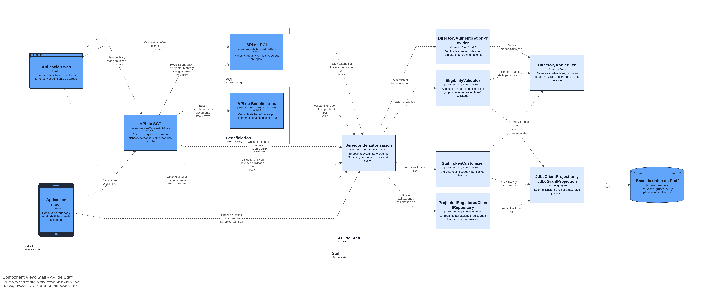

El servidor de autorización atiende el inicio de sesión de la aplicación web y de la aplicación móvil, y la emisión de tokens de servicio a la API de SGT. Para cada solicitud busca la aplicación en ProjectedRegisteredClientRepository, autentica a la persona con DirectoryAuthenticationProvider, valida su acceso con EligibilityValidator y arma el token con StaffTokenCustomizer. Los datos de las personas y sus grupos se obtienen de DirectoryApiService.

<h3 id="identityprovider-code-level">Bounded Context Software Architecture Code Level Diagrams</h3>

<h4 id="identityprovider-class-diagram">Bounded Context Domain Layer Class Diagrams</h4>

El siguiente diagrama de clases UML muestra la capa de dominio de Identity Provider. Se elaboró en LucidChart.

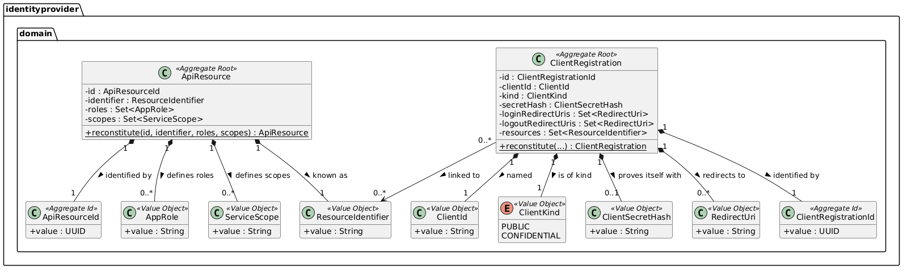

Los dos agregados se relacionan a través de ResourceIdentifier: una aplicación referencia por identificador las API a las que está vinculada. El secreto de ClientRegistration tiene multiplicidad 0..1, porque solo los clientes confidenciales lo tienen.

<h4 id="identityprovider-db-diagram">Bounded Context Database Design Diagram</h4>

El siguiente diagrama de base de datos muestra las tablas de Identity Provider en la base de datos PostgreSQL de staff. Se elaboró en LucidChart a partir de las migraciones Flyway del servicio.

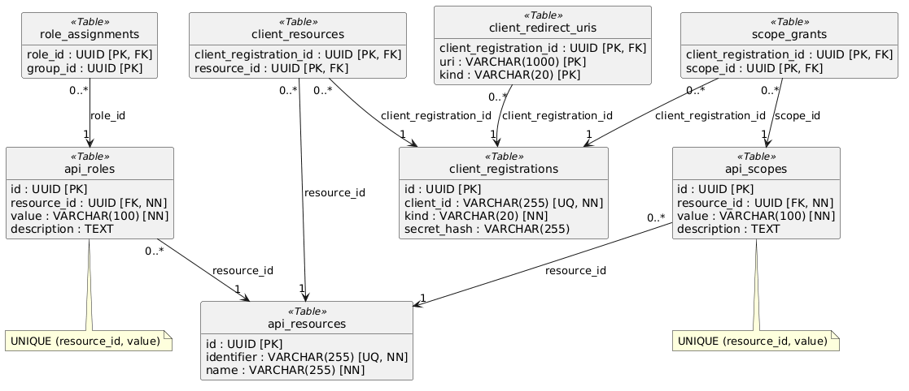

La tabla api_resources guarda las API registradas, y api_roles y api_scopes los roles y scopes que define cada una. La tabla client_registrations guarda las aplicaciones registradas; la restricción CHECK exige secreto solo a los clientes confidenciales. client_redirect_uris y client_resources guardan las direcciones de retorno y las API vinculadas a cada aplicación. role_assignments asigna roles a grupos del directorio, referenciados por identidad, y scope_grants otorga scopes a las aplicaciones.

## Bounded Context: Beneficiarios

Beneficiarios es el contexto que provee la información de los beneficiarios del programa. Se implementa como el servicio beneficiarios, con el módulo registry, que reproduce el registro de beneficiarios de la institución. Es de solo lectura: sus únicos consumidores son otros servicios, que lo consultan con un token de servicio emitido por Staff. sgt lo consulta desde el módulo People para resolver a los beneficiarios a partir de su documento legal.

<h3 id="beneficiarios-domain-layer">Domain Layer</h3>

El agregado Beneficiary describe a una persona atendida por el programa, identificada por su documento legal y ubicada por el distrito donde reside. Como el registro solo se lee, un beneficiario únicamente se reconstituye desde el almacenamiento; el agregado no tiene operaciones de cambio. Ningún par de beneficiarios comparte documento legal.

<table style="width: 100%; border-collapse: collapse; border: 1px solid #333; font-family: Arial, sans-serif; font-size: 12px; table-layout: fixed; overflow-wrap: anywhere; word-break: break-word;">
    <thead>
        <tr>
            <th style="border: 1px solid #333; padding: 6px 8px; text-align: left; width: 21%;">Clase</th>
            <th style="border: 1px solid #333; padding: 6px 8px; text-align: left; width: 13%;">Categoría</th>
            <th style="border: 1px solid #333; padding: 6px 8px; text-align: left; width: 16%;">Propósito</th>
            <th style="border: 1px solid #333; padding: 6px 8px; text-align: left; width: 25%;">Atributos</th>
            <th style="border: 1px solid #333; padding: 6px 8px; text-align: left; width: 25%;">Métodos</th>
        </tr>
    </thead>
    <tbody>
        <tr>
            <td style="border: 1px solid #333; padding: 6px 8px; vertical-align: top;">Beneficiary</td>
            <td style="border: 1px solid #333; padding: 6px 8px; vertical-align: top;">Aggregate Root</td>
            <td style="border: 1px solid #333; padding: 6px 8px; vertical-align: top;">Persona atendida por el programa.</td>
            <td style="border: 1px solid #333; padding: 6px 8px; vertical-align: top;">- id: BeneficiaryId - legalDocument: LegalDocument - name: PersonName - dateOfBirth: DateOfBirth - residence: Ubigeo</td>
            <td style="border: 1px solid #333; padding: 6px 8px; vertical-align: top;">+ reconstitute(id, legalDocument, name, dateOfBirth, residence): Beneficiary</td>
        </tr>
        <tr>
            <td style="border: 1px solid #333; padding: 6px 8px; vertical-align: top;">BeneficiaryId</td>
            <td style="border: 1px solid #333; padding: 6px 8px; vertical-align: top;">Aggregate Id</td>
            <td style="border: 1px solid #333; padding: 6px 8px; vertical-align: top;">Identifica a un beneficiario.</td>
            <td style="border: 1px solid #333; padding: 6px 8px; vertical-align: top;">+ value: UUID</td>
            <td style="border: 1px solid #333; padding: 6px 8px; vertical-align: top;">Ninguno</td>
        </tr>
        <tr>
            <td style="border: 1px solid #333; padding: 6px 8px; vertical-align: top;">LegalDocument</td>
            <td style="border: 1px solid #333; padding: 6px 8px; vertical-align: top;">Value Object</td>
            <td style="border: 1px solid #333; padding: 6px 8px; vertical-align: top;">Documento legal que identifica al beneficiario.</td>
            <td style="border: 1px solid #333; padding: 6px 8px; vertical-align: top;">+ type: LegalDocumentType + number: String</td>
            <td style="border: 1px solid #333; padding: 6px 8px; vertical-align: top;">Ninguno</td>
        </tr>
        <tr>
            <td style="border: 1px solid #333; padding: 6px 8px; vertical-align: top;">LegalDocumentType</td>
            <td style="border: 1px solid #333; padding: 6px 8px; vertical-align: top;">Value Object (enum)</td>
            <td style="border: 1px solid #333; padding: 6px 8px; vertical-align: top;">Tipo de documento legal y el formato que acepta para su número.</td>
            <td style="border: 1px solid #333; padding: 6px 8px; vertical-align: top;">DNI (8 dígitos) FOREIGNER_ID_CARD (9 a 12 caracteres) PASSPORT (6 a 12 caracteres)</td>
            <td style="border: 1px solid #333; padding: 6px 8px; vertical-align: top;">+ accepts(number): boolean + named(name): LegalDocumentType</td>
        </tr>
        <tr>
            <td style="border: 1px solid #333; padding: 6px 8px; vertical-align: top;">PersonName</td>
            <td style="border: 1px solid #333; padding: 6px 8px; vertical-align: top;">Value Object</td>
            <td style="border: 1px solid #333; padding: 6px 8px; vertical-align: top;">Nombre del beneficiario tal como figura en su documento.</td>
            <td style="border: 1px solid #333; padding: 6px 8px; vertical-align: top;">+ names: String + paternalSurname: String + maternalSurname: String</td>
            <td style="border: 1px solid #333; padding: 6px 8px; vertical-align: top;">Ninguno</td>
        </tr>
        <tr>
            <td style="border: 1px solid #333; padding: 6px 8px; vertical-align: top;">DateOfBirth</td>
            <td style="border: 1px solid #333; padding: 6px 8px; vertical-align: top;">Value Object</td>
            <td style="border: 1px solid #333; padding: 6px 8px; vertical-align: top;">Fecha de nacimiento del beneficiario tal como figura en su documento.</td>
            <td style="border: 1px solid #333; padding: 6px 8px; vertical-align: top;">+ value: LocalDate</td>
            <td style="border: 1px solid #333; padding: 6px 8px; vertical-align: top;">Ninguno</td>
        </tr>
        <tr>
            <td style="border: 1px solid #333; padding: 6px 8px; vertical-align: top;">Ubigeo</td>
            <td style="border: 1px solid #333; padding: 6px 8px; vertical-align: top;">Value Object</td>
            <td style="border: 1px solid #333; padding: 6px 8px; vertical-align: top;">Código de seis dígitos del distrito donde reside el beneficiario.</td>
            <td style="border: 1px solid #333; padding: 6px 8px; vertical-align: top;">+ value: String</td>
            <td style="border: 1px solid #333; padding: 6px 8px; vertical-align: top;">Ninguno</td>
        </tr>
        <tr>
            <td style="border: 1px solid #333; padding: 6px 8px; vertical-align: top;">BeneficiaryRepository</td>
            <td style="border: 1px solid #333; padding: 6px 8px; vertical-align: top;">Repository</td>
            <td style="border: 1px solid #333; padding: 6px 8px; vertical-align: top;">Persiste y recupera agregados Beneficiary.</td>
            <td style="border: 1px solid #333; padding: 6px 8px; vertical-align: top;">Ninguno</td>
            <td style="border: 1px solid #333; padding: 6px 8px; vertical-align: top;">+ save(beneficiary): Beneficiary + getById(id): Beneficiary + getAllByIds(ids): List&lt;Beneficiary&gt; + delete(beneficiary): void</td>
        </tr>
    </tbody>
</table>

Los tipos de documento y sus formatos coinciden con los de LegalDocumentType en el lenguaje publicado de People, en sgt. Cada servicio mantiene su propia copia, de modo que un documento válido en sgt también lo es en el registro.

Las reglas del contexto se protegen con las siguientes excepciones. BeneficiaryNotFoundException hereda de EntityNotFoundException; el resto hereda de BusinessRuleViolationException.

<table style="width: 100%; border-collapse: collapse; border: 1px solid #333; font-family: Arial, sans-serif; font-size: 14px; table-layout: fixed; overflow-wrap: anywhere; word-break: break-word;">
    <thead>
        <tr>
            <th style="border: 1px solid #333; padding: 8px 10px; text-align: left; width: 35%;">Excepción</th>
            <th style="border: 1px solid #333; padding: 8px 10px; text-align: left; width: 65%;">Regla de negocio que protege</th>
        </tr>
    </thead>
    <tbody>
        <tr>
            <td style="border: 1px solid #333; padding: 10px; vertical-align: top;">MissingBeneficiaryIdException</td>
            <td style="border: 1px solid #333; padding: 10px; vertical-align: top;">Todo beneficiario tiene identidad.</td>
        </tr>
        <tr>
            <td style="border: 1px solid #333; padding: 10px; vertical-align: top;">MissingLegalDocumentException</td>
            <td style="border: 1px solid #333; padding: 10px; vertical-align: top;">Todo beneficiario tiene un documento legal.</td>
        </tr>
        <tr>
            <td style="border: 1px solid #333; padding: 10px; vertical-align: top;">MissingLegalDocumentTypeException</td>
            <td style="border: 1px solid #333; padding: 10px; vertical-align: top;">Todo documento legal indica su tipo.</td>
        </tr>
        <tr>
            <td style="border: 1px solid #333; padding: 10px; vertical-align: top;">UnknownLegalDocumentTypeException</td>
            <td style="border: 1px solid #333; padding: 10px; vertical-align: top;">El tipo de documento es uno de los que conoce el registro.</td>
        </tr>
        <tr>
            <td style="border: 1px solid #333; padding: 10px; vertical-align: top;">InvalidLegalDocumentNumberException</td>
            <td style="border: 1px solid #333; padding: 10px; vertical-align: top;">El número del documento tiene el formato que exige su tipo.</td>
        </tr>
        <tr>
            <td style="border: 1px solid #333; padding: 10px; vertical-align: top;">MissingPersonNameException, BlankPersonNameException</td>
            <td style="border: 1px solid #333; padding: 10px; vertical-align: top;">Todo beneficiario tiene nombres y ambos apellidos.</td>
        </tr>
        <tr>
            <td style="border: 1px solid #333; padding: 10px; vertical-align: top;">MissingDateOfBirthException</td>
            <td style="border: 1px solid #333; padding: 10px; vertical-align: top;">Todo beneficiario tiene fecha de nacimiento.</td>
        </tr>
        <tr>
            <td style="border: 1px solid #333; padding: 10px; vertical-align: top;">MissingResidenceException</td>
            <td style="border: 1px solid #333; padding: 10px; vertical-align: top;">Todo beneficiario indica el distrito donde reside.</td>
        </tr>
        <tr>
            <td style="border: 1px solid #333; padding: 10px; vertical-align: top;">MissingUbigeoException, InvalidUbigeoException</td>
            <td style="border: 1px solid #333; padding: 10px; vertical-align: top;">Un ubigeo tiene exactamente seis dígitos.</td>
        </tr>
        <tr>
            <td style="border: 1px solid #333; padding: 10px; vertical-align: top;">TooManyBeneficiariesRequestedException</td>
            <td style="border: 1px solid #333; padding: 10px; vertical-align: top;">Una búsqueda por documentos resuelve como máximo 100 beneficiarios.</td>
        </tr>
        <tr>
            <td style="border: 1px solid #333; padding: 10px; vertical-align: top;">BeneficiaryNotFoundException</td>
            <td style="border: 1px solid #333; padding: 10px; vertical-align: top;">Las operaciones sobre un beneficiario se refieren a uno registrado.</td>
        </tr>
    </tbody>
</table>

<h3 id="beneficiarios-interface-layer">Interface Layer</h3>

La capa de interfaz es un controlador REST que solo atiende a otros servicios. Toda ruta bajo /api exige un token de Staff de tipo servicio (token_use igual a service), dirigido a la API de beneficiarios y con el scope beneficiaries.read. El token de una persona recibe una respuesta 401, y un token sin el scope, una respuesta 403.

<table style="width: 100%; border-collapse: collapse; border: 1px solid #333; font-family: Arial, sans-serif; font-size: 14px; table-layout: fixed; overflow-wrap: anywhere; word-break: break-word;">
    <thead>
        <tr>
            <th style="border: 1px solid #333; padding: 8px 10px; text-align: left; width: 40%;">Método y ruta</th>
            <th style="border: 1px solid #333; padding: 8px 10px; text-align: left; width: 40%;">Operación</th>
            <th style="border: 1px solid #333; padding: 8px 10px; text-align: left; width: 20%;">Token</th>
        </tr>
    </thead>
    <tbody>
        <tr>
            <td style="border: 1px solid #333; padding: 10px; vertical-align: top;">GET /api/v1/beneficiaries</td>
            <td style="border: 1px solid #333; padding: 10px; vertical-align: top;">Lista una página de beneficiarios con filtros y orden.</td>
            <td style="border: 1px solid #333; padding: 10px; vertical-align: top;">beneficiaries.read</td>
        </tr>
        <tr>
            <td style="border: 1px solid #333; padding: 10px; vertical-align: top;">POST /api/v1/beneficiaries/lookup</td>
            <td style="border: 1px solid #333; padding: 10px; vertical-align: top;">Resuelve hasta 100 documentos legales en beneficiarios, e informa los que nadie tiene.</td>
            <td style="border: 1px solid #333; padding: 10px; vertical-align: top;">beneficiaries.read</td>
        </tr>
    </tbody>
</table>

<table style="width: 100%; border-collapse: collapse; border: 1px solid #333; font-family: Arial, sans-serif; font-size: 12px; table-layout: fixed; overflow-wrap: anywhere; word-break: break-word;">
    <thead>
        <tr>
            <th style="border: 1px solid #333; padding: 6px 8px; text-align: left; width: 21%;">Clase</th>
            <th style="border: 1px solid #333; padding: 6px 8px; text-align: left; width: 13%;">Categoría</th>
            <th style="border: 1px solid #333; padding: 6px 8px; text-align: left; width: 16%;">Propósito</th>
            <th style="border: 1px solid #333; padding: 6px 8px; text-align: left; width: 25%;">Atributos</th>
            <th style="border: 1px solid #333; padding: 6px 8px; text-align: left; width: 25%;">Métodos</th>
        </tr>
    </thead>
    <tbody>
        <tr>
            <td style="border: 1px solid #333; padding: 6px 8px; vertical-align: top;">BeneficiaryController</td>
            <td style="border: 1px solid #333; padding: 6px 8px; vertical-align: top;">Controller</td>
            <td style="border: 1px solid #333; padding: 6px 8px; vertical-align: top;">Expone las consultas del registro como recursos REST.</td>
            <td style="border: 1px solid #333; padding: 6px 8px; vertical-align: top;">- beneficiaryQueryService: BeneficiaryQueryService</td>
            <td style="border: 1px solid #333; padding: 6px 8px; vertical-align: top;">+ page(names, paternalSurname, maternalSurname, legalDocumentType, legalDocumentNumber, sort, direction, page, size): BeneficiariesPageResponse + lookup(request): BeneficiaryLookupResponse</td>
        </tr>
        <tr>
            <td style="border: 1px solid #333; padding: 6px 8px; vertical-align: top;">BeneficiaryWireMapper</td>
            <td style="border: 1px solid #333; padding: 6px 8px; vertical-align: top;">Wire Mapper</td>
            <td style="border: 1px solid #333; padding: 6px 8px; vertical-align: top;">Traduce parámetros y solicitudes en criterios, y resultados en respuestas.</td>
            <td style="border: 1px solid #333; padding: 6px 8px; vertical-align: top;">Ninguno</td>
            <td style="border: 1px solid #333; padding: 6px 8px; vertical-align: top;">Métodos estáticos to*</td>
        </tr>
        <tr>
            <td style="border: 1px solid #333; padding: 6px 8px; vertical-align: top;">BeneficiaryLookupRequest</td>
            <td style="border: 1px solid #333; padding: 6px 8px; vertical-align: top;">Request</td>
            <td style="border: 1px solid #333; padding: 6px 8px; vertical-align: top;">Documentos a resolver.</td>
            <td style="border: 1px solid #333; padding: 6px 8px; vertical-align: top;">+ legalDocuments: List&lt;LegalDocumentRequest&gt;</td>
            <td style="border: 1px solid #333; padding: 6px 8px; vertical-align: top;">Ninguno</td>
        </tr>
        <tr>
            <td style="border: 1px solid #333; padding: 6px 8px; vertical-align: top;">LegalDocumentRequest</td>
            <td style="border: 1px solid #333; padding: 6px 8px; vertical-align: top;">Request</td>
            <td style="border: 1px solid #333; padding: 6px 8px; vertical-align: top;">Documento legal a resolver.</td>
            <td style="border: 1px solid #333; padding: 6px 8px; vertical-align: top;">+ type: String + number: String</td>
            <td style="border: 1px solid #333; padding: 6px 8px; vertical-align: top;">Ninguno</td>
        </tr>
        <tr>
            <td style="border: 1px solid #333; padding: 6px 8px; vertical-align: top;">BeneficiaryResponse</td>
            <td style="border: 1px solid #333; padding: 6px 8px; vertical-align: top;">Response</td>
            <td style="border: 1px solid #333; padding: 6px 8px; vertical-align: top;">Beneficiario del registro.</td>
            <td style="border: 1px solid #333; padding: 6px 8px; vertical-align: top;">+ legalDocument: LegalDocumentResponse + names, paternalSurname, maternalSurname + dateOfBirth, ubigeo</td>
            <td style="border: 1px solid #333; padding: 6px 8px; vertical-align: top;">Ninguno</td>
        </tr>
        <tr>
            <td style="border: 1px solid #333; padding: 6px 8px; vertical-align: top;">LegalDocumentResponse</td>
            <td style="border: 1px solid #333; padding: 6px 8px; vertical-align: top;">Response</td>
            <td style="border: 1px solid #333; padding: 6px 8px; vertical-align: top;">Documento legal.</td>
            <td style="border: 1px solid #333; padding: 6px 8px; vertical-align: top;">+ type: String + number: String</td>
            <td style="border: 1px solid #333; padding: 6px 8px; vertical-align: top;">Ninguno</td>
        </tr>
        <tr>
            <td style="border: 1px solid #333; padding: 6px 8px; vertical-align: top;">BeneficiariesPageResponse</td>
            <td style="border: 1px solid #333; padding: 6px 8px; vertical-align: top;">Response</td>
            <td style="border: 1px solid #333; padding: 6px 8px; vertical-align: top;">Página de beneficiarios.</td>
            <td style="border: 1px solid #333; padding: 6px 8px; vertical-align: top;">+ content: List&lt;BeneficiaryResponse&gt; + totalPages, totalElements + actualPage, pageSize</td>
            <td style="border: 1px solid #333; padding: 6px 8px; vertical-align: top;">Ninguno</td>
        </tr>
        <tr>
            <td style="border: 1px solid #333; padding: 6px 8px; vertical-align: top;">BeneficiaryLookupResponse</td>
            <td style="border: 1px solid #333; padding: 6px 8px; vertical-align: top;">Response</td>
            <td style="border: 1px solid #333; padding: 6px 8px; vertical-align: top;">Beneficiarios encontrados y documentos sin beneficiario.</td>
            <td style="border: 1px solid #333; padding: 6px 8px; vertical-align: top;">+ found: List&lt;BeneficiaryResponse&gt; + notFound: List&lt;LegalDocumentResponse&gt;</td>
            <td style="border: 1px solid #333; padding: 6px 8px; vertical-align: top;">Ninguno</td>
        </tr>
    </tbody>
</table>

Una entrada inválida, como un tipo de documento desconocido o una página fuera de rango, recibe una respuesta 422 con el sobre de error común a los servicios.

<h3 id="beneficiarios-application-layer">Application Layer</h3>

La capa de aplicación tiene solo el lado de consulta: el registro no recibe comandos. BeneficiaryQueryService valida los criterios antes de pasarlos a la proyección: el tipo de documento, la columna y la dirección de orden, y el tamaño de la página.

<table style="width: 100%; border-collapse: collapse; border: 1px solid #333; font-family: Arial, sans-serif; font-size: 12px; table-layout: fixed; overflow-wrap: anywhere; word-break: break-word;">
    <thead>
        <tr>
            <th style="border: 1px solid #333; padding: 6px 8px; text-align: left; width: 21%;">Clase</th>
            <th style="border: 1px solid #333; padding: 6px 8px; text-align: left; width: 13%;">Categoría</th>
            <th style="border: 1px solid #333; padding: 6px 8px; text-align: left; width: 16%;">Propósito</th>
            <th style="border: 1px solid #333; padding: 6px 8px; text-align: left; width: 25%;">Atributos</th>
            <th style="border: 1px solid #333; padding: 6px 8px; text-align: left; width: 25%;">Métodos</th>
        </tr>
    </thead>
    <tbody>
        <tr>
            <td style="border: 1px solid #333; padding: 6px 8px; vertical-align: top;">BeneficiaryQueryService</td>
            <td style="border: 1px solid #333; padding: 6px 8px; vertical-align: top;">Query Service</td>
            <td style="border: 1px solid #333; padding: 6px 8px; vertical-align: top;">Responde las consultas que otros sistemas del programa hacen al registro.</td>
            <td style="border: 1px solid #333; padding: 6px 8px; vertical-align: top;">- beneficiaryProjection: BeneficiaryProjection - MAX_LOOKUP_SIZE: int = 100 - MAX_PAGE_SIZE: int = 100</td>
            <td style="border: 1px solid #333; padding: 6px 8px; vertical-align: top;">+ page(BeneficiariesPage): BeneficiariesPageResult + lookup(BeneficiariesByDocument): BeneficiaryLookupResult</td>
        </tr>
        <tr>
            <td style="border: 1px solid #333; padding: 6px 8px; vertical-align: top;">BeneficiariesPage</td>
            <td style="border: 1px solid #333; padding: 6px 8px; vertical-align: top;">Query Criteria</td>
            <td style="border: 1px solid #333; padding: 6px 8px; vertical-align: top;">Página de beneficiarios, filtrada opcionalmente por nombres, apellidos y documento, y ordenada por la columna indicada.</td>
            <td style="border: 1px solid #333; padding: 6px 8px; vertical-align: top;">+ names, paternalSurname, maternalSurname + legalDocumentType, legalDocumentNumber + sort, direction + page, size: int</td>
            <td style="border: 1px solid #333; padding: 6px 8px; vertical-align: top;">Ninguno</td>
        </tr>
        <tr>
            <td style="border: 1px solid #333; padding: 6px 8px; vertical-align: top;">BeneficiariesByDocument</td>
            <td style="border: 1px solid #333; padding: 6px 8px; vertical-align: top;">Query Criteria</td>
            <td style="border: 1px solid #333; padding: 6px 8px; vertical-align: top;">Beneficiarios que tienen alguno de varios documentos legales.</td>
            <td style="border: 1px solid #333; padding: 6px 8px; vertical-align: top;">+ documents: List&lt;BeneficiaryByDocument&gt;</td>
            <td style="border: 1px solid #333; padding: 6px 8px; vertical-align: top;">Ninguno</td>
        </tr>
        <tr>
            <td style="border: 1px solid #333; padding: 6px 8px; vertical-align: top;">BeneficiaryByDocument</td>
            <td style="border: 1px solid #333; padding: 6px 8px; vertical-align: top;">Query Criteria</td>
            <td style="border: 1px solid #333; padding: 6px 8px; vertical-align: top;">Un beneficiario por su documento legal.</td>
            <td style="border: 1px solid #333; padding: 6px 8px; vertical-align: top;">+ type: String + number: String</td>
            <td style="border: 1px solid #333; padding: 6px 8px; vertical-align: top;">Ninguno</td>
        </tr>
        <tr>
            <td style="border: 1px solid #333; padding: 6px 8px; vertical-align: top;">BeneficiaryResult</td>
            <td style="border: 1px solid #333; padding: 6px 8px; vertical-align: top;">Query Result</td>
            <td style="border: 1px solid #333; padding: 6px 8px; vertical-align: top;">Beneficiario del registro.</td>
            <td style="border: 1px solid #333; padding: 6px 8px; vertical-align: top;">+ legalDocument: LegalDocumentResult + names, paternalSurname, maternalSurname + dateOfBirth: LocalDate + ubigeo: String</td>
            <td style="border: 1px solid #333; padding: 6px 8px; vertical-align: top;">Ninguno</td>
        </tr>
        <tr>
            <td style="border: 1px solid #333; padding: 6px 8px; vertical-align: top;">LegalDocumentResult</td>
            <td style="border: 1px solid #333; padding: 6px 8px; vertical-align: top;">Query Result</td>
            <td style="border: 1px solid #333; padding: 6px 8px; vertical-align: top;">Documento legal.</td>
            <td style="border: 1px solid #333; padding: 6px 8px; vertical-align: top;">+ type: String + number: String</td>
            <td style="border: 1px solid #333; padding: 6px 8px; vertical-align: top;">Ninguno</td>
        </tr>
        <tr>
            <td style="border: 1px solid #333; padding: 6px 8px; vertical-align: top;">BeneficiariesPageResult</td>
            <td style="border: 1px solid #333; padding: 6px 8px; vertical-align: top;">Query Result</td>
            <td style="border: 1px solid #333; padding: 6px 8px; vertical-align: top;">Página de beneficiarios en el orden solicitado.</td>
            <td style="border: 1px solid #333; padding: 6px 8px; vertical-align: top;">+ content: List&lt;BeneficiaryResult&gt; + totalPages: int + totalElements: long + actualPage, pageSize: int</td>
            <td style="border: 1px solid #333; padding: 6px 8px; vertical-align: top;">Ninguno</td>
        </tr>
        <tr>
            <td style="border: 1px solid #333; padding: 6px 8px; vertical-align: top;">BeneficiaryLookupResult</td>
            <td style="border: 1px solid #333; padding: 6px 8px; vertical-align: top;">Query Result</td>
            <td style="border: 1px solid #333; padding: 6px 8px; vertical-align: top;">Beneficiarios encontrados y documentos que nadie tiene en el registro.</td>
            <td style="border: 1px solid #333; padding: 6px 8px; vertical-align: top;">+ found: List&lt;BeneficiaryResult&gt; + notFound: List&lt;LegalDocumentResult&gt;</td>
            <td style="border: 1px solid #333; padding: 6px 8px; vertical-align: top;">Ninguno</td>
        </tr>
        <tr>
            <td style="border: 1px solid #333; padding: 6px 8px; vertical-align: top;">BeneficiaryProjection</td>
            <td style="border: 1px solid #333; padding: 6px 8px; vertical-align: top;">Projection</td>
            <td style="border: 1px solid #333; padding: 6px 8px; vertical-align: top;">Puerto de lectura de los beneficiarios almacenados.</td>
            <td style="border: 1px solid #333; padding: 6px 8px; vertical-align: top;">Ninguno</td>
            <td style="border: 1px solid #333; padding: 6px 8px; vertical-align: top;">+ findPage(BeneficiariesPage): BeneficiariesPageResult + findByDocuments(BeneficiariesByDocument): List&lt;BeneficiaryResult&gt;</td>
        </tr>
    </tbody>
</table>

Además de las reglas del dominio, la consulta paginada rechaza con excepciones del núcleo compartido una columna de orden no admitida (UnsortableColumnException), una dirección distinta de asc o desc (InvalidSortDirectionException) y una página fuera de rango (InvalidPageException). La búsqueda por documentos atiende la historia SGT-7 (consultar los datos del beneficiario durante la validación de una ficha), a través del módulo People de sgt.

<h3 id="beneficiarios-infrastructure-layer">Infrastructure Layer</h3>

La capa de infraestructura lee el registro de la base de datos PostgreSQL de beneficiarios. La aplicación se conecta con un rol que solo puede leer y escribir datos, y Flyway aplica las migraciones con un rol propietario del esquema.

<table style="width: 100%; border-collapse: collapse; border: 1px solid #333; font-family: Arial, sans-serif; font-size: 12px; table-layout: fixed; overflow-wrap: anywhere; word-break: break-word;">
    <thead>
        <tr>
            <th style="border: 1px solid #333; padding: 6px 8px; text-align: left; width: 21%;">Clase</th>
            <th style="border: 1px solid #333; padding: 6px 8px; text-align: left; width: 13%;">Categoría</th>
            <th style="border: 1px solid #333; padding: 6px 8px; text-align: left; width: 16%;">Propósito</th>
            <th style="border: 1px solid #333; padding: 6px 8px; text-align: left; width: 25%;">Atributos</th>
            <th style="border: 1px solid #333; padding: 6px 8px; text-align: left; width: 25%;">Métodos</th>
        </tr>
    </thead>
    <tbody>
        <tr>
            <td style="border: 1px solid #333; padding: 6px 8px; vertical-align: top;">JpaBeneficiaryRepositoryAdapter</td>
            <td style="border: 1px solid #333; padding: 6px 8px; vertical-align: top;">Repository Adapter</td>
            <td style="border: 1px solid #333; padding: 6px 8px; vertical-align: top;">Implementa BeneficiaryRepository con JPA.</td>
            <td style="border: 1px solid #333; padding: 6px 8px; vertical-align: top;">- delegate: BeneficiaryJpaRepository - publisher: ApplicationEventPublisher</td>
            <td style="border: 1px solid #333; padding: 6px 8px; vertical-align: top;">+ getById(id): Beneficiary</td>
        </tr>
        <tr>
            <td style="border: 1px solid #333; padding: 6px 8px; vertical-align: top;">BeneficiaryEntity</td>
            <td style="border: 1px solid #333; padding: 6px 8px; vertical-align: top;">JPA Entity</td>
            <td style="border: 1px solid #333; padding: 6px 8px; vertical-align: top;">Fila de la tabla beneficiaries.</td>
            <td style="border: 1px solid #333; padding: 6px 8px; vertical-align: top;">id: UUID legalDocumentType, legalDocumentNumber names, paternalSurname, maternalSurname dateOfBirth: LocalDate ubigeo: String</td>
            <td style="border: 1px solid #333; padding: 6px 8px; vertical-align: top;">Getters</td>
        </tr>
        <tr>
            <td style="border: 1px solid #333; padding: 6px 8px; vertical-align: top;">BeneficiaryJpaRepository</td>
            <td style="border: 1px solid #333; padding: 6px 8px; vertical-align: top;">Spring Data Repository</td>
            <td style="border: 1px solid #333; padding: 6px 8px; vertical-align: top;">Acceso JPA a beneficiaries.</td>
            <td style="border: 1px solid #333; padding: 6px 8px; vertical-align: top;">Ninguno</td>
            <td style="border: 1px solid #333; padding: 6px 8px; vertical-align: top;">Métodos derivados de JpaRepository</td>
        </tr>
        <tr>
            <td style="border: 1px solid #333; padding: 6px 8px; vertical-align: top;">JdbcBeneficiaryProjection</td>
            <td style="border: 1px solid #333; padding: 6px 8px; vertical-align: top;">Projection Adapter</td>
            <td style="border: 1px solid #333; padding: 6px 8px; vertical-align: top;">Implementa BeneficiaryProjection con SQL sobre beneficiaries.</td>
            <td style="border: 1px solid #333; padding: 6px 8px; vertical-align: top;">- jdbc: NamedParameterJdbcTemplate</td>
            <td style="border: 1px solid #333; padding: 6px 8px; vertical-align: top;">+ findPage(BeneficiariesPage): BeneficiariesPageResult + findByDocuments(BeneficiariesByDocument): List&lt;BeneficiaryResult&gt;</td>
        </tr>
        <tr>
            <td style="border: 1px solid #333; padding: 6px 8px; vertical-align: top;">BeneficiarySeeder</td>
            <td style="border: 1px solid #333; padding: 6px 8px; vertical-align: top;">Startup Runner</td>
            <td style="border: 1px solid #333; padding: 6px 8px; vertical-align: top;">Carga los beneficiarios de seed/beneficiaries.sql al iniciar, solo si el registro está vacío.</td>
            <td style="border: 1px solid #333; padding: 6px 8px; vertical-align: top;">- jdbc: JdbcTemplate - dataSource: DataSource - seed: Resource</td>
            <td style="border: 1px solid #333; padding: 6px 8px; vertical-align: top;">+ run(args): void</td>
        </tr>
    </tbody>
</table>

BeneficiarySeeder llena un registro vacío con 150 beneficiarios de prueba, que reemplazan al registro institucional mientras la solución no se conecte con él. Un registro que ya tiene beneficiarios se deja como está, así que la carga ocurre una sola vez por base de datos.

<h3 id="beneficiarios-component-level">Bounded Context Software Architecture Component Level Diagrams</h3>

El siguiente diagrama de componentes del modelo C4 muestra los componentes de Beneficiarios dentro de la API de Beneficiarios y los contenedores con los que se comunican. Se elaboró en Structurizr, en la vista Componentes-Beneficiarios del workspace de la solución.

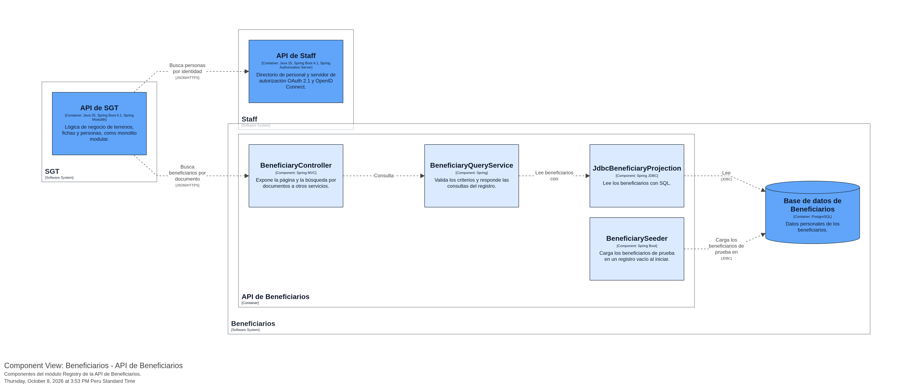

BeneficiaryController atiende las consultas de la API de SGT y las dirige a BeneficiaryQueryService, que lee con JdbcBeneficiaryProjection. La API valida el token de servicio de SGT con la clave que publica Staff. Al iniciar, BeneficiarySeeder carga los beneficiarios de prueba en una base de datos vacía.

<h3 id="beneficiarios-code-level">Bounded Context Software Architecture Code Level Diagrams</h3>

<h4 id="beneficiarios-class-diagram">Bounded Context Domain Layer Class Diagrams</h4>

El siguiente diagrama de clases UML muestra la capa de dominio de Beneficiarios. Se elaboró en LucidChart.

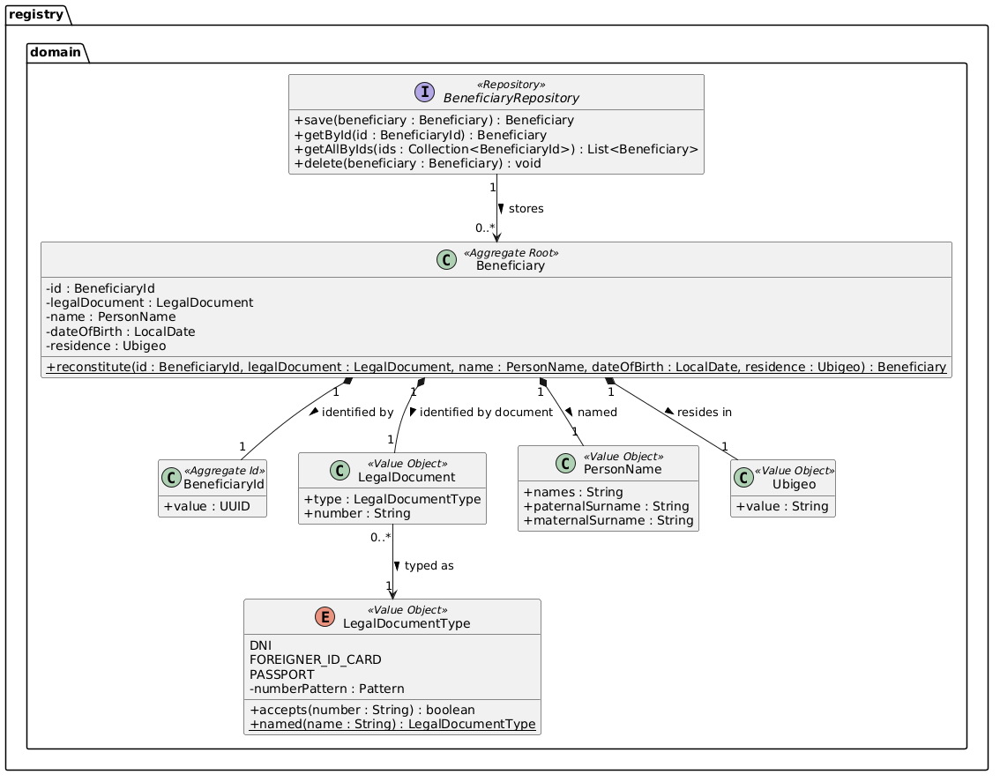

Beneficiary compone su identidad, su documento legal, su nombre, su fecha de nacimiento y el ubigeo de su residencia. LegalDocument referencia su tipo, que define el formato válido del número.

<h4 id="beneficiarios-db-diagram">Bounded Context Database Design Diagram</h4>

El siguiente diagrama de base de datos muestra las tablas de Beneficiarios en la base de datos PostgreSQL de beneficiarios. Se elaboró en LucidChart a partir de las migraciones Flyway del servicio.

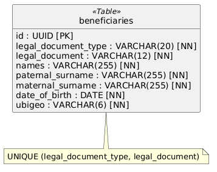

La tabla beneficiaries guarda una fila por beneficiario. La restricción única sobre el tipo y el número de documento respalda que ningún par de beneficiarios comparta documento, y las restricciones CHECK repiten las reglas del dominio: el tipo es uno de los tres conocidos, el número tiene el formato de su tipo y el ubigeo tiene seis dígitos.

# Capítulo VI: Solution UX Design

## Style Guidelines

### General Style Guidelines

En esta sección se fijan las decisiones visuales y de comunicación que comparten la aplicación web y la aplicación móvil de SGT. Las guías se construyeron en Figma como un repositorio central de variables, estilos y componentes, de modo que cualquier pantalla se arme con los mismos elementos y mantenga una presentación consistente. Las particularidades de cada plataforma, como la plantilla con mapa de la web o el flujo de envío de archivos del móvil, se desarrollan en la sección siguiente.

Como referencia externa se tomó el Geoportal SISCOD, un portal cartográfico institucional peruano cuyo tono cromático inspiró la paleta. No se adaptó un design system existente completo. Se construyó uno propio y mínimo, con los tokens y componentes que necesita el alcance del proyecto.

**Branding**  
El logotipo de SGT es una marca propia del equipo. Representa un terreno visto desde arriba, con sus surcos, y un pin de ubicación clavado en él: la parcela registrada y georreferenciada, que es lo que el sistema gestiona. El polígono irregular alude al terreno tal como lo mide el agente de campo, y el pin al punto que se captura con la estación total y se muestra en el mapa. Se resuelve con la paleta del sistema, con el terreno en teal, el pin en verde y la sigla en navy, compuesta en Roboto Bold con 6 % de espaciado entre letras, la misma familia que usa la interfaz.

El logotipo tiene una versión horizontal y una de icono, y cada una existe en tono Color, para fondos claros, y en tono En oscuro, para fondos navy.

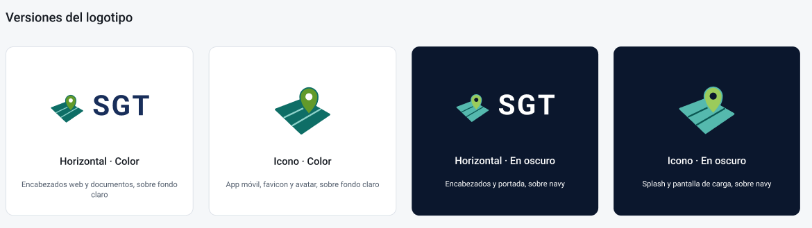

Reglas de uso del logotipo:
- Usar la versión Color sobre blanco o gris claro, y la versión En oscuro sobre navy 900 o fondos igual de oscuros.
- Dejar alrededor del logo un margen libre equivalente a la mitad del ancho del pin.
- Respetar el tamaño mínimo de 24 px para el icono y de 96 px de ancho para la versión horizontal.
- No estirar, rotar ni deformar el logo, no cambiar los colores del terreno, del pin o de la sigla, no añadir sombras, contornos o degradados, y no colocarlo sobre fotos o fondos de bajo contraste.

Esta marca es una propuesta de diseño del equipo para el proyecto. Su uso institucional real requeriría la aprobación de la entidad.

**Principios de diseño**  
Cinco principios guían las decisiones visuales de SGT. Nacen de lo que necesitan los dos usuarios del sistema: el agente de campo, que trabaja en el terreno con poco tiempo, y la asistente de gerencia general, que valida documentos y no puede aprobar datos dudosos. Cada principio indica en qué se apoya y dónde se aplica.
- Claridad primero: cada pantalla tiene una sola acción principal y todo lo demás se subordina a ella. Se apoya en la ley de Hick (Hick, 1952), según la cual el tiempo de decisión crece con el número de opciones, y en la heurística de diseño estético y minimalista (Nielsen, 1994). Se aplica con un solo botón Primary por pantalla y una escala tipográfica corta.
- Confianza y trazabilidad visibles: el estado de una ficha y la responsabilidad sobre cada dato siempre se ven, para que la asistente nunca deba adivinar si un documento fue aprobado, observado o alterado. Se apoya en la heurística de visibilidad del estado del sistema (Nielsen, 1994) y en el concepto de cadena de responsabilidad del lenguaje del dominio. Se aplica con el Status chip en cada ficha y con alertas de integridad que incluyen título y acción.
- Accesibilidad por defecto: el contraste, el tamaño de los objetivos táctiles y los estados de foco se resuelven en los tokens y no pantalla por pantalla, y nunca se comunica algo solo con color. Se apoya en las pautas WCAG 2.2 nivel AA (W3C, 2023), que exigen un contraste de 4.5 a 1 para texto normal y un objetivo táctil mínimo de 24 por 24 px. SGT adopta un objetivo mayor, de 44 px o más, que corresponde al criterio más estricto de la misma norma. Se aplica con botones de 48 px de alto, el estado Focus de 2 px y colores de estado siempre acompañados de una etiqueta.
- Prevención de errores: la interfaz evita los errores antes de que ocurran y, cuando ocurren, explica qué pasó y cómo corregirlos. Se apoya en las heurísticas de prevención de errores y de ayuda para reconocer, diagnosticar y recuperarse de errores (Nielsen, 1994). Se aplica con el Input en estado Error acompañado de texto de ayuda y con el botón Danger diferenciado del Primary.
- Consistencia entre web y móvil: una sola paleta, una sola tipografía y los mismos componentes en ambas aplicaciones, de modo que cambien el tamaño y la disposición pero no la identidad. Se apoya en la heurística de consistencia y estándares (Nielsen, 1994) y en el uso de design tokens compartidos. Se aplica con variables de color, espaciado y radios comunes y componentes únicos en Figma.

**Tono de comunicación**  
SGT maneja datos de beneficiarios, documentos firmados y aprobaciones que alimentan un plan institucional. Por eso el tono es serio, formal sin ser rígido, siempre respetuoso y sereno. Habla con claridad al agente que está en el terreno y con precisión a la asistente que valida. La ubicación de cada dimensión se muestra a continuación.

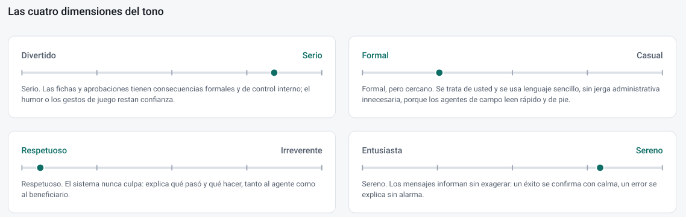

Las dimensiones se resolvieron así:
- Divertido o serio, con inclinación a serio: las fichas y aprobaciones tienen consecuencias formales y de control interno, y el humor resta confianza.
- Formal o casual, con inclinación a formal pero cercano: se trata de usted y se usa lenguaje sencillo, sin jerga administrativa innecesaria, porque el agente de campo lee rápido y de pie.
- Respetuoso o irreverente, con inclinación total a respetuoso: el sistema nunca culpa, explica qué pasó y qué hacer, tanto al agente como al beneficiario.
- Entusiasta o sereno, con inclinación a sereno: los mensajes informan sin exagerar, de modo que un éxito se confirma con calma y un error se explica sin alarma.

Para redactar los mensajes de la interfaz se aplican cuatro reglas:
- Usar frases cortas y directas, con una idea por oración y el verbo al inicio en las acciones, como Suba la ficha o Revise los datos.
- Tratar siempre de usted, incluso en el móvil.
- Usar los términos que ya emplea el personal, como ficha, terreno, beneficiario y agente de campo, sin términos técnicos de software en la interfaz.
- Redactar los errores de modo que digan qué pasó y qué puede hacer la persona, sin culpar ni usar mayúsculas para alarmar.

Los siguientes ejemplos contrastan la forma de decir cada mensaje con la que se evita.

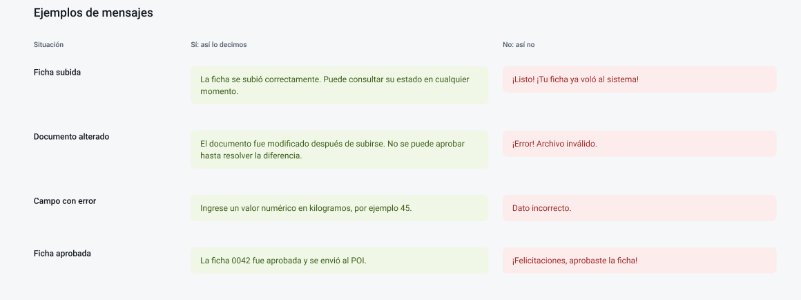

**Colores**  
La paleta parte de los verdes azulados y el azul marino del Geoportal SISCOD, con un azul cielo y un verde hoja como acentos. El teal es el color primario y se reserva para la acción principal y los elementos interactivos. El navy es el color secundario y se usa en encabezados, fondos oscuros y acciones de apoyo. El verde hoja y el azul cielo son acentos, con un uso decorativo o de foco. Los colores de marca se muestran junto con su contraste sobre texto.

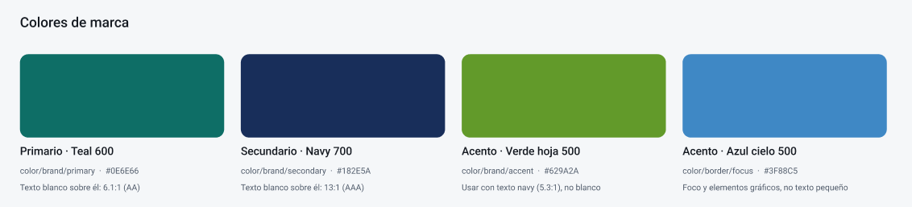

Cada color de marca tiene una rampa de diez pasos, junto con rampas de gris frío para neutros, de ámbar para advertencias y de rojo para errores. Estas rampas son variables primitivas y solo alimentan a los tokens semánticos. Los componentes consumen únicamente los semánticos, de modo que cambiar un color no exige revisar pantalla por pantalla.

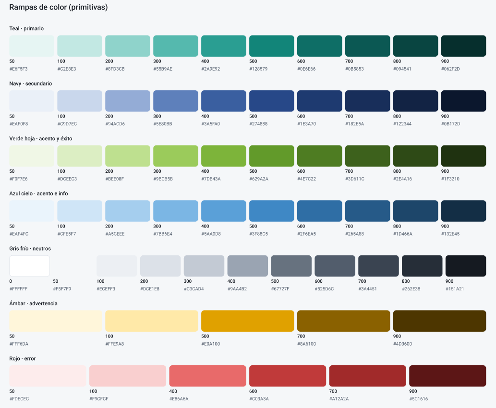

Los estados de una ficha usan cada uno un trío de colores: el sólido, el fondo suave y el texto sobre el fondo suave. Ninguno se comunica solo con color, siempre lo acompaña una etiqueta de texto.

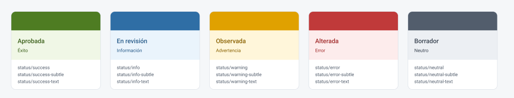

Los tokens semánticos tienen dos modos, claro y oscuro, y los componentes cambian de modo sin rediseño. El modo claro es el predeterminado.

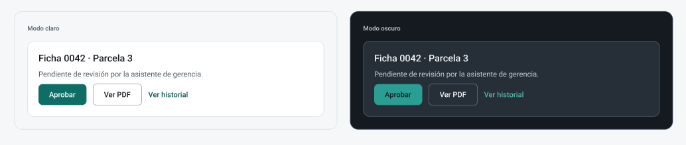

Los pares principales de color y texto se calcularon contra el nivel AA de WCAG 2.2 (W3C, 2023), que exige un contraste de al menos 4.5 a 1 para texto normal. Los colores que no alcanzan ese valor, como el verde hoja con texto blanco o el azul cielo con texto pequeño, no se usan para texto.

**Tipografía**  
Se usa una sola familia, Roboto, en tres pesos: Regular para texto corrido, Medium para etiquetas y subtítulos, y Bold para títulos. Es legible en pantallas pequeñas, está disponible en web y Android sin licencias adicionales y su tono neutro coincide con el de los portales institucionales de referencia. Una sola familia mantiene la interfaz sobria.

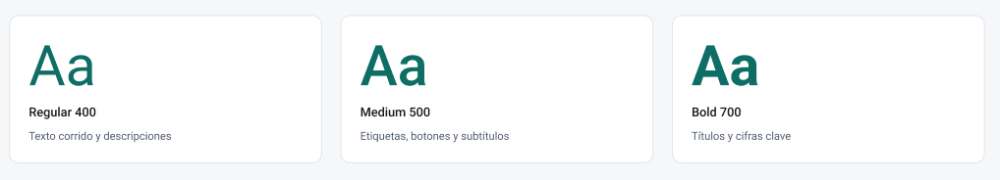

La escala tiene once estilos, desde el título de pantalla hasta las notas de apoyo, y cada estilo indica su uso.

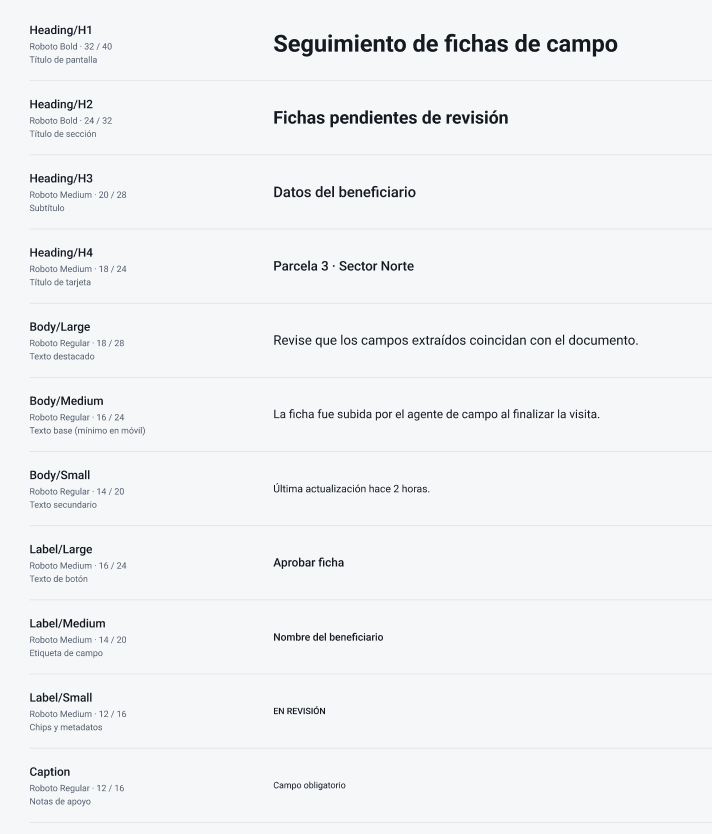

Reglas de uso de la tipografía:
- El texto base mide 16 px como mínimo en móvil y el texto corrido nunca baja de 14 px.
- Las líneas de texto en web se mantienen entre 60 y 80 caracteres.
- Solo la primera palabra de los títulos y de los botones lleva mayúscula inicial.
- Cada pantalla tiene un único título de nivel 1.

**Espaciado, radios y sombras**  
Todo el espaciado sigue una base de 4 px, con saltos de 8 px a partir de 8. Los radios y las sombras son pocos y se repiten, para que la interfaz se vea consistente en web y móvil.

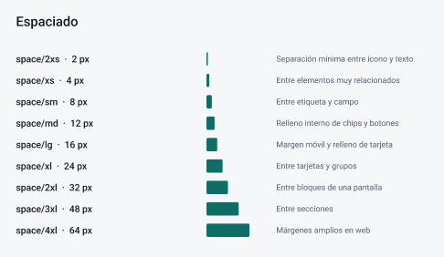

Los radios de esquina van de cero a 16 px, con un valor completo para etiquetas de estado. Las tarjetas y alertas usan 12 px, y los botones y campos, 8 px.

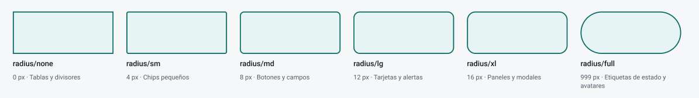

Hay tres sombras, para tarjetas en reposo, para menús y tarjetas elevadas, y para modales y diálogos.

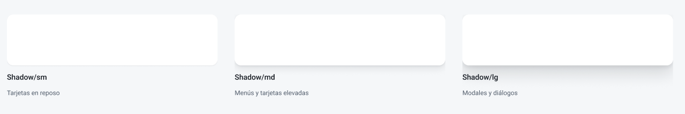

Las grillas se definen por plataforma. En web se usan 12 columnas con un ancho máximo de contenido de 1200 px, canal de 24 px y márgenes de 96 px en escritorio. En móvil se usan 4 columnas, canal de 16 px y márgenes de 16 px. Los objetivos táctiles miden al menos 44 por 44 px.

**Componentes**  
Los componentes base son componentes reales de Figma construidos con las variables anteriores, por lo que cambian de modo claro a oscuro sin rediseño. Se documentan aquí los que comparten la web y el móvil. Los componentes propios de cada plataforma se describen en la sección siguiente.

El botón se ofrece en cuatro estilos: Primary para la única acción principal de cada pantalla, Secondary para acciones de apoyo de igual importancia, Outline para alternativas de bajo peso y Danger para rechazar o descartar. Cada estilo tiene cinco estados, y todos miden 48 px de alto, lo que cumple el objetivo táctil de 44 px. En la imagen, las columnas son los estados Default, Hover, Pressed, Focus y Disabled, y las filas son los estilos.

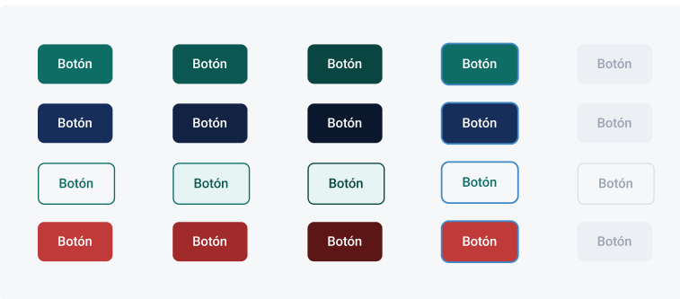

El campo de texto siempre muestra su etiqueta y no la reemplaza por el placeholder. Tiene los estados Default, Focus, Error y Disabled. En Error, el borde rojo se acompaña de un texto de ayuda que dice cómo corregir. Disabled se usa para datos de solo lectura, como los que llegan del sistema de Beneficiarios.

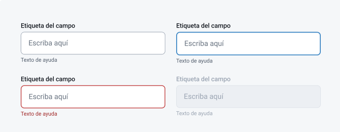

El Status chip muestra el estado de una ficha, que puede ser Borrador, En revisión, Aprobada, Observada o Alterada. Siempre lleva texto, y el punto de color es un refuerzo que se puede ocultar. No es interactivo.

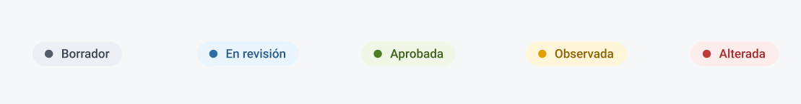

La alerta es un mensaje en línea dentro de una pantalla, de tipo Info, Success, Warning o Error, y siempre incluye título y una indicación de qué hacer. El icono refuerza el color pero no lo reemplaza.

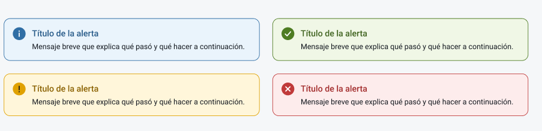

La tarjeta es la superficie base que agrupa contenido relacionado. Tiene una variante Flat, con borde de 1 px, para paneles dentro de una pantalla, y una Raised, con sombra media, para elementos que flotan sobre otra capa, como popups y menús. Puede contener texto, campos y botones. No se usa para listas de fichas ni de borradores, que se presentan como filas de tabla.

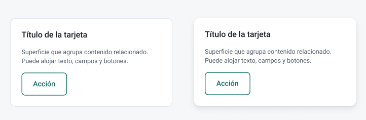

### Web, Mobile & Devices Style Guidelines

Esta sección fija los estándares visuales y de interacción de las dos aplicaciones de SGT: la aplicación web responsive y la aplicación móvil nativa. Ambas se construyen sobre los tokens, estilos y componentes de la guía general, de modo que comparten paleta, tipografía, espaciado y componentes base, y aquí solo se describe lo que es propio de cada plataforma. No se nombra ningún framework de desarrollo, porque esa decisión técnica corresponde a la etapa de implementación y no al diseño de la interfaz.

**Nota**: las pantallas e ilustraciones de esta sección son estilos referenciales y solo ilustrativos. Muestran cómo se aplican los tokens y componentes definidos, y no constituyen el diseño final de la aplicación, que se presenta en las secciones de Applications Wireframes y Applications Mockups

**Aplicación web**  
La web la usan la asistente de gerencia general y el agente de campo. La asistente trabaja en computadoras de escritorio y portátiles con Windows, y ambas personas usan Chrome, con Edge en el caso de la asistente. Por eso el diseño es prioritariamente de escritorio y portátil, y se adapta hacia anchos menores con las siguientes reglas:
- Desde 1280 px de ancho, la barra lateral se muestra expandida y las secciones se abren junto al mapa.
- De 1024 a 1279 px, la barra lateral se colapsa por defecto y el panel de una sección se abre encima del mapa en lugar de desplazarlo.
- De 768 a 1023 px, las secciones se abren en vista completa con el mapa oculto, y los modales ocupan hasta el 90 % del ancho.
- Por debajo de 768 px no es un objetivo de diseño, porque el trabajo en campo se cubre con la aplicación móvil.

La pantalla principal de la web es un mapa interactivo a pantalla completa. La barra lateral da acceso a las secciones Beneficiarios, Agentes de campo, Fichas y Terrenos, y el contenido de cada sección se muestra de tres maneras según el espacio que necesita: con el mapa a pantalla completa y la barra colapsada, con la sección abierta y el mapa desplazado hacia la derecha, o en vista completa con el mapa oculto, como ocurre con las tablas y con la validación.

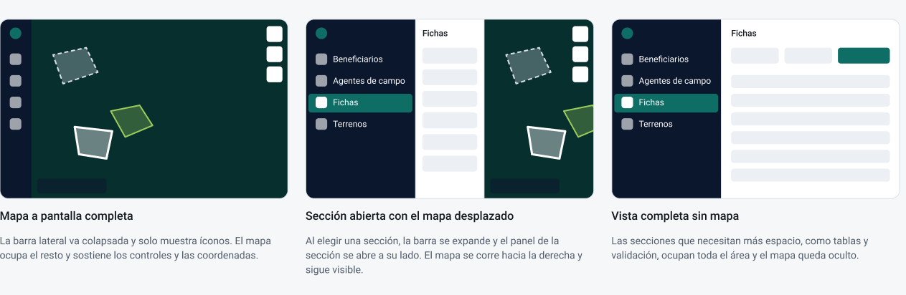

Al pulsar un terreno en el mapa se abre un popup con los datos del terreno, es decir, el DNI del beneficiario y el área estimada, un desplegable con los vértices de su perímetro y otro con sus fichas. Los vértices también se marcan numerados sobre el polígono del mapa. Cada ficha muestra su código, el DNI del agente, la fecha de llenado y la fecha de validación, y mientras esté pendiente incluye la acción Validar. El popup usa la superficie elevada de la guía general.

Dos modales cubren la creación y la carga de datos. El modal de creación de terreno se usa tanto para crear un terreno desde la web como para validar los terrenos precargados desde el archivo de la estación total, que llegan con sus vértices ya leídos del archivo. Como un terreno es un polígono y no un punto, el modal no pide un par de coordenadas sino la lista de vértices del perímetro, cada uno con su Este y su Norte en UTM. La lista se carga desde el archivo de la estación total o se ingresa a mano, se puede corregir vértice por vértice, y el área se calcula a partir de ella. El modal de subida de ficha permite al agente de campo subir la ficha digitalizada con su código, su fecha de llenado y el terreno vinculado, ya sea arrastrando el PDF o seleccionándolo, y también se abre desde el detalle del terreno. Cuando un modal bloquea la pantalla, se coloca sobre un fondo oscuro translúcido que lo separa del mapa.

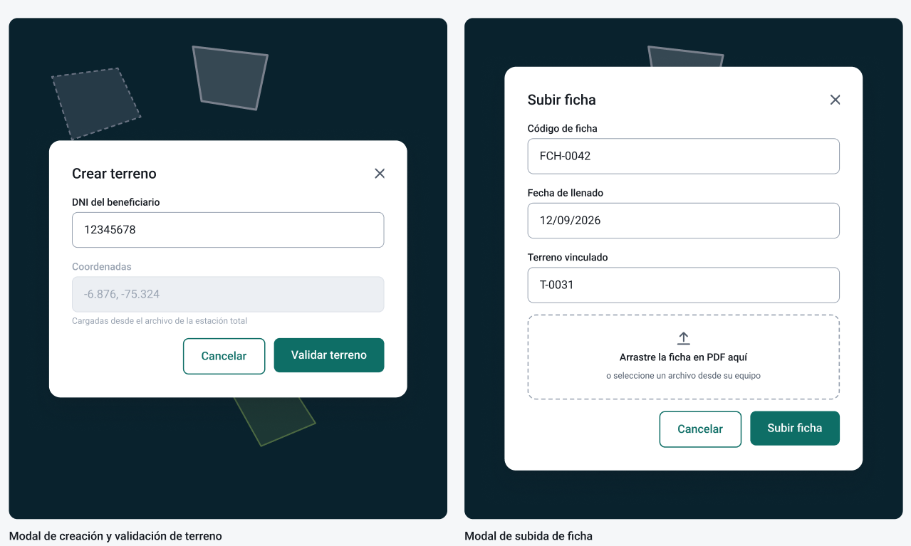

Las secciones de consulta, que son Beneficiarios, Agentes de campo y Fichas, usan una grilla de búsqueda. Tiene filtros combinables, un botón Buscar y un botón Limpiar filtros, y presenta los resultados en una tabla donde el estado se muestra con el Status chip y la acción disponible aparece en la última columna. Las fichas y los borradores se presentan siempre como filas de tabla, nunca como tarjetas.

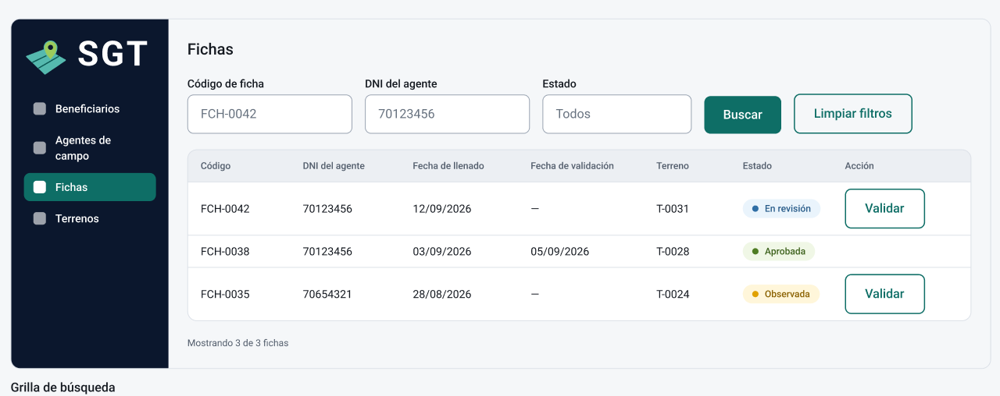

En la sección de terrenos, el agente de campo ve todos los terrenos, salvo los borradores de otros agentes: de esos solo ve los que él guardó. La tabla tiene una columna Estado y una columna Acciones, donde puede validar los borradores que guardó, y la sección incluye el botón para crear terrenos.

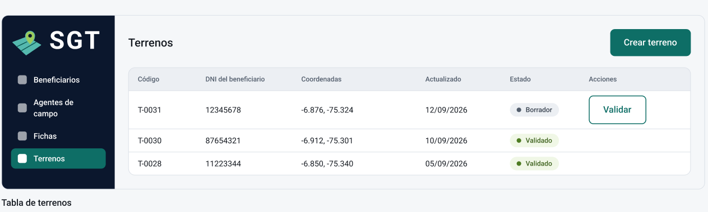

La validación de una ficha se hace en una pantalla dividida. A la izquierda están los datos que extrajo la inteligencia artificial, que la asistente puede confirmar o corregir, y a la derecha el documento original, para compararlos sin cambiar de pantalla. Arriba se muestra el resultado de la verificación de integridad del documento, junto a las acciones se explica que al aprobar se envían los datos al sistema POI, y Aprobar ficha es la única acción principal.

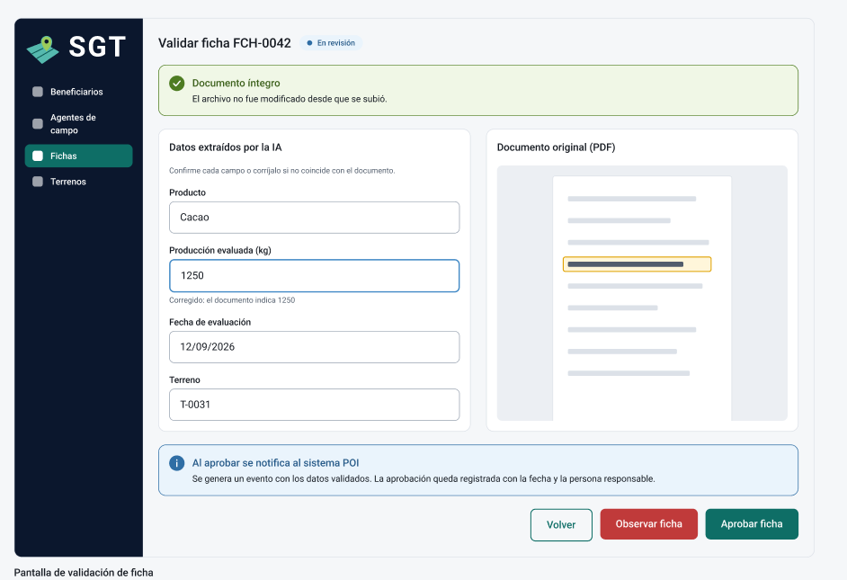

El mapa lo proporciona una biblioteca de mapas, por lo que SGT no define el mapa base ni sus controles estándar. Lo que sí define es cómo se dibujan los terrenos sobre él. Los terrenos se dibujan con contorno y relleno translúcido para distinguirse sobre la imagen satelital, y cada estado repite el lenguaje de color del resto de la guía, con gris para el borrador, verde para el validado y blanco para el terreno seleccionado. El borrador además lleva línea discontinua, para no depender solo del color. La ilustración muestra una disposición de referencia de los controles, la lectura de coordenadas y la leyenda: los controles en la esquina superior derecha y las coordenadas y la leyenda abajo, siempre sobre superficies propias, porque ningún texto se coloca directamente sobre la imagen del mapa. La apariencia exacta de los controles depende de la biblioteca que se adopte.

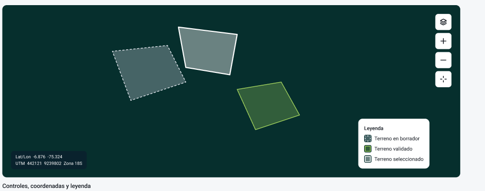

Los colores con los que se dibujan los terrenos se definen como tokens que amplían los de la guía general, para que el mapa y las tablas usen el mismo lenguaje de estados, y se entregan a la biblioteca como opciones de estilo de cada terreno.

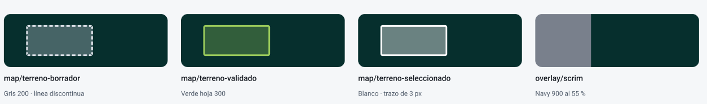

Reglas de interacción de la web:
- Todos los elementos interactivos muestran el estado Focus de 2 px al navegarse con teclado, y las tablas y los modales se pueden recorrer sin usar el mouse.
- Los modales se cierran con la X, con Cancelar o con la tecla Escape.
- Las acciones que rechazan o descartan usan el botón Danger y piden confirmación antes de ejecutarse.
- El resultado de una acción, como subir una ficha o aprobarla, se comunica con una alerta que indica qué ocurrió y qué sigue.

**Aplicación móvil**  
La aplicación móvil es nativa para Android. Roboto, la tipografía de la guía general, es además la fuente del sistema en Android, por lo que la interfaz mantiene la misma voz tipográfica que la web.

La aplicación tiene una sola tarea: enviar a la web, como borrador, el archivo que genera la estación total al medir un terreno. Así el agente ya no debe llevar las coordenadas anotadas a la oficina para digitalizarlas, sino que encuentra el terreno como borrador en la web. Por ser una herramienta poco invasiva para el trabajo de campo, la interfaz es de una sola columna, con pocos pasos y una sola acción principal por pantalla.

El flujo pasa por seis pantallas: elegir el archivo, revisarlo antes de enviarlo, el envío con su avance, y los tres resultados posibles, que son enviado, pendiente de envío y error de envío. El estado pendiente responde a la necesidad del agente de que su registro no se pierda aunque no haya señal: el archivo queda guardado en el teléfono y se envía solo cuando vuelve la conexión.

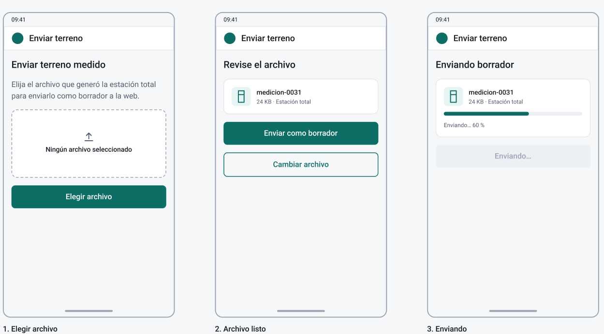

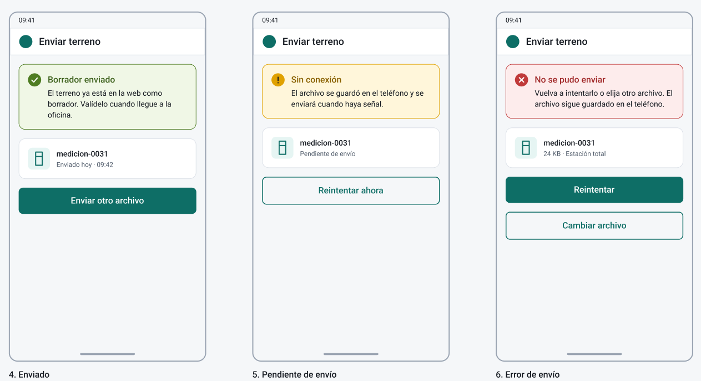

Reglas de diseño de la aplicación móvil:
- Los márgenes laterales son de 16 px y los objetivos táctiles miden al menos 44 px; los botones de la guía general miden 48 px de alto.
- El texto base mide 16 px como mínimo, y los mensajes de resultado usan las alertas de la guía general, siempre con título y una indicación de qué hacer.
- Se respetan la barra de estado y la barra de gestos del sistema, y la navegación hacia atrás usa el gesto del sistema.
- Ninguna pantalla depende de la conexión para mostrarse: el envío es lo único que la requiere, y cuando falla el archivo se conserva.

## Information Architecture

### Organization Systems

La organización del contenido de SGT parte de los dos usuarios del sistema. El agente de campo necesita llegar rápido a sus terrenos y a la subida de fichas, y la asistente de gerencia general necesita revisar y aprobar fichas sin perder el rastro de cada dato. Por eso cada grupo de información se organiza con el sistema visual que mejor acompaña la tarea del usuario y con un esquema de categorización que permite encontrarlo sin esfuerzo.

**Organización visual del contenido**  
Se usan los tres sistemas de organización en casos distintos:
- Jerárquica (visual hierarchy): se aplica cuando hay un elemento principal y otros que lo apoyan. La pantalla del mapa se organiza así, con el mapa como elemento dominante y la barra lateral y los paneles subordinados a él, y el popup de un terreno coloca los datos del terreno arriba y sus fichas debajo. La Landing Page también la usa, con un título y una propuesta principal antes del detalle.
- Secuencial (step-by-step to accomplish): se aplica cuando el usuario debe completar pasos en un orden. Es el caso del envío del archivo en el móvil, que va de elegir el archivo a revisarlo y enviarlo, de la validación de una ficha, que va de verificar la integridad del documento a revisar los datos y aprobar, de los campos de los modales de creación de terreno y de subida de ficha, que siguen el orden en que se llenan, y de la sección Cómo funciona de la Landing Page.
- Matricial: se aplica cuando hay muchos registros con los mismos atributos que se comparan entre sí. Son las tablas de Beneficiarios, Agentes de campo, Fichas y Terrenos, donde cada fila es un registro y cada columna un atributo, y la pantalla dividida de validación, que pone lado a lado los datos de la IA y el documento.

**Esquemas de categorización**  
Se usan los cuatro esquemas según el grupo de información:
- Por tópicos: la barra lateral agrupa el sistema en Beneficiarios, Agentes de campo, Fichas y Terrenos, que son las cuatro entidades del dominio. La Landing Page agrupa su contenido en propósito, funcionamiento, perfiles y seguridad.
- Cronológico: las fichas y los terrenos se ordenan por fecha, con lo más reciente primero, porque el usuario busca casi siempre lo último que se registró. El desplegable de fichas del popup de un terreno sigue el mismo orden.
- Alfabético: Beneficiarios y Agentes de campo se ordenan por apellido y nombre, porque son listas de personas que se buscan por nombre.
- Según audiencia: el contenido se diferencia por rol. El agente de campo ve todos los terrenos, salvo los borradores de otros agentes, y solo ve los borradores que él guardó, mientras que la asistente revisa las fichas pendientes. La Landing Page presenta qué hace el sistema para cada perfil.

La siguiente tabla resume qué sistema se aplica a cada grupo de información.

    <table style="width: 100%; border-collapse: collapse; border: 1px solid #333;">
        <thead>
            <tr>
                <th style="border: 1px solid #333; padding: 8px 10px; text-align: left;">Grupo de información</th>
                <th style="border: 1px solid #333; padding: 8px 10px; text-align: left;">Organización visual</th>
                <th style="border: 1px solid #333; padding: 8px 10px; text-align: left;">Categorización</th>
            </tr>
        </thead>
        <tbody>
            <tr>
                <td style="border: 1px solid #333; padding: 8px 10px; vertical-align: top;">Pantalla del mapa y barra lateral</td>
                <td style="border: 1px solid #333; padding: 8px 10px; vertical-align: top;">Jerárquica</td>
                <td style="border: 1px solid #333; padding: 8px 10px; vertical-align: top;">Por tópicos</td>
            </tr>
            <tr>
                <td style="border: 1px solid #333; padding: 8px 10px; vertical-align: top;">Listados de Beneficiarios y Agentes de campo</td>
                <td style="border: 1px solid #333; padding: 8px 10px; vertical-align: top;">Matricial</td>
                <td style="border: 1px solid #333; padding: 8px 10px; vertical-align: top;">Alfabético</td>
            </tr>
            <tr>
                <td style="border: 1px solid #333; padding: 8px 10px; vertical-align: top;">Listados de Fichas y Terrenos</td>
                <td style="border: 1px solid #333; padding: 8px 10px; vertical-align: top;">Matricial</td>
                <td style="border: 1px solid #333; padding: 8px 10px; vertical-align: top;">Cronológico y según audiencia</td>
            </tr>
            <tr>
                <td style="border: 1px solid #333; padding: 8px 10px; vertical-align: top;">Popup de terreno y desplegable de fichas</td>
                <td style="border: 1px solid #333; padding: 8px 10px; vertical-align: top;">Jerárquica</td>
                <td style="border: 1px solid #333; padding: 8px 10px; vertical-align: top;">Cronológico</td>
            </tr>
            <tr>
                <td style="border: 1px solid #333; padding: 8px 10px; vertical-align: top;">Validación de una ficha</td>
                <td style="border: 1px solid #333; padding: 8px 10px; vertical-align: top;">Secuencial y matricial</td>
                <td style="border: 1px solid #333; padding: 8px 10px; vertical-align: top;">Por tópicos (datos de la IA y documento)</td>
            </tr>
            <tr>
                <td style="border: 1px solid #333; padding: 8px 10px; vertical-align: top;">Modales de creación de terreno y de subida de ficha</td>
                <td style="border: 1px solid #333; padding: 8px 10px; vertical-align: top;">Secuencial</td>
                <td style="border: 1px solid #333; padding: 8px 10px; vertical-align: top;">Por tópicos</td>
            </tr>
            <tr>
                <td style="border: 1px solid #333; padding: 8px 10px; vertical-align: top;">Envío del archivo en la aplicación móvil</td>
                <td style="border: 1px solid #333; padding: 8px 10px; vertical-align: top;">Secuencial</td>
                <td style="border: 1px solid #333; padding: 8px 10px; vertical-align: top;">Por tópicos (estado del envío)</td>
            </tr>
            <tr>
                <td style="border: 1px solid #333; padding: 8px 10px; vertical-align: top;">Landing Page</td>
                <td style="border: 1px solid #333; padding: 8px 10px; vertical-align: top;">Jerárquica y secuencial</td>
                <td style="border: 1px solid #333; padding: 8px 10px; vertical-align: top;">Por tópicos y según audiencia</td>
            </tr>
        </tbody>
    </table>

### Labeling Systems

Las etiquetas de SGT se escriben con el mínimo de palabras posible y con los términos que ya usa el personal del programa, tomados del lenguaje ubicuo. Se aplican cuatro reglas para evitar la confusión:
- Un mismo concepto tiene siempre una sola etiqueta. Se usa Terreno y no Parcela, y Agente de campo y no Operador ni Operario, en la barra lateral, en las tablas, en los modales y en los mensajes.
- Las secciones se nombran con un sustantivo en plural, y las acciones con un verbo en infinitivo seguido, cuando hace falta, de su objeto, como Validar o Subir ficha.
- Las etiquetas no pasan de tres palabras. Lo que necesita más explicación va en el texto de ayuda y no en la etiqueta.
- Cada etiqueta anticipa dónde lleva al usuario. Por ejemplo, Validar en la fila de una ficha lleva a la pantalla de validación, y Fichas (2) junto a un chevron indica que se despliega una lista de dos fichas.

**Etiquetas de navegación**  

    <table style="width: 100%; border-collapse: collapse; border: 1px solid #333;">
        <thead>
            <tr>
                <th style="border: 1px solid #333; padding: 8px 10px; text-align: left;">Ubicación</th>
                <th style="border: 1px solid #333; padding: 8px 10px; text-align: left;">Etiqueta</th>
                <th style="border: 1px solid #333; padding: 8px 10px; text-align: left;">Qué asocia el usuario</th>
            </tr>
        </thead>
        <tbody>
            <tr>
                <td style="border: 1px solid #333; padding: 8px 10px; vertical-align: top;">Barra lateral de la web</td>
                <td style="border: 1px solid #333; padding: 8px 10px; vertical-align: top;">Beneficiarios</td>
                <td style="border: 1px solid #333; padding: 8px 10px; vertical-align: top;">Búsqueda y datos de los productores registrados.</td>
            </tr>
            <tr>
                <td style="border: 1px solid #333; padding: 8px 10px; vertical-align: top;">Barra lateral de la web</td>
                <td style="border: 1px solid #333; padding: 8px 10px; vertical-align: top;">Agentes de campo</td>
                <td style="border: 1px solid #333; padding: 8px 10px; vertical-align: top;">Búsqueda de las personas que miden y reportan en campo.</td>
            </tr>
            <tr>
                <td style="border: 1px solid #333; padding: 8px 10px; vertical-align: top;">Barra lateral de la web</td>
                <td style="border: 1px solid #333; padding: 8px 10px; vertical-align: top;">Fichas</td>
                <td style="border: 1px solid #333; padding: 8px 10px; vertical-align: top;">Fichas de evaluación subidas, con su estado y su validación.</td>
            </tr>
            <tr>
                <td style="border: 1px solid #333; padding: 8px 10px; vertical-align: top;">Barra lateral de la web</td>
                <td style="border: 1px solid #333; padding: 8px 10px; vertical-align: top;">Terrenos</td>
                <td style="border: 1px solid #333; padding: 8px 10px; vertical-align: top;">Terrenos registrados y borradores pendientes de validar.</td>
            </tr>
            <tr>
                <td style="border: 1px solid #333; padding: 8px 10px; vertical-align: top;">Menú de la cuenta</td>
                <td style="border: 1px solid #333; padding: 8px 10px; vertical-align: top;">Cerrar sesión</td>
                <td style="border: 1px solid #333; padding: 8px 10px; vertical-align: top;">Salir del sistema.</td>
            </tr>
            <tr>
                <td style="border: 1px solid #333; padding: 8px 10px; vertical-align: top;">Encabezado de la Landing Page</td>
                <td style="border: 1px solid #333; padding: 8px 10px; vertical-align: top;">Ingresar</td>
                <td style="border: 1px solid #333; padding: 8px 10px; vertical-align: top;">Ir al inicio de sesión del sistema.</td>
            </tr>
            <tr>
                <td style="border: 1px solid #333; padding: 8px 10px; vertical-align: top;">Encabezado de la Landing Page</td>
                <td style="border: 1px solid #333; padding: 8px 10px; vertical-align: top;">Cómo funciona</td>
                <td style="border: 1px solid #333; padding: 8px 10px; vertical-align: top;">Los pasos del proceso, desde la medición hasta la aprobación.</td>
            </tr>
            <tr>
                <td style="border: 1px solid #333; padding: 8px 10px; vertical-align: top;">Encabezado de la Landing Page</td>
                <td style="border: 1px solid #333; padding: 8px 10px; vertical-align: top;">Perfiles</td>
                <td style="border: 1px solid #333; padding: 8px 10px; vertical-align: top;">Qué hace el sistema por el agente de campo y por la asistente.</td>
            </tr>
            <tr>
                <td style="border: 1px solid #333; padding: 8px 10px; vertical-align: top;">Encabezado de la Landing Page</td>
                <td style="border: 1px solid #333; padding: 8px 10px; vertical-align: top;">Seguridad</td>
                <td style="border: 1px solid #333; padding: 8px 10px; vertical-align: top;">Cómo se protege la integridad de las fichas y los datos.</td>
            </tr>
            <tr>
                <td style="border: 1px solid #333; padding: 8px 10px; vertical-align: top;">Encabezado de la Landing Page</td>
                <td style="border: 1px solid #333; padding: 8px 10px; vertical-align: top;">Ayuda</td>
                <td style="border: 1px solid #333; padding: 8px 10px; vertical-align: top;">Cómo obtener orientación, sin aglomerar el contacto en el encabezado.</td>
            </tr>
        </tbody>
    </table>

**Etiquetas de acción y de estado**  
Las acciones usan las mismas etiquetas en web y móvil cuando hacen lo mismo. Los botones de la web son Buscar y Limpiar filtros en las grillas, Crear terreno en la tabla de terrenos, Subir ficha en el modal del mismo nombre, Validar en los terrenos y fichas pendientes, Aprobar ficha y Volver en la pantalla de validación, y Cancelar en los modales. En el móvil son Elegir archivo, Enviar como borrador, Cambiar archivo, Reintentar y Reintentar ahora.

Los estados de una ficha son Borrador, En revisión, Aprobada, Observada y Alterada, y los de un terreno son Borrador y Validado. La diferencia de verbo responde al flujo: una ficha se aprueba y un terreno se valida. Cada estado se muestra con el Status chip de la guía de estilos, siempre con texto.

Las columnas de las tablas repiten los atributos del dominio con etiquetas breves: Código, DNI del beneficiario, DNI del agente, Vértices, Fecha de llenado, Fecha de validación, Terreno, Estado y Acciones.

### Searching Systems

La búsqueda de SGT existe para que el usuario no se pierda entre el volumen de registros. Se resuelve con grillas de búsqueda con filtros en la web, y la aplicación móvil no tiene búsqueda, porque su flujo es lineal y el archivo se elige con el selector del sistema.

**Opciones de búsqueda de la web**  
Cada una de las cuatro secciones de la barra lateral abre una grilla con sus propios filtros. Los filtros se pueden combinar entre sí, y el usuario lanza la búsqueda con el botón Buscar y los reinicia con Limpiar filtros. Los filtros de cada sección son los siguientes.

    <table style="width: 100%; border-collapse: collapse; border: 1px solid #333;">
        <thead>
            <tr>
                <th style="border: 1px solid #333; padding: 8px 10px; text-align: left;">Sección</th>
                <th style="border: 1px solid #333; padding: 8px 10px; text-align: left;">Filtros</th>
                <th style="border: 1px solid #333; padding: 8px 10px; text-align: left;">Columnas del resultado</th>
            </tr>
        </thead>
        <tbody>
            <tr>
                <td style="border: 1px solid #333; padding: 8px 10px; vertical-align: top;">Beneficiarios</td>
                <td style="border: 1px solid #333; padding: 8px 10px; vertical-align: top;">DNI, nombre</td>
                <td style="border: 1px solid #333; padding: 8px 10px; vertical-align: top;">DNI, nombre, cantidad de terrenos</td>
            </tr>
            <tr>
                <td style="border: 1px solid #333; padding: 8px 10px; vertical-align: top;">Agentes de campo</td>
                <td style="border: 1px solid #333; padding: 8px 10px; vertical-align: top;">DNI, nombre</td>
                <td style="border: 1px solid #333; padding: 8px 10px; vertical-align: top;">DNI, nombre, cantidad de fichas</td>
            </tr>
            <tr>
                <td style="border: 1px solid #333; padding: 8px 10px; vertical-align: top;">Fichas</td>
                <td style="border: 1px solid #333; padding: 8px 10px; vertical-align: top;">Código de ficha, código de tarea, DNI del agente, estado, fecha de llenado</td>
                <td style="border: 1px solid #333; padding: 8px 10px; vertical-align: top;">Código, DNI del agente, fecha de llenado, fecha de validación, terreno, estado y acción</td>
            </tr>
            <tr>
                <td style="border: 1px solid #333; padding: 8px 10px; vertical-align: top;">Terrenos</td>
                <td style="border: 1px solid #333; padding: 8px 10px; vertical-align: top;">Código, DNI del beneficiario, estado</td>
                <td style="border: 1px solid #333; padding: 8px 10px; vertical-align: top;">Código, DNI del beneficiario, número de vértices, fecha de actualización, estado y acciones</td>
            </tr>
        </tbody>
    </table>

Los filtros de Fichas responden a la necesidad de la asistente de ubicar rápido las fichas que quedaron con una observación pendiente, combinando código de tarea, agente, fecha y estado. Los filtros se aplican siempre sobre lo que el rol del usuario puede ver, por lo que el agente de campo no encuentra borradores de otros agentes aunque los busque.

**Cómo se muestran los resultados**  
Los resultados se presentan en una tabla con los atributos del registro en columnas, el estado con el Status chip y, en la última columna, la acción disponible, como Validar. El orden predeterminado es cronológico, con lo más reciente primero, salvo en Beneficiarios y Agentes de campo, que se ordenan alfabéticamente. Debajo de la tabla se indica cuántos registros se muestran sobre el total, por ejemplo Mostrando 3 de 3 fichas, y cuando hay más resultados de los que caben en una página, se pagina.

Si ningún registro coincide, la tabla muestra el mensaje No se encontraron resultados con esos filtros y la acción Limpiar filtros, para que el usuario pueda recuperarse en un paso y no quede frente a una tabla vacía sin explicación.

Además de la grilla, el mapa ofrece una forma visual de llegar a un registro: el usuario se desplaza por él y pulsa un terreno, y el popup muestra sus datos y sus fichas.

### SEO Tags and Meta Tags

Los valores de esta sección se definen para tres piezas: la Landing Page, que es el sitio web estático y público, la aplicación web, y la aplicación móvil. El nombre del producto se mantiene como la sigla SGT, acompañado de una descripción funcional, porque el significado de la sigla no forma parte de las definiciones del proyecto. El autor de todas las piezas es Soulware, el equipo que desarrolla el sistema.

**SEO Tags y Meta Tags de la Landing Page**  
La Landing Page es informativa y pública, por lo que se indexa. Presenta el propósito de SGT, cómo funciona, los perfiles que atiende y cómo se protege la información, con un acceso al inicio de sesión.

    <table style="width: 100%; border-collapse: collapse; border: 1px solid #333;">
        <thead>
            <tr>
                <th style="border: 1px solid #333; padding: 8px 10px; text-align: left;">Etiqueta</th>
                <th style="border: 1px solid #333; padding: 8px 10px; text-align: left;">Valor</th>
            </tr>
        </thead>
        <tbody>
            <tr>
                <td style="border: 1px solid #333; padding: 8px 10px; vertical-align: top;">Title</td>
                <td style="border: 1px solid #333; padding: 8px 10px; vertical-align: top;">SGT | Registro y validación de terrenos y fichas de campo</td>
            </tr>
            <tr>
                <td style="border: 1px solid #333; padding: 8px 10px; vertical-align: top;">Meta Description</td>
                <td style="border: 1px solid #333; padding: 8px 10px; vertical-align: top;">SGT permite registrar terrenos medidos en campo, subir y validar fichas de evaluación y mantener su trazabilidad hasta el reporte de avance institucional.</td>
            </tr>
            <tr>
                <td style="border: 1px solid #333; padding: 8px 10px; vertical-align: top;">Meta Keywords</td>
                <td style="border: 1px solid #333; padding: 8px 10px; vertical-align: top;">SGT, registro de terrenos, fichas de campo, validación de fichas, georreferenciación, trazabilidad, programa agrícola, agente de campo</td>
            </tr>
            <tr>
                <td style="border: 1px solid #333; padding: 8px 10px; vertical-align: top;">Meta Author</td>
                <td style="border: 1px solid #333; padding: 8px 10px; vertical-align: top;">Soulware</td>
            </tr>
            <tr>
                <td style="border: 1px solid #333; padding: 8px 10px; vertical-align: top;">Meta Robots</td>
                <td style="border: 1px solid #333; padding: 8px 10px; vertical-align: top;">index, follow</td>
            </tr>
            <tr>
                <td style="border: 1px solid #333; padding: 8px 10px; vertical-align: top;">Idioma</td>
                <td style="border: 1px solid #333; padding: 8px 10px; vertical-align: top;">es-PE</td>
            </tr>
        </tbody>
    </table>

**SEO Tags y Meta Tags de la aplicación web**  
La aplicación web requiere inicio de sesión y maneja datos de beneficiarios que, según las decisiones de arquitectura del Capítulo IV, deben permanecer dentro de la institución. Por eso ninguna de sus páginas se indexa y todas llevan Meta Robots con el valor noindex, nofollow. Los títulos siguen el formato Página | SGT, el autor es Soulware y las palabras clave comunes son SGT, terrenos, fichas, beneficiarios y agentes de campo.

    <table style="width: 100%; border-collapse: collapse; border: 1px solid #333;">
        <thead>
            <tr>
                <th style="border: 1px solid #333; padding: 8px 10px; text-align: left;">Página</th>
                <th style="border: 1px solid #333; padding: 8px 10px; text-align: left;">Title</th>
                <th style="border: 1px solid #333; padding: 8px 10px; text-align: left;">Meta Description</th>
            </tr>
        </thead>
        <tbody>
            <tr>
                <td style="border: 1px solid #333; padding: 8px 10px; vertical-align: top;">Inicio de sesión</td>
                <td style="border: 1px solid #333; padding: 8px 10px; vertical-align: top;">Iniciar sesión | SGT</td>
                <td style="border: 1px solid #333; padding: 8px 10px; vertical-align: top;">Ingrese con su usuario institucional para acceder a las funciones de su rol en SGT.</td>
            </tr>
            <tr>
                <td style="border: 1px solid #333; padding: 8px 10px; vertical-align: top;">Mapa</td>
                <td style="border: 1px solid #333; padding: 8px 10px; vertical-align: top;">Mapa de terrenos | SGT</td>
                <td style="border: 1px solid #333; padding: 8px 10px; vertical-align: top;">Explore los terrenos registrados sobre el mapa y consulte sus datos y sus fichas.</td>
            </tr>
            <tr>
                <td style="border: 1px solid #333; padding: 8px 10px; vertical-align: top;">Beneficiarios</td>
                <td style="border: 1px solid #333; padding: 8px 10px; vertical-align: top;">Beneficiarios | SGT</td>
                <td style="border: 1px solid #333; padding: 8px 10px; vertical-align: top;">Busque beneficiarios registrados por DNI o nombre.</td>
            </tr>
            <tr>
                <td style="border: 1px solid #333; padding: 8px 10px; vertical-align: top;">Agentes de campo</td>
                <td style="border: 1px solid #333; padding: 8px 10px; vertical-align: top;">Agentes de campo | SGT</td>
                <td style="border: 1px solid #333; padding: 8px 10px; vertical-align: top;">Busque agentes de campo y consulte sus registros.</td>
            </tr>
            <tr>
                <td style="border: 1px solid #333; padding: 8px 10px; vertical-align: top;">Fichas</td>
                <td style="border: 1px solid #333; padding: 8px 10px; vertical-align: top;">Fichas | SGT</td>
                <td style="border: 1px solid #333; padding: 8px 10px; vertical-align: top;">Busque fichas por código, agente, estado o fecha y acceda a su validación.</td>
            </tr>
            <tr>
                <td style="border: 1px solid #333; padding: 8px 10px; vertical-align: top;">Terrenos</td>
                <td style="border: 1px solid #333; padding: 8px 10px; vertical-align: top;">Terrenos | SGT</td>
                <td style="border: 1px solid #333; padding: 8px 10px; vertical-align: top;">Consulte los terrenos, cree uno nuevo y valide los borradores que guardó.</td>
            </tr>
            <tr>
                <td style="border: 1px solid #333; padding: 8px 10px; vertical-align: top;">Validar ficha</td>
                <td style="border: 1px solid #333; padding: 8px 10px; vertical-align: top;">Validar ficha | SGT</td>
                <td style="border: 1px solid #333; padding: 8px 10px; vertical-align: top;">Compare los datos extraídos de la ficha con el documento original y apruebe su validación.</td>
            </tr>
        </tbody>
    </table>

**ASO Elements de la aplicación móvil**  
La aplicación Android se instala de forma interna en los teléfonos que la entidad entrega a los agentes de campo, y no se publica en una tienda de aplicaciones. Por eso no hay una ficha de tienda que optimizar ni búsquedas que atender, y las palabras clave no se usan. Aun así se definen los elementos que identifican la aplicación en el dispositivo y que se reutilizarían si alguna vez se publicara.

    <table style="width: 100%; border-collapse: collapse; border: 1px solid #333;">
        <thead>
            <tr>
                <th style="border: 1px solid #333; padding: 8px 10px; text-align: left;">Elemento</th>
                <th style="border: 1px solid #333; padding: 8px 10px; text-align: left;">Valor</th>
            </tr>
        </thead>
        <tbody>
            <tr>
                <td style="border: 1px solid #333; padding: 8px 10px; vertical-align: top;">App Title</td>
                <td style="border: 1px solid #333; padding: 8px 10px; vertical-align: top;">SGT</td>
            </tr>
            <tr>
                <td style="border: 1px solid #333; padding: 8px 10px; vertical-align: top;">App Subtitle</td>
                <td style="border: 1px solid #333; padding: 8px 10px; vertical-align: top;">Envío de mediciones de terreno</td>
            </tr>
            <tr>
                <td style="border: 1px solid #333; padding: 8px 10px; vertical-align: top;">App Description</td>
                <td style="border: 1px solid #333; padding: 8px 10px; vertical-align: top;">Envíe a la web, como borrador, el archivo que genera la estación total al medir un terreno. Si no hay señal, el archivo queda guardado en el teléfono y se envía cuando vuelve la conexión.</td>
            </tr>
            <tr>
                <td style="border: 1px solid #333; padding: 8px 10px; vertical-align: top;">App Keywords</td>
                <td style="border: 1px solid #333; padding: 8px 10px; vertical-align: top;">No se usan por la instalación interna. En caso de publicarse: SGT, terrenos, estación total, georreferenciación, agente de campo.</td>
            </tr>
        </tbody>
    </table>

### Navigation Systems

La navegación de SGT busca que cada usuario llegue a su tarea en pocos pasos y que siempre sepa dónde está y cómo volver. Se definen de forma distinta para la Landing Page, la aplicación web y la aplicación móvil, porque cada una tiene un recorrido diferente.

**Landing Page**  
La Landing Page es una página única que se recorre hacia abajo. El encabezado es fijo y contiene el logotipo, los enlaces Cómo funciona, Perfiles, Seguridad y Ayuda, que llevan a cada bloque de la misma página, y el botón Ingresar, que es la única acción destacada y lleva al inicio de sesión. El pie repite los mismos enlaces. Como hay un solo nivel, no se usan migas de pan ni submenús.

**Aplicación web**  
La navegación principal es la barra lateral, que siempre está disponible. Da acceso a Beneficiarios, Agentes de campo, Fichas y Terrenos, resalta la sección activa y se colapsa a íconos cuando el mapa necesita todo el espacio. El mapa es el punto de partida y no figura como sección, porque es el fondo sobre el que se trabaja. Según el inicio de sesión, cada usuario ve únicamente las funciones de su rol, y el cierre de sesión está en el menú de la cuenta.

Los usuarios recorren el contenido de cuatro maneras:
- Jerárquica: de la barra lateral a una sección, y de una sección al detalle de un registro. Las secciones se abren junto al mapa o en vista completa, según el espacio que necesiten.
- Desde el mapa: pulsar un terreno abre su popup, con los datos del terreno y el desplegable de fichas. Desde ahí se valida una ficha pendiente, o se abre el modal de subida de ficha con el terreno ya vinculado.
- Secuencial: los modales y la pantalla de validación avanzan por pasos. Cada uno tiene Cancelar o Volver, y los modales también se cierran con la X o con la tecla Escape, de modo que el usuario nunca queda atrapado.
- Por búsqueda: las grillas de Beneficiarios, Agentes de campo, Fichas y Terrenos permiten llegar a un registro concreto con filtros, como se detalla en Searching Systems.

La acción que lleva al siguiente paso es siempre la única acción principal de la pantalla: Buscar en las grillas, Crear terreno en la tabla de terrenos, Subir ficha en su modal y Aprobar ficha en la validación.

**Aplicación móvil**  
La aplicación móvil tiene una sola tarea, por lo que no lleva menú ni barra de navegación inferior. El recorrido es lineal, en un solo sentido: elegir el archivo, revisarlo, enviarlo y ver el resultado. Cada pantalla tiene una sola acción principal, y para volver atrás se usa el gesto de navegación del sistema Android. Cuando el envío termina, la pantalla ofrece Enviar otro archivo, y si falla o no hay conexión, ofrece Reintentar, de modo que el usuario siempre tiene un siguiente paso claro.

## Landing Page UI Design

### Landing Page Wireframe

Los wireframes de la landing page definen la estructura y el orden de lectura antes de aplicar la identidad visual final. La página está dirigida a quienes necesitan comprender qué es SGT y cómo DEPRO transforma registros de campo en información verificable para el seguimiento institucional. Su arquitectura de información sigue una secuencia de preguntas: qué es el sistema, cómo funciona, qué mejora, quiénes intervienen y para qué se utilizan los datos validados. El acceso para personal autorizado se distingue del recorrido informativo público.

**Desktop Web Browser**

La cabecera reúne la marca, los enlaces a las secciones principales y el acceso interno. En el hero, el título explica el propósito de SGT, el texto precisa la relación entre parcelas, beneficiarios y fichas, y una única llamada principal invita a conocer el proceso. La representación del terreno y la secuencia «Parcela → Ficha → Planes» anticipan el contenido siguiente. Esta jerarquía reduce la carga de decisión inicial: primero se presenta el valor del sistema y después su operación.

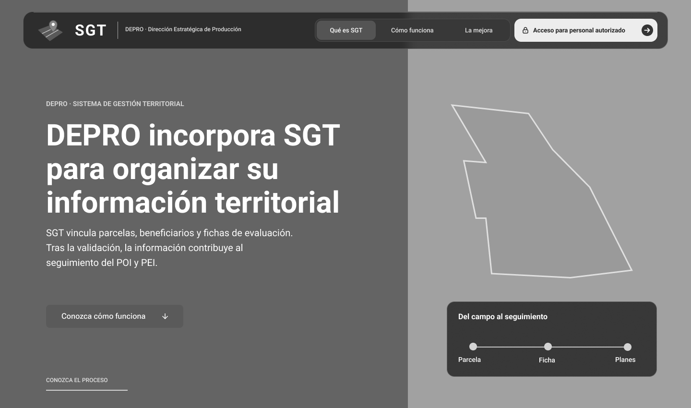

La sección «Cómo funciona» organiza el proceso en tres pasos numerados: registrar la parcela a partir de la medición enviada desde el móvil, subir la ficha PDF vinculada al beneficiario y al terreno, y validar la ficha contrastando los datos extraídos con el documento. La vista territorial y la tarjeta en estado «Borrador» dan contexto al primer paso. La numeración, los verbos de acción y el estado escrito hacen que el flujo sea comprensible incluso sin depender de los iconos.

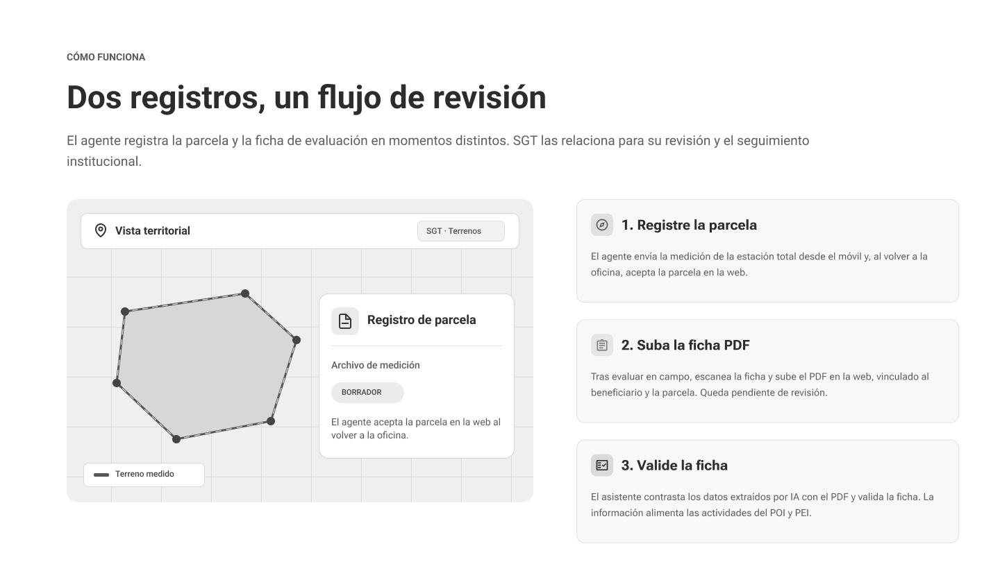

La propuesta de mejora se resume en tres ideas separadas: vínculo entre parcela, beneficiario y ficha; revisión de la información extraída por IA frente al PDF; e integridad documental con registro de quién aprueba y cuándo. Las tarjetas agrupan una idea por bloque y permiten explorar el beneficio sin leer un párrafo extenso.

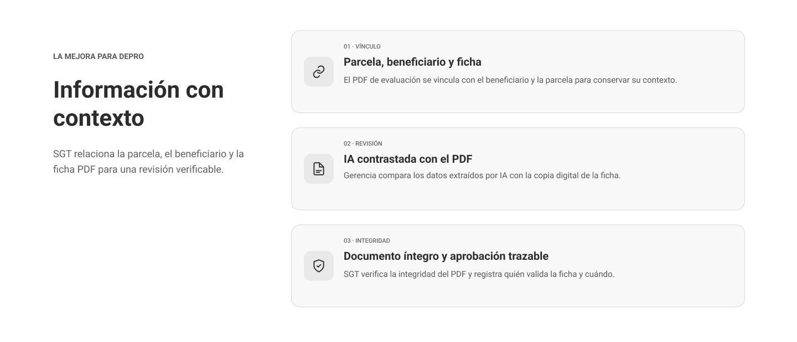

A continuación, la página traduce esos beneficios en roles concretos: el agente de campo completa los registros y la asistente de gerencia general revisa y valida cada ficha. La composición alterna ejemplos de móvil y web para explicar responsabilidades, no para presentar ambos dispositivos como una única tarea.

El cierre del recorrido muestra el destino de la información validada mediante dos bloques diferenciados, POI y PEI. El pie de página repite los enlaces de exploración, identifica a DEPRO y separa el acceso de uso interno. Así, tanto quien lee toda la página como quien llega al final puede orientarse y volver a una sección relevante.

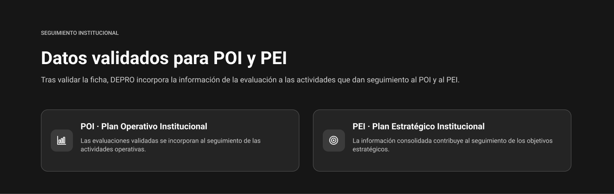

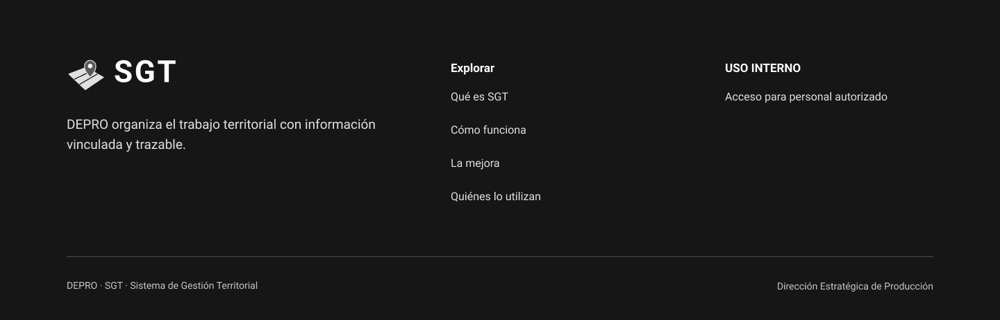

**Mobile Web Browser**

En el navegador móvil se conserva la misma secuencia informativa, pero la lectura pasa a una sola columna. La cabecera compacta incluye marca, acceso y menú; el hero mantiene un título breve, una acción principal visible y el resumen «Parcela → Ficha → Planes». «Cómo funciona» sitúa primero la vista territorial y después apila los tres pasos, de modo que no se obliga a leer columnas estrechas ni a interpretar el diagrama antes de conocer su contexto.

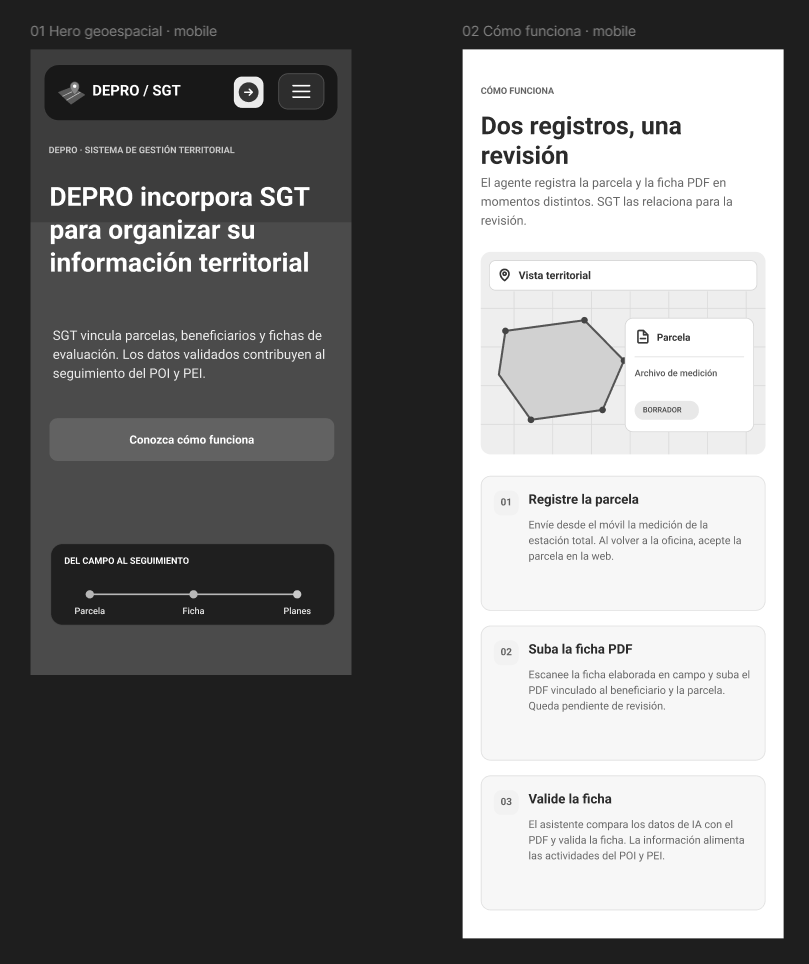

Las tres mejoras y los dos roles también se presentan como bloques verticales independientes. Los títulos, números y descripciones mantienen la jerarquía cuando se reduce el ancho; los ejemplos visuales del trabajo de campo y de la validación se colocan junto a la explicación correspondiente. Esta disposición favorece la lectura lineal, la ampliación del contenido y la identificación de cada responsabilidad sin depender de la posición izquierda/derecha del diseño de escritorio.

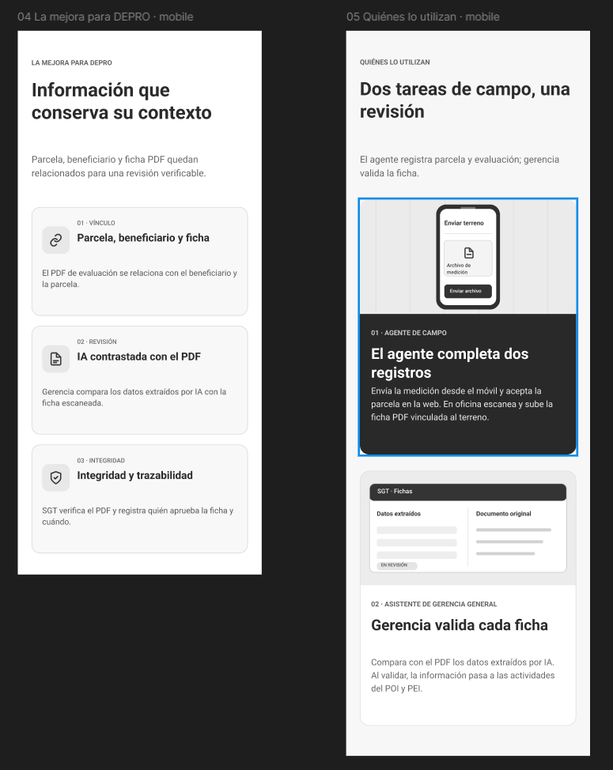

El seguimiento del POI y PEI se expresa en tarjetas consecutivas y el pie de página agrupa «Explorar» y «Uso interno» con rótulos explícitos. En conjunto, los wireframes aplican jerarquía, proximidad y consistencia al separar temas y repetir patrones; para un diseño inclusivo, priorizan texto legible, acciones nombradas, pasos numerados y estados expresados con palabras, sin que la comprensión dependa únicamente de imágenes o color.

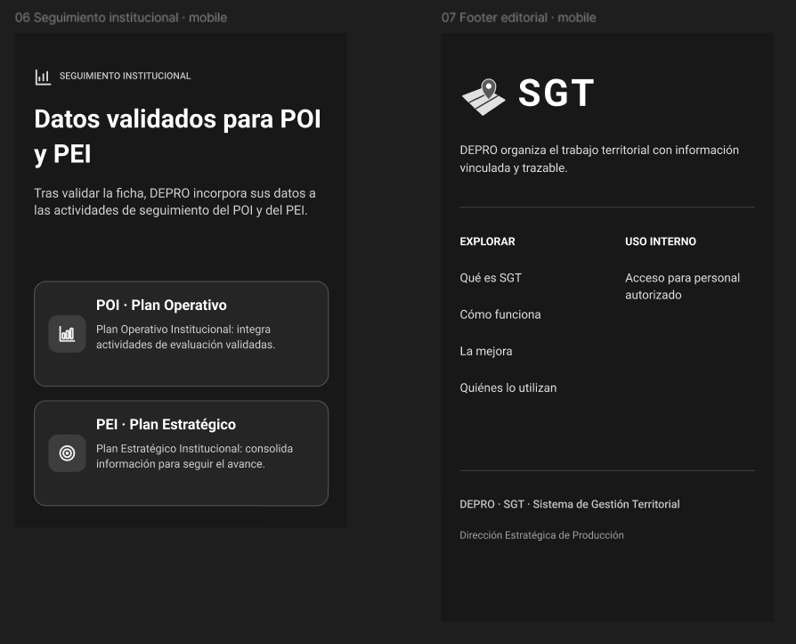

### Landing Page Mock-up

Los mock-ups desarrollan la estructura de los wireframes con la identidad visual de SGT. Mantienen la misma arquitectura de información —presentación, proceso, beneficios, roles y seguimiento institucional— y aplican el Design System definido para los productos digitales: logotipo territorial, tipografía Roboto, azul marino para superficies y títulos, teal para la acción principal, acentos verdes, tarjetas, iconos y etiquetas de estado. La landing es una página informativa; las imágenes de las aplicaciones muestran el trabajo que se explica, sin sustituir los flujos operativos de la web y del móvil.

**Desktop Web Browser**

El hero emplea una fotografía aérea y el contorno de una parcela para relacionar inmediatamente la marca con el territorio. Una capa oscura permite distinguir el título y el texto sobre la imagen; el botón teal «Conozca cómo funciona» concentra la acción principal. La navegación diferencia la exploración pública del «Acceso para personal autorizado». El pequeño recorrido «Parcela → Ficha → Planes» funciona como avance visual de la historia que desarrolla la página.

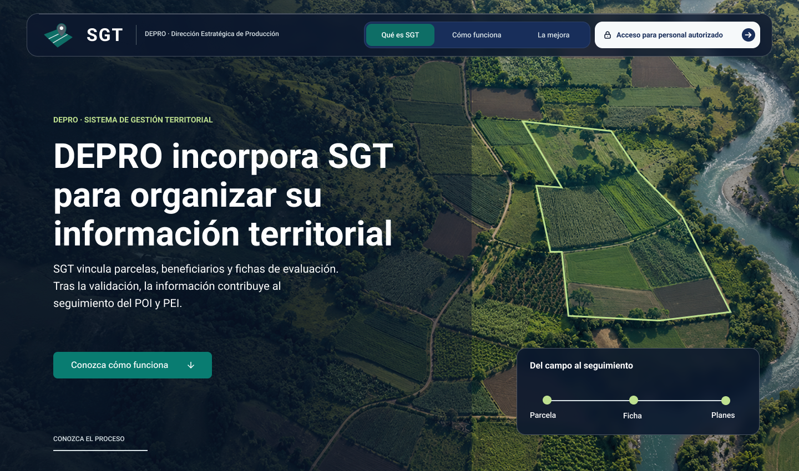

En «Cómo funciona», la vista del terreno medido aporta contexto espacial y la tarjeta «Borrador» ejemplifica un estado real del registro. A su lado, tres tarjetas numeradas explican el envío de la medición, la subida de la ficha PDF y su validación. Esta combinación de imagen contextual y pasos breves hace visible la relación entre el trabajo de campo y la revisión posterior; las etiquetas escritas complementan la iconografía y evitan que el estado se comunique solo mediante color.

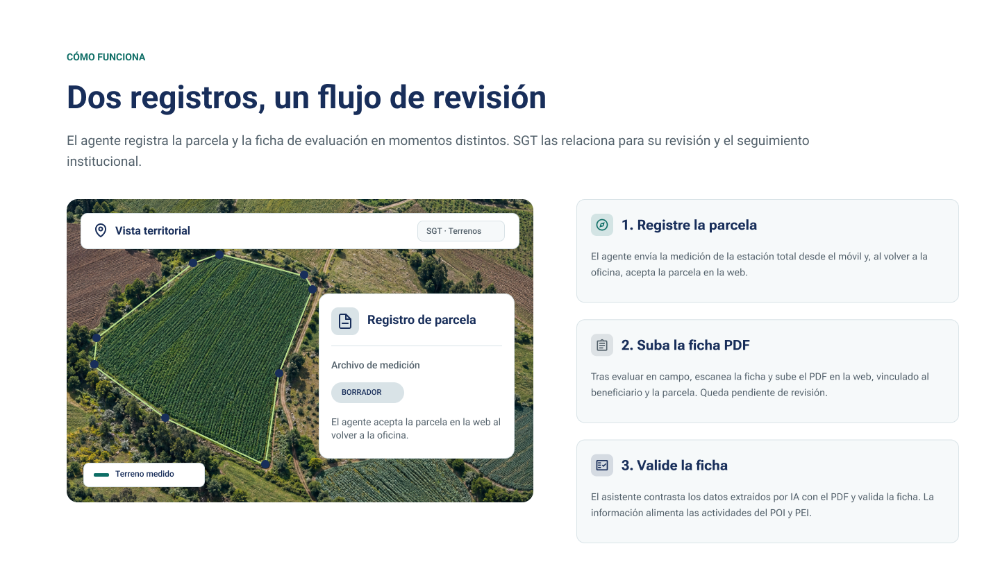

La sección «La mejora para DEPRO» utiliza tres tarjetas de igual familia visual para explicar el vínculo de los datos, la revisión de lo extraído por IA frente al PDF y la integridad con aprobación trazable.

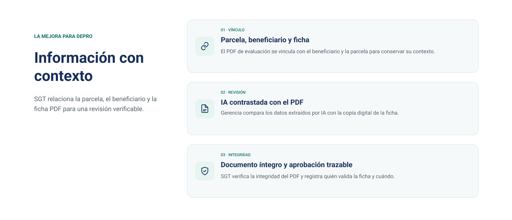

Después, «Quiénes lo utilizan» muestra por separado la tarea del agente de campo y la validación de gerencia, con representaciones del móvil y de la aplicación web. Esta progresión va de la capacidad del sistema a las personas que la ejecutan y evita confundir la captura con la aprobación.

El bloque final recupera el fondo azul marino y distingue el seguimiento operativo del POI y el estratégico del PEI mediante dos tarjetas con títulos desarrollados. El pie de página conserva la marca, los enlaces de exploración y el acceso interno. La repetición de color, tipografía, espaciado y superficies mantiene continuidad visual sin añadir nuevas categorías de navegación al final del recorrido.

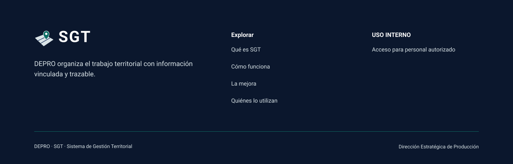

**Mobile Web Browser**

La adaptación móvil mantiene la fotografía y la superposición oscura del hero, mientras simplifica la cabecera a marca, acceso y menú. El título, la explicación y el botón ocupan el ancho disponible; la secuencia de parcela, ficha y planes queda al final del primer bloque. En «Cómo funciona», la vista territorial antecede a tres tarjetas apiladas, conservando el orden lógico del escritorio sin exigir desplazamiento horizontal.

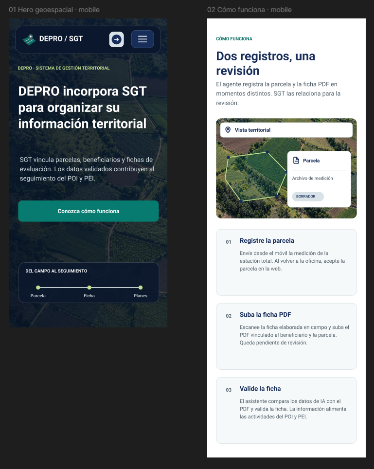

Las mejoras aparecen como tarjetas separadas con icono, número, título y explicación. Los ejemplos del agente y de gerencia se presentan uno debajo del otro, cada uno junto a su descripción; el contraste entre la superficie clara y el panel azul marino señala el cambio de rol sin depender solo de esa diferencia cromática, pues ambos están nombrados. El contenido conserva el mismo vocabulario y los mismos patrones de tarjetas que la versión de escritorio.

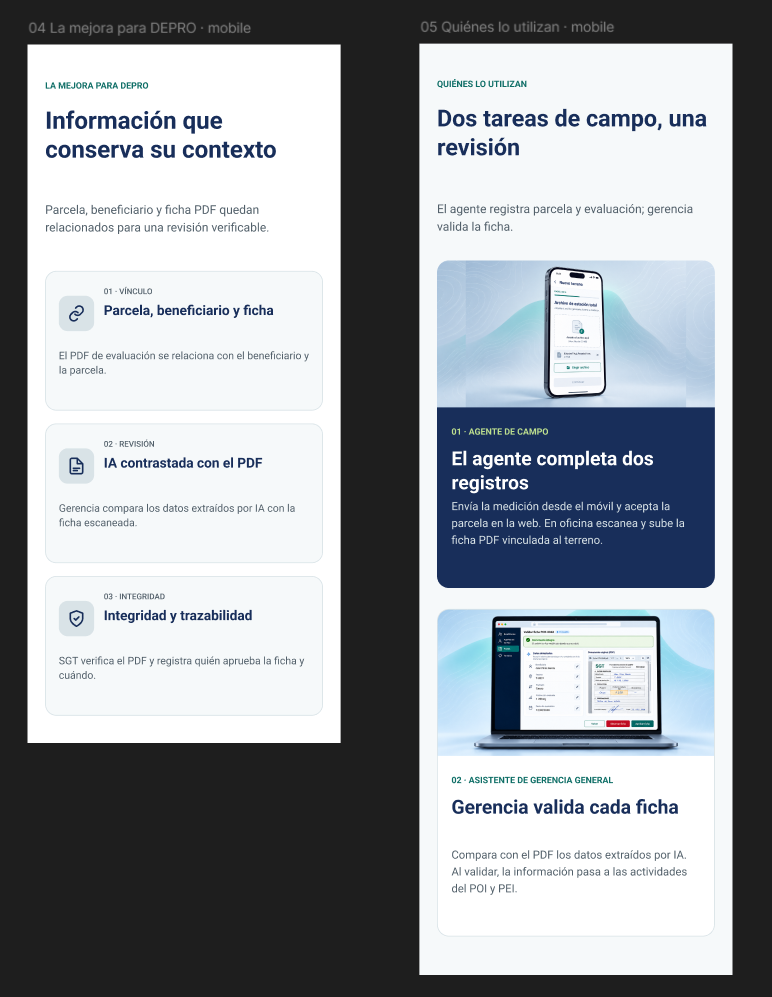

Las tarjetas POI y PEI cierran la explicación del flujo de datos y el pie conserva enlaces etiquetados para volver a explorar o entrar al uso interno. La propuesta aplica contraste entre superficies claras y oscuras, jerarquía tipográfica, agrupación por proximidad y un único énfasis de acción en el hero. Para favorecer una lectura inclusiva, los conceptos y estados relevantes se expresan con texto además de iconos y color; la disposición en una columna facilita seguir el contenido en una pantalla estrecha. Estas decisiones son visibles en los mock-ups, aunque la comprobación técnica de contraste, foco y tamaños táctiles corresponde a la implementación.

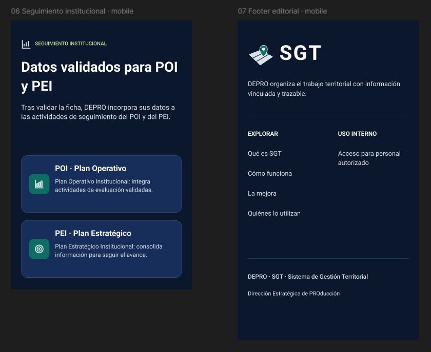

## Applications UX/UI Design

### Applications Wireframes

**Aplicación móvil (Android)**

Los wireframes de la aplicación móvil de SGT se elaboraron en Figma para el agente de campo. Esta propuesta concentra en el teléfono el registro de la medición de un terreno y el envío del archivo generado por la estación total. La aceptación posterior del terreno y la carga de fichas escaneadas corresponden a la aplicación web y se documentan por separado. Las cuatro láminas siguientes agrupan las pantallas por tarea y estado para que puedan leerse sin perder la continuidad del proceso.

El acceso presenta primero la identidad de SGT, después el inicio de sesión y, como ruta de apoyo, la recuperación de contraseña mediante correo, código de verificación y creación de una nueva clave. Cada pantalla prioriza un título, campos con etiquetas persistentes y una acción principal. La confirmación final indica el siguiente paso en vez de dejar al usuario ante un estado sin salida. Esta secuencia aplica jerarquía visual, consistencia en los controles y prevención de errores desde el primer contacto con la aplicación.

<figure style="margin: 12px 0 18px; break-inside: avoid; page-break-inside: avoid; text-align: center;">
  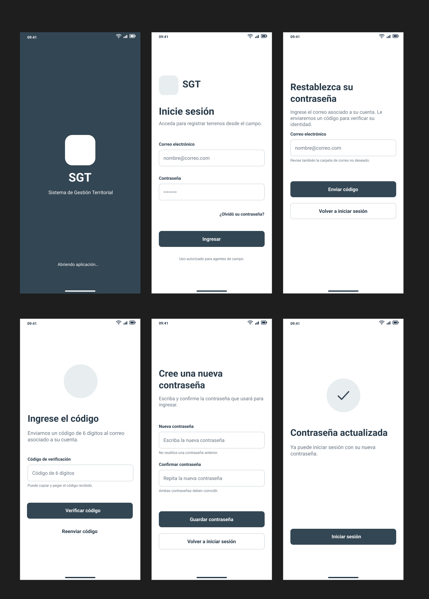
  <figcaption style="font-size: 0.9em; margin-top: 6px;">Acceso y recuperación de contraseña en la aplicación móvil.</figcaption>
</figure>

La pantalla Inicio agrupa dos destinos reconocibles: Registrar terreno como tarea principal y Mis terrenos para retomar o consultar registros. El registro avanza en cuatro pasos visibles. Primero se solicitan el código, la fecha de medición y una referencia de ubicación; luego se selecciona el archivo de la estación total y se muestra un estado distinto cuando ya está adjunto. La barra de progreso, el título de cada paso y el botón Continuar permiten saber dónde está el agente y qué falta. Guardar borrador aparece como acción secundaria y no compite visualmente con el avance.

<figure style="margin: 12px 0 18px; break-inside: avoid; page-break-inside: avoid; text-align: center;">
  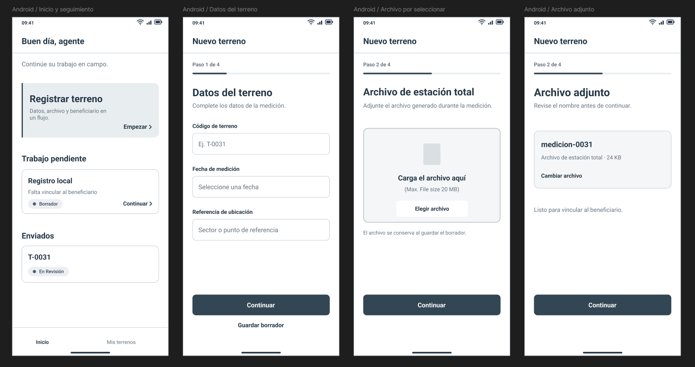
  <figcaption style="font-size: 0.9em; margin-top: 6px;">Inicio, datos del terreno y selección del archivo de medición.</figcaption>
</figure>

La vinculación del beneficiario utiliza el DNI antes del envío. El estado «DNI no encontrado» explica el problema junto al campo y ofrece Volver a validar; no presenta el error únicamente mediante un color. Cuando la identidad se confirma, una tarjeta muestra el resultado y permite cambiar el DNI antes de seguir. La revisión reúne código, fecha, archivo y beneficiario para comprobarlos antes de Enviar terreno. La confirmación comunica que el registro llegó a la web y quedó en revisión; no representa la aprobación final del terreno.

<figure style="margin: 12px 0 18px; break-inside: avoid; page-break-inside: avoid; text-align: center;">
  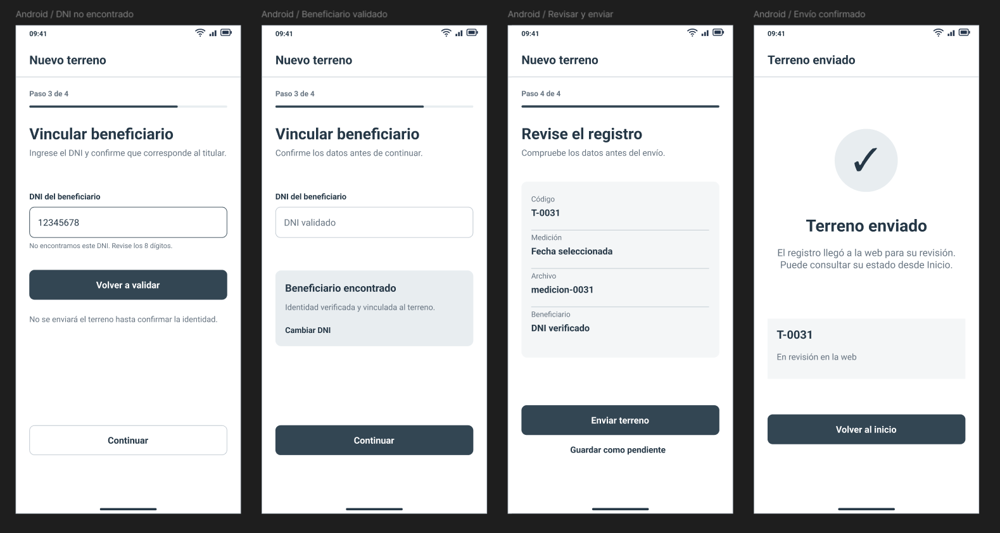
  <figcaption style="font-size: 0.9em; margin-top: 6px;">Validación del beneficiario, revisión y resultado del envío.</figcaption>
</figure>

Mis terrenos separa los registros pendientes de los enviados mediante pestañas. Cada tarjeta expresa su estado con palabras y, cuando el terreno ya tiene código, lo muestra para facilitar la consulta. La pantalla «Pendiente de envío» hace visible una interrupción de conectividad y ofrece Reintentar ahora o Volver a pendientes. Así se distinguen la consulta, la recuperación de la tarea y los resultados sin depender solo del contraste cromático. La navegación inferior mantiene Inicio y Mis terrenos como destinos estables, mientras que el contenido de cada pantalla sigue un orden vertical de título, información y acción.

<figure style="margin: 12px 0 18px; break-inside: avoid; page-break-inside: avoid; text-align: center;">
  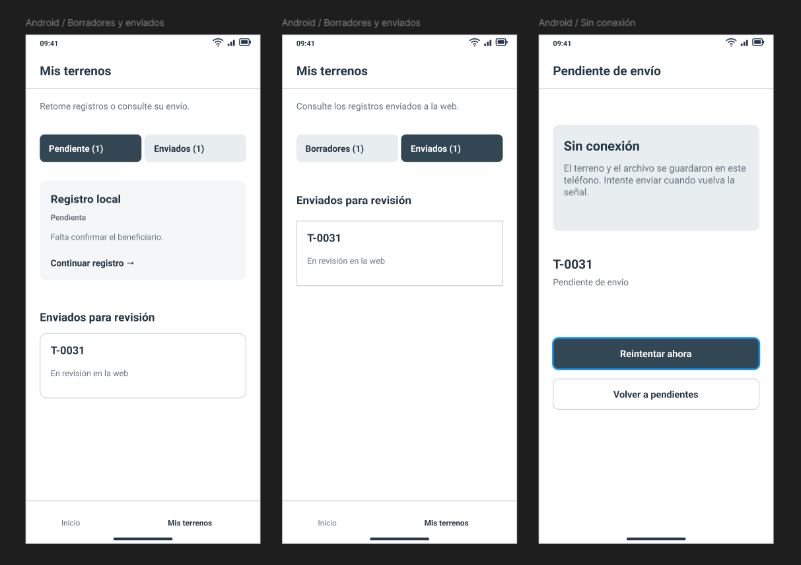
  <figcaption style="font-size: 0.9em; margin-top: 6px;">Consulta de registros y estado de conectividad.</figcaption>
</figure>

En conjunto, la propuesta aplica una arquitectura de información orientada a tareas: acceso, registro guiado, validación previa y seguimiento. La composición de una columna, las etiquetas visibles, los textos de ayuda, la diferencia entre acciones principales y secundarias y los estados descritos con palabras favorecen la lectura en una pantalla pequeña y el uso por agentes con distintas condiciones de visión o familiaridad digital. Las áreas táctiles, el contraste y la tipografía siguen las reglas definidas en la guía de estilos de SGT; las barras de estado y de gestos respetan las convenciones de Android.

**Aplicación web**

Los wireframes de la aplicación web se elaboraron en Figma para los dos usuarios del sistema: el agente de campo, que crea y valida terrenos y sube las fichas, y la asistente de gerencia general, que valida esas fichas contra su PDF. Todas las pantallas comparten el mismo esquema. Una barra lateral da acceso a Beneficiarios, Agentes de campo, Fichas y Terrenos, y el mapa queda siempre de fondo. Las secciones se abren junto al mapa o a pantalla completa según el espacio que necesitan, y cada panel lleva los botones para colapsarlo y cerrarlo. Las pantallas se presentan en el orden en que se usan, desde el acceso hasta el trabajo de cada rol.

**Inicio de sesión**

Pantalla de acceso dividida en dos zonas. A la izquierda va la identidad de SGT con una frase que resume su propósito, y a la derecha el formulario con usuario o DNI, contraseña y el botón Iniciar sesión. Debajo están los enlaces para recuperar la contraseña y para solicitar acceso. El texto de apoyo aclara que lo que el usuario ve después depende del rol que tiene asignado.

<figure style="margin: 12px 0 18px; break-inside: avoid; page-break-inside: avoid; text-align: center;">
  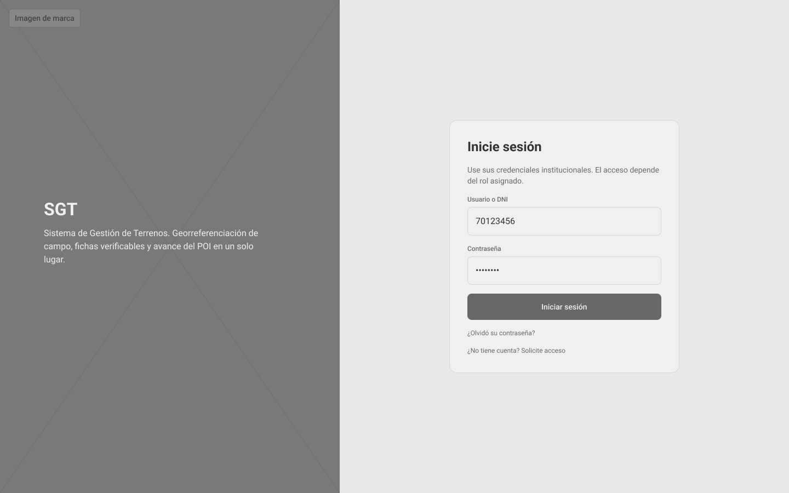
  <figcaption style="font-size: 0.9em; margin-top: 6px;">Inicio de sesión con credenciales institucionales.</figcaption>
</figure>

**Solicitar acceso**

SGT es de uso interno, así que no hay registro libre. Esta pantalla recoge el DNI, los nombres y apellidos, el correo institucional y la oficina zonal, y envía la solicitud a la Oficina de Tecnologías, que habilita la cuenta tras verificar los datos. El texto de apoyo lo explica para que el usuario no espere un acceso inmediato.

<figure style="margin: 12px 0 18px; break-inside: avoid; page-break-inside: avoid; text-align: center;">
  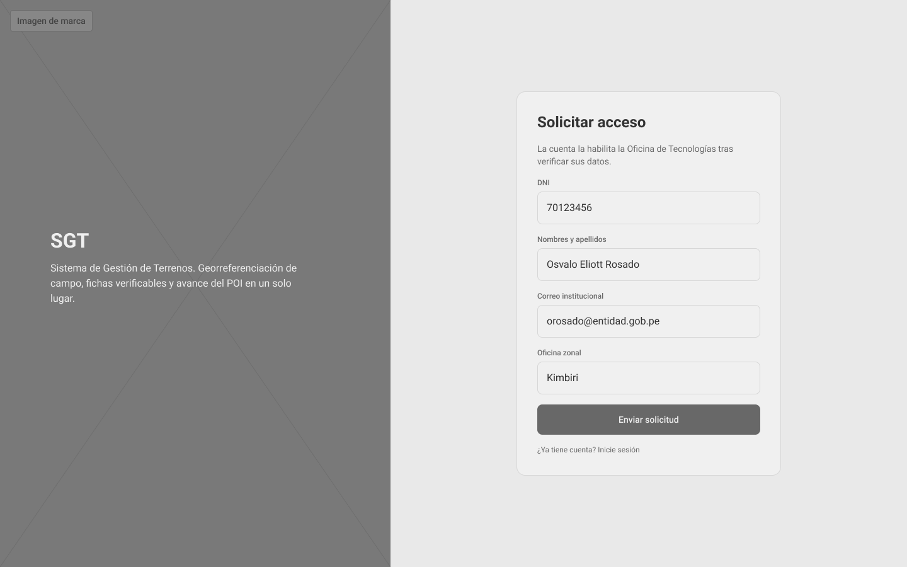
  <figcaption style="font-size: 0.9em; margin-top: 6px;">Solicitud de acceso revisada por la Oficina de Tecnologías.</figcaption>
</figure>

**Recuperar contraseña**

El usuario indica su DNI o su correo institucional y recibe un enlace para restablecer la contraseña. La pantalla muestra el estado Enlace enviado con el plazo de vencimiento del enlace y ofrece volver al inicio de sesión, de modo que el usuario sabe qué hacer a continuación.

<figure style="margin: 12px 0 18px; break-inside: avoid; page-break-inside: avoid; text-align: center;">
  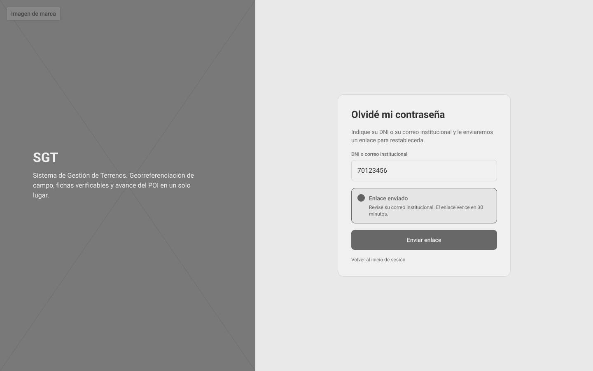
  <figcaption style="font-size: 0.9em; margin-top: 6px;">Recuperación de contraseña con confirmación del envío.</figcaption>
</figure>

**Vista general (mapa)**

Es el punto de partida después de iniciar sesión. El mapa ocupa toda la pantalla y dibuja cada terreno como un polígono. La barra lateral queda colapsada en iconos, los controles de capas, zoom y centrado están a la derecha, y la leyenda distingue los terrenos validados, los borradores y el seleccionado. La barra inferior muestra la posición del cursor y la escala.

<figure style="margin: 12px 0 18px; break-inside: avoid; page-break-inside: avoid; text-align: center;">
  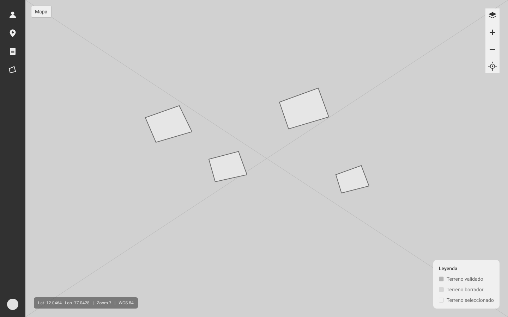
  <figcaption style="font-size: 0.9em; margin-top: 6px;">Mapa de terrenos como vista principal.</figcaption>
</figure>

**Beneficiarios**

Panel abierto junto al mapa para buscar beneficiarios por DNI o nombre. La tabla muestra el DNI, los nombres y apellidos, la zona, el número de terrenos y el estado de cada beneficiario, con paginación al pie. El mapa sigue visible a la derecha y señala la zona y los terrenos que están en vista.

<figure style="margin: 12px 0 18px; break-inside: avoid; page-break-inside: avoid; text-align: center;">
  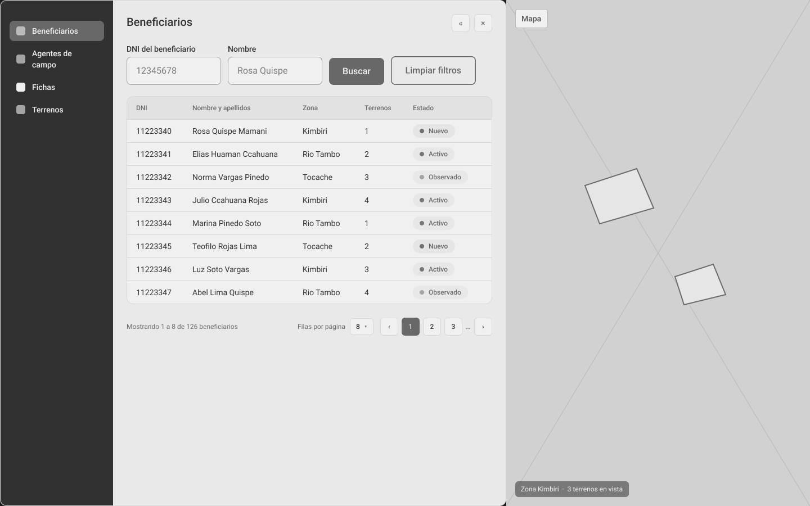
  <figcaption style="font-size: 0.9em; margin-top: 6px;">Búsqueda de beneficiarios con el mapa desplazado.</figcaption>
</figure>

**Agentes de campo**

Sigue el mismo patrón que Beneficiarios. Se filtra por DNI del agente y por zona, y la tabla indica cuántas fichas registró cada agente en el mes y si está en campo, activo o sin reportar. Repetir la estructura reduce lo que el usuario tiene que aprender de una sección a otra.

<figure style="margin: 12px 0 18px; break-inside: avoid; page-break-inside: avoid; text-align: center;">
  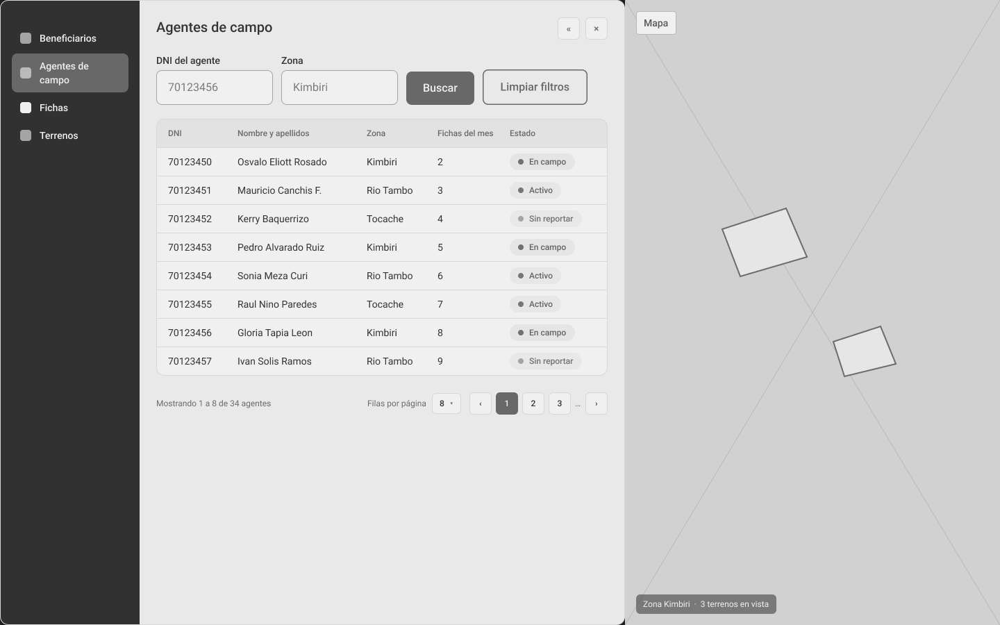
  <figcaption style="font-size: 0.9em; margin-top: 6px;">Consulta de agentes de campo por DNI y zona.</figcaption>
</figure>

**Fichas (asistente de gerencia general)**

Vista a pantalla completa porque la tabla necesita todo el ancho. Se filtra por código de ficha, DNI del agente y estado, y cada fila muestra las fechas de llenado y de validación, el terreno vinculado y el estado escrito en un chip. Las fichas en revisión u observadas llevan el botón Validar, que abre la pantalla de validación.

<figure style="margin: 12px 0 18px; break-inside: avoid; page-break-inside: avoid; text-align: center;">
  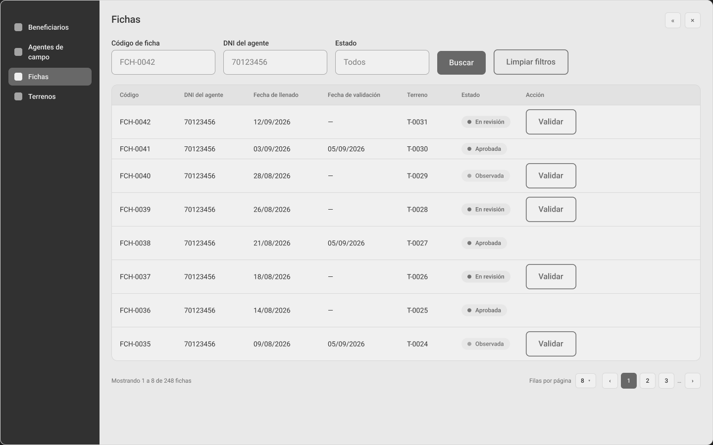
  <figcaption style="font-size: 0.9em; margin-top: 6px;">Bandeja de fichas con acceso a la validación.</figcaption>
</figure>

**Validar ficha**

Es la pantalla central de la asistente. Arriba, una alerta confirma que el PDF no cambió desde que se subió. Debajo, la pantalla se divide en dos columnas: a la izquierda los datos que extrajo la IA, cada uno editable, y a la derecha el documento original con la línea correspondiente resaltada. Así la asistente compara dato y documento sin cambiar de pantalla. Si corrige un valor, el campo lo indica. Un aviso explica que al aprobar se notifica al sistema del POI y se registra quién aprobó y cuándo. Las acciones son Volver, Observar ficha y Aprobar ficha.

<figure style="margin: 12px 0 18px; break-inside: avoid; page-break-inside: avoid; text-align: center;">
  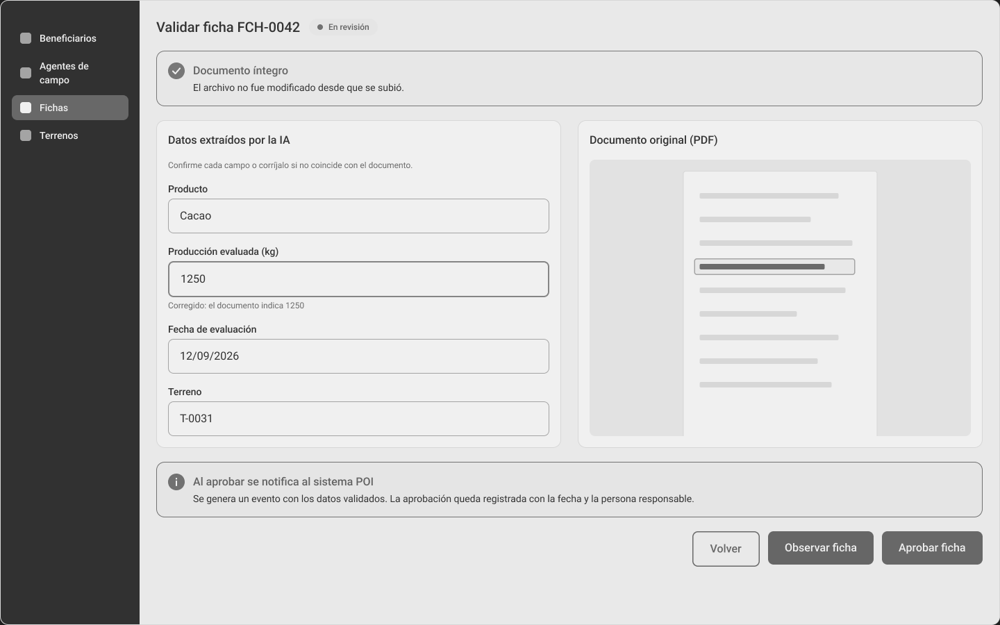
  <figcaption style="font-size: 0.9em; margin-top: 6px;">Validación de la ficha: datos de la IA frente al documento original.</figcaption>
</figure>

**Terrenos (asistente de gerencia general)**

Tabla de solo consulta con el código, el DNI del beneficiario, el número de vértices del perímetro, la fecha de actualización y el estado de cada terreno. La asistente no crea ni valida terrenos, por eso esta vista no tiene acciones y solo muestra los terrenos validados.

<figure style="margin: 12px 0 18px; break-inside: avoid; page-break-inside: avoid; text-align: center;">
  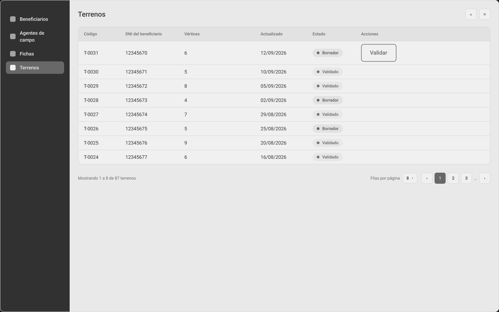
  <figcaption style="font-size: 0.9em; margin-top: 6px;">Consulta de terrenos validados.</figcaption>
</figure>

**Detalle de terreno (asistente de gerencia general)**

Al pulsar un terreno en el mapa se abre un popup con el DNI del beneficiario, el área estimada y dos desplegables. El de vértices permanece cerrado, porque a la asistente le interesan las fichas, pero los vértices quedan numerados sobre el polígono del mapa. El de fichas lista las fichas del terreno con su estado y el botón Validar en la que está pendiente, lo que ofrece un segundo camino hacia la validación.

<figure style="margin: 12px 0 18px; break-inside: avoid; page-break-inside: avoid; text-align: center;">
  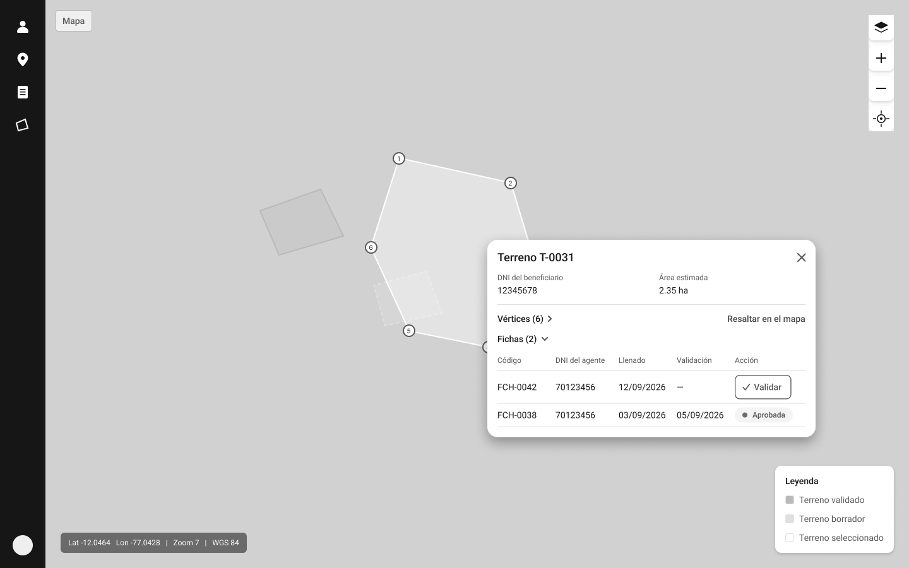
  <figcaption style="font-size: 0.9em; margin-top: 6px;">Detalle de terreno desde el mapa, vista de la asistente.</figcaption>
</figure>

**Terrenos (agente de campo)**

La misma tabla, pero con las acciones del agente. El botón Crear terreno queda arriba a la derecha, y los borradores que el agente guardó muestran el botón Validar. El agente ve todos los terrenos validados, pero solo sus propios borradores.

<figure style="margin: 12px 0 18px; break-inside: avoid; page-break-inside: avoid; text-align: center;">
  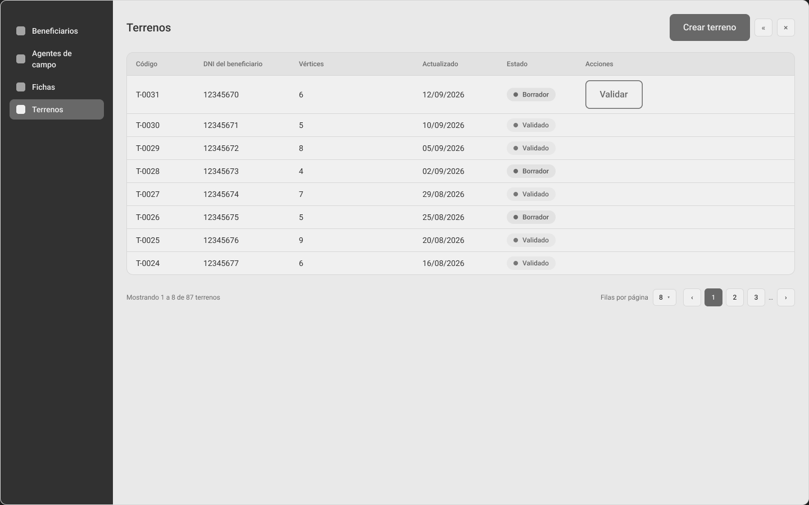
  <figcaption style="font-size: 0.9em; margin-top: 6px;">Tabla de terrenos con las acciones del agente de campo.</figcaption>
</figure>

**Crear terreno**

Un terreno no se ubica con un solo punto: su perímetro es un polígono. Por eso el modal tiene dos columnas. A la izquierda van el código, que se asigna automáticamente, el DNI y el nombre del beneficiario, el área, que se calcula a partir de los vértices, y una vista previa del perímetro. A la derecha está la lista de vértices. El agente puede cargar el archivo de la estación total o escribir cada vértice a mano con su Este y su Norte en coordenadas UTM, agregarlos y quitarlos. La vista previa avisa desde el inicio que se necesitan al menos 3 vértices para dibujar el perímetro.

<figure style="margin: 12px 0 18px; break-inside: avoid; page-break-inside: avoid; text-align: center;">
  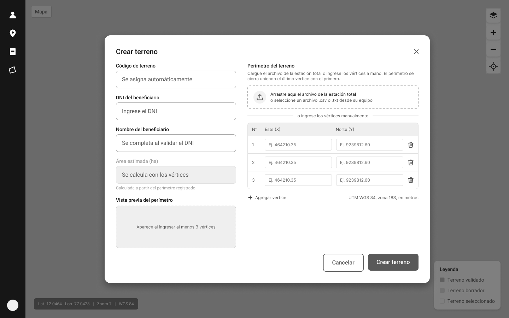
  <figcaption style="font-size: 0.9em; margin-top: 6px;">Creación de un terreno a partir de la lista de vértices de su perímetro.</figcaption>
</figure>

**Validar terreno**

Cuando el agente envió la medición desde el móvil, el terreno llega como borrador con los vértices ya leídos del archivo. El modal muestra el nombre del archivo y cuántos vértices tiene, la tabla en modo lectura y el polígono dibujado con sus vértices numerados. Si un punto tiene un error de lectura, el agente edita solo esa fila, como ocurre en el vértice 4, sin volver a capturar el resto. El área se recalcula con cada cambio.

<figure style="margin: 12px 0 18px; break-inside: avoid; page-break-inside: avoid; text-align: center;">
  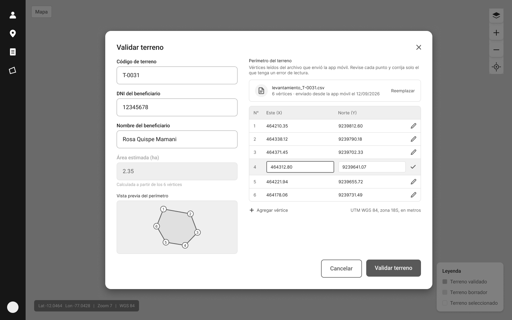
  <figcaption style="font-size: 0.9em; margin-top: 6px;">Validación de un terreno precargado y corrección puntual de un vértice.</figcaption>
</figure>

**Detalle de terreno (agente de campo)**

En la vista del agente el desplegable de vértices se abre y muestra la tabla con el número y las coordenadas Este y Norte de cada punto, mientras el polígono del mapa los numera en el mismo orden. Debajo están las fichas del terreno y el botón Subir ficha, que abre el modal con el terreno ya vinculado.

<figure style="margin: 12px 0 18px; break-inside: avoid; page-break-inside: avoid; text-align: center;">
  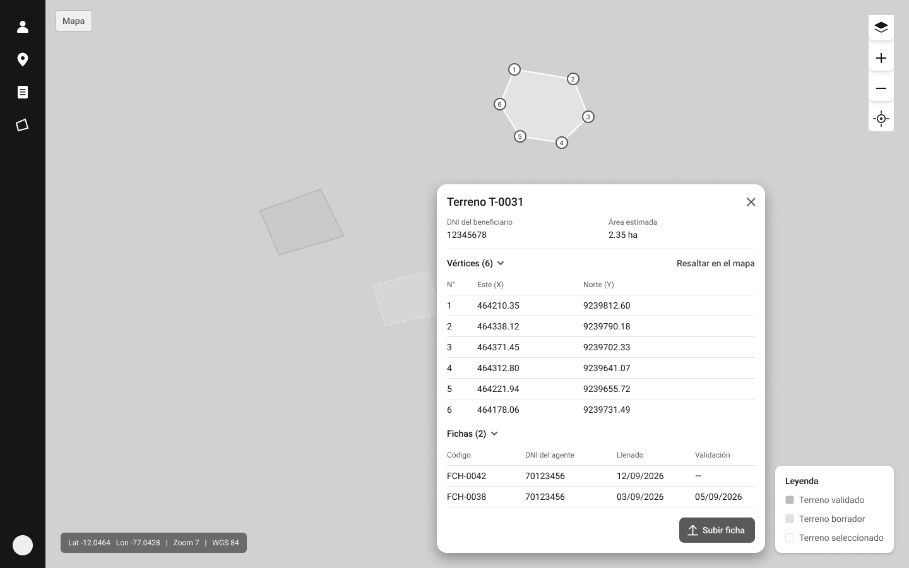
  <figcaption style="font-size: 0.9em; margin-top: 6px;">Detalle de terreno con sus vértices, vista del agente.</figcaption>
</figure>

**Subir ficha**

Modal con el código de la ficha, la fecha de llenado y el terreno vinculado, en el orden en que el agente los encuentra en el documento físico. La zona de carga acepta el PDF arrastrado o seleccionado desde el equipo. Al subirlo, el sistema guarda el PDF sin modificar y su hash, que después permite comprobar su integridad.

<figure style="margin: 12px 0 18px; break-inside: avoid; page-break-inside: avoid; text-align: center;">
  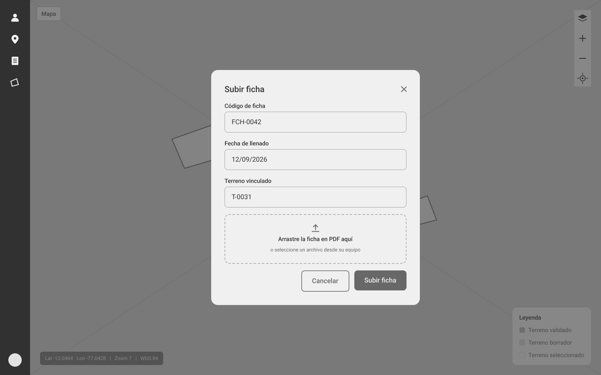
  <figcaption style="font-size: 0.9em; margin-top: 6px;">Subida de la ficha digitalizada.</figcaption>
</figure>

**Mis fichas**

El agente consulta las fichas que subió con los mismos filtros que usa la asistente. El estado de cada ficha le dice si sigue en revisión, si fue aprobada o si fue observada y debe corregirse, sin tener que llamar a la sede.

<figure style="margin: 12px 0 18px; break-inside: avoid; page-break-inside: avoid; text-align: center;">
  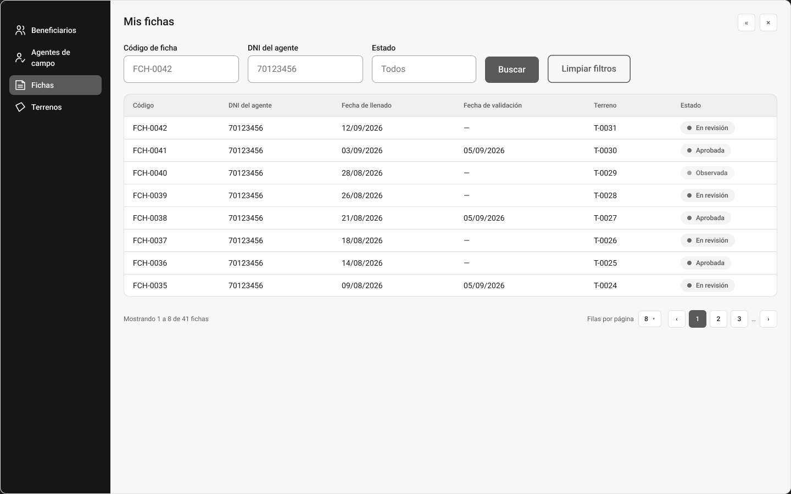
  <figcaption style="font-size: 0.9em; margin-top: 6px;">Seguimiento de las fichas subidas por el agente.</figcaption>
</figure>

**Configuración de cuenta**

Agrupa los datos del usuario en tres bloques: Cuenta, con el correo, el área y el teléfono; Seguridad, con la contraseña, la verificación en dos pasos y las sesiones activas; y Preferencias, con el idioma, las notificaciones y la zona horaria. Desde aquí también se cierra la sesión.

<figure style="margin: 12px 0 18px; break-inside: avoid; page-break-inside: avoid; text-align: center;">
  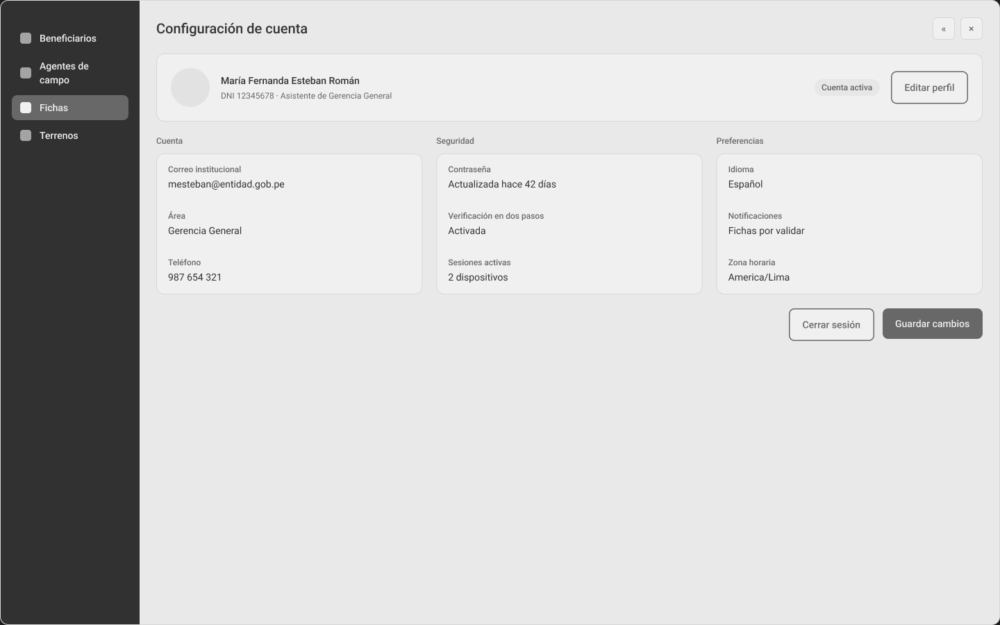
  <figcaption style="font-size: 0.9em; margin-top: 6px;">Configuración de la cuenta y cierre de sesión.</figcaption>
</figure>

En conjunto, los wireframes web aplican tres decisiones constantes. El mapa es el fondo del trabajo y no una sección más. Las tablas comparten filtros, columnas y paginación en todas las secciones. Los estados de fichas y terrenos se escriben siempre con palabras. Las diferencias entre roles se resuelven con las acciones visibles en cada pantalla y no con pantallas distintas, de modo que el agente y la asistente reconocen el mismo sistema aunque cada uno trabaje en una parte del proceso.

### Applications Wireflow Diagrams

#### Aplicación móvil (Android) — Agente de Campo

Los siguientes wireflows corresponden a Marco Quispe Huamán, el User Persona Agente de Campo. Su trabajo exige registrar la medición de un terreno y conservarla aun cuando la conectividad sea limitada. Se presentan tres objetivos dentro del alcance de la aplicación móvil: ingresar al sistema, recuperar el acceso y registrar y enviar un terreno. El primero se relaciona con la User Story SGT-10; el tercero desarrolla SGT-2 a partir de las pantallas propuestas. La recuperación de contraseña es una ruta de apoyo necesaria para que el agente pueda volver a su tarea.

Antes de diagramar cada objetivo se establece su Task Flow como secuencia de acciones. En las figuras, las flechas continuas representan el recorrido principal y las discontinuas llevan a una respuesta alternativa. Cada cambio visible de la interfaz se muestra con un wireframe completo, incluidos la barra de estado y el indicador de gestos de Android. Así es posible leer tanto la acción del agente como la respuesta del sistema, sin inferir un estado que no aparece en la pantalla.

##### WF-01 · Acceder al espacio de trabajo

**User goal.** Como agente de campo, quiero ingresar con mis credenciales institucionales para registrar terrenos desde mi cuenta.

**Task Flow.** Abrir la aplicación → ingresar correo y contraseña → pulsar «Ingresar» → acceder a Inicio.

El flujo comienza con la pantalla de presentación y continúa con el formulario de acceso. El siguiente wireframe muestra las credenciales completas antes de la acción; la ruta principal termina en Inicio, donde «Registrar terreno» es la tarea destacada. Si las credenciales no coinciden, una flecha discontinua conduce a una pantalla de error completa. El mensaje permite corregir e intentar otra vez sin señalar si falló el correo o la contraseña, de acuerdo con el criterio de SGT-10.

<figure style="margin: 10px 0 14px; text-align: center; break-inside: avoid; page-break-inside: avoid;">
  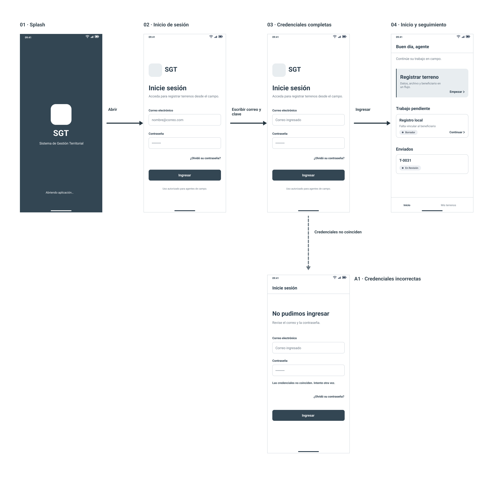
  <figcaption style="font-size: 0.9em; margin-top: 6px;">WF-01. Acceso institucional y respuesta ante credenciales incorrectas.</figcaption>
</figure>

##### WF-02 · Recuperar el acceso a la cuenta

**User goal.** Como agente de campo, quiero restablecer mi contraseña cuando la olvide para volver a ingresar a la aplicación y continuar mi trabajo.

**Task Flow.** Seleccionar «¿Olvidó su contraseña?» → introducir el correo → solicitar el código → verificarlo → crear una nueva contraseña → volver al inicio de sesión.

La ruta principal enlaza el formulario de acceso con la solicitud del código, su verificación, la creación de una nueva contraseña y la confirmación del cambio. La ruta alternativa parte de la solicitud del código: cuando el correo no tiene un formato válido, se muestra otro wireframe con el campo y la indicación para corregirlo. La confirmación final incluye «Iniciar sesión», por lo que el agente conoce el siguiente paso y no queda en una pantalla sin salida.

<figure style="margin: 10px 0 14px; text-align: center; break-inside: avoid; page-break-inside: avoid;">
  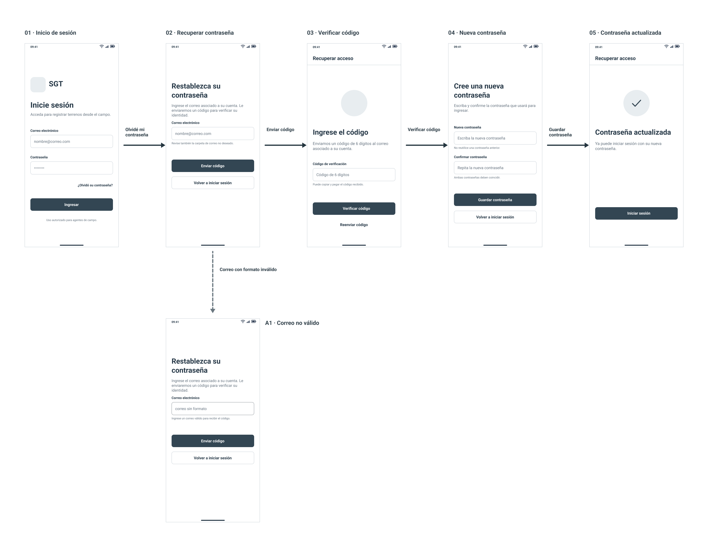
  <figcaption style="font-size: 0.9em; margin-top: 6px;">WF-02. Recuperación de contraseña y corrección de un correo no válido.</figcaption>
</figure>

##### WF-03 · Registrar y enviar un terreno medido

**User goal.** Como agente de campo, quiero cargar la medición de la estación total y vincular el terreno con su beneficiario para enviarlo a la web sin perder la información capturada en campo.

**Task Flow.** Empezar el registro → completar código, fecha y referencia de ubicación → seleccionar el archivo de la estación total → comprobar el archivo adjunto → validar el DNI → revisar los datos → enviar el terreno.

La ruta principal sigue los cuatro pasos visibles del formulario móvil. El archivo por seleccionar y el archivo adjunto son wireframes distintos, porque la selección cambia el estado de la pantalla. Tras validar el DNI, el agente revisa en un resumen el código, la medición, el archivo y el beneficiario antes de enviar. La confirmación indica que el registro llegó a la web para su revisión; no equivale a la aprobación definitiva del terreno. Esta propuesta desarrolla el envío del archivo previsto en SGT-2 e incorpora la vinculación y revisión que muestran los wireframes actuales.

La primera ruta alternativa representa «DNI no encontrado» con una pantalla completa que explica el problema y permite volver a validar. La segunda se produce al enviar sin señal: el estado «Pendiente de envío» comunica que el terreno y el archivo quedaron guardados en el teléfono y ofrece reintentar. Así, la falta de conectividad no se interpreta como pérdida de la medición.

<figure style="margin: 10px 0 14px; text-align: center; break-inside: avoid; page-break-inside: avoid;">
  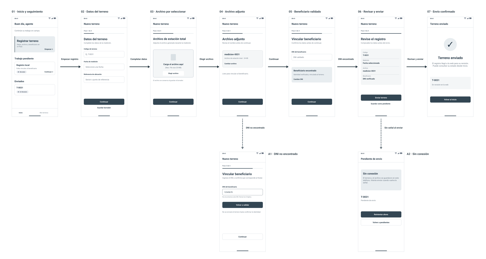
  <figcaption style="font-size: 0.9em; margin-top: 6px;">WF-03. Registro y envío de un terreno con respuestas ante DNI no encontrado y falta de conexión.</figcaption>
</figure>

En los tres diagramas, los títulos, números de paso, etiquetas de las flechas y mensajes de estado expresan el recorrido con palabras. Las acciones principales mantienen una posición reconocible y los errores explican cómo continuar. Esta consistencia apoya la lectura en una pantalla pequeña y evita que el agente deba interpretar el flujo únicamente por el color o por la forma de las flechas.

**Aplicación web: Agente de Campo y Asistente de Gerencia General**

Los wireflows de la aplicación web cubren las tareas que el móvil deja fuera: validar el terreno que llegó como borrador, subir la ficha firmada y validarla contra su PDF. Corresponden a los dos User Persona del proyecto, Marco Quispe Huamán como Agente de Campo y Rocío Fernández Salas como Asistente de Gerencia General, y se usan los mismos wireframes presentados en la sección anterior. Se mantienen las convenciones de los diagramas móviles: las flechas continuas marcan el recorrido principal, las discontinuas el camino de corrección o la respuesta alternativa, y los rombos las decisiones del usuario o del sistema. Cada pantalla lleva su número de paso y cada flecha el nombre de la acción que la dispara.

**WF-04 · Registrar un terreno y subir su ficha**

**User goal.** Como agente de campo, quiero dejar registrado el perímetro del terreno y subir la ficha de evaluación firmada para que la asistente pueda validarla sin que nadie transcriba los datos.

**User persona.** Marco Quispe Huamán, Agente de Campo.

**Task Flow.** Iniciar sesión → abrir Terrenos → crear el terreno con sus vértices → guardar el borrador → validar los vértices → abrir el detalle del terreno → subir la ficha en PDF → consultar Mis fichas.

El agente inicia sesión y llega a la tabla de terrenos. Con Crear terreno abre el modal, completa el DNI del beneficiario y registra los vértices del perímetro, ya sea cargando el archivo de la estación total o escribiéndolos a mano. Si falta el DNI o hay menos de 3 vértices, el modal marca los campos y el agente los corrige sin salir de él. Al guardar, el terreno queda como borrador y pasa a Validar terreno, donde el agente revisa cada vértice y, si uno está mal leído, edita solo esa fila. Una vez validado, el detalle del terreno muestra sus vértices y el botón Subir ficha. El modal de subida exige un PDF legible y completo. Si no lo es, el agente vuelve a cargarlo, y si lo es, la ficha aparece en Mis fichas con el estado En revisión. La primera decisión del recorrido corresponde al inicio de sesión de SGT-10, el borrador y su validación a SGT-2 y la subida de la ficha a SGT-3.

<figure style="margin: 10px 0 14px; text-align: center; break-inside: avoid; page-break-inside: avoid;">
  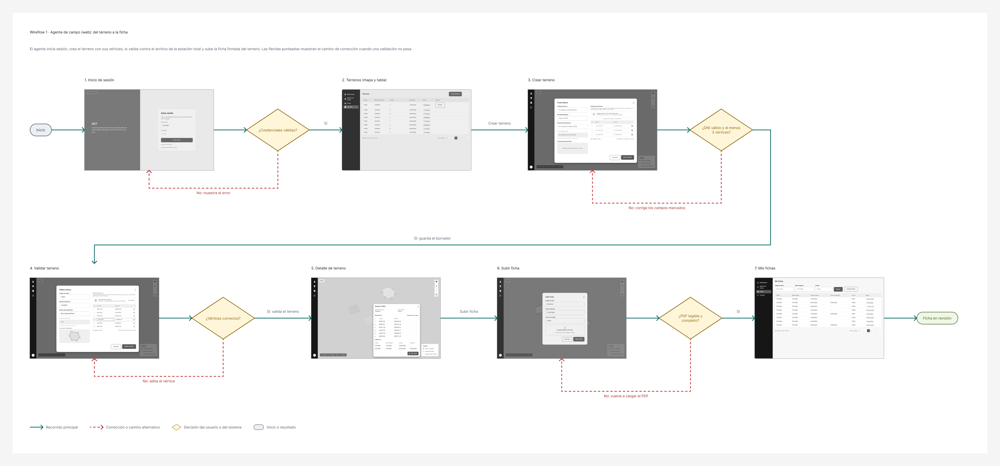
  <figcaption style="font-size: 0.9em; margin-top: 6px;">WF-04. Registro del terreno por sus vértices y subida de la ficha.</figcaption>
</figure>

**WF-05 · Validar una ficha contra su documento**

**User goal.** Como asistente de gerencia general, quiero comparar los datos que extrajo la IA con el PDF original para aprobar la ficha con la seguridad de que el documento no fue alterado.

**User persona.** Rocío Fernández Salas, Asistente de Gerencia General.

**Task Flow.** Iniciar sesión → abrir Fichas → elegir una ficha en revisión → pulsar Validar → revisar la integridad del PDF → comparar los datos extraídos con el documento → aprobar u observar la ficha.

Después del inicio de sesión, la asistente llega a la vista general y abre Fichas, donde filtra las que están en revisión. Al pulsar Validar entra a la pantalla de validación. La primera decisión la toma el sistema: compara el hash del PDF con el que se guardó al subirlo. Si no coincide, la ficha queda marcada como Alterada y no puede aprobarse. Si coincide, la asistente compara campo por campo los datos de la IA con el documento, que aparecen lado a lado. Cuando todo coincide, aprueba la ficha y el dato se consolida en el seguimiento del PEI y del POI con el registro de quién aprobó y cuándo. Si encuentra una diferencia que no puede resolver, observa la ficha y esta vuelve al agente. El recorrido desarrolla SGT-4 en la búsqueda, SGT-5 en la revisión de campos críticos y SGT-6 en la verificación de integridad.

<figure style="margin: 10px 0 14px; text-align: center; break-inside: avoid; page-break-inside: avoid;">
  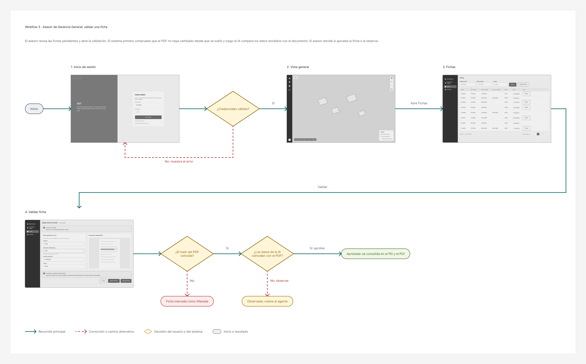
  <figcaption style="font-size: 0.9em; margin-top: 6px;">WF-05. Validación de una ficha con verificación de integridad y resultado aprobado, observado o alterado.</figcaption>
</figure>

**WF-06 · Gestionar el acceso a la cuenta**

**User goal.** Como usuario de SGT, quiero solicitar mi cuenta, recuperar mi contraseña cuando la olvide y ajustar mis datos para mantener el acceso al sistema sin depender de terceros más allá de lo necesario.

**User persona.** Marco Quispe Huamán, Agente de Campo, y Rocío Fernández Salas, Asistente de Gerencia General.

**Task Flow.** Solicitud de acceso: pulsar Solicite acceso → completar los datos → enviar la solicitud. Recuperación: pulsar ¿Olvidó su contraseña? → indicar el DNI o el correo → recibir el enlace. Configuración: ingresar → abrir el menú de cuenta → editar los datos → guardar los cambios.

Los tres recorridos parten del inicio de sesión. En el primero, el usuario completa la solicitud y, si los datos están completos y son válidos, la solicitud llega a la Oficina de Tecnologías, que habilita la cuenta. Si falta algún dato, el formulario lo señala. En el segundo, el sistema envía el enlace de restablecimiento solo si el DNI o el correo están registrados, y si no lo están, muestra un aviso sin revelar qué cuentas existen. En el tercero, el usuario entra a Configuración de cuenta desde el menú de la cuenta y guarda los cambios cuando son válidos. Desde la misma pantalla puede cerrar sesión. Los recorridos se relacionan con SGT-10 y SGT-11.

<figure style="margin: 10px 0 14px; text-align: center; break-inside: avoid; page-break-inside: avoid;">
  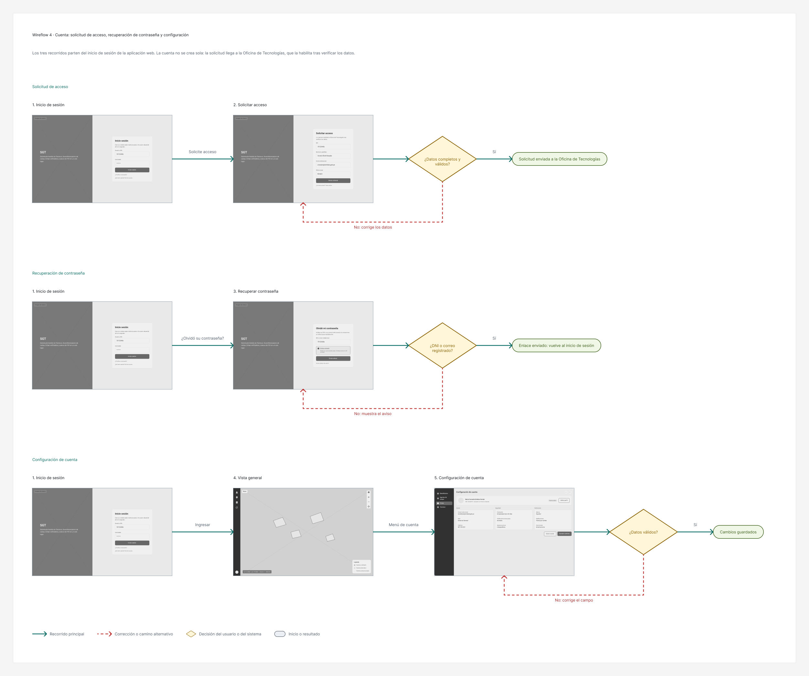
  <figcaption style="font-size: 0.9em; margin-top: 6px;">WF-06. Solicitud de acceso, recuperación de contraseña y configuración de la cuenta.</figcaption>
</figure>

Los tres wireflows web comparten las convenciones de los móviles, de modo que el lector compara ambas aplicaciones con la misma clave de lectura. Ninguna decisión deja al usuario sin salida: cada camino discontinuo regresa a la pantalla donde puede corregir o termina en un estado nombrado, como En revisión, Observada o Alterada, que el otro rol también ve.

# Conclusiones

## Conclusiones y recomendaciones

En el TB1 el equipo completó el levantamiento y el análisis de requisitos, y definió la arquitectura estratégica de SGT.

Resultados de avance TB1:
- Las entrevistas confirman el Problem Statement: los tres entrevistados trabajan con más de un sistema sin integración automática, y dos de tres trasladan la información campo por campo de forma manual.
- Los assumptions sobre los segmentos se sostienen: los tres condicionan la aprobación de un dato a poder rastrearlo hasta su acta de origen.
- Las entrevistas aportaron dos hallazgos nuevos: la unidad de medida es la principal fuente de errores en el origen del dato, y existe una restricción institucional sobre el uso de servicios en la nube.
- El Product Backlog reúne 10 User Stories agrupadas en 5 épicas, y el Capítulo IV documenta 7 architectural drivers y 2 constraints.

En el TP1 el equipo llevó el diseño de SGT a su nivel táctico y definió la experiencia de usuario de la aplicación web y de la aplicación móvil.

Resultados de avance TP1:
- El Capítulo V descompone SGT en siete bounded contexts: Beneficiarios, Directory, IdentityProvider, Monitoring, People, Planning y Plots. Cada uno se documenta por capas de dominio, interfaz, aplicación e infraestructura, junto con sus diagramas de componentes, de clases y de base de datos.
- El contexto Monitoring, que sigue las fichas de evaluación de cada beneficiario, toma las identidades de las personas desde People y consume el registro de tareas de Planning a través de una interfaz de dominio, de modo que el modelo de la ficha no conoce el protocolo con el que se comunica con POI.
- La guía de estilos reúne la marca, los colores, la tipografía, el espaciado y los componentes base compartidos por la web y la aplicación móvil Android, y define estándares propios para el mapa, las tablas, los modales y el envío del archivo de la estación total.
- La Information Architecture define cómo se organizan, se nombran, se recorren y se buscan los contenidos de la landing page y de las aplicaciones, e incluye los valores de SEO y metadatos de cada pieza.
- Las pantallas se diseñaron en tres niveles: wireframes y mock-ups de la landing page, y wireframes y seis wireflows de las aplicaciones web y móvil, con su recorrido principal y sus respuestas alternativas.
- Una decisión de alcance tomada en reunión de equipo ordenó el reparto entre plataformas: la aplicación móvil registra y envía como borrador la medición de la estación total, y la web valida los terrenos, y carga y valida las fichas.

# Bibliografía

Aguado-Riveros, U. I., Espinoza-Quispe, L. E., Santillán-Enciso, C. L., Silva-Infantes, M., Barrionuevo-Inca-Roca, Y. A., Astuñaupa-Flores, S. N., Poma-Lagos, L. A., Navarro-Véliz, J. A., & González-Prida, V. (2026). *Reducing administrative burden through simplification and document management in local governments: Evidence from a district-level public organization*. Societies, 16(3), 91. https://doi.org/10.3390/soc16030091

Burch, T. (2016, January 6). *Data is the crop: GNSS used by surveyors and farmers*. GPS World. https://www.gpsworld.com/data-is-the-crop-gnss-used-by-surveyors-and-farmers/

Cohn, M. (2004). *User stories applied: For agile software development*. Addison-Wesley.

Hick, W. E. (1952). On the rate of gain of information. *Quarterly Journal of Experimental Psychology, 4*(1), 11–26. https://doi.org/10.1080/17470215208416600

Hyperscience. (n.d.). *US public sector intelligent automation solutions*. Retrieved September 15, 2026, from https://www.hyperscience.ai/solutions/public-sector/

International Food Policy Research Institute. (2025, December 2). *Beyond the algorithm: The need for farmer participation and data justice in digital agricultural technology*. IFPRI Blog. https://www.ifpri.org/blog/beyond-the-algorithm-the-need-for-farmer-participation-and-data-justice-in-digital-agricultural-technology/

Nielsen, J. (1994, April 24). *10 usability heuristics for user interface design*. Nielsen Norman Group. https://www.nngroup.com/articles/ten-usability-heuristics/

OECD. (2026). *Digital governments at a turning point*. In *Digital Government Outlook 2026*. OECD Publishing. https://www.oecd.org/en/publications/digital-government-outlook_0496b2bc-en/full-report/digital-governments-at-a-turning-point_0491aad4.html

OpenG2P. (n.d.). *OpenG2P*. Retrieved September 15, 2026, from https://www.openg2p.org/

OpenSPP. (n.d.). *Farmer registry*. OpenSPP Documentation. Retrieved September 15, 2026, from https://docs.openspp.org/explanation/farmer_registry

The Canton Group. (2025, June 9). *Breaking down silos: Why government IT systems need interoperability for digital transformation*. https://cantongroup.com/insights/breaking-down-silos-why-government-it-systems-need-interoperability-digital-transformation

W3C. (2023, October 5). *Web content accessibility guidelines (WCAG) 2.2*. https://www.w3.org/TR/WCAG22/

World Bank. (2025, October 22). *A journey of a thousand miles begins with a single step: How Malawi's reform is just the beginning for smallholder farmers*. https://www.worldbank.org/en/news/feature/2025/10/21/how-malawi-s-reform-is-just-the-beginning-for-smallholder-farmers

# Anexos

## Videos de Exposiciones

Enlace privado del video de exposición de la entrega TB1, publicado en Microsoft Stream:

[Ver video](https://upcedupe-my.sharepoint.com/:v:/g/personal/u20221e247_upc_edu_pe/IQDRu_OunlHlTIQsxhO9AnutAZMCsDQV4js-u0hJOIRJ-OA?nav=eyJyZWZlcnJhbEluZm8iOnsicmVmZXJyYWxBcHAiOiJTdHJlYW1XZWJBcHAiLCJyZWZlcnJhbFZpZXciOiJTaGFyZURpYWxvZy1MaW5rIiwicmVmZXJyYWxBcHBQbGF0Zm9ybSI6IldlYiIsInJlZmVycmFsTW9kZSI6InZpZXcifX0%3D&e=zQXXxF)

Modelo archimate:

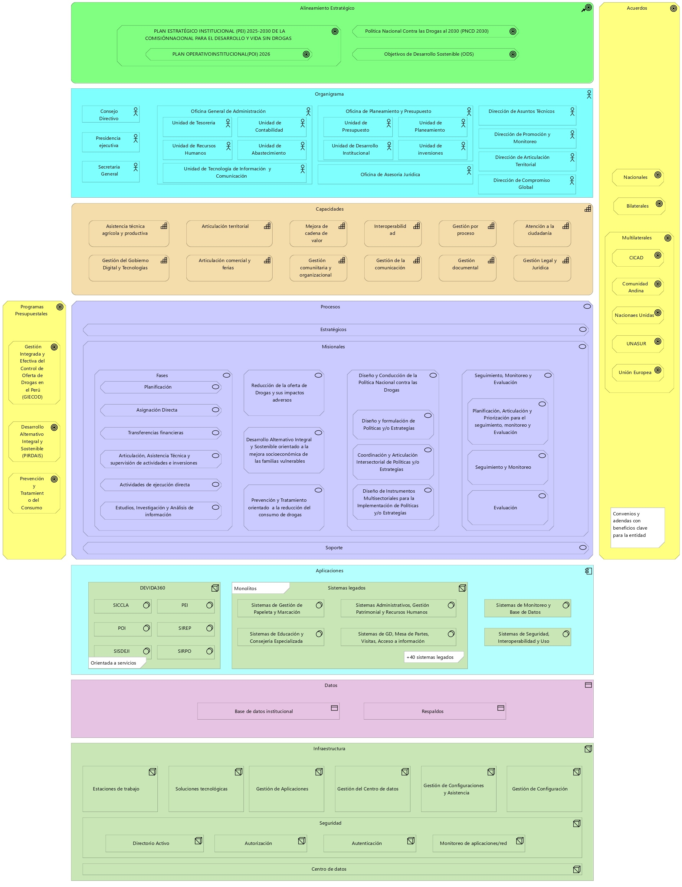

